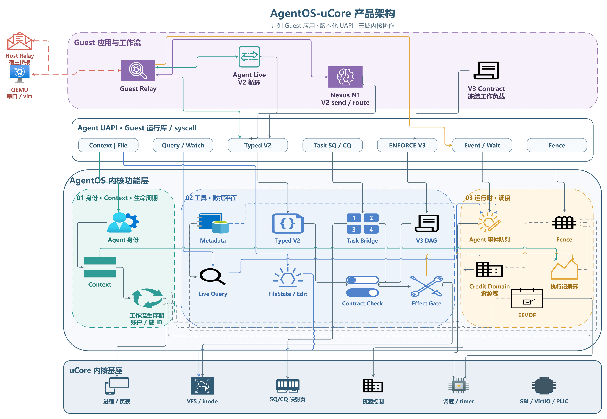

<p align="center">
  
</p>

# AgentOS-uCore：面向 AI Agent 的 uCore 内核扩展

## 一、基本信息

### 1.1 项目信息

| **项目** | **内容** |
| --- | --- |
| **比赛** | 2026 年全国大学生计算机系统能力大赛操作系统设计赛（全国）OS 功能挑战赛道 |
| **选题编号** | project61 |
| **赛题名称** | 面向 AI 智能体的操作系统内核（Agent-OS） |
| **作品名称** | AgentOS-uCore |
| **队伍名称** | happy-legend |
| **代码仓库** | [project3136859-388870](https://gitlab.eduxiji.net/T2026106149911107/project3136859-388870) |

### 1.2 摘要

**AgentOS-uCore 是构建在 RISC-V uCore 上的 Agent 操作系统功能模块。我们把 Agent 身份、Context、结构化工具、文件状态、事件循环、资源控制和 workflow 调度纳入内核，并通过版本化 ABI 支撑多轮 Agent 与多 Agent 协作应用。**

系统以 `{workflow id, generation}` 组织一次完整运行。受控创建入口为 Agent 分配 role、capability 与 VFS scope；Context 保存 cause、span、branch 和 provenance；执行合同把工具、前驱、输入指纹、deadline 与资源包络冻结为可检查的 DAG；Live Query 以文件 metadata 索引和 typed watch 驱动增量处理；Workflow Credit Domain 与 workflow EEVDF 管理跨进程资源和 CPU 服务量。上层的 Agent Live Console 与 Nexus workflow 将这些机制组合成可以在 QEMU RISC-V64 中运行的产品流程。

性能活动通过 30 次独立 QEMU 启动保存了 33 个原始输出文件、19 个 CSV 数据表和 7,498 行逐样本记录。96-record corpus 的 16 组 traversal/indexed 核心路径配对中，indexed 全部取得更短时延，中位配对加速比为 `3.118x`；504 次 workflow 从进入 runnable 到获得 dispatch 的等待均为 `0-1 tick`。

### 1.3 完成情况

| **赛题任务** | **完成情况** | **对应成果** |
| --- | :---: | --- |
| Agent 进程创建与地址空间设计 | **已完成** | 受控 Agent/workflow 创建、可信映像、role/capability/scope、7 页 Context 与 generation 生命周期 |
| Agent 与内核结构化交互 | **已完成** | 25 项工具目录、typed V2、ENFORCE V3、64-op compact batch、16 槽 Task SQ/CQ |
| Context 路径管理 | **已完成** | sequence、cause/span/branch、snapshot/detail/rollback、来源标签与活动路径校验 |
| 面向 Agent 查询优化的文件系统扩展 | **已完成** | 512-record catalog、`status/stage/kind` 索引、inode incarnation、typed watch、resync 与编辑租约 |
| Agent Loop 内核运行机制 | **已完成** | 事件队列、原子 wait/wakeup、可信 IPC、heartbeat、资源账户与 workflow EEVDF |
| 综合演示与创新 | **已完成** | Agent Live 多轮工具闭环、Nexus 四 Agent workflow、Plain/AgentOS 双目标对照与逐样本性能活动 |

### 1.4 主要创新

1. **统一的 workflow 内核生命周期。** Agent、Context、文件状态、watch、执行合同、Task Channel、资源账户和一致性切片共享 `{id, generation}`，创建、关闭与回收沿同一状态机推进。
2. **结构化工具与执行合同。** 内核在副作用发生前检查 typed schema、capability、DAG 前驱、attempt、deadline、输入 fingerprint、provenance 与资源额度，并让 scalar、batch 和 SQ/CQ 共用工具 owner 与提交顺序。
3. **Agent Live-Query FS。** 文件的业务状态与 VFS 物理身份同时进入内核 catalog，选择性索引缩小查询候选集，typed watch 以 `ENTER/UPDATE/LEAVE` 事件连接文件系统与 Agent Loop。
4. **Workflow Credit Domain 与 EEVDF。** 资源使用以 free、pending、used 三态结算；外层调度把 workflow 作为服务实体，按 eligible virtual deadline 分配跨进程 CPU 服务量。
5. **Context 来源传播与一致性切片。** 工具、文件和 IPC 输入形成可继续传播的来源标签；workflow fence 在运行中封存 Context 终态投影、执行记录、metadata generation 和资源摘要。

### 1.5 团队成员

| **成员** | **联系方式** | **项目工作** |
| --- | --- | --- |
| 王浩沣 | QQ 2091576055 | AgentOS-uCore 内核、应用、测试与文档 |
| 康俊豪 | QQ 488718235 | AgentOS-uCore 内核、应用、测试与文档 |

### 1.6 文档索引

- [AgentOS-uCore：面向 AI Agent 的 uCore 内核扩展](#agentos-ucore面向-ai-agent-的-ucore-内核扩展)
  - [一、基本信息](#一基本信息)
    - [1.1 项目信息](#11-项目信息)
    - [1.2 摘要](#12-摘要)
    - [1.3 完成情况](#13-完成情况)
    - [1.4 主要创新](#14-主要创新)
    - [1.5 团队成员](#15-团队成员)
    - [1.6 文档索引](#16-文档索引)
  - [二、项目概述](#二项目概述)
    - [2.1 背景与意义](#21-背景与意义)
    - [2.2 核心挑战](#22-核心挑战)
    - [2.3 总体架构](#23-总体架构)
    - [2.4 核心模块](#24-核心模块)
  - [三、系统设计与实现](#三系统设计与实现)
    - [3.1 身份、生命周期与 Context](#31-身份生命周期与-context)
    - [3.2 结构化工具与执行合同](#32-结构化工具与执行合同)
    - [3.3 Live Query 与文件事件](#33-live-query-与文件事件)
    - [3.4 事件、资源与 workflow 调度](#34-事件资源与-workflow-调度)
    - [3.5 Agent Live 与 Nexus](#35-agent-live-与-nexus)
  - [四、测试结果](#四测试结果)
    - [4.1 测试体系](#41-测试体系)
    - [4.2 Live Query 性能](#42-live-query-性能)
    - [4.3 Agent Task 延迟](#43-agent-task-延迟)
    - [4.4 Workflow EEVDF](#44-workflow-eevdf)
  - [五、总结与展望](#五总结与展望)
    - [5.1 工作总结](#51-工作总结)
    - [5.2 现有不足](#52-现有不足)
    - [5.3 后续工作](#53-后续工作)
  - [六、运行与文档](#六运行与文档)
    - [6.1 构建与回归](#61-构建与回归)
    - [6.2 文档体系](#62-文档体系)
    - [6.3 视频与 PPT](#63-视频与-ppt)
  - [七、参考说明与许可](#七参考说明与许可)
    - [7.1 基础项目与设计参考](#71-基础项目与设计参考)
    - [7.2 开源许可](#72-开源许可)
  - [八、项目目录索引](#八项目目录索引)

## 二、项目概述

### 2.1 背景与意义

传统操作系统以进程、地址空间、文件和系统调用作为主要抽象。一次 Agent workflow 还要持续维护执行者身份、多轮上下文、工具权限、输入来源、文件阶段、跨轮预算以及多个 Agent 之间的任务关系。应用层重复实现这些机制，会让身份、状态和资源分散在多套协议中，进程退出或 workflow 重启后的对象回收也难以统一。

uCore 已经提供进程、虚拟内存、VFS、IPC、调度器、时钟中断和 VirtIO。我们在这些基础能力上增加 AgentOS 功能模块，使内核能够识别一次 workflow 的成员和状态，在系统调用与 VFS 副作用前完成统一检查，并把文件变化、工具结果和协作消息交给同一个 Agent Loop。普通 uCore 程序继续沿用原有接口，Agent 程序通过新增 ABI 使用这些能力。

### 2.2 核心挑战

基于对赛题任务、Agent 工作流和 uCore 内核机制的分析，我们确定了以下技术实施路径：

1. **建立可回收的 Agent 身份。** Agent 需要 role、capability、scope 与 controller 关系，workflow 槽位复用后还要识别旧对象和迟到请求。
2. **保存可查询的多轮执行状态。** Context 要覆盖工具结果、文件来源和跨 Agent 消息，并在回滚、并发发布和固定容量窗口下保持一致。
3. **把工具副作用收进内核检查链。** 请求参数、权限、执行前驱、deadline、来源和资源额度需要在 owner 执行前完成校验，多个传输路径还要保持同一执行语义。
4. **让文件状态进入 Agent Loop。** 查询既要支持业务字段，也要跟随 inode 的创建、写入、截断、删除和复用，集合变化需要转换为稳定事件。
5. **管理跨进程 workflow 的资源与服务量。** 多 Agent 共享同一任务目标，资源结算、等待唤醒和 CPU 公平性应按 workflow 汇总并保持可观测。

### 2.3 总体架构

<p align="center">
  <a href="docs/figures/architecture/agentos_overview.pdf">
    
  </a>
</p>

AgentOS-uCore 自下而上分为四层：uCore 基础内核提供进程、内存、VFS、IPC、调度和设备 I/O；AgentOS 内核模块建立身份、Context、工具合同、Live Query、事件、资源和 workflow 调度；用户态 UAPI 与 Guest 运行库将这些能力组合为稳定调用；Agent Live、Nexus 和科研 workflow 负责目标分解、工具选择与阶段协作。

AgentOS 状态直接接入 uCore 对象生命周期。身份随进程创建和 `exec` 发布，Context 随地址空间建立，metadata 随 VFS 操作增量更新，workflow 调度状态随 enqueue、dispatch、sleep 和 tick 推进，退出路径回收订阅、队列、资源与 lifecycle 槽位。完整层次与接入点见[产品架构](docs/architecture.md)，原生图源见 [`agentos_overview.drawio`](docs/figures/architecture/agentos_overview.drawio)。

### 2.4 核心模块

| **模块** | **关键机制** | **产品能力** |
| --- | --- | --- |
| 身份与 Context | 可信映像、role/capability/scope、workflow generation、7 页 Context | 创建受控 Agent，维护 cause/span/branch 和来源关系 |
| 工具执行 | 25 项工具目录、V2/V3、compact batch、Task SQ/CQ | 在副作用前验证请求，并按任务形态选择传输路径 |
| Live Query | metadata catalog、三类等值索引、typed watch、generation resync | 按业务状态查询文件，以集合变化驱动增量处理 |
| Workflow 运行时 | 事件队列、可信 IPC、heartbeat、Credit Domain、workflow EEVDF | 休眠等待事件，按 workflow 管理资源与 CPU 服务量 |
| 一致性切片 | 执行记录、Context commit lane、workflow fence | 生成包含记录、metadata 与资源摘要的一致性 receipt |

模块设计分别见[身份与 Context](docs/modules/identity-context.md)、[结构化工具与执行合同](docs/modules/tool-execution.md)、[Agent Live-Query FS](docs/modules/live-query.md)和 [Workflow 运行时](docs/modules/workflow-runtime.md)。

## 三、系统设计与实现

### 3.1 身份、生命周期与 Context

workflow root 由可信 bootstrap 创建，内核为其分配新的 VFS scope、resource domain 和 lifecycle generation。同一 workflow 中具备 `AGENT_CAP_ORCHESTRATE` 的 Agent 可以通过受控入口创建 worker；worker 请求的 capability 必须非零，只能取 `AGENT_CAP_CONTENT_READ | AGENT_CAP_ARTIFACT_WRITE` 的子集，并同时属于调用者已有集合。目标映像还要通过 VFS 执行权限与可信策略检查。

```text
agent_workflow_create()
    -> SYS_agent_workflow_create
    -> sys_agent_workflow_create()
    -> agent_workflow_create_proc()
    -> fork_common(... PROC_ADMIT_WORKFLOW, VFS_SPAWN_SCOPE_FRESH)

agent_worker_create(image, capabilities)
    -> sys_agent_worker_create()
    -> namei_scope_status() + vfs_inode_authorize()
    -> agent_worker_create_proc()
    -> fork_common(... PROC_ADMIT_WORKER, VFS_SPAWN_SCOPE_DROP)
```

每个 Agent 映射 7 页 Context：前 6 页由内核发布，最后 1 页作为 Guest cache。record 保存 sequence、cause、span、branch、tool、status 与 provenance，容量固定为 128。snapshot 读取通过 publish sequence 检查并发一致性；rollback 移动活动 branch head；工具、文件和 IPC 路径在同一 Context lane 内提交结果。

实现代码见 [`os/proc.c`](os/proc.c)、[`os/agent_identity.c`](os/agent_identity.c)、[`os/workflow_lifecycle.c`](os/workflow_lifecycle.c)、[`os/agent_context.c`](os/agent_context.c)、[`os/agent_context_path.c`](os/agent_context_path.c) 和 [`os/agent_provenance.c`](os/agent_provenance.c)。

### 3.2 结构化工具与执行合同

工具目录为每个 tool 声明 name/id、typed 参数 schema、required capability 和 side-effect mask。V2 request 最多包含 8 个参数；V3 在 V2 前缀上增加 contract key、node、attempt、schema digest、input fingerprint、source Context 与 artifact 类型。执行合同最多包含 24 个节点，每个节点最多接受 4 次 attempt。

```text
tool_call_v3()
    -> SYS_tool_call
    -> sys_tool_call_v3()
    -> copyin 与版本/长度检查
    -> Agent 身份与 lifecycle binding 检查
    -> agent_tool_protocol_resolve() + agent_tool_protocol_decode_v2()
    -> workflow_lifecycle_operation_enter()
    -> agent_execute_one()
    -> contract / capability / provenance / phase credit / effect gate
    -> Context、执行记录与 response 提交
```

紧凑 batch 一次同步提交最多 64 项操作。Task Channel 使用 16 槽 SQ/CQ：SQ、CQ 两页映射给 Guest，内核另持 request 与 resource 两页私有状态。request id、channel/ring generation 与 slot generation 共同识别队列复用；每个 accepted target 只产生一个 terminal CQE，cancel command 本身不产生第二个 CQE，当前测试固定 retained-terminal 幂等取消和 hard deadline。CQ 满时暂停 flush，协议故障则进入 sticky resync，由新 generation 和显式 reset 恢复。四种接口最终进入同一工具 owner，避免传输方式改变工具语义。

实现代码见 [`os/agent_core.c`](os/agent_core.c)、[`os/agent_tool_protocol.c`](os/agent_tool_protocol.c)、[`os/agent_execution_contract.c`](os/agent_execution_contract.c)、[`os/agent_task_channel.c`](os/agent_task_channel.c) 和 [`os/agent_task_bridge.c`](os/agent_task_bridge.c)。公开结构见 [`include/agent_tool_abi.h`](include/agent_tool_abi.h)、[`include/agent_execution_contract_abi.h`](include/agent_execution_contract_abi.h) 与 [`include/agent_task_channel_abi.h`](include/agent_task_channel_abi.h)。

### 3.3 Live Query 与文件事件

Agent 通过 `agent_file_meta_set()` 登记文件的 project、workflow、run、stage、kind、status 和 summary。记录同时保存 `dev + inum + incarnation`，inode 复用时新的 incarnation 会隔离旧 metadata、content receipt 与 edit lease。Catalog 为 `status`、`stage` 和 `kind` 维护等值索引，索引筛选后继续复核完整谓词、scope、lifecycle 和 catalog generation。

```text
agent_file_query(query, result)
    -> sys_agent_file_query()
    -> lifecycle operation gate + META_READ
    -> agent_file_query_internal()
    -> agent_metadata_query_execute_snapshot()
    -> planner 选择 traversal 或 index
    -> 逐候选复核谓词并返回 generation、plan 与工作量

VFS metadata/write/truncate/unlink
    -> typed watch 集合前后对比
    -> ENTER / UPDATE / LEAVE / RESYNC_REQUIRED
    -> Agent event queue
    -> agent_wait()
```

`agent_wait()` 在同一关中断窗口内完成队列谓词复查与 waiter 发布，关闭检查空队列到真正睡眠之间的 lost wakeup 窗口。队列缺口或增量投递失败会触发 resync。Agent 保留旧 watch，先安装同一 query 的替代 watch，再取得未截断的有界 snapshot；随后 ACK 并移除旧 watch，使替代 watch 覆盖整个切换窗口。单次查询最多返回 8 个 hit，结果被截断时保持 resync，等待收紧 query 或分页能力。

实现代码见 [`os/agent_metadata_catalog.c`](os/agent_metadata_catalog.c)、[`os/agent_metadata_query.c`](os/agent_metadata_query.c)、[`os/agent_metadata_objects.c`](os/agent_metadata_objects.c)、[`os/agent_live_query_events.c`](os/agent_live_query_events.c)、[`os/agent_metadata_actions.c`](os/agent_metadata_actions.c) 和 [`os/agent_ipc.c`](os/agent_ipc.c)。

### 3.4 事件、资源与 workflow 调度

每个 Agent 的事件队列包含 16 个槽位，并为控制事件与来源类别保留容量。跨 Agent `MESSAGE` 和 `LLM_DONE` 检查显式 route、完整 lifecycle、source capability、target generation 与 correlation。heartbeat、deadline、文件变化和策略拒绝通过同一等待接口进入 Agent Loop。

Workflow Credit Domain 用 free、pending、used 三态管理 process、thread、file object、filesystem block、inode、buffer cache、Agent state page 和 physical page。对象创建时 credit 从 free 进入 pending，发布后转为 used，失败路径退回 free，销毁完成后再返还 free。Tool Phase Credit Lease 从 workflow 额度中锁定一次工具运行需要的短期资源。

workflow EEVDF 把一次 workflow 作为外层调度实体。latency class 与 wall deadline 决定 service request，睡眠衰减调整 vruntime，调度器从 eligible 集合中选择 virtual deadline 最早的 workflow；同一 workflow 的多个成员共享 service-cycle 账户，实体内部继续使用 uCore 的线程选择策略。

```text
event enqueue -> wait queue wakeup -> process runnable
    -> workflow_scheduler_on_enqueue()
    -> workflow_scheduler_select()
    -> workflow_scheduler_on_dispatch()
    -> workflow_scheduler_charge()
    -> sleep/dequeue 时更新 vruntime 与 eligibility
```

实现代码见 [`os/agent_ipc.c`](os/agent_ipc.c)、[`os/agent_background.c`](os/agent_background.c)、[`os/workflow_credit_domain.c`](os/workflow_credit_domain.c)、[`os/resource_controller.c`](os/resource_controller.c)、[`os/workflow_scheduler.c`](os/workflow_scheduler.c) 和 [`os/proc.c`](os/proc.c)。

### 3.5 Agent Live 与 Nexus

`agentlive_ucore` 运行长驻 Agent Loop。Guest 维护 turn、correlation、工具目录、Context 和审批状态；Host relay 负责串口 frame、TLS 与模型服务 JSON。回放与真实模型沿用同一串口协议，便于在固定输入下检查多轮工具闭环。

`agentnexus_ucore` 在同一 workflow 中创建 Coordinator、System、Research 和 Analyst 四个身份。Coordinator 建立任务并委派，worker 通过内核 `MESSAGE` 与 workflow-scoped artifact 传递结果，失败节点触发重规划，Analyst 汇总最终工件。核心应用代码位于 [`user/src/agentlive_ucore.c`](user/src/agentlive_ucore.c)、[`user/src/agentnexus_ucore.c`](user/src/agentnexus_ucore.c) 和 [`user/lib/agent_nexus.c`](user/lib/agent_nexus.c)，Host 接入位于 [`host_tools/agentos_console.py`](host_tools/agentos_console.py) 与 [`host_tools/agentos_relayd.py`](host_tools/agentos_relayd.py)。

## 四、测试结果

### 4.1 测试体系

AgentOS-uCore 从 ABI、Host 状态机、RISC-V64 Guest、长驻应用和双目标系统对照五个层次验证产品路径。

| **层次** | **入口** | **覆盖内容** |
| --- | --- | --- |
| ABI 与模块契约 | `agent-uapi-check`、`agent-module-check` | syscall 号、结构大小与 offset、模块依赖、状态机接线 |
| Host 自测 | `local-host-selftests` | Context、合同、资源、查询、调度、串口协议与校验器 |
| QEMU Guest | `agentos-test` | 身份、VFS、工具、事件、调度、内存、故障与 lifecycle |
| 长驻应用 | Console/Nexus replay | 多轮工具、审批、委派、重规划、工件与会话关闭 |
| 系统对照 | `dual-platform-run` | Plain uCore 与 AgentOS-uCore 的业务结果和端到端耗时 |

一次性性能活动运行于 WSL2 Host、QEMU RISC-V64 `virt` 单 Hart，Guest 使用 `riscv64-linux-gnu-gcc 15.2.0`，QEMU 版本为 `10.2.1`。30 次独立启动覆盖 Live Query、Agent Task 和 workflow EEVDF，采集 manifest、校验结果、原始串口输出与逐样本 CSV 均保存在 [`one_shot_metrics/data/20260811`](one_shot_metrics/data/20260811/)。测试入口与故障矩阵见[测试文档](docs/testing.md)。

### 4.2 Live Query 性能

同一 96-record corpus 的 16 组 AB/BA 配对中，traversal 每次检查 97 条记录，indexed 检查 2 条。workflow core 计时覆盖 query、recovery write、`fsync` 和结果复核。

| **指标** | **Traversal** | **Indexed** | **配对结果** |
| --- | ---: | ---: | ---: |
| Core duration 中位数 | 34,712.5 us | 13,293.5 us | 16/16 次 indexed 更快 |
| `indexed - traversal` 中位数 | - | - | -23,441.5 us |
| `traversal / indexed` 中位数 | - | - | 3.118x |
| End-to-end 中位数 | 711,283.5 us | 723,928.0 us | 配对差值 +13,452 us |
| Indexed 更快的 end-to-end 配对 | - | - | 3/16 |

<p align="center">
  <a href="docs/figures/performance/01_paired_core_performance.pdf">
    
  </a>
</p>

Catalog 参数网格覆盖 size `24/64/96` 与 hit count `1/2/4/8`，每个单元保留 15 个内部配对。12 个单元的中位加速比为 `1.164x-2.808x`；ready index 在三种 catalog size 下的中位时延约为 `98.3/100.5/108.3 us/query`。

<p align="center">
  <a href="docs/figures/performance/02_catalog_speedup_landscape.pdf">
    
  </a>
</p>

### 4.3 Agent Task 延迟

每条 sequence 包含 16 个等价 ECHO 操作。4 次独立启动各运行 8 轮，Batch、Scalar V3 和 SQ/CQ 分别得到 32 个 sequence 样本及对应逐操作记录。

| **路径** | **样本数** | **中位数** | **IQR** |
| --- | ---: | ---: | ---: |
| Batch | 32 | 561.0 us | 533.75-663.0 us |
| Scalar V3 | 32 | 2,051.0 us | 1,833.0-2,226.0 us |
| SQ/CQ | 32 | 1,620.5 us | 1,472.0-1,755.5 us |

<p align="center">
  <a href="docs/figures/performance/04_task_latency_distributions.pdf">
    
  </a>
</p>

当前同步 ECHO 负载中，Batch 合并顺序操作后取得最低 sequence 中位时延；SQ/CQ 使用共享队列与 terminal CQE，Scalar V3 为每项保留完整合同检查。

### 4.4 Workflow EEVDF

6 次独立启动记录 504 条 exact wake probe，其中 425 条为 0 tick、79 条为 1 tick。并发度 1 至 4 下，按各 workflow `service_cycles` 计算的 Jain fairness 中位数分别为 `1.000000/0.999985/0.999993/0.999985`。

<p align="center">
  <a href="docs/figures/performance/05_eevdf_latency_fairness.pdf">
    
  </a>
</p>

完整实验设计、配对统计、归一化内核工作量和逐样本入口见[性能测试](docs/performance.md)。

## 五、总结与展望

### 5.1 工作总结

我们在 uCore 内核中完成了从 Agent 身份到多 Agent workflow 的完整功能链。身份与 lifecycle 统一管理成员和对象；Context 与 provenance 保存多轮因果；工具协议与执行合同约束副作用；Live Query 将文件状态接入事件循环；资源账户与 workflow EEVDF 管理跨进程服务；Agent Live 和 Nexus 验证这些机制可以组合为持续运行的应用。

系统同时保留稳定 ABI、细粒度 Guest 测试、Host 状态机测试、故障注入、Plain/AgentOS 双目标对照和一次性逐样本性能活动，使模块实现、调用入口和测量数据能够相互对应。

### 5.2 现有不足

Task Channel 的内核 bridge 目前同步处理 `null` input，完成结果的 artifact 类型为 `NONE`，typed resource 还可以继续覆盖更多真实工具输入。RISC-V64 Guest 使用单 Hart，workflow EEVDF 的实测并发度覆盖 1 至 4；多 Hart 下的实体迁移与并行记账仍需验证。Live Query catalog 容量为 512，单次 query 最多返回 8 个 hit，大规模目录还需要分页结果与复合索引策略。

### 5.3 后续工作

后续迭代将围绕三条主线展开：扩展 Task Channel 的异步工具 bridge 与 typed resource 类型；提高 Live Query 在更大 catalog、更多索引组合和多核环境下的并行处理能力；继续完善 workflow 调度中的 latency class、deadline 和资源压力协同。应用侧将增加更多 Nexus 角色编排模板和长时间真实模型运行测试，并把新的负载继续纳入逐样本采集与复现流程。

## 六、运行与文档

### 6.1 构建与回归

Linux 或 WSL 环境需要 Bash、Git、GNU Make、Host C 编译器、Python 3、QEMU RISC-V 和 RISC-V GNU toolchain。Ubuntu 的交叉工具链通常使用 `riscv64-linux-gnu-` 前缀。

```bash
make doctor
make agentos-build TOOLPREFIX=riscv64-linux-gnu-
make agentos-test TOOLPREFIX=riscv64-linux-gnu-
```

确定性 Agent Live 与 Nexus 回放会启动真实 QEMU Guest，并沿产品串口协议完成多轮交互：

```bash
make agentos-console-replay TOOLPREFIX=riscv64-linux-gnu-
make agentos-nexus-replay TOOLPREFIX=riscv64-linux-gnu-
```

交互 Console、真实模型、Nexus、多目标运行和单项测试方法见[运行指南](docs/usage.md)。

### 6.2 文档体系

| **文档** | **主要内容** |
| --- | --- |
| [决赛文档](决赛文档.pdf) | AgentOS-uCore 的完整设计、实现与测试文档 |
| [产品架构](docs/architecture.md) | uCore 基础、AgentOS 内核模块、UAPI 与运行主线 |
| [系统调用与 ABI](docs/api.md) | 系统调用、版本化结构、状态码与调用顺序 |
| [安全机制](docs/security.md) | 身份、scope、generation、执行合同、来源与资源检查 |
| [运行指南](docs/usage.md) | 环境、构建、QEMU、Console、Nexus 与双目标运行 |
| [测试体系](docs/testing.md) | 静态契约、Guest 回归、故障测试、回放和复现入口 |
| [性能测试](docs/performance.md) | 实验设计、统计结果、图表与逐样本数据 |
| [身份与 Context](docs/modules/identity-context.md) | Agent 身份、workflow lifecycle、Context path 与 provenance |
| [结构化工具与执行合同](docs/modules/tool-execution.md) | 工具目录、V2/V3、batch、Task Channel 与 phase lease |
| [Agent Live-Query FS](docs/modules/live-query.md) | metadata catalog、索引、typed watch、resync 与编辑租约 |
| [Workflow 运行时](docs/modules/workflow-runtime.md) | 事件、IPC、资源、EEVDF、执行记录与 workflow fence |

### 6.3 视频与 PPT

| **材料** | **下载入口** |
| --- | --- |
| AgentOS 项目介绍视频 | [百度网盘](https://pan.baidu.com/s/1JQKpght9NQuLC5d4VH_9ZQ?pwd=agos)，提取码 `agos` |
| AgentOS-uCore 展示幻灯片 | [百度网盘](https://pan.baidu.com/s/1odSO5Z_3zVGITqAJRSzdgQ?pwd=8s7c)，提取码 `8s7c` |
| 仓库内链接记录 | [项目介绍视频和ppt网盘链接.txt](项目介绍视频和ppt网盘链接.txt) |

## 七、参考说明与许可

### 7.1 基础项目与设计参考

AgentOS-uCore 基于 LearningOS 的 [uCore-Tutorial-Code-2025S](https://github.com/LearningOS/uCore-Tutorial-Code-2025S) 与 [uCore-Tutorial-Test-2025S](https://github.com/LearningOS/uCore-Tutorial-Test-2025S) 开发。系统设计还参考了 Linux EEVDF 与 wait queue、Haiku BFS 属性和 Live Query、BPF ring buffer、io_uring SQ/CQ、WebAssembly Component Model、MCP 与 A2A 等公开设计和协议。来源、用途与链接汇总见 [`NOTICE`](NOTICE)。

### 7.2 开源许可

仓库源代码采用 [GNU General Public License v3.0](LICENSE)。技术文档、架构说明和展示材料采用 [Creative Commons Attribution-ShareAlike 4.0 International](LICENSE-DOCS)。各上游项目及外部材料继续遵循其原有许可与声明。

## 八、项目目录索引

```bash
.
├── baseline_ucore/          # Plain uCore 双目标对照实现
├── ci/                      # 回放数据、ABI 冻结清单与验收配置
├── docs/                    # 产品文档、模块说明、架构图与性能图
├── host_tools/              # Console、模型中继、观察器与 Host 校验器
├── include/                 # Kernel/User 共享 ABI 与资源策略头文件
├── nfs/                     # uCore 文件系统镜像生成工具
├── one_shot_metrics/        # 一次性性能负载、原始数据、表格与图表
├── os/                      # uCore 基础内核与 AgentOS 功能模块
├── scripts/                 # 构建检查、Guest runner 与故障测试脚本
├── user/                    # Guest 运行库、Agent 应用与产品测试
├── 决赛文档.pdf             # 决赛完整产品文档
├── 项目介绍视频和ppt网盘链接.txt # 视频与答辩材料入口
├── LICENSE                  # GPL-3.0 源码许可
├── LICENSE-DOCS             # CC BY-SA 4.0 文档许可
├── Makefile                 # 构建、运行、测试与双目标入口
├── NOTICE                   # 上游来源与设计参考说明
└── README.md                # 项目总览与文档索引
```
