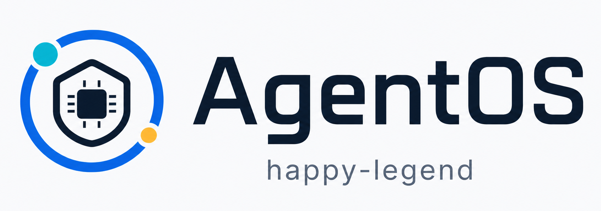

<p align="center">
  
</p>

# AgentOS-uCore

AgentOS-uCore 是面向 AI Agent workflow 的 RISC-V uCore 内核扩展，也是计算机操作系统能力竞赛系统功能实现赛道作品。项目把 Agent 身份、Context Path、声明式执行合同、结构化/异步工具调用、provenance 数据流边界、workflow 资源与调度、实时文件查询和可验证 fence 放入内核；语义规划、LLM、MCP/A2A 远程协议和科研 Agent 平台仍在用户态。

## 评审入口

- [竞赛评审入口](docs/contest/README.md)：赛题映射、演示顺序和材料边界。
- [系统设计](docs/agentos/design.md)：当前内核架构与关键不变量。
- [合同与 Task Channel](docs/agentos/task6-execution-contract.md)：24-node contract、Phase Lease、workflow EEVDF、Provenance 与 MCP/A2A 映射。
- [ABI 参考](docs/agentos/api.md)：用户接口、兼容项和错误语义。
- [要求追踪](docs/agentos/requirements-traceability.md)：任务到源码与验证入口的映射。
- [验证说明](docs/verification.md)：构建、功能、安全与性能测试入口。

项目以实际构建、QEMU Guest 行为和可重复的性能负载判断产品状态。测试输出用于定位问题和复核结果，不再叠加与产品行为无关的发布门。

## 当前核心设计

| 机制 | 当前实现 |
| --- | --- |
| Agent Workflow Credit Domain | 每个资源账户维护 `used/pending/free`（U/P/F）credit。补充额度时批量预充，普通 commit/cancel/release 只在本地三态间移动；额度不足、资源压力、context switch、账户推进或 workflow fence 才 trim/汇总。全局硬容量和账户硬限额始终按 `U+P+F` 验证。 |
| Fence-Sealed Evidence Ring | 每个 workflow 按需计费 4 页，普通区 48 槽、关键区 16 槽。普通成功 Context 只写一次 canonical ring 记录；拒绝或有授权效果的关键记录同时保留兼容 ledger 投影。fence 把有序事件、gap、challenge、metadata generation 和 credit digest 密封为 SHA-256 根。 |
| Agent Live-Query FS | 只有显式 `agent_file_meta_set()` 的记录进入内存 catalog 和 `status/stage/kind` 选择性索引。typed watch 根据谓词变化产生 `ENTER/UPDATE/LEAVE`，队列不足或增量丢失时产生带 generation 的 `RESYNC_REQUIRED`。不扫描普通目录，不写 metadata catalog 磁盘快照，也不提供 crash catalog recovery。 |
| 收敛 lifecycle | workflow 以不可变 `id + generation` 标识，核心状态是 `member_refcount + closing`。operation、departure 和 fence gate 阻止新旧操作穿越 cut；最后成员离开后才允许回收资源域。不存在对外宣称的多阶段 retirement workflow。 |
| Declarative Execution Contract | 每个 lifecycle generation 最多冻结一份 24-node DAG。节点声明 tool/schema、合法前驱、capability/provenance/effect、artifact、deadline、retry/cancel 和 exec/storage envelope；V3 工具调用必须引用合同节点与精确 predecessor Context。内核只验证结构，不理解自然语言。 |
| Tool Phase Credit Lease | 工具开始前从 workflow 已计入 U 的 exec/storage credit 原子锁定 envelope；分配 claim 带 nonce，失败 refund，未用量在完成/失败/取消/超时结算为 F。lease 不增加 `U+P+F` 硬额度。 |
| Workflow EEVDF | 以 workflow resource domain 而不是线程作为公平实体；lag 决定 eligibility，latency/event deadline 形成 virtual deadline，按实际 service cycles 记账，异常时回退旧 scheduler。当前同时跟踪的总上限为 4，由 1 个 `BOOT_SEALED` bootstrap participant 和最多 3 个 fresh workflow 组成。 |
| Context Provenance Security | Context、文件/工具输出和 IPC 使用六个固定来源标签。外部副作用同时检查完整 lifecycle、冻结 contract edge、schema、capability、manifest provenance/effect；非法调用在副作用前 `DENIED` 并进入 critical Evidence。 |
| Typed Agent Task Channel | 按需计费 4 页：16 槽 SQ、16 槽 CQ 和两个私有页。single issuer，完整 128-byte SQE copy-before-validate，sticky resync，每个 accepted target 只发布一个 terminal CQE。typed handle ABI/8-slot 私有表已实现，但当前 provider 仅支持 null payload，`RESOURCE_IMPORT` fail closed。 |
| MCP/A2A User Gateway | 用户态将 MCP `2026-07-28` 与 A2A v1 对象映射到确定性 transport dataclass/in-memory binding；JSON、HTTP、OAuth、JWS 和远程状态不进入内核，当前尚无到内核 SQ/CQ 的 binary adapter。 |

## 语义边界

- Workflow fence 返回 320 字节 receipt，绑定 request id、challenge、fence sequence、精确 credit 使用量、metadata generation、事件范围、gap 数和前后根。`PARTIAL_COVERAGE` 是显式标志：当前根覆盖 Evidence Ring 的规范事件，不声称覆盖整个文件系统或所有调度事实。
- `CREDIT_EXACT` 表示 fence gate 内已 trim exec/storage 账户，`pending == 0`，receipt 的 `resource_used[]` 是该 cut 的精确 U 值。它不表示资源数据本身持久化。
- `EVIDENCE_SEALED` 表示 challenge-bound 内存证据根已经发布；不是磁盘 durable receipt，也不证明掉电恢复。
- `METADATA_VOLATILE` 明确表示 metadata generation 属于当前启动周期的内存 catalog。
- audit、timeline、provenance 和 ledger API 仍作为兼容读取视图存在。普通成功 Context 的 canonical 存储来自 Evidence Ring；关键记录或 ring 写入失败时才走受保护的兼容 ledger 路径。因此不能把兼容视图描述为完全删除。
- `AGENT_FILE_META_F_PERSIST` 与 `AGENT_FILE_META_F_AUTOSCAN` 只为源码/ABI 兼容保留，当前显式 metadata 写入若携带这些标志会返回 `AGENT_STATUS_BAD_PARAM`。
- observe recovery syscall 号仍被保留以避免编号复用，但内核固定返回 `AGENT_STATUS_BAD_PARAM`；不存在可枚举、读取或 reap 的 observation crash-recovery catalog。
- scalar V2 tool call 与 `agent_run()` batch 保留。V3 保留 V2 ABI 前缀并追加 frozen contract binding；lifecycle info V3 也保留 64 字节 V2 前缀。
- provenance 标签只表达固定来源并保守传播，不表示内核理解文本或判断 prompt injection。安全主张是计划外副作用不能越过结构化合同/capability/dataflow gate。
- Task Channel 的 exactly-once 只表示每个 accepted target 有一个 terminal CQE，不表示任意远程工具具备分布式 exactly-once；timer 只标记/唤醒，hard deadline 到第一个可调度 safe point 才结算，不提供 wall-clock completion bound。
- EEVDF 评价中的 1-way 只验证单实体 fast path；4-way 满容量 cohort 是同一个 `BOOT_SEALED` bootstrap participant 加 3 个 fresh workflow，不是 4 个 fresh lifecycle。线程放大场景比较 1 个 fresh 4-thread workflow 与 2 个 fresh single-thread workflow，并保留 bootstrap peer。
- 16 是逻辑样本数：四波都复用同一个 bootstrap participant 一次，并各创建 3 个 fresh workflow，因此合计为 4 次 bootstrap 观测和 12 个 fresh lifecycle 样本；它既不是 16-way 并发，也不是每波 4 个 fresh workflow，更不表示 16 个独立 lifecycle。唤醒直方图及其 p50/p99 聚合只覆盖 fresh-agent 样本。
- typed handle 参考 WIT owned/borrowed 词汇，但当前没有 payload import/result backend，也不嵌入完整 Wasm/WASI runtime。MCP/A2A gateway 当前是 transport-neutral in-memory 用户态映射，不是内核 JSON/HTTP server 或已接通的 SQ/CQ adapter。

## 赛题任务映射

| 任务 | 主要实现 |
| --- | --- |
| Agent 进程与地址空间 | 可信映像、角色/capability、Context 映射、不可变 workflow generation、closing/member/gate 生命周期。 |
| 结构化工具调用 | name/id 目录、typed KV、24-node frozen contract、V2/V3/batch、Phase Lease 和异步 SQ/CQ。 |
| Context Path | 内核可信记录、只读 mirror、查询/快照/分支/因果字段、六标签 provenance 与 critical denial evidence。 |
| 文件属性查询 | 显式 volatile metadata、选择性内存索引、inode incarnation、内容摘要、typed live query。 |
| Agent Loop | 有界事件队列、watch/wait、heartbeat、可信 IPC、workflow EEVDF 和 exactly-one terminal Task completion。 |
| 综合应用 | plain/AgentOS 同科研合同，用户态 MCP 2026-07-28/A2A v1 gateway；功能与性能由实际双目标运行验证。 |

`baseline_ucore/` 是共享通用修复但不包含 AgentOS 子系统的对照目标，不是未经修改的上游镜像。双目标总耗时用于端到端比较；单项内核机制归因需要同内核消融或专项计数。

## 快速构建

Windows 首次检查：

```powershell
.\scripts\check-windows-prereqs.ps1
```

在配置好的 Linux、WSL 或项目工具链环境中：

```bash
make doctor
make build TOOLPREFIX=riscv-none-elf-
make agent-module-check TOOLPREFIX=riscv-none-elf-
make kernel-stack-check TOOLPREFIX=riscv-none-elf-
```

核心机制的 Host 模型/变异测试：

```bash
python -B scripts/test-workflow-credit-domain.py
python -B scripts/test-workflow-fence.py
python -B scripts/test-workflow-syscall-cut.py
python -B scripts/test-agent-evidence-ring.py
python -B scripts/test-agent-live-query-fs.py
python -B scripts/test-agent-execution-contract.py
python -B scripts/test-agent-task-channel.py
python -B host_tools/test_workflow_scheduler_model.py
python -B host_tools/test_agent_task_transport.py
python -B host_tools/test_mcp_a2a_gateway.py
```

需要 Guest 行为时再运行：

```bash
make agentos-test TOOLPREFIX=riscv-none-elf-
make dual-platform-run TOOLPREFIX=riscv-none-elf-
```

也可以直接运行最相关的产品场景，缩短修改后的反馈时间：

```bash
AGENT_TEST_CASE=agentsecurity_ucore make agentos-test TOOLPREFIX=riscv-none-elf-
AGENT_TEST_CASE=agenttask_ucore make agentos-test TOOLPREFIX=riscv-none-elf-
AGENT_TEST_CASE=agent_eevdf_ucore make agentos-test TOOLPREFIX=riscv-none-elf-
```

这里的 `Evidence Ring` 是内核产品的运行期安全审计能力；它与已经移除的 Host 发布证据包没有关系。详细测试选择见 [验证说明](docs/verification.md)。

## 仓库结构

```text
os/                AgentOS-uCore 内核
user/              用户库、专项程序和科研平台负载
baseline_ucore/    不含 AgentOS 服务的共享安全基底对照
scripts/           构建、静态合同、QEMU 与回归工具
host_tools/        产品模型、双目标状态比较与性能结果解析
ci/                UAPI、安全边界与测试配置
docs/              设计、ABI、验证和竞赛材料
```

## 来源与许可

项目基于 LearningOS/uCore 教学内核扩展。源码采用 [GPL-3.0](LICENSE)，文档采用 [CC-BY-SA-4.0](DOCUMENTATION_LICENSE.md)。Linux CPU accounting/percpu/rstat、BPF ring buffer、Haiku BFS、Linux EEVDF、io_uring、WIT/WASI 0.3、AgentCgroup、Murakkab、CaMeL、IPIGuard 以及 MCP/A2A 官方协议仅作为公开设计/协议思想来源；本仓库采用 clean-room 的项目特定实现，没有 vendoring 它们的源码、SDK、测试数据、二进制或磁盘格式。完整披露见 [NOTICE](NOTICE)、[合同架构附录](docs/agentos/task6-execution-contract.md) 与[第三方及原创增量说明](docs/contest/third-party-and-originality.md)。
