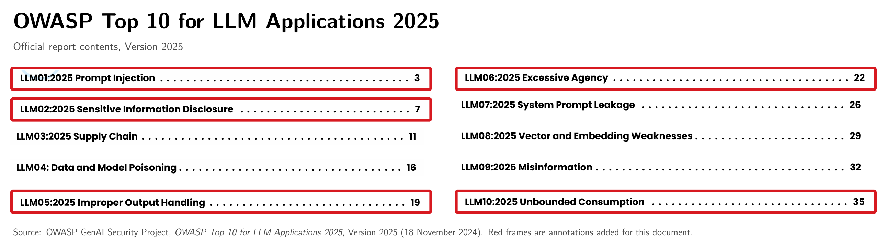

<p align="center">
  
</p>

# 面向 AI 智能体的操作系统内核

## 一、基本信息

### 1.1 项目信息

| **项目** | **内容** |
| --- | --- |
| **比赛** | 2026 年全国大学生计算机系统能力大赛操作系统设计赛（全国）OS 功能挑战赛道 |
| **选题编号** | project61 |
| **赛题名称** | 面向 AI Agent 的操作系统内核（Agent-OS） |
| **作品名称** | 面向 AI 智能体的操作系统内核 |
| **队伍名称** | happy-legend |
| **指导老师** | 余盛季、郭力维 |
| **代码仓库** | [project3136859-388870](https://gitlab.eduxiji.net/T2026106149911107/project3136859-388870) |

### 1.2 摘要

**AgentOS-uCore 是一组面向 AI Agent（智能体）的操作系统内核功能。我们在进程、文件系统、等待队列和调度器中加入 Agent 身份、Context（运行上下文）、Structured Tool（结构化工具）、文件状态、事件处理、资源管理和工作流调度。上层程序可以直接使用这些内核能力组织多轮任务和多 Agent 协作。**

[LearningOS/uCore](https://github.com/LearningOS/uCore-Tutorial-Code-2025S) 是 LearningOS 社区维护的 C 语言教学内核，覆盖进程、虚拟内存、文件系统和系统调用等操作系统主路径。[uCore-Tutorial-Test-2025S](https://github.com/LearningOS/uCore-Tutorial-Test-2025S) 提供配套测试；本项目直接扩展其进程、页表、VFS、系统调用和调度对象。

[RISC-V](https://docs.riscv.org/reference/isa/v20260120/unpriv/intro.html) 是开放且模块化的指令集架构，基础整数指令集可以与标准扩展组合，RV64 的通用寄存器宽度为 64 位。本项目把内核与 Guest 编译为 RV64 镜像，使进程创建、异常处理、页表切换和系统调用沿目标架构的执行路径运行。

按照赛题要求，本项目在 QEMU RISC-V64 `virt` 机型中启动内核与 Guest，通过串口与 Host 交互，并在相同配置下复现冷启动、故障路径和性能测试。

内核用生命周期键 `{id, generation}` 区分每次运行。创建 Agent 时，系统会分配角色、能力位和文件访问范围。Context 记录每一步的起因、调用跨度、分支和 provenance（来源追溯）。Execution Contract 列出工具、前置任务、输入指纹、截止时间和资源上限。Live Query 借助 Metadata Catalog 与 Typed Watch，及时报告文件集合变化。Workflow Credit Domain 和工作流调度器分别管理跨进程资源与 CPU 时间。Agent Live 控制台和 Nexus 把这些功能组合成可在 QEMU RISC-V64 Guest（客户机）中直接运行的应用。

性能测量共完成 30 次独立的 QEMU 启动，保存 33 份原始输出、19 个 CSV 数据表和 7,498 条结构化记录。在 96 条文件记录上的 16 组配对测试中，索引查询的核心阶段每次都快于逐项扫描，中位加速比为 3.118 倍；完整流程中索引路径仅在 3/16 组配对中更快，其耗时减去遍历路径的中位差值为 +13.452 毫秒。504 次工作流唤醒从进入可运行状态到真正获得 CPU，等待时间均为 `0–1 tick`。

### 1.3 系统能力概览

我们沿 uCore 的进程、地址空间、系统调用、VFS、等待队列和调度路径加入 Agent 身份、上下文与资源管理机制。下面列出各段工作流经过的内核路径；对应章节同时给出源码入口和可复现的 Guest 测试方法。

| **工作流阶段** | **内核机制** | **运行时可观察行为** | **详细说明** |
| --- | --- | --- | --- |
| 创建 Agent 并准备运行环境 | Agent 进程创建与地址空间设计 | 可信映像通过校验后取得角色、能力位和文件访问范围；7 页 Context 随地址空间建立，前 6 页只读、第 7 页由 Guest 管理 | [Agent 进程与 Context](docs/modules/identity-context.md) |
| 发起工具请求 | Agent-OS 内核结构化交互接口与工具调用协议 | Tool Registry 按 schema 解析请求；V2/V3、Batch 和 Task Channel 最终进入同一执行路径，并返回带状态码的结构化结果 | [结构化交互与工具调用协议](docs/modules/tool-execution.md) |
| 延续多轮推理 | 上下文路径管理 | Context 保存请求、结果、起因、调用跨度和分支；支持直接读取、快照查询、回滚和 128 条 FIFO 淘汰 | [Context 设计](docs/modules/identity-context.md#五context-commit读取与回滚) |
| 按属性和内容特征查找文件 | 面向 Agent 查询优化的文件系统扩展 | Metadata Catalog 组合匹配业务字段，索引缩小候选集合，查询结果进入用户管理的 Context 缓存，Typed Watch 报告结果集合变化 | [Live Query](docs/modules/live-query.md) |
| 等待下一轮输入并协调多个 Agent | Agent Loop 内核运行机制 | Agent 无事件时在等待队列中休眠，由心跳、文件变化、IPC 或模型响应唤醒；工作流调度器按工作流结算 CPU 服务量 | [Workflow Runtime](docs/modules/workflow-runtime.md) |
| 运行完整场景 | Agent Live 与 Nexus | 单 Agent 连续处理模型回复与工具请求；Nexus 作为通用多智能体 Harness 接收用户任务，按需读取当前 Host 工作区和 Guest 运行状态 | [运行指南](docs/usage.md) |

### 1.4 主要创新

1. **用一套生命周期管理整条工作流。** Agent、Context、Typed Watch、Execution Contract、Task Channel、Workflow Credit Domain 和 Workflow Fence 都带有 `{id, generation}`。系统据此识别同一次运行，并在关闭后按顺序回收各类对象。
2. **让内核检查每次工具调用。** 工具真正修改系统状态之前，内核会检查参数 schema、能力位、前置关系、尝试次数、截止时间、输入指纹、provenance 和资源额度。单次调用、批处理和 SQ/CQ 最终走同一条工具执行路径。
3. **按文件状态查询并接收变化通知。** 文件的业务字段与 VFS 中的实际身份一同登记到 Metadata Catalog。索引先缩小查找范围，Typed Watch 再把 `ENTER`、`UPDATE`、`LEAVE` 等集合变化送入 Agent 事件循环。
4. **以工作流为单位管理资源和 CPU 时间。** 资源额度按 `free`、`pending`、`used` 三种状态记账。工作流调度器把同一工作流的多个进程合在一起，再按虚拟截止时间选择下一个工作流。
5. **保留可追查的 Context 与 terminal record。** 工具结果、文件内容和跨 Agent 消息都携带 provenance label。控制进程可在阶段结束时通过 Workflow Fence 取得 Context 的 terminal state、metadata generation、资源用量和工作流记录摘要。

### 1.5 团队成员

| **成员** | **联系方式** | **项目工作** |
| --- | --- | --- |
| 王浩沣 | QQ 2091576055 | AgentOS-uCore 内核、应用、测试与文档 |
| 康俊豪 | QQ 488718235 | AgentOS-uCore 内核、应用、测试与文档 |

### 1.6 文档索引

- [面向 AI 智能体的操作系统内核](#面向-ai-智能体的操作系统内核)
  - [一、基本信息](#一基本信息)
    - [1.1 项目信息](#11-项目信息)
    - [1.2 摘要](#12-摘要)
    - [1.3 系统能力概览](#13-系统能力概览)
    - [1.4 主要创新](#14-主要创新)
    - [1.5 团队成员](#15-团队成员)
    - [1.6 文档索引](#16-文档索引)
  - [二、项目概述](#二项目概述)
    - [2.1 背景与意义](#21-背景与意义)
    - [2.2 核心挑战](#22-核心挑战)
    - [2.3 总体架构](#23-总体架构)
    - [2.4 核心模块](#24-核心模块)
  - [三、系统设计与实现](#三系统设计与实现)
    - [3.1 Agent 进程创建与地址空间设计](#31-agent-进程创建与地址空间设计)
    - [3.2 Agent-OS 内核结构化交互接口与工具调用协议](#32-agent-os-内核结构化交互接口与工具调用协议)
    - [3.3 面向 Agent 查询优化的文件系统扩展](#33-面向-agent-查询优化的文件系统扩展)
    - [3.4 Agent Loop 内核运行机制](#34-agent-loop-内核运行机制)
    - [3.5 Agent Live 与 Nexus](#35-agent-live-与-nexus)
  - [四、测试结果](#四测试结果)
    - [4.1 测试体系](#41-测试体系)
    - [4.2 Live Query 性能](#42-live-query-性能)
    - [4.3 Agent 任务延迟](#43-agent-任务延迟)
    - [4.4 Workflow EEVDF](#44-workflow-eevdf)
  - [五、总结与展望](#五总结与展望)
    - [5.1 工作总结](#51-工作总结)
    - [5.2 当前技术限制](#52-当前技术限制)
    - [5.3 后续工作](#53-后续工作)
  - [六、运行与文档](#六运行与文档)
    - [6.1 构建与回归](#61-构建与回归)
    - [6.2 文档体系](#62-文档体系)
    - [6.3 视频与 PPT](#63-视频与-ppt)
  - [七、参考说明与许可](#七参考说明与许可)
    - [7.1 基础项目与设计参考](#71-基础项目与设计参考)
    - [7.2 开源许可](#72-开源许可)
  - [八、项目目录索引](#八项目目录索引)

## 二、项目概述

### 2.1 背景与意义

大语言模型（Large Language Model，LLM）根据输入上下文逐步生成文本、代码或结构化数据，单次生成本身不会持续观察外部环境。AI Agent 在模型之外加入目标分解、Context、工具调用和结果回读，让系统沿“观察、规划、行动、再观察”的 [ReAct](https://arxiv.org/abs/2210.03629) 式循环推进任务。对 AgentOS-uCore 而言，关键变化是模型决策会被 Guest Runtime 转换成读取文件、创建任务或修改系统状态的请求。

这类系统正从“生成一段内容”走向“读取工作区、调用工具并持续改变系统状态”。[OWASP Top 10 for LLM Applications 2025](https://genai.owasp.org/llm-top-10/) 将提示注入、敏感信息泄露、不当输出处理、过度代理和无界资源消耗列为重要风险；[NIST AI 600-1](https://doi.org/10.6028/NIST.AI.600-1) 也把部署前测试、内容来源、事件披露、人工复核和跟踪记录纳入生成式 AI 风险管理。与 AgentOS-uCore 执行路径直接相关的五类风险如图 1 所示。读图时可以沿“模型输入与输出、数据访问、工具执行、资源消耗”这条主线，观察模型决策进入操作系统后需要经过的四组控制。

<p align="center">
  <a href="docs/figures/background/owasp_llm_top10_2025_highlighted.png">
    
  </a>
</p>

<p align="center"><strong>图 1　与 AgentOS-uCore 设计直接相关的 OWASP 风险类别</strong><br><sub>红框为本文关注的类别；原图：<a href="https://genai.owasp.org/llm-top-10/">OWASP Top 10 for LLM Applications 2025</a>（<a href="https://creativecommons.org/licenses/by-sa/4.0/">CC BY-SA 4.0</a>）</sub></p>

1. **输入与输出检查。** 提示注入会影响模型决策，不当输出处理则可能把模型生成的内容直接变成命令或参数。Guest Runtime 先把模型输出解析为结构化请求，内核再依据 Tool Registry 中的 schema 校验参数，使未经检查的文本不能直接触发工具副作用。
2. **Context 与数据访问。** 敏感信息泄露不仅取决于模型说了什么，也取决于模型能够读取哪些 Context、文件和 artifact。系统用访问范围与对象句柄约束读取，并把文件来源和调用结果写入 provenance，供后续步骤复核决策依据。
3. **能力与执行约束。** 过度代理通常表现为 Agent 获得了超过当前任务所需的工具或委派能力。AgentOS-uCore 将 capability 与 Execution Contract 组合使用，逐次检查工具、参数、前置任务和截止时间；Task Channel 同时记录子任务委派及其唯一终态。
4. **资源记账与调度。** 资源消耗失控会把一次错误循环放大为持续的 CPU、存储或工具调用开销。Workflow Credit Domain 汇总同一工作流的资源使用量，等待与调度机制据此休眠、唤醒、限额和结算各个 Agent。

一个可执行 Agent 通常沿“接收目标与输入 → 读取 Context → 规划下一步 → 调用工具产生副作用 → 记录结果并继续或结束”的闭环运行。单个请求还会扩展为多个进程或 Agent 的委托关系。于是，**identity（执行者是谁）**、**capability（允许做什么）**、**structured tool（以何种参数产生副作用）**、**Context 与 provenance（决策依据来自哪里）**、**terminal state（任务是否完成或取消）**以及**工作流资源账本**，都必须在一次模型调用结束后继续保持一致。若这些状态只由各应用进程自行维护，重启、并发、迟到响应和对象复用都可能造成状态分歧。

业界已有方案从编排、互操作、隔离和状态管理等角度解决这些问题：

[Model Context Protocol（MCP）](https://modelcontextprotocol.io/specification/2026-07-28) 把模型应用组织为 Host、Client 与 Server，并用 resources、prompts、tools 等对象描述可发现和可调用的能力。[Agent2Agent Protocol（A2A）](https://a2a-protocol.org/latest/specification/) 面向智能体之间的协作，用能力发现、消息、Task、Artifact 和状态更新串起委派过程。AgentOS-uCore 借鉴两者显式描述工具、任务和产物的方式，在 Guest 侧落实 Tool Registry、Task Channel 与 artifact 句柄。

| **方案** | **主要特性** | **从系统职责看仍有的局限** |
| --- | --- | --- |
| Agent 编排框架 | 提供状态图、记忆、重试与人工审批，便于快速组织模型和工具 | 策略通常随应用进程运行，跨进程身份、系统调用副作用和退出后的统一回收仍需额外实现 |
| MCP 与 A2A 等互操作协议 | 降低模型、工具和 Agent 之间的接入成本 | 本机的权限裁决、进程生命周期与资源结算仍由运行环境负责 |
| 容器、沙箱与 ACL/cgroup | 隔离进程和文件，限制 CPU、内存等资源 | 粒度多为进程、容器或路径，难以直接表达每次工具调用的 schema、前置任务、来源链和工作流 generation |
| 数据库、向量库与工作流引擎 | 持久化记忆、检索结果和任务状态，支持故障恢复 | 会在应用层形成另一套对象状态；其版本绑定、迟到结果失效和内核对象清理仍需协调 |

AgentOS-uCore 将**副作用检查、身份与委托生命周期、Context/provenance 记录以及工作流级资源管理**接入 uCore 的进程、VFS、IPC、等待队列和调度路径。即使上层规划受到错误或恶意输入影响，工具调用仍要经过权限与参数检查，任务和资源也能被追踪、取消、结算与回收。

### 2.2 核心挑战

我们结合赛题要求、Agent 程序的运行特点和 uCore 的现有机制，把实现工作分成五项：

1. **Agent 进程创建与地址空间设计。** PCB 保存角色、能力位、文件访问范围、生命周期和 Loop 状态等低频控制信息；高频读取的路径、响应和查询缓存放入用户地址空间中的 Context。生命周期槽位再次使用后，旧句柄和迟到请求必须失效。
2. **Agent-OS 内核结构化交互接口与工具调用协议。** 内核把 Agent identity、Tool Registry 与 typed schema、权限、前置任务、截止时间、数据来源和资源额度放进同一条检查链，全部通过后才允许工具产生副作用。不同传输方式应得到一致的工具语义。
3. **上下文路径管理。** 工具结果、文件 provenance 和跨 Agent 消息都要留下记录。并发 commit、分支回滚和定长记录区不能破坏已经发布的读取结果，路径超长时也不能无界占用内存。
4. **面向 Agent 查询优化的文件系统扩展。** 查询条件既包含业务字段，也要跟随 inode 的创建、写入、截断、删除和复用。索引缩小候选集合后，内核仍需核对完整条件，并把结果集合变化转换为事件。
5. **Agent Loop 内核运行机制。** Agent 无事可做时应真正休眠，心跳、文件变化、IPC 和模型响应到达后再被唤醒；多个 Agent 同时运行时，资源和 CPU 服务量应按所属工作流统一结算。

### 2.3 总体架构

AgentOS-uCore 的总体架构如图 2 所示。系统沿一次 Agent 任务的真实执行过程组织为 Host Relay、Guest 应用与工作流、Agent UAPI/Guest Runtime、AgentOS 内核功能和 uCore 基座五个协作部分。任务请求从模型与工作区进入 Guest，逐层转换为结构化系统调用；执行结果、事件和 provenance 再沿相反方向返回工作流。

<p align="center">
  <a href="docs/figures/architecture/agentos_overview.png">
    
  </a>
</p>

<p align="center"><strong>图 2　AgentOS-uCore 总体架构</strong></p>

1. **Host Relay。** Host 侧连接模型 Provider、版本化工作区与 QEMU 串口，把外部模型响应和文件字节送入 Guest，并将 Guest 请求转交给对应服务。它负责通信与适配，实际的任务状态和执行许可仍由 Guest 与内核维护。
2. **Guest 应用与工作流。** Agent Live、Nexus Harness 和科研工作流接收目标，拆分任务并选择下一步工具。它们输出结构化调用或子任务请求，随后消费工具结果、文件候选和完成事件，继续推进业务流程。
3. **Agent UAPI 与 Guest Runtime。** 这一层把 Context/File、Catalog/Watch、Typed Tool、Task SQ/CQ、Event/Wait 与 Fence 等接口封装为稳定调用，将上层意图转换为版本化参数，并把内核返回值恢复为应用可直接处理的对象。
4. **AgentOS 内核功能。** 内核模块围绕身份与 Context、工具与数据、运行时与调度三组机制协同工作：先核对调用者、capability 和 Execution Contract，再执行工具或文件操作，同时更新查询、事件、provenance、任务终态与 Workflow Credit Domain。
5. **uCore 基座。** 进程、页表、VFS/inode、IPC、等待队列、调度器、时钟与设备驱动提供真实的内核对象和执行路径。AgentOS 机制接入这些原有路径，使文件写入能够更新查询结果，事件能够唤醒等待进程，进程退出能够触发资源回收。

五个部分共同形成“请求向下、结果向上、状态随内核对象同步”的执行链。进程完成 `exec` 后发布 Agent identity，地址空间建立时映射 Context，VFS 修改文件时同步元数据，退出时回收订阅、队列、资源账本和生命周期槽位。由此，上层工作流不必再维护一套容易分歧的影子状态。各模块的接入位置见[系统架构](docs/architecture.md)，原生图源见 [`agentos_overview.drawio`](docs/figures/architecture/agentos_overview.drawio)。

### 2.4 核心模块

| **模块** | **关键机制** | **产品能力** |
| --- | --- | --- |
| Agent identity 与 Context | 可信映像、角色、能力位、文件访问范围、生命周期 generation、7 页 Context | 受控创建 Agent，记录每一步的起因、调用跨度、分支和 provenance |
| Structured Tool | 26 项 Tool Registry、V2/V3、批处理、Task Channel（SQ/CQ） | 工具生效前检查请求，并按任务特点选择调用方式 |
| Live Query | Metadata Catalog、三类等值索引、Typed Watch、重新同步 | 按业务状态查找文件，并根据文件集合变化触发后续工作 |
| Workflow Runtime | 事件队列、可信 IPC、心跳、Workflow Credit Domain、工作流调度 | 让 Agent 进入睡眠并等待事件，按工作流管理资源与 CPU 时间 |
| Workflow Fence | 工作流记录环、Context commit lane、Workflow Fence | 汇总 terminal record、metadata generation 和资源用量，并返回回执 |

各模块的设计见 [Agent identity、生命周期与 Context](docs/modules/identity-context.md)、[Structured Tool 与 Execution Contract](docs/modules/tool-execution.md)、[Live Query](docs/modules/live-query.md)和 [Workflow Runtime](docs/modules/workflow-runtime.md)。

## 三、系统设计与实现

### 3.1 Agent 进程创建与地址空间设计

可信引导进程创建工作流根进程，内核为这次运行分配新的 VFS 文件访问范围、Workflow Credit Domain 和生命周期 generation。同一工作流中，具有 `AGENT_CAP_ORCHESTRATE` 能力位的 Agent 可以创建工作进程。工作进程申请的能力位不能为空，只能从 `AGENT_CAP_CONTENT_READ | AGENT_CAP_ARTIFACT_WRITE` 中选择，而且不能超出调用者已有的能力。内核还会检查目标映像的 VFS 执行权限和可信策略。普通进程继续沿 uCore 原有的创建路径运行，只有经过受控入口和可信映像校验的进程才会取得 Agent identity。

```text
agent_workflow_create()
    -> SYS_agent_workflow_create
    -> sys_agent_workflow_create()
    -> agent_workflow_create_proc()
    -> fork_common(... PROC_ADMIT_WORKFLOW, VFS_SPAWN_SCOPE_FRESH)

agent_worker_create(image, capabilities)
    -> sys_agent_worker_create()
    -> namei_scope_status() + vfs_inode_authorize()
    -> agent_worker_create_proc()
    -> fork_common(... PROC_ADMIT_WORKER, VFS_SPAWN_SCOPE_DROP)
```

Agent 的低频控制状态放在 PCB 与生命周期记录中，高频读取的数据则放在单独的 Agent Context 区。每个 Agent 固定映射 7 页 Context：前 6 页由内核写入并向用户态只读开放，最后 1 页留给 Guest 程序缓存查询结果等派生数据。记录区固定保存 128 条记录，每条记录包含序号、起因、调用跨度、分支、工具、状态和 provenance label。读取快照时，程序比较发布序号，发现并发 commit 便重新读取。回滚只移动当前分支的可见头，不撤销已经发生的文件或工具副作用。工具、文件和 IPC 统一通过同一条 Context commit lane 写入结果。

实现代码见 [`os/proc.c`](os/proc.c)、[`os/agent_identity.c`](os/agent_identity.c)、[`os/workflow_lifecycle.c`](os/workflow_lifecycle.c)、[`os/agent_context.c`](os/agent_context.c)、[`os/agent_context_path.c`](os/agent_context_path.c) 和 [`os/agent_provenance.c`](os/agent_provenance.c)。

### 3.2 Agent-OS 内核结构化交互接口与工具调用协议

Agent-OS 内核结构化交互接口以工具调用协议接收工具编号和 typed 参数，并返回状态码与结构化结果。自然语言和整段 Shell 命令留在 Guest Runtime 中处理。Tool Registry 为每项工具登记名称、编号、参数 schema、所需能力位和副作用掩码。V2 请求最多带 8 个带类型信息的参数。V3 在 V2 的基础上增加 Execution Contract generation、节点、尝试次数、schema digest、输入指纹、来源 Context 和 artifact 类型。每份 Execution Contract 最多包含 24 个节点，每个节点最多尝试 4 次。

```text
tool_call_v3()
    -> SYS_tool_call
    -> sys_tool_call_v3()
    -> copyin 与版本/长度检查
    -> Agent identity 与生命周期绑定检查
    -> agent_tool_protocol_resolve() + agent_tool_protocol_decode_v2()
    -> workflow_lifecycle_operation_enter()
    -> agent_execute_one()
    -> 检查 Execution Contract、能力位、provenance、Phase Lease 和副作用
    -> commit Context、工作流记录与响应
```

批处理一次可同步提交 64 项操作。Task Channel 使用 16 槽 SQ/CQ，SQ 和 CQ 各占一页并映射给 Guest；请求状态和资源状态另占两页，只由内核访问。`request_id`、ring generation 和 slot generation 共同判断队列是否已经复用。任务完成结算时至多产生一条 terminal CQE，取消命令不会再产生第二个 CQE。CQ 写满后，内核暂停 commit；协议错误会进入持续重新同步状态，直到新 generation 建立并显式重置。

在初赛的设计中，跨 Agent 委派复用普通 `MESSAGE` 传递固定的 N1 typed Task 状态和 capsule handle，任务 objective 与正文已经存放在 capsule artifact 中。用户态能够核对 task/correlation 和状态迁移，领取、完成、取消及迟到结果的终态裁决仍由 Coordinator 自行维护。加入 deadline 与取消后，完成消息和取消消息可能交错到达，内核也无法据此提供统一的 claim 时点和单次终态交付。为此，我们把 Nexus 接入并扩展已有的内核 Task Channel，再引入独立的 Task resource：它可以从当前进程可读的普通文件导入 1–63 字节 UTF-8，或导入准确的 56 字节 `AGENT_ARTIFACT_TASK` 不可变描述符，同时绑定该 Agent 最新的有效 Context。描述符保存目标身份、task type、task/correlation/parent 编号和 capsule handle；具有 `AGENT_CAP_TASK_ACCEPT` 且取得 TASK route 的目标 Agent 通过 `agent_task_delegate_claim()` 领取任务，完成后调用 `agent_task_delegate_complete()`。任务结算时，发起者至多取得一条 terminal CQE，大段输入与结果继续留在 Guest artifact 中。内核分别拒绝 self delegation 和活动端点交叉担任 owner/target，并限制每个 issuer 同时只有一个未结算委派，这三项约束共同维持二分无环的活动委派关系。

同一生命周期中的 controller 可以通过 syscall 568 的 `AGENT_TASK_DELEGATE_COMPLETE_F_REQUEST_CANCEL` 请求取消。请求必须复用 owner/channel/request/slot/task/correlation 的完整绑定，并要求 `ORCHESTRATE`、`WAIT_CANCEL` 以及 caller 到 owner 的 TASK route。`OK` 只确认控制请求已经线性化，任务需要在产生 CQE 后才算结算完成；被 claim 的执行者仍要清理预绑定结果并确认内核给出的最新 `CANCELLED` 或 `TIMEOUT` 终态。当前实现不会强制终止永久无响应的执行者。

Execution Contract 的 `RETIRE` 分两步收敛：先进入 `RETIRING` 并停止新准入，仍有直接调用或运行引用时返回 `RETRY`；引用归零后才返回 `OK/RECLAIMED`。只有 `RECLAIMED` 后，普通 Host/event/artifact 作用和下一代 Contract 才能继续。CREATE 发布时只为普通 inode 操作固定引用，不让长期阻塞的 pipe/device 控制读取卡住新 Contract；Contract 活动期间的普通 pipe write 仍按 IPC 副作用检查。

实现代码见 [`os/agent_core.c`](os/agent_core.c)、[`os/agent_tool_protocol.c`](os/agent_tool_protocol.c)、[`os/agent_execution_contract.c`](os/agent_execution_contract.c)、[`os/agent_task_channel.c`](os/agent_task_channel.c) 和 [`os/agent_task_bridge.c`](os/agent_task_bridge.c)。公开结构见 [`include/agent_tool_abi.h`](include/agent_tool_abi.h)、[`include/agent_execution_contract_abi.h`](include/agent_execution_contract_abi.h) 与 [`include/agent_task_channel_abi.h`](include/agent_task_channel_abi.h)。

### 3.3 面向 Agent 查询优化的文件系统扩展

这部分扩展让 Agent 可以描述“需要什么文件”，而不必事先掌握完整路径。Agent 调用 `agent_file_meta_set()` 登记文件所属 project、workflow、run、stage、kind、status 和 summary，内核同时保存 `dev + inum + incarnation`。inode 再次使用时，新的 incarnation 会隔开旧元数据、内容回执和编辑租约。Metadata Catalog 为 `status`、`stage` 和 `kind` 建立等值索引。索引只负责缩小范围，返回结果前仍会逐项核对完整查询条件、文件访问范围、生命周期和 catalog generation；结构化结果可写入 Context 的用户管理缓存，供后续轮次直接使用。

```text
agent_file_query(query, result)
    -> sys_agent_file_query()
    -> 登记生命周期中的普通操作并检查 META_READ
    -> agent_file_query_internal()
    -> agent_metadata_query_execute_snapshot()
    -> 查询器选择 traversal 或 indexed 路径
    -> 逐个核对候选项，返回 generation、查询方式与检查数量

VFS metadata/write/truncate/unlink
    -> 比较 Typed Watch 集合
    -> ENTER / UPDATE / LEAVE / RESYNC_REQUIRED
    -> Agent 事件队列
    -> agent_wait()
```

`agent_wait()` 在同一次关中断期间复查队列并登记等待者，事件不会落在“刚看完空队列、尚未睡眠”的空隙中。队列出现 generation 缺口或增量事件投递失败后，Agent 进入重新同步。它先保留旧订阅，安装一份条件相同的替代订阅，再取得一份未截断的有界快照，随后确认缺口并移除旧订阅。切换期间发生的变化仍由替代订阅接收。单次查询最多返回 8 项；若结果被截断，系统保持重新同步状态，调用者需要收紧查询条件，或等待以后加入分页接口。

实现代码见 [`os/agent_metadata_catalog.c`](os/agent_metadata_catalog.c)、[`os/agent_metadata_query.c`](os/agent_metadata_query.c)、[`os/agent_metadata_objects.c`](os/agent_metadata_objects.c)、[`os/agent_live_query_events.c`](os/agent_live_query_events.c)、[`os/agent_metadata_actions.c`](os/agent_metadata_actions.c) 和 [`os/agent_ipc.c`](os/agent_ipc.c)。

### 3.4 Agent Loop 内核运行机制

Agent Loop 的“思考、行动、观察、再思考”在 Guest 中组织，内核负责等待、唤醒、状态和调度。每个 Agent 有一个 16 槽事件队列，其中一部分槽位专门留给控制事件和不同来源的事件。跨 Agent `MESSAGE` 与 `LLM_DONE` 会检查消息路由、完整生命周期、发送方能力位、接收方 generation 和关联编号。心跳、截止时间、文件变化和策略拒绝都通过 `agent_wait()` 交给 Agent Loop；队列为空时线程进入等待队列，不以轮询消耗 CPU。

Workflow Credit Domain 管理进程、线程、文件对象、文件系统块、inode、缓冲区、Agent 状态页和物理页。每份额度分为 `free`、`pending`、`used` 三种状态。创建对象时先 reserve，发布成功后 commit 为 `used`；失败时 `pending` 退回 `free`，对象销毁后也归还 `free`。工具运行时，Phase Lease 还会锁定本次执行所需的资源，结束后统一结算。

[EEVDF（Earliest Eligible Virtual Deadline First）](https://docs.kernel.org/scheduler/sched-eevdf.html) 是一种比例份额调度算法，用 lag 衡量调度实体相对理想服务量的欠账或超前。算法先保留 lag 符合条件的实体，再选择虚拟截止时间最早者，因此能同时表达份额和延迟需求。AgentOS-uCore 把外层调度实体从线程提升为工作流，让同一工作流中的进程共享 `service_cycles`、`vruntime` 和 `virtual_deadline`。这样，一个工作流不能仅靠增加线程扩大外层 CPU 份额。

延迟等级和实际截止时间决定每次申请的 CPU 时间。进程睡眠后，调度器按规则修正 `vruntime`；选中工作流后，再由 uCore 原有策略挑选具体线程。

```text
事件入队 -> 唤醒等待队列 -> 进程进入可运行状态
    -> workflow_scheduler_on_enqueue()
    -> workflow_scheduler_select()
    -> workflow_scheduler_on_dispatch()
    -> workflow_scheduler_charge()
    -> 睡眠或离队时更新 vruntime 和可运行条件
```

实现代码见 [`os/agent_ipc.c`](os/agent_ipc.c)、[`os/agent_background.c`](os/agent_background.c)、[`os/workflow_credit_domain.c`](os/workflow_credit_domain.c)、[`os/resource_controller.c`](os/resource_controller.c)、[`os/workflow_scheduler.c`](os/workflow_scheduler.c) 和 [`os/proc.c`](os/proc.c)。

### 3.5 Agent Live 与 Nexus

`agentlive_ucore` 运行一个常驻 Agent 循环。Guest 保存轮次、关联编号、Tool Registry、Context 和审批状态。Host 中继负责转发串口帧、建立 TLS 连接，并与模型 Provider 交换 JSON。固定 Replay 与真实 Provider 使用同一套串口协议，便于用固定输入检查多轮工具调用。

`agentnexus_ucore` 是一个通用、类似 coding CLI 的多智能体 Harness。它以任意非空用户输入建立本轮 root Task，模型可以直接回答，也可以按需调用 `search_files`、`read_file` 和 `inspect_system`。前两个工具只读访问启动会话时指定的 Host 工作区，第三个工具查看当前 Guest 的 `status`、`processes` 或 `context`。

Coordinator 通过真正的内核 Task Channel 把 child Task 委派给 Research 或 System。Task descriptor 绑定目标身份、task type、task/correlation/parent 编号和 capsule handle；目标 Agent claim 后从 Guest artifact 取得输入，完成并提交结果 artifact，Coordinator 再用到达的 terminal CQE 结算任务。Coordinator 随后把本代 Execution Contract 收敛到 `RECLAIMED`，才恢复 observer/Host 事件投影、读取结果 artifact 并建立下一代 Contract。`MESSAGE` 保留为一般进程通信，但不传递 child Task 的 payload 或状态。

工作区文件先由 Host 在会话指定的 root 内生成带 generation、object id 和 revision 的分页 manifest。Guest 用 1 个 control inode 和当前页面最多 32 个 data-stub inode 建立 Metadata Catalog 窗口，并用 4 组最多 8 项的 Live Query 选择和复核候选；manifest generation 变化通过 control stub 的 Typed Watch `UPDATE` 使旧窗口失效。Host 在 Guest 回传的候选对象中执行正文匹配，或返回指定 object/revision 的分段字节。搜索和读取结果回到 Guest 后，成为 Research 的输入与结果 artifact，再进入 TOOL Context 和后续模型消息。Metadata Catalog 是有界目录窗口，全文匹配由 Host 在 Guest 选定的候选中执行。当前 Harness 保持只读，不提供文件编辑或 Shell 执行。

核心应用代码位于 [`user/src/agentlive_ucore.c`](user/src/agentlive_ucore.c)、[`user/src/agentnexus_ucore.c`](user/src/agentnexus_ucore.c) 和 [`user/lib/agent_nexus.c`](user/lib/agent_nexus.c)，Host 接入主要位于 [`host_tools/agentos_relayd.py`](host_tools/agentos_relayd.py)、[`host_tools/agentos_workspace.py`](host_tools/agentos_workspace.py) 和 [`host_tools/agentos_nexus_task_ledger.py`](host_tools/agentos_nexus_task_ledger.py)。

Nexus 由 Guest Relay Agent 的 AgentOS Context active path 管理跨轮上下文。每轮 USER、已经结算的 TOOL 和成功 FINAL 都以短节点进入 Context；第 7 页的 4 KiB 用户缓存只在对应 USER/FINAL 节点仍位于 active path 时补充有界的完整正文。Relay 通过 Context 的 direct active query 重建下一轮消息；失败或取消会回滚本轮路径，`/reset` 同时清空 Relay Context 与用户缓存。在线 Provider 与固定 Replay 都使用 Guest 重建的消息和 TOOL artifact 投影，并直接复用 AgentOS 已有的 Context、Task Channel、Metadata Catalog、Live Query 和 Typed Watch。

## 四、测试结果

### 4.1 测试体系

我们从 ABI、Host 状态机、RISC-V64 Guest、常驻应用和双系统对照五个层次检查 AgentOS-uCore。

| **层次** | **入口** | **覆盖内容** |
| --- | --- | --- |
| ABI 与模块契约 | `agent-uapi-check`、`agent-module-check` | 系统调用号、结构大小与字段偏移、模块依赖和状态转换 |
| Host 自测 | `local-host-selftests` | Context、Execution Contract、资源、查询、调度、串口协议和校验器 |
| QEMU Guest | `agentos-test` | Agent identity、VFS、工具、事件、调度、内存、故障和生命周期 |
| 常驻应用 | 控制台与 Nexus Replay | Console 的多轮工具/审批；Nexus 的自主直接回答或三工具选择、Guest Catalog 工作区候选、版本化读取、Task Channel 委派、Guest 系统观察和会话关闭 |
| 系统对照 | `dual-platform-run` | 普通 uCore 与 AgentOS-uCore 的业务结果和端到端耗时 |

五项赛题能力另由 `agenteval_ucore` 在同一个 RISC-V64 Guest 程序中串联测试，Host 再确认测试输入一致且输出符合预期：

```bash
AGENT_TEST_CASE=agenteval_ucore \
  make agentos-test TOOLPREFIX=riscv64-linux-gnu-
```

工作流结果文件另由 `agentpublish_ucore` 检查完整内容、同名竞争、幂等回读和资源回收：

```bash
AGENT_TEST_CASE=agentpublish_ucore \
  make agentos-test TOOLPREFIX=riscv64-linux-gnu-
```

性能测试在 WSL2 Host 上运行，Guest 为 QEMU RISC-V64 `virt` 单 Hart，使用 `riscv64-linux-gnu-gcc 15.2.0` 编译，QEMU 版本为 `10.2.1`。30 次独立启动覆盖 Live Query、Agent Task 和工作流 EEVDF。测试清单、校验结果、原始串口输出和逐样本 CSV 均保存在 [`one_shot_metrics/data/20260811`](one_shot_metrics/data/20260811/)。测试入口和故障检查项见[测试文档](docs/testing.md)。

### 4.2 Live Query 性能

我们在同一组 96 条文件记录上做了 16 组 AB/BA 配对。traversal（逐项扫描）每次检查 97 条记录，indexed query（索引查询）只检查 2 条。核心耗时从发起查询开始，包含恢复写入、`fsync` 和结果复核。

| **指标** | **traversal** | **indexed** | **配对结果** |
| --- | ---: | ---: | ---: |
| 核心阶段中位耗时 | 34,712.5 微秒 | 13,293.5 微秒 | 16 组中索引查询全部更快 |
| “索引查询减逐项扫描”的中位差值 | - | - | -23,441.5 微秒 |
| “逐项扫描耗时除以索引查询耗时”的中位数 | - | - | 3.118 倍 |
| 完整流程中位耗时 | 711,283.5 微秒 | 723,928.0 微秒 | 配对差值 +13,452 微秒 |
| 索引查询在完整流程中更快的配对数 | - | - | 3 组（共 16 组） |

我们又组合了 24、64、96 三种目录规模和 1、2、4、8 四种命中数量，每种组合保留 15 个内部配对。12 种组合的中位加速比为 1.164 至 2.808 倍。在三种目录规模下，索引已经建立时的单次查询中位耗时分别约为 98.3、100.5 和 108.3 微秒。这些结果表明，Metadata Catalog 的索引确实减少了核心查询路径需要核对的对象数，目录越大越能体现这一点；但完整流程中索引路径只有 3/16 次更快，说明核心窗口之外的聚合路径抵消了这部分收益。现有计时还不能把差值定位到某个具体环节，系统端到端路径需要增加分段计时后再作优化。配对分布和不同规模下的结果见[性能测试](docs/performance.md#3-实时查询的核心阶段)。

### 4.3 Agent 任务延迟

每组任务连续执行 16 个等价的 `ECHO` 操作。4 次独立启动各运行 8 轮，batch、scalar V3 和 SQ/CQ 分别得到 32 组样本，并保留每个操作的记录。

| **路径** | **样本数** | **中位数** | **四分位距（IQR）** |
| --- | ---: | ---: | ---: |
| batch | 32 | 561.0 微秒 | 533.75 至 663.0 微秒 |
| scalar V3 | 32 | 2,051.0 微秒 | 1,833.0 至 2,226.0 微秒 |
| SQ/CQ | 32 | 1,620.5 微秒 | 1,472.0 至 1,755.5 微秒 |

在这组短小、同构且同步的 `ECHO` 任务中，Batch 把 16 个操作合并为一次提交，中位耗时最低，说明减少 syscall 往返对这类负载最有效。`SQ/CQ` 以长期队列承载 backpressure、cancel 和唯一 terminal CQE；Scalar V3 保留每次调用独立校验 Execution Contract 的语义。各组延迟分布见[性能测试](docs/performance.md#6-agent-task-传输)。

### 4.4 Workflow EEVDF

6 次独立启动共记录 504 次准确唤醒，其中 425 次为 0 tick，79 次为 1 tick。并发工作流数量从 1 增加到 4 时，根据各工作流 `service_cycles` 计算出的 Jain 公平性指数中位数依次为 1.000000、0.999985、0.999993 和 0.999985。实际睡眠与 0–1 tick 的唤醒等待共同表明：Agent Loop 无任务时能够让出 CPU，事件到达后也能及时重新进入运行队列；这里的 0 tick 只表示等待短于 10 ms 计时粒度，并不等于没有调度开销。公平性结果则说明按工作流结算 CPU 时间基本抑制了靠增加线程扩大份额的做法。唤醒分布、公平性图、完整实验设计和逐样本数据入口见[性能测试](docs/performance.md#7-工作流-eevdf-调度)。

## 五、总结与展望

### 5.1 工作总结

AgentOS-uCore 已经把 Agent 从创建、交互、记录 Context、查询文件到等待下一轮事件的过程接入 uCore。Agent identity 与生命周期负责管理成员及其关联对象，Context 保存多轮任务的起因与 provenance。Structured Tool 与 Execution Contract 在操作生效前完成检查，Live Query 把状态变化送入 Agent Loop。Workflow Credit Domain 和工作流 EEVDF 负责跨进程资源与 CPU 时间。Agent Live 与 Nexus 直接使用这些内核接口连续运行多轮任务。

项目保留了稳定 ABI、细分的 Guest 测试、Host 状态机测试、故障注入、普通 uCore 与 AgentOS-uCore 对照测试，以及逐样本性能数据。每项主要功能都能从文档找到调用入口、实现文件和测试结果。

### 5.2 当前技术限制

性能测试采用 RISC-V64 QEMU 单 Hart，工作流 EEVDF 场景覆盖 1 至 4 个并发工作流。Metadata Catalog 最多保存 512 条记录，单次 Live Query 最多返回 8 项且没有分页游标。Context、事件队列、Task Channel 和工作流记录环都采用固定容量。多 Hart 调度、长 Provider 延迟和大规模异步积压仍需进一步测试；调度与等待时间以 10 ms tick 为主要粒度，短于一个 tick 的差异需要借助周期计数器进一步区分。

### 5.3 后续工作

下一阶段将为 Live Query 增加分页与复合索引，并补充多 Hart 下的工作流调度和资源记账测试。Task Channel 将继续验证长 Provider 延迟、异步积压和队列饱和时的 backpressure。Nexus 将在当前只读工作区工具的基础上补充更多通用任务类型，并继续测试更长的真实 Provider 会话与取消流程。新负载仍按现有方法保存逐样本数据。

## 六、运行与文档

### 6.1 构建与回归

Linux 或 WSL 环境需要 Bash、Git、GNU Make、本机 C 编译器、Python 3、QEMU RISC-V 和 RISC-V GNU 工具链。Ubuntu 中的交叉编译工具通常使用 `riscv64-linux-gnu-` 前缀。

```bash
make doctor
make agentos-build TOOLPREFIX=riscv64-linux-gnu-
make agentos-test TOOLPREFIX=riscv64-linux-gnu-
```

Agent Live 与 Nexus 的固定 Replay 会启动真实的 QEMU Guest，并通过产品串口协议完成多轮交互：

```bash
make agentos-console-replay TOOLPREFIX=riscv64-linux-gnu-
make agentos-nexus-replay TOOLPREFIX=riscv64-linux-gnu-
```

要直接观察 Nexus 使用通用工作区工具研究一个聚焦的 AgentOS 内核问题，并在下一轮基于 active Context 继续取舍，可连接 DeepSeek 运行自由演示：

```bash
make agentos-nexus-demo TOOLPREFIX=riscv64-linux-gnu-
```

交互式控制台、真实模型、Nexus、双系统运行和单项测试方法见[运行指南](docs/usage.md)。

### 6.2 文档体系

| **文档** | **主要内容** |
| --- | --- |
| [决赛文档](决赛文档.pdf) | AgentOS-uCore 的完整设计、实现与测试文档 |
| [系统架构](docs/architecture.md) | uCore 基础、AgentOS 内核模块、UAPI 与运行过程 |
| [系统调用与 ABI](docs/api.md) | 系统调用、版本化结构、状态码与调用顺序 |
| [安全机制](docs/security.md) | Agent identity、文件访问范围、generation、Execution Contract、provenance 和资源检查 |
| [运行指南](docs/usage.md) | 环境、构建、QEMU、控制台、Nexus 和双系统运行 |
| [测试体系](docs/testing.md) | 静态契约、Guest 回归、故障测试、Replay 和复现入口 |
| [性能测试](docs/performance.md) | 实验设计、统计结果、图表与逐样本数据 |
| [Agent 进程、地址空间与上下文路径](docs/modules/identity-context.md) | Agent identity、工作流生命周期、Context 路径和 provenance |
| [结构化交互与工具调用协议](docs/modules/tool-execution.md) | Tool Registry、V2/V3、Batch、Task Channel 和 Phase Lease |
| [面向 Agent 查询优化的文件系统扩展](docs/modules/live-query.md) | Metadata Catalog、索引、Typed Watch、重新同步和编辑租约 |
| [Agent Loop 内核运行机制](docs/modules/workflow-runtime.md) | 事件、IPC、Workflow Credit Domain、EEVDF、工作流记录环和 Workflow Fence |

### 6.3 视频与 PPT

| **材料** | **下载入口** |
| --- | --- |
| AgentOS 项目介绍视频 | [百度网盘](https://pan.baidu.com/s/1JQKpght9NQuLC5d4VH_9ZQ?pwd=agos)，提取码 `agos` |
| AgentOS-uCore 展示幻灯片 | [百度网盘](https://pan.baidu.com/s/1odSO5Z_3zVGITqAJRSzdgQ?pwd=8s7c)，提取码 `8s7c` |
| 仓库内链接记录 | [项目介绍视频和ppt网盘链接.txt](项目介绍视频和ppt网盘链接.txt) |

## 七、参考说明与许可

### 7.1 基础项目与设计参考

AgentOS-uCore 基于 LearningOS 的 [uCore-Tutorial-Code-2025S](https://github.com/LearningOS/uCore-Tutorial-Code-2025S) 与 [uCore-Tutorial-Test-2025S](https://github.com/LearningOS/uCore-Tutorial-Test-2025S) 开发。系统设计还参考了 Linux EEVDF 和等待队列、Haiku BFS 的文件属性与即时查询、BPF 环形缓冲区、io_uring SQ/CQ、WebAssembly 组件模型、MCP 和 A2A。具体来源、用途与链接见 [`NOTICE`](NOTICE)。

### 7.2 开源许可

仓库源代码采用 [GNU General Public License v3.0](LICENSE)。技术文档、架构说明和展示材料采用 [Creative Commons Attribution-ShareAlike 4.0 International](LICENSE-DOCS)。各上游项目及外部材料继续遵循其原有许可与声明。

## 八、项目目录索引

```bash
.
├── baseline_ucore/          # 普通 uCore 对照实现
├── ci/                      # Replay 数据、ABI 布局清单与测试配置
├── docs/                    # 产品文档、模块说明、架构图与性能图
├── host_tools/              # 控制台、模型中继、观察器与 Host 校验器
├── include/                 # 内核和 Guest 共用的 ABI 与资源策略头文件
├── nfs/                     # uCore 文件系统镜像生成工具
├── one_shot_metrics/        # 性能测量数据、原始输出、表格与图表
├── os/                      # uCore 基础内核与 AgentOS 功能模块
├── scripts/                 # 构建检查、Guest 运行器与故障测试脚本
├── user/                    # Guest Runtime、Agent 应用与产品测试
├── 决赛文档.pdf             # 决赛完整产品文档
├── 项目介绍视频和ppt网盘链接.txt # 视频与答辩材料入口
├── LICENSE                  # GPL-3.0 源码许可
├── LICENSE-DOCS             # CC BY-SA 4.0 文档许可
├── Makefile                 # 构建、运行、测试与双目标入口
├── NOTICE                   # 上游来源与设计参考说明
└── README.md                # 项目总览与文档索引
```
