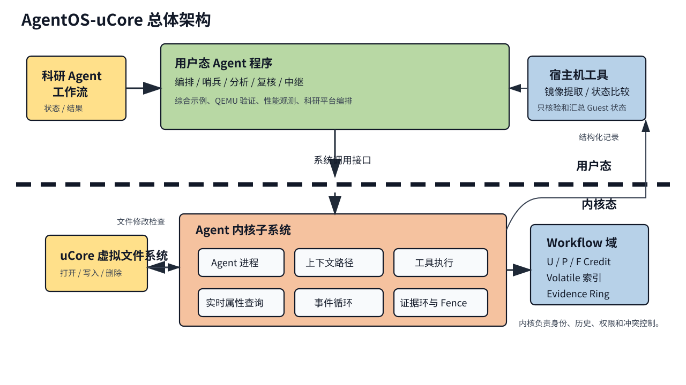
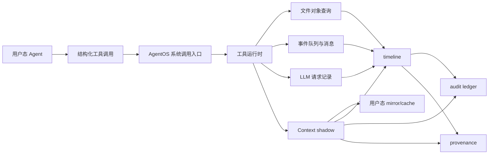
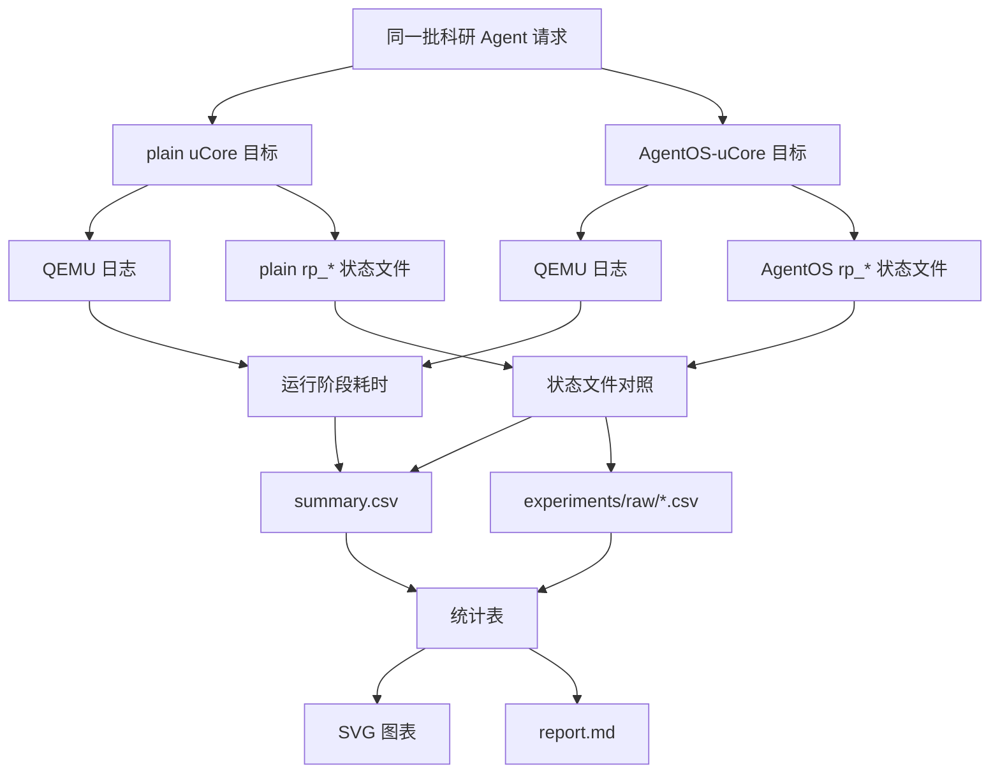

# AgentOS-uCore：面向 AI Agent 工作流的 uCore 内核支持层

[TOC]

## 一、基本信息

| 项目 | 内容 |
| --- | --- |
| 项目名称 | `project61-agentOS-happylegend` |
| 基础系统 | uCore RISC-V 教学操作系统 |
| 项目定位 | 在教学操作系统中实现面向 AI Agent / LLM 工作流的通用内核机制 |
| 主目标 | 根目录 AgentOS-uCore 增强内核 |
| 对照目标 | `baseline_ucore/` 是共享基础安全加固、不含 AgentOS 扩展的 uCore 对照组，运行同一科研 Agent 平台负载 |
| 主运行方式 | WSL2 Ubuntu / Linux + RISC-V 工具链 + QEMU |
| 源代码许可 | GPL-3.0，见 [LICENSE](LICENSE) |
| 文档许可 | CC-BY-SA-4.0，见 [DOCUMENTATION_LICENSE.md](DOCUMENTATION_LICENSE.md) |

## 二、项目简介

AI Agent 平台已经能够在用户态完成任务编排、工具调用、文件读写、多 Agent 协作和 LLM Relay。科研 Agent、代码 Agent、运维 Agent、写作 Agent 等应用都可以把任务拆成多个阶段，并在每一轮执行中根据工具结果继续决策。随着工作流变长，这些系统会不断积累上下文、文件状态、事件、权限和运行记录。

只停留在普通用户态时，上述状态通常散落在日志、普通文件、进程约定和应用层缓存中。上下文路径需要反复重建，文件对象查询依赖目录扫描和命名约定，事件等待容易退化成轮询，多 Agent 写同一对象时缺少统一仲裁，失败恢复和来源追踪也难以形成可信记录。操作系统原本负责进程、地址空间、系统调用、文件、调度和同步，但传统教学内核并不知道“哪个进程是 Agent、它正在处理哪一轮工具调用、哪些文件对象与当前决策有关、哪个事件唤醒了哪个 Agent”。

为了让这些问题落在一个可以运行、可以观察、可以对照的负载上，项目中实现了一套用户态科研 Agent 平台。平台作为示例和压力负载使用，业务逻辑保留在用户态：它把一次科研处理过程拆成多个阶段，由检索、分析、复核、恢复、写作和审计等角色程序协作完成，并把运行状态写成 `rp_*` 文件，供两个 uCore 目标和宿主机工具读取。

基于上述背景，我们在 uCore 中实现 AgentOS-uCore，把 Agent 进程身份、Agent Context、结构化工具调用、Context Path、文件对象元数据查询、事件队列、watch/wait/heartbeat、能力位授权、文件编辑租约、audit、timeline、provenance 和 LLM-friendly relay 记录做成通用内核机制。科研平台、设定的模拟流程、提示词、大模型调用策略和页面呈现仍由用户态负责；内核只提供可复用的系统能力。这个模拟流程用于承载示例负载，包含数据准备、比对处理、结果分析、报告生成和归档交付五个环节；示例中会让比对处理环节出现故障，再由多个 Agent 协作完成查询、分析、恢复和记录。

项目整体设计目标主要包括以下方面：

- **目标 1：Agent 进程和地址空间机制**
  在进程控制块中记录 Agent 身份、role、capability、quota、heartbeat、上下文区和运行统计，保证普通进程不能伪造 Agent 身份，并让 Agent Context 映射随 fork、exec、exit 正确维护。

- **目标 2：结构化工具调用运行时**
  提供工具名称协议和 id-based 快速协议，支持批量 `agent_run()`、参数键/类型校验、工具权限检查、syscall-only 工具区分和工具结果记录。

- **目标 3：可信 Context Path 与运行事实记录**
  用内核 shadow 保存可信历史，用用户态 mirror/cache 支持高频读取，记录工具调用摘要、完整 detail、cause/span、hash 链、timeline、audit 和 provenance。

- **目标 4：Agent 友好的文件对象查询**
  把文件 metadata 绑定到真实 inode，维护私有 `.agentmeta` 后端、属性索引、内容摘要、查询计划、查询缓存、预取提示和文件编辑租约。

- **目标 5：事件驱动 Agent Loop 与多 Agent 协作**
  支持 watch、wait、wake、timeout、heartbeat、wait cancel、消息唤醒、调度原因记录、统一 timeline 查询和 LLM Relay 事件路径。

本仓库同时维护两个可比较目标：

- 根目录目标：AgentOS-uCore 增强内核。科研 Agent 平台保持同一输入场景和输出契约，关键阶段使用内核 Agent 服务。
- `baseline_ucore/` 目标：共享 syscall、文件系统和进程生命周期等通用安全加固，但不包含 AgentOS 服务。科研 Agent 平台全部运行在普通用户态进程和普通文件之上。

也就是说，科研 Agent 平台先作为普通用户态应用存在，再分别放到两个目标里运行。读者看到的是同一套流程在“普通 uCore”和“AgentOS-uCore”两种系统条件下的表现。

这种双目标设计让同一科研 Agent 工作流分别运行在普通 uCore 和 AgentOS-uCore 上。普通目标说明纯用户态路径可以完成的工作，增强目标说明内核支持在文件查询、上下文读取、事件等待、失败恢复、权限控制和运行记录方面带来的差异。

综合分析项目创新点如下：

1. **Agent 进程成为内核可管理对象**：内核直接保存 Agent 身份、capability、事件状态、上下文区和调度提示，让 Agent 拥有系统级可管理状态。
2. **Context Path 采用 shadow + mirror 双区设计**：用户态可以直接读取 mirror 获得低开销状态，可信历史由内核 shadow 提供，兼顾性能和防篡改。
3. **工具调用从自然语言约定变成结构化系统接口**：工具名称、工具 id、参数键、参数类型、结果状态和错误码由 ABI 明确定义，便于 LLM Relay、多 Agent worker 和测试程序共同使用。
4. **文件查询从路径扫描扩展到对象语义查询**：文件对象可以附加 namespace、object id、type、state、owner、tags、digest 和 summary，并返回候选数量、扫描数量和查询计划。
5. **运行记录统一进入 timeline、audit 和 provenance**：Context、事件、调度、文件查询、权限拒绝、预取提示和 LLM 请求可以按同一套记录读取，减少用户态从日志中重新拼接运行事实的成本。
6. **块 I/O 与缓存按持久主体隔离**：进程 syscall 在入口捕获 PUBLIC 或 workflow owner 和 I/O class，内核维护显式建立 SYSTEM 或触发 workflow 的 background job；实际完成的 1 KiB 传输同时计入分域 bucket 和设备根账本。普通流量受设备根速率限制，SYSTEM/CONTROL 在根信用耗尽时仍可带债前进；buffer cache 以同一稳定 owner 设置保留量和上限。

## 三、完成情况

上一节说明项目为什么要同时保留科研平台负载和 AgentOS 内核机制。本节按赛题任务拆开说明已经完成的内容，并给出每一类能力对应的验证入口。

当前任务完成情况如下：

| 任务 | 当前完成内容 | 主要验证入口 |
| --- | --- | --- |
| 任务一：Agent 进程与地址空间 | Agent 身份、角色模板、capability、Agent Context 映射、fork/exec/exit 处理、普通进程隔离。 | `agentfinal_ucore`、`agentsecurity_ucore` |
| 任务二：结构化工具调用 | name-based 兼容接口、id-based 快速接口、批量 `agent_run`、参数键/类型校验、工具权限检查和结果记录。 | `agentfinal_ucore`、`agentbench_ucore`、`agentsecurity_ucore` |
| 任务三：Context Path | 内核 shadow 可信历史、用户态 mirror/cache、自动记录、手动 push、query、snapshot、rollback、clear、短摘要和 detail 记录。 | `agentfinal_ucore`、`agentscan_ucore` |
| 任务四：文件属性与摘要查询 | 真实 inode 关联、私有 `.agentmeta` 后端、属性索引、根目录自动扫描、内容摘要、查询计划、文件编辑租约和预取提示。 | `agentfs_ucore`、`agentscan_ucore`、`agentconflict_ucore` |
| 任务五：Agent Loop | FIFO 事件队列、stable control id 定向 IPC 路由、external/direct/attributed/source 分层核算、内核 origin 保留容量、watch/unwatch、睡眠等待、timeout、heartbeat、wait cancel、调度原因、资源域两级公平调度和 timeline 等待读取。 | `agentloop_ucore`、`agentsecurity_ucore`、`agentsched_ucore`、`threadresource_ucore` |
| 任务六：综合场景 | 科研 Agent 平台作为示例负载和压力负载，运行检索、分析、复核、恢复、写作、审计和 LLM Relay 路径；双目标脚本生成可比较的状态文件、CSV 和图表。 | `make dual-platform-run`、`make full-verify` |

工程化进展如下：

- [x] 建立共享安全基底的 uCore 对照组与 AgentOS-uCore 双目标目录结构。
- [x] 将 AgentOS 内核能力接入科研 Agent 平台主流程。
- [x] 实现 AgentOS 专项测试、双目标 QEMU 运行、状态文件对照和状态查看工具。
- [x] 提供默认离线 LLM Relay，并支持本机配置 cloud Relay。
- [x] 提供 Windows/WSL 依赖检查脚本和 Ubuntu 依赖安装脚本。
- [x] 生成文件数、上下文记录数、事件数量、并发 Agent 数、LLM Relay 和恢复阶段的对照实验数据。

## 四、方案设计

完成情况回答“做到了什么”，方案设计回答“这些能力怎样组织到操作系统和用户态平台中”。下面先看总体架构，再看各个内核模块如何支撑同一科研 Agent 流程。

### 4.1 总体架构设计

本项目的设计从 Agent 工作流的运行路径出发，将系统划分为三条主线：第一条是 Agent 进程和上下文管理，负责让内核识别、隔离并记录 Agent；第二条是工具调用和文件对象查询，负责把 Agent 对外部世界的操作变成结构化内核接口；第三条是事件、时间线和来源追踪，负责把多 Agent 协作中的等待、唤醒、恢复和记录组织成可查询的运行事实。

**面向 Agent 进程的内核支持。** 我们在 uCore 的进程模型上增加 Agent 身份、角色模板、能力位、上下文区、事件队列、心跳信息和运行统计。普通进程仍按原有 uCore 路径运行；Agent 进程在创建时由内核分配专属元数据和上下文页，之后的工具调用、事件等待、文件查询和审计记录都围绕该身份展开。

**面向工具调用和文件对象的系统接口。** Agent 的行动通过结构化工具调用进入内核，工具请求包含工具名称或工具编号、参数类型、参数值、payload 和执行标志；文件对象查询则通过 metadata、摘要、索引和真实 inode 关联完成。这样同一科研平台负载既能在普通 uCore 上运行，也能在 AgentOS-uCore 上使用内核加速和内核记录。

**面向长期协作的运行记录。** 多 Agent 工作流会出现等待、唤醒、失败恢复、LLM Relay、权限拒绝、文件更新和报告生成等动作。AgentOS-uCore 将这些动作写入 Context Path、timeline、audit ledger 和 provenance 结构，使用户态可以按 Agent、span、工具、事件和时间读取运行过程。



| 层次 | 位置 | 职责 |
| --- | --- | --- |
| AgentOS-uCore 内核层 | `os/`、`nfs/` | 扩展进程控制块、系统调用、文件系统元数据、事件等待、审计记录和来源追踪。 |
| uCore 用户态层 | `user/`、`baseline_ucore/user/` | 提供专项测试、科研 Agent 平台程序、普通目标程序和 AgentOS 目标程序。 |
| 宿主机工具层 | `host_tools/`、`scripts/` | 构建运行、提取镜像状态、比较双目标结果、生成 CSV/SVG/HTML 材料和运行 LLM Relay。 |

根目录是增强目标，`baseline_ucore/` 是普通 uCore 对照目标。两个目标共享科研平台的核心对象和运行请求，但内核支持程度不同。结构检查脚本会确认：`baseline_ucore/` 不包含 AgentOS syscall、Agent Context、内核文件 metadata、Agent 事件队列等增强符号；根目录包含 AgentOS 内核模块、用户态 ABI、专项测试和科研平台增强程序。

### 4.2 核心模块设计

总体架构把系统分成内核、用户态和宿主机工具三层。接下来按内核能力展开，每个模块都对应科研平台运行中的一个常见需求：身份、行动、记忆、文件对象、等待协作和大模型转发。

#### 4.2.1 Agent 进程与上下文区

本模块面向 Agent 身份、生命周期和地址空间管理。普通 uCore 进程只能通过进程号、父子关系和文件描述符表达运行状态；Agent 工作流需要额外记录当前角色、能力、上下文、事件、心跳和运行原因。我们在进程控制块中加入 Agent 元数据，并提供 `agent_create`、`agent_create_role` 和 `agent_info` 等系统调用，让用户态能够创建 Agent、查询真实角色和读取能力位。

Agent Context 固定映射在用户地址空间中，内核同时维护可信 shadow 区、用户可读 mirror 区和用户自管 cache 区。shadow 区保存可信历史；mirror 区提供低成本直接读取；cache 区留给用户态 Agent 保存策略状态。进程执行 fork、exec、exit 时，内核会同步维护上下文页和 PCB 字段，避免 Agent 身份和普通进程地址空间混在一起。

| 设计点 | 实现方式 | 作用 |
| --- | --- | --- |
| Agent 身份 | PCB 中保存 `is_agent`、role 和 capability mask | 普通进程不能伪造 Agent 状态。 |
| 上下文映射 | 固定高地址 Context 区，内核维护 shadow 和 mirror | 支持可信读取和快速读取两种路径。 |
| 生命周期处理 | create、exec、exit 路径统一更新 Agent 字段 | 进程替换程序或退出时不遗留错误上下文。 |
| 权限授权 | 敏感系统调用只读取内核 capability | 用户态传入的 role 字段不能提升权限。 |

#### 4.2.2 结构化工具调用运行时

本模块处理 Agent 的行动表达。成熟 Agent 框架通常会生成“工具名称 + 参数 + 结果”的结构化请求，操作系统如果只看到普通系统调用参数，就很难知道这次请求属于哪一轮推理、哪个工具、哪个对象和哪个错误状态。AgentOS-uCore 在内核中维护工具表、参数校验规则、工具可调用标记和权限要求，让工具调用以稳定 ABI 进入内核。

用户态有两条调用路径：名称协议用于表达赛题中的结构化工具调用，便于科研平台和 LLM Relay 使用；编号协议用于高频路径，`agent_run` 可以一次提交最多 64 个操作。内核先校验用户指针、工具编号、参数键、参数类型和 capability，再执行工具，最后把结果写回结果表、Context Path、timeline 和 audit。

| 工具类别 | 代表能力 | 内核处理重点 |
| --- | --- | --- |
| 进程与系统查询 | 进程信息、系统状态 | 读取内核状态，返回结构化结果。 |
| Context 工具 | context stat、snapshot、push | 维护多轮历史和可信快照。 |
| 文件对象工具 | metadata 查询、摘要读取、对象更新 | 关联真实 inode、索引和内容摘要。 |
| 协作工具 | 消息发送、事件投递、等待唤醒 | 连接多 Agent 的协作过程。 |
| LLM 相关工具 | 请求记录、响应记录 | 记录 request id、span、摘要和完成事件。 |

下面这张图呈现一次 Agent 行动进入内核后的记录路径。



这条路径解释了为什么工具调用、文件查询、事件和 LLM Relay 能进入同一套 timeline 与来源追踪。

#### 4.2.3 Context Path、时间线和来源追踪

本模块记录 Agent 多轮行动。Agent 每次调用工具后，内核会写入一条 Context 记录，记录工具、状态、短 payload、短 result、tick、span 和 cause。最近 128 条记录以环形方式保存；完整请求和响应摘要保存在内核详情区；超出容量后按顺序淘汰，并更新 oldest、latest 和 dropped 计数。

在 Context Path 之上，我们继续提供 timeline、audit ledger 和 provenance。timeline 把 Context、事件、调度、预取提示和 LLM 请求整理成统一记录；audit ledger 保存全局短记录和 hash 链摘要；provenance 把可见记录导出为因果关系。科研平台可以通过这些结构还原“哪个 Agent 先观察到失败、哪个 Agent 查询文件、哪个 Agent 触发恢复、哪个结果唤醒下一步”。

| 能力 | 用户态入口 | 说明 |
| --- | --- | --- |
| 自动记录 | 工具调用后自动追加 | 每次结构化工具调用都会进入 Context Path。 |
| 手动追加 | `context_push` | 用户态可以把关键阶段摘要写入同一条路径。 |
| 可信读取 | `context_snapshot`、timeline query | 从内核 shadow 和全局记录读取。 |
| 低成本读取 | 直接读取 Context mirror | 高频读取时减少系统调用次数。 |
| 来源关系 | span、cause、provenance edge | 多 Agent 协作中保留前后触发关系。 |

#### 4.2.4 文件对象 metadata、摘要和租约

本模块面向 Agent 的文件对象理解。普通文件系统以路径、目录项、inode 和文件描述符为核心；Agent 工作流更关心“这个文件属于哪个任务、当前状态是什么、是否是报告、是否已经失败、摘要是什么、哪个 Agent 正在编辑”。AgentOS-uCore 为文件对象附加 namespace、object id、type、state、owner、version、tags、labels、digest 和 summary，并把 metadata 绑定到真实 `dev + inum + incarnation`。`incarnation` 在 inode 槽复用时变化，避免旧 metadata、摘要缓存或租约错误命中新文件。

metadata 持久化使用私有 `.agentmeta` 双 bank，普通文件系统调用不能直接打开、创建、截断或删除后端文件。内核在 `timer_init()` 之后、运行时 I/O policy 和首个用户进程发布之前完成可信启动加载；单个 bank 损坏时从另一份可验证副本恢复，不存在可验证副本或可信判定失败时 metadata API 进入 fail-closed 状态，但 scope retirement 仍可按 VFS label 清理文件并释放生命周期身份。普通 workflow 文件变化先发布内存记录或 inode sidecar；只有 `PERSIST` 记录按 scope 进入固定窗口后台写回，volatile 微写不会制造空 checkpoint。后台 checkpoint 由触发它的稳定 owner 赞助并使用硬 `BACKGROUND` I/O 预算，尝试后的固定合并窗口负责请求聚合，不再用执行耗时放大 checkpoint 休整期。双 bank 写回按块推进：先使目标 header 无效，再更新并逐段验证变化的 payload，最后发布并回读 header；新主 bank 完整验证后才切换 active generation，随后才允许用同一不可变快照更新旧 bank。未使用的高水位块可复用。在新 primary 的 header 回读验证完成前，故障保留旧 active bank；切换后 mirror 更新失败时，已验证的新 primary 仍可恢复。同步 metadata 操作通过 FIFO submit lane 排队并建立不可替换的 COW job，不把调用返回解释成 primary 已验证；条件检查、事务门释放和等待入队处于同一关中断临界区，避免丢失唤醒。协调扫描仍使用独立的非滑动请求合并和四倍扫描耗时自适应休整，使 metadata 满表后的未绑定文件微写不能制造无间隔全根扫描。查询时，内核可以按 state、label、type 等字段走索引路径，也可以执行扫描路径；查询结果会返回候选数量、扫描数量、命中数量、查询计划和原因。文件内容摘要由受权 Agent 读取，重复读取同一版本可以命中 digest cache。编辑文件时，Agent 可以申请租约，内核在真实写入、截断和删除路径检查持有者和版本，降低并发覆盖风险。

| 设计点 | 实现方式 | 测试入口 |
| --- | --- | --- |
| 真实文件绑定 | metadata 记录 `dev + inum + incarnation` | `agentfs_ucore`、`agentvfs_ucore` |
| 私有后端 | `.agentmeta` 只允许 Agent 子系统内部访问 | `agentsecurity_ucore` |
| 合并写回 | scope-local dirty/durable 代数、PERSIST 分流、固定窗口、分块 COW 状态机与 `BACKGROUND` I/O 预算；扫描保留独立自适应休整 | `agentscope_ucore`；BACKGROUND 设备预算仍缺独立动态压力 |
| 索引查询 | state、label、type 候选集 | `agentbench_ucore`、双目标实验 |
| 内容摘要 | 读取短预览、长度和 hash | `agentfinal_ucore`、`labdemo_ucore` |
| 编辑租约 | 持有者检查和版本提交检查 | `agentconflict_ucore` |

#### 4.2.5 Agent Loop、事件队列和调度提示

本模块处理长期运行 Agent 的等待与协作。用户态平台可以通过轮询文件观察状态变化，但轮询会浪费 CPU，也难以说明是哪一个事件唤醒了哪个 Agent。AgentOS-uCore 为每个 Agent 维护 FIFO 事件队列、watch 列表、heartbeat、timeout deadline、wait cancel 令牌和调度原因记录。

Agent 调用 wait 后，如果没有匹配事件，有限 timeout 和无限等待都会进入睡眠。事件入队、heartbeat 到期、deadline 到期或取消请求会唤醒目标 Agent。调度器先严格轮转 active 进程资源域，再在选中域内按 FIFO 或 Agent 软评分选择线程；Agent burst 只影响本域候选，不能让一个多线程域跳过其他 active 域。选择 Agent 时记录事件数量、deadline、heartbeat、priority、budget 和虚拟运行量等信息，用户态可以读取最近调度原因，解释某次运行来自消息、文件状态变化、心跳还是超时。

| 场景 | 普通用户态做法 | AgentOS-uCore 做法 |
| --- | --- | --- |
| 等待文件状态 | 周期性扫描状态文件 | watch 文件对象事件并睡眠等待。 |
| 多 Agent 消息 | 写普通消息文件或约定字段 | 内核消息和事件队列唤醒目标 Agent。 |
| 心跳 | 用户态定时写日志 | 内核维护 heartbeat tick 和 timer 事件。 |
| 等待取消 | 约定取消标记 | 内核 wait cancel 令牌唤醒等待者。 |
| 调度解释 | 只能看程序日志 | 读取调度原因和 timeline。 |

#### 4.2.6 LLM Relay 与科研平台负载

前面几个模块都属于内核通用机制；科研平台只是把这些机制串起来的一个较完整用例。LLM Relay 也是同样的分工：模型调用由用户态或宿主机完成，内核负责记录请求、响应、事件和权限。

本模块把 LLM 调用纳入 AgentOS 的通用记录路径。内核不保存 API key，也不直接实现 HTTP/TLS；云端模型访问由用户态或宿主机 Relay 完成。内核负责处理 LLM 请求编号、请求 Agent、span、超时、预算、prompt 摘要、response 摘要、Relay capability、完成事件和审计记录。默认测试使用模板 Relay，配置本机密钥后可以切换 cloud Relay。

科研 Agent 平台是主要示例负载。平台中的设定的模拟流程、项目名、阶段名、报告内容、恢复策略和提示词都位于用户态程序、输入文件或宿主机工具中。内核只提供通用 action、artifact、metadata、event、timeline、audit 和 provenance 机制。模拟流程的五个环节分别是数据准备、比对处理、结果分析、报告生成和归档交付；这些环节只是用户态负载中的标签，内核按通用 metadata、依赖、事件和动作记录处理。这样同一套 AgentOS 能力可以继续服务代码 Agent、运维 Agent、数据流水线 Agent、游戏 NPC Agent 和写作 Agent 等不同场景。

#### 4.2.7 安全加固与资源韧性

AgentOS-uCore 将普通用户可触发的坏地址、同步取消、长 syscall 垄断、文件系统耗尽、进程退出、僵尸积压和 fork bomb 统一视为可恢复的资源与生命周期问题。syscall 在产生副作用前复制并校验用户输入。调度器为每次线程 dispatch 建立周期 deadline 和工作量预算，syscall 只进入或退出同一预算域，不能靠反复陷入刷新时间片；timer 到期先记录 pending，控制台、pipe、exec 分页、fork 页表快照、普通文件块 I/O 和 Agent batch 只在原子进度已提交、临时状态已释放后进入安全点。fork 复制期间由进程级 VM snapshot 屏障暂缓同进程 sibling，其他进程仍可运行。普通文件读写若已在安全点完成一次调度，会以合法短读/短写把已提交前缀交回用户态；loader 和 metadata exact-read helper 在文件系统原子段之外偿还预算并从该前缀继续，而不是把合法短 I/O 当成损坏。截断和最终 inode 回收则先 detach 映射，再用不可取消的 cleanup checkpoint 分批回收。

线程、文件描述符和全局文件槽也按这套可睡眠生命周期管理。进程 admission 会原子预扣主线程槽；后续 `thread_create()` 按不可变 `resource_domain_id` 和 ordinary/reserved 类别计费，同时受域上限、普通全局水位或系统保留量约束，创建失败和线程真正退出都向原域退款。调度器以资源域为外层轮转单位，因此单个 PUBLIC 进程增加线程不会获得额外的跨域 CPU 份额。`O_TRUNC` 在工作完成前只持有不可使用的 FD reservation，最后才安装真实文件；唯一 filepool 槽同样按创建者进程资源域和 admission 类别计费。fork 和阻塞 syscall 临时引用不重复扣账，也不能借关闭原 FD 逃离账本；只有最后引用关闭才发布槽并向原域退款，域在 live 进程、线程和文件槽都归零前不会复用。mutex、semaphore、condvar、进程和 Agent 等睡眠对象使用私有等待队列；文件系统以持久 owner map、稳定存储 principal 配额和 PUBLIC/WORKFLOW/SYSTEM 分级水位保护块与 inode。当前没有 uid/tenant ABI，普通进程统一绑定安装级 PUBLIC principal 2；挂载从 qmap/dinode 重建用量，因此进程域退出或重启不能清零。PUBLIC 首次接管 SYSTEM 赞助对象时先在固定工作区收集并排序全部数据/间接块，按 qmap block 分组预检和写回；唯一可睡眠 claim gate 在一次配额预留后保持 qmap-first、inode-last 的前向提交，挂载恢复同一中间状态。分配失败向上传播错误；多线程退出先取消阻塞 syscall，再释放共享资源；退出状态与执行槽分离。内核栈还同时使用 guard 和构建期预算检查。

块设备路径沿用持久主体身份，而不是 PID 或短命进程资源域。PUBLIC、每个 active workflow 和 SYSTEM 分别拥有速率 bucket；workflow 的普通、控制与后台工作使用不同 class。前台请求可借未使用的 shared slice；存在 admission 排队者时，shared grant 按 owner/class cursor 轮转，没有排队者的 fast path 可直接借用，后台工作不能借共享容量。一次 syscall 先取得 owner 或 shared lease，并尝试取得设备根 lease；真实 VirtIO 完成事件再消费两级信用，多块请求产生 owner/device debt。普通流量必须等待设备根信用和债务偿还；SYSTEM/CONTROL 即使设备根暂时无信用也保留前进机会，但每次完成仍增加 device debt，不把根 bucket 误当作保护流量的硬总上限。退出撤销会归还未消费 lease。scheduler 每轮先在 idle context 安装 kernel trap 向量并短暂打开中断，使唯一 runnable 线程即使反复在内核态 pipe 路径 `yield()`，timer/device 中断仍有固定交付窗口，I/O debt 与后台 token refill 不会因长期不返回用户态而停摆。

buffer cache 同样记录稳定 sponsor，为 SYSTEM、PUBLIC 和每个 active workflow 设置 floor/cap，跨域命中不会刷新原 sponsor 的 LRU，超上限的 transient buffer 在释放时失效。每个 buffer 另有 exclusive holder、递归深度和私有等待队列；进程在持有 buffer 或处于复合文件系统原子段时只会延后预算检查，只有释放全部 buffer 且对象状态已提交的 quiescent checkpoint 才能睡眠。不可回滚的 qmap claim、truncate 和清理路径使用 cleanup checkpoint 完成前向提交。

由主线程触发的正常 `exit()`、用户 page fault 或非法指令进入同一进程级 terminal teardown；非主 sibling 无论正常退出还是 fault 都只回收自身线程。进程级 teardown 先让 sibling 从阻塞点展开，再建立不可中断的 cleanup I/O request 与 kernel-work 上下文；关闭未链接文件等释放操作产生的真实 I/O 继续按原稳定 owner 计费。剩余 lease 与 owner/class debt 在清理上下文中结算；PUBLIC/NORMAL 还会等待 device debt，SYSTEM/CONTROL 的受保护 device debt 则保留在全局设备根账本中由 refill 偿还，不绑定退出线程。随后才清除 teardown thread 的账本并释放内核栈，最后由 `vfs_proc_reset()` quiesce VFS。

workflow 最后成员退出后停止用户 I/O，并立即撤销 active cache floor；其不可复用的生命周期账本继续保留 `BACKGROUND` 预算，轮转 reaper 以临时 3/8 cache floor/cap 分步完成清理。`VFS_SCOPE_LIFECYCLE_CAP=8` 同时约束 active + retiring，active 最多 4 个，全部退出积压时 retiring 最多 8 个；只有 `used` 清零的槽才可复用，避免新 scope 覆盖旧清理状态或泄漏 I/O owner。清理完成后才唤醒残余等待者，并在请求、lease 与 debt 归零后回收 I/O 状态和空闲缓存。截断、最终 inode 回收和 scope 文件清理都使用“先 detach、后分步 reclaim”的通用状态机，不跨预算边界持有 inode 或 buffer。

Agent 专属安全链由构建期可信映像清单、loader 映像绑定、bootstrap/role grant、capability 和 VFS 文件安全域组成。可信 bootstrap factory 只能通过内核签发新的动态 workflow scope，scope 内 orchestrator 只能委派本域角色；敏感对象访问必须同时命中 capability、active scope 和精确 owner。跨 Agent 消息默认拒绝，只有同 scope 且命中 stable control id 入站路由后才能投递；`MESSAGE_SEND` 不授予等待控制权，等待取消还必须具备独立 `WAIT_CANCEL` capability 并命中直接 controller 关系。公共 `agent_wake()` 只能发送普通消息，系统事件由专用内核路径产生；调度器允许 orchestrator 配置域内软策略，但 Agent burst 和评分逃生边界也只在域内生效，外层资源域轮转不可配置。完整威胁模型、实现位置、自定义 Agent 注册步骤和专项测试入口见 [安全加固与资源韧性设计](docs/agentos/security-hardening.md)。

### 4.3 模块组合后的运行路径

一次典型科研 Agent 运行会经过以下步骤：内核选定的可信 init 使用启动 grant 创建 orchestrator；orchestrator 显式委派其他角色并写入文件对象 metadata 和依赖关系；sentinel 观察失败状态并写入 Context；investigator 根据 metadata 和预取提示读取相关文件摘要；recovery 通过通用 action 更新对象状态；writer 或 Relay 写入报告摘要；orchestrator 最后读取 timeline、audit ledger 和 provenance。普通 `fork/exec` 子进程不继承启动 grant。每一步都可以在用户态看到业务结果，也可以在内核结构中看到对应的工具调用、事件、权限判断和来源关系。

| 阶段 | 用户态动作 | 内核机制 |
| --- | --- | --- |
| 初始化 | 写入科研对象、依赖、角色 Agent | 文件 metadata、dependency、capability |
| 观察 | 发现失败、发送事件 | Context Path、event queue、timeline |
| 分析 | 查询文件、读取摘要、请求 LLM | metadata index、digest cache、LLM request |
| 恢复 | 提交恢复动作、更新状态 | action commit、artifact update、idempotency |
| 写作 | 生成说明、记录报告摘要 | Context detail、artifact metadata、provenance |
| 汇总 | 读取运行事实 | audit ledger、timeline query、provenance snapshot |

## 五、构建与运行

前面的章节说明项目结构和设计。本节给出实际运行顺序：先检查环境，再分别运行普通目标和增强目标，最后用双目标脚本生成可对照的结果材料。

### 5.1 依赖检查

Windows 用户克隆仓库后，先在 PowerShell 中运行：

```powershell
.\scripts\check-windows-prereqs.ps1
```

进入 WSL/Ubuntu 后，在仓库根目录运行：

```bash
make doctor
```

如果 Ubuntu 中缺少依赖，可以运行：

```bash
bash scripts/install-ubuntu-deps.sh
```

仓库不内置 QEMU、RISC-V GCC/binutils、WSL 发行版或云端模型密钥。这些内容依赖本机环境或涉及私密配置。公开验证默认使用离线 LLM Relay，不需要外部密钥。

### 5.2 普通 uCore 目标

普通目标是实验对照组，不属于 AgentOS 系统本体。它与主目标共享不依赖 AgentOS 的 syscall、同步、文件系统和进程生命周期安全加固，但不提供 Agent syscall、Agent Context、Agent 文件 metadata 或 Agent 事件队列。它用于比较哪些工作由普通用户态约定完成，哪些工作可以交给 AgentOS 内核机制。

```bash
make plain-platform-build TOOLPREFIX=riscv64-linux-gnu-
make plain-platform-run TOOLPREFIX=riscv64-linux-gnu-
```

普通目标运行科研 Agent 平台的用户态版本，使用普通进程、普通文件、`fork`、`exec`、`waitpid`、`open`、`read`、`write`、`close` 等机制生成 `rp_*` 状态文件。

### 5.3 AgentOS-uCore 目标

增强目标运行同一套科研 Agent 负载，但关键阶段会进入 AgentOS syscall。这样后续对照中的差异可以归因到内核机制，避免不同应用实现造成干扰。

```bash
make agentos-user TOOLPREFIX=riscv64-linux-gnu-
make agentos-build TOOLPREFIX=riscv64-linux-gnu-
make agentos-test TOOLPREFIX=riscv64-linux-gnu-
make agentos-platform-build TOOLPREFIX=riscv64-linux-gnu-
make agentos-platform-run TOOLPREFIX=riscv64-linux-gnu-
```

增强目标运行同一科研流程，关键阶段会调用 AgentOS 内核服务。`agentos-test` 会执行 AgentOS 专项测试，覆盖 Agent Context、工具调用、Context Path、文件 metadata、事件循环、调度、LLM Relay 模板路径、权限拒绝和并发冲突控制。

直接调试内核时，`make run` 会原子安装当前源码生成的全新可写镜像，确保用户程序、可信清单和 `INIT_PROC` 不会沿用旧版本。需要验证同一磁盘的持久状态时使用 `make run-persist`；该目标只在可写镜像不存在时初始化一次，之后原样重启 `nfs/fs-copy.img`，不自动迁移或覆盖不兼容格式。`baseline_ucore/` 下提供同名的两种入口。

### 5.4 双目标运行

单独运行两个目标只能证明它们各自可用；双目标运行会把两次 QEMU 输出、状态文件和实验数据放到同一目录结构下，便于后续页面和图表读取。

```bash
make dual-platform-run TOOLPREFIX=riscv64-linux-gnu-
```

该命令会先检查目录职责、平台程序覆盖、源码同步和结果文件契约，再启动两个 QEMU 目标。运行结束后，脚本会从文件系统镜像中提取 `rp_*` 状态文件，并生成：

- `/tmp/agentos-dual-platform/`：QEMU 日志、提取出的状态文件、页面渲染结果和阶段耗时。
- `results/latest/`：`summary.csv`、`runner-sweep.csv`、`experiments/raw/*.csv`、`experiments/experiment-stats.csv`、`charts/*.svg`、`report.md`、`reader-guide.html`、`monitor.html` 等汇总材料。

如果运行长时间没有输出，优先查看：

```text
/tmp/agentos-dual-platform/stage-timings.csv
/tmp/agentos-dual-platform/seeded-action-state/plain/ucore-run.log
/tmp/agentos-dual-platform/seeded-action-state/agentos/ucore-run.log
```

日志会记录 QEMU 无输出次数、最后输出片段、通过标记和超时状态，用于区分构建慢、QEMU 未启动、用户程序卡住和程序已经报错。

### 5.5 页面查看和完整验证

双目标脚本生成的是原始日志、状态文件、CSV 和 SVG。为了人工查看和复查更方便，`reader` 会把这些结果整理成本地页面入口。

最短示例路径使用两条命令：

```bash
make dual-platform-run TOOLPREFIX=riscv64-linux-gnu-
make reader
```

`make reader` 会启动本地服务，默认地址为：

```text
http://127.0.0.1:8767/
```

完整验证入口：

```bash
make full-verify TOOLPREFIX=riscv64-linux-gnu-
```

该命令串起结构检查、Host 工具测试、双目标 QEMU 运行、AgentOS 专项、进程生命周期、syscall 公平性、filepool 和线程资源域测试。需要快速检查目录职责和 Host 工具时，可以运行：

```bash
make target-readiness
```

## 六、项目测试

运行命令回答“怎么跑”，测试章节回答“跑完以后应该看什么”。本节把专项测试、双目标实验、原始数据和图表结果放在同一条叙事里。

测试部分按“测试对象、实验负载、原始数据、图表结果、结论解释”组织。我们不只检查某个程序是否输出 `passed`，还把普通 uCore 与 AgentOS-uCore 放在同一批输入下运行，记录扫描数、候选数、重建步骤、轮询次数、拒绝次数、tick 观测和状态文件结果。这样可以同时回答两个问题：系统功能是否完整，内核机制在同一负载下是否减少了用户态成本。

### 6.1 测试组织方式

测试分为五类，先由小规模专项测试确认每个内核机制可用，再由双目标运行把这些机制放进完整科研 Agent 流程。

| 类型 | 入口 | 作用 |
| --- | --- | --- |
| AgentOS 专项测试 | `scripts/run-agent-tests.sh`、`make agentos-test` | 逐项检查 Agent 进程、工具调用、Context、文件查询、事件循环、调度、LLM、权限和冲突控制。 |
| 安全与资源专项 | `make fs-enospc-test`、`make proc-reap-test`、`make thread-resource-test`、`make file-resource-test`、`make syscall-fairness-test`、`make kernel-stack-check`；`iobudget_ucore` 随 Agent 专项运行 | 检查可恢复资源耗尽、持久 PUBLIC 配额跨域退出/重启、退出回收、进程/线程/filepool 资源域、线程域级 CPU 公平、长 syscall 公平性、块 I/O/cache 分域和系统保留槽及内核栈预算。 |
| 双目标运行测试 | `make dual-platform-run` | 让同一科研 Agent 请求分别进入普通 uCore 和 AgentOS-uCore，生成可比较状态文件。 |
| 宿主机工具测试 | `host_tools/test_*.py` | 检查镜像提取、状态对照、页面渲染、图表契约和 LLM Relay 模式。 |
| 完整验证 | `make full-verify` | 串联结构检查、Host 工具测试、双目标运行、AgentOS 专项测试、进程生命周期、线程资源域、syscall 公平性和 filepool 配额测试；ENOSPC 与栈预算保留独立入口。 |

AgentOS 专项测试程序如下：

| 测试程序 | 主要内容 | 关键输出 |
| --- | --- | --- |
| `agentfinal_ucore` | Agent 创建、Context 映射、批量工具调用、Context Path、用户 cache、timeline、Run Ledger、provenance。 | `agentfinal_ucore: parent passed` |
| `agentfs_ucore` | 真实 inode 绑定、partial update、selector 一致性、`.agentmeta`、索引查询、查询缓存、内容摘要、预取提示、删除清理。 | `agentfs_ucore: parent passed` |
| `agentscan_ucore` | 根目录自动扫描、真实文件自动写入 metadata、文件创建和删除后的索引维护。 | `agentscan_ucore: parent passed` |
| `agentloop_ucore` | FIFO 事件队列、watch/unwatch、睡眠等待、timeout、heartbeat、wait cancel。 | `agentloop_ucore: parent passed` |
| `agentsched_ucore` | 角色权重、受权软调度配置、事件优先、强制 burst 公平上限和普通进程进展。 | `agentsched_ucore: parent passed` |
| `agentconflict_ucore` | 文件编辑租约、非持有者写入拒绝、版本提交检查。 | `agentconflict_ucore: parent passed` |
| `agentllm_ucore` | LLM 请求、Relay Agent 模板响应、完成事件、Context 和 timeline 记录。 | `agentllm_ucore: parent passed` |
| `agentbench_ucore` | 批量工具调用、Context 快照、文件查询 scan/index、查询缓存、预取提示、事件计时。 | `agentbench_ucore: parent passed` |
| `labbench_ucore` | 综合性能入口，受权创建 orchestrator 并执行 `agentbench_ucore`。 | `labbench_ucore: parent passed` |
| `labdemo_ucore` | 多 Agent 科研恢复场景、文件查询、预取交接、消息唤醒、恢复动作、audit 和 provenance。 | `labdemo_ucore: parent passed` |
| `agentsecurity_ucore` | 普通进程拒绝、低权限 Agent 伪造拒绝、私有 metadata 后端保护、scoped action/artifact。 | `agentsecurity_ucore: parent passed` |
| `agenttrust_ucore` | 可信映像、不可变代码、bootstrap 授权范围和 role-image 绑定。 | `agenttrust_ucore: parent passed` |
| `agentvfs_ucore` | public/workflow 文件安全域、能力读写、继承 fd 重新校验和普通命名空间兼容。 | `agentvfs_ucore: parent passed` |
| `agentscope_ucore` | 动态 workflow scope、跨域对象/IPC 隔离、事务门、持久微写合并、volatile 分流、满表扫描限流与跨域查询时限、配额、一次性 fd 委派和生命周期回收。 | `agentscope_ucore: parent passed` |
| `iobudget_ucore` | PUBLIC 速率/缓存压力、稳定 owner 归因、两级 lease 上界、线程退出 lease 回收、scheduler 内核态中断交付、fault/异常退出清理归因与 debt 结算、workflow cache floor、CONTROL 保留预算和跨域有界进展。 | 最终 teardown 修复后的独立轮输出八项机制标记与 `parent passed`，`elapsed=2.4s`；完整轮本项 `2.1s` |
| `usersafety_ucore` | syscall 坏地址、超长参数和对象私有等待队列。 | `usersafety_ucore: parent passed` |
| `syscallfair_ucore` | 纯 Guest 公平性契约，覆盖控制台、inode 大写入、截断的 last-syscall 重调度计数、observer 与 worker 完整退出。 | 当前源码 `make syscall-fairness-test` 已通过 |
| `threadresource_ucore` | 普通/保留域上限与复用、容量拒绝计数稳定、普通/保留全局水位与复用、系统保留进展和跨域调度公平。 | `make thread-resource-test` 输出 12 项机制标记、`parent passed` 和 `[thread-resource] all checks passed` |

本次线程资源域改动后已以 `CASE_TIMEOUT=300s bash scripts/run-agent-tests.sh` 完成 16/16，墙钟约 `321s`；默认 `make build`、`make thread-resource-test`、单独 `agentsched_ucore`，以及双目标进程回收、syscall 公平性和 filepool 资源脚本也通过，AgentOS 构建期栈预算为 `13680 < 16384`。这些结果仍不等同于尚未运行的 `make full-verify`，更早的 ENOSPC 专项继续作为历史记录。

### 6.2 双目标对照负载

专项测试先证明内核模块单独可用，双目标实验则把这些模块放回科研平台主流程中观察。下面六组实验使用同一批模拟流程对象，只改变文件数、记录数、事件数、并发数或请求数。

双目标测试使用同一批科研 Agent 请求，分别进入共享安全基底的 uCore 对照目标和 AgentOS-uCore 目标。普通目标依靠用户态文件、状态约定和轮询完成流程；增强目标在关键阶段调用 AgentOS 内核服务。两侧共有的安全加固不计作 AgentOS 性能收益，六组对照实验只比较 AgentOS 专属机制：

| 实验 | plain 路径 | AgentOS 路径 | 主要指标 |
| --- | --- | --- | --- |
| 文件对象查询 | 扫描状态文件和命名约定 | metadata 索引候选 + 真实文件复查 | 扫描数、候选数、命中数 |
| Context/timeline | 用户态拼接日志和状态文件 | 内核 snapshot/query | 重建步骤、记录数、读取成本 |
| 事件等待 | 用户态轮询 | 内核 wait/wake | 轮询次数、唤醒次数、timeout |
| 并发写入 | 锁文件和覆盖约定 | 内核租约 + capability 拒绝 | 冲突次数、拒绝次数、成功提交 |
| LLM Relay | 用户态状态文件传递 | 结构化 LLM 请求 + 事件唤醒 + audit | 请求数、响应状态、记录命中 |
| 失败恢复 | 扫描失败状态并重复更新 | 通用 action、去重、metadata、event | 恢复阶段数、重复请求处理、状态一致性 |

双目标测试从同一批请求开始，两个目标分别运行，再由宿主机工具统一提取和汇总。



README 中的实验表和图表都应能回到这些 CSV、日志和状态文件。

#### 6.2.1 文件对象查询实验

**测试背景与方法。** 科研平台运行中会产生输入、manifest、中间结果、日志、复核意见和报告。普通路径需要扫描目录和状态文件，再根据命名约定判断对象含义。AgentOS 路径先查询内核 metadata 索引，再复查真实 inode 和摘要。实验把文件数量设置为 32、128、512、1024，比较普通扫描数和 AgentOS 候选数。

**测试结果读取。** 原始数据保存在 `results/latest/experiments/raw/file-metadata.csv`，图表为 `results/latest/charts/experiment-file-query-bar.svg`。CSV 中保留 plain 扫描记录数、AgentOS 候选记录数、命中数和多轮运行统计。

**测试结论。** 文件数增加时，普通路径触达记录随总量增长；AgentOS 根据 namespace、type、state、label 等字段缩小候选集。该实验重点观察“同一查询目标下需要触达多少记录”，比单纯看 tick 更稳定。

#### 6.2.2 Context 与 timeline 查询实验

**测试背景与方法。** 长流程 Agent 会不断生成工具调用、事件、LLM 请求和恢复动作。普通路径需要从日志、状态文件和事件记录中重新拼接路径；AgentOS 路径直接从 Context shadow、timeline cursor 和 snapshot/query 读取结构化记录。实验设置 128、512、2048、8192 条记录，比较重建步骤与内核读取成本。

**测试结果读取。** 原始数据保存在 `results/latest/experiments/raw/context-timeline.csv`，图表为 `results/latest/charts/experiment-context-line.svg`。统计表给出 min、avg、max、P50、P95。

**测试结论。** 记录数越大，普通路径越依赖用户态拼接；AgentOS 的 snapshot/query 保持固定接口和有序记录，适合多轮推理和多 Agent 协作后的运行追溯。

#### 6.2.3 事件等待实验

**测试背景与方法。** 用户态 Agent 常用轮询等待状态文件变化，事件越多，轮询次数越高。AgentOS 使用 watch、wait、event queue 和 heartbeat，让 Agent 在没有事件时睡眠，由内核在事件到达、timeout 或心跳到期时唤醒。实验设置 8、32、128、512 个事件，比较用户态轮询次数和内核 wait/wake 次数。

**测试结果读取。** 原始数据保存在 `results/latest/experiments/raw/event-loop.csv`，图表为 `results/latest/charts/experiment-event-box.svg`。箱形图呈现多次运行中的 P25、P50 和 P75，适合观察事件数量变化后的波动。

**测试结论。** AgentOS 路径把“检查是否有事件”的重复工作交给内核事件队列和睡眠等待，用户态只处理真正到达的事件。这个实验直接对应任务五中的 watch、wait、heartbeat 和 timeout。

#### 6.2.4 并发 Agent 写入实验

**测试背景与方法。** 多个 Agent 同时生成报告、修改状态或更新工件时，普通用户态路径通常依靠锁文件和写入约定，容易出现覆盖、旧版本提交和权限混乱。AgentOS 使用文件编辑租约、版本提交和 capability 检查。实验设置 2、4、8、16 个并发 Agent，比较普通路径的残余写入风险和 AgentOS 的拒绝效果。

**测试结果读取。** 原始数据保存在 `results/latest/experiments/raw/agent-concurrency.csv`，图表为 `results/latest/charts/experiment-concurrency-heatmap.svg`。表中保留成功提交、拒绝次数、旧版本提交处理和残余风险值。

**测试结论。** AgentOS 中的拒绝次数表示内核在真实写入路径拦截非持有者或旧版本提交。并发数量上升时，这组数据能说明内核租约和 capability 对共享文件对象的保护效果。

#### 6.2.5 LLM Relay 实验

**测试背景与方法。** LLM 调用在用户态可以通过普通文件传递 prompt 和 response，但请求 id、span、timeout、quota、结果摘要和完成事件容易分散在多个日志中。AgentOS 路径把 LLM request/response 作为结构化记录处理，Relay 进程或宿主机转发层负责实际模型访问。实验设置 4、16、64、256 个请求，比较普通路径复原请求状态的步骤和 AgentOS 结构化记录数。

**测试结果读取。** 原始数据保存在 `results/latest/experiments/raw/llm-relay.csv`，图表为 `results/latest/charts/experiment-llm-relay-bar.svg`。公开验证默认使用模板 Relay；本机配置外部密钥后，可以使用 cloud Relay 生成真实文本摘要。

**测试结论。** 内核不接触密钥和网络，但能够把 LLM 调用纳入 Context、event、audit 和 provenance。这样既保留用户态模型接入灵活性，也让 LLM 参与的 Agent 工作流具备系统层记录。

#### 6.2.6 失败恢复实验

**测试背景与方法。** 科研平台的恢复流程包含发现失败、查询相关文件、决定恢复动作、更新工件状态、写报告和通知下一阶段。普通路径需要扫描失败状态并重复更新多个文件；AgentOS 使用通用 action、metadata、event、dedup 和 timeline 记录恢复过程。实验设置 1、3、6、12 个失败阶段，比较普通恢复步骤和 AgentOS 结构化动作成本。

**测试结果读取。** 原始数据保存在 `results/latest/experiments/raw/recovery-flow.csv`，图表为 `results/latest/charts/experiment-recovery-line.svg`。状态文件中还会记录重复请求处理和最终状态一致性。

**测试结论。** AgentOS 路径把恢复拆成可授权、可去重、可追踪的结构化动作。用户态仍决定恢复策略，内核负责记录、权限、幂等处理、事件通知和来源关系。

### 6.3 结果产物与图表

每组实验都有可回溯的原始 CSV，图表只是把 CSV 中的对照关系画出来。阅读图表时应先看指标含义，再看 plain 路径和 AgentOS 路径的差异。

| 材料 | 位置 | 说明 |
| --- | --- | --- |
| QEMU 日志和提取状态 | `/tmp/agentos-dual-platform/` | 保存 plain 和 AgentOS 两个目标的原始运行输出、状态文件和阶段耗时。 |
| CSV 与统计表 | `results/latest/summary.csv`、`results/latest/experiments/*.csv` | 保存可复用数值、实验原始数据、min/avg/max、P50/P95 等统计结果。 |
| 图表和摘要 | `results/latest/charts/*.svg`、`results/latest/report.md` | 呈现扫描数、重建成本、轮询次数、冲突风险、吞吐和运行时间观察。 |

关键图表如下：

| 图表 | 数据来源 | 主要阅读方式 |
| --- | --- | --- |
| `runtime-observation.svg` | 双目标阶段耗时和状态产物 | 观察两个目标是否都完成、状态文件是否可提取、QEMU 是否健康。 |
| `cost-replacement.svg` | `rp_backend_exec` | 对照普通用户态成本项和 AgentOS 替代机制。 |
| `runner-ticks.svg` | `runner-sweep.csv` | 比较同类 runner 动作的 tick 观测。 |
| `runner-speedup.svg` | `runner-sweep.csv` | 查看成组场景中的相对节省。 |
| `experiment-file-query-bar.svg` | 文件对象查询 CSV | 查看文件数增加后扫描数和候选数的差异。 |
| `experiment-context-line.svg` | Context/timeline CSV | 查看记录数增加后重建成本和 snapshot/query 成本的差异。 |
| `experiment-event-box.svg` | 事件等待 CSV | 查看事件数量增加后轮询次数和 wait/wake 次数的差异。 |
| `experiment-concurrency-heatmap.svg` | 并发 Agent CSV | 查看并发数量增加后的残余写入风险和内核拒绝效果。 |
| `experiment-llm-relay-bar.svg` | LLM Relay CSV | 查看 LLM 请求增多后的状态复原成本差异。 |
| `experiment-recovery-line.svg` | 恢复流程 CSV | 查看失败阶段增多后的恢复步骤差异。 |
| `experiment-monitor-area.svg` | 六组实验汇总 | 汇总减少扫描、减少重建、减少轮询和降低冲突风险的总体趋势。 |

图表生成优先使用 `pandas`、`seaborn` 和 `matplotlib`。如果本机没有安装这些包，脚本会退回到内置 SVG 生成路径，原始 CSV 和统计 CSV 仍保持不变。图表版面由 `host_tools/test_chart_svg_layout_contract.py` 检查，避免文字互相遮挡或超出画布。

### 6.4 推荐运行命令

快速查看双目标结果：

```bash
make dual-platform-run TOOLPREFIX=riscv64-linux-gnu-
```

运行完整验证：

```bash
make full-verify TOOLPREFIX=riscv64-linux-gnu-
```

只运行 AgentOS 专项测试：

```bash
make agentos-test TOOLPREFIX=riscv64-linux-gnu-
```

运行文件系统耗尽、进程生命周期、全局文件对象表配额、syscall 公平性和内核栈安全专项验证：

```bash
make fs-enospc-test TOOLPREFIX=riscv64-linux-gnu-
make proc-reap-test TOOLPREFIX=riscv64-linux-gnu-
make file-resource-test TOOLPREFIX=riscv64-linux-gnu-
make syscall-fairness-test TOOLPREFIX=riscv64-linux-gnu-
make kernel-stack-check TOOLPREFIX=riscv64-linux-gnu-
```

重新生成汇总材料：

```bash
python3 host_tools/summarize_dual_platform_results.py \
  --work-dir /tmp/agentos-dual-platform \
  --out-dir results/latest
```

### 6.5 测试小结

从当前测试组织看，AgentOS-uCore 的测试由三个层次共同支撑：专项测试检查内核机制是否独立可用；双目标运行检查同一科研平台负载在两个内核目标上的差异；CSV 和图表把差异落到扫描数、重建步骤、轮询次数、拒绝次数和 tick 观测这些可复查数据上。

六组对照实验分别对应 AgentOS 的核心设计：文件对象 metadata 减少扫描；Context 和 timeline 减少路径重建；事件队列减少用户态轮询；租约和 capability 降低并发写入冲突；LLM Relay 结构化记录减少跨日志复原；通用 action 和 provenance 降低恢复流程成本。详细测试方法、示例输出和图表说明见 [docs/verification.md](docs/verification.md) 与 [docs/agentos/verification.md](docs/agentos/verification.md)。

## 七、文档入口

README 只保留项目全貌和主要运行方式。需要查看实现细节、接口定义或测试证据时，可以按下面的入口继续阅读。

| 阅读目标 | 文档 |
| --- | --- |
| 双目标设计和状态文件关系 | [docs/dual-targets.md](docs/dual-targets.md) |
| 双目标构建、运行和结果检查 | [docs/verification.md](docs/verification.md) |
| AgentOS-uCore 架构和机制 | [docs/agentos/design.md](docs/agentos/design.md) |
| 安全加固、可信执行、文件安全域和资源配额 | [docs/agentos/security-hardening.md](docs/agentos/security-hardening.md) |
| AgentOS-uCore 系统调用和 ABI | [docs/agentos/api.md](docs/agentos/api.md) |
| 任务要求到实现和测试的对应关系 | [docs/agentos/requirements-traceability.md](docs/agentos/requirements-traceability.md) |
| AgentOS 专项测试详情 | [docs/agentos/testing-details.md](docs/agentos/testing-details.md) |
| Windows 克隆后的依赖检查 | [docs/windows-quickstart.md](docs/windows-quickstart.md) |
| 历史设计开发报告（安全机制以当前 Markdown 文档为准，PDF 待重新生成） | [AgentOS-uCore开发者文档.pdf](AgentOS-uCore开发者文档.pdf) |

## 八、文件索引

下面的目录索引用于把前文提到的内核、用户态平台、对照目标和宿主机工具对应到仓库路径。

```text
.
├── os/                     AgentOS-uCore 增强内核
├── nfs/                    根目录目标文件系统镜像构建
├── user/                   AgentOS 专项测试和科研平台增强程序
├── baseline_ucore/          共享通用安全加固、不含 AgentOS 扩展的对照目标
├── host_tools/              镜像提取、状态对照、页面渲染、LLM Relay 和图表工具
├── scripts/                 依赖检查、双目标运行、完整验证和页面服务脚本
├── docs/                    双目标说明、AgentOS 设计、验证文档和报告
├── results/                 本机运行生成的结果目录，默认不提交
├── LICENSE                  源代码 GPL-3.0 许可文本
├── DOCUMENTATION_LICENSE.md 文档 CC-BY-SA-4.0 许可文本
└── NOTICE                   第三方来源和许可说明
```

## 九、开源声明

项目以 uCore 教学操作系统为基础进行扩展，仓库保留原有许可文本和第三方来源说明。源代码遵循 [LICENSE](LICENSE) 中的 GPL-3.0 许可；技术文档和结果材料遵循 [DOCUMENTATION_LICENSE.md](DOCUMENTATION_LICENSE.md) 中的 CC-BY-SA-4.0 许可。第三方来源、基础项目和引用关系见 [NOTICE](NOTICE)。
