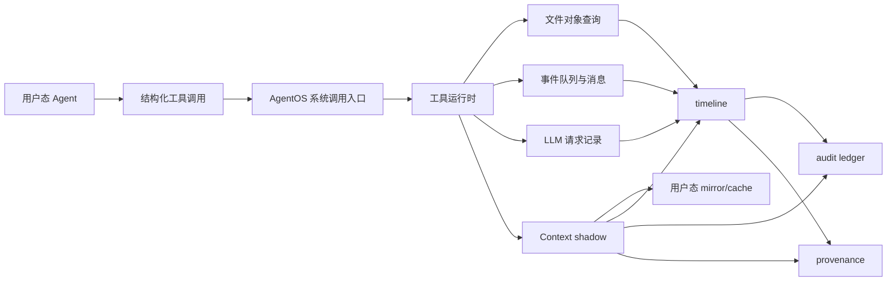

# AgentOS-uCore：面向 AI Agent 工作流的 uCore 内核支持层

[TOC]

## 评委快速入口

首次审阅请从 [竞赛评审入口](docs/contest/README.md) 开始。该页把赛题任务映射、最短验证路径、
提交材料、第三方来源和当前证据边界集中在一起；完整技术说明仍保留在本文后续章节。

> 评审数据统一从 [正式证据索引](evidence/releases/INDEX.md) 读取。每条记录绑定源码提交、
> 执行环境、原始材料和离线 Dashboard；开发日志和历史结果不作为当前 release 的数据来源。

## 一、基本信息

| 项目 | 内容 |
| --- | --- |
| 项目名称 | AgentOS-uCore |
| 基础系统 | uCore RISC-V 教学操作系统 |
| 项目定位 | 在教学操作系统中实现面向 AI Agent / LLM 工作流的通用内核机制 |
| 主目标 | 根目录 AgentOS-uCore 增强内核 |
| 对照目标 | `baseline_ucore/` 是共享基础安全加固、不含 AgentOS 扩展的 uCore 对照组，运行同一份有序场景清单和结果契约 |
| 主运行方式 | WSL2 Ubuntu / Linux + RISC-V 工具链 + QEMU |
| 源代码许可 | GPL-3.0，见 [LICENSE](LICENSE) |
| 文档许可 | CC-BY-SA-4.0，见 [DOCUMENTATION_LICENSE.md](DOCUMENTATION_LICENSE.md) |

## 二、项目简介

AI Agent 平台已经能够在用户态完成任务编排、工具调用、文件读写、多 Agent 协作和 LLM Relay。科研 Agent、代码 Agent、运维 Agent、写作 Agent 等应用都可以把任务拆成多个阶段，并在每一轮执行中根据工具结果继续决策。随着工作流变长，这些系统会不断积累上下文、文件状态、事件、权限和运行记录。

只停留在普通用户态时，上述状态通常散落在日志、普通文件、进程约定和应用层缓存中。上下文路径需要反复重建，文件对象查询依赖目录扫描和命名约定，事件等待容易退化成轮询，多 Agent 写同一对象时缺少统一仲裁，失败恢复和来源追踪也难以形成可信记录。操作系统原本负责进程、地址空间、系统调用、文件、调度和同步，但传统教学内核并不知道“哪个进程是 Agent、它正在处理哪一轮工具调用、哪些文件对象与当前决策有关、哪个事件唤醒了哪个 Agent”。

为了让这些问题落在一个可以运行、可以观察、可以对照的负载上，项目中实现了一套用户态科研 Agent 平台。平台作为示例和压力负载使用，业务逻辑保留在用户态：它把一次科研处理过程拆成多个阶段，由检索、分析、复核、恢复、写作和审计等角色程序协作完成，并把运行状态写成 `rp_*` 文件，供两个 uCore 目标和宿主机工具读取。

基于上述背景，我们在 uCore 中实现 AgentOS-uCore，把 Agent 进程身份、Agent Context、结构化工具调用、Context Path、文件对象元数据查询、事件队列、watch/wait/heartbeat、能力位授权、文件编辑租约、audit、timeline、provenance 和 LLM-friendly relay 记录做成通用内核机制。科研平台、设定的模拟流程、提示词、大模型调用策略和页面呈现仍由用户态负责；内核只提供可复用的系统能力。这个模拟流程用于承载示例负载，包含数据准备、比对处理、结果分析、报告生成和归档交付五个环节；示例中会让比对处理环节出现故障，再由多个 Agent 协作完成查询、分析、恢复和记录。

项目整体设计目标主要包括以下方面：

- **目标 1：Agent 进程和地址空间机制**
  在进程控制块中记录 Agent 身份、role、capability、quota、heartbeat、上下文区和运行统计，保证普通进程不能伪造 Agent 身份，并让 Agent Context 映射随 fork、exec、exit 正确维护。

- **目标 2：结构化工具调用运行时**
  提供工具名称协议和 id-based 快速协议，支持批量 `agent_run()`、参数键/类型校验、工具权限检查、syscall-only 工具区分和工具结果记录。

- **目标 3：可信 Context Path 与运行事实记录**
  用内核 shadow 保存可信历史，用用户态 mirror/cache 支持高频读取，记录工具调用摘要、完整 detail、cause/span、hash 链、timeline、audit 和 provenance。

- **目标 4：Agent 友好的文件对象查询**
  把文件 metadata 绑定到真实 inode，维护私有 `.agentmeta` 后端、属性索引、内容摘要、可解释查询计划、预取提示和文件编辑租约。文件查询每次实际执行扫描或索引候选遍历；需要复用结果时，由用户态把结构化结果保存到 Agent Context cache。

- **目标 5：事件驱动 Agent Loop 与多 Agent 协作**
  支持 watch、wait、wake、timeout、heartbeat、wait cancel、消息唤醒、调度原因记录、统一 timeline 查询和 LLM Relay 事件路径。

本仓库同时维护两个可比较目标：

- 根目录目标：AgentOS-uCore 增强内核。科研 Agent 平台保持相同输入、程序顺序和结果契约，关键阶段使用内核 Agent 服务。
- `baseline_ucore/` 目标：共享 syscall、文件系统和进程生命周期等通用安全加固，但不包含 AgentOS 服务。科研 Agent 平台全部运行在普通用户态进程和普通文件之上。

Task 6 固定 70 项有序程序；当前源码收据逐项重算出 28 项同源、42 项目标特定实现。两侧共享 challenge、阶段顺序和 outcome oracle，但完整场景不是同一二进制或单变量实验，因此只用于全栈诊断。同源兼容负载说明传统接口及应用全路径成本；内核机制的因果结论只来自同内核消融，不从 Task 6 或兼容负载总耗时作外推。

这种双目标设计让同一科研 Agent 工作流分别运行在共享安全基底对照和 AgentOS-uCore 上。对照目标说明纯用户态路径可以完成的工作，增强目标说明内核支持在文件查询、上下文读取、事件等待、失败恢复、权限控制和运行记录方面带来的差异。

综合分析项目创新点如下：

1. **Agent 进程成为内核可管理对象**：内核直接保存 Agent 身份、capability、事件状态、上下文区和调度提示，让 Agent 拥有系统级可管理状态。
2. **Context Path 采用 shadow + mirror 双区设计**：用户态可以直接读取 mirror 获得低开销状态，可信历史由内核 shadow 提供，兼顾性能和防篡改。
3. **工具调用从自然语言约定变成结构化系统接口**：工具名称、工具 id、参数键、参数类型、结果状态和错误码由 ABI 明确定义，便于 LLM Relay、多 Agent worker 和测试程序共同使用。
4. **文件查询从路径扫描扩展到对象语义查询**：文件对象可以附加 namespace、object id、type、state、owner、tags、digest 和 summary，并返回候选数量、扫描数量和查询计划。
5. **运行记录统一进入 timeline、audit 和 provenance**：Context、事件、调度、文件查询、权限拒绝、预取提示和 LLM 请求可以按同一套记录读取，减少用户态从日志中重新拼接运行事实的成本。
6. **块 I/O 与缓存按持久主体隔离**：进程 syscall 在入口捕获 PUBLIC 或 workflow owner 和 I/O class，内核维护显式建立 SYSTEM 或触发 workflow 的 background job；每次真实 `disk_submit` 是唯一物理计费边界，shared 560/280 与设备根同时扣减而不形成额外容量。准入时 account endpoint 不带债；reserved lane 只有取得真实 account lease 后，设备端才可为保证份额形成 debt，shared 永不带债。已接纳的有界原子多传输若耗尽 reserved/shared，后续真实提交可形成受请求上界约束的 owner lane debt，由 checkpoint 或 teardown settlement 清偿。全局 device debt 不绑定 owner 生命周期：NORMAL/BACKGROUND 非保护 lane 在其存在时被 gate，SYSTEM/CONTROL 保护 lane可以跨越；设备根 tick refill 优先偿还它，有界 request 与 protected aggregate envelope 共同限制上界。buffer cache 以同一稳定 owner 设置保留量和上限。
7. **高成本内核服务使用统一工作预算**：metadata action/依赖解析和 audit/span/timeline/provenance 查询都使用有界选集、单遍或有序归并，并按候选批次预付 kernel-work；计数查询和不复制结果的路径同样不能绕过公平边界。
8. **跨主体 pipe 只允许显式单跳委派**：一次性票据绑定发起线程的下一次主体创建并固定精确 file 对象；子主体获得端点但不获得继续传播权，失败、exec 和未知继承类别默认撤销或拒绝。
9. **Workflow 具有可信强制撤销生命周期**：内核把唯一根 controller 绑定到不复用的 control id；根退出或可信 factory 显式关闭时，scope 原子进入 CLOSING、立即撤销授权并协作终止全部成员，最后沿既有 RETIRING 回收路径释放资源。

## 三、完成情况

上一节说明项目为什么要同时保留科研平台负载和 AgentOS 内核机制。本节按赛题任务拆开说明已经完成的内容，并给出每一类能力对应的验证入口。

当前任务完成情况如下：

| 任务 | 当前完成内容 | 主要验证入口 |
| --- | --- | --- |
| 任务一：Agent 进程与地址空间 | Agent 身份、角色模板、capability、Agent Context 映射、fork/exec/exit 处理、普通进程隔离，以及由可信根/factory 驱动的 workflow 强制撤销。 | `agentfinal_ucore`、`agentsecurity_ucore`、`agentscope_ucore` |
| 任务二：结构化工具调用 | name-based 兼容接口、id-based 快速接口、批量 `agent_run`、参数键/类型校验、工具权限检查和结果记录。 | `agentfinal_ucore`、`agentbench_ucore`、`agentsecurity_ucore` |
| 任务三：Context Path | 内核 shadow 可信历史、用户态 mirror/cache、自动记录、手动 push、query、snapshot、rollback、clear、短摘要和 detail 记录。 | `agentfinal_ucore`、`agentscan_ucore` |
| 任务四：文件属性与摘要查询 | 真实 inode 关联、私有 `.agentmeta` 后端、属性索引、根目录自动扫描、内容摘要、查询计划、文件编辑租约和预取提示。 | `agentfs_ucore`、`agentscan_ucore`、`agentconflict_ucore` |
| 任务五：Agent Loop | FIFO 事件队列、stable control id 定向 IPC 路由、external/direct/attributed/source 分层核算、内核 origin 保留容量、watch/unwatch、睡眠等待、timeout、独立 heartbeat set/stop 与旧 ABI、wait cancel、调度原因、资源域两级公平调度和 timeline 等待读取。 | `agentloop_ucore`、`agentsecurity_ucore`、`agentsched_ucore`、`threadresource_ucore` |
| 任务六：综合场景 | 科研 Agent 平台作为示例负载和压力负载，运行检索、分析、复核、恢复、写作、审计和 LLM Relay 路径；双目标脚本生成可比较的状态文件，并只在原始证据可用时生成对应实验 CSV 和图表。 | `make dual-platform-run`、`make full-verify` |

工程化进展如下：

- [x] 建立共享安全基底的 uCore 对照组与 AgentOS-uCore 双目标目录结构。
- [x] 将 AgentOS 内核能力接入科研 Agent 平台主流程。
- [x] 实现 AgentOS 专项测试、双目标 QEMU 运行、状态文件对照和状态查看工具。
- [x] 提供默认离线 LLM Relay，并支持本机配置 cloud Relay。
- [x] 提供 Windows/WSL 依赖检查脚本和 Ubuntu 依赖安装脚本。
- [x] 提供覆盖四组机制对照、Task 6 双目标场景和内核成本的统一正式评价合同与 Dashboard 生成器。
- [x] 正式采集时，每项测量绑定 Guest/Host 原始日志、源码提交、执行环境和统计口径；已发布数据以正式证据索引为准。

实现、赛题映射和剩余边界集中在[要求追踪表](docs/agentos/requirements-traceability.md)与
[验证说明](docs/agentos/verification.md)。正式 release 只引用与源码提交绑定的 QEMU、Host
和 Dashboard 材料；未连接的远程 CI 在 manifest 中保持 `not-attached`。

## 四、方案设计

完成情况回答“做到了什么”，方案设计回答“这些能力怎样组织到操作系统和用户态平台中”。下面先看总体架构，再看各个内核模块如何支撑同一科研 Agent 流程。

### 4.1 总体架构设计

本项目的设计从 Agent 工作流的运行路径出发，将系统划分为三条主线：第一条是 Agent 进程和上下文管理，负责让内核识别、隔离并记录 Agent；第二条是工具调用和文件对象查询，负责把 Agent 对外部世界的操作变成结构化内核接口；第三条是事件、时间线和来源追踪，负责把多 Agent 协作中的等待、唤醒、恢复和记录组织成可查询的运行事实。

**面向 Agent 进程的内核支持。** 我们在 uCore 的进程模型上增加 Agent 身份、角色模板、能力位、上下文区、事件队列、心跳信息和运行统计。普通进程仍按原有 uCore 路径运行；Agent 进程在创建时由内核分配专属元数据和上下文页，之后的工具调用、事件等待、文件查询和审计记录都围绕该身份展开。Agent 实现不再堆叠在单个大文件中：`os/agent.c` 只保留不持有可写状态的兼容 facade，实际 owner 集合由 `ci/kernel-budgets.json` 版本化登记。metadata 控制面进一步拆为事务门 `agent_metadata.c`、incarnation-bound 文件状态 `agent_file_state.c`、catalog、query、scan、目录协调、对象操作和 COW store；Context、身份授权、IPC、生命周期、观测、通用资源控制器与 workflow lifecycle ledger 也各自由对应模块持有。

**面向工具调用和文件对象的系统接口。** Agent 的行动通过结构化工具调用进入内核，工具请求包含工具名称或工具编号、参数类型、参数值、payload 和执行标志；文件对象查询则通过 metadata、摘要、索引和真实 inode 关联完成。这样同一科研平台负载既能在共享安全基底对照上运行，也能在 AgentOS-uCore 上使用内核加速和内核记录。

**面向长期协作的运行记录。** 多 Agent 工作流会出现等待、唤醒、失败恢复、LLM Relay、权限拒绝、文件更新和报告生成等动作。AgentOS-uCore 将这些动作写入 Context Path、timeline、audit ledger 和 provenance 结构，使用户态可以按 Agent、span、工具、事件和时间读取运行过程。


| 层次 | 位置 | 职责 |
| --- | --- | --- |
| AgentOS-uCore 内核层 | `os/`、`nfs/` | 扩展进程控制块、系统调用、文件系统元数据、事件等待、审计记录和来源追踪。 |
| uCore 用户态层 | `user/`、`baseline_ucore/user/` | 提供专项测试、科研 Agent 平台程序、对照目标程序和 AgentOS 目标程序。 |
| 宿主机工具层 | `host_tools/`、`scripts/` | 构建运行、提取镜像状态、比较双目标结果、生成 CSV/SVG/HTML 材料和运行 LLM Relay。 |

根目录是增强目标，`baseline_ucore/` 是共享安全基底对照目标。两个目标共享科研平台的核心对象和运行请求，但内核支持程度不同。结构检查脚本会确认：`baseline_ucore/` 不包含 AgentOS syscall、Agent Context、内核文件 metadata、Agent 事件队列等增强符号；根目录包含 AgentOS 内核模块、用户态 ABI、专项测试和科研平台增强程序。

### 4.2 核心模块设计

总体架构把系统分成内核、用户态和宿主机工具三层。接下来按内核能力展开，每个模块都对应科研平台运行中的一个常见需求：身份、行动、记忆、文件对象、等待协作和大模型转发。

#### 4.2.1 Agent 进程与上下文区

本模块面向 Agent 身份、生命周期和地址空间管理。传统教学内核进程只能通过进程号、父子关系和文件描述符表达运行状态；Agent 工作流需要额外记录当前角色、能力、上下文、事件、心跳和运行原因。进程控制块只保存热路径身份、映射指针和生命周期句柄；完整 Context detail 与可信归因放入按活跃 Agent 分配、受资源账户计费的内核私有 sidecar，避免把固定大数组永久嵌入每个 PCB。`agent_create`、`agent_create_role` 和 `agent_info` 等系统调用让用户态能够创建 Agent、查询真实角色和读取能力位。

Agent Context 固定映射在用户地址空间中，内核同时维护可信 shadow 区、用户可读 mirror 区和用户自管 cache 区。shadow 区保存可信历史；mirror 区提供低成本直接读取；cache 区留给用户态 Agent 保存策略状态。一个活跃 Agent 的完整状态按 21 页整体接纳：9 页私有 detail/attribution sidecar、6 页用户 mirror 和 6 页可信 shadow；控制器先以一次 `RESOURCE_AGENT_STATE_PAGE` 向量预留完成原子计费，任何映射失败都统一回滚 21 页，不允许只发布其中一部分。进程还持有不可变的 workflow lifecycle key，即 `workflow_lifecycle_id + generation`。它不等同于可清除的 Agent/VFS 凭据：fork 后代即使降权为 PUBLIC，仍留在原 workflow 的撤销谱系中；exec 身份准备、地址空间发布和凭据提交使用同一事务边界；只有 terminal teardown 才释放 lifecycle 引用。

| 设计点 | 实现方式 | 作用 |
| --- | --- | --- |
| Agent 身份 | PCB 中保存 `is_agent`、role 和 capability mask | 普通进程不能伪造 Agent 状态。 |
| 上下文映射 | 固定高地址 Context 区，内核维护 shadow、mirror 和按需私有 sidecar | 支持可信读取和快速读取，同时降低 PCB 常驻体积。 |
| 生命周期处理 | 不可变 `(id, generation)` 随谱系传播，terminal teardown 统一释放 | 降权、fork 或 exec 不能逃离 workflow 撤销。 |
| 权限授权 | 敏感系统调用只读取内核 capability | 用户态传入的 role 字段不能提升权限。 |

#### 4.2.2 结构化工具调用运行时

本模块处理 Agent 的行动表达。成熟 Agent 框架通常会生成“工具名称 + 参数 + 结果”的结构化请求，操作系统如果只看到普通系统调用参数，就很难知道这次请求属于哪一轮推理、哪个工具、哪个对象和哪个错误状态。AgentOS-uCore 在内核中维护工具表、参数校验规则、工具可调用标记和权限要求，让工具调用以稳定 ABI 进入内核。参数 typed rule table 是 decoder、param count 和 V1/V2 可见 schema 的唯一来源，启动校验与 25 项 Guest 全表核对共同阻止描述和执行规则漂移。

用户态有两条调用路径：名称协议用于表达赛题中的结构化工具调用，便于科研平台和 LLM Relay 使用；编号协议用于高频路径，`agent_run` 可以一次提交最多 64 个操作。内核先校验用户指针、工具编号、参数键、参数类型和 capability，再执行工具，最后把结果写回结果表、Context Path、timeline 和 audit。

| 工具类别 | 代表能力 | 内核处理重点 |
| --- | --- | --- |
| 进程与系统查询 | 进程信息、系统状态 | 读取内核状态，返回结构化结果。 |
| Context 工具 | context stat、snapshot、push | 维护多轮历史和可信快照。 |
| 文件对象工具 | metadata 查询、摘要读取、对象更新 | 关联真实 inode、索引和内容摘要。 |
| 协作工具 | 消息发送、事件投递、等待唤醒 | 连接多 Agent 的协作过程。 |
| LLM 相关工具 | 请求记录、响应记录 | 记录 request id、span、摘要和完成事件。 |

下面这张图呈现一次 Agent 行动进入内核后的记录路径。



这条路径解释了为什么工具调用、文件查询、事件和 LLM Relay 能进入同一套 timeline 与来源追踪。

#### 4.2.3 Context Path、时间线和来源追踪

本模块记录 Agent 多轮行动。Agent 每次调用工具后，内核会写入一条 Context 记录，记录工具、状态、短 payload、短 result、tick、span 和 cause。最近 128 条记录以环形方式保存；完整请求和响应摘要保存在内核详情区；超出容量后按顺序淘汰，并更新 oldest、latest 和 dropped 计数。

同一进程的 Context 修改还经过可睡眠、FIFO、可重入的 commit lane。序号接纳、工具执行、结果/header 发布、Context syscall、IPC 状态记录、文件查询和 wait 归因都在这条 lane 内保持提交顺序；需要访问 metadata 时固定按 `lane -> metadata` 加锁，最终离开 lane 前断言调用者没有遗留 metadata 事务。Context 发布在修改可信状态前预检全部 shadow/mirror 范围，并按 record/body、latest、header-last 提交；这只保证 Context 内部发布，不把事件、watch、文件或 metadata 的外部效果伪称为同一跨子系统事务。`agent_call_count` 表示已接纳并保留序号的工具调用数，慢调用仍在执行时可以暂时领先；`latest_sequence` 只表示已经完整提交到 Context 的水位，两者不被误写成同一时刻必然相等。直接 mirror 读取也没有 publication epoch；需要并发一致视图时使用 `context_snapshot()`。

在 Context Path 之上，我们继续提供 timeline、audit ledger 和 provenance。timeline 把 Context、事件、调度、预取提示和 LLM 请求整理成统一记录；audit ledger 保存全局短记录和 hash 链摘要；provenance 把可见记录导出为因果关系。科研平台可以通过这些结构还原“哪个 Agent 先观察到失败、哪个 Agent 查询文件、哪个 Agent 触发恢复、哪个结果唤醒下一步”。

| 能力 | 用户态入口 | 说明 |
| --- | --- | --- |
| 自动记录 | 工具调用后自动追加 | 每次结构化工具调用都会进入 Context Path。 |
| 手动追加 | `context_push` | 用户态可以把关键阶段摘要写入同一条路径。 |
| 可信读取 | `context_snapshot`、timeline query | 从内核 shadow 和全局记录读取。 |
| 低成本读取 | 直接读取 Context mirror | 高频读取时减少系统调用次数。 |
| 来源关系 | span、cause、provenance edge | 多 Agent 协作中保留前后触发关系。 |

#### 4.2.4 文件对象 metadata、摘要和租约

本模块面向 Agent 的文件对象理解。普通文件系统以路径、目录项、inode 和文件描述符为核心；Agent 工作流更关心“这个文件属于哪个任务、当前状态是什么、是否是报告、是否已经失败、摘要是什么、哪个 Agent 正在编辑”。AgentOS-uCore 为文件对象附加 namespace、object id、type、state、owner、version、tags、labels、digest 和 summary，并把 metadata 绑定到真实 `dev + inum + incarnation`。`incarnation` 在 inode 槽复用时变化，避免旧 metadata、摘要缓存或租约错误命中新文件。

metadata 持久化使用私有 `.agentmeta` 双 bank，普通文件系统调用不能直接打开、创建、截断或删除后端文件。内核在 `timer_init()` 之后、运行时 I/O policy 和首个用户进程发布之前完成可信启动加载；单个 bank 损坏时从另一份可验证副本恢复，不存在可验证副本或可信判定失败时 metadata API 进入 fail-closed 状态，但 scope retirement 仍可按 VFS label 清理文件并释放生命周期身份。普通 workflow 文件变化先发布内存记录或 inode sidecar；只有 `PERSIST` 记录按 scope 进入固定窗口后台写回，volatile 微写不会制造空 checkpoint。后台 checkpoint 由触发它的稳定 owner 赞助并使用硬 `BACKGROUND` I/O 预算，尝试后的固定合并窗口负责请求聚合，不再用执行耗时放大 checkpoint 休整期。双 bank 写回按块推进：先使目标 header 无效，再更新并逐段验证变化的 payload，最后发布并回读 header；新主 bank 完整验证后才切换 active generation，随后才允许用同一不可变快照更新旧 bank。未使用的高水位块可复用。在新 primary 的 header 回读验证完成前，故障保留旧 active bank；切换后 mirror 更新失败时，已验证的新 primary 仍可恢复。进程态全局 metadata 事务门按单调 ticket FIFO 接纳，最外层释放只唤醒队首；scheduler 在门空闲时可取得硬有界维护轮次，但不会二次唤醒已由前任唤醒的 serving ticket。进程态查询、索引、显式依赖和预取扫描每处理 128 条记录计入统一 kernel-work 预算。scheduler 的每轮 16 目录项扫描只发布字段变化与线性索引。依赖表只保存每 scope 有界的显式用户边；兼容 `dependency_mask` 保持在文件记录中，由查询、action 和预取在既有线性扫描内按需解析，不再在全局事务门内物化超线性派生图。维护入口按字段变化掩码区分 state 索引和依赖代数，`ACTION_COMMIT` / `RERUN_STAGE` 以一次选集扫描和一次原子提交更新目标，不再为每个依赖对象重复重建全局图。查询预取复用缓存保存的精确命中槽，收集 scope 内有配额上限的依赖选择器后只扫描一次文件表，对目标全局去重并把单次副作用限制在 8 条提示内。跨 Agent 预取交接不再让裸 `proc *` 跨预算检查点存活：消息入队时只捕获 `slot + pid + control_id + scope` 稳定端点，长阶段仅处理局部快照，预付固定扫描预算后重新解析端点并原子发布；目标退出或槽复用时直接丢弃派生提示。同步持久化操作另通过 FIFO submit lane 排队并建立不可替换的 COW job，不把调用返回解释成 primary 已验证；条件检查、事务门释放和等待入队处于同一关中断临界区，避免丢失唤醒。协调扫描仍使用独立的非滑动请求合并和四倍扫描耗时自适应休整，使 metadata 满表后的未绑定文件微写不能制造无间隔全根扫描。查询时，内核可以按 state、label、type 等字段走索引路径，也可以执行扫描路径；查询结果会返回候选数量、扫描数量、命中数量、查询计划和原因。文件内容摘要由受权 Agent 读取，重复读取同一版本可以命中 digest cache。编辑文件时，Agent 可以申请租约，内核在真实写入、截断和删除路径检查持有者和版本，降低并发覆盖风险。

inode 的 `agent_meta_slot/flags/version` 不再由 catalog、scanner 或目录钩子各自写入，而只通过 `agent_file_state_set_index()` 校验并持久化；失败会恢复旧 sidecar。write、sync、truncate 和 delete 也统一进入 `agent_fs_apply_inode_event()`，create 则在 VFS 对象成功发布后进入同一目录协调边界。容量型未索引对象以明确的 deferred sidecar 状态持久保存，catalog 仍饱和时不会因后续微写反复触发全目录扫描；这套机制不让 metadata 容量失败回滚已经成功的普通 VFS create。

| 设计点 | 实现方式 | 测试入口 |
| --- | --- | --- |
| 真实文件绑定 | metadata 记录 `dev + inum + incarnation` | `agentfs_ucore`、`agentvfs_ucore` |
| 私有后端 | `.agentmeta` 只允许 Agent 子系统内部访问 | `agentsecurity_ucore` |
| 合并写回 | scope-local dirty/durable 代数、PERSIST 分流、固定窗口、分块 COW 状态机与 `BACKGROUND` I/O 预算；扫描保留独立自适应休整 | `agentscope_ucore`；BACKGROUND 设备预算仍缺独立动态压力 |
| 事务公平 | FIFO ticket/wake-one、scheduler 有界保留轮次、128-record 工作预算、按需依赖解析、字段化维护、批量状态提交、最多 8 条去重预取及稳定端点交接 | `agentfs_ucore`、`agentscope_ucore`、`agentscan_ucore` |
| 索引查询 | state、label、type 候选集 | `agentbench_ucore`、双目标实验 |
| 内容摘要 | 读取短预览、长度和 hash | `agentfinal_ucore`、`labdemo_ucore` |
| 编辑租约 | 持有者检查和版本提交检查 | `agentconflict_ucore` |

#### 4.2.5 Agent Loop、事件队列和调度提示

本模块处理长期运行 Agent 的等待与协作。用户态平台可以通过轮询文件观察状态变化，但轮询会浪费 CPU，也难以说明是哪一个事件唤醒了哪个 Agent。AgentOS-uCore 为每个 Agent 维护 FIFO 事件队列、watch 列表、heartbeat、timeout deadline、wait cancel 令牌和调度原因记录。

Agent 调用 wait 后，如果没有匹配事件，有限 timeout 和无限等待都会进入睡眠。事件入队、heartbeat 到期、deadline 到期或取消请求会唤醒目标 Agent。heartbeat 到期产生不受 watch/unwatch 抑制的 SYSTEM TIMER；同一 Agent 最多保留一条未消费 heartbeat，避免慢消费者形成周期性积压。周期可动态重设，独立 stop 幂等关闭后续生成，512 号旧 ABI 继续兼容。调度器先严格轮转 active 进程资源域，再在选中域内按 FIFO 或 Agent 软评分选择线程；Agent burst 只影响本域候选，不能让一个多线程域跳过其他 active 域。选择 Agent 时记录事件数量、deadline、heartbeat、priority、budget 和虚拟运行量等信息，用户态可以读取最近调度原因，解释某次运行来自消息、文件状态变化、心跳还是超时。

| 场景 | 普通用户态做法 | AgentOS-uCore 做法 |
| --- | --- | --- |
| 等待文件状态 | 周期性扫描状态文件 | watch 文件对象事件并睡眠等待。 |
| 多 Agent 消息 | 写普通消息文件或约定字段 | 内核消息和事件队列唤醒目标 Agent。 |
| 心跳 | 用户态定时写日志 | 内核维护 heartbeat tick 和 timer 事件。 |
| 等待取消 | 约定取消标记 | 内核 wait cancel 令牌唤醒等待者。 |
| 调度解释 | 只能看程序日志 | 读取调度原因和 timeline。 |

#### 4.2.6 LLM Relay 与科研平台负载

前面几个模块都属于内核通用机制；科研平台只是把这些机制串起来的一个较完整用例。LLM Relay 也是同样的分工：模型调用由用户态或宿主机完成，内核负责记录请求、响应、事件和权限。

本模块把 LLM 调用纳入 AgentOS 的通用记录路径。内核不保存 API key，也不直接实现 HTTP/TLS；云端模型访问由用户态或宿主机 Relay 完成。内核负责处理 LLM 请求编号、请求 Agent、span、超时、预算、prompt 摘要、response 摘要、Relay capability、完成事件和审计记录。默认测试使用模板 Relay，配置本机密钥后可以切换 cloud Relay。

科研 Agent 平台是主要示例负载。平台中的设定的模拟流程、项目名、阶段名、报告内容、恢复策略和提示词都位于用户态程序、输入文件或宿主机工具中。内核只提供通用 action、artifact、metadata、event、timeline、audit 和 provenance 机制。模拟流程的五个环节分别是数据准备、比对处理、结果分析、报告生成和归档交付；这些环节只是用户态负载中的标签，内核按通用 metadata、依赖、事件和动作记录处理。这样同一套 AgentOS 能力可以继续服务代码 Agent、运维 Agent、数据流水线 Agent、游戏 NPC Agent 和写作 Agent 等不同场景。

#### 4.2.7 安全加固与资源韧性

AgentOS-uCore 将普通用户可触发的坏地址、同步取消、长 syscall 垄断、文件系统耗尽、进程退出、僵尸积压和 fork bomb 统一视为可恢复的资源与生命周期问题。syscall 在产生副作用前复制并校验用户输入。调度器为每次线程 dispatch 建立周期 deadline 和工作量预算，syscall 只进入或退出同一预算域，不能靠反复陷入刷新时间片；timer 到期先记录 pending，控制台、pipe、exec 分页、fork 页表快照、普通文件块 I/O 和 Agent batch 只在原子进度已提交、临时状态已释放后进入安全点。fork 复制期间由进程级 VM snapshot 屏障暂缓同进程 sibling，其他进程仍可运行。普通文件读写若已在安全点完成一次调度，会以合法短读/短写把已提交前缀交回用户态；loader 和 metadata exact-read helper 在文件系统原子段之外偿还预算并从该前缀继续，而不是把合法短 I/O 当成损坏。截断和最终 inode 回收则先 detach 映射，再用不可取消的 cleanup checkpoint 分批回收。

进程、线程、全局文件对象、文件系统 block/inode、buffer cache 和 Agent 私有状态页统一通过 `os/resource_controller.c` 计费。控制器以 generation-safe `resource_account` 表示 EXEC 或 STORAGE 账户，以 ordinary/reserved 类别实施账户上限、普通全局水位和系统保留量，并提供原子向量预留、提交、取消、转移与挂载重建核算。进程与主线程、pipe 两端等复合 admission 因而不会只发布一半；账户进入 CLOSING/DRAINING 后，只有成员、持久用量、临时预留和速率 lease/debt 全部归零才可复用。`resource_domain_id` 只表示调度器的 CPU 公平分区，不再充当资源计费身份；调度器仍以该分区做外层轮转，单个 PUBLIC 进程增加线程不会扩大跨域 CPU 份额。持久块和 inode 则按稳定 `storage_principal_id` 映射到 STORAGE account，当前普通进程统一使用安装级 PUBLIC principal 2，退出或重启都不能清零。

完整 Agent 状态也走同一控制器：每个活跃 Agent 以一次 `RESOURCE_AGENT_STATE_PAGE` 请求原子取得 21 页，即 84 KiB，其中 9 页是私有 detail/attribution sidecar，6 页是用户 mirror，6 页是可信 shadow。六项总状态逻辑预算依次为：每进程 `86016` B、全局 `11010048` B、ordinary 池 `8257536` B、reserved 池 `2752512` B、单 ordinary 域 `5505024` B、单 reserved 域 `688128` B。为继续观察 detail 数据结构本身，CI 另保留 sidecar-only 的 9 页预算：每 Agent 36 KiB、全局 1152 页（4.5 MiB），ordinary/reserved 池 864/288 页，单 ordinary/reserved EXEC account 576/72 页。idle 普通进程不分配这些页，典型占用随活跃 Agent 数增长；上述数值都是 `kalloc` 之上的逻辑 admission，不是全局 OOM 下预先钉住的物理页。

每线程仍保留 16 KiB 内核栈虚拟槽、4 KiB 未映射 guard 和 canary，但物理栈页改为线程 admission 时按需分配，并在 scheduler 已切回 idle stack 后释放。32 MiB 是全部 `NPROC * NTHREAD` 槽的虚拟容量，不是启动常驻物理占用；8 MiB 才是受信/保留线程的物理栈保留池，普通线程从通用页分配器取得 live stack。启动/调度使用的 `boot_stack` 是与线程栈分开的 64 KiB 物理栈；构建门同时核对其链接符号跨度和从 `main` 出发的调用图预算。

块设备路径沿用持久主体身份，而不是 PID 或短命进程资源域。PUBLIC、每个 active workflow 和 SYSTEM 分别拥有速率 bucket；workflow 的普通、控制与后台工作使用不同 class。ABI v5 把 shared 改成与 560/280 设备根同尺寸的机会流量门，而不是额外保证：单一前台 owner 可借空闲设备容量；出现异域活动或排队后停止直接借用，排队 shared grant 按 owner/class cursor 轮转，后台工作不能借用。准入时 account endpoint 不带债；reserved lane 只有取得真实 account lease 后，设备端才可在根信用暂空时形成 debt，shared 永不带债。请求完成首笔 reservation 后，已接纳的有界原子多传输若耗尽 reserved/shared，后续真实提交可形成受请求上界约束的 owner lane debt；owner lease/debt 由 checkpoint 或 teardown settlement 清偿，未获准请求不得裸透支。全局 device debt 可以跨 request 和 owner lifecycle：NORMAL/BACKGROUND 非保护 lane 会等待其清零，SYSTEM/CONTROL 保护 lane仍可前进；设备根 tick refill 优先偿还它，有界 request 与 protected aggregate envelope 限制最坏上界。每次真实 `disk_submit` 是唯一物理计费边界；volatile 掉电测试 overlay 的内存命中不计物理 I/O，批量写回的每个块和最终 FLUSH 分别计费。退出撤销会归还未消费 lease。scheduler 每轮先在 idle context 安装 kernel trap 向量并短暂打开中断，使唯一 runnable 线程即使反复在内核态 pipe 路径 `yield()`，timer/device 中断仍有固定交付窗口，I/O debt 与后台 token refill 不会因长期不返回用户态而停摆。

buffer cache 同样记录稳定 sponsor，为 SYSTEM、PUBLIC 和每个 active workflow 设置 floor/cap，跨域命中不会刷新原 sponsor 的 LRU，超上限的 transient buffer 在释放时失效。每个 buffer 另有 exclusive holder、递归深度和私有等待队列；进程在持有 buffer 或处于复合文件系统原子段时只会延后预算检查，只有释放全部 buffer 且对象状态已提交的 quiescent checkpoint 才能睡眠。不可回滚的 qmap claim、truncate 和清理路径使用 cleanup checkpoint 完成前向提交。

由主线程触发的正常 `exit()`、用户 page fault、非法指令、workflow 撤销和未发布构造回滚进入同一正向 teardown 状态机：`LIVE -> REQUESTED -> QUIESCING -> DETACHED -> RECLAIMING -> SETTLING -> HANDOFF -> PUBLISHED -> RECYCLED`。面向进程生命周期的 Agent 清理只暴露 phase-aware、幂等的 `agent_proc_teardown()`：QUIESCING 撤销继续发布的控制权，RECLAIMING 释放 Context 并清除身份，SETTLING 验证 Agent 私有状态和 Agent state page 计费已经归零；通用 process/thread/file/I/O 账目仍由外层 teardown 后续阶段结算，调用方不再手工拼接多个 Agent 清理函数。状态机只有一个 `teardown_owner_tid`，第一次退出码生效；进入 REQUESTED 后禁止发布新的进程所有对象。它依次让 sibling 从阻塞点展开并分离 child/FD，回收文件、Context 状态和 VM，结算 cleanup I/O、kernel-work、lease/debt，随后清除凭据并释放 lifecycle 引用。scheduler 在 idle stack 上发布和回收最后内核栈，最后才复用进程槽与资源账户。非主 sibling 正常退出或 fault 仍只回收自身线程。

workflow 生命周期为 ACTIVE -> CLOSING -> RETIRING，并由独立的 8 槽 generation-safe ledger 管理，ACTIVE+CLOSING 最多 4 个。槽可以在彻底回收后复用，但每次复用都取得更高 generation；旧 `(id, generation)` 永远不能指向新 workflow，generation 耗尽时拒绝复用。唯一根 `agent_control_id` 仍是不复用的关闭权身份，但它与 lifecycle slot 不是同一概念。可信 factory 关闭、根 controller 自行关闭或退出都先使 Agent/VFS 授权失效，再按精确 lifecycle key 撤销 active、pending 和已经降权为 PUBLIC 的 fork 后代。CLOSING 保留完整 I/O/cache 归因直到最后成员沿统一 teardown 结算；RETIRING 再以 `BACKGROUND` 预算和临时 3/8 cache floor/cap 分步清理 namespace、metadata 与 detached block。

syscall 546 `agent_workflow_lifecycle_info()` 只读取调用进程自身的 lifecycle 快照，或把调用者给出的 expected key 与当前 key 做精确比较。共享 ABI 使用可扩展的 sized-prefix，返回 `charged`、不可变 `(id,generation)`、Context commit lane 和 metadata transaction gate 的运行状态。这个 key 只是身份与比较值，不是 bearer credential；它不能查询其他进程、关闭 workflow 或取得任何对象能力。

Agent 专属安全链由构建期可信映像清单、loader 映像绑定、bootstrap/role grant、capability 和 VFS 文件安全域组成。可信 bootstrap factory 只能通过内核签发新的动态 workflow scope，scope 内 orchestrator 只能委派本域角色；敏感对象访问必须同时命中 capability、active scope 和精确 owner。workflow 的关闭权不由 PID、父子关系、角色名或 `ORCHESTRATE` capability 推导，而是由创建发布前写入生命周期账本的根 `agent_control_id` 精确绑定；低权限 Agent 和后创建的 Orchestrator 都不能关闭或继续钉住该 scope。跨 Agent 消息默认拒绝，只有同 scope 且命中 stable control id 入站路由后才能投递；`MESSAGE_SEND` 不授予等待控制权，等待取消还必须具备独立 `WAIT_CANCEL` capability 并命中直接 controller 关系。公共 `agent_wake()` 只能发送普通消息，系统事件由专用内核路径产生；调度器允许 orchestrator 配置域内软策略，但 Agent burst 和评分逃生边界也只在域内生效，外层资源域轮转不可配置。完整威胁模型、实现位置、自定义 Agent 注册步骤和专项测试入口见 [安全加固与资源韧性设计](docs/agentos/security-hardening.md)。

为防止机制性修复再次把内核推向臃肿，`.gitlab-ci.yml` 和 `make ci-check` 使用 `ci/kernel-budgets.json` 作为可审查事实源，限制内核源码行数、ELF/raw 镜像、text/data/BSS/总运行体积、`struct proc`、Context sidecar 与完整 21 页 Agent 状态的单实例/全局/分类/账户上限、线程栈深度与虚拟/物理容量、64 KiB boot stack 的实际跨度和调用图。每个 owner 模块、integration bridge、允许依赖和 SCC 边界均来自同一版本化注册集合，不在文档复制容易漂移的固定数量。metadata 拆分单元及其 contract headers 还共同进入 `metadata_control_plane` 聚合预算：source 只保留固定接口开销，loaded text 与 BSS 不得增长，因而不能靠把状态或代码迁到另一个文件绕过 downward ratchet。预算 checker、通用 QEMU monitor 和生产 profile validator 的 fail-closed 自测集合也以源码和配置为准。

通用 QEMU runner 采用二进制全量 drain，并大小写不敏感识别包括 panic 在内的预定义 failure 模式；每轮最多读取一个 64 KiB 块并重新检查 case/marker deadline，持续输出不能饿死超时。每个 case 的总输出上限为 16 MiB，未终止记录最多保留 64 KiB，诊断行最多保留 4 KiB；输出或记录越界 fail closed，诊断副本有界截断。case deadline 在完成判断之前生效，并在 feed/notice 后重新核对，迟到 marker 不能伪装成功。普通 profile 必须自然 `rc=0`；checkpoint profile 只接受完整 marker 后 runner 发出的单次 `SIGTERM`；powercut profile 则要求认证 supervisor 在完整 marker 后以 `SIGKILL` 直接终止稳定身份的 QEMU leader，隔离并回收跨 `setsid()` 的全部后代，再提交带随机 nonce、PID/starttime 和镜像退出码的完成证明。workload 自行杀死 leader 或 supervisor、控制通道 EOF、残留后代、超时、非零退出和 marker 后 panic 均失败。powercut 是“宿主强制中止 VM 后检查原始磁盘”的突然 VM 终止模型；它比 `SIGTERM` checkpoint 更接近掉电边界，但不会清空宿主页缓存，也不等同于整机物理断电。当前 Agent 套件为 18 case，checker 只接受完整有序的 18-case timing file。冻结提交 `a9e7c67feda5` 的三轮总时长为 `269.1409306s`、`271.32236290000003s`、`281.8869957s`，中位基线 `271.32236290000003s`，确定性上限 `284.889s`；71 文件校准包绑定源码指纹 `847d5218...ffd`。这些校准值不等于完整发布通过，完整发布状态仍由最终 C→E bundle 决定。

Reader seeded-action runner 另把 clean、build、guest 明确分阶段：clean/build 只按子进程退出码判定，只有 QEMU guest 启动后才逐条完整匹配 Guest panic/fault/check-failed 记录。构建输出中的 `build/riscv64/ch6b_panic` 因而不会再被字符串扫描误判；对应单测同时要求这种文件名通过、规范 Guest `[PANIC ...]` 行失败。

### 4.3 模块组合后的运行路径

一次典型科研 Agent 运行会经过以下步骤：内核选定的可信 init 使用启动 grant 创建 orchestrator；orchestrator 显式委派其他角色并写入文件对象 metadata 和依赖关系；sentinel 观察失败状态并写入 Context；investigator 根据 metadata 和预取提示读取相关文件摘要；recovery 通过通用 action 更新对象状态；writer 或 Relay 写入报告摘要；orchestrator 最后读取 timeline、audit ledger 和 provenance。普通 `fork/exec` 子进程不继承启动 grant。每一步都可以在用户态看到业务结果，也可以在内核结构中看到对应的工具调用、事件、权限判断和来源关系。

| 阶段 | 用户态动作 | 内核机制 |
| --- | --- | --- |
| 初始化 | 写入科研对象、依赖、角色 Agent | 文件 metadata、dependency、capability |
| 观察 | 发现失败、发送事件 | Context Path、event queue、timeline |
| 分析 | 查询文件、读取摘要、请求 LLM | metadata index、digest cache、LLM request |
| 恢复 | 提交恢复动作、更新状态 | action commit、artifact update、idempotency |
| 写作 | 生成说明、记录报告摘要 | Context detail、artifact metadata、provenance |
| 汇总 | 读取运行事实 | audit ledger、timeline query、provenance snapshot |

## 五、构建与运行

前面的章节说明项目结构和设计。本节给出实际运行顺序：先检查环境，再分别运行对照目标和增强目标，最后用双目标脚本生成可对照的结果材料。

### 5.1 依赖检查

Windows 用户克隆仓库后，先在 PowerShell 中运行：

```powershell
.\scripts\check-windows-prereqs.ps1
```

进入 WSL/Ubuntu 后，在仓库根目录运行：

```bash
make doctor
```

如果 Ubuntu 中缺少依赖，可以运行：

```bash
bash scripts/install-ubuntu-deps.sh
```

仓库不内置 QEMU、RISC-V GCC/binutils、WSL 发行版或云端模型密钥。这些内容依赖本机环境或涉及私密配置。公开验证默认使用离线 LLM Relay，不需要外部密钥。

### 5.2 共享安全基底对照目标

对照目标不属于 AgentOS 系统本体。它与主目标共享不依赖 AgentOS 的 syscall、同步、文件系统和进程生命周期安全加固，但不提供 Agent syscall、Agent Context、Agent 文件 metadata 或 Agent 事件队列。它用于比较哪些工作由普通用户态约定完成，哪些工作可以交给 AgentOS 内核机制。

```bash
make plain-platform-build TOOLPREFIX=riscv64-linux-gnu-
make plain-platform-run TOOLPREFIX=riscv64-linux-gnu-
```

对照目标运行科研 Agent 平台的用户态版本，使用普通进程、普通文件、`fork`、`exec`、`waitpid`、`open`、`read`、`write`、`close` 等机制生成 `rp_*` 状态文件。

### 5.3 AgentOS-uCore 目标

增强目标运行相同的 70 项有序场景清单，但关键阶段会进入 AgentOS syscall。当前清单中 28 项源码逐字相同，42 项是目标特定实现；Host 会把逐程序 SHA-256 和关系收据绑定进每个 boot。该对照衡量完整系统路径的综合效果，不用于证明单个 syscall 或 AgentOS 整体更快。单机制因果结论由 5.4 节的同内核消融实验提供。

```bash
export AGENT_TEST_DURATION_PROFILE=none
make agentos-user TOOLPREFIX=riscv64-linux-gnu-
make agentos-build TOOLPREFIX=riscv64-linux-gnu-
make agentos-test TOOLPREFIX=riscv64-linux-gnu-
make agentos-platform-build TOOLPREFIX=riscv64-linux-gnu-
make agentos-platform-run TOOLPREFIX=riscv64-linux-gnu-
```

增强目标运行同一科研流程，关键阶段会调用 AgentOS 内核服务。`agentos-test` 会执行 AgentOS 专项测试，覆盖 Agent Context、工具调用、Context Path、文件 metadata、事件循环、调度、LLM Relay 模板路径、权限拒绝和并发冲突控制。

#### 5.3.1 竞赛现场快速演示

```bash
make contest-demo TOOLPREFIX=riscv64-linux-gnu-
make contest-demo-check
```

`contest-demo` 只接受干净提交，不读取历史 `results/`，也不连接云 API。它为
`agenteval_ucore` 和 `labdemo_ucore` 构建隔离镜像并启动两次真实 RISC-V QEMU。第一条
路径用本轮非零 challenge 复用正式评价合同，动态核验任务一至五 receipt、工具目录与
typed KV 错误矩阵、六轮 Context/rollback，以及题面要求的 N 路径遍历与 metadata 索引
对照；Host 同时复验受管测量源码和编译闭包，不能用硬编码 marker 代替执行。第二条路径
只运行短版多 Agent 恢复、审计、时间线和 provenance 场景。报告将任务六的完整 `rp_*`
科研平台验收明确标为 `unavailable`，不会显示虚构的“6/6 通过”。性能数字是单次启动的
现场观测，不替代正式多启动统计或 `evidence/releases/` 发布证据。

直接调试内核时，`make run` 会原子安装当前源码生成的全新可写镜像，确保用户程序、可信清单和 `INIT_PROC` 不会沿用旧版本。需要验证同一磁盘的持久状态时使用 `make run-persist`；该目标只在可写镜像不存在时初始化一次，之后原样重启 `nfs/fs-copy.img`，不自动迁移或覆盖不兼容格式。`baseline_ucore/` 下提供同名的两种入口。

日常重建可用 `make clean` 清理 AgentOS 默认产物，或用 `make dual-clean` 同时清理对照目标。长期调试产生大量命名构建目录后，先运行 `make clean-workspace-dry-run` 预览，再运行 `make clean-workspace` 统一删除白名单内且被 Git 忽略的 `build-*`、`target-*`、`asm-*`、镜像和缓存。该目标不会删除本地验收结果、受版本控制的源码与 `evidence/` 发布证据。

### 5.4 实验评价体系

实验分支把“采集、验证、展示”拆成独立入口，避免页面或旧结果反向成为性能证据：

```bash
export AGENT_TEST_DURATION_PROFILE=none
make evaluation-doctor
make evaluation-smoke
make evaluation-run EVALUATION_BOOTS=7 TOOLPREFIX=riscv64-linux-gnu-
make evaluation-verify
make evaluation-kernel-cost TOOLPREFIX=riscv64-linux-gnu-
make evaluation-full-verify TOOLPREFIX=riscv64-linux-gnu-
make evaluation-dashboard
make evaluation-package
make evaluation-package-development EVALUATION_RUN_DIR=<run-dir> EVALUATION_BUNDLE_DIR=<output-dir>
make evaluation-package-verify EVALUATION_BUNDLE_DIR=evidence/releases/evaluation-<run-id>
```

普通 Linux、WSL 和普通 Runner 必须显式使用 `none`：18 个 case、语义检查、Guest 日志和
完整 timing 行清单仍是必需项，但本地 E3 wall-time 基线、上限和比例记为不适用。只有与
校准记录逐项一致的受信原生 MSYS2 E3 才能改用：

```bash
export AGENT_TEST_DURATION_PROFILE=local-e3
make evaluation-doctor
make evaluation-full-verify TOOLPREFIX=/opt/xpack-riscv/bin/riscv-none-elf-
```

`local-e3` 会校验精确的硬件、MSYS2 runtime、工具文件和配置身份；当前配置绑定
`a9e7c67feda5` 的完整三轮校准。受管输入、profile 或证据任一漂移都会在进入 QEMU 前 fail closed。

正式采集只接受一个完整 POSIX 执行域：原生 Linux、由 Windows Host 指定并验证的
`EVALUATION_WSL_DISTRO`，或通过严格运行时证明的原生 MSYS2。Windows/WSL 入口会先在
该发行版内用 `wslpath` 确认仓库映射，
检查 Python 3.10+、RISC-V gcc/binutils/size、QEMU `virt`、Make、Bash、timeout、
readlink 和 sha256sum，再把 `run`、`verify`、成本、Dashboard 与打包整体重新执行到
同一个 WSL 域；不会再用 Windows 原生工具跑 micro、再用 WSL 跑科研场景。旧版 WSL
没有 `wsl --version` 时不误判失败，但仍绑定 `wsl.exe` 文件 SHA256，并要求指定发行版
完成全部动态探测。Windows 可用
`EVALUATION_WSL_TOOLPREFIX` 和 `EVALUATION_WSL_QEMU` 指定发行版内的工具名。

当 WSL 服务不可用时，正式入口也可在完整 MSYS2 环境中运行，但这不是放宽为 Git
Bash、Cygwin 或 Windows Python。预检联合要求 `os.name=posix`、MSYS2 Python 实际报告的
`sys.platform=cygwin`、`MSYSTEM=MSYS` 与 `MSYS_NT-*` kernel，并显式拒绝
`CYGWIN_NT-*`、MINGW runtime 和混合 Python。它绑定 `uname`/Windows build、
`msys-2.0.dll`、`cygpath`、Host objdump 及全部构建/QEMU 工具的绝对 POSIX 路径和
SHA256，验证控制面程序实际导入该 MSYS runtime，并对仓库、工具和临时目录执行
POSIX/Windows namespace 往返核对。`run`、`verify`、成本、Dashboard 和 package 都会
整体重入同一个 `env -i`；内层重新散列工具并校验环境 allowlist，不会只相信可伪造的
marker。MSYS2 正式 campaign 在清单中记录 `execution_domain=native-msys2`，科研场景记录
`native-msys2-clean-shell`，并把完整 platform proof 封入 campaign、在每个 boot 前复核
runtime 与工具文件。中文仓库路径使用固定 `C.UTF-8` locale；原生 Linux/WSL
仍保持原来的 `C` locale 合同。

platform proof v2 在 Linux、WSL 和 MSYS2 中统一从 `/proc/cpuinfo`、`/proc/meminfo`
记录 CPU model、logical CPU count 和总内存，明确忽略会随负载变化的 `cpu MHz`。这些
字段由 `campaign_sha256` 覆盖并在每个 QEMU boot 前重验；缺项或畸形输入直接失败。
科研场景 plan schema v5 也绑定同一 platform proof 及其 canonical SHA256，并在每轮 pair 前后
重验，不能把 micro 结果带到另一台机器继续采集场景。
公开 proof 不保存 hostname，MSYS 只保留复现实验所需的 Windows build、kernel 和
machine 信息。

`evaluation-run` 只允许在 clean commit 上运行，并分别预检微基准与科研场景实际执行域中的 QEMU、交叉工具链和 shell。formal run id 固定为 `formal-<源码提交 C 的完整 40 位提交号>`；各组 challenge、AB/BA 顺序和规范命令由源码提交 C 确定性派生，因此不同 clone 对同一 C 得到同一计划。失败目录保留且同一输出根不会覆盖，但在没有受保护远端 Runner 时，本地机制不能证明其他 clone 从未执行或丢弃过一次尝试。关键工具以绝对路径、版本和 SHA256 写入清单，每个 boot 前后重新核验；campaign 还绑定创建时的仓库相对 artifact root，拒绝仅后缀相同的外部日志或镜像。首个 QEMU 前生成 run plan schema v2、scenario plan schema v5 和版本化 `measurement-source-receipt.json`，绑定停止规则、顺序、完整 Guest 测量源码清单及评价控制面策略清单；每个 boot 前后重验源码，package 快照还必须与 C 中相应 Git blob 一致。

默认正式评价恰好包含 7 次同内核机制微基准 boot、7 轮 Plain/AgentOS 传统兼容路径配对和 7 轮 Plain/AgentOS 科研场景配对，总计 35 次 QEMU 启动，因此耗时明显长于普通回归。微基准使用唯一非零 64-bit challenge；兼容路径与场景使用由提交派生的独立 challenge，并跨 boot 交替 Plain→AgentOS 与 AgentOS→Plain。整轮采集先取得 `git-common-dir` 下独立的 campaign 锁，不同 worktree 的正式评价因此串行；每个 build/QEMU/archive 阶段再取得现有 repo 锁，并在锁内复检计划状态、clean HEAD、工具身份，清空本轮日志以及归档 Guest/runner 日志、内核和运行前后文件系统镜像。这些 Host 复核位于 Guest 计时窗口之外。微基准单 boot 的 900 秒看门狗由 campaign schema 固定，并同时绑定外层进程监督和 Guest runner，调用方不能再通过未记录的环境变量制造更早截止。科研场景的 `EVALUATION_SCENARIO_TIMEOUT` 是每个目标的 runner 基础预算：clean、build、guest 三阶段各使用 `T+30` 秒，目标清理另留 10 秒；一轮 Plain/AgentOS 配对的 Host 硬期限严格派生为 `2 * (3 * (T + 30) + 10) + 60` 秒，默认 `T=600` 时为 3860 秒。任一外层期限到达都会终止进程组、保留部分日志并把 manifest 标为失败。正式采集期间仍不得从不遵守这些锁的外部终端并发构建同一 worktree。任何 boot 失败都会保留当次材料并使采集失败，不会删除失败样本或补零。仅开发接线时可显式设置 `EVALUATION_INCLUDE_SCENARIO=0`；这种运行的任务六和兼容成本状态必须是未测量，不能用于正式结论。

传统兼容路径不再自行拼接一套宽松宿主环境：它从同一 micro platform proof 推导精确的 clean child environment，并在 formal context v2 中绑定摘要。native-msys2 的 `SYSTEMDRIVE`、原生临时目录和 POSIX `TMPDIR` 均为必填且在 build、QEMU 与离线复验间一致；缺失或伪造盘符会在启动前 fail closed，不能把 Windows 缓存误写进源码树后再加入忽略规则。

`evaluation-verify` 从原始日志重算 workload challenge、Task 1-5 动态功能回执、Task6 v3 challenge receipt、结果等价性、每 boot 聚合和跨 boot 配对统计；只有合同验证通过才产生 summary。Task 2 的正式合同逐项解析版本化工具目录，只固定赛题必需的 core subset，不固定合法目录总数或可调用项总数；新增合法工具不会使验收失效，重复 ID/name、错误 schema 及被失真的 unknown/mismatch/duplicate/wrong-type 状态与诊断则 fail closed。Task 3 必须由至少六次连续生产 `agent_run` 自动形成 Context，随后执行 rollback 和新的真实工具调用；Host 独立重建 challenge 绑定的序列、path parent 与结果语义。Task 4 使用同一批 challenge 绑定真实文件：竞赛主对照 `file_query_path_index` 对预注册 corpus 的全部 N 条路径逐一执行 open/read/fstat/close 和属性检查，再与 ready index 比较；原 512 槽 metadata 扫描保留为 `file_query_table_ablation`，只解释内核机制，不能代替题面对照。suite 的 `execution_schedule` 同时固定 Guest 的 union-load 物理 marker 顺序；campaign 从已验证 schedule、pair 数和双变体合同推导每 boot 样本数，不再维护会随实验扩展漂移的常量，Host 拒绝漏项、重复、重排或与 dispatcher 不一致的日志。四个机制 headline 作为同一预注册假设族，以 Bonferroni 将 `0.05` 的族错误率分配为每项 `0.05/4`，且每项必须让全部负载共同过门。每个 micro boot 只有同时严格超过 5 us 和 5% 才算 joint-MCID win。Task6 的有符号差值固定为 Plain-AgentOS，正向同时越过 10 ms/5% 记 win，反向同时越过 -10 ms/-5% 记 loss；两个方向共用 `0.05` family，Bonferroni 后各 `0.025`，均以完整 boot 数做精确二项上尾。正向通过为 `supported`，反向通过为 `regressed`，都未通过才是 `inconclusive`。suite v3 在新数据采集前把竞赛性能门限定为 `competition_claims` 中显式注册的 Task 4；Task6 回退仍完整展示并禁止性能优势声明，但不覆盖题面规定的功能、稳定性和证据完整性验收。bootstrap 区间只作描述；任务六还要求 Plain 基线至少 50 ms，并明确只支持 full-stack 场景结论，不归因给单一机制，也不声称控制了宿主页缓存。`evaluation-dashboard` 不只检查 summary：它还读取每个 canonical evidence path，复核文件 SHA256、字节数和 marker 行摘要，并重放原始合同，生成确定性的 `dashboard-verification.json`；科研场景页显式展示 signed delta、正反 MCID、胜负数和统计结论，以及最终 parent 验收在内的 cold-start、逐程序时间、四类功能模块和预注册关键 outcome。成本 sidecar 完整时另显示 ELF/text/data/BSS；缺一项则 fail closed。完整方法、赛题任务映射、统计门和不可外推边界见 [AgentOS 竞赛评价方法](docs/evaluation.md)。这组实验入口暂不改变既有远端 1 Host + 8 QEMU attestation 拓扑。

Task 1-5 的功能 receipt 还受版本化 token 源码合同约束：它封闭 launcher、关键 syscall、动态结果槽、semantic/hash 与打印出口，删除真实调用、常量替换、断开 def-use、新增伪造 sink 或提前退出的 mutation 均 fail closed。合同同时绑定 Guest include 根、syscall/`ecall`、Make 与镜像选择链，以及可能伪造 syscall 结果或 console 输出的完整受管内核源码；构建统一使用 `make -rR -f Makefile`，影子/预编译头、备用 GNUmakefile、隐式 Makefile 重建和已知预处理差异也会被拒绝。其保证边界是当前受管源码闭包与已注册典型 mutation，不是对任意恶意 C 混淆或外部编译器供应链的形式化证明。功能结论仍要求实际 QEMU 日志和 Host 独立复算同时通过，源码合同本身不能冒充运行证据。

`evaluation-package` 默认只生成 `formal` profile：它在再次执行 campaign、场景和统计复验后，把 suite、plan、全部 raw 工件、metrics、summary、`measurement-source-receipt.json`、策略清单覆盖的源码快照与离线 Dashboard 封装到 `evidence/releases/evaluation-<run-id>/`。此前必须显式执行 `evaluation-full-verify`；该阶段在同一源码提交 C 的 clean detached worktree 中运行真实 `make full-verify`，保存原始日志、严格 step summary、完整 raw 工件和工具版本，且不修改 release 索引。采集器从 C 的 Git blob 提取 child dispatcher 到私有 Python runtime，使 `PATH` 中的 `python`/`python3` 以及递归进程看到的 `sys.executable`/`sys._base_executable` 都指向同一 shim；backing CPython 固定以 `-I -S -B -u` 启动，每次 dispatch 恢复精确的解释器标准库路径，再只加入当前 detached worktree 和受控临时目录。receipt 同时绑定 backing Python、Bash、dispatcher、shim、精确执行环境、PATH 解析和执行前后文件 hash。这个边界用于排除 Host 启动环境注入和普通递归 Python 入口漂移，不是针对提交 C 内恶意源码、显式绕开 launcher 的命令或执行期间敌对 Host 篡改的沙箱。formal 打包和可搬运验证先检查包内 measurement-source 快照的完整性，再从快照运行版本化 semantic verifier，重放 Reader、dual measurement、全 raw registry 与 allocator archive，且不回退到审计机 live checkout；仅有 `passed` 字段、自洽重签伪 raw、失败退出或缺失 raw 均不能通过。可搬运验证只证明包内字节的内部完整性和可重放性，不能单凭包自身证明声明的提交 C 真实存在；只有带 `--require-committed --repo-root` 的 committed verification 把快照逐项核对到 C 的 Git blob 并验证 C→E 历史后，才构成本地 E3。development profile 固定把这一项标为 `unavailable`，不得携带或冒充正式 payload。scenario preflight、封存的场景 plan/report、Task 1-6 动态功能验收以及完整 measured kernel-cost 必须全部通过；suite 的 `competition_claims.task4` 显式绑定 `file_query_path_index`，该 claim 可以诚实地是 `supported` 或 `not_supported`，但 `unavailable`、`failed` 或缺失数据会拒绝 formal 包。`file_query_table_ablation` 无论结果如何都不能顶替这一门。raw 工件按 boot 写入 canonical `gzip+USTAR` 分片，manifest 同时绑定 stored archive 与逐成员 logical hash；验证器检查固定 gzip header、USTAR 语义并拒绝拼接 gzip member，不要求当前 zlib 重新压缩后逐字节复现同一 DEFLATE 数据流。未知顶层文件、symlink/junction 或链接祖先、路径逃逸、缺失/多余 raw 数据、Dashboard 重放差异或任一 hash 变化都会失败。仅调试接线时可显式运行 `scripts/package-evaluation-evidence.sh create <run-dir> <output-dir> --development`；这会把不可冒充正式证据的醒目警告永久写入 manifest。包生成后必须形成只引入包和 INDEX 单行追加的证据提交 E；允许的后续 D 只能修改 `README.md`、`docs/**` 和 `evidence/README.md`，且 INDEX 必须保持不变。验证器定位唯一 E、复核其唯一父提交 C、全部策略快照与 C 中 Git blob、精确 diff allowlist及未改写包字节，并可在干净 clone 中完整重放。没有实际 QEMU campaign 和已提交 formal bundle 时，只能说评价机制就绪，不能宣称新性能结论已经成立。

完整 `evaluation-verify` 还会重新探测 manifest 记录的绝对工具路径，因此它是采集主机上的环境复验入口，不承诺 Windows/WSL 与 Linux 间直接搬运。可移交证据由 run plan、scenario plan、内容摘要和 raw 日志组成；跨机器审计只复验这些内容绑定与统计合同，不把另一台机器的工具安装状态冒充原采集环境。

内核体积是独立护栏，不与延迟拼成“总分”。`make evaluation-kernel-cost` 使用 `evaluation_kernel_build.py` 在仓库锁内从同一 clean commit 先执行可能重建内核的成本与栈 guardrail，再固定执行两侧最终 clean/build；因此记录 ELF 字节回执后不再运行会覆盖它的检查命令。构建者逐命令复检源码、记录真实退出码与有界输出并验证最终 RISC-V ELF；随后 `evaluation_kernel_cost.py` 采集 ELF/text/data/BSS，并从 canonical kernel budget 与 user stack checker 的原始输出重算 AgentOS `struct proc` 和最坏用户调用路径栈，以 `verify` 进行可搬运复验、以 `verify-local` 重放本机工具、以 `fragment` 生成 Dashboard 数据。后两项是 AgentOS actual/limit guardrail，不冒充 baseline delta。`make evaluation-smoke` 会运行构建者、成本合同及篡改回归。build manifest 把 clean commit、环境 SHA256、构建配置、原始构建日志、固定命令、目标相对路径及 ELF SHA256 绑定在一起。formal 包要求全部成本和 guardrail 完整测量；开发报告的缺失目标保持 `null + unavailable`，不能从源码行数估算二进制大小，也不能把体积护栏写成 CPU 性能优势。精确 schema 与命令见 [评价方法](docs/evaluation.md#51-内核成本证据)。

### 5.5 双目标运行

双目标运行把两次 QEMU 输出和状态文件放到同一目录结构，适合开发调试和场景复查。正式性能数据由 5.4 节的评价套件统一采集，不从双目标状态文件或页面计数推导。

```bash
make dual-platform-run TOOLPREFIX=riscv64-linux-gnu-
```

该命令会先检查目录职责、平台程序覆盖、源码同步和结果文件契约，再启动两个 QEMU 目标。运行结束后，脚本会从文件系统镜像中提取 `rp_*` 状态文件，并生成：

镜像中的目录项只有 14 字节。长状态名不再通过扫描任意 `rp_*` 符号猜测，而由 `ci/research-state-manifest.json` 统一限定目标源码根、合法状态文件操作、宿主状态和 Reader 可选状态；提取器、Reader `/api/state/` allowlist、双目标清单与测试 fixture 共用该派生清单，并由缺失、未知、重复和短名前缀冲突 mutation 回归 fail closed。

seeded 参考产物另由目标相关的 reference registry 精确登记“源码 owner、目标文件、记录 anchor”身份。合同先按 C token 剥除注释，再检查真实调用；完整 `demo_reference/demo_expected/reference_ready` envelope 只能由登记 owner 生成。未知、缺失、重复、跨 owner 预发布或冒充 `runtime_verified` 都 fail closed。Plain 的程序清单还必须同时绑定 seeded profile、QEMU 日志与 `rp_orch_timing` 的 orchestrator/launcher、程序顺序、字节数、hash 和名称摘要。AgentOS 的 `rp_agentos_mainflow` 只发布 11 个唯一、完整、顺序固定的未验证 telemetry 阶段，任何 Guest `runtime_verified` 回执都 fail closed。Host 从单层、非链接且与提取清单一致的状态目录独立读取 11 个规范来源，逐项复验唯一 claim、预期成功状态和阶段的 12 类事实，并计算 telemetry 与每个来源的字节数/FNV-1a hash。

双目标状态与 Host 执行回执属于不同信任域。每侧 complete-state ZIP 只包含 `extract-summary.json` 和其中精确列出的 Guest `rp_*` 普通文件，明确禁止 `rp_host_run_result`；Plain/AgentOS 的 Host run receipt 分别以 `dual-plain-host-run-result.state` 和 `dual-agentos-host-run-result.state` 作为独立 raw sidecar 保存。`sha256-inventory-v1` receipt 绑定排序后的 Guest 文件名、文件数、逐文件长度和全部内容，Reader 与双目标比较器都会重算并拒绝同文件数篡改。Host LLM relay 只发布独立的差异 overlay，不再原地修改已签收的 Guest 快照；overlay 与 action runner 共用逐组件链接检查和私有目录机制，拒绝 symlink、Windows junction 及链接祖先。离线验证会安全解包两份 ZIP，以 `min_common_files=240`、两份 receipt、seeded summary 和两份 Guest 日志显式重放 `compare_state()`，要求结果等于 `dual-state-compare.json`，并逐字核对 Mainflow、program ledger 与 backend 原件。普通 `make dual-platform-run` 只保留状态目录和 Host sidecar；只有最终采集使用的 `full-verify` evidence mode 才生成并发布 complete-state ZIP。

- `/tmp/agentos-dual-platform/`：QEMU 日志、纯 Guest 状态目录、独立 Host run receipt、页面渲染结果和阶段耗时。
- [正式证据索引](evidence/releases/INDEX.md)：冻结 release 的 Dashboard、统计摘要、内核成本和原始材料入口。

如果运行长时间没有输出，优先查看：

```text
/tmp/agentos-dual-platform/stage-timings.csv
/tmp/agentos-dual-platform/seeded-action-state/plain/ucore-run.log
/tmp/agentos-dual-platform/seeded-action-state/agentos/ucore-run.log
```

日志会记录 QEMU 无输出次数、最后输出片段、通过标记和超时状态，用于区分构建慢、QEMU 未启动、用户程序卡住和程序已经报错。

### 5.6 页面查看和完整验证

双目标脚本生成的是原始日志、状态文件、CSV 和 SVG。为了人工查看和复查更方便，`reader` 会把这些结果整理成本地页面入口。

最短示例路径使用两条命令：

```bash
make dual-platform-run TOOLPREFIX=riscv64-linux-gnu-
make reader
```

`make reader` 会启动本地服务，默认地址为：

```text
http://127.0.0.1:8767/
```

完整验证入口：

```bash
AGENT_TEST_DURATION_PROFILE=none make full-verify TOOLPREFIX=riscv64-linux-gnu-
```

上述普通 Linux/WSL 命令仍执行完整 18-case 和全部语义验收，只把本地 E3 时长比较记为
不适用。在绑定且已经完成当前源码三轮校准的原生 MSYS2 E3 上，改用
`AGENT_TEST_DURATION_PROFILE=local-e3 make full-verify ...`；无效或过期的校准会在 profile/QEMU
前 fail closed。校准有效后，profile v5 串起结构检查、Host/Reader、18-case AgentOS 专项、
双目标 QEMU、proc/syscall/file/thread/physical 资源、metadata/观测重启恢复、VirtIO 故障
矩阵、workflow teardown race、ENOSPC 和文件系统分配器故障一致性测试，并强制保存和
复验分配器 raw-image/flush 证据归档。需要快速检查目录职责和 Host 工具时，可以运行：

```bash
make target-readiness
```

## 六、项目测试

运行命令回答“怎么跑”，测试章节回答“跑完以后应该看什么”。本节把专项测试、双目标实验、原始数据和图表结果放在同一条叙事里。

测试部分按“机制回归、双目标场景、正式评价、证据复验”组织。同一批输入分别进入共享安全基底对照和 AgentOS-uCore；正式评价记录真实耗时、工作量、功能结果与内核成本，派生计数只用于解释，不替代测量。

本章“关键输出”中的字面 `...` 只表示省略字段的格式示例，不是实际 Guest marker；验收时
必须使用 validator 要求的完整原行。

### 6.1 测试组织方式

测试分为五类，先由小规模专项测试确认每个内核机制可用，再由双目标运行把这些机制放进完整科研 Agent 流程。

| 类型 | 入口 | 作用 |
| --- | --- | --- |
| AgentOS 专项测试 | `scripts/run-agent-tests.sh`、`make agentos-test` | 逐项检查 Agent 进程、工具调用、Context、文件查询、事件循环、调度、LLM、权限和冲突控制。 |
| 安全与资源专项 | 既有资源入口，加 `make physical-resource-test`、`make metadata-recovery-test`、`make observe-recovery-test`、`make virtio-disk-test`、`make fs-allocator-fault-test` | 检查资源耗尽/退款、物理页保留、metadata 与观测同盘重启、VirtIO 故障恢复、文件系统分配事务一致性及跨资源 teardown；必须以动态 Guest marker 判定。 |
| 内核增长预算 | `make ci-check` | 以固定工具链/profile 检查源码、镜像、运行段、PCB、栈容量和 Agent 模块边界；不启动 QEMU，也不等同于动态回归。 |
| 双目标运行测试 | `make dual-platform-run` | 让同一科研 Agent 请求分别进入共享安全基底对照和 AgentOS-uCore，生成可比较状态文件。 |
| 宿主机工具测试 | `host_tools/test_*.py` | 检查镜像提取、状态对照、页面渲染、图表契约和 LLM Relay 模式。 |
| 完整验证 | `make full-verify` | 按 profile v5 串联 Host/Reader、18-case Agent、双目标和十一类机制 runner；证据模式保留 runner stdout、Guest 合并日志及 allocator canonical archive。 |

AgentOS 专项测试程序如下。表内 marker 描述动态验收合同；具体 release 的运行次数、耗时和结果从正式证据索引读取。

| 测试程序 | 主要内容 | 关键输出 |
| --- | --- | --- |
| `agentfinal_ucore` | Agent 创建、21 页状态原子计费、批量工具调用、Context v8 不可变 archive 与 active-path rollback、FIFO、用户态结构化查询 cache、timeline、Run Ledger、provenance。 | `context_rollback_branch=1 sequence_reuse=0 provenance_bound=1`、`context_active_path=1 archive_retained=1 direct_query=1 fifo_suffix=1`、`context_rollback_negative nonexistent=1 evicted=1`、`agentfinal_ucore: parent passed` |
| `agentfs_ucore` | 真实 inode 绑定、partial update、selector 一致性、`.agentmeta`、扫描/索引查询一致性、无内核查询结果缓存、内容摘要、有界去重预取、字段驱动批量状态维护、metadata 工作预算与交接端点生命周期。 | `metadata_action_bounded=1 field_driven=1 batched=1 preemptions=5`、`prefetch_hints=1 bounded=1 ... preemptions=8`、`handoff_target_exit=1 endpoint_reuse=1 preemptions=6 ... clean=1`、`agentfs_ucore: parent passed` |
| `agentscan_ucore` | 根目录自动扫描、真实文件自动写入 metadata、文件创建和删除后的索引维护。 | `agentscan_ucore: parent passed` |
| `agentloop_ucore` | FIFO 事件队列、watch/unwatch、睡眠等待、timeout、heartbeat 内生唤醒/调频/coalesce/stop/边界/兼容、wait cancel。 | `heartbeat_intrinsic=1 dynamic=1 coalesced=1 stop=1 bounds=1 legacy=1`、`agentloop_ucore: parent passed` |
| `agentsched_ucore` | 角色权重、受权软调度配置、事件优先、强制 burst 公平上限和普通进程进展。 | `agentsched_ucore: parent passed` |
| `agentconflict_ucore` | 文件编辑租约、非持有者写入拒绝、版本提交检查。 | `agentconflict_ucore: parent passed` |
| `agentllm_ucore` | LLM 请求、Relay Agent 模板响应、完成事件、Context 和 timeline 记录。 | `agentllm_ucore: parent passed` |
| `agentbench_ucore` | 批量工具调用、Context 快照、文件查询强制遍历/冷索引/热索引实测、预取提示、事件计时。 | `agentbench_ucore: file_query_benchmark ... status=measured`、`agentbench_ucore: parent passed` |
| `labbench_ucore` | 综合性能入口，受权创建 orchestrator 并执行 `agentbench_ucore`。 | `labbench_ucore: parent passed` |
| `labdemo_ucore` | 多 Agent 科研恢复场景、文件查询、预取交接、消息唤醒、恢复动作、audit 和 provenance。 | `labdemo_ucore: parent passed` |
| `agentsecurity_ucore` | 普通进程拒绝、低权限 Agent 伪造拒绝、私有 metadata 后端保护、scoped action/artifact。 | `agentsecurity_ucore: parent passed` |
| `agenttoolabi_ucore` | V1 兼容、V2 sized typed KV、单一 typed rule 派生的 25 项 schema 全表、15 字符键容量边界、两版 LLM response、用户缓冲哨兵、可选参数/heartbeat 描述、参数重排及未知/重复/类型/size/version 负向矩阵。 | `schema_generated=1 validated=25`、`key_capacity=1 llm_response_v1_v2=1 buffer_sentinel=1`、`optional_schema=1 heartbeat_zero_stop=1`、`strict_negative_matrix=1`、`parent passed` |
| `agenttrust_ucore` | 可信映像、不可变代码、bootstrap 授权范围和 role-image 绑定。 | `agenttrust_ucore: parent passed` |
| `agentvfs_ucore` | public/workflow 文件安全域、能力读写、继承 fd 重新校验和普通命名空间兼容。 | `agentvfs_ucore: parent passed` |
| `agentscope_ucore` | 动态 workflow scope、跨域对象/IPC 隔离、事务门、持久微写合并、volatile 分流、观测双索引与预算化查询、配额、线程私有一次性 fd 委派，以及根退出/factory 关闭触发的强制撤销和 lifecycle generation 回收。 | `scope_controller_exit_revoke=1 public_lineage=1`、`agentscope_ucore: parent passed` |
| `iobudget_ucore` | PUBLIC 速率/缓存压力、稳定 owner 归因、两级 lease 上界、线程退出 lease 回收、scheduler 内核态中断交付、fault/异常退出清理归因与 debt 结算、workflow cache floor、CONTROL 保留预算和跨域有界进展。 | ABI v5 机制标记、`iobudget_ucore: parent passed` |
| `usersafety_ucore` | syscall 坏地址、超长参数和对象私有等待队列。 | `usersafety_ucore: parent passed` |
| `blocking_semantics_ucore` | mutex owner、递归/非 owner 拒绝、owner 退出交接、FIFO waiter，以及 waittid/pipe/close 唤醒语义。 | `mutex_owner=1 ... owner_exit_handoff=1`、`waittid_sleep=1 pipe_wait_queue=1 close_wake_all=1`、`parent passed` |
| `syscallfair_ucore` | 纯 Guest 公平性契约，覆盖控制台、inode 大写入、截断的 last-syscall 重调度计数、observer 与 worker 完整退出。 | 公平性阶段标记、`syscallfair_ucore: parent passed` |
| `threadresource_ucore` | 普通/保留域上限与复用、容量拒绝计数稳定、普通/保留全局水位与复用、系统保留进展和跨域调度公平。 | `make thread-resource-test` 输出 12 项机制标记、`parent passed` 和 `[thread-resource] all checks passed` |

`workflow_teardown_race_ucore` 是独立机制专项，不计入上表 18-case Agent 套件。它通过 syscall 546 的 self-only lifecycle 快照确定竞态窗口，并连续三轮组合覆盖 factory 撤销、根自然退出、PUBLIC 后代、Context lane、metadata transaction gate、阻塞 `fdget` 临时引用、I/O debt/cache、inode/file object 回收和 lifecycle generation 重用。

专项测试的发布记录只从[正式证据索引](evidence/releases/INDEX.md)读取；本页不把历史耗时并入正式评价。

### 6.2 正式评价对象

正式评价在同一冻结源码、执行环境和预注册负载下采集四组机制对照，并把综合场景和内核成本分别呈现：

| 对象 | 对照 | 展示数据 |
| --- | --- | --- |
| 任务四路径查询 | 逐路径 `open/read/fstat/close` 与就绪 metadata 索引 | 各负载中位数、区间、触达记录数与查询工作量 |
| metadata 索引消融 | 强制全表扫描与就绪索引 | 各负载查询耗时、扫描量和索引诊断 |
| 结构化工具批处理 | 标量工具调用与 `agent_run` 批处理 | 24/64/96 次操作的实测耗时 |
| Agent Context 访问 | Context syscall 与用户态映射视图 | 24/64/96 次读取的实测耗时 |
| Task 6 科研场景 | 共享安全基底对照与 AgentOS-uCore 完整工作流 | 冷启动、阶段耗时、p50/p95、结果一致性和预注册 outcome |
| 内核成本 | 两个目标的同配置构建 | ELF、text/data/BSS、`struct proc`、栈和预算占用 |

四组机制数据来自真实 Guest 执行；Task 6 只解释完整系统路径；内核成本作为独立护栏，不与延迟合成单一分数。原始日志、统计摘要和 Dashboard 使用同一来源清单与哈希。

### 6.3 正式数据入口

[正式证据索引](evidence/releases/INDEX.md)是评审数据的唯一入口。每个索引记录指向一个不可覆盖的 release bundle，评委可从中查看：

| 内容 | bundle 内位置 |
| --- | --- |
| 离线数据看板 | `dashboard/index.html` |
| 机器可读汇总 | `dashboard/evaluation-summary.json`、`dashboard/metrics.csv` |
| 采集身份与文件校验 | `manifest.json`、`checksums.sha256` |
| Guest/Host 原始材料 | manifest 登记的 evidence 与日志归档 |

README 不复制某次运行的数值。引用结果时应指明 release、源码提交和样本量，并以 bundle 中的 Dashboard 与原始材料为准。

### 6.4 推荐运行命令

快速查看双目标结果：

```bash
make dual-platform-run TOOLPREFIX=riscv64-linux-gnu-
```

运行完整验证：

```bash
AGENT_TEST_DURATION_PROFILE=none make full-verify TOOLPREFIX=riscv64-linux-gnu-
```

只运行 AgentOS 专项测试：

```bash
make agentos-test TOOLPREFIX=riscv64-linux-gnu-
```

运行文件系统耗尽、进程生命周期、全局文件对象表配额、syscall 公平性和内核栈安全专项验证：

```bash
make fs-enospc-test TOOLPREFIX=riscv64-linux-gnu-
make proc-reap-test TOOLPREFIX=riscv64-linux-gnu-
make thread-resource-test TOOLPREFIX=riscv64-linux-gnu-
make file-resource-test TOOLPREFIX=riscv64-linux-gnu-
make syscall-fairness-test TOOLPREFIX=riscv64-linux-gnu-
make kernel-stack-check TOOLPREFIX=riscv64-linux-gnu-
```

运行不启动 QEMU 的内核增长与模块边界门：

```bash
make ci-check
```

正式结果与离线 Dashboard 从 [正式证据索引](evidence/releases/INDEX.md) 进入。

### 6.5 测试小结

AgentOS-uCore 以专项 Guest 测试检查机制，以双目标运行检查完整科研流程，再由正式评价包汇集四组机制、Task 6 和内核成本数据。评审数值统一从 [正式证据索引](evidence/releases/INDEX.md) 读取；详细口径见 [docs/evaluation.md](docs/evaluation.md) 与 [docs/verification.md](docs/verification.md)。

## 七、文档入口

README 只保留项目全貌和主要运行方式。需要查看实现细节、接口定义或测试证据时，可以按下面的入口继续阅读。

| 阅读目标 | 文档 |
| --- | --- |
| 双目标设计和状态文件关系 | [docs/dual-targets.md](docs/dual-targets.md) |
| 双目标构建、运行和结果检查 | [docs/verification.md](docs/verification.md) |
| AgentOS-uCore 架构和机制 | [docs/agentos/design.md](docs/agentos/design.md) |
| 安全加固、可信执行、文件安全域和资源配额 | [docs/agentos/security-hardening.md](docs/agentos/security-hardening.md) |
| AgentOS-uCore 系统调用和 ABI | [docs/agentos/api.md](docs/agentos/api.md) |
| 任务要求到实现和测试的对应关系 | [docs/agentos/requirements-traceability.md](docs/agentos/requirements-traceability.md) |
| AgentOS 专项测试与证据边界 | [docs/agentos/verification.md](docs/agentos/verification.md) |
| Windows 克隆后的依赖检查 | [docs/windows-quickstart.md](docs/windows-quickstart.md) |
| 当前权威开发文档 | 以本表所列 Markdown 文档为准；旧 PDF 因把 `demo_expected`/公式生成数据误作实测证据，现已撤回。 |

## 八、文件索引

下面的目录索引用于把前文提到的内核、用户态平台、对照目标和宿主机工具对应到仓库路径。

```text
.
├── os/                     AgentOS-uCore 增强内核
├── nfs/                    根目录目标文件系统镜像构建
├── user/                   AgentOS 专项测试和科研平台增强程序
├── baseline_ucore/          共享通用安全加固、不含 AgentOS 扩展的对照目标
├── host_tools/              镜像提取、状态对照、页面渲染、LLM Relay 和图表工具
├── scripts/                 依赖检查、双目标运行、完整验证和页面服务脚本
├── ci/                      固定工具链/profile 下的内核增长预算事实源
├── .gitlab-ci.yml           静态预算与串行 QEMU 回归流水线
├── docs/                    双目标说明、AgentOS 设计、验证文档和报告
├── results/                 本机运行生成的结果目录，默认不提交
├── LICENSE                  源代码 GPL-3.0 许可文本
├── DOCUMENTATION_LICENSE.md 文档 CC-BY-SA-4.0 许可文本
└── NOTICE                   第三方来源和许可说明
```

## 九、开源声明

项目以 uCore 教学操作系统为基础进行扩展，仓库保留原有许可文本和第三方来源说明。源代码遵循 [LICENSE](LICENSE) 中的 GPL-3.0 许可；技术文档和结果材料遵循 [DOCUMENTATION_LICENSE.md](DOCUMENTATION_LICENSE.md) 中的 CC-BY-SA-4.0 许可。第三方来源、基础项目和引用关系见 [NOTICE](NOTICE)。
