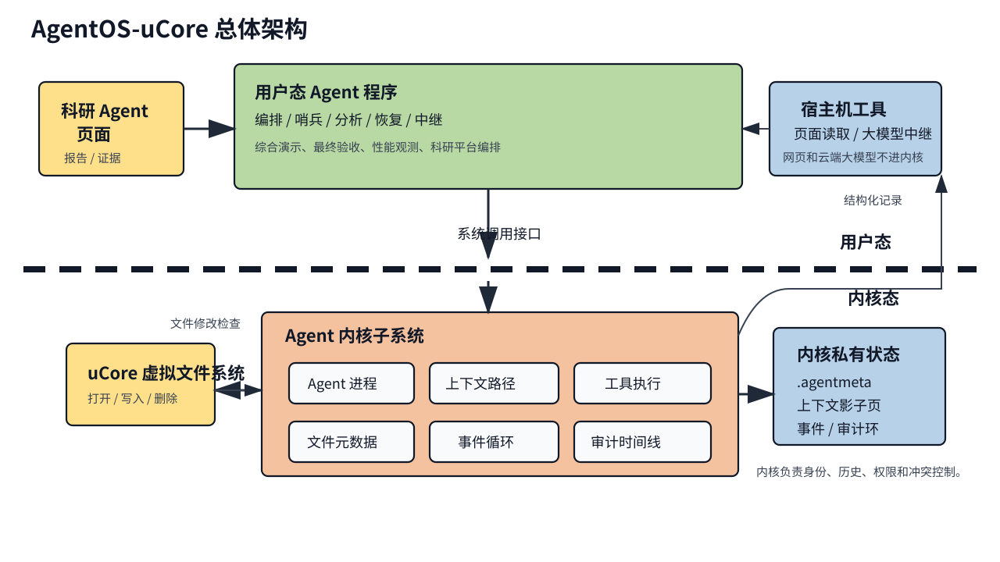
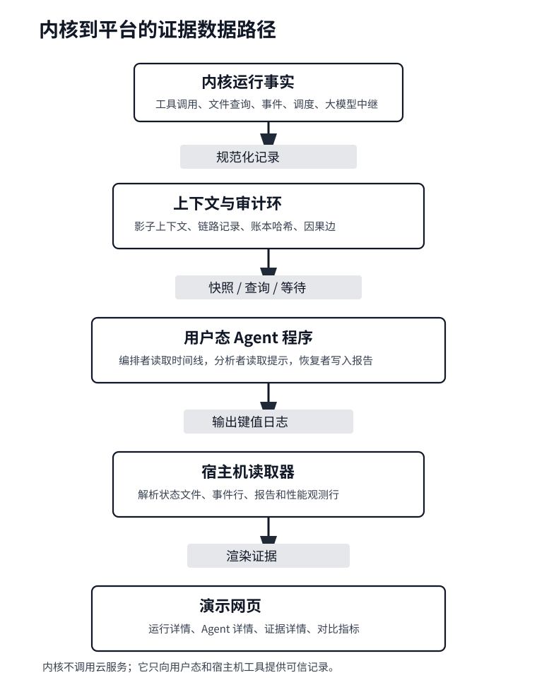
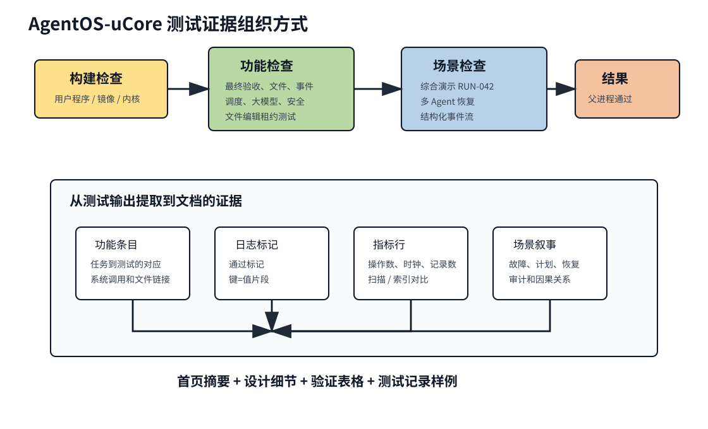

# project61-agentOS-happylegend：AgentOS-uCore 增强内核

[TOC]

## 一、基本信息

| 项目 | 内容 |
| --- | --- |
| 比赛 | 2026 年全国大学生计算机系统能力大赛-操作系统设计赛（全国）-OS 功能挑战赛道 |
| 选题编号 | project61 |
| 赛题名称 | 面向 AI 智能体的操作系统内核（Agent-OS） |
| 队伍名称 | happy-legend |
| 平台 Project ID | 39809 |
| GitLab 仓库 | https://gitlab.eduxiji.net/T2026106149911107/project3136859-388870 |
| 当前交付目录 | `agentos_ucore/` |
| 主要验证路径 | `CHAPTER=agent` |

## 二、项目简介

本项目围绕 Agent-OS 赛题，在 uCore 教学操作系统内核中实现面向 AI Agent / LLM 工作流的通用内核支持层。内核负责 Agent 进程身份、Agent Context、结构化工具调用、Context Path、文件对象元数据与内容摘要查询、事件队列、watch/wait/heartbeat、多 Agent 消息、capability 授权、调度提示、timeline、audit ledger、provenance、用户态缓存区和 LLM Relay 所需的事件与记录机制。科研 Agent 平台是主要演示负载、压力负载和对比负载；RUN-042、lab-gene-x、阶段 DAG、报告生成和恢复策略都在用户态组织，不写入内核默认策略。

uCore 分支不是只做任务一至三的最小版本。当前交付以任务一、任务二、任务三为高性能底座，同时实现任务四的文件元数据与 inode 关联、任务五的有界事件队列和等待/唤醒、任务六的多 Agent 综合演示。文档结构按旧版项目文档风格重构：README 负责快速运行和材料索引，主设计文档解释架构和关键决策，API/ABI 文档说明用户态与内核的接口分工，验证文档给出可复现证据，分任务文档展开细节。

项目的设计重点可以概括为三条路径：

- **Agent 执行路径**：Agent 进程通过 `agent_run()`、`agent_call()` 和工具表向内核提交结构化操作，内核负责角色、权限、Context 写入和结果返回。
- **Agent 数据路径**：文件对象元数据、内容摘要、依赖关系、预取提示和文件编辑租约由内核维护，用户态科研平台通过这些能力减少约定式扫描和不可信状态拼接。
- **Agent 证据路径**：Context、事件、调度原因、audit ledger、timeline 和 provenance 在内核中形成统一短记录，供演示程序、测试程序和宿主机 Web UI 提取。

综合创新点如下：

1. **把 Agent 工作流中的关键状态下沉到内核**：Agent 身份、权限、上下文历史、文件对象索引、事件等待和审计记录不再完全依赖用户态约定。
2. **用批量 ABI 和共享 Context 降低热路径成本**：批量工具调用、Context snapshot 和用户可读镜像减少频繁 syscall 与重复 copy。
3. **把科研 Agent 场景做成可复现实验负载**：`labdemo_ucore`、`agentbench_ucore` 和科研平台程序把故障发现、协作分析、恢复执行、报告生成和审计解释串成同一条可检查流程。
4. **把测试输出整理成文档证据**：功能测试、场景演示、性能观测和权限负向测试都输出稳定的 `key=value` 标记，便于文档提取和答辩展示。

## 三、基底来源

当前分支以 uCore 教学操作系统代码为基础，并引入 uCore 用户测试目录结构。项目相关实现主要集中在：

- `os/agent.c`
- `os/agent.h`
- `os/proc.c`
- `os/syscall.c`
- `os/trap.c`
- `user/include/agent.h`
- `user/lib/syscall.c`
- `user/src/agentfinal_ucore.c`
- `user/src/agentfs_ucore.c`
- `user/src/agentscan_ucore.c`
- `user/src/agentloop_ucore.c`
- `user/src/agentsched_ucore.c`
- `user/src/agentconflict_ucore.c`
- `user/src/agentllm_ucore.c`
- `user/src/agentbench_ucore.c`
- `user/src/labbench_ucore.c`
- `user/src/labdemo_ucore.c`
- `user/src/agentsecurity_ucore.c`

`os/` 是内核目录，`user/` 是用户态程序与测试目录，`nfs/` 用于生成用户程序文件系统镜像。

交付验收主路径使用 `CHAPTER=agent`。同时，内核保留并补充了部分 uCore 基础接口，例如 `trace` 和普通进程 mail；验证材料中包含 `ch3_trace` 抽测，用于检查代表性的基础 syscall 是否仍可运行。仓库中其他 chapter 测试文件保留为教学代码材料，不作为本项目最终验收入口。

## 四、完成情况

| 赛题任务 | 项目目标 | 当前状态 |
| --- | --- | --- |
| 任务一：Agent 进程创建与地址空间设计 | 支持 Agent 进程概念、进程元数据和 Agent Context 地址空间 | 已完成增强实现 |
| 任务二：Agent 与内核结构化交互 | 支持结构化工具调用、工具表、结果返回和错误语义 | 已完成增强实现 |
| 任务三：上下文路径管理 | 记录、查询、快照、回滚 Agent 多轮调用历史，维护 cause/span 因果字段，提供用户自管 cache 区，并能输出 Context、调度原因、当前 span 系统短记录、统一 timeline、内核侧过滤查询、游标增量查询、事件驱动等待、因果边导出和全局运行账本摘要 | 已完成增强实现 |
| 任务四：面向 Agent 查询优化的文件系统扩展 | 支持文件元数据表、真实 inode 关联、私有 `.agentmeta` 持久化、属性查询、索引路径、查询计划解释、内容摘要、依赖查询、基于查询历史的预取提示、同一 span 的跨 Agent 预取提示查询和按 tick 合并的根目录分批扫描 | 已完成增强实现 |
| 任务五：Agent Loop 内核运行机制 | 支持 16 槽事件队列、watch/unwatch、真实睡眠 wait/timeout、wait cancel、heartbeat 唤醒、事件投递、事件因果继承、自适应 Agent 调度、受权调度配置、调度原因记录、当前 span 短记录、统一 timeline、timeline 过滤查询、timeline 游标增量读取、timeline 等待唤醒、timeline wait-and-read、因果边导出、全局审计短记录、过滤查询和审计 hash 链摘要 | 已完成增强实现 |
| 任务六：综合演示与创新 | 用科研 Agent 平台作为主要负载，串联任务一至五，并展示 timeline、audit ledger、provenance、LLM template relay 和权限控制 | 已完成 `labdemo_ucore` 综合演示 |

### 4.1 能力分组

| 能力组 | 已实现内容 | 主要证据 |
| --- | --- | --- |
| Agent 进程与 Context | Agent role/capability、6 页 Context、shadow 权威历史、用户自管 cache、128 条短文本历史 | `agentfinal_ucore` |
| 工具调用和 Context Path | `agent_run()` 批量 ABI、名称协议、工具参数校验、snapshot/query/detail、cause/span、hash 链 | `agentfinal_ucore`、`agentbench_ucore` |
| 文件对象服务 | 真实 `dev + inum` 绑定、`.agentmeta` 私有后端、根目录自动扫描、索引查询、查询计划、内容摘要、依赖记录、预取提示、编辑租约 | `agentfs_ucore`、`agentscan_ucore`、`agentconflict_ucore` |
| Agent Loop 和调度 | FIFO 事件队列、watch/unwatch、wait/timeout、wait cancel、heartbeat、事件优先调度、调度原因记录 | `agentloop_ucore`、`agentsched_ucore` |
| 可信证据和演示 | timeline、audit ledger、provenance、LLM Relay 事件、RUN-042 多 Agent 恢复演示、权限限制测试 | `labdemo_ucore`、`agentllm_ucore`、`agentsecurity_ucore` |

### 4.2 总体架构图



图中粗虚线表示用户态和内核态的分层。科研 Agent 平台、测试程序和宿主机工具运行在用户态；Agent 子系统运行在 uCore 内核中，负责 Agent 身份、Context、工具执行、文件对象服务、事件队列、审计记录和冲突控制。云端 LLM 调用、HTTP UI 和 secret 仍留在用户态或宿主机桥接层。

### 4.3 运行证据路径



内核不直接生成最终网页，也不访问云端服务。它输出结构化、可验证的短记录；用户态程序和宿主机 reader 再把这些记录整理成运行详情、Agent 详情、证据详情和对比指标。

## 五、构建与运行

已验证开发环境：WSL2 Ubuntu 26.04。

通用运行要求：

- Linux 环境；
- RISC-V GCC/binutils；
- QEMU riscv64；
- make；
- git。

当前验证使用 `riscv64-linux-gnu-` 工具链。

构建用户程序、文件系统镜像和内核：

```bash
cd project61-agentOS-happylegend-uCore
make -C user clean
make clean
make user nfs/fs.img TOOLPREFIX=riscv64-linux-gnu- CHAPTER=agent
make build TOOLPREFIX=riscv64-linux-gnu- LOG=warn INIT_PROC=agentfinal_ucore
```

推荐使用脚本顺序运行最终测试：

```bash
bash scripts/run-agent-tests.sh
```

也可以分别以 init 进程方式运行：

```bash
make run TOOLPREFIX=riscv64-linux-gnu- LOG=error INIT_PROC=agentfinal_ucore CHAPTER=agent
make run TOOLPREFIX=riscv64-linux-gnu- LOG=error INIT_PROC=agentfs_ucore CHAPTER=agent
make run TOOLPREFIX=riscv64-linux-gnu- LOG=error INIT_PROC=agentscan_ucore CHAPTER=agent
make run TOOLPREFIX=riscv64-linux-gnu- LOG=error INIT_PROC=agentloop_ucore CHAPTER=agent
make run TOOLPREFIX=riscv64-linux-gnu- LOG=error INIT_PROC=agentsched_ucore CHAPTER=agent
make run TOOLPREFIX=riscv64-linux-gnu- LOG=error INIT_PROC=agentconflict_ucore CHAPTER=agent
make run TOOLPREFIX=riscv64-linux-gnu- LOG=error INIT_PROC=agentllm_ucore CHAPTER=agent
make run TOOLPREFIX=riscv64-linux-gnu- LOG=error INIT_PROC=agentbench_ucore CHAPTER=agent
make run TOOLPREFIX=riscv64-linux-gnu- LOG=error INIT_PROC=labbench_ucore CHAPTER=agent
make run TOOLPREFIX=riscv64-linux-gnu- LOG=error INIT_PROC=labdemo_ucore CHAPTER=agent
make run TOOLPREFIX=riscv64-linux-gnu- LOG=error INIT_PROC=agentsecurity_ucore CHAPTER=agent
```

代表性 uCore 基础 syscall 抽测：

```bash
make -C user clean
make clean
make user nfs/fs.img TOOLPREFIX=riscv64-linux-gnu- CHAPTER=3
timeout 60s make run TOOLPREFIX=riscv64-linux-gnu- LOG=error INIT_PROC=ch3_trace CHAPTER=3
```

如果希望进入用户 shell，可以运行：

```bash
make run TOOLPREFIX=riscv64-linux-gnu- LOG=error INIT_PROC=usershell CHAPTER=agent
```

进入 shell 后可手动运行：

```sh
agentfinal_ucore
agentfs_ucore
agentscan_ucore
agentloop_ucore
agentsched_ucore
agentconflict_ucore
agentllm_ucore
agentbench_ucore
labbench_ucore
labdemo_ucore
agentsecurity_ucore
```

shell 中启动的测试程序是 `usershell` 的直接普通子进程，内核允许这类进程创建 orchestrator Agent，因此该手动路径与 `INIT_PROC=...` 路径都可用。

## 六、项目测试

本项目把测试输出整理为“构建门槛、功能门槛、场景门槛、结果标记”四类证据。测试程序输出稳定的 `parent passed` 和 `key=value` 标记，文档从这些标记中提取完成情况、性能观测和场景结论。



### 6.1 最终测试入口

| 程序 | 定位 | 期望通过输出 |
| --- | --- | --- |
| `agentfinal_ucore` | 任务一至三功能验收，同时覆盖 `context_detail()`、Context record flags、运行轨迹、当前 span 短记录、统一 timeline、timeline 过滤查询、timeline 游标增量读取、timeline 等待唤醒、timeline wait-and-read、因果边导出、全局运行账本摘要、用户自管 cache、名称协议、文件索引、预取提示、span 预取提示查询和事件自唤醒 | `agentfinal_ucore: parent passed` |
| `agentfs_ucore` | 任务四文件系统/inode 关联验收，覆盖真实文件绑定、内容摘要、通用依赖注册、字段清空、删除清理、`.agentmeta` 重新加载、scan/index 差异、query plan、generation-aware 查询缓存、预取提示和不存在 selector | `agentfs_ucore: parent passed` |
| `agentscan_ucore` | 任务四自动扫描验收，覆盖按 tick 合并的根目录分批扫描、真实文件自动建元数据、索引查询和删除清理 | `agentscan_ucore: parent passed` |
| `agentloop_ucore` | 任务五 Agent Loop 验收，覆盖 FIFO 顺序、队列满丢弃、多 watch、unwatch、有限 timeout 睡眠、wait cancel、TIMER unwatch、heartbeat wake/stop | `agentloop_ucore: parent passed` |
| `agentsched_ucore` | 任务五调度验收，覆盖角色权重、受权调度配置、事件优先、调度原因记录、调度次数、让出处理器次数和虚拟运行量公平性计数 | `agentsched_ucore: parent passed` |
| `agentconflict_ucore` | 文件编辑冲突测试，覆盖普通进程不能申请编辑租约、两个 Agent 同时编辑同一文件时第二个 Agent 被拒绝、非持有者真实 `write/O_TRUNC/unlink` 被拒绝、提交版本检查和旧版本提交拒绝 | `agentconflict_ucore: parent passed` |
| `agentllm_ucore` | LLM Relay 事件流测试，覆盖请求 Agent、Relay Agent、`LLM_RELAY` capability、模板响应、事件唤醒、Context 和 timeline 摘要 | `agentllm_ucore: parent passed` |
| `agentbench_ucore` | 任务一至五性能与计时验证，包括 batch、direct context、snapshot、timeline snapshot/query/cursor/wait-ready、provenance snapshot、文件查询候选记录数、查询缓存、预取提示 snapshot、timeout/heartbeat、busy polling 和 wait/wake | `agentbench_ucore: parent passed` |
| `labbench_ucore` | 面向演示规划的性能入口，包装运行 `agentbench_ucore`，便于后续升级为 `labbench --full` | `labbench_ucore: parent passed` |
| `labdemo_ucore` | 多 Agent 综合演示，普通 init 只启动 orchestrator，后续元数据初始化、事件注入、角色 Agent 创建、预取提示消费、span 预取提示查询、参与 Agent 当前 span 短记录、统一 timeline、timeline 过滤查询、timeline 游标增量读取、因果边查询、全局审计查询和过滤查询都由 orchestrator 编排 | `labdemo_ucore: parent passed` |
| `agentsecurity_ucore` | 权限限制负向测试，覆盖初始化前索引查询、legacy mismatch、legacy 参数校验、syscall-only 工具拒绝、普通进程直接写元数据/投事件/取消等待/读全局审计/过滤审计/读全局运行账本/读取 timeline/查询 timeline/等待 timeline/wait-and-read timeline/配置调度、sentinel 伪造 recovery、多 run 定向恢复 | `agentsecurity_ucore: parent passed` |

### 6.2 功能输出样例

`agentfinal_ucore` 预期输出包括：

```text
agentfinal_ucore: context size=24576 capacity=128
agentfinal_ucore: batch first_seq=1 last_seq=64
agentfinal_ucore: short_text_history=1 payload=ucore-final result=ucore-final
agentfinal_ucore: context_detail=1 sequence=8
agentfinal_ucore: provenance_graph=1 edges=126 context=1 audit=1
agentfinal_ucore: tamper_protected=1
agentfinal_ucore: causal_context=1 first_cause=0 next_cause=1 span=1 edges=63
agentfinal_ucore: context_integrity=1 first_hash=... latest_hash=...
agentfinal_ucore: user_cache_preserved=1 offset=21504 size=3072
agentfinal_ucore: record_flags system=1 manual=1 truncated=0
agentfinal_ucore: legacy_name_protocol=1
agentfinal_ucore: fifo oldest=66 latest=193 dropped=65
agentfinal_ucore: file_query hits=2 scanned=2 used_index=1
agentfinal_ucore: prefetch_hints=1 count=... first_stage=...
agentfinal_ucore: span_prefetch=1 count=... first_stage=...
agentfinal_ucore: event_wait=1 payload=self wake
agentfinal_ucore: runtime_trace=1 records=... context=1 sched=1 wait=1
agentfinal_ucore: span_trace=1 records=... context=1 event=1
agentfinal_ucore: unified_timeline=1 records=... context=1 sched=1 audit=1 prefetch=1
agentfinal_ucore: timeline_query=1 audit=213 recent=281 cursor=177
agentfinal_ucore: timeline_wait=1 timeout=-7 source_gate=1 event_gate=1 wake=1 query=1 read=1 sleeps=1 wakeups=1
agentfinal_ucore: run_ledger=1 records=... hash=... context=... event=... sched=... prefetch=...
agentfinal_ucore: passed
```

### 6.3 性能输出样例

`agentbench_ucore` 输出性能表，字段含义如下：

```text
agentbench_ucore: timeout_heartbeat=1
agentbench_ucore: repeated_ticks scalar_min=14 scalar_avg=16 scalar_max=19 batch_min=5 batch_avg=7 batch_max=8
agentbench_ucore: file_query_records scan_records=118 index_records=6
agentbench_ucore: file_query_plan scan_plan=0 index_plan=1 index_reason=68 index_candidates=6
agentbench_ucore: file_query_cache hit=1 reason=68
agentbench_ucore: file_digest bytes=37888 ticks=10 preview=agentbench-digest-content-block-0001 agentbench-digest-content-
agentbench_ucore: file_digest_cache hits=63 misses=1
agentbench_ucore: prefetch_records total=192 first_stage=analyze
agentbench_ucore: timeline_records snapshot=8192 query=48 cursor=6568
agentbench_ucore: provenance_records snapshot=2048
agentbench_ucore: timeline_wait_ready records=659 ticks=1
agentbench_ucore: timeline_read_ready records=8192 ticks=696
agentbench_ucore: case ops ticks ops_per_tick speedup_x100
agentbench_ucore: scalar_agent_run ops=256 ticks=16 ops_per_tick=16 speedup_x100=100
agentbench_ucore: batch_agent_run ops=256 ticks=7 ops_per_tick=36 speedup_x100=228
agentbench_ucore: direct_context ops=5000 ticks=1 ops_per_tick=5000 speedup_x100=31250
agentbench_ucore: context_query ops=16 ticks=1 ops_per_tick=16 speedup_x100=100
agentbench_ucore: context_snapshot ops=2048 ticks=6 ops_per_tick=341 speedup_x100=2133
agentbench_ucore: file_scan_query ops=64 ticks=13 ops_per_tick=4 speedup_x100=100
agentbench_ucore: file_index_query ops=64 ticks=7 ops_per_tick=9 speedup_x100=185
agentbench_ucore: file_digest_read ops=37888 ticks=10 ops_per_tick=3788 speedup_x100=100
agentbench_ucore: file_prefetch_snapshot ops=192 ticks=1 ops_per_tick=192 speedup_x100=300
agentbench_ucore: timeline_snapshot ops=8192 ticks=701 ops_per_tick=11 speedup_x100=51200
agentbench_ucore: timeline_query_prefetch ops=48 ticks=1 ops_per_tick=48 speedup_x100=410
agentbench_ucore: timeline_query_cursor ops=6568 ticks=717 ops_per_tick=9 speedup_x100=78
agentbench_ucore: provenance_snapshot ops=2048 ticks=13 ops_per_tick=157 speedup_x100=12800
agentbench_ucore: timeline_wait_ready ops=659 ticks=1 ops_per_tick=659 speedup_x100=100
agentbench_ucore: timeline_read_ready ops=8192 ticks=696 ops_per_tick=11 speedup_x100=100
agentbench_ucore: busy_poll_query ops=128 ticks=11 ops_per_tick=11 speedup_x100=100
agentbench_ucore: event_wait_wake ops=8 ticks=6 ops_per_tick=1 speedup_x100=100
agentbench_ucore: busy_poll_vs_wait busy_ops=128 busy_ticks=11 wait_ops=8 wait_ticks=6
```

`ticks` 会随 QEMU 和宿主机负载波动，阅读性能数据时应关注测试是否通过、scan/index 候选记录数差异、多轮 min/avg/max 观测和相对趋势，而不是固定绝对数值。

`agentfs_ucore` 预期输出包括：

```text
agentfs_ucore: demo_inode dev=1 inum=14 scanned=2
agentfs_ucore: prefetch_hints=1 count=... first_stage=... source_seq=...
agentfs_ucore: scoped_dependency=1 run042=align+analyze+report runalt=align+archive
agentfs_ucore: custom_inode dev=1 inum=20 size=7
agentfs_ucore: content_digest=1 size=7 bytes=7 hash=52642947 preview=agentfs
agentfs_ucore: digest_cache=1 hits=1 misses=1
agentfs_ucore: digest_cache_invalidated=1 misses=1
agentfs_ucore: digest_timeline=1 tool=20 preview=agentfs2
agentfs_ucore: .agentmeta_reload=1
agentfs_ucore: query_cache=1 reason=68
agentfs_ucore: bulk_index scan=118 index=6 hits=1
agentfs_ucore: query_plan scan_plan=0 index_plan=1 reason=4 bucket=15 candidates=6
agentfs_ucore: scan_index_consistent=1
agentfs_ucore: truncated_query total=100 returned=3 truncated=1
agentfs_ucore: clear_status=1 cache_invalidated=1
agentfs_ucore: delete_clears_metadata=1
agentfs_ucore: missing_selector_not_found=1
agentfs_ucore: passed
agentfs_ucore: parent passed
```

`agentscan_ucore` 预期输出包括：

```text
agentscan_ucore: background_scan usershell=1 runs=1 entries=64 added=10
agentscan_ucore: auto_file_create=1 size=14 generation=19
agentscan_ucore: auto_file_delete=1
agentscan_ucore: passed
agentscan_ucore: parent passed
```

`agentloop_ucore` 预期输出包括：

```text
agentloop_ucore: fifo=1
agentloop_ucore: event_causality=1
agentloop_ucore: overflow_dropped=1
agentloop_ucore: unwatch=1
agentloop_ucore: timeout_sleep_no_poll=1
agentloop_ucore: timer_unwatch=1
agentloop_ucore: heartbeat_wake_stop=1
agentloop_ucore: wait_cancel=1
agentloop_ucore: passed
agentloop_ucore: parent passed
```

`agentllm_ucore` 预期输出包括：

```text
agentllm_ucore: Agent LLM relay test
agentllm_ucore: relay_timeline=1
agentllm_ucore: requester_done=1
agentllm_ucore: template_relay=1
agentllm_ucore: passed
agentllm_ucore: parent passed
```

`agentsched_ucore` 预期输出包括：

```text
agentsched_ucore: role_weights sentinel=70 investigator=90 recovery=120 orchestrator=110
agentsched_ucore: configurable_policy=1 weight=150 priority=20 budget=3
agentsched_ucore: event_priority=1 dispatch=6 event_dispatch=1
agentsched_ucore: reason_trace=1 records=6 reason=131 score=1655
agentsched_ucore: fairness=1 dispatch=18 preemptions=13 vruntime=162
agentsched_ucore: passed
agentsched_ucore: parent passed
```

`labdemo_ucore` 会输出结构化演示事件，例如：

```text
agentos:event type=AGENT_CREATED tick=... role=orchestrator pid=... context=...
agentos:event type=RUN_OBJECT tick=... project=lab-gene-x workflow=nightly-regression run_id=RUN-042 desired_state=RECOVERED policy=minimal_rerun
agentos:event type=WATCH_REGISTERED tick=... role=sentinel event=FILE_STATUS filter=status=failed
agentos:event type=INCIDENT_CREATED tick=... id=INC-RUN-042-ALIGN-OOM project=lab-gene-x workflow=nightly-regression run_id=RUN-042 stage=align reason=memory_limit
agentos:event type=TOOL_CALL tick=... role=sentinel tool=query_file project=lab-gene-x run_id=RUN-042 status=failed hits=1 used_index=1 seq=...
agentos:event type=PREFETCH_HINT tick=... role=sentinel project=lab-gene-x run_id=RUN-042 source_stage=align next_stage=analyze source_seq=... candidates=... reason=...
agentos:event type=AUDIT tick=... role=sentinel action=action_commit result=DENIED reason=capability corr_id=RUN-042-align-rerun-1 seq=...
labdemo_ucore: investigator handoff_prefetch stage=analyze source_seq=4 reason=31
labdemo_ucore: investigator span_prefetch stage=analyze count=... source_pid=... target_pid=...
labdemo_ucore: investigator span_trace records=... context=1 event=1 prefetch=1
agentos:event type=MESSAGE tick=... from=sentinel to=investigator status=OK corr_id=MSG-RUN-042-S-I prefetch_handoff=analyze seq=...
labdemo_ucore: investigator digest bytes=27 preview=align memory_limit evidence seq=...
agentos:event type=TOOL_CALL tick=... role=investigator tool=read_file_digest stage=align status=OK bytes=27 seq=...
agentos:event type=PREFETCH_USED tick=... role=investigator stage=analyze summary=analysis waits for align seq=...
agentos:event type=LLM_CALL tick=... mode=template task=explain_root_cause llm_request_id=LLM-RUN-042-RCA-1 project=lab-gene-x run_id=RUN-042 refs=...,...,...,... status=OK
agentos:event type=LLM_RESULT tick=... mode=template llm_request_id=LLM-RUN-042-RCA-1 llm_status=OK llm_explanation=memory_limit referenced_sequences=...,...,...,... confidence=medium
agentos:event type=PLAN_CREATED tick=... role=investigator plan=PLAN-RUN-042-RECOVER-1 project=lab-gene-x run_id=RUN-042 actions=align,analyze,report skip=prepare prefetch=analyze refs=...,...,...,...
agentos:event type=ACTION tick=... role=recovery label=align status=OK corr_id=RUN-042-align-rerun-1 plan=PLAN-RUN-042-RECOVER-1 seq=... duplicate=0
agentos:event type=ARTIFACT tick=... role=recovery namespace=lab-gene-x run_id=RUN-042 file=RUN-042-recovery.md status=OK corr_id=RUN-042-report-write-1 plan=PLAN-RUN-042-RECOVER-1 seq=... llm_enhanced=0
agentos:event type=FINAL tick=... project=lab-gene-x run_id=RUN-042 status=RECOVERED plan=PLAN-RUN-042-RECOVER-1
labdemo_ucore: global_audit=1 records=... agents=3 context=1 event=1 sched=1 prefetch=1
labdemo_ucore: audit_query=1 kind=... span=... event=2 prefetch=... start=...
labdemo_ucore: unified_timeline records=... context=1 event=1 sched=1 prefetch=1 digest=1
labdemo_ucore: timeline_query prefetch=3 cursor=... digest=1
labdemo_ucore: provenance_graph edges=... message=1 prefetch=1 digest=1
labdemo_ucore: passed
labdemo_ucore: parent passed
```

## 七、科研 Agent 平台入口

`CHAPTER=platform_agentos` 会构建完整科研 Agent 平台程序，并额外加入 `rp_agentos_orch` 作为改造内核目标的主入口。该入口创建 orchestrator Agent，初始化 `rp_agentos_mainflow`，再执行完整 `rp_orch` 工作流。`rp_orch` 只把需要内核 Agent 身份的关键程序用 `agent_create_role()` 启动，页面导出、目录整理、兼容性检查等支持程序仍按普通进程运行；`rp_agentos_roles` 和 `rp_orch_timing` 会分别记录 `stage_launch=agent_create_role`、`support_launch=fork` 和 `support_role=plain_process`。

关键阶段会继续把真实内核调用结果追加到同一个主流程文件中：`rp_query` 写入文件 metadata 索引查询，`rp_repair` 写入通用 action/artifact 更新结果，`rp_execobs` 写入事件等待和 timeline 观察结果，`rp_agent_collab` 写入 Agent 间事件通知和 sentinel 越权动作被拒绝的结果，`rp_auditor` 写入 ledger/provenance 结果，`rp_workbench` 写入工作台文件校验结果，`rp_package` 写入证据包 provenance 结果，`rp_realtask` 写入真实任务报告与答案审计结果，`rp_backend` 写入科研报告编辑目标的文件编辑租约结果。`rp_backend`、`rp_consistency`、`rp_metrics`、`rp_compare_plain` 和 `rp_test_suite` 都会检查这些事实，因此增强目标不是“普通平台旁边跑 Agent 测试”，而是同一科研流程在增强内核上运行时直接使用内核 Context、文件索引、事件队列、通用动作记录、权限控制、文件编辑租约、工作台校验、证据包追踪和审计记录。

科研平台的高级服务界面阶段还会创建一个 sentinel Agent，执行 `echo + read_context` 批量工具调用，读取 Context 快照，并在 `rp_runop` 中写入 `agentos_advanced_surface=kernel_bound`，用于说明高级平台页面也能读取内核 Agent 执行历史。

运行方式：

```bash
make user nfs/fs.img TOOLPREFIX=riscv64-linux-gnu- CHAPTER=platform_agentos
make run TOOLPREFIX=riscv64-linux-gnu- LOG=error INIT_PROC=rp_agentos_orch CHAPTER=platform_agentos
```

预期关键输出包括：

```text
rp_agentos_orch: agent role=4 context=... latest=1
rp_backend: cases=8 executable=8 agentos=mainflow_bound exports=1 status=ready
rp_state_catalog: keys=574 nonzero=71 zero=503 represented=574 checks=12 status=ready
rp_startup_doctor: quickstart=ready doctor=ready checks=14 status=ready
rp_orch: programs_ok=69 programs_total=69
rp_orch: passed
rp_agentos_orch: kernel_agent=1 workflow=rp_orch status=ready
rp_agentos_orch: passed
```

`agentsecurity_ucore` 预期输出包括：

```text
agentsecurity_ucore: mail_basic=1
agentsecurity_ucore: plain_process_denied=1
agentsecurity_ucore: .agentmeta_protected=1
agentsecurity_ucore: role=orchestrator_child capability_checked=1
agentsecurity_ucore: plain_child_orchestrator=1
agentsecurity_ucore: role=orchestrator capability_checked=1
agentsecurity_ucore: preinit_index_query=1
agentsecurity_ucore: legacy_tool_mismatch=1
agentsecurity_ucore: legacy_param_validation=1 syscall_only=1
agentsecurity_ucore: role=sentinel capability_checked=1
agentsecurity_ucore: sentinel spoof_denied=1
agentsecurity_ucore: role=recovery capability_checked=1
agentsecurity_ucore: recovery action_ok=1 duplicate=1
agentsecurity_ucore: scoped_action=1
agentsecurity_ucore: scoped_artifact=1
agentsecurity_ucore: passed
agentsecurity_ucore: parent passed
```

## 八、当前交付材料

| 材料 | 位置 |
| --- | --- |
| 文档索引 | [docs/README.md](docs/README.md) |
| 文档标准采用说明 | [docs/documentation-standard.md](docs/documentation-standard.md) |
| 主设计文档 | [docs/design.md](docs/design.md) |
| 赛题要求追踪表 | [docs/requirements-traceability.md](docs/requirements-traceability.md) |
| API 与 ABI | [docs/api.md](docs/api.md) |
| 验证与性能评估 | [docs/verification.md](docs/verification.md) |
| 测试内容详细说明 | [docs/testing-details.md](docs/testing-details.md) |
| 演示脚本 | [docs/demo-script.md](docs/demo-script.md) |
| 任务一细节附录 | [docs/task1-agent-process.md](docs/task1-agent-process.md) |
| 任务二细节附录 | [docs/task2-agent-call.md](docs/task2-agent-call.md) |
| 任务三细节附录 | [docs/task3-context-path.md](docs/task3-context-path.md) |
| 任务四细节附录 | [docs/task4-file-query.md](docs/task4-file-query.md) |
| 任务五细节附录 | [docs/task5-agent-loop.md](docs/task5-agent-loop.md) |
| 当前测试记录 | [docs/test-record.md](docs/test-record.md) |
| 源代码许可 | [LICENSE](LICENSE) |
| 文档与答辩材料许可 | [DOCUMENTATION_LICENSE.md](DOCUMENTATION_LICENSE.md) |
| 第三方声明 | [NOTICE](NOTICE) |

## 九、仍需补充

- 多级目录递归扫描、更多文件分类规则和索引压缩；
- 多核压力下的更细锁设计和复杂调度策略语言；
- 云端 LLM Gateway；
- 宿主机可视化大屏；
- 进展汇报幻灯片；
- 作品演示视频。

## 十、许可声明

源代码许可：[GPL-3.0](LICENSE)。

技术文档、汇报幻灯片和演示视频许可：[CC BY-SA 4.0](DOCUMENTATION_LICENSE.md)。

第三方来源和许可说明见 [NOTICE](NOTICE)。
