# 主设计文档：AgentOS-uCore

本文是 `agentos_ucore/` 的主设计文档。文档组织采用“项目信息、目标、架构、模块、运行路径、测试证据、文件索引”的赛事展示方式，同时保留操作系统项目需要的接口说明、设计决策和验证依据。

## 1. 引言与目标

### 1.1 系统目标

本项目基于 uCore 教学操作系统，在内核中加入面向 AI Agent / LLM 工作流的通用支持层，使内核能够识别 Agent 进程、提供结构化内核工具调用、维护 Agent 多轮调用上下文路径，并支持文件对象语义查询、事件驱动 Agent Loop、调度提示、timeline、audit ledger、provenance、文件编辑租约和 LLM Relay 所需的事件/Context 记录能力。

uCore 分支的目标不是把某个科研平台硬编码到内核，而是在保留赛题任务语义的前提下，把 Agent 进程、工具调用、Context、文件对象、事件、权限和可观测状态做成可复用机制。科研 Agent 平台是主要演示负载，用来展示这些机制如何支撑真实多 Agent 工作流。

### 1.2 利益相关方和关注点

| 角色 | 关注点 |
| --- | --- |
| 项目用户 | 是否能在 QEMU 中稳定运行；是否完成赛题基础任务；设计是否清晰、有创新点、有验证证据 |
| 开发者 | Agent 子系统是否模块化；系统调用 ABI 是否稳定；后续任务四、五、六是否容易继续扩展 |
| 用户态 Agent 程序 | 是否能用结构化接口请求内核工具；是否能高速读取 Context 镜像；是否能在需要可信历史时使用 snapshot |
| 操作系统内核 | 是否保持普通进程兼容性；是否控制地址空间、锁、生命周期和错误路径 |
| 演示和答辩材料 | 是否能把底层 syscall 串成一个用户容易理解的多 Agent 场景，同时不把演示策略混入内核机制 |

### 1.3 质量目标

| 优先级 | 质量目标 | 可验证方式 |
| ---: | --- | --- |
| 1 | 稳定性 | `agentfinal_ucore`、`agentbench_ucore`、`labdemo_ucore`、`agentsecurity_ucore` 均通过且无 kernel panic |
| 2 | 可验收性 | 每个赛题要求能追踪到实现、测试和文档 |
| 3 | 模块化 | Agent 逻辑集中在 `os/agent.c`，系统调用层只做分发和参数传递 |
| 4 | 性能 | 批量工具调用、用户态直接读 Context、批量 Context Snapshot、文件索引查询 |
| 5 | 可扩展性 | 文件对象字段、`agentos:event`、Context Path、Loop 状态、工具表、cause/span 因果链、统一 timeline、Run Ledger 摘要和 LLM Relay 事件可继续扩展到科研 Agent、代码 Agent、运维 Agent、写作 Agent 等不同负载 |

## 2. 约束

| 类型 | 约束 |
| --- | --- |
| 基底系统 | uCore 教学操作系统，RISC-V 64 |
| 运行环境 | QEMU virt machine，OpenSBI 默认启动 |
| 开发环境 | 已验证 WSL2 Ubuntu 26.04；通用要求为 Linux、RISC-V GCC/binutils、QEMU riscv64、make、git |
| 编译工具链 | 已验证 `riscv64-linux-gnu-`；Makefile 可接受 `riscv64-unknown-elf-` |
| 兼容性 | Agent 交付以 `CHAPTER=agent` 为验收主路径；补充验证 `trace` 和普通进程 mail 等代表性基础 syscall；Agent syscall 使用 500 起的扩展编号 |
| 当前范围 | 任务一至五增强实现；任务六提供可运行综合演示 |
| 当前限制 | 尚未实现多级目录递归扫描、真实云端 LLM Relay、宿主机可视化大屏 |

## 3. 上下文与范围

### 3.1 系统上下文

上图采用用户态/内核态分层方式展示系统位置。用户态科研 Agent 平台、测试程序和宿主机工具通过 syscall ABI 使用 Agent 内核能力；内核中的 Agent 子系统管理 Agent 进程、Context Path、工具执行、文件对象服务、事件循环、调度提示和审计记录；uCore VFS 的真实文件修改路径会调用 Agent 文件编辑租约检查，避免两个 Agent 无序覆盖同一文件。

下面的 Mermaid 图保留为可编辑的关系摘要，便于在文本评审环境中快速查看依赖关系。

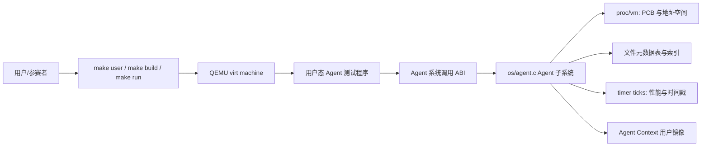

### 3.2 当前范围

| 范围 | 状态 |
| --- | --- |
| Agent 进程创建、标记和信息查询 | 已实现 |
| Agent Context 固定用户虚拟地址区 | 已实现，当前为 6 页用户镜像区，尾部包含用户自管 cache |
| 结构化工具调用和工具列表 | 已实现，最终热路径为 `agent_run` 批量 ABI |
| 工具调用自动写入 Context Path | 已实现 |
| Context Path 手动追加/query/rollback/clear/snapshot | 已实现，并记录 cause/span 因果字段 |
| 文件元数据表、真实 inode 关联、属性查询、索引查询、`.agentmeta` 持久化、根目录自动扫描 | 已实现 |
| Agent Loop 心跳、等待、唤醒和 Agent 感知调度 | 已实现 16 槽事件队列、watch/unwatch、事件唤醒、有限 timeout 睡眠等待、wait cancel、heartbeat 事件、自适应调度、受权调度配置、调度原因记录、当前 span 短记录、全局审计短记录、过滤查询、Run Ledger 摘要和统一 timeline 导出 |
| 代表性 uCore 基础 syscall | 已实现 `trace`、`mailread`、`mailwrite` |
| 综合场景 | 已实现 `labdemo_ucore` 综合演示 |
| LLM 友好路径 | 已实现 `llm_request`、`llm_response`、`AGENT_EVENT_LLM_DONE`、Context 记录和事件唤醒；真实云端 relay 保持在用户态或宿主机桥接层 |
| 可视化大屏 | 未实现，已通过结构化事件输出预留解析契约 |

## 4. 解决方案策略

| 策略 | 说明 |
| --- | --- |
| Agent 子系统模块化 | 把 Agent 逻辑集中在 `os/agent.c` 和 `os/agent.h`，避免分散在基础系统调用文件中 |
| 高性能 ABI | 最终热路径使用 `agent_op` / `agent_result` 和 `agent_run()`，一次 syscall 最多执行 64 个 op |
| shadow 权威 Context | Agent Context 扩为 6 页，内核保存 shadow 权威页和用户镜像页，写入时先更新 shadow 再同步镜像 |
| 用户态可读 Context | latest result 和历史路径同步到用户镜像，Agent 可直接读取，避免每次都系统调用查询；可信历史通过 shadow 和 snapshot 保证；Context 尾部保留用户自管 cache |
| 环形 Context Path | 固定容量 128 条短文本摘要记录，超长 FIFO 覆盖，记录 `oldest/latest/dropped/rollback` 元信息，并维护 prev/record hash 完整性链 |
| 内核维护因果链 | Context record 和事件都带 `cause_sequence` / `span_id`，事件消费后目标 Agent 继承 span，后续工具调用继续同一链路 |
| 批量 Snapshot | `context_snapshot()` 一次返回 header 和按时间顺序排列的可见路径 |
| 文件对象查询引擎 | Agent 子系统维护 128 条文件对象元数据，主键使用 `dev + inum`，提供扫描路径、state/label/type 索引路径、查询计划解释、私有 `.agentmeta` 元数据文件、用户态注册的通用依赖记录、调度器空隙分批根目录扫描和同一 span 的预取提示查询；兼容字段名仍保留为 status/stage/kind |
| 文件编辑租约 | Agent 申请真实文件独占编辑租约，内核用 `dev + inum` 识别文件，在 `write`、`O_TRUNC`、`unlink` 真实路径上拒绝非持有者，提交时用版本号拒绝旧版本覆盖 |
| Agent Loop | 每个 Agent 有 16 槽 FIFO 事件队列和最多 8 条 watch，等待文件状态、消息、heartbeat 和取消事件，有限 timeout 进入睡眠 |
| Agent 感知调度 | 调度器按角色权重、orchestrator 配置的 priority/budget、事件队列、等待 deadline、heartbeat 到期、等待时长和虚拟运行量选择可运行任务，并记录最近 16 次调度原因 |
| 全局审计视图 | 内核全局 ring 记录 Context 追加、事件入队、事件消费、调度 dispatch、LLM 请求/响应和预取提示交接；每条审计记录写入 prev/record hash，orchestrator 可读取 Run Ledger 摘要；参与 Agent 可读取当前 span 短记录，orchestrator 可读取最近 512 条短记录并按 span、kind、事件类型、目标进程和起始 sequence 过滤；统一 timeline 把这些记录和本地 Context/调度/预取提示转换成同一种结构；timeline wait 让 Agent 等待匹配记录出现，timeline read 把等待和复制合并到一次 syscall；provenance snapshot 把可见记录转成因果边 |
| 内核角色与能力绑定 | `struct proc` 保存真实 `agent_role` 和 capability mask，敏感工具和 syscall 只按内核字段授权，不信任用户态传入的 role |
| 通用动作和工件更新 | `action_commit` 与 `artifact_update` 作为核心对象状态更新工具，`rerun_stage` 和 `write_report` 只作为旧演示兼容别名；记录、事件 action 和重复请求判断都归入通用类别 |
| LLM Relay 支持 | 内核提供 `llm_request`、`llm_response`、`LLM_RELAY` capability 和 `AGENT_EVENT_LLM_DONE`；prompt/response 摘要进入 Context、timeline 和审计记录；云端 API、secret、HTTP/TLS 留在用户态 |
| 结构化事件 | `labdemo_ucore` 输出 `agentos:event type=... key=value`，为最终大屏和 LLM Gateway 保留解析契约 |
| 测试驱动验收 | 用 `agentfinal_ucore` 做任务一至三功能验证，用 `agentfs_ucore` 验证文件系统 metadata，用 `agentloop_ucore` 验证事件队列，用 `agentbench_ucore` 和 `labbench_ucore` 做性能验证，用 `labdemo_ucore` 做综合场景验证，用 `agentsecurity_ucore` 做权限限制负向验证 |

## 5. 构件视图

### 5.1 一级模块

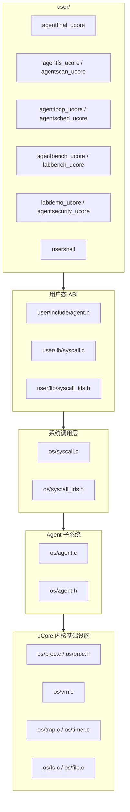

### 5.2 源码映射

| 构件 | 文件 | 职责 |
| --- | --- | --- |
| 用户态 ABI 声明 | `user/include/agent.h` | 暴露 Agent 结构体、常量和 syscall 原型 |
| syscall wrapper | `user/lib/syscall.c` | 封装 `agent_create`、`agent_run`、`context_snapshot` 等用户态调用 |
| syscall 编号 | `user/lib/syscall_ids.h`、`os/syscall_ids.h` | 注册 500 起的 Agent syscall 编号 |
| syscall 分发 | `os/syscall.c` | 根据 syscall id 调用 Agent 内核函数 |
| Agent ABI 与常量 | `os/agent.h` | 定义结构体、工具 ID、状态码、Context 布局 |
| Agent 核心逻辑 | `os/agent.c` | Agent 初始化、工具执行、Context Path、文件元数据、自动扫描、文件编辑租约、事件等待和调度评分 |
| PCB 和生命周期 | `os/proc.h`、`os/proc.c` | 保存 Agent 元数据，处理 create/exit、Context 释放和 Agent 感知取队 |
| 时钟事件 | `os/trap.c`、`os/timer.c` | 定时调用 `agent_tick()`，支持 heartbeat 和 timeout |
| 文件写入入口 | `os/file.c` | 在真实 `write`、`O_TRUNC`、`unlink` 路径调用 Agent 文件编辑租约检查 |
| 最终功能验收 | `user/src/agentfinal_ucore.c` | Agent 创建、6 页 Context、批量工具调用、短文本历史、`context_detail()`、完整性链、运行轨迹、统一 timeline、timeline wait、Run Ledger、provenance graph、用户自管 cache、名称协议、snapshot、FIFO、事件 |
| 文件系统测试 | `user/src/agentfs_ucore.c` | 真实文件 inode 绑定、字段清空、删除清理、`.agentmeta` 重新加载、scan/index 差异和一致性、query plan、truncated 标志、不存在 selector |
| 自动扫描测试 | `user/src/agentscan_ucore.c` | 根目录自动扫描、真实文件自动建元数据、索引查询和删除清理 |
| Agent Loop 测试 | `user/src/agentloop_ucore.c` | FIFO 顺序、队列满、多 watch、unwatch、有限 timeout 睡眠、wait cancel、TIMER unwatch、heartbeat wake/stop |
| Agent 调度测试 | `user/src/agentsched_ucore.c` | 角色权重、受权调度配置、事件优先、调度原因记录、调度次数、让出处理器次数和虚拟运行量公平性计数 |
| 文件编辑冲突测试 | `user/src/agentconflict_ucore.c` | 两个 Agent 同时编辑同一文件、非持有者真实写入拒绝、旧版本提交拒绝 |
| 性能基准 | `user/src/agentbench_ucore.c`、`user/src/labbench_ucore.c` | scalar run、batch run、direct Context、query/snapshot、timeline、timeline wait-ready、provenance、文件查询候选记录数、timeout/heartbeat、busy polling、wait/wake 计时 |
| 综合演示 | `user/src/labdemo_ucore.c` | 三 Agent 故障诊断、文件查询、预取提示消费、事件唤醒、受控恢复、报告、当前 span 短记录、统一 timeline、provenance graph、全局审计查询和过滤查询 |
| 权限限制测试 | `user/src/agentsecurity_ucore.c` | 普通进程直接敏感调用、低权限 Agent 读取全局摘要被拒绝、sentinel 伪造 role、recovery 幂等恢复 |
| 构建脚本 | `scripts/run-agent-tests.sh` | 顺序运行最终验证程序 |

## 6. 运行视图

运行时材料按“内核事实 -> 统一记录 -> 用户态消费 -> 宿主机展示”组织。测试程序和科研平台不会只贴一段无结构日志，而是输出可被文档和 Web UI 直接读取的 `key=value` 记录：例如 `tool=query_file`、`used_index=1`、`prefetch_handoff=analyze`、`stale_commit=1`。这使同一条运行事实可以同时出现在 QEMU 输出、测试记录、验证表和最终演示页面中。

### 6.1 Agent 创建

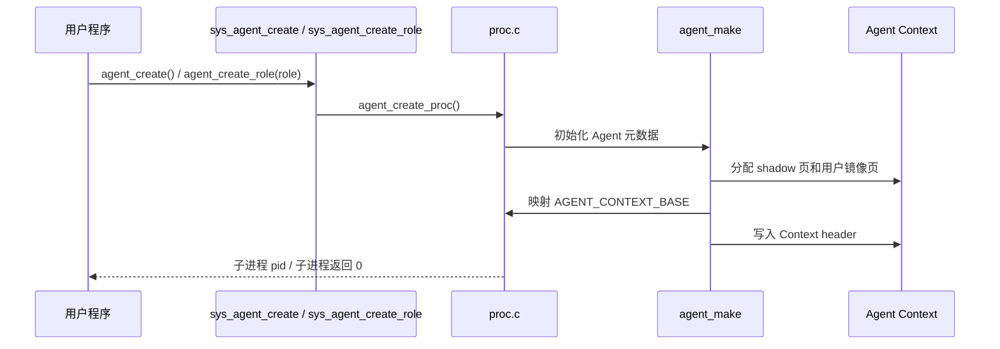

### 6.2 结构化工具调用

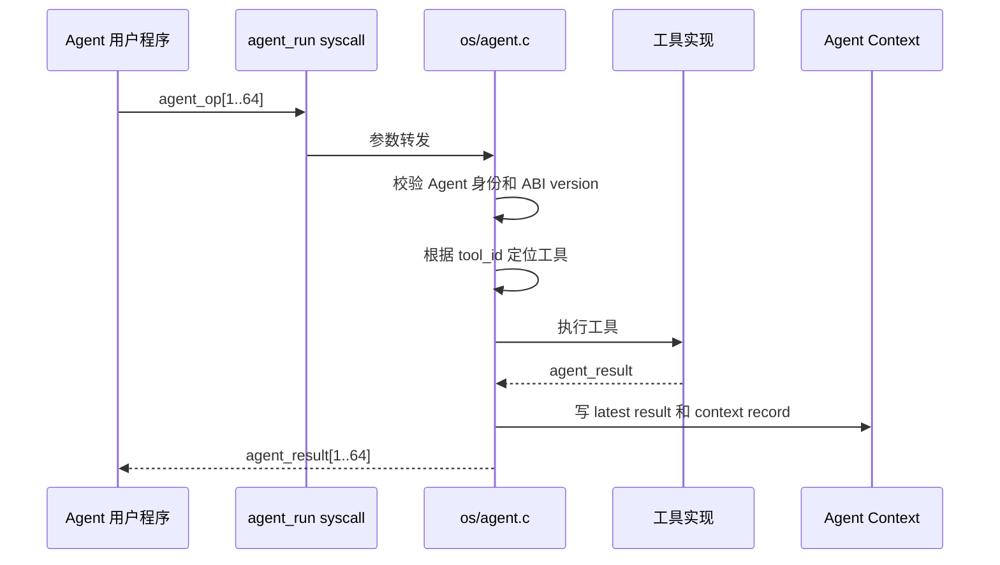

### 6.3 Context Snapshot

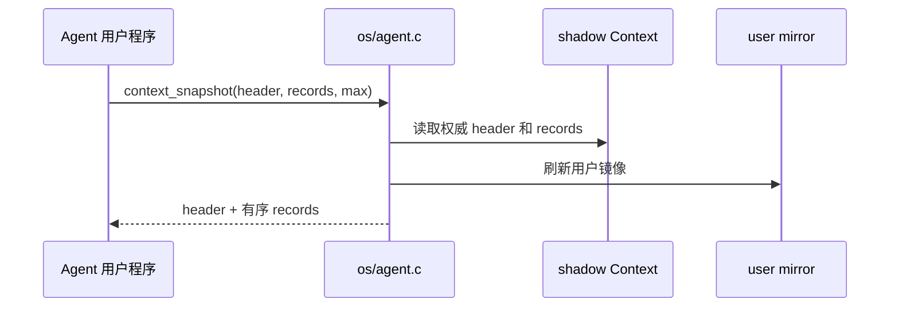

### 6.4 运行轨迹查询

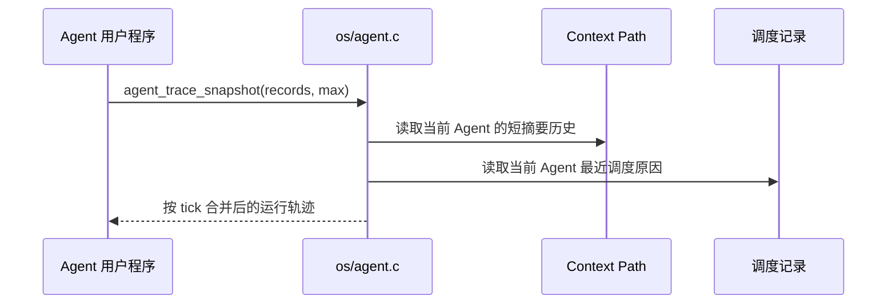

`agent_trace_snapshot()` 不替代 `context_snapshot()` 或 `agent_sched_snapshot()`。它只把两类已有权威数据整理成同一个短视图，方便 Agent 和演示程序说明“哪个工具调用发生在前、调度器随后为何运行该 Agent、事件等待何时被消费”。

### 6.5 全局审计视图

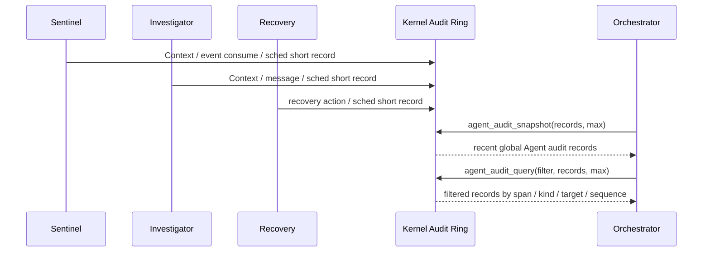

`agent_audit_snapshot()` 面向综合演示和系统级观测。它维护最近 512 条全局短记录，来源包括 Context 追加、事件入队、事件消费、调度 dispatch 和预取提示交接。每条审计记录写入 `prev_hash` 和 `record_hash`，后续记录的 `prev_hash` 指向上一条记录的 `record_hash`。`agent_ledger_snapshot()` 不复制明细，只返回当前可见 sequence 范围、累计写入数、已淘汰数、分类计数、`observe_epoch` 和链尾 `ledger_hash`，用于最终页面快速确认当前运行事实流属于同一条内核维护的链。普通进程不能调用，非 orchestrator Agent 会被拒绝。`agent_audit_query()` 在同一组短记录上按 flags 过滤，支持按 span、kind、pid/source/target、role、tool、event、status 和起始 sequence 查询。`agent_span_trace_snapshot()` 使用同一组全局短记录，但只返回当前 Agent 的 `current_span_id` 对应记录，不接受用户态传入任意 span id；它使 investigator、recovery 这类参与者能在当前协作链中自查 Context、事件和预取交接来源。`labdemo_ucore` 在 investigator 阶段检查该接口包含 Context、事件和预取记录；三个角色 Agent 退出后，orchestrator 再查询全局接口，并验证记录中同时出现 sentinel、investigator、recovery，且包含 Context、事件、调度和预取交接证据；随后再按 kind、span、文件状态事件、预取 source/target 和最新 sequence 过滤，说明全局短记录支持按条件读取，而不是只能整包读取。

### 6.6 统一 timeline 导出

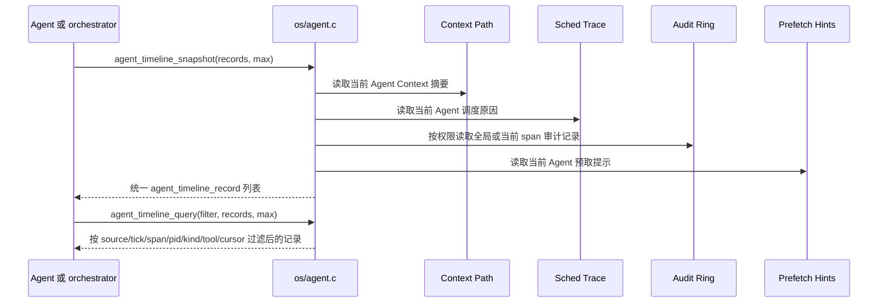

`agent_timeline_snapshot()` 是给最终演示页面和科研平台运行详情准备的统一导出层。它不新增一套新的权威历史，而是把已有 Context、调度、审计和预取提示规范化成 `agent_timeline_record`：`source` 标明原始来源，`kind` 保留原来源内部类型，pid、span、cause、tool、event、status、value 和短文本摘要使用统一字段。Context 审计记录会保留工具结果的 `value0/value1/value2`，因此 `read_file_digest` 产生的 size、bytes 和 hash 可以进入同一条时间线记录。普通 Agent 只能看到自身 Context、调度、预取提示以及当前 span 的系统短记录；orchestrator 能额外看到全局审计记录。这样最终页面不必分别解析四套 ABI，也不必把串口日志当作主要证据来源。

`agent_timeline_query()` 是同一导出层上的内核侧过滤接口。它先按角色和 capability 得到当前 Agent 已可见的记录集合，再按 source mask、起始 tick、span、kind、pid/source/target、role、tool、event、status、flags 和 after-cursor 过滤。after-cursor 由上一条已读记录的 `tick/source/sequence` 组成，比较顺序与导出顺序一致，因此同一个 tick 中的多条 Context、调度、审计和预取提示记录不会被重复读取，也不会被跳过。它的设计目的不是新增权限，而是减少最终页面反复全量拉取、再在用户态筛选无关记录的成本。`agentfinal_ucore` 用 source mask、start tick 和 after-cursor 检查过滤结果，`labdemo_ucore` 用 source/kind/source_pid/target_pid/flags 精确拉取 sentinel 到 investigator 的 prefetch handoff 记录，用 `tool_id=AGENT_TOOL_READ_FILE_DIGEST` 精确拉取内容摘要证据，并用 after-cursor 验证多 Agent 场景可以增量读取。

`agent_timeline_wait()` 是 timeline query 的事件驱动补充，`agent_timeline_read()` 是 wait+query 的合并热路径。内核维护一个轻量 observe epoch，并在每个等待中的 Agent PCB 里保存本次等待的 `agent_timeline_filter`。Context、调度、审计和预取提示写入时递增 epoch，并把本次写入转换成统一 `agent_timeline_record`，随后直接用等待者保存的完整 filter 判断是否需要唤醒；source、event、status、tool、span、pid 和 flags 都会参与判断。调用者传入同一套 filter：如果当前已经有匹配记录，立即返回匹配数量；如果没有匹配记录，Agent 进入睡眠，直到新运行事实写入或 timeout 到期。该接口让最终 Web UI 或 Agent worker 可以“等到有新事实再读”，而不是循环调用 query。`agentfinal_ucore` 覆盖 timeout、source 不匹配不唤醒、event 不匹配不唤醒、heartbeat TIMER audit 唤醒和 wait-and-read 复制路径，`agentbench_ucore` 记录 ready fast path。

`agent_provenance_snapshot()` 是同一观测体系下的因果图接口。timeline 按时间回答“发生了什么”，provenance edge 按 `source_type/source_sequence -> target_type/target_sequence` 回答“哪条 Context、审计或预取记录触发了后续记录”。它导出当前 Agent 自己的 Context 因果边和本地预取边；审计边沿用 timeline 的可见规则，orchestrator 可以看到全局，多数参与 Agent 只能看到当前 span。`agentfinal_ucore` 用它验证 `sequence 1 -> sequence 2` 的 Context 边和 audit 边，`labdemo_ucore` 用它验证 sentinel 到 investigator 的 message、prefetch handoff 和 investigator 内容摘要证据边。

### 6.7 文件查询和 Agent Loop

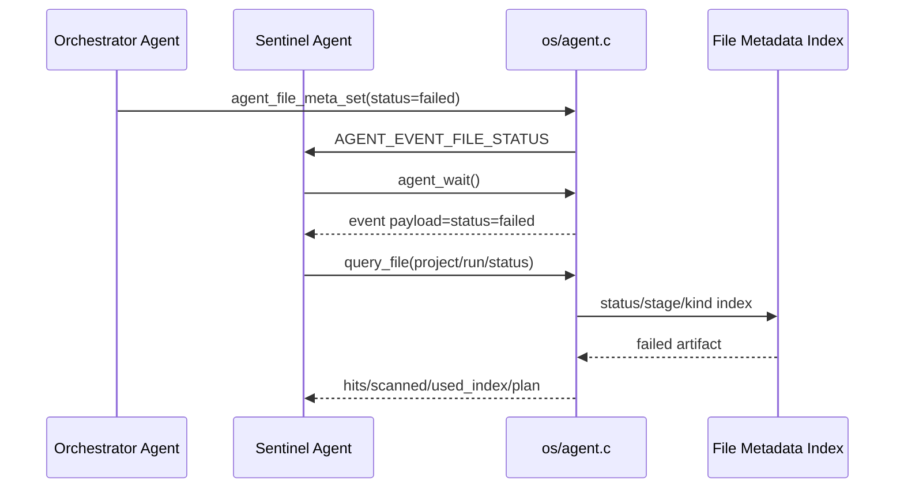

### 6.8 文件编辑冲突处理

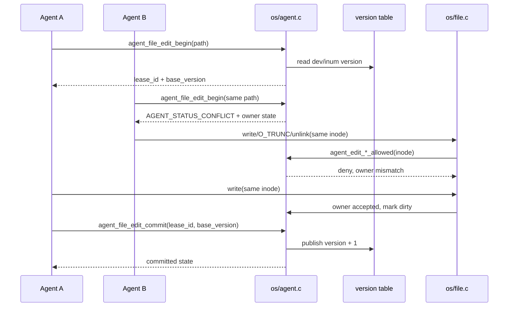

文件编辑租约的资源身份是真实 `dev + inum`。用户态传入的短文件名只用于找到 inode 和输出可读状态，不能伪造另一个资源身份。内核维护两张小表：版本表保存每个已触达文件的版本，租约表保存当前持有者、租约编号、基准版本、deadline、dirty 标志和冲突次数。真实文件修改入口在 `os/file.c`，因此即使另一个 Agent 绕过 `agent_file_edit_begin()` 直接 `open` 后 `write`，只要目标文件存在租约，内核仍会拒绝非持有者写入。

该机制采用无等待的独占租约：已有持有者时新申请立即返回 `AGENT_STATUS_CONFLICT`，调用者可以读取 owner pid、owner role、base/current version 和 conflict count，然后选择等待事件、重新读取文件、转交 orchestrator 或走恢复流程。租约有有限 TTL；持有者异常退出或长时间不提交时，下一次相关操作会释放过期租约。如果租约持有者写过文件，释放时也会推进版本，避免后续调用者仍基于旧版本继续提交。

提交使用版本检查：`expected_version` 必须等于 `agent_file_edit_begin()` 返回的 `base_version`，且版本表当前值也必须仍等于该基准版本。否则返回 `AGENT_STATUS_STALE`，租约仍保持 active，调用者需要放弃、重新读取或重新生成结果。该机制阻止无序覆盖，但不做内容自动合并；内容合并仍应由上层 Agent 工作流或恢复 Agent 决策。

## 7. 部署视图

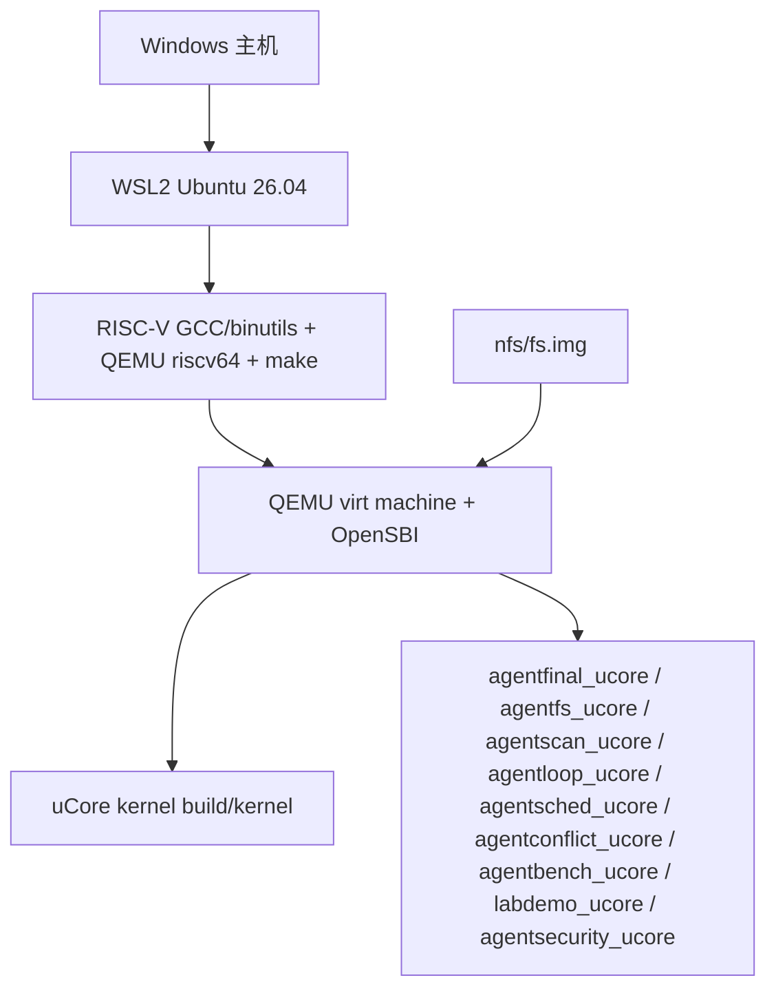

## 8. 横切概念

### 8.1 ABI 版本和布局检查

`AGENT_CALL_VERSION` 和 `AGENT_CONTEXT_VERSION` 用于区分用户态请求协议和 Context 布局。当前 `AGENT_CONTEXT_VERSION = 6`。Context header、latest result 和 128 条 `agent_context_record` 放入 6 页 Agent Context，其中 record 区从第 1 页开始，尾部通过 header 暴露 `user_cache_offset` 和 `user_cache_size`。当前测试输出中，用户自管 cache 起点为 21504，大小为 3072。

### 8.2 地址空间隔离

只有 Agent 进程会安装 Agent Context 特殊映射和对应 metadata。普通进程调用 Agent-only syscall 时返回错误。Agent Context 固定在 trapframe 下方，用户态 ABI 中定义为 `AGENT_CONTEXT_BASE`。该地址对每个 Agent 是相同虚拟地址，但映射到不同的物理页。当前实现保证 Agent Context 特殊页不可执行；普通用户程序其他页面仍按当前 uCore 装载方式映射，不宣称全局 W^X。

### 8.3 shadow 权威历史

Agent Context 分为两份：

- `agent_shadow_kva[6]`：内核私有权威页，用户态不能直接访问；
- `agent_ctx_kva[6]`：用户态镜像页，用于直接读取最新结果和历史摘要。

用户态写坏镜像页不会改变 `context_query()`、`context_snapshot()` 或 `context_detail()` 返回的权威历史。`context_snapshot()` 会把 shadow 内容刷新到用户镜像页，但不会覆盖 Context 尾部的用户自管 cache。短摘要 record 之外的完整 `agent_op + agent_result + flags` 保存在内核 PCB 的最近 128 条 detail ring 中，由 `context_detail()` 查询。

### 8.4 因果链和 span

Context v6 为每条 `agent_context_record` 和每个 `agent_event` 增加 `cause_sequence` 与 `span_id`，并为 Context Path 增加完整性链：

| 字段 | 说明 |
| --- | --- |
| `cause_sequence` | 当前动作指向的前序 Context sequence；0 表示根节点 |
| `span_id` | 当前链路 ID，同一 Agent 决策链或跨 Agent 消息链共享该值 |
| `prev_hash` | 本条记录追加前的链尾 hash |
| `record_hash` | 由 prev_hash、本条记录核心字段和短文本摘要计算得到的记录 hash |

内核自动工具记录会使用当前 Agent 的 cause/span；写入成功后，当前 cause 更新为新 record 的 sequence。工具触发的消息、文件状态事件或策略拒绝事件会携带触发它的 sequence 和 span。目标 Agent 在 `agent_wait()` 成功消费事件后继承事件 span，后续工具调用会继续这个链路。

这个设计让演示中的 “sentinel 发现失败 -> investigator 查询原因 -> recovery 恢复” 不只是几段串口输出，而是能在内核 Context 与事件结构里保留可追踪的前后关系。完整性链记录相邻记录的顺序：第一条记录 `prev_hash=0`，后续记录的 `prev_hash` 必须等于上一条可见记录的 `record_hash`，header 中的 `latest_record_hash` 等于最新记录 hash。跨 Agent 事件中的 cause sequence 需要结合 source pid 与 span 解释；它不是全局唯一整数，也不是磁盘持久化审计日志。

### 8.5 错误语义

Agent-only syscall 对普通进程、非法参数、未知工具、历史节点不存在、空间不足、等待超时、权限拒绝和重复幂等动作返回明确状态码。错误码详见 [api.md](api.md)。

### 8.6 并发和事件

Agent Loop 使用进程字段保存 8 条 watch、16 槽 FIFO 事件队列、一次性 wait cancel 令牌、等待次数、超时次数和心跳信息。`agent_wait()` 优先处理取消令牌，再消费队列中的事件；没有事件时，有限 timeout 和无限等待都进入睡眠，由事件入队、deadline 到期、heartbeat 到期或取消令牌唤醒；`agent_wake()`、`agent_wait_cancel()`、文件状态变化和消息工具可以唤醒目标 Agent。时钟中断调用 `agent_tick()` 处理 timeout deadline 和 heartbeat 到期。TIMER 事件同样受 watch/filter 控制。`agent_sched_config()` 允许 orchestrator 调整目标 Agent 的 policy、weight、priority 和 budget；调度器持续维护完整的 dispatch、preemption、vruntime、last_reason 和 last_score 计数，对事件队列、deadline、heartbeat、priority 等关键调度原因即时写入 `agent_sched_record`，对普通调度按固定间隔采样写入，记录分数、原因 flags、事件数量、deadline、heartbeat、虚拟运行量和预算使用情况，便于解释某次调度是由事件、等待时间、角色权重、配置优先级还是其他因素触发，同时避免短周期 Agent 工作流被重复观测写入拖慢。全局审计 ring 会同步记录 Context、事件、调度和预取提示交接摘要，便于 orchestrator 在综合演示结束时查询系统级运行证据；过滤查询让 orchestrator 可以只取某个 span、某类事件、某个预取交接或某个目标 Agent 的相关记录。

### 8.7 角色与能力

Agent 的真实角色保存在内核 `struct proc.agent_role` 中，能力保存在 `agent_capability_mask` 中。`agent_create()` 默认只创建最低权限 sentinel；pid 1 的普通 init 以及 pid 1 的直接普通子进程只能通过 `agent_create_role(AGENT_ROLE_ORCHESTRATOR)` 创建 orchestrator；具备 `AGENT_CAP_ORCHESTRATE` 的 Agent 才能创建 recovery、investigator、sentinel 等其他角色。

敏感授权不读取用户态传入的 role。`capability_check`、`action_commit`、`artifact_update`、`llm_response`、文件元数据写入和事件投递都按当前进程真实 capability 判断。因此 sentinel 即使把 `agent_op.arg0` 填成 recovery，也不能获得动作提交、工件更新或 LLM Relay 能力。`rerun_stage` 和 `write_report` 保留为旧演示兼容名称，内部仍走通用授权、状态更新、事件记录和重复请求判断路径。

`labdemo_ucore` 中普通 init 只启动 orchestrator Agent；文件元数据初始化、失败注入、对象依赖注册和子 Agent 创建都由 orchestrator 发起。`agentsecurity_ucore` 专门覆盖普通进程直接调用 `agent_wake()`、`agent_file_meta_init()`、`agent_file_meta_set()` 失败，pid 1 直接子进程启动 orchestrator，初始化前索引查询，legacy tool mismatch，sentinel 伪造 recovery 被拒绝，以及多 run 定向动作更新。

### 8.8 性能

性能优化集中在四个方面：

1. `agent_run()` 将最多 64 个工具操作合并为一次 syscall。
2. 工具 ID 查找避免热路径字符串扫描。
3. 用户态可直接读取 Context 镜像中的 header 和 latest result。
4. `context_snapshot()` 一次返回多条有序历史，避免逐条 query。

文件查询性能通过扫描路径和索引路径的候选记录数差异体现。当前索引覆盖 state/label/type 三类通用对象属性，ABI 字段名兼容保留为 `status`、`stage` 和 `kind`。查询结果会返回 `plan`、`plan_reason`、`index_bucket` 和 `candidate_records`，说明索引选择原因。索引路径之上还有 8 槽 generation-aware 查询结果缓存；重复执行同一个非强制扫描命中查询时，内核直接复用同一 `fs_generation` 下的结果，并在 `plan_reason` 中设置 `CACHE_HIT`。空结果和自动扫描进行中的查询不进入缓存，避免等待真实文件出现时读到过期空结果。文件元数据变化后 generation 增加，旧缓存自动失效。用户态可以通过 `dependency_update` 注册 namespace、run_id、source、target 和 relation 组成的通用依赖记录；旧的 `dependency_mask` 仍作为紧凑兼容输入。查询命中后，内核结合这些通用记录生成最多 8 条当前 Agent 可见的 metadata 预取提示，同时把带 span 的提示写入 32 条全局 span 预取提示总线。`agentfs_ucore` 会检查 scan/index 返回语义一致、query plan、查询缓存、缓存失效、显式依赖注册、预取提示和结果截断标志，`agentbench_ucore` 同时输出多轮 tick min/avg/max 观测。`labdemo_ucore` 进一步把提示用于多 Agent 协作：sentinel 产生 `analyze` 提示后发送普通 message，内核在 message 入队时把发送者的预取提示复制到 investigator 的提示 ring 并增加 `HANDOFF` 原因位；investigator 从自己的 `agent_file_prefetch_snapshot()` 中读取该提示，也能从 `agent_file_prefetch_span_snapshot()` 读取同一 span 中带 source/target pid 的全局提示，随后补读 analyze 摘要，再把该 sequence 纳入 LLM 和计划事件。`labbench_ucore` 是面向初步演示规划的性能入口，当前包装运行 `agentbench_ucore`，后续可扩展为 `labbench --full`。

## 9. 架构决策

| 决策 | 选择 | 理由 | 取舍 |
| --- | --- | --- | --- |
| Agent 创建方式 | 使用 `agent_create()` 兼容创建 sentinel，使用 `agent_create_role()` 创建指定角色 Agent | 与 uCore 现有进程模型结合直接，且能把 role/capability 绑定到内核 PCB | 暂未支持用户态自定义配额或任意 capability 组合 |
| Context 地址 | 固定高地址 `AGENT_CONTEXT_BASE`，当前 6 页 | 便于用户态直接定位，并给 Context Path 完整性链和用户自管 cache 留出容量 | 每个 Agent 固定占用 6 页 |
| 工具协议 | 最终热路径为 `agent_op` / `agent_result`，名称协议作为正式结构化入口保留 | 比字符串键名协议更紧凑，适合批量执行；名称协议便于演示和兼容赛题描述 | 工具 ID 需要保持稳定 |
| Context Path 容量 | 固定 128 条环形记录，每条包含 16 字节 payload/result 短文本摘要和 prev/record hash，并在内核 PCB 中保存最近 128 条完整请求/响应详情 | 可检查 FIFO 淘汰、相邻记录顺序和可审计详情；Context 尾部留给用户自管 cache | 更长历史需要后续持久化 |
| Context 因果字段 | 每条记录和事件保存 cause/span，事件消费后目标 Agent 继承 span | 让多 Agent 协作过程可以从内核结构中追踪 | 当前是内存态轻量追踪，不替代持久化审计系统 |
| 运行轨迹接口 | `agent_trace_snapshot()` 合并 Context 摘要和调度原因 | 让 Agent 直接获得“工具调用 + 调度原因”的同一视图，避免只靠用户态日志拼接 | 当前只覆盖当前 Agent 的内存态短记录 |
| 当前 span 短记录接口 | `agent_span_trace_snapshot()` 返回当前 Agent 所在 span 的系统级短记录 | 让参与协作的 Agent 不依赖 orchestrator 也能解释本轮事件、Context 和预取交接来源 | 只返回当前 span，不提供任意全局过滤 |
| 全局审计接口 | `agent_audit_snapshot()` 返回最近 512 条全局短记录，`agent_audit_query()` 执行过滤查询，并保留 Context 工具结果数值槽 | 让 orchestrator 在多 Agent 场景中直接读取和筛选 Context、事件、调度、预取交接和内容摘要证据 | 当前是内存态短摘要，不保存完整请求响应 |
| Run Ledger 摘要 | `agent_ledger_snapshot()` 返回全局审计链尾 hash、sequence 范围和分类计数 | 让最终页面用一个小结构确认当前全局短记录仍属于同一条内核维护的运行事实链 | 当前不是跨重启持久化保证，也不带签名 |
| 统一 timeline 接口 | `agent_timeline_snapshot()` 把 Context、调度、可见审计和预取提示导出为同一结构，`agent_timeline_query()` 在可见集合上做内核侧过滤和 after-cursor 增量读取，`agent_timeline_wait()` 让调用者等待匹配记录出现 | 让最终 Web UI 和科研平台运行详情直接消费一个规范化记录流，减少无关记录复制和主动轮询 | 不保存完整 raw 请求/响应，长文本仍需专门文件或详情接口 |
| 因果图接口 | `agent_provenance_snapshot()` 把可见 Context、审计和预取提示转换成因果边 | 让最终 Web UI 可以直接画出跨 Agent 触发关系，而不是在用户态猜测日志关系 | 当前是短摘要内存图，不是持久化 provenance 数据库 |
| 工具查找 | ID 直接定位，legacy name 兼容 | 最终性能路径避免字符串扫描 | 工具 ID 需要保持稳定 |
| 批量执行 | `agent_run()` 一次最多 64 个 op | 减少 syscall 次数，提高端到端吞吐 | 单个 op 错误通过 result 表达 |
| 文件查询实现 | 采用 Agent 子系统元数据表、`dev + inum` 主键、私有 `.agentmeta` 元数据文件、查询计划解释、generation-aware 结果缓存和调度器空隙根目录扫描 | 关联真实 uCore 根目录文件，同时保留属性查询、索引优化、重复查询复用、重新加载、自动维护和索引选择可解释能力 | 当前只扫描 uCore 根目录，不做多级目录递归 |
| 文件内容摘要 | `read_file_digest` 受 `CONTENT_READ` capability 控制，按 selector 读取真实文件短预览、最多 4096 字节内容和 FNV-1a 指纹；绑定 Agent metadata 的真实文件进入 8 槽内容版本感知 digest cache | 让 Agent 在 metadata 命中后取得轻量内容证据，重复读取同一文件证据时复用结果，并自动进入 Context/timeline | 不是全文搜索，不建立内容倒排索引；未绑定 Agent metadata 的普通文件不缓存 |
| 文件编辑冲突处理 | 使用 `dev + inum` 独占编辑租约和版本提交检查，并接入真实 `write/O_TRUNC/unlink` 路径 | 防止两个 Agent 无序覆盖同一真实文件，也能向上层返回持有者和版本信息 | 不做内容自动合并；上层仍需决定重新生成、等待或恢复 |
| 对象预取提示 | 文件查询命中后按用户态注册的对象标签依赖生成每 Agent 8 条 metadata 提示，并写入同一 span 的 32 条全局提示总线；message 入队时可由内核交接给接收者 | 把 Agent 历史查询路径转化为内核可见的下一步候选，并让同一因果链上的 Agent 直接查询跨 Agent 提示，贴合赛题“预测性预取”方向 | 当前只提示 metadata，提示本身不预读文件内容 |
| LLM 友好路径 | 内核记录 `llm_request`/`llm_response`，使用 `LLM_RELAY` capability 限制结果投递，并用 `AGENT_EVENT_LLM_DONE` 唤醒请求 Agent | 让 LLM 驱动 Agent 的请求、结果、Context、事件和审计进入 OS 管理视野，同时不让内核持有 secret 或访问网络 | 真实云端模型调用由用户态或宿主机 relay 实现 |
| Agent Loop | watch/unwatch/wait/wake/wait_cancel/heartbeat/sched_snapshot/sched_config 独立 syscall，并让调度器感知 Agent 状态 | 等待事件不放进 batch 热路径；调度原因由内核记录，orchestrator 可受权调整目标 Agent 参数 | 后续仍需复杂策略语言 |
| 基础 syscall 兼容 | 实现 `SYS_trace=410`、`SYS_mailread=401`、`SYS_mailwrite=402` | 满足代表性 uCore 基础测试和普通进程消息接口 | 不把当前工作扩大成全部 chapter 的完整兼容验收 |
| 演示日志契约 | 输出 `agentos:event type=... key=value`，包含 plan、corr_id、模板 LLM refs 和 report 字段 | 后续大屏和 LLM Gateway 不需要重写核心演示程序 | 当前仓库尚未实现宿主机大屏 |
| 文档结构 | 主设计文档 + API/验证/追踪 + 分任务附录 | 满足架构说明、关键决策、测试和运行说明 | 文档数量增加，需要维护一致性 |

## 10. 质量要求与验证

| 质量要求 | 当前证据 |
| --- | --- |
| Agent 进程可创建并初始化 PCB 字段 | `agentfinal_ucore` |
| Agent Context 可直接读取 | `agentfinal_ucore` |
| 至少 3 个结构化工具可调用 | `agentfinal_ucore` 批量调用 echo，`labdemo_ucore` 调用多种任务四/五工具 |
| Context Path 支持 5 轮以上连续调用 | `agentfinal_ucore` 连续写入 192 个 op |
| Context Path 保留短文本摘要 | `agentfinal_ucore: short_text_history=1` |
| Context Path 记录因果链 | `agentfinal_ucore: causal_context=1` |
| Context Path 保存完整性链 | `agentfinal_ucore: context_integrity=1` |
| Context 和调度原因可合并查询 | `agentfinal_ucore: runtime_trace=1` |
| 当前 span 短记录可由参与 Agent 查询 | `agentfinal_ucore: span_trace=1`、`labdemo_ucore: investigator span_trace ...` |
| 多 Agent 全局审计可查询 | `labdemo_ucore: global_audit=1`、`labdemo_ucore: audit_query=1` |
| 全局运行账本摘要可验证审计记录相邻顺序 | `agentfinal_ucore: run_ledger=1` |
| Context、调度、审计、预取提示和内容摘要证据可统一导出、过滤并等待 | `agentfinal_ucore: unified_timeline=1`、`agentfinal_ucore: timeline_query=1`、`agentfinal_ucore: timeline_wait=1 timeout=-7 source_gate=1 event_gate=1 wake=1 query=1 read=1 sleeps=1 wakeups=1`、`labdemo_ucore: timeline_query prefetch=3 cursor=... digest=1` |
| 可见因果关系可由内核导出为边 | `agentfinal_ucore: provenance_graph=1 edges=126 context=1 audit=1`、`labdemo_ucore: provenance_graph edges=... message=1 prefetch=1 digest=1` |
| 用户自管 Context cache 不被 snapshot 覆盖 | `agentfinal_ucore: user_cache_preserved=1` |
| 名称协议结构化工具调用可用 | `agentfinal_ucore: legacy_name_protocol=1` |
| 路径超长自动淘汰 | `agentfinal_ucore` 验证 128 容量 FIFO |
| 有性能数据 | `agentbench_ucore` 输出吞吐表，`labbench_ucore` 提供演示规划入口 |
| 文件属性查询、inode 关联、私有 `.agentmeta`、索引、查询缓存和查询计划 | `agentfinal_ucore`、`agentfs_ucore: .agentmeta_reload=1`、`agentfs_ucore: query_cache=1 ...`、`agentbench_ucore: file_query_cache hit=1 ...`、`labdemo_ucore` |
| 两个 Agent 同时编辑同一文件时由内核拒绝非持有者真实写入 | `agentconflict_ucore: conflict_denied=1 direct_write_denied=1` |
| 文件提交使用版本检查，旧版本不能覆盖新版本 | `agentconflict_ucore: stale_commit=1 versioned_commit=1` |
| 基于查询历史的文件预取提示 | `agentfinal_ucore: prefetch_hints=1`、`agentfinal_ucore: span_prefetch=1`、`agentfs_ucore: prefetch_hints=1`、`agentbench_ucore: file_prefetch_snapshot ...`、`labdemo_ucore: sentinel prefetch_hint ...`、`labdemo_ucore: investigator handoff_prefetch ...`、`labdemo_ucore: investigator span_prefetch ...`、`agentos:event type=PREFETCH_USED ...` |
| 根目录自动扫描和索引自动维护 | `agentscan_ucore: background_scan usershell=1`、`agentscan_ucore: auto_file_create=1`、`agentscan_ucore: auto_file_delete=1` |
| Agent Loop 等待、超时、取消、心跳和唤醒 | `agentfinal_ucore`、`agentloop_ucore: timeout_sleep_no_poll=1`、`agentloop_ucore: wait_cancel=1`、`agentloop_ucore: timer_unwatch=1`、`agentbench_ucore: timeout_heartbeat=1`、`labdemo_ucore` |
| Agent 事件携带因果信息 | `agentloop_ucore: event_causality=1` |
| Agent 感知调度 | `agentsched_ucore: role_weights ...`、`agentsched_ucore: configurable_policy=1`、`agentsched_ucore: event_priority=1`、`agentsched_ucore: reason_trace=1`、`agentsched_ucore: fairness=1` |
| 综合场景 | `labdemo_ucore: passed` |
| 权限不能由用户态伪造 | `agentsecurity_ucore: passed` |
| 代表性 uCore 基础 syscall | `ch3_trace`、`agentsecurity_ucore: mail_basic=1` |

详细验证见 [verification.md](verification.md) 和 [test-record.md](test-record.md)。

## 11. 风险和后续需要补充的内容

| 风险 | 影响 | 后续处理 |
| --- | --- | --- |
| Context Path 容量和文本长度固定 | 只能保留最近 128 条记录，且 payload/result 各保留 16 字节摘要 | 后续可引入持久化、分页上下文或完整日志 |
| `agentbench_ucore` 使用 tick 计时 | 分辨率较粗，短路径差异不明显 | 增加循环次数或补充更细粒度计数机制 |
| 文件扫描范围有限 | 当前自动扫描 uCore 根目录并维护自动元数据和索引 | 后续可扩展多级目录递归扫描、更多文件分类规则和索引压缩 |
| Agent 调度策略表达能力仍有限 | 当前能验证角色权重、受权配置、事件优先、deadline、heartbeat、等待时长和虚拟运行量 | 后续扩展复杂策略语言和多核压力测试 |
| 因果链和 Run Ledger 仍是内存态轻量追踪 | 当前能追踪最近 128 条 Context、事件继承关系和最近 512 条全局审计 hash 链，进程退出后不保留 | 后续可接入持久化日志、签名或宿主机审计服务 |
| 真实云端 LLM Relay 未接入 | 当前内核提供 template relay 所需的结构化请求、响应事件、Context 和审计记录 | 后续实现宿主机 LLM Relay 和 schema 校验 |
| 可视化大屏未实现 | 当前只能看 QEMU 串口输出 | 后续解析 `agentos:event` 构建大屏 |

## 12. 术语表

| 术语 | 含义 |
| --- | --- |
| Agent 进程 | 被内核标记并分配 Agent Context 的特殊进程 |
| Agent Context | Agent 用户地址空间中的固定镜像区域，用于高速读取响应和上下文路径；权威状态在内核 shadow 页 |
| Context Path | Agent 多轮工具调用或手动上下文节点组成的历史路径；当前实现为 128 条短文本摘要记录 |
| Run Ledger | 内核为全局审计短记录维护的运行事实摘要，包含 sequence 范围、分类计数和链尾 hash |
| 工具调用 | Agent 通过结构化请求调用内核提供的能力 |
| 文件对象元数据表 | Agent 子系统维护的文件对象属性表，服务任务四查询优化；科研工件只是其中一种用户态对象 |
| Agent Loop | watch、wait、wake、heartbeat、event delivery 和 timeout 组成的 Agent 事件运行机制 |
| agentos:event | shell 输出中的稳定键值事件格式，供后续大屏和 LLM Gateway 解析 |
| ABI | 用户态和内核态共同遵守的结构体、常量和系统调用约定 |
