# 主设计文档：AgentOS-uCore

本文是根目录 AgentOS-uCore 目标的主设计文档。文档按“目标、架构、模块、运行路径、接口关系、测试证据、文件索引”的顺序组织，同时保留操作系统项目需要的设计决策和验证依据。

## 1. 引言与目标

### 1.1 系统目标

本项目基于 uCore 教学操作系统，在内核中加入面向 AI Agent / LLM 工作流的通用支持层，使内核能够识别 Agent 进程、提供结构化内核工具调用、维护 Agent 多轮调用上下文路径，并支持文件对象语义查询、事件驱动 Agent Loop、调度提示、timeline、audit ledger、provenance、文件编辑租约和 LLM Relay 所需的事件/Context 记录能力。

AgentOS-uCore 把 Agent 进程、工具调用、Context、文件对象、事件、权限和可观测状态做成可复用机制。科研 Agent 平台是主要示例负载，用来呈现这些机制如何支撑真实多 Agent 工作流。

### 1.2 使用者和关注点

| 使用者 | 关注点 |
| --- | --- |
| 项目用户 | 是否能在 QEMU 中稳定运行；赛题基础任务是否有对应实现；设计、创新点和验证证据是否清晰 |
| 开发者 | Agent 子系统是否模块化；系统调用 ABI 是否稳定；任务四、五、六能否继续复用同一组机制 |
| 用户态 Agent 程序 | 是否能用结构化接口请求内核工具；是否能高速读取 Context 镜像；是否能在需要可信历史时使用 snapshot |
| 操作系统内核 | 是否保持普通进程兼容性；是否控制地址空间、锁、生命周期和错误路径 |
| 结果材料 | 是否能把底层 syscall 串成一个用户容易理解的多 Agent 场景，同时不把示例策略混入内核机制 |

### 1.3 质量目标

| 优先级 | 质量目标 | 可验证方式 |
| ---: | --- | --- |
| 1 | 稳定性 | `agentfinal_ucore`、`agentbench_ucore`、`labdemo_ucore`、`agentsecurity_ucore` 均通过且无 kernel panic |
| 2 | 可检查性 | 每个赛题要求能追踪到实现、测试和文档 |
| 3 | 模块化 | `os/agent.c` 只保留稳定 facade；身份、IPC、metadata、观测、Context 和生命周期由明确 owner 模块维护，CI 检查依赖方向和体积预算 |
| 4 | 性能 | 批量工具调用、用户态直接读 Context、批量 Context Snapshot、文件索引查询 |
| 5 | 可扩展性 | 文件对象字段、`agentos:event`、Context Path、Loop 状态、工具表、cause/span 因果链、统一 timeline、Run Ledger 摘要和 LLM Relay 事件可继续扩展到科研 Agent、代码 Agent、运维 Agent、写作 Agent 等不同负载 |

## 2. 约束

| 类型 | 约束 |
| --- | --- |
| 基底系统 | uCore 教学操作系统，RISC-V 64 |
| 运行环境 | QEMU virt machine，OpenSBI 默认启动 |
| 开发环境 | 已验证 WSL2 Ubuntu 26.04；通用要求为 Linux、RISC-V GCC/binutils、QEMU riscv64、make、git |
| 编译工具链 | 已验证 `riscv64-linux-gnu-`；Makefile 可接受 `riscv64-unknown-elf-` |
| 兼容性 | Agent 交付以 `CHAPTER=agent` 为验收主路径；补充验证 `trace` 和普通进程 mail 等代表性基础 syscall；Agent syscall 使用 500 起的扩展编号 |
| 当前范围 | 任务一至五增强实现；任务六提供可运行综合示例 |
| 当前范围说明 | 文件扫描覆盖 uCore 根目录短文件名；云端模型访问由用户态或宿主机 Relay 完成；页面和图表由宿主机工具生成 |

## 3. 上下文与范围

### 3.1 系统上下文

上图采用用户态/内核态分层方式呈现系统位置。用户态科研 Agent 平台、测试程序和宿主机工具通过 syscall ABI 使用 Agent 内核能力；内核中的 Agent 子系统管理 Agent 进程、Context Path、工具执行、文件对象服务、事件循环、调度提示和审计记录；uCore VFS 的真实文件修改路径会调用 Agent 文件编辑租约检查，避免两个 Agent 无序覆盖同一文件。

下面的 Mermaid 图保留为可编辑的关系摘要，便于在文本复现实验环境中快速查看依赖关系。

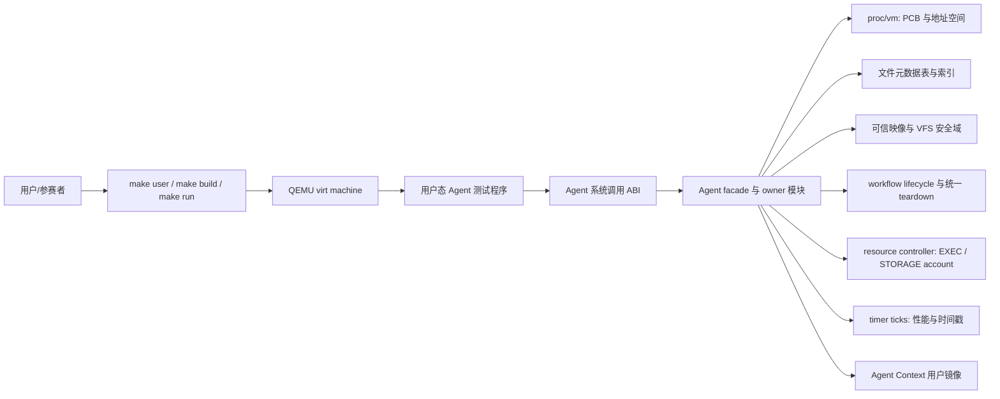

### 3.2 当前范围

| 范围 | 状态 |
| --- | --- |
| Agent 进程创建、标记和信息查询 | 已实现 |
| Agent Context 固定用户虚拟地址区 | 已实现，当前为 6 页用户镜像区，尾部包含用户自管 cache |
| 结构化工具调用和工具列表 | 已实现，最终热路径为 `agent_run` 批量 ABI |
| 工具调用自动写入 Context Path | 已实现 |
| Context Path 手动追加/query/rollback/clear/snapshot | 已实现；公开 cause/span 由内核私有 source control/span owner 认证，手动 push 不得自报非零 cause/span |
| 文件元数据表、真实 inode 关联、属性查询、索引查询、metadata 双 bank 持久化、根目录自动扫描 | 已实现；所有对象记录按 kernel-issued workflow scope 分区，进程事务使用 FIFO ticket/wake-one 和 128-record 工作预算，scheduler 只做硬有界维护；显式依赖表与文件内兼容位图分离，消费者按需线性解析，不建立全局派生图；普通文件变化按 scope 合并，双 bank 由可恢复分块 COW 状态机后台写回 |
| Agent Loop 心跳、等待、唤醒和 Agent 感知调度 | 已实现 16 槽事件队列、同 scope stable-control IPC 路由、watch/unwatch、wait cancel、heartbeat、自适应调度、当前可信 span 短记录、scope-local audit/Run Ledger 和统一 timeline |
| legacy uCore mail 兼容 | 仅 PUBLIC；普通端点须同一 generation-safe EXEC account，workflow 降权 PUBLIC 还须同一 ACTIVE lifecycle/scope 和非零 OPEN controller lineage；Agent、跨账户/跨 scope 拒绝。进程/exec 轮换 endpoint generation；每目标首次合法发送才按目标 account 分配两页 sidecar，read 在 copyout 后提交，teardown 退款 |
| 安全与资源韧性 | 已实现 dynamic workflow scope、generation-safe lifecycle key、PUBLIC 降权后代撤销、唯一根 controller、capability + exact scope/owner、可信映像、W^X、VFS 隔离、统一 teardown、EXEC/STORAGE 资源账户、资源域两级调度、持久存储主体配额、块 I/O/cache 分域、分级保留量和 scope retirement 回收 |
| 代表性 uCore 基础 syscall | 已实现 `trace`、`mailread`、`mailwrite`；mail 保持 FIFO/16 槽接口但不再是全局裸 PID 通道 |
| 综合场景 | 已实现 `labdemo_ucore` 综合示例 |
| LLM 友好路径 | 已实现 `llm_request`、`llm_response`、`AGENT_EVENT_LLM_DONE`、Context 记录和事件唤醒；真实云端 relay 保持在用户态或宿主机桥接层 |
| 页面和图表 | 由宿主机工具读取结构化事件、状态文件和 CSV 生成 |

## 4. 解决方案策略

| 策略 | 说明 |
| --- | --- |
| Agent 子系统模块化 | `os/agent.c` 仅保留 ABI facade；运行时、Context、授权、通信、生命周期、观测和资源控制由版本化 owner 集合持有；metadata 再拆为 transaction、file state、catalog、query、scan、directory、objects、actions、prefetch 与 store（含 format/I/O），避免对象表继续形成单体文件 |
| 高性能 ABI | 最终热路径使用 `agent_op` / `agent_result` 和 `agent_run()`，一次 syscall 最多执行 64 个 op |
| shadow 权威 Context | Agent Context 扩为 6 页，内核保存 shadow 权威页和用户镜像页，写入时先更新 shadow 再同步镜像 |
| 用户态可读 Context | latest result 和历史路径同步到用户镜像，Agent 可直接读取，避免每次都系统调用查询；可信历史通过 shadow 和 snapshot 保证；Context 尾部保留用户自管 cache |
| 环形 Context Path | Context ABI v8 固定容量 128 条短文本摘要记录，超长按 header 明示的 FIFO 策略覆盖；rollback 分配不可复用 branch generation、保留旧历史且不复用 sequence，并以独立 path parent 维护 active path 和不可变 archive 的完整性链 |
| 内核维护因果链 | Context record 和事件公开 `cause_sequence` / `span_id`；按活跃 Agent 分配、资源计费的私有 sidecar 保存完整 detail、可信 source pid/control 与 span owner；`context_push` 的非零 cause/span 被拒绝 |
| 批量 Snapshot | `context_snapshot()` 一次返回 header 和按时间顺序排列的可见路径 |
| 文件对象查询引擎 | 物理 metadata 表固定 512 条：SYSTEM 64 条，最多 4 个 ACTIVE/CLOSING/RETIRING workflow 各 112 条；每个 workflow 的 AUTOSCAN 物化视图最多 96 条并为显式 metadata 保留 16 条。同一 resolver 在 scope 内聚合 fid、物理/逻辑路径和完整 `dev + inum + incarnation`，分裂命中不得选边；依赖记录每 scope 16 条；每次查询真实执行扫描或索引候选遍历，本次调用的精确 hit slot 供预取核验 selector、一次扫描文件表并最多发布 8 个唯一目标 |
| 文件编辑租约 | 租约表为 4 个 scope 各保留 8 条，内核用 `scope + dev + inum + incarnation` 识别对象，在真实 VFS 修改路径上拒绝跨 scope 或非持有者操作 |
| Agent Loop | 每个 Agent 有 16 槽 FIFO 和最多 8 条 watch；事件三层资源限制不变；跨 Agent `MESSAGE` / `LLM_DONE` 必须同时命中 stable route 与相同 active workflow scope，target consent 不能越过 scope |
| Agent 感知调度 | 调度器先严格轮转 active 资源域，再在选中域内按 FIFO 或 Agent 软评分选择线程；角色权重、orchestrator 配置的 priority/budget、事件队列、等待 deadline、heartbeat 到期、等待时长和虚拟运行量只影响域内选择，并记录最近 16 次 Agent 调度原因；域内连续 Agent 或分值选择最多 8 次 |
| scope 审计视图 | 物理 512 槽按 4 个 workflow 各保证 128；每 scope low/high 各64，low principal 上限16、high active principal 上限8。每 scope 另维护 sequence 与 `(tick, sequence)` 两个 128 槽有序索引，统一淘汰发布，查询不重扫全局物理表 |
| 内核角色与能力绑定 | `struct proc` 保存真实 role/capability/scope/control；敏感操作必须同时满足 capability、active scope 和精确对象 owner，不信任用户 role、PID 或公开 span |
| 可信执行与 VFS 安全域 | 构建清单把角色、bootstrap、RX/RW+NX 和 VFS profile 写入不可变 SYSTEM inode；loader 将有效能力绑定到动态 workflow scope，普通文件操作逐次校验 inode scope |
| Workflow lifecycle | 8 槽 ledger 为每次 admission 签发不可变 `(id, generation)`；ACTIVE+CLOSING+RETIRING 合计最多 4 个，槽仅在彻底回收后以更高 generation 复用；PUBLIC 降权、fork 和 exec 都不释放谱系引用，撤销按完整 key 扫描 |
| 通用资源控制器 | EXEC/STORAGE account 以 `{slot,generation}` 标识，统一核算进程、线程、file object、FS block/inode、buffer cache 和 Agent state page；ordinary/reserved、原子向量 reservation、CLOSING/DRAINING 与 rate lease 防止半发布和错账 |
| 统一 teardown | 正常 exit、主线程 fault、workflow revoke 和未发布构造回滚都进入同一个正向状态机；Agent 私有清理只通过 phase-aware、幂等的 `agent_proc_teardown()` 推进，REQUESTED 后禁止新对象发布，scheduler 在 idle stack 上完成最后栈页回收后才复用槽与账户 |
| 存储配额与保留量 | mkfs 与内核共享容量策略；按完成镜像空闲量计算后把 version/slots/PUBLIC principal/G/S/checksum 持久化到 superblock，挂载从 qmap/dinode 重建 PUBLIC 用量，workflow owner 只恢复 scope ID 下界，SYSTEM credit 由空闲量与 G/S 推导；每 scope 硬下限 320 inode/512 block，SYSTEM 硬下限 8 inode/512 block；当前平台镜像的存储保证为每 scope 342 inode/1195 block、SYSTEM 64/512。workflow inode 账户使用该独立 STORAGE domain limit，不受每 scope 112 条 metadata catalog 容量钳制 |
| 块 I/O 与 buffer cache 分域 | syscall 入口捕获稳定 owner/class；每次真实 `disk_submit` 是唯一物理计费边界，shared 560/280 与设备根同时扣减而不是额外容量；准入 account endpoint 不带债，reserved 设备端只由真实 account lease 背书带债；已接纳的有界原子多传输可在后续提交形成有上界的 owner lane debt，由 checkpoint/teardown settlement 清偿；global device debt 对非保护 lane 是 gate，SYSTEM/CONTROL 保护 lane可跨 owner lifecycle并由设备根 refill 清偿；syscall 544 使用 `version + struct_size + user_size` 的可扩展前缀 ABI；cache 为 SYSTEM、PUBLIC 和各 active workflow 维护 floor/cap，退役清理仅在轮到时取得 3/8 临时分区 |
| 可恢复资源耗尽 | inode、inode cache、数据块、文件表和线程分配失败返回错误并回滚；计费走 generation-safe resource account，`resource_domain_id` 仅用于 CPU 调度分区；每线程 16 KiB 虚拟栈按需取得物理页，保留 guard、canary 和调用图预算 |
| 增长预算 | `make ci-check` 在固定 profile 下检查源码、镜像、运行段、PCB、9 页 sidecar、完整 21 页 Agent 状态、栈虚拟/物理容量及 `ci/kernel-budgets.json` 登记的 owner/bridge 集合；metadata control plane 另受聚合 source/text/BSS 预算，防止靠跨文件迁移绕过单模块门；facade 不持有可写状态，受控符号图的 SCC 硬限由 checker 强制 |
| 通用动作和工件更新 | `action_commit` 与 `artifact_update` 作为核心对象状态更新工具，`rerun_stage` 和 `write_report` 只作为旧示例兼容别名；记录、事件 action 和重复请求判断都归入通用类别 |
| LLM Relay 支持 | 内核提供 `llm_request`、`llm_response`、`LLM_RELAY` capability 和 `AGENT_EVENT_LLM_DONE`；prompt/response 摘要进入 Context、timeline 和审计记录；云端 API、secret、HTTP/TLS 留在用户态 |
| 结构化事件 | `labdemo_ucore` 输出 `agentos:event type=... key=value`，为页面工具和 LLM Relay 保留解析契约 |
| 测试驱动验收 | 功能测试之外，以 `agentscope_ucore`、`iobudget_ucore`、资源专项和增长预算验证 scope、授权、资源耗尽及生命周期机制；371.5s、126.1s 与 13824/16384 均为重构前历史快照，generation/public-lineage、资源控制器、统一 teardown、lazy stack 和模块拆分必须以当前源码的新日志为准 |

## 5. 构件视图

### 5.1 一级模块

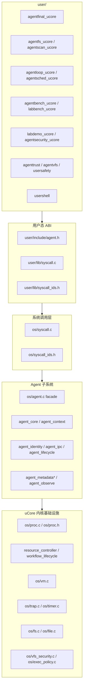

### 5.2 源码映射

| 构件 | 文件 | 职责 |
| --- | --- | --- |
| 用户态 ABI 声明 | `user/include/agent.h` | 暴露 Agent 结构体、常量和 syscall 原型 |
| syscall wrapper | `user/lib/syscall.c` | 封装 `agent_create`、`agent_run`、`context_snapshot` 等用户态调用 |
| syscall 编号 | `user/lib/syscall_ids.h`、`os/syscall_ids.h` | 注册 500 起的 Agent syscall 编号 |
| syscall 分发 | `os/syscall.c` | 根据 syscall id 调用 Agent 内核函数 |
| Agent ABI 与常量 | `os/agent.h` | 定义结构体、工具 ID、状态码、Context 布局 |
| Workflow lifecycle ABI | `agent_lifecycle_abi.h`、`user/lib/syscall.c`、`os/agent_lifecycle.c` | syscall 546 的版本化 sized-prefix 结构、self-only 快照与 expected-key 比较 |
| 稳定 facade 与公共 ABI | `os/agent.c`、`os/agent.h` | 保留历史入口和公共结构；不持有其他模块可写状态 |
| Agent 运行时与协调 | `os/agent_core.c`、`os/agent_internal.h` | 工具执行、公共流程编排和 owner 模块之间的窄接口 |
| Context owner | `os/agent_context.c`、`os/agent_context.h` | Context 映射、shadow/mirror、按需私有 sidecar、记录追加和 `sys_context_*` |
| Context path 投影 | `os/agent_context_path.c`、`os/agent_context_path.h` | record hash、不可变 archive 读取、active-path 有界回溯与公平 checkpoint；不持有可写全局状态 |
| 身份授权 owner | `os/agent_identity.c` | role、capability 和对象授权判断 |
| IPC owner | `os/agent_ipc.c` | stable route、事件/watch/wait/cancel/heartbeat 与 IPC 调度状态 |
| 生命周期 owner | `os/agent_lifecycle.c` | control id、controller departure、self-only lifecycle 观测与 Agent 侧 lifecycle 协调 |
| Metadata transaction owner | `os/agent_metadata.c`、`os/agent_metadata_internal.h` | FIFO transaction gate、projection 发布边界、工作预算与进程 runtime snapshot |
| 文件生命期状态 owner | `os/agent_file_state.c`、`os/agent_file_state_internal.h` | incarnation-bound 内容/编辑版本、租约、digest cache、size 与 scope generation |
| Metadata catalog/query owner | `os/agent_metadata_catalog.c/.h`、`os/agent_metadata_query.c/.h` | live catalog、scope/索引、单一 selector resolver、bounded snapshot apply/export、query filter/plan/execute；不保存跨调用查询结果 |
| Metadata scan/directory owner | `os/agent_metadata_scan.c/.h`、`os/agent_metadata_directory.c/.h` | 根目录扫描状态和有界 step；scanner 只消费 catalog resolver 的路径/完整 inode identity 结果；VFS create/write/truncate/delete 到 catalog/scan 的无状态协调 |
| Metadata objects/store owner | `os/agent_metadata_objects.c`、`os/agent_metadata_store.c` | 对象工具协调与 COW 双 bank、dirty/durable generation、submit lane |
| Metadata actions owner | `os/agent_metadata_actions.c/.h` | dependency、action history、状态批处理 undo 与 scope 回收 |
| Metadata prefetch owner | `os/agent_metadata_prefetch.c/.h` | 预取选择、可信 handoff 与 snapshot syscall |
| 观测 owner | `os/agent_observe.c`、`os/agent_observe_ledger.c`、`os/agent_observe_audit_query.c`、`os/agent_observe_timeline.c`、`os/agent_observe_store.c`、`os/agent_observe_capacity.c`、`os/agent_observe_recovery.c` | facade 只协调写入顺序；ledger 独占可写 audit/index/high-water，查询与 timeline 消费不可变 scope view，store 负责磁盘格式，capacity 负责准入与两阶段清除，recovery 负责可信绑定和 UAPI 授权 |
| PCB、teardown 与按需栈 | `os/proc.h`、`os/proc.c` | 保存热路径句柄，处理进程/线程 admission、统一 teardown 和 scheduler 侧内核栈回收 |
| 通用资源账户 | `os/resource_controller.c`、`os/resource_controller.h` | EXEC/STORAGE account、ordinary/reserved 配额、向量 reservation、usage reconcile 与 rate lease |
| Workflow lifecycle | `os/workflow_lifecycle.c`、`os/workflow_lifecycle.h` | generation-safe 8 槽 ledger、controller 绑定、关闭、成员引用和回收 |
| 可信执行与文件授权 | `os/exec_policy.c`、`os/vfs_security.c`、`os/loader.c` | 校验可信映像、W^X 布局、角色上限、bootstrap grant、文件安全域和有效能力 |
| 时钟事件 | `os/trap.c`、`os/timer.c` | 定时调用 `agent_tick()`，支持 heartbeat 和 timeout |
| 文件写入入口 | `os/file.c` | 在真实 `write`、`O_TRUNC`、`unlink` 路径调用 Agent 文件编辑租约检查 |
| 块 I/O 与缓存策略 | `os/bio.c`、`os/virtio_disk.c`、`os/proc.c`、`io_policy.h` | 管理稳定 owner/class 的 lease/token/debt；单 owner 通过与设备根同时扣减且不叠加容量的 shared gate 借用空闲容量，异域活动或排队时恢复保留份额；准入 account endpoint 不带债，reserved 设备端只由真实 account lease 背书带债；已接纳的有界原子多传输可形成有上界的 owner lane debt，shared 永不带债，生命周期 settlement 只清 owner lease/lane debt；global device debt 可跨 request/owner lifecycle，由设备根 refill 清偿，非保护 lane在此期间被 gate；真实 `disk_submit` 是唯一物理计费边界；scheduler 每轮提供 idle kerneltrap 中断交付窗口，避免内核态 yield loop 阻断 refill/设备完成；buffer cache sponsor 使用哈希命中索引、floor/cap、exclusive holder 和私有等待 |
| 最终功能验收 | `user/src/agentfinal_ucore.c` | Agent 创建、6 页 Context、批量工具调用、短文本历史、`context_detail()`、v8 active-path rollback/不可变 archive、完整性链、运行轨迹、统一 timeline、timeline wait、Run Ledger、provenance graph、用户自管 cache、名称协议、FIFO、事件 |
| 文件系统测试 | `user/src/agentfs_ucore.c` | 真实文件 inode 绑定、字段清空、删除清理、metadata 双 bank 重新加载、scan/index 差异和一致性、query plan、truncated 标志、不存在 selector |
| 自动扫描测试 | `user/src/agentscan_ucore.c` | 根目录自动扫描、真实文件自动建元数据、索引查询和删除清理 |
| Agent Loop 测试 | `user/src/agentloop_ucore.c` | FIFO 顺序、每来源外部事件上限、内核 origin 保留槽、多 watch、unwatch、有限 timeout 睡眠、wait cancel、heartbeat 内生唤醒/调频/coalesce/stop/边界/旧 ABI |
| Agent 调度测试 | `user/src/agentsched_ucore.c` | 角色权重、受权调度配置、事件优先、调度原因记录、调度次数、让出处理器次数和虚拟运行量公平性计数 |
| 线程资源域测试 | `user/src/threadresource_ucore.c` | 普通/保留域上限与复用、容量拒绝计数稳定、退出退款、普通/保留全局水位与复用、系统保留进展和跨域调度公平 |
| 文件编辑冲突测试 | `user/src/agentconflict_ucore.c` | 两个 Agent 同时编辑同一文件、非持有者真实写入拒绝、旧版本提交拒绝 |
| 性能基准 | `user/src/agentbench_ucore.c`、`user/src/labbench_ucore.c` | scalar run、batch run、direct Context、query/snapshot、timeline、timeline wait-ready、provenance、文件查询候选记录数、timeout/heartbeat、busy polling、wait/wake 计时 |
| 综合示例 | `user/src/labdemo_ucore.c` | 同 workflow 三 Agent 故障诊断、scope audit、可信 span、timeline 和 provenance |
| 权限限制测试 | `user/src/agentsecurity_ucore.c` | 普通/低权限调用拒绝、可信 cause/span、audit authority 分区、role 与 route 边界 |
| workflow scope 测试 | `user/src/agentscope_ucore.c` | 新 scope factory、同名对象隔离、同 scope 协作、并发 metadata 提交、微小写入合并与跨 scope 查询进展、跨 scope IPC/租约/audit 拒绝、观测查询线性上界与跨 scope 进展、配额保证、一次性 pipe fd 委派，以及关闭权拒绝、根退出/factory 关闭、阻塞成员清理、9 轮强制撤销和 replacement admission |
| Workflow teardown 组合测试 | `user/src/workflow_teardown_race_ucore.c`、`scripts/run-workflow-teardown-race-tests.sh` | syscall 546 ABI、factory close/自然退出、PUBLIC 谱系、Context/metadata waiter、阻塞 file 引用、I/O debt/cache、inode/account 回收和 lifecycle generation 重用；默认三轮，独立于 18-case Agent 套件 |
| 块 I/O 分域测试 | `user/src/iobudget_ucore.c` | PUBLIC 冷缓存/速率压力、owner/device lease 上界、线程退出 lease 回收、唯一 runnable 内核 pipe waiter 下的 scheduler 中断交付、fault 退出的清理 I/O 归因/debt 结算，以及 workflow cache floor、CONTROL 预算和压力下有界进展；ABI v5 定向结果只作阶段性回归，当前发布状态以冻结提交日志为准 |
| 可信执行测试 | `user/src/agenttrust_ucore.c` | RX/RW+NX 布局、映像不可变、bootstrap 授权范围和角色映像绑定 |
| VFS 安全域测试 | `user/src/agentvfs_ucore.c` | public/workflow 隔离、worker 能力衰减、跨 scope inode fd 撤销、worker pipe 单跳委派和受保护路径 |
| 系统稳健性测试 | `user/src/usersafety_ucore.c`、`user/src/fsenospc_ucore.c`、`user/src/fsquota_ucore.c`、`user/src/fspquota_ucore.c`、`user/src/procreap_ucore.c` | 用户地址、对象私有等待、真实 ENOSPC、持久 PUBLIC principal、存储配额与系统保留量、退出回收和进程域配额 |
| 构建与 QEMU runner | `scripts/run-agent-tests.sh`、`scripts/agent_test_runner.py`、`host_tools/plain_ucore_action_runner.py` | Agent case runner 二进制全量 drain 并 fail closed；Reader action runner 把 clean/build/guest 分阶段，构建只看退出码，Guest 启动后才按完整日志行识别 panic/fault |
| 线程资源脚本 | `scripts/run-thread-resource-tests.sh` | 以 19/12/6/6/4 tiny policy 构建并检查线程域 12 项机制标记 |

## 6. 运行视图

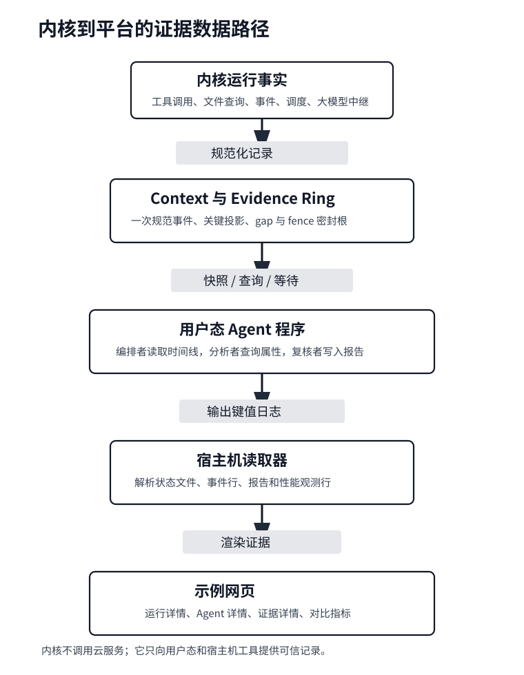

运行时材料按“内核事实 -> 统一记录 -> 用户态消费 -> 宿主机呈现”组织。测试程序和科研平台不会只贴一段无结构日志，而是输出可被文档和 Web UI 直接读取的 `key=value` 记录：例如 `tool=query_file`、`used_index=1`、`prefetch_handoff=analyze`、`stale_commit=1`。这使同一条运行事实可以同时出现在 QEMU 输出、测试记录、验证表和结果页面中。

科研平台的 `exact-field-v1` receipt 不把状态文件截断到固定字段缓冲区。`rp_evidence_measure_file_field()` 以 128 B 分块流式读取完整文件，并跨块精确匹配唯一的 `key=value` 字段；长无关字段和长 key 都合法，空 key/value、CR、NUL、重复目标或仅前后缀相似的字段一律 fail closed。完整文件的 bytes、hash 和 line count 与字段断言一起进入 receipt。Host ASan/UBSan probe 已纳入 `ci-check` 的自测清单；该静态/Host 结果不代表当前 Reader、双目标或 `full-verify` 已经运行通过。

### 6.1 Agent 创建

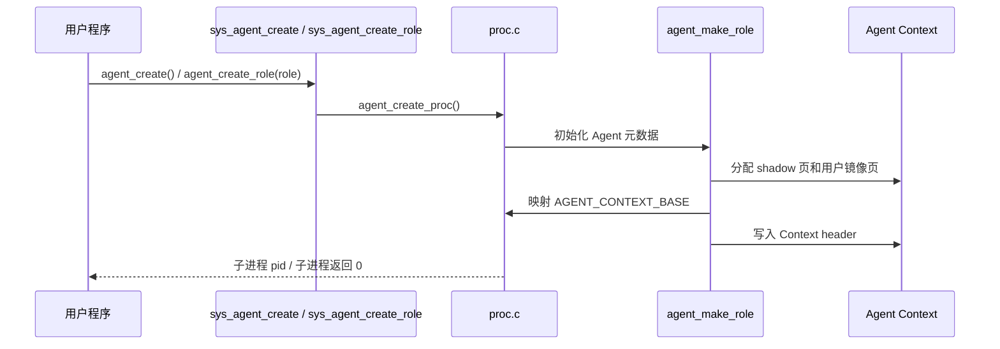

普通角色创建和安全域创建是两种不同操作。可信、非 Agent bootstrap factory 使用 syscall 541 `agent_workflow_create(role)` 创建全新的动态 scope；scope 内 orchestrator 再用 `agent_create_role()` 或 `agent_worker_create()` 填充该 workflow，但不能再铸造新的 quota/object namespace。创建路径在根进程发布前，把该根不复用的 `agent_control_id` 绑定为生命周期 controller；关闭权不因角色、PID、父子关系或 `ORCHESTRATE` capability 传播给后续成员。可信 factory 可用 syscall 545 `agent_workflow_close(scope_id)` 执行恢复性关闭，绑定根也可关闭自身 scope。scope 编码为 PUBLIC=0、SYSTEM=1、动态 workflow>=3；`VFS_SCOPE_LIFECYCLE_CAP=8` 提供 generation-safe 身份槽，但冻结期 ACTIVE/CLOSING/RETIRING admission 合计最多 4 个。数值 2 保留给稳定 PUBLIC 存储 principal，不作为 VFS scope 分配。

pipe 按持有型 capability 管理。每次创建 workflow、Agent、worker，或由 workflow/可信 bootstrap 动态 scope 创建降权普通子主体时默认不继承 pipe，即使父子仍在同一 scope；factory 或 Orchestrator 必须先对确需交接的端点调用 syscall 542 `agent_scope_delegate_fd(fd)`。票据绑定发起线程，其他线程的并发 spawn 不能抢走或合并授权集。内核在任何可让出操作前原子固定精确 file 对象并消费发起线程的全部一次性票据；关闭/替换 fd 槽、`exec` 和失败的创建 syscall 都撤销票据。普通 PUBLIC 同安全主体 `fork()` 仍维持 POSIX 继承；resource-domain admin 仅改变资源记账域，不单独构成安全主体转换。inode 描述符仅在 scope 不变时继承，并继续依靠每次操作的 scope/capability 重校验。所有 file 对象还带显式继承类别，未知的新类型默认拒绝跨安全主体继承。

显式关闭、根 controller 正常退出、异常退出和凭据清除都汇合到同一个幂等入口。关闭先把 ACTIVE 原子标记为 CLOSING；从这一刻起 `vfs_scope_active()` 为假，Agent/VFS 操作、新 spawn、pending exec 发布和存储预留均失败。随后内核按不可变 `(workflow_lifecycle_id, generation)` 扫描成员，而不是按当前 Agent/VFS 凭据扫描；因此已经降权为 PUBLIC 的子孙仍收到同一次撤销。成员进入统一进程 teardown，只在自己的执行上下文中释放 FD、inode、VM、Context sidecar 和 I/O 账目。exec 的 prepare/commit/abort 协议把凭据提交和地址空间发布放在同一个关中断边界，关闭不能与半发布身份交错。

最后一个成员退出后，scope 才进入 RETIRING 并撤销 active cache floor；自然耗尽的 scope 可从 ACTIVE 直接进入 RETIRING。权威 lifecycle ledger 固定为 8 槽；槽只有在成员与退休清理全部完成后才能以更高 generation 复用，旧 key 因而不会覆盖新 workflow。`vfs_scope_refs[NPROC]` 仅保存 VFS 引用/清理记录，不是 lifecycle 身份分配器。reaper 逐 scope 回收 metadata、dependency、action、lease/version、cache、audit、prefetch、IPC 和普通文件；清理执行时仅保留该 owner 的 `BACKGROUND` 预算与临时 cache 3/8。boot scope 的持久工件保留为 inactive storage owner，不被新 scope 接管。

syscall 546 `agent_workflow_lifecycle_info()` 为竞争测试和诊断提供版本化 self-only 快照。它可返回调用进程当前不可变 key、Context commit lane 深度/等待者和 metadata transaction owner/等待者，并可把 expected key 与当前 key 做精确比较。ABI 只复制用户声明的已知前缀；返回的 key 不是 bearer credential，不能替代 syscall 545 所需的根 control id/factory authority，也不能查询另一个 PID。

### 6.2 结构化工具调用

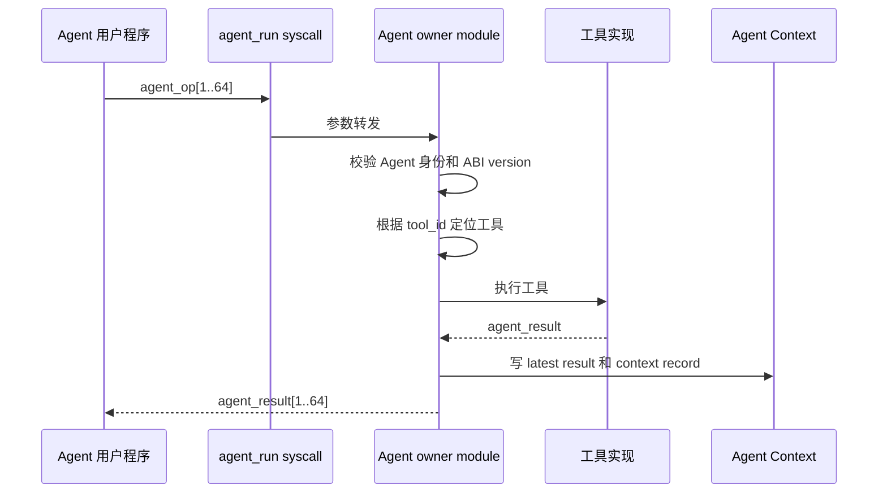

同一进程的结构化调用、`sys_context_*`、IPC 状态、文件查询和 wait 归因由可睡眠、FIFO、可重入的 Context commit lane 排序。sequence 在 lane 中接纳并保留，工具执行和 result/header/record/hash 发布仍在同一提交域；需要 metadata 时唯一锁序是 `lane -> metadata`。因此 `agent_call_count` 是已接纳/预留序号，可在在途慢调用期间暂时领先；`latest_sequence` 是完整 Context 记录已经提交的水位。`agentfinal_ucore` 的慢 `RERUN_STAGE` 与快 `echo` 并发场景必须产生 `context_commit_lane=1 sequence=1..3 hash=1`；具体发布是否命中该 marker 由 release bundle 判定。

### 6.3 Context Snapshot

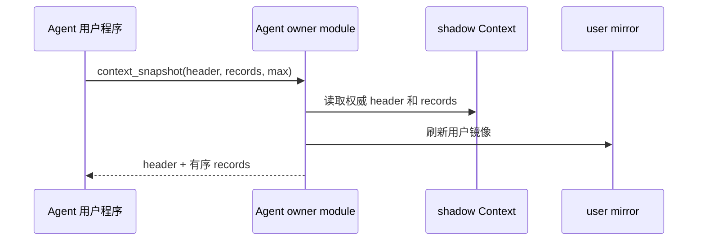

### 6.4 运行轨迹查询

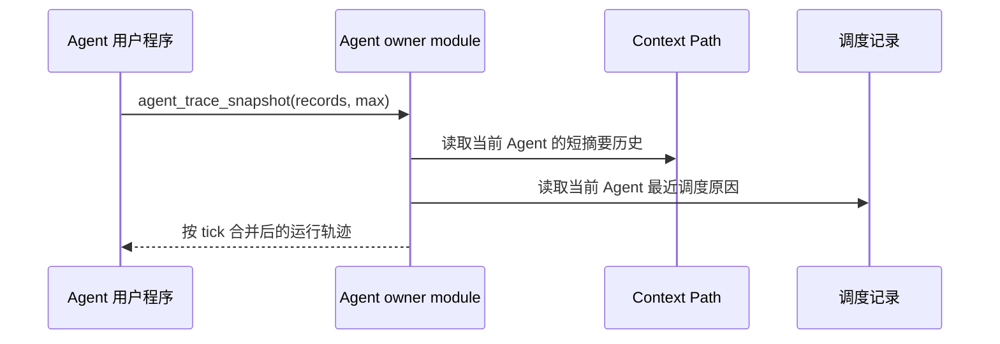

`agent_trace_snapshot()` 不替代 `context_snapshot()` 或 `agent_sched_snapshot()`。它只把两类已有权威数据整理成同一个短视图，方便 Agent 和示例程序说明“哪个工具调用发生在前、调度器随后为何运行该 Agent、事件等待何时被消费”。

### 6.5 Workflow scope 审计视图

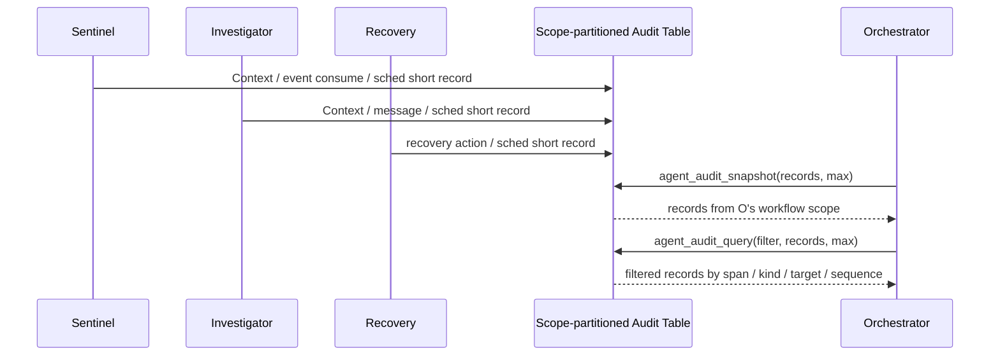

`agent_audit_snapshot()` 面向综合示例和 scope 内系统级观测。共享物理表为 512 槽，但最多 4 个 admitted workflow 各保留 128 条；每个 scope 的窗口再分为 general/low 64 与 protected/high 64。low 为每个 active stable principal 保证 8 条，可借空闲份额突发到 16 条；新主体需要容量时只回收已离开主体或其他主体高于 8 条的借用溢出。high 依据每 scope 8 个保留进程份额给每 active principal 8 条。Context、事件、调度、预取和用户手动记录始终是 low；只有工具或 syscall 成功后由内核确认的特权状态效果是 high。high 满时只滚动当前 principal 或回收 inactive principal，绝不淘汰另一 active principal 的 protected evidence；被回收的 inactive 历史和 low 溢出由 dropped 计数说明。

每个 scope 独立维护 `prev_hash/record_hash/ledger_hash` 逻辑链，而 `sequence` 在整个系统单调递增。跨 scope 写入会产生 sequence 跳号，low/high/per-principal 独立滚动会让可见窗口缺少某些前驱；`dropped_records=total_records-visible_records` 用于解释这些窗口外记录。只有当前后两条可见记录实际连续时才要求 `prev_hash` 直接等于上一条可见记录的 hash，不能把合法稀疏窗口误报为破坏。

`agent_audit_query()` 先按调用者 scope 裁剪，再应用 span、kind、pid/source/target、role、tool、event、status 和 sequence filter。`agent_span_trace_snapshot()` 进一步同时匹配 scope、公开 `current_span_id` 与内核私有 span owner，不接受用户态任意 span id。`labdemo_ucore` 展示同一 workflow 的综合观测；`agentscope_ucore` 和 `agentsecurity_ucore` 已在 2026-07-22 完整 Agent QEMU 回归中通过跨 scope 与伪造 span/cause 的负向断言。

审计物理表不再作为查询索引使用。每个 workflow scope 在自己的 128 条窗口中维护 sequence 和 `(tick, sequence)` 两个有序槽数组；覆盖旧记录时先从两份索引统一 unlink，再发布新记录。Run Ledger 的 `visible_records`、`oldest_sequence` 和 `latest_sequence` 直接由 scope 状态与 sequence 索引首尾得到。audit/span/provenance 只需单遍读取 sequence 索引，查询复杂度与本 scope 可见记录数线性相关，不再乘以全局 512 槽。

### 6.6 统一 timeline 导出

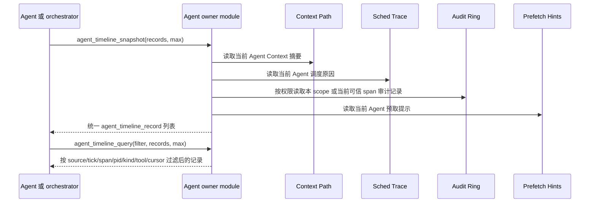

`agent_timeline_snapshot()` 是给结果页面和科研平台运行详情准备的统一导出层。它不新增一套新的权威历史，而是把已有 Context、调度、审计和预取提示规范化成 `agent_timeline_record`：`source` 标明原始来源，`kind` 保留原来源内部类型，pid、span、cause、tool、event、status、value 和短文本摘要使用统一字段。Context 审计记录会保留工具结果的 `value0/value1/value2`，因此 `read_file_digest` 产生的 size、bytes 和 hash 可以进入同一条时间线记录。普通 Agent 只能看到自身 Context、调度、预取提示以及同 scope 当前可信 span 的系统短记录；orchestrator 能额外看到本 workflow scope 的审计记录。这样状态页面不必分别解析四套 ABI，也不必把串口日志当作主要证据来源。

timeline 导出把四个已经有序的来源按 `(tick, source, sequence)` 做四路归并，audit 来源直接沿 scope 的 `(tick, sequence)` 索引推进；计数模式也走相同的单遍过滤，而不是对每条输出重新扫描审计表。所有观测导出在开始扫描前，按每 16 条候选记录换算工作预算，并按不超过一个 `kernel_work` 量子的批次分段预付；每次让出后重新统计来源，对增长差额继续补费。过滤掉和只计数的记录同样计费。等待路径只有在最后一次预算预付可能产生的让出结束、来源上界不再要求补费后，才保存本轮 `scan_epoch`；每次让出都会重采来源和 epoch。未命中导出之后，wait 再在关中断窗口最终重检同 scope epoch，并原子发布 filter、waiting 状态和等待队列节点。

SCHED 可见状态也遵循单一发布顺序。`agent_core.c` 只构造调度采样并调用观测 facade；facade 先检查当前线程的 recording suppression，未被抑制时由 timeline owner 先提交进程的 SCHED ring，再把同一记录规范化并推进 epoch/定向唤醒，最后才交给 ledger 发布 audit。被抑制的 dispatch 不会留下该次 SCHED ring、epoch/wake 或 audit 的半套状态，core 也不直接写 ring。

`agent_timeline_query()` 是同一导出层上的内核侧过滤接口。它先按角色和 capability 得到当前 Agent 已可见的记录集合，再按 source mask、起始 tick、span、kind、pid/source/target、role、tool、event、status、flags 和 after-cursor 过滤。after-cursor 由上一条已读记录的 `tick/source/sequence` 组成，比较顺序与导出顺序一致，因此同一个 tick 中的多条 Context、调度、审计和预取提示记录不会被重复读取，也不会被跳过。它的设计目的不是新增权限，而是减少状态页面反复全量拉取、再在用户态筛选无关记录的成本。`agentfinal_ucore` 用 source mask、start tick 和 after-cursor 检查过滤结果，`labdemo_ucore` 用 source/kind/source_pid/target_pid/flags 精确拉取 sentinel 到 investigator 的 prefetch handoff 记录，用 `tool_id=AGENT_TOOL_READ_FILE_DIGEST` 精确拉取内容摘要证据，并用 after-cursor 验证多 Agent 场景可以增量读取。

`agent_timeline_wait()` 是 timeline query 的事件驱动补充，`agent_timeline_read()` 是 wait+query 的合并热路径。每个睡眠线程在自己的持久内核栈中保存不可共享的 filter、deadline、scope、epoch 和 thread generation，并只在排队期间由 `struct thread` sidecar 发布指针；同一进程的多个线程可以复用一条 wait queue，但使用 generation key 定向睡眠和唤醒。Context、调度、审计和预取提示写入时先递增 epoch，再遍历当前 scope 的已发布 waiter，逐个执行可见性和完整 filter 判断。未命中导出之后，最终 epoch 重检、sidecar 发布和 keyed 入队位于同一关中断窗口；有限等待到期时至多允许一次 final rescan。返回只注销调用线程，timer 逐线程处理独立 deadline，exit、exec 和线程槽复用在释放内核栈前统一撤销 sidecar，因此 sibling 不会互相覆盖 filter、清除 deadline 或误唤醒复用槽。并发 profile 合同建立两个不同 filter/deadline 的 waiter，要求一次 Context 发布只唤醒目标线程、另一个独立超时且最终 sidecar 清零；动态覆盖状态仍以 release bundle 为准。

`agent_provenance_snapshot()` 是同一观测体系下的因果图接口。timeline 按时间回答“发生了什么”，provenance edge 按 `source_type/source_sequence -> target_type/target_sequence` 回答“哪条 Context、审计或预取记录触发了后续记录”。它导出当前 Agent 自己的 Context 因果边和本地预取边；审计边沿用 scope/span owner 可见规则，orchestrator 可以看到本 workflow，多数参与 Agent 只能看到当前可信 span。跨 Agent source sequence 通过内核私有 cause pid/control sidecar 解释，不会误连到目标进程恰好相同的本地 sequence。

观测权威状态同时作为 metadata 双 bank 中的版本化 durable section 持久化。section 保存 bounded audit checkpoint、lifecycle key、账本 hash 及 sequence/span/event/control/agent ID 高水位；lifecycle 表的每个物理槽还独立保存 generation 下界，即使该槽对应的最后一条证据已被安全擦除也不能在重启后复用旧 generation。显式 allocator-exhausted 位区分“没有下界”和“编号空间已经耗尽”，恢复只允许提高下界或保持耗尽，不能用零值让稳定身份回退或复用；event ID 耗尽时所有 IPC 发布路径统一 fail closed，不能把 `event_id=0` 放入队列。启动时先验证整个 arena，再发布只读 descriptor snapshot，Recovery 逐条读取不再在关中断区反复校验 8 KiB arena。活跃 workflow 仍走原 scope/span 查询规则，只有生命周期已封存的证据才进入 bootstrap-bound Recovery 的 LIST/READ/REAP 流程；擦除完成令牌绑定全局单调 section serial、发起时 bank generation 与在该 serial 发布后分配的持久提交目标，双 bank 完整复制后才能报告完成。section serial 到达 `UINT64_MAX` 后不回绕；后续分配拒绝且不覆盖最后一个 pending serial、目标或通知状态，因此已有写回仍可结算，新 durable intent 则 fail closed。dirty 表为所有 lifecycle 槽之外另留 SYSTEM 写回位；持久目标暂时拒绝时保留 `used + unnotified` intent，由有界后台扫描重新通知。scope retirement 使用统一 settled barrier，必须同时满足目标代已复制、`dirty == durable == replicated`、该 scope 的持久 lane 空闲且 durable section 不再 pending；`target == 0` 只表示没有外部 token，不能跳过内部 dirty 状态。

观测 checkpoint 的磁盘 ABI 为 v7。每个 scope 的 8 个持久槽固定选择最新 tail 4 条，再从更早的可见记录中按 identity class、kind、principal 和可信 span 选取最多 4 个 causal diversity anchor，最后按 sequence 重排；因此 v7 明确允许 anchor 与 tail 之间存在链间隙，不再把窗口描述成“最新连续后缀”。每条 entry 的磁盘 sidecar 显式保存 `identity_class`、`link_flags`、`principal`、`span_owner` 和 `receipt_id`，其中 `PREV_RETAINED` 只声明前一条已保留记录确为直接 hash 前驱，`LATEST_TAIL` 标识固定 tail。scope 的 `admission_drops` 单独记录在 sequence/hash 分配前被准入拒绝的尝试；成功进入 hash 链但未被 8 槽选择的数量则由 `total_records - admission_drops - record_count` 推导，公共 `dropped_records` 仍兼容地聚合两者。加载时先全量验证 v7 header、保留字节、scope/entry、全局 sequence/receipt 唯一性、sidecar 约束、链间隙和 lease 高水位；随后每个空 live scope 在同一关中断窗口预检槽位并原子发布，任何插入失败都回滚本轮恢复，已有 live 证据不会被 reload 覆盖。

live low 分区采用“保证份额 + 可借突发”而不是固定 16 槽独占：每个 active stable principal 保证 8 条，在同 scope 其他份额空闲时最多突发到 16 条；新 active principal 到来且 low 64 已满时，先回收已离开主体，再只从其他主体高于 8 条的借用溢出中选择符合因果保留规则的 victim，不会偷走其保证份额。causal victim 的 scratch 容量与完整 burst 16 对齐，重复 span/kind 检测会覆盖该主体第 9 到 16 条借用记录，不会把后半窗口中的冗余误判为不可替换的唯一 anchor。REAP 的授权和擦除控制写仍走通用 durable section 状态机，但以 `AGENT_DURABLE_DIRTY_URGENT` 触发 store provider 的 `expedite`，把既有待办的 due tick 提前；失败重试继续经过同一 notify 路径。普通 record receipt 不被顺带升级为 URGENT，仍按既有 serial fence 和合并窗口策略提交。

这些高水位按 exclusive-end lease 发布，而不是在身份分配后再补写 checkpoint。`agent_identity_lease` 一次为 audit/span/event/control/agent 和八个 lifecycle 槽准备下一段范围，durable owner 先把候选范围写入 SYSTEM durable section 并确认复制，随后原子发布可分配上界；持久层返回 pending 时只保留 prepared 状态，绝不把候选范围交给 allocator。恢复把各 volatile next 提高到已持久 lease end，主动丢弃断电时尚未使用的尾段。运行期低水位和边界都只登记后台续租；分配栈、关中断路径和 timer/heartbeat 路径绝不直接进入可睡眠的持久 owner，边界处先拒绝本次分配。只有启动期 `storage_ready` 或 syscall 尾部可调度的 background maintain 能推进 prepare/persist/publish，成功后后续分配才恢复。因此在“身份刚分配、尚未发生任何后续审计或 checkpoint”处切断 QEMU，也不能使下一次启动复用该身份。

每个 audit ledger 槽同时拥有同寿命 receipt sidecar。记录发布前先取得 durable serial/target 并生成绑定 lifecycle、sequence、record hash 的 receipt id；槽淘汰会同时清除 sidecar，恢复的 checkpoint entry 则带回原 id。`PENDING` 从不构成持久证据。查询即使观察到目标代数已经复制，也必须从当前已验证 active durable section 重新读取精确 entry，并在返回正结果前再次确认 active bank generation 未滚动；只有 lifecycle、sequence、record hash 和 receipt id 全部匹配才线性化为 `DURABLE`。目标已越过但 entry 因 bounded checkpoint retention 缺失时返回 `FAILED`，不能把“某次 scope 写回成功”误当成“这条记录被写入”。durable store 另维护 active generation replication fence：绑定覆写目标、进入 repair 或 fail closed 时先撤销，boot 只有在双 bank 已一致时才恢复，新的 generation 直到 mirror `COMMIT` 验证完成后才发布。live sidecar 已淘汰且 `target == 0` 的 receipt 必须在扫描精确记录前、以及 active generation 二次确认后各验证一次该 generation 已复制；primary-only 快照因此只能返回未完成或错误，不能误报 `DURABLE`。

本次优化保持公共 ABI 不变。查询代价只进入线程已有的 kernel-work 预算，不通过 `agent_info()` 暴露内部扫描量，避免低权限 Agent 据此推断本 scope 中其他主体或其他 scope 的观测负载。专项回归改用查询后的调度证据、返回结果顺序与 scope/span 隔离，以及父侧协调的跨 scope 端到端进展验证机制。

### 6.7 文件查询和 Agent Loop

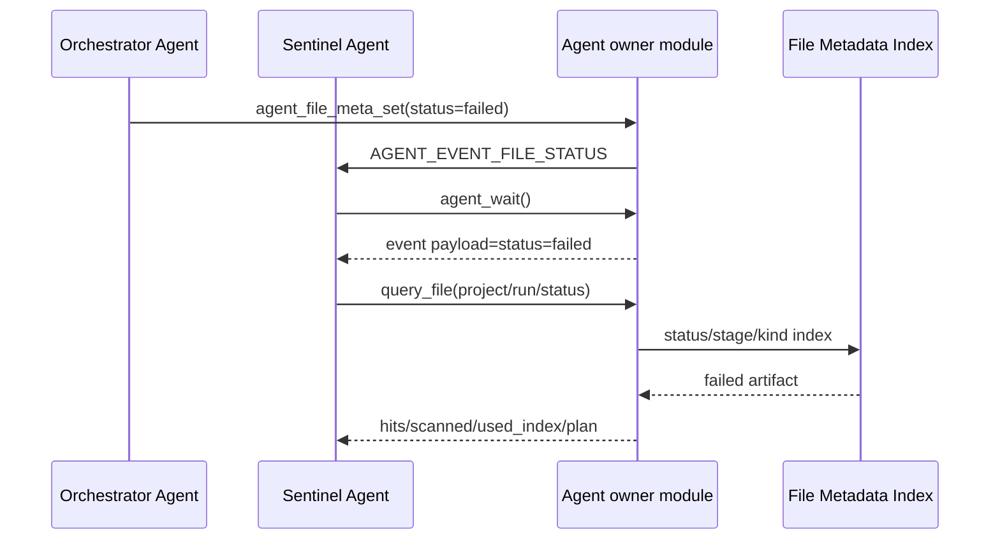

跨 Agent 消息路径不会直接把 PID 解释为授权。orchestrator 在协作开始前调用 `agent_route_config()`，把 source 的 stable control id 写入 target 的入站路由表并限定 `MESSAGE` 或 `LLM_DONE` 类型；target 也可以显式接受一个来源。投递时内核在同一临界区内重新解析 PID、核对 control id 和路由，再执行 watch 匹配与队列资源核算。自投递隐式允许。source 退出后其路由会从所有目标回收，target 退出后清空自己的表，PID 或 PCB 槽复用不会继承旧授权。

事件队列在保持 16 槽 FIFO 顺序的同时用每槽 accounting flags 编码 origin/resource class 和 coalesced policy，并进行三层核算。带 Agent 来源的外部事件合计最多占 12 槽；directed IPC（`MESSAGE` / `LLM_DONE`）和 attributed notification（如 `FILE_STATUS` / `JOB_DONE` / `POLICY_DENIED`）各自最多占 8 槽；同一个 stable source 跨两类合计最多占 4 槽。external admission 无法占用为 `KERNEL` origin 保留的至少 4 个容量名额，因此低权限发送方和带来源的通知广播都不能挤掉 heartbeat TIMER 等关键内核事件。heartbeat 使用显式 intrinsic/coalesced delivery policy，不经过 watch 过滤，并按 TIMER 类别最多保留一条 pending。attributed 广播逐目标独立尝试；一个慢 watcher 的 external admission 已满不会阻止后续 watcher 收到事件，也不会把已经提交的文件 metadata 更新改报为失败。

### 6.8 文件编辑冲突处理

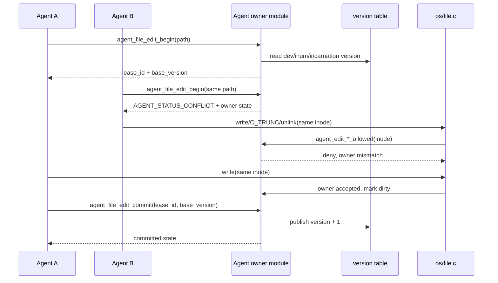

文件编辑租约的资源身份是真实 `dev + inum + incarnation`。用户态传入的短文件名只用于找到 inode 和输出可读状态，不能伪造另一个资源身份；inode 槽复用后 incarnation 改变，旧 metadata、缓存和租约不会命中新文件。编辑版本和内容版本合并在按磁盘 `inum` 直接索引的 sidecar 中，每个存活 inode 只能使用自己的槽；租约表保存当前持有者、租约编号、基准版本、deadline、dirty 标志和冲突次数。最终 inode 回收会在身份字段清除前统一移除 sidecar、租约和 digest cache，因此短命 PUBLIC 文件不能永久占用版本状态，版本容量也自然服从稳定存储 principal 的 inode 配额和系统保留量。真实文件修改入口在 `os/file.c`，因此即使另一个 Agent 绕过 `agent_file_edit_begin()` 直接 `open` 后 `write`，只要目标文件存在租约，内核仍会拒绝非持有者写入。

该机制采用无等待的独占租约：已有持有者时新申请立即返回 `AGENT_STATUS_CONFLICT`，调用者可以读取 owner pid、owner role、base/current version 和 conflict count，然后选择等待事件、重新读取文件、转交 orchestrator 或走恢复流程。租约有有限 TTL；持有者异常退出或长时间不提交时，下一次相关操作会释放过期租约。如果租约持有者写过文件，释放时也会推进版本，避免后续调用者仍基于旧版本继续提交。

提交使用版本检查：`expected_version` 必须等于 `agent_file_edit_begin()` 返回的 `base_version`，且版本表当前值也必须仍等于该基准版本。否则返回 `AGENT_STATUS_STALE`，租约仍保持 active，调用者需要放弃、重新读取或重新生成结果。该机制阻止无序覆盖，但不做内容自动合并；内容合并仍应由上层 Agent 工作流或恢复 Agent 决策。

## 7. 部署视图

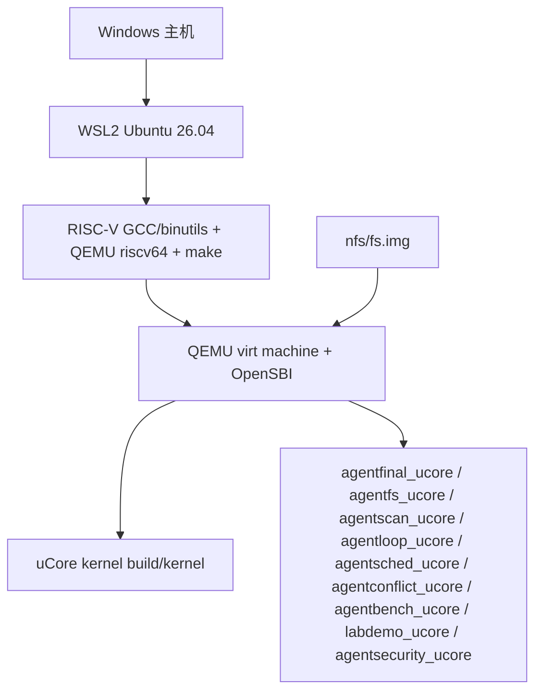

## 8. 横切概念

### 8.1 ABI 版本和布局检查

`AGENT_CALL_VERSION` 和 `AGENT_CONTEXT_VERSION` 用于区分用户态请求协议和 Context 布局。当前 `AGENT_CONTEXT_VERSION = 8`。Context header、latest result 和 128 条 `agent_context_record` 放入 6 页 Agent Context，其中 record 区从第 1 页开始，尾部通过 header 暴露 `user_cache_offset` 和 `user_cache_size`。v8 header 公开不可变 lifecycle key、`branch_generation`、`visible_head_sequence`、active path 的 retained count/oldest 和 `eviction_policy`；record 自身绑定 branch generation，并用独立 `path_parent_sequence` 表示本地分支拓扑，避免把跨 Agent provenance cause 误当路径父节点。当前布局中用户自管 cache 起点为 23552，大小为 1024。

### 8.2 地址空间隔离

只有 Agent 进程会安装 Agent Context 特殊映射和对应 metadata。普通进程调用 Agent-only syscall 时返回错误。Agent Context 固定在 trapframe 下方，用户态 ABI 中定义为 `AGENT_CONTEXT_BASE`。该地址对每个 Agent 是相同虚拟地址，但映射到不同的物理页。镜像构建器从配套 ELF 提取页对齐的 `exec_rw_offset`，loader 重新校验后将代码映射为 RX，将数据、bss、用户栈和 Agent Context 映射为 RW+NX；布局缺失或要求 W+X 的可信映像拒绝装载。

`proc_install_user_image()` 用显式 `PROC_IMAGE_INSTALL_BOOTSTRAP` / `PROC_IMAGE_INSTALL_LIVE_EXEC` 区分尚未运行的首映像安装和当前主线程发起的 exec，不从 PID 或调用位置反推模式。关中断后的 `proc_image_install_state_valid_locked()` 在任何不可逆 credential 发布前验证：bootstrap 的 `threads[0]` 和全部 sibling 必须为 `T_UNUSED/tid=-1/identity_generation=0`，目标主槽不能是当前线程，且所有槽均不在运行队列；live exec 的主槽必须是当前 `RUNNING/tid=0` 线程并具有非零 generation，其他线程只能处于未使用或已退出状态且不在运行队列。teardown、同步对象和 VFS transition 也在同一发布区复核；credential 提交后，进程级 image-install hook 先清空所有线程的 IPC wait/deadline/loop 暂态，再重置同步状态和交换 VM。这个模式化入口让 loader bootstrap 与 syscall exec 共用提交协议，而不放宽任一状态前置条件。

### 8.3 shadow 权威历史

Agent Context 分为两份：

- `agent_shadow_kva[6]`：内核私有权威页，用户态不能直接访问；
- `agent_ctx_kva[6]`：用户态镜像页，用于直接读取最新结果和历史摘要。

用户态写坏镜像页不会改变 `context_query()`、`context_snapshot()` 或 `context_detail()` 返回的权威历史。`context_snapshot()` 会把 shadow 内容刷新到用户镜像页，但不会覆盖 Context 尾部的用户自管 cache。短摘要 record 之外的完整 `agent_op + agent_result + flags` 以及可信 attribution 保存在按活跃 Agent 分配的 9 页私有 sidecar 中，由 `context_detail()` 和观测 owner 查询；它与 6 页用户 mirror、6 页可信 shadow 组成 21 页 Agent 状态，通过一次 `RESOURCE_AGENT_STATE_PAGE` 请求向 EXEC account 原子预留、提交和退款，不再嵌入每个 PCB。

### 8.4 因果链和 span

Context v8 保留每条 `agent_context_record` 和每个 `agent_event` 的 `cause_sequence` 与 `span_id`，并把不可复用 branch identity 纳入 Context Path 与 provenance。record 另有 `path_parent_sequence`，只绑定当前进程的本地 active-path 父节点；跨 Agent IPC 的 cause 不能改变分支拓扑：

| 字段 | 说明 |
| --- | --- |
| `cause_sequence` | 当前动作指向的前序 Context sequence；0 表示根节点 |
| `span_id` | 当前链路 ID，同一 Agent 决策链或跨 Agent 消息链共享该值 |
| `prev_hash` | 本条记录追加前的链尾 hash |
| `record_hash` | 由 prev_hash、本条记录核心字段和短文本摘要计算得到的记录 hash |
| `branch_generation` | lifecycle ledger 分配的 Context 分支身份；初始化、clear 和 rollback 都取得新值 |

内核自动工具记录会使用当前 Agent 的 cause/span；写入成功后，当前 cause 更新为新 record 的 sequence。公开字段之外，PCB sidecar 保存 cause 的真实 source pid/control id 和 span owner。`context_push()` 只允许用户提交 cause=0、span=0 的本地手动内容，内核再把它接到当前可信链；非零自报值直接拒绝。工具触发的消息、文件状态事件或策略拒绝事件只有在对象/路由 scope 检查通过后才携带内核认证的 sequence/span/owner。目标 Agent 在 `agent_wait()` 成功消费同 scope 事件后继承这组身份，后续工具调用继续该链路。

这个设计让示例中的 “sentinel 发现失败 -> investigator 查询原因 -> recovery 恢复” 不只是几段串口输出，而是能在内核 Context 与事件结构里保留可追踪的前后关系。单个分支的完整性链记录相邻记录顺序：第一条记录 `prev_hash=0`，后续记录的 `prev_hash` 必须等于当前因果链尾的 `record_hash`，header 中的 `latest_record_hash` 等于当前分支链尾。`context_rollback(sequence)` 不截断或改写旧数组，而是把目标记录设为因果锚点、分配新 branch generation；之后只追加更大的 sequence，provenance 同时保存 source/target branch。跨 Agent cause sequence 不是全局唯一整数，必须由内核私有 source 身份和 branch identity 解释；用户态 source pid/span 仅用于显示，不是可信绑定，也不是磁盘持久化审计日志。

### 8.5 错误语义

Agent-only syscall 对普通进程、非法参数、未知工具、历史节点不存在、空间不足、等待超时、权限拒绝和重复幂等动作返回明确状态码。错误码详见 [api.md](api.md)。

### 8.6 并发和事件

Agent Loop 使用进程字段保存 8 条 watch、16 槽 FIFO 事件队列、最多 16 条入站 IPC 路由、每个事件槽的私有来源 control id 和 delivery accounting、一次性 wait cancel 令牌、等待次数、超时次数和心跳信息。`agent_wait()` 优先选择取消令牌，再选择队首事件，但选择不等于消费：它先用精确 cookie reserve 槽位，完成用户 copyout 与 Context attribution 后才重新核对并 commit 出队/退款；任一步失败都 abort reservation，保留事件或 cancel 并唤醒下一 waiter。同一槽只有一个消费者，避免坏用户页或 sibling 竞争造成丢事件。没有事件时，有限 timeout 和无限等待都进入对象私有等待队列，由事件入队、deadline 到期、heartbeat 到期或定向取消唤醒。对象队列负责原子睡眠/唤醒，reservation 负责原子消费，两层协议的边界和失败保持语义另见 [security-hardening.md](security-hardening.md) 5.1、6.3。heartbeat 到期直接产生 SYSTEM TIMER，不依赖 watch；stop 只关闭后续生成，已排队事件仍按 FIFO 消费。

公共 `agent_wake()` 只能投递 `AGENT_EVENT_MESSAGE`，文件、定时器和 LLM 完成事件只能由对应内核或专用工具路径产生。跨 Agent 的 `agent_wake`、`send_message`、非零 target `llm_request` 和 `llm_response` 统一要求 source/target 位于同一 active workflow scope，再使用 stable control id 路由鉴权；target consent、共同 controller、相同角色或相同 capability 都不能跨 scope。PID 解析、scope/存活/路由检查、事件入队和兼容 mailbox 更新在同一临界区完成。预取交接随后只携带 `slot + pid + stable control id + scope` 端点句柄和局部 hint 快照跨预算检查点；发布前在关中断短区间重新解析完整句柄，槽已退出或复用时丢弃提示，因此不会向 replacement 进程写入 PCB、span bus 或审计记录。directed IPC 达到 8 条、外部可归因事件合计达到 12 条，或同一 stable source 跨 directed/attributed 两类达到 4 条时即拒绝；显式内核 origin 可以越过 external 边界使用预留容量。广播只扫描本 scope watcher，且不会因单个订阅者失败而停止后续投递。

取消是独立控制操作：`WAIT_CANCEL` capability 决定主体能否发起，同一 active scope、内核 control id 和直接 controller 绑定共同决定主体能控制哪个对象；消息路由不授予取消权，取消权也不自动建立消息路由。`agent_sched_config()` 同样只允许 orchestrator 调整本 scope 受控 Agent。调度参数都是域内软策略：外层 active-domain FIFO 严格轮转；选中域内连续选择 Agent 或连续按分值选择达到 `AGENT_SCHED_MAX_AGENT_BURST = 8` 后，只要对应普通/FIFO 候选存在，调度器就强制选择该候选。调度器的采样记录写入当前 workflow 的 low 审计分区，不会占用 protected/high 状态效果证据。

### 8.7 角色与能力

Agent 的真实角色保存在 `agent_role`，业务能力在 `agent_capability_mask`，创建授权在 `agent_role_grant_mask`，对象边界在内核签发的 `vfs_scope_id` 和 stable owner/control 字段中。有效授权是 capability 与 active scope/精确 owner 的交集，不存在“拥有同一个 capability 就能访问所有 workflow 对象”的语义。内核 loader 为可信 init 建立 bootstrap factory/grant；普通 `fork` 不复制 grant 或 workflow 权限，普通 exec 撤销残留 grant。`agent_workflow_create()` 只允许可信非 Agent factory 建新 scope，scope 内 `agent_create_role()` 只委派本域角色。

敏感授权不读取用户态传入的 role、scope、PID、span 或 cause。`action_commit`、`artifact_update`、dependency/metadata、edit lease、LLM/IPC、audit 和预取首先要求真实 capability，再按当前 scope 及对象 owner 查询。`agent_wake()` 只允许 MESSAGE；即使事件类型和 route 合法，也必须 source/target 同 scope。`agent_wait_cancel()` 要求独立 capability、同 scope 和直接控制关系。因此伪造 role、知道另一 workflow 的 PID/文件名/租约号，或提交相同公开 span 都不能跨域取得权限。

`labdemo_ucore` 中可信 init 只启动 orchestrator Agent；文件元数据初始化、失败注入、对象依赖注册和子 Agent 创建都由 orchestrator 发起。`agentsecurity_ucore` 专门覆盖普通进程直接调用敏感接口失败、普通 `fork/exec` 子进程不能继承 role grant、低权限 Agent 不能继续委派、bootstrap grant 在普通 exec 后撤销、初始化前索引查询、legacy tool mismatch、sentinel 伪造 recovery 被拒绝，以及多 run 定向动作更新。

### 8.8 安全约束与资源韧性

两个目标共享用户输入复制、对象私有等待、可恢复 ENOSPC、块 owner map、稳定 PUBLIC 存储主体、孤儿回收和 child record 等行为目标，但实现并非完全相同。当前 generation-safe `resource_controller`、workflow lifecycle、统一 teardown 与按需物理内核栈位于根目录 AgentOS 目标；`baseline_ucore/` 仍保留旧的分域计数和固定栈实现。因此文档和测试只能比较共同安全性质，不能把根目标的新控制器描述为 baseline 的共享实现。

AgentOS 中 `resource_account` 才是计费身份。EXEC account 统一核算进程、线程、唯一 file object 和完整 Agent 状态页；STORAGE account 由稳定 `storage_principal_id` 或 workflow owner 映射，核算 block、inode、buffer cache 和 I/O rate lease。账户句柄包含 generation，进入 CLOSING/DRAINING 后必须等成员、用量、pending reservation 和 lease/debt 全清才可复用。一个 Agent 的 9 sidecar + 6 mirror + 6 shadow 以 21 页/84 KiB 整体接纳；六项总预算为每进程/全局/ordinary 池/reserved 池/ordinary 域/reserved 域 `86016/11010048/8257536/2752512/5505024/688128` B。`resource_domain_id` 只保留为调度分区索引，外层 active-domain 轮转防止线程数放大 CPU 份额。PUBLIC principal 固定为 2，并在挂载时从 qmap/dinode 重建用量，不随短命进程退出或重启变化。

AgentOS 专属路径在此基础上增加可信映像、role grant、capability 和动态 VFS scope。PUBLIC=0、SYSTEM=1、workflow>=3，数值 2 只保留为 PUBLIC 存储 principal；不同 workflow 的文件数据命名空间彼此隔离，`open/read/write/truncate/unlink` 均按 inode scope、真实身份和当前有效能力检查，同 scope 继承的 inode fd 也会逐操作重新鉴权。pipe 不依赖环境继承：任何新 Agent、worker、workflow 或降权普通主体都只接收其创建线程通过 syscall 542 当次显式委派的端点，且授权不随子进程继续传播。文件身份使用 `scope + dev + inum + incarnation`，防止同名对象、inode 重用或另一个 workflow 的旧 metadata/cache/lease 命中。存储保证由完成镜像的实际空闲量决定，并受每 scope 320 inode/512 block 与 SYSTEM 8 inode/512 block 的显式硬下限约束；当前平台镜像写入 superblock 的每 scope 342 inode/1195 block 是文件系统 STORAGE 保证。metadata catalog 的每 scope 112 条只是索引容量，不再限制 workflow inode；catalog 饱和也不会解除 VFS scope 标签或降低逐操作鉴权。

### 8.9 性能

性能优化集中在四个方面：

1. `agent_run()` 将最多 64 个工具操作合并为一次 syscall。
2. 工具 ID 查找避免热路径字符串扫描。
3. 用户态可直接读取 Context 镜像中的 header 和 latest result。
4. `context_snapshot()` 一次返回多条有序历史，避免逐条 query。

Metadata catalog 的 512 个物理槽采用固定分区：SYSTEM 独占 64 个，普通区 448 个由最多 4 个 workflow 各自独占 112 个。ACTIVE、CLOSING 和 RETIRING 共同计入这 4 个准入槽；RETIRING 在目录回收完成前继续占住原分区，新 workflow 不得复用它的份额。每个 workflow 的 live AUTOSCAN 新增记录最多 96 条，余下 16 条为显式 metadata 保留；这个物化视图边界与 STORAGE inode 账户相互独立。catalog 饱和时普通 VFS 文件只要通过 STORAGE admission 仍可发布，并继续由 inode scope 强制隔离；未物化对象在 inode sidecar 中持久标记 deferred，避免后续写入重复触发全目录扫描。所有 `agent_meta_slot/flags/version` 更新统一通过 `agent_file_state_set_index()` 校验、持久化并在失败时恢复旧值；write/sync/truncate/delete 统一通过 `agent_fs_apply_inode_event()` 发布，create 只在 VFS 创建成功后进入目录协调。扫描已记录 scope 饱和且 catalog slot 实际清除时触发 scoped urgent full restart；metadata gate busy 的 delete 未释放容量，只登记普通协调扫描，lifecycle 等其他变化也遵守普通 cooldown。该设计不计算跨 scope 的全局 union/max，不新增 catalog resource kind、backing lease 或 metadata envelope 账本。权威 alloc/edit 先重验 SYSTEM 64、scope 112、ordinary 448 与唯一键，再只对 old/new class 的 AUTOSCAN 净增长执行 96 条软边界；已有 AUTOSCAN 的 count-neutral edit 和降额转换不会被拒绝。精确 receipt restore 使用独立硬准入，避免后来收紧的软策略破坏失败事务回滚。edit 不能改换 scope，删除必须走统一 clear 路径。显式容量耗尽返回 `NO_SPACE`，lifecycle 改变返回可重试状态，键冲突和持久化不确定分别保留 `CONFLICT` 与 `INDETERMINATE`，不能塌缩成通用 I/O 错误。action status batch 也独立限制为 112 条，选择溢出会在 mutation 前返回 `NO_SPACE`。

metadata 的初始 authority 不是运行时看到空盘后自行铸造。受控 mkfs 通过与内核及 Host probe 共用的纯磁盘 ABI，把两份字节一致、完整预分配的 v7 generation-1 canonical 空 bank 直接写进 raw image，并标记为普通进程不可访问的 `KERNEL_PRIVATE/SYSTEM`；启动在发布首个用户进程前完成验证，稳定状态没有有效 bank 时 fail closed。这里的信任根是受控 mkfs 与受保护 raw-image 路径。inode checksum、bank header checksum 和 payload hash 只检测格式、一致性或意外损坏，不是 MAC，也不能证明构建器或镜像供应链没有被攻击者篡改。

metadata 自动创建 backing 文件时保留三态 provenance：`existing` 表示只绑定既有对象，`created` 才生成精确 `(path, scope, dev, inum, incarnation)` undo receipt，`FS_CREATE_INDETERMINATE` 表示目录发布结果已经无法安全判定。回滚只可凭 receipt 调用 `fs_rollback_created_workflow()`，再次精确核对路径、scope 和 inode identity，并确认对象未被 metadata 绑定且仍可删除；文件名相同但 inode/incarnation 已变化时拒绝清理。indeterminate 会传播为 `AGENT_STATUS_INDETERMINATE` 并使 metadata runtime fail closed，不能降格为 absent 或普通 I/O 失败。

一次块写完成不是持久提交记录。文件系统前向转换通过 durable barrier 要求已协商 `VIRTIO_BLK_F_FLUSH` 的设备确认 flush；能力缺失、flush 失败或结果不确定时，发布不能报告 durable success。powercut profile 的验证范围只是在该 device-flush/durable-barrier 合同下，由认证 supervisor 对稳定 QEMU leader 发出一次 `SIGKILL` 后检查重启恢复；它不模拟物理控制器缓存清空、整机电源中断或永久介质故障。某个发布是否实际执行该 profile，必须由其 release bundle 的 manifest 和原始日志证明。

持久快照不再在 metadata 事务门内逐记录查目录。候选记录、epoch、catalog generation、内容 hash、scope reload 参数和游标绑定为一个持久 prepare plan；首次全量加载每轮只处理 32 条，前台单 scope reload 则在最多 512 个 live slot 加 512 条候选的固定纯内存上界内一次完成。full boot 校验 SYSTEM 64、ordinary 448、每 scope 112 和唯一键；RETIRING 快照仍在自己的固定分区内装载并等待回收。live scoped reload 把目标 scope 的不可变 `(lifecycle_id,generation)` 绑定进 plan，并在 prepare/apply 边界重验同一身份；身份变化返回可重试错误，不以 peer 拓扑、全局压力包络或第二套资源账本决定结果。count-neutral edit 和由精确 receipt 约束的 rollback 继续重验容量、唯一键与 post-state，但不会制造新的记录。prepare 完成后还必须取得 owner-token catalog mutation fence；foreign fence 在任何改写前返回 `INTERRUPTED`，取得 fence 后的投影才是不再分配的确定步骤。同步 set/delete 和 action status batch 的 fence 跨持久化 checkpoint 保持，undo token 精确绑定 slot post-state；读取不受 fence 阻塞，因此这不是 opacity 事务。非零 inode identity 先置为 `PENDING`，由现有可续跑目录扫描核验后才对普通查询可见；SYSTEM 或 AUTOSCAN 的全零 legacy identity 同样进入 `PENDING` 并登记 missing/writeback，普通 workflow 的非 AUTOSCAN 全零 identity 进入 `QUARANTINE`，不会按同名路径自动绑定。两类隐藏记录仍占容量并保留 fid、路径和 identity 唯一性；新增或更新记录先将空白/保留物理名规范化，再执行同一中央重复键准入，普通 selector 命中隐藏记录时分别返回 RETRY 或 CONFLICT。scanner 的路径回退不再维护第二套全表查找：它以有界 dirent 名同时填写 physical/logical selector，并加入完整 `dev + inum + incarnation` 后调用同一 resolver；路径与 identity 分裂到不同记录、或只命中 identity 时不改表并重试。若路径命中旧记录而 inode incarnation 已变化，scanner 先撤销旧绑定，再把它作为新对象分配新 FID。长度恰为 `DIRSIZ = 14` 的物理名保持合法，只有超过上限或命中内部保留名才规范化。scanner 专用 view 只能用于 resolver 选定后的隐藏记录复核和 stale sweep，后者回收未见 PENDING、永久保留 QUARANTINE。全局 PENDING 归零前新的 Agent admission 返回 RETRY。

冷启动不延续短命 workflow 的权限状态：prepare 先用不可变 lifecycle key 淘汰已失效的动态 scope，再按 v7 表示、总表、SYSTEM 64、ordinary 448、每 scope 112、lifecycle 与唯一键等稳定磁盘合同装载。AUTOSCAN 96 只限制 live 净增长，因此 lifecycle 仍匹配的 97 至 112 条同版本旧记录会完整保留，第 113 条仍判损坏。加载后不会迁移或静默删表；超额域只准保持或减少 AUTOSCAN，降至 95 条后才重新允许增长。

协调扫描把容量不足标记为 deferred，把 inode/edit/I/O 暂态失败标记为 retry。容量型 deferred 由统一 setter 写成 `agent_meta_slot=-1`、flags 0 和当前 sidecar version；catalog 仍饱和时 write/sync/truncate/delete 事件不重复登记扫描，create 也不会因 metadata 容量不足回滚已发布的目录项。根目录或目录项读取失败时保存当前 offset，单个对象失败时继续处理后续对象；只有无法确认目录完整性时才保护全表，否则只保护发生 mutation 失败的精确 scope，容量 deferred 仍允许先回收 stale record。实际释放已标记饱和 scope 的 slot 会越过普通休整，安排一次从 offset 0 开始的 urgent full restart；未释放容量的 busy delete 和其他普通请求仍由自适应 cooldown 合并。累计 deferred/failure 通过 `agent_info` 的 sized-prefix 尾部字段暴露，不增加新的全局表。

文件查询性能通过扫描路径和索引路径的实际候选记录数差异体现。索引、dependency 和 digest cache 的 key 均先包含 scope；相同 namespace/run/label 或文件名不会跨 workflow 命中。文件查询本身不保存跨调用结果：每次调用都执行全表扫描或索引候选遍历，`fs_generation` 只标识查询时的 metadata 可见代数。需要复用结构化查询结果时，用户态 Agent 可以把结果与代数放入自己的 Context cache，并在代数变化后失效。进程态 metadata 工作按 128 records 计费，事务请求按 ticket FIFO/wake-one 接纳；scheduler 的有界维护轮次只发布字段变化和线性索引。`agent_dependencies[]` 仅保存受每 scope 配额约束的显式用户边，文件记录中的兼容 `dependency_mask` 是规范输入，由查询、action 和预取各自在已有固定表遍历中按需解析；结构变化只推进依赖代数，不再产生持门的超线性全局重建。普通 workflow 文件写入先把已提交 size 和代数发布到 inode incarnation sidecar；只有 `PERSIST` 记录登记本域 dirty generation，volatile 记录不进入 bank。固定一秒的非滑动窗口把重复变化合并，scheduler 在扫描前给到期写回一次独立机会。后台 checkpoint 使用触发 scope 的 `BACKGROUND` token budget，并依次完成 invalidate、变化 payload 写入与逐段验证、header publish 与回读、active generation 切换，再更新旧 bank mirror；新 primary 未完整验证前不覆盖旧的已验证代。同步提交通过 FIFO ticket 进入单一物理 lane，失败条件检查、事务门释放和 condition queue 入队保持原子，避免丢失唤醒。协调扫描继续使用独立的非滑动 pending/deadline 和 `max(20 tick, 4 * 扫描耗时)` 自适应休整，满表未绑定对象的微写不能让全根扫描完成即重启。写入期间继续变化的 scope 不推进 durable generation，失败也保留待办，因此合并不会牺牲最终一致性。显式持久 metadata 管理操作仍同步提交。本次查询在有界局部状态中保留精确 hit slot；依赖选择器先受 scope 配额约束并精确核验，再一次扫描文件表、全局去重，每次最多生成 8 条提示。共享 32 槽 span prefetch 表按 4 个 scope 各保留 8 条，并同时核对公开 span id 与私有 owner。message handoff 只在同 scope 的可信 route 成功入队后发生，并使用稳定端点句柄、预算化 prepare 和重新校验后的固定上界 commit，不能把跨检查点保存的旧 PCB 指针写入复用槽。验收合同由 `agentfs_ucore`、`agentbench_ucore` 和 `labdemo_ucore` 覆盖同 workflow 功能，`agentscope_ucore` 覆盖同名/同业务标识的跨 scope 负向边界，`iobudget_ucore` 覆盖单 PUBLIC 压力下的速率、cache 和单 workflow CONTROL 进展；具体发布结果由 release bundle 提供。

## 9. 架构决策

| 决策 | 选择 | 理由 | 取舍 |
| --- | --- | --- | --- |
| Agent 创建方式 | 使用 `agent_create()` 兼容创建 sentinel，使用 `agent_create_role()` 创建指定角色 Agent | 与 uCore 现有进程模型结合直接，且能把 role/capability 绑定到内核 PCB | 暂未支持用户态自定义配额或任意 capability 组合 |
| Workflow scope factory 与终止 | syscall 541 仅允许可信 bootstrap factory 创建新 scope；8 槽 ledger 签发 `(id,generation)`，syscall 545 只接受绑定根或可信 factory 的关闭请求 | 把角色委派、资源账户、安全域和终止权分开；降权为 PUBLIC 的后代仍留在原 lifecycle 谱系 | ACTIVE+CLOSING+RETIRING 合计最多 4 个；槽彻底回收后可以更高 generation 复用，旧 key 永不别名 |
| Workflow lifecycle 观测 | syscall 546 只返回调用进程自身的版本化 sized-prefix 快照，并可比较 expected `(id,generation)` | 让并发回归在不暴露内部 PCB 或任意 PID 查询的前提下确认 teardown 窗口和 generation 重用 | key 只是身份/比较值，不是 bearer credential，不能替代 control id、capability 或对象 owner |
| 安全主体 fd | 新 Agent/worker/workflow 和降权普通主体默认不继承 pipe；syscall 542 为调用线程下一次主体创建一次性委派精确端点；file 继承类别默认拒绝 | 不让控制 pipe 变成可跨角色/线程传播的环境权限；对象快照防 fd 关闭复用，所有创建失败也消费调用线程票据 | 当前显式委派只支持 pipe；inode 仅同 scope 继承并逐操作重鉴权 |
| 可信程序授权 | 使用构建期 `EXEC_POLICY_ENTRIES`、不可变 inode 元数据和 loader 身份/version 校验 | 新程序必须显式声明 role mask、bootstrap 和 VFS profile，不能靠程序名或 PID 获权 | 信任根是构建镜像，不是密码学签名 |
| W^X 装载 | 配套 ELF 决定 `exec_rw_offset`，代码 RX，数据、bss、栈和 Agent Context RW+NX | 阻止普通写入直接修改可执行代码，并让角色授权绑定到不可变映像 | 当前仍是受控 flat image，不是通用动态 ELF loader |
| VFS 文件域 | PUBLIC=0、SYSTEM=1、动态 workflow>=3；2 保留为 PUBLIC 存储 principal；逐操作同时校验 capability 和精确 inode scope | 普通路径、同名文件和继承 fd 均不能跨 workflow | SYSTEM 仅作为显式只读共享/可信映像来源 |
| 退出与等待 | 对象私有等待队列、child record 与执行槽分离，以及 `LIVE` 到 `RECYCLED` 的单一正向 teardown；Agent 侧只公开 phase-aware `agent_proc_teardown()` | 阻塞 syscall、fault、显式 exit、workflow revoke 和构造失败复用同一资源结算顺序；QUIESCING 撤权、RECLAIMING 释放/清身份、SETTLING 验空，REQUESTED 后不能再发布对象 | 只有 scheduler 切回 idle stack 后才能释放最后物理栈页并发布回收 |
| 资源账户与调度域 | `resource_account` 统一核算 process/thread/file/block/inode/cache/Agent page，原子向量 admission 防半发布；`resource_domain_id` 仅用于 active-domain CPU 轮转 | 同时限制 fork/thread/file/storage/I/O 压力，又不把计费身份和调度策略耦合 | `RESOURCE_AGENT_STATE_PAGE` 是逻辑配额；页面仍来自通用 `kalloc`，不是全局物理内存 OOM 下的硬保留 |
| 按需内核栈 | 保留 16 KiB stack + 4 KiB guard 的全部虚拟槽，线程 admission 时映射物理页，scheduler 回收；64 KiB boot stack 另做 linker-span 与调用图预算 | 32 MiB 虚拟容量不再等于启动物理占用；8 MiB 为受信/保留线程物理池 | 当前单 hart 使用本地 TLB fence；未来 SMP 需要远端 shootdown |
| 文件系统存储主体 | 稳定 owner、逐块 map 和共享容量策略；mkfs 持久化 PUBLIC principal 与容量契约，挂载重建 PUBLIC 用量并恢复 workflow scope ID 下界，启动与 admission 使用固定 G/S；可变 SYSTEM 赞助文件在首次用户修改前由 claim gate 一次预留，排序后按 qmap block 分组，以 qmap-first、inode-last 前向提交；每 scope 下限 320 inode/512 block，SYSTEM 下限 8 inode/512 block | 限制单个稳定主体/scope 的块、inode 及版本状态，并为所有 admitted/future workflow 与 SYSTEM 保留可兑现容量，避免进程域退出清零、覆盖预装块绕过计费或 SYSTEM 信用消耗后重启重复预留 | 平台实际保证随镜像构建结果变化并由 mkfs 输出；变更 FS 配置会强制重编 mkfs；旧磁盘格式拒绝挂载，教学文件系统无 journal；当前 ENOSPC 全流程已复测，grouped claim 中点掉电仍缺专门注入 |
| 块设备 I/O 公平策略 | PUBLIC 32/16；每 active workflow 的 normal/control/background 为 24/12、48/24、8/4；每 retiring workflow 只保留 background 8/4；SYSTEM system/background 为 96/48、16/8。reserved 最坏总和 528/264；shared 是与 560/280 设备根同尺寸、同时扣根且不叠加容量的机会流量门。每次真实 `disk_submit` 是唯一物理计费边界 | PID 退出、重新 fork 或低权限微写不能刷新速率身份；无竞争可借空闲带宽，异域竞争时仍兑现各 lane 保证，volatile overlay 不能伪装物理 I/O | 固定策略以 1 KiB 设备提交和 policy tick 为单位；准入 account endpoint 不带债，reserved 设备端只由真实 account lease 背书带债；已接纳的有界原子请求后续可形成有上界的 owner lane debt，shared 不带债，checkpoint/teardown settlement 清理 owner lease/lane debt；global device debt 可跨 lifecycle，由设备根 refill 清偿，保护 lane可跨越且总量受 request/aggregate envelope 约束；ABI v5 的 `version/struct_size` 固定在前 8 字节 |
| scheduler 中断交付边界 | 每轮在 idle context 安装 kernel trap 向量并短暂打开中断，再运行后台维护和选择线程 | 唯一 runnable 线程即使反复在内核 pipe 条件路径 yield、长期不返回用户态，timer/device 中断仍能推进 token refill、I/O debt 和设备完成 | 这是所有调度轮次共享的机制，不按 PID、文件或 syscall 特判；`iobudget_ucore: scheduler_interrupt_progress=1` 覆盖该回归 |
| terminal teardown 账本 | `LIVE -> REQUESTED -> QUIESCING -> DETACHED -> RECLAIMING -> SETTLING -> HANDOFF -> PUBLISHED -> RECYCLED`；唯一 `teardown_owner_tid` 和首次 exit code；凭据清除、lifecycle release、resource account 结算和栈发布按固定顺序执行 | 所有进程级退出原因共享机制，不能借 fault、revoke 或构造失败跳过账目；非主 sibling 仍只退出线程 | proc-reap、agentscope 与资源专项保留历史/定向合同；`fault_exit_cleanup=1` 只证明 fault 分支，不能单独代表所有内部阶段；本发布聚合状态以 release bundle 为准 |
| Buffer cache 赞助与持有 | `NBUF=256`；SYSTEM/PUBLIC/每个 active workflow 按稳定 owner 记录 sponsor并使用 40/24/36 floor 与 96/48/64 cap；退役清理 job 临时使用 3/8；跨域命中不刷新 sponsor LRU，空闲 donor 只有高于自身 floor 才可被驱逐，超 cap transient 释放即失效；每块另有 exclusive holder、递归深度和私有等待队列 | 保留关键 metadata 和其他 workflow 的可用缓存，限制 PUBLIC 以冷工作集长期占满全局 LRU；禁止预算睡眠发生在仍持有 buffer 的中间状态 | floor 是 active principal 的缓存服务保证，不是数据机密边界；对象可见性仍由 VFS 授权决定 |
| Context 地址 | 用户态虚拟映射固定在高地址 `AGENT_CONTEXT_BASE`，当前 6 页 | 便于用户态直接定位，并给 Context Path 完整性链和用户自管 cache 留出容量 | 这里只描述用户 mirror ABI；完整内核管理状态是 9 sidecar + 6 mirror + 6 shadow 共 21 页并原子计费 |
| 工具协议 | 主热路径为 `agent_op` / `agent_result`，名称协议作为正式结构化入口保留 | 比字符串键名协议更紧凑，适合批量执行；名称协议便于示例和兼容赛题描述 | 工具 ID 需要保持稳定 |
| Context Path 容量 | 固定 128 条环形摘要；完整详情与 attribution 位于每活跃 Agent 9 页 sidecar；它与 6 页 mirror、6 页 shadow 作为 21 页 Agent 状态原子计费 | idle 普通进程不分配状态页；完整状态 worst case 受 10.5 MiB 全局逻辑预算限制，sidecar-only 仍以 4.5 MiB 独立监控细节膨胀 | 页面使用通用页分配器；逻辑配额不是总内存 OOM 下的硬物理保留 |
| Context 因果字段 | 公开 cause/span 配合私有 source control/span owner；`context_push` 必须传零，由内核接链 | 让同 workflow 协作可追踪，同时防止用户伪造跨 Agent ancestry | 当前是内存态轻量追踪，不替代持久化审计系统 |
| 运行轨迹接口 | `agent_trace_snapshot()` 合并 Context 摘要和调度原因 | 让 Agent 直接获得“工具调用 + 调度原因”的同一视图，避免只靠用户态日志拼接 | 当前只覆盖当前 Agent 的内存态短记录 |
| 当前 span 短记录接口 | `agent_span_trace_snapshot()` 匹配 scope + span id + private owner | 参与 Agent 可解释本 workflow 链路，公开 span 不能扩大权限 | 不提供任意跨 scope 过滤 |
| Scope 审计接口 | 物理 512 槽按 4 scope 各 128；scope 内 low/high 各64。low principal 保证 8 条，可借空闲份额突发到 16 条，满载时只回收已离开主体或其他主体高于 8 条的溢出；high principal 为 8 条；filter 只缩小可见集 | 遥测不能淘汰 active principal 的保证证据，也不能影响其他 workflow；空闲容量仍可被有界利用 | inactive principal 的旧证据和被回收溢出仍是由 dropped 可见的有界窗口 |
| Run Ledger 摘要 | `agent_ledger_snapshot()` 返回本 scope 逻辑链尾、稀疏 sequence 窗口和 dropped 分类计数 | 状态页面可区别合法淘汰/跳号与当前链尾破坏 | 当前不是跨重启持久化保证，也不带签名 |
| 持久观测窗口 | checkpoint v7 的 durable section 固定四槽：普通 workflow 使用前三槽，成功绑定的 bootstrap Recovery 独占 successor 槽；每 scope 固定保留 latest tail 4 + causal diversity anchor 4，并用 identity/link/principal/span owner sidecar 与 `admission_drops` 区分身份、稀疏链接和拒绝原因；恢复先全量验证再原子发布 | 普通容量压力不能覆盖其他 workflow 的 active 或未授权证据；四槽全满时仍保留 Recovery 进展；REAP 先持久授权、再由 SYSTEM 清除，控制写通过通用 URGENT/expedite 提前服务，普通 receipt 保持原合并策略；无 target 的淘汰 receipt 还必须通过 active generation 双副本 fence | 这是允许显式链间隙的有界恢复窗口而非永久日志；primary-only generation 不构成 `DURABLE`，三个普通槽满时新普通 workflow 会 fail closed，必须由可信 Recovery 明确授权回收 |
| 统一 timeline 接口 | `agent_timeline_snapshot()` 把 Context、调度、可见审计和预取提示导出为同一结构，`agent_timeline_query()` 在可见集合上做内核侧过滤和 after-cursor 增量读取，`agent_timeline_wait()` 让调用者等待匹配记录出现 | 让 Web UI 和科研平台运行详情直接消费一个规范化记录流，减少无关记录复制和主动轮询 | 不保存完整 raw 请求/响应，长文本仍需专门文件或详情接口 |
| 因果图接口 | `agent_provenance_snapshot()` 把可见 Context、审计和预取提示转换成因果边 | 让 Web UI 可以直接画出跨 Agent 触发关系，减少用户态日志拼接 | 当前是短摘要内存图，不是持久化 provenance 数据库 |
| 工具查找 | ID 直接定位，legacy name 兼容 | 最终性能路径避免字符串扫描 | 工具 ID 需要保持稳定 |
| 批量执行 | `agent_run()` 一次最多 64 个 op | 减少 syscall 次数，提高端到端吞吐 | 单个 op 错误通过 result 表达 |
| 文件查询实现 | scope + `dev + inum + incarnation` 主键、scope-local metadata/index、每次真实 scan/index、FIFO transaction gate、128-record 工作预算、字段化维护、显式依赖表与兼容位图按需解析、inode size sidecar、PERSIST/volatile 写回分流、固定窗口后台写回、FIFO COW submit lane、带自适应 cooldown 的协调扫描，以及 `.agentmeta` / `.agentmeta1` 分块 COW 双 bank | 同名、同 fid/run/label 的不同 workflow 对象保持隔离；Recovery action 不再触发全局依赖物化，长 action/query 的线性工作计入域级调度；scheduler 和进程请求均有接纳边界；微小文件变化不会同步放大全 bank I/O；目标 bank 验证后才切换 primary，之后才镜像旧 bank；单 bank 暂态读取失败有界重试后降级到已验证 peer 并修复副本 | 当前只扫描 uCore 根目录，不做多级目录递归；`CACHE_HIT` 仅保留 ABI 数值兼容；后台 checkpoint 使用固定合并窗口和硬 BACKGROUND I/O 预算，四倍耗时自适应只属于 scanner。发布验收合同覆盖 primary/mirror 各八个 COW phase 的 powercut model、raw-bank ABI、单副本降级、单次暂态 EIO 和 VirtIO fault matrix，是否实际通过由 release bundle 证明；永久设备故障、整机物理断电、启动双 bank 同损和 grouped qmap 中点故障不在该合同内 |
| Metadata 拆分与聚合预算 | transaction、file state、catalog、query、scan、directory、objects、actions、prefetch 和 store 各自持有单一职责；目录桥无可写 BSS；相关模块、IPC 和 contract headers 共同进入 `metadata_control_plane` source/text/BSS 预算 | 依赖方向和状态 owner 可静态审查，同时防止把 monolith 的代码或数组横向搬到新文件后绕过单模块 LOC/BSS 门 | 经审查的 bounded control/persistence owner 与无状态 Context path 投影使用逐目标 `-Os`，Makefile 与预算检查器已锁定精确 allowlist 及 aggregate source/text/BSS 上限；某个发布的最终指标仍只以其 bundle 中的 canonical budget log 为准 |
| 文件内容摘要 | `read_file_digest` 受 `CONTENT_READ` capability 控制，按 selector 读取真实文件短预览、最多 4096 字节内容和 FNV-1a 指纹；绑定 Agent metadata 的真实文件进入 8 槽内容版本感知 digest cache | 让 Agent 在 metadata 命中后取得轻量内容证据，重复读取同一文件证据时复用结果，并自动进入 Context/timeline | 不是全文搜索，不建立内容倒排索引；未绑定 Agent metadata 的普通文件不缓存 |
| 文件编辑冲突处理 | 使用 `scope + dev + inum + incarnation` 租约和版本检查，并接入真实 VFS 修改路径 | 防止同 scope 无序覆盖，也拒绝跨 scope 租约号复用 | 不做内容自动合并 |
| 对象预取提示 | 查询/缓存携带精确 hit slot；scope 配额内依赖选择器经精确核验后只扫描一次文件表，以槽位位图去重并最多发布 8 条；物理 span 表 32 条按 4 scope 各8，并核对 private owner | 单次查询副作用有固定上限，同 scope 因果链可交接提示，跨 scope 不能借公开 span 查询 | 当前只提示 metadata，提示本身不预读文件内容 |
| LLM 友好路径 | 内核记录 `llm_request`/`llm_response`，使用 `LLM_RELAY` capability 限制结果投递，并用 `AGENT_EVENT_LLM_DONE` 唤醒请求 Agent | 让 LLM 驱动 Agent 的请求、结果、Context、事件和审计进入 OS 管理视野，同时不让内核持有 secret 或访问网络 | 真实云端模型调用由用户态或宿主机 relay 实现 |
| Agent Loop | watch/unwatch/wait/wake/route_config/wait_cancel、heartbeat set/stop、sched_snapshot/sched_config 独立 syscall，并让调度器感知 Agent 状态；旧 heartbeat 512 ABI 保留 | 等待事件不放进 batch 热路径；心跳由 intrinsic SYSTEM TIMER 唤醒并单条 coalesce；跨 Agent 数据面显式授权；调度原因由内核记录，orchestrator 可受权调整目标 Agent 参数 | 路由当前只覆盖 `MESSAGE` / `LLM_DONE`；调度策略字段为 weight、priority 和 budget |
| 基础 syscall 兼容 | 实现 `SYS_trace=410`、`SYS_mailread=401`、`SYS_mailwrite=402` | 满足代表性 uCore 基础测试和普通进程消息接口 | 不把当前工作扩大成全部 chapter 的完整兼容验收 |
| 示例日志契约 | 输出 `agentos:event type=... key=value`，包含 plan、corr_id、模板 LLM refs 和 report 字段 | 页面工具和 LLM Relay 可以直接解析核心示例程序输出 | 当前图表和页面由宿主机工具生成 |
| 文档结构 | 主设计文档 + API/验证/追踪 + 分任务附录 | 满足架构说明、关键决策、测试和运行说明 | 文档数量增加，需要维护一致性 |

## 10. 质量要求与验证

下表定义质量要求、预期 marker 和仍保留的边界；不带 release bundle 引用的 marker 名称是验收合同，不是对可变工作树的通过声明。2026-07-25 的 generation-safe lifecycle、统一 resource controller/teardown、lazy physical stack 和 Context sidecar 版本曾在固定 runner 连续三轮完成 16/16；2026-07-26 的 checkpoint 提交 `75d0dfd` 又在干净环境完成过一次聚合 `make full-verify`，包含 Reader E2E 和独立三轮 workflow teardown race，二者都只是历史事实。当前发布的动态状态只读取 `evidence/releases/INDEX.md` 选中的 bundle：manifest 必须绑定代码提交 C、命令、原始/规范化日志及校验结果；未绑定或未验证的项目一律不能从本表推断为通过。静态 deterministic 指标同样取自该 bundle 对 C 的构建结果，并由 C 中的 `ci/kernel-budgets.json` 判定。

| 质量要求 | 证据与当前边界 |
| --- | --- |
| Agent 进程可创建并初始化 PCB 字段 | `agentfinal_ucore` |
| Agent Context 可直接读取 | `agentfinal_ucore` |
| 至少 3 个结构化工具可调用 | `agentfinal_ucore` 批量调用 echo，`labdemo_ucore` 调用多种任务四/五工具 |
| Context Path 支持 5 轮以上连续调用 | `agentfinal_ucore` 连续写入 192 个 op |
| Context Path 保留短文本摘要 | `agentfinal_ucore: short_text_history=1` |
| Context Path 记录因果链 | `agentfinal_ucore: causal_context=1` |
| Context Path 保存完整性链 | `agentfinal_ucore: context_integrity=1` |
| Context 并发提交顺序稳定 | `agentfinal_ucore: context_commit_lane=1 sequence=1..3 hash=1` |
| Context 和调度原因可合并查询 | `agentfinal_ucore: runtime_trace=1` |
| 当前 span 短记录可由参与 Agent 查询 | `agentfinal_ucore: span_trace=1`、`labdemo_ucore: investigator span_trace ...` |
| 同 workflow 多 Agent 审计可查询 | 既有 `labdemo_ucore: global_audit=1`、`audit_query=1`；名称保留兼容，语义已收缩为调用者 scope |
| Scope Ledger 摘要可解释逻辑链和稀疏窗口 | `agentfinal_ucore` 必须用 `dropped_records` 解释可见 sequence/hash gap |
| Context、调度、审计、预取提示和内容摘要证据可统一导出、过滤并等待 | `agentfinal_ucore: unified_timeline=1`、`agentfinal_ucore: timeline_query=1`、`agentfinal_ucore: timeline_wait=1 timeout=-7 source_gate=1 event_gate=1 wake=1 query=1 read=1 sleeps=1 wakeups=1`、`labdemo_ucore: timeline_query prefetch=3 cursor=... digest=1` |
| 可见因果关系可由内核导出为边 | `agentfinal_ucore: provenance_graph=1 edges=126 context=1 audit=1`、`labdemo_ucore: provenance_graph edges=... message=1 prefetch=1 digest=1` |
| 用户自管 Context cache 不被 snapshot 覆盖 | `agentfinal_ucore: user_cache_preserved=1` |
| 名称协议结构化工具调用可用 | V1 `agentfinal_ucore: legacy_name_protocol=1`；V2 `agenttoolabi_ucore: tool_list_v1_v2=1 v2_typed_reordered=1 strict_negative_matrix=1` |
| 路径超长自动淘汰 | `agentfinal_ucore` 验证 128 容量 FIFO |
| 有性能数据 | `agentbench_ucore` 输出吞吐表，`labbench_ucore` 提供示例规划入口 |
| 文件属性查询、inode 关联、私有 metadata 双 bank、索引、真实执行查询和查询计划 | `agentfinal_ucore`、`agentfs_ucore: .agentmeta_reload=1`、`agentbench_ucore: file_query_benchmark ... status=measured`、`labdemo_ucore`；重复热索引断言 `CACHE_HIT=0` |
| 两个 Agent 同时编辑同一文件时由内核拒绝非持有者真实写入 | `agentconflict_ucore: conflict_denied=1 direct_write_denied=1` |
| 文件提交使用版本检查，旧版本不能覆盖新版本 | `agentconflict_ucore: stale_commit=1 versioned_commit=1` |
| 基于查询历史的文件预取提示 | `agentfinal_ucore: prefetch_hints=1`、`agentfinal_ucore: span_prefetch=1`、`agentfs_ucore: prefetch_hints=1`、`agentbench_ucore: file_prefetch_snapshot ...`、`labdemo_ucore: sentinel prefetch_hint ...`、`labdemo_ucore: investigator handoff_prefetch ...`、`labdemo_ucore: investigator span_prefetch ...`、`agentos:event type=PREFETCH_USED ...` |
| 根目录自动扫描和索引自动维护 | `agentscan_ucore: background_scan usershell=1`、`agentscan_ucore: auto_file_create=1`、`agentscan_ucore: auto_file_delete=1` |
| Agent Loop 等待、超时、取消、心跳和唤醒 | `agentfinal_ucore`、`agentloop_ucore: timeout_sleep_no_poll=1`、`agentloop_ucore: wait_cancel=1`、`agentloop_ucore: heartbeat_intrinsic=1 dynamic=1 coalesced=1 stop=1 bounds=1 legacy=1`、`agentbench_ucore: timeout_heartbeat=1`、`labdemo_ucore` |
| Agent 事件携带因果信息 | `agentloop_ucore: event_causality=1` |
| 跨 Agent 消息使用 stable control id 路由，支持 grant/revoke 和退出回收 | 验收要求 `agentsecurity_ucore: route_source_enforced=1 route_target_isolated=1 ipc_route_authorization=1 message_route_lifecycle=1 target_route_consent=1 route_slot_reclaimed=1`，并由 `agentllm_ucore`、`agentbench_ucore`、`labdemo_ucore` 复测；合同包含 target 自主接受 LLM_DONE、LLM-only route 拒绝 MESSAGE 和超过 16 个短命 source 后槽回收 |
| 外部事件三层配额保留内核 origin 位置，慢 watcher 不阻断广播 | `agentloop_ucore: message_source_limit=4 ipc_class_limit=8 external_limit=12 system_event_reserved=4 heartbeat_reserve_coalesced=1 external_reject_reclaim=1 broadcast_slow_watcher_isolated=1`；动态覆盖第 13 条 external 拒绝、一条 heartbeat 越过 external 边界且多周期不累积、drain 后重新接纳，以及 external 已饱和 watcher 的逐目标广播隔离；attributed=8 与同一来源混合跨类仍缺独立边界输出 |
| Agent 感知调度 | `agentsched_ucore: role_weights ...`、`agentsched_ucore: configurable_policy=1`、`agentsched_ucore: event_priority=1`、`agentsched_ucore: reason_trace=1`、`agentsched_ucore: fairness=1` |
| 综合场景 | `labdemo_ucore: passed` |
| 权限不能由用户态伪造 | `agentsecurity_ucore: passed` |
| 可信映像使用 W^X、不可变 inode 和角色绑定 | `agenttrust_ucore: wx_image=1 immutable_image=1 role_image_binding=1` |
| 普通 VFS 路径和跨 scope 旧 fd 不能绕过文件能力 | `agentvfs_ucore: cross_scope_fd_revoked=1 worker_pipe_delegation=1 protected_paths=1` |
| 不同 workflow 的同名文件、动作、租约、审计和 IPC 互相隔离 | `agentscope_ucore` 必须输出 `cross_scope_isolation`、`action_scope_isolation`、`lease_scope_isolation`、`audit_event_scope_isolation`、`ipc_scope_isolation` 标记 |
| Scope admission、存储保证、一次性 pipe 委派和 retirement 回收 | `agentscope_ucore` 必须输出 `scope_capacity_reservation`、`scope_storage_isolation`、`transactional_fd_delegation`、`lifecycle_reclamation` 标记 |
| 用户 cause/span 不能伪造可信 ancestry，低权限遥测不能淘汰 active principal 的 high evidence | `agentsecurity_ucore` 合同覆盖 forged context、trusted cause attribution 和 audit authority partition |
| syscall 坏地址和超长输入可恢复 | `usersafety_ucore: parent passed` |
| inode、inode cache 和 block 耗尽不触发 panic | `make fs-enospc-test`，两个目标均出现 `fsenospc_ucore: parent passed` |
| PUBLIC 存储主体不能吃掉 Agent/内核保留量或借进程域退出、重启清零 | `fsquota_ucore` 合同覆盖版本回收、运行期上限与分级保留；双目标 `fspquota_ucore` 要求同一镜像 crash/seed/verify 三次启动依次产生 `crash_orphan_ready=1`、`durable_fixture=1`、`reboot_charge_persisted=1`、`deletion_reuse=1`、`relaunch_charge_persisted=1` 和 `cleanup_reuse=1` |
| PUBLIC 块 I/O/cache 压力不能消耗 workflow 控制与缓存保留，内核态 yield loop 与 fault teardown 不能阻断 refill/完成或绕过归因 | 历史三轮 16-case 曾包含 `iobudget_ucore` 的八项具名 marker 与 `parent passed`；当前发布合同另要求 VirtIO runner 覆盖 lost IRQ、delay、descriptor pressure、status error、flush-disabled 与 timeout/stuck reset，实际状态看 bundle。多 workflow、SYSTEM/BACKGROUND、retiring 3/8 和 shared 排队 grant 轮转仍不在独立场景覆盖内 |
| 阻塞退出、孤儿/僵尸和 fork bomb 受生命周期与资源域约束 | `make proc-reap-test` 合同覆盖 `detached-wait`、`unreaped-parent-isolated`、`live-domain-limit` 和 `reserved-agent-slot` |
| 撤销、自然退出和跨资源结算竞争不会遗留旧 lifecycle 或临时资源 | checkpoint 的 `make workflow-teardown-race-test` 连续三轮通过；覆盖 syscall 546 sized-prefix/self-only 比较、PUBLIC 谱系、Context/metadata waiter、阻塞 file 引用、I/O debt/cache、inode/account 回收和 generation 重用；该专项独立于 18-case Agent 套件 |
| thread bomb 不能耗尽普通/保留线程池或垄断跨域 CPU | `make thread-resource-test` 合同要求同一镜像 50/50 轮压力，并覆盖普通/保留域上限与复用、全局水位、退出退款、系统保留进展和 `domain_fairness` |
| 内核栈有 guard、按需物理映射和构建期预算 | 发布 bundle 必须包含 Agent 与线程/退出专项对应的栈检查；具体调用图和容量阈值以代码提交 C 的 `ci/kernel-budgets.json` 为准，旧 `13824 < 16384` 只作为历史快照 |
| 内核增长和模块所有权受预算约束 | `make ci-check`；检查项和 deterministic 阈值以 `ci/kernel-budgets.json` 为准，不根据最终文件系统补丁后的轻微变化猜测数值 |
| 代表性 uCore 基础 syscall | `ch3_trace`、`agentsecurity_ucore: mail_basic=1` |

详细验证见 [verification.md](verification.md) 和 [正式证据索引](../../evidence/releases/INDEX.md)。

## 11. 当前范围与取舍

| 项目 | 当前范围 | 取舍说明 |
| --- | --- | --- |
| Context Path 容量和文本长度 | 保留最近 128 条记录，payload/result 各保留 16 字节摘要 | 完整长文本放在 detail 或用户态文件中，内核路径保持固定容量和可预测成本。 |
| `agentbench_ucore` 计时 | 使用 tick、操作次数、扫描数、候选数、轮询数和拒绝数 | QEMU tick 粒度较粗，因此报告强调同环境相对差异和结构化计数。 |
| 文件扫描范围 | 自动扫描 uCore 根目录并维护自动元数据和索引 | 当前 uCore 文件系统以根目录短文件名为主要示例对象，复杂目录策略留给用户态。 |
| Agent 调度策略 | 验证角色权重、受权配置、事件优先、deadline、heartbeat、等待时长和虚拟运行量 | 内核提供稳定字段和记录，策略组合由 orchestrator 控制。 |
| 因果链和 Run Ledger | 每 Agent 最近 128 条 Context；物理 512 audit 槽按 4 scope 各 128，维护 scope-local 逻辑 hash 链和稀疏窗口 | 该能力是运行期轻量追踪，不替代跨重启审计数据库。 |
| LLM Relay | 内核提供结构化请求、响应事件、Context 和审计记录 | 云端访问、密钥和 HTTP/TLS 保持在用户态或宿主机侧。 |
| 页面和图表 | 内核输出结构化事件、状态文件、timeline、audit 和 provenance | 宿主机工具负责渲染页面、生成 SVG 和汇总 CSV。 |
| Agent Context 状态 | 每个活跃 Agent 原子计费 21 页：9 页 detail/attribution sidecar + 6 页用户 mirror + 6 页可信 shadow | Context detail 与 legacy mail 先后迁出 PCB 后，`struct proc` 曾从 62072 字节降至 25640 字节；25936 字节及 25936/27233 字节 baseline/max 都是后续历史 probe。当前 candidate 的最终 PCB 和容量指标必须由重新运行的 canonical budget log 与 release bundle 给出。完整状态的机制口径仍为 84 KiB/Agent，legacy mail 的两页按需 sidecar 另行计费。 |
| CI 模块与 runner 门 | owner、bridge、依赖和 aggregate budget 以版本化注册集合为准；受控 integration graph 的 SCC=3 为 checker 硬约束；metadata 聚合 source/text/BSS 防止跨文件迁移；各 fail-closed 自测集合随源码演进 | integration graph 不是完整 uCore 调用图；通用 runner 全量 drain 并要求普通 case 自然 `rc=0`。Reader action runner 则只在 guest 阶段按完整日志行识别故障，构建阶段仅看退出码。输出洪泛、迟到 marker、普通 marker grace、非零退出或后置 panic 都不能成功；显式 checkpoint 只接受 marker 后 runner 发出的单次 `SIGTERM`，显式 powercut 只接受认证 supervisor 对稳定 QEMU leader 发出的单次 `SIGKILL` 及完整证明。powercut 是突然 VM 终止模型，不等同于整机物理断电。 |
| CI 时间预算 | 只统计完整 18 个 QEMU case 的 monotonic 运行时，不含编译 | 当前 `calibrated_full_suite` 配置绑定 `14607e825f06` 的三轮样本、57 份执行 attestation 和受管源码指纹。最终发布 E3/E4 状态仍只由 C→E release bundle 与远端 attestation 判定。 |

## 12. 术语表

| 术语 | 含义 |
| --- | --- |
| Agent 进程 | 被内核标记并分配 Agent Context 的特殊进程 |
| Agent Context | Agent 用户地址空间中的固定镜像区域，用于高速读取响应和上下文路径；权威状态在内核 shadow 页 |
| Context Path | Agent 多轮工具调用或手动上下文节点组成的历史路径；当前实现为 128 条短文本摘要记录 |
| Workflow scope | 内核签发的工作流安全域：PUBLIC=0、SYSTEM=1、动态 workflow>=3；数值 2 只用于稳定 PUBLIC 存储 principal；capability 只能在 active scope 和精确 owner 内生效 |
| Workflow lifecycle key | 内核不可变的 `(id, generation)` 谱系身份；可以回收槽，但旧 generation 永不别名到新 workflow；它只用于身份/比较，不是可转移权限 |
| Resource account | generation-safe EXEC/STORAGE 计费账户；与仅用于 CPU 公平分区的 `resource_domain_id` 分离 |
| Run Ledger | 内核为当前 workflow 的审计逻辑链维护的摘要，包含稀疏 sequence 窗口、dropped、分类计数和 scope-local 链尾 hash |
| 工具调用 | Agent 通过结构化请求调用内核提供的能力 |
| 文件对象元数据表 | Agent 子系统维护的文件对象属性表，服务任务四查询优化；科研工件只是其中一种用户态对象 |
| Agent Loop | watch、wait、wake、heartbeat、event delivery 和 timeout 组成的 Agent 事件运行机制 |
| agentos:event | shell 输出中的稳定键值事件格式，供页面工具和 LLM Relay 解析 |
| ABI | 用户态和内核态共同遵守的结构体、常量和系统调用约定 |
