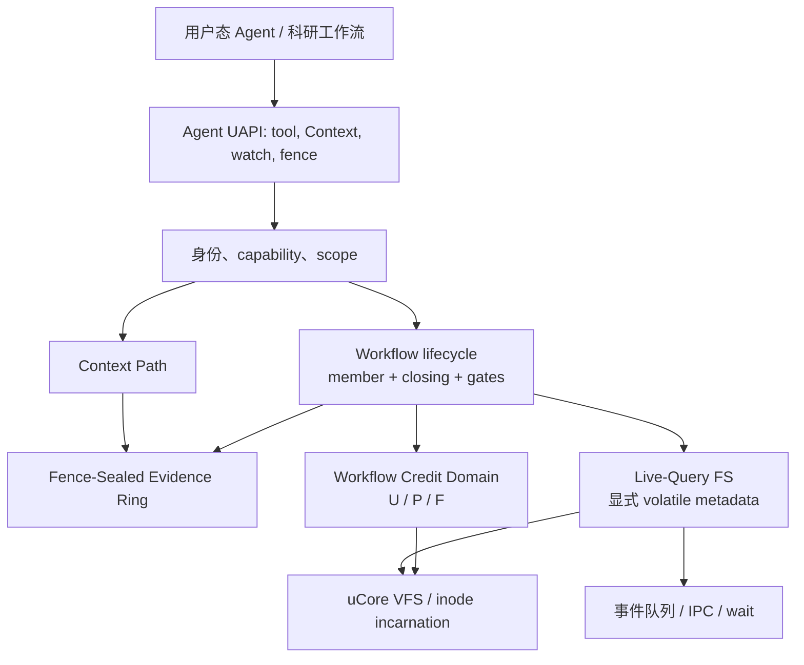

# AgentOS-uCore 设计

本文描述当前生产构建中的 AgentOS-uCore。历史上的 metadata 双 bank、自动目录扫描、逐操作 durable observation 和多阶段 workflow retirement 已退出当前架构，不再作为设计能力宣称。

## 1. 目标与边界

AgentOS-uCore 为用户态 Agent workflow 提供五类内核原语：

1. generation-safe 身份、角色、capability 与 workflow scope；
2. Context Path 和结构化工具调用；
3. 有界事件、可信 IPC 和 Agent 感知调度；
4. 显式文件属性、选择性内存索引与实时查询通知；
5. 按 workflow 批量资源记账与 challenge-bound fence evidence。

内核不运行 LLM，不理解科研项目业务，不提供全文搜索，也不把用户态成功声明当成发布证据。网页、实验编排、报告和证据包封装都在用户态或 Host 完成。

## 2. 总体结构



所有跨模块引用都带不可变 lifecycle `id + generation`。slot 可复用，generation 不可复用，因此旧事件、watch、资源账户和 inode sidecar 不能命中新 workflow。

## 3. Workflow lifecycle

### 3.1 状态

每条记录保存：

- `scope_id` 和不可变 generation；
- controller 的 `control_id`；
- `members` 引用计数；
- `closing`；
- `active_operations`、`departing_operations`；
- `fence_gate` 和单调 `fence_sequence`；
- Context branch 分配器。

创建时 `members=1`、`closing=0`。join 只在非 closing 且 fence gate 未关闭时增加 member。显式 close 或最后成员离开把 `closing` 置位。`retiring()` 只是“closing 且 members 为 0”的内部可回收条件，不是一个对外多阶段 workflow。

### 3.2 三类 gate

| gate | 覆盖范围 | 作用 |
| --- | --- | --- |
| operation | 普通 workflow 操作 | close/fence 后阻止新操作进入，并统计已经进入的操作 |
| departure | exit/teardown cut | 允许离开动作与 fence 互斥，避免资源释放穿越快照 |
| fence | controller 发起的精确 cut | 暂停新 operation/departure；若已有操作未清空则立即返回 retry，不持 gate 睡眠 |

回收要求 `closing && members==0 && active_operations==0 && departing_operations==0 && !fence_gate`。之后各子系统按同一 lifecycle key 回收 watch、live-query pending、Evidence Ring、资源账户和 scope。

## 4. Agent Workflow Credit Domain

### 4.1 U/P/F 模型

每个资源账户、charge class 和 resource kind 都维护：

- `U` (`used`)：活对象持有；
- `P` (`pending`)：已准入但尚未 commit/cancel 的分配持有；
- `F` (`free`)：账户已向全局预充、暂时空闲的本地 credit；
- `held = U + P + F`。

资源种类覆盖 process、thread、file object、filesystem block/inode、buffer cache、Agent state page 和 physical page。ordinary/reserved 两类分别计量。

### 4.2 批量快路径

额度不足时按资源种类的 quantum 预充一小块 credit。之后普通路径只进行：

```text
reserve: F -> P
commit:  P -> U
cancel:  P -> F
release: U -> F
```

这些移动不改变该账户的 `held`，因此不需要每次重新写全局统计。直接 acquire 可从 `F` 移到 `U`。物理页等存在真实分配失败窗口的路径仍使用 reservation，避免记账成功但对象未创建。

### 4.3 硬限额没有放松

批量只改变“谁持有空闲 F”，不改变准入定义。补充 credit 前同时检查：

- 全局 policy 容量；
- ordinary/reserved class 容量；
- 账户对应 class limit；
- 向其他账户回收可用 F 后是否仍不足。

任何检查失败都在修改状态前返回。压力路径可以 trim 其他账户的 F；账户 close/advance、context switch 离开 workflow 和 workflow fence 也 trim 本地 F。F 不是可超卖额度。

### 4.4 fence 精确结算

fence 在 lifecycle gate 内对 exec 与 storage account 执行单锁 `trim + snapshot`。成功条件包括所有资源的 `P==0`。receipt 只导出合并后的精确 `U`，另以 account slot/generation、credit epoch 和 U 向量计算 `credit_digest`。内部快照仍保存 U/P/F/held，供 checker 验证不变量。

该设计受 Linux cpuacct、`percpu_counter` 和 cgroup rstat 延迟聚合思想启发，但 AgentOS 的本地单位是 workflow resource account，并增加 fence 上的精确 cut。代码与数据结构为本项目独立实现。

## 5. Fence-Sealed Evidence Ring

### 5.1 存储布局

每个活跃 workflow 按需分配并计费 4 个 Agent state page：

- 3 页 ordinary ring，共 48 个 256 字节槽；
- 1 页 critical ring，共 16 个 256 字节槽。

槽状态为 `FREE/BUSY/COMMITTED/DISCARDED`。生产者先 reserve 单调 ticket，在 IRQ-on 区域填充，再 commit；失败时 discard 并记录 gap。读者只接受 ticket 匹配且已 commit 的槽，并在遇到更早 BUSY ticket 时隐藏后续记录，保持发布顺序。

### 5.2 canonical 与兼容投影

Context 发布后构造一条 canonical evidence event，包含 Context/audit sequence、request、tick、cause/span/branch、control id、record hash、actor、tool、status 和短 payload/result。

- `status == OK` 且无授权效果：只写 canonical ring，并唤醒 timeline 读者；不再为相同事实支付普通 legacy audit hash-chain 写入。
- 拒绝或具有授权效果：进入独立 critical ring，并额外写一条兼容 ledger 投影，让旧 audit receipt/query API 仍能看到关键记录。
- ring 分配或写入失败：fail closed 到受保护的 legacy ledger 路径，同时保留可见 gap/失败语义，而不是伪造 ring 成功。

event enqueue/consume、稀疏 sched 采样等旧观测记录仍可留在兼容 ledger。因而 audit/timeline/provenance/ledger 是兼容聚合视图，不应写成已经全部删除。

### 5.3 rollover 与 seal

环满时先把已提交 segment 滚入内部 root，再复用槽位。ordinary 丢失以 gap counter 进入哈希；critical 区不与普通成功事件争用同一容量。seal 使用 SHA-256 domain separation，绑定：

- 上一个公开 fence root；
- 本次 challenge 与 fence sequence；
- 事件 ticket 范围、事件数和 gap 数；
- metadata generation 与 credit epoch；
- credit digest；
- 当前 segment 的有序 event/gap digest。

内部 retirement seal 只用于内核保留 tombstone，不等价于 challenge-bound workflow fence receipt。只有成功的显式 fence 才设置 `WORKFLOW_FENCE` retained 标志并推进外部 root 链。

### 5.4 明确限制

Evidence Ring 是内存结构。`FENCE_SEALED` 证明 receipt 所述 cut 已进入 challenge-bound root，不表示落盘、fsync、掉电原子性或重启后可恢复。receipt 带 `PARTIAL_COVERAGE`，因为调度样本、普通文件内容和 Host 行为不全在该 ring 中。

该机制受 Linux BPF ring buffer 的共享有序环、reserve/commit/discard 和通知思想启发；AgentOS 增加 workflow generation、因果字段、critical 隔离和 challenge fence。未复制 BPF 源码或二进制布局。

## 6. Agent Live-Query FS

### 6.1 只索引显式 metadata

`agent_file_meta_set()` 把一条 metadata 绑定到真实 `dev + inum + incarnation`。写入必须来自具有 `META_WRITE` 的 Agent，并且 flags 只能是普通 set 或 `DELETE`；`PERSIST/AUTOSCAN` 当前返回 `BAD_PARAM`。

catalog 在内存中有界保存记录，并维护 `status`、`stage`、`kind` 选择性索引。查询可强制 scan 或请求 index；即使走索引也实际遍历候选，不保存跨查询结果 cache。`fs_generation` 标识当前可见代际。

普通文件 create/rename 不会自动成为 Agent metadata。VFS 只为已显式绑定的对象投射 unlink tombstone、内容大小变化和 incarnation 失效，以保持现有 metadata 的实时性。

### 6.2 typed watch

`agent_live_watch()` 安装完整 `struct agent_file_query` 谓词，而不是依赖字符串解析。每次 metadata before/after transition 计算：

- `ENTER`：之前不匹配，之后匹配；
- `UPDATE`：前后都匹配且记录发生变化；
- `LEAVE`：之前匹配，之后不匹配或对象删除。

事件通过 `AGENT_EVENT_FILE_QUERY` 投入目标 Agent Context/queue。可见性仍遵循 SYSTEM 与同 workflow scope 规则，并绑定目标进程 control id 和 lifecycle generation，PID/slot 复用不能继承订阅。

### 6.3 resync

队列饱和、pending 表耗尽或无法可靠投递全部增量时，内核记录单调 `resync_generation`，随后发送 `RESYNC_REQUIRED`。用户重新执行 snapshot/query 后，以 `ACK_RESYNC` 和对应 generation 安装或删除 watch。旧 generation 的 ACK 不能清除更新的缺口。

workflow fence 在 metadata transaction 内排空该 scope 的 tombstone、内容 pending 和待投递 resync；仍有未确认缺口则返回 `RETRY`，不会把不完整 generation 标成已切割。

### 6.4 明确限制

catalog、索引、watch 和 generation 都是本次启动周期的内存状态。没有 `.agentmeta` 双 bank、journal、启动恢复或 crash-recovery catalog。文件内容本身仍由普通 uCore 文件系统管理，但 Agent metadata 不随重启恢复。

该设计受 Haiku BFS 显式属性、选择性索引和 live query 概念启发；AgentOS 将变化事件送入 Agent Loop，并以 workflow generation 与 resync 契约限制可见性。未复制 BFS 源码或磁盘格式。

## 7. Workflow fence

controller 通过 `agent_run(..., count=0, AGENT_RUN_F_FENCE)` 发起 fence。顺序为：

1. 验证 orchestrator capability、controller control id、request version/size/id；
2. 关闭 lifecycle fence gate，拒绝与现有 operation/departure 交叉；
3. 取得 metadata quiescence generation，并排空 live-query deferred work；
4. 完成文件系统 deferred reclaim/epoch cut；
5. trim exec/storage credit，要求 `P==0`，生成精确 U digest；
6. 以 challenge、credit digest 和 metadata generation 密封 Evidence Ring；
7. 先提交 fence sequence 与 retry cache，再 copyout 320 字节 receipt。

同一 lifecycle 中 `request_id` 单调。相同 id 和相同 challenge 重试返回同一 receipt；相同 id 不同 challenge 返回 conflict；旧 id 返回 stale；已提交但尚未成功 copyout 的 receipt 不会被新请求覆盖。

receipt flags 恒明确当前合同：partial coverage、credit exact、evidence sealed、metadata volatile。

## 8. Context、timeline 与 provenance

Context Path 仍是每个 Agent 的可信运行历史和用户只读 mirror。Evidence Ring 保存 workflow 级 canonical Context evidence；兼容 observe 层把以下来源合并为查询视图：

- 当前进程 Context；
- Evidence Ring 投影的 audit/timeline；
- critical 或 fallback legacy ledger；
- 有界 sched/event 记录。

provenance 从 Context cause/span/branch/control 字段和兼容 audit 记录投影边。读取 API 不把同一 ring event 重复统计为 legacy Context record。ledger hash 是兼容视图标签，不应解释为磁盘账本根；可验证外部根以 workflow fence receipt 的 `evidence_root` 为准。

## 9. 安全和性能取舍

| 决策 | 获得 | 放弃/限制 |
| --- | --- | --- |
| U/P/F 批量 credit | 热路径更少全局写；保留硬准入 | 普通统计可包含账户持有的空闲 F，只有 trim/fence 才得到精确 U |
| 一次 canonical evidence | 删除普通成功事件多重写入 | 环是有界内存；普通 gap 需要 fence 显式承诺 |
| critical 独立容量 | 拒绝/授权证据不被成功 telemetry 挤占 | 仍保留少量 legacy 投影成本 |
| volatile explicit metadata | 删除扫描、journal、checkpoint I/O | 重启后必须由用户态重新登记和查询 |
| member + closing | 生命周期状态更小、cut 更清晰 | 不提供复杂恢复阶段或无限 workflow 槽 |

## 10. 实现与验证入口

| 机制 | 主要实现 | 静态/模型检查 |
| --- | --- | --- |
| Credit Domain | `os/resource_controller.c`、`os/workflow_credit_domain.c` | `scripts/test-workflow-credit-domain.py` |
| Evidence Ring | `os/agent_evidence_ring.c`、`os/agent_sha256.c` | `scripts/test-agent-evidence-ring.py` |
| Workflow fence | `os/agent_workflow_fence.c`、`os/workflow_lifecycle.c` | `scripts/test-workflow-fence.py`、`scripts/test-workflow-syscall-cut.py` |
| Live Query | `os/agent_live_query_events.c`、metadata catalog/query/object 模块 | `scripts/test-agent-live-query-fs.py` |
| ABI/边界 | 公共头文件、Makefile 生产对象清单 | `make agent-module-check`、`make kernel-budget-check` |

通过静态或模型测试不等于 QEMU 行为已经发布。动态结果和性能数字只从 [正式证据索引](../../evidence/releases/INDEX.md) 指向的 bundle 读取。

## 11. 参考与原创边界

- Linux CPU accounting/percpu/rstat：批量本地计数和需要时同步的思想。
- Linux BPF ring buffer：有序 MPSC、reserve/commit/discard 和通知思想。
- Haiku BFS：显式属性、选择性索引和 live query 思想。

上述均为公开设计思想参考。AgentOS 的 workflow generation、U/P/F 硬准入、challenge fence、critical ring、Agent Context 事件和 volatile metadata ABI 为本仓库的项目特定实现；没有 vendoring 上游源码、测试数据、二进制或磁盘格式。链接及许可见 [../../NOTICE](../../NOTICE)。
