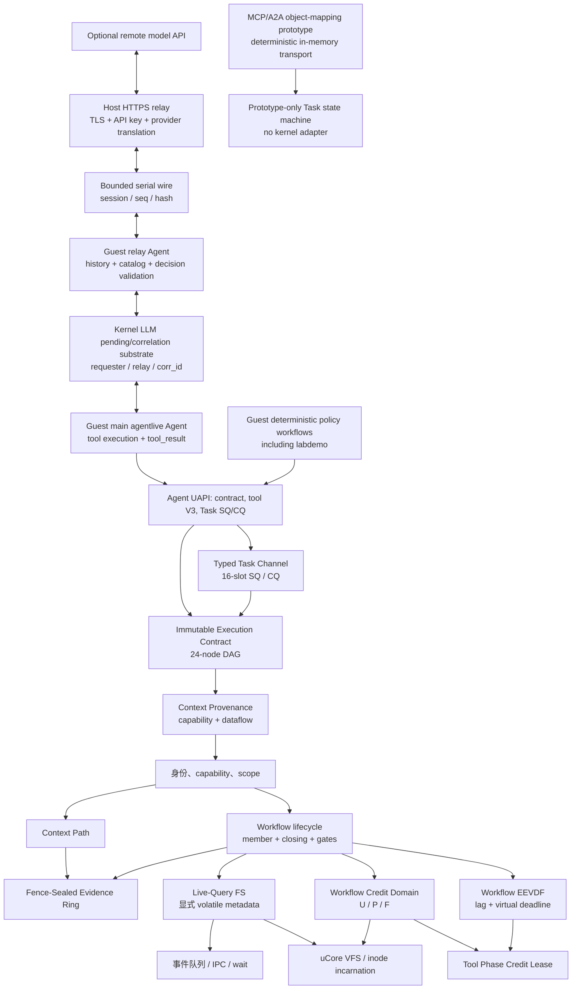

# AgentOS-uCore 设计

本文描述当前生产构建中的 AgentOS-uCore，重点是机制/策略边界、当前启动周期状态和可执行验证入口。

## 1. 目标与边界

AgentOS-uCore 为用户态 Agent workflow 提供八类内核原语：

1. generation-safe 身份、角色、capability 与 workflow scope；
2. Context Path 和结构化工具调用；
3. 有界事件、可信 IPC 和 Agent 感知调度；
4. 显式文件属性、选择性内存索引与实时查询通知；
5. 按 workflow 批量资源记账与 challenge-bound fence evidence；
6. ENFORCE V3 可选的 24-node immutable execution contract 与工具阶段资源 lease；
7. workflow 级 EEVDF、Context provenance 标签与 ENFORCE effect gate；
8. single-issuer Task SQ/CQ core 与 typed resource handle；当前 provider 同步且只接受 null/NONE。

内核不运行 LLM，不理解科研项目业务或自然语言计划，不判断 prompt injection，不提供全文搜索，也不把用户态成功声明当成内核事实。模型驱动决策和 tool-result 回灌属于 Guest 用户态；HTTPS/TLS/API key 与 provider JSON 翻译属于 Host relay；MCP/A2A 只存在独立的标准对象映射 prototype。这三条路径不能混称为一个“内核 Agent”或“协议 server”。

## 2. 总体结构



所有跨模块引用都带不可变 lifecycle `id + generation`。slot 可复用，generation 不可复用，因此旧事件、watch、资源账户和 inode sidecar 不能命中新 workflow。

Agent Context 的固定用户映射共 7 页。前 6 页由内核发布身份、Context 记录与可信 mirror，Guest PTE 只读；第 7 页是 Guest 可直接读写的 user cache。cache 用于高频策略数据，却不作为 capability、scope、cause 或任何授权事实，因而题面“直接读写 Context 区”不会变成伪造可信历史的入口。

### 2.1 三条接口边界

| 层次 | 谁做决策与执行 | 当前边界 |
| --- | --- | --- |
| 内核 RPC/工具 ABI | Guest 提交结构化请求，内核校验并执行本地机制 | V1/V2/V3、compact batch、Context、event/IPC；内核不调用模型 |
| model-led tool loop | `agentlive` 的 Guest relay Agent 保存 system prompt/history/tool catalog/round 并校验模型建议，Guest main Agent 执行获准工具并回灌实际 result | Host 只转发模型协议；`labdemo_ucore` 不走该路径，而是 deterministic policy workflow |
| MCP/A2A prototype | Host 用户态对象映射和 in-memory state machine | 无 HTTP server、streaming、跨实现互操作验证或内核 SQ/CQ adapter |

## 3. Workflow lifecycle

### 3.1 状态

每条记录保存：

- `scope_id` 和不可变 generation；
- controller 的 `control_id`；
- `members` 引用计数；
- `closing`；
- `active_operations`、`departing_operations`；
- `fence_gate` 和单调 `fence_sequence`；
- Context branch 分配器。

创建时 `members=1`、`closing=0`。join 只在非 closing 且 fence gate 未关闭时增加 member。显式 close 或最后成员离开把 `closing` 置位。`retiring()` 只是“closing 且 members 为 0”的内部可回收条件，不是一个对外多阶段 workflow。

### 3.2 三类 gate

| gate | 覆盖范围 | 作用 |
| --- | --- | --- |
| operation | 普通 workflow 操作 | close/fence 后阻止新操作进入，并统计已经进入的操作 |
| departure | exit/teardown cut | 允许离开动作与 fence 互斥，避免资源释放穿越快照 |
| fence | controller 发起的精确 cut | 暂停新 operation/departure；若已有操作未清空则立即返回 retry，不持 gate 睡眠 |

回收要求 `closing && members==0 && active_operations==0 && departing_operations==0 && !fence_gate`。之后各子系统按同一 lifecycle key 回收 watch、live-query pending、Evidence Ring、资源账户和 scope。

### 3.3 不可变 execution contract

用户态 orchestrator 可为当前 lifecycle generation 冻结一份版本 1 execution contract。合同最多 24 个节点，`node_id` 等于拓扑数组下标，predecessor bit 只能指向更小下标；节点还冻结 tool/schema digest、capability、provenance/side-effect manifest、exec/storage envelope、deadline、artifact 类型和 retry/cancel policy。只有 ENFORCE 下的 V3 调用获得这套 immutable DAG 保证；V1/V2 在未启用 ENFORCE 时是逐次校验的 legacy/exploratory RPC，不得写成已受 frozen edge 保护。

调用 V3 保留 V2 前缀并引用 contract generation、node/attempt、source node 和精确 predecessor Context sequence。内核只验证这些确定结构，不解释用户目标。enforcement contract 激活后，合同外的工具调用和受保护 direct syscall 在副作用前被拒绝；完成缓存为每个 accepted `node_id + attempt_id` 保留稳定槽，每份合同合计最多 48 槽，使同一 attempt 的合法重试返回原终态而不重复效果。合同只在对应 lifecycle retire/reclaim 时销毁，旧 generation 不可复用。

## 4. Agent Workflow Credit Domain

### 4.1 U/P/F 模型

每个资源账户、charge class 和 resource kind 都维护：

- `U` (`used`)：活对象持有；
- `P` (`pending`)：已准入但尚未 commit/cancel 的分配持有；
- `F` (`free`)：账户已向全局预充、暂时空闲的本地 credit；
- `held = U + P + F`。

资源种类覆盖 process、thread、file object、filesystem block/inode、buffer cache、Agent state page 和 physical page。ordinary/reserved 两类分别计量。

### 4.2 批量快路径

额度不足时按资源种类的 quantum 预充一小块 credit。之后普通路径只进行：

```text
reserve: F -> P
commit:  P -> U
cancel:  P -> F
release: U -> F
```

这些移动不改变该账户的 `held`，因此不需要每次重新写全局统计。直接 acquire 可从 `F` 移到 `U`。物理页等存在真实分配失败窗口的路径仍使用 reservation，避免记账成功但对象未创建。

### 4.3 硬限额没有放松

批量只改变“谁持有空闲 F”，不改变准入定义。补充 credit 前同时检查：

- 全局 policy 容量；
- ordinary/reserved class 容量；
- 账户对应 class limit；
- 向其他账户回收可用 F 后是否仍不足。

任何检查失败都在修改状态前返回。压力路径可以 trim 其他账户的 F；账户 close/advance、context switch 离开 workflow 和 workflow fence 也 trim 本地 F。F 不是可超卖额度。

### 4.4 fence 精确结算

fence 在 lifecycle gate 内对 exec 与 storage account 执行单锁 `trim + snapshot`。成功条件包括所有资源的 `P==0`。receipt 只导出合并后的精确 `U`，另以 account slot/generation、credit epoch 和 U 向量计算 `credit_digest`。内部快照仍保存 U/P/F/held，供 checker 验证不变量。

该设计受 Linux cpuacct、`percpu_counter` 和 cgroup rstat 延迟聚合思想启发，但 AgentOS 的本地单位是 workflow resource account，并增加 fence 上的精确 cut。代码与数据结构为本项目独立实现。

### 4.5 Tool Phase Credit Lease

每个合同节点的 exec/storage envelope 在工具开始前从账户现有 U 中原子锁定。锁定量仍计入 U 和所有 hard-limit/fence 检查，但不能被普通 release/transfer 路径消费。lease 按 `ADMITTED -> ACTIVE -> DEACTIVATED -> SETTLED` 推进；未使用量在结算时 `U -> F`。

分配器发布对象前必须从 locked U 取得带 nonce 的 claim。失败对象把 claimed U 精确 refund 回 locked U；成功发布只解除 claim 标记，live object 继续持有同一 U，最终由正常析构执行一次 `U -> F`。这使 process、thread、file、page、block 等短峰值共享一个原子 envelope，而不增加 workflow 配额或允许预测式超卖。每 lifecycle 最多 24 个 phase，与合同节点上限一致；全局 claim 表和线程阻塞边界均有界。

### 4.6 Workflow EEVDF

Agent workflow 的公平记账单位是 resource domain，而不是线程。调度器以 workflow `vruntime` 计算 lag，只有 `vruntime <= global vtime` 的实体 eligible；latency class 和当前 event/deadline 缩短 service request，并在 eligible 集合中选择最早 virtual deadline。dispatch 后按实际 service cycles 给 workflow 记账，睡眠实体的 lag 向 global vtime 衰减，防止通过创建更多线程或短睡眠放大份额。

一个实体时走 fast path。身份不完整、内部校验失败或容量外情况保留旧 RR/Agent heuristic 作为 fallback，且失败计划不修改 EEVDF 状态。当前实体表总计最多同时跟踪 4 个 workflow：1 个 `BOOT_SEALED` bootstrap participant 已占一槽，fresh workflow 最多 3 个。1-way 只覆盖单实体 fast path；4-way 满容量测量是 bootstrap+3 fresh；线程放大测量是 1 个 fresh 4-thread workflow 对 2 个 fresh single-thread workflow，并保留 bootstrap peer。

16 档表示四波共 16 个逻辑样本：每波复用同一 bootstrap 一次，并累计创建 12 个 fresh lifecycle。它不是 16-way 并发，不是每波 4 个 fresh，也不证明 16 个独立 lifecycle。lifecycle info V3 导出 Jain fairness 所需 service 计数、lag/virtual deadline、fallback、deadline miss 和唤醒延迟直方图；评价直方图及 p50/p99 只聚合 fresh-agent 样本。Host scheduler model 可以用抽象实体单独检验 lag/virtual-deadline 算法，但该抽象不改变 Guest 的固定槽位与 lifecycle 拓扑。

调度算法参考 Linux EEVDF 的 lag eligibility、virtual deadline 和 sleeping lag decay，但以 workflow domain 聚合、Agent deadline/latency class、4-slot cap 和安全回退是本项目特定设计。

## 5. Fence-Sealed Evidence Ring

### 5.1 存储布局

每个活跃 workflow 按需分配并计费 4 个 Agent state page：

- 3 页 ordinary ring，共 48 个 256 字节槽；
- 1 页 critical ring，共 16 个 256 字节槽。

槽状态为 `FREE/BUSY/COMMITTED/DISCARDED`。生产者先 reserve 单调 ticket，在 IRQ-on 区域填充，再 commit；失败时 discard 并记录 gap。读者只接受 ticket 匹配且已 commit 的槽，并在遇到更早 BUSY ticket 时隐藏后续记录，保持发布顺序。

### 5.2 canonical 与兼容投影

Context 发布后构造一条 canonical evidence event，包含 Context/audit sequence、request、tick、cause/span/branch、control id、record hash、actor、tool、status 和短 payload/result。

- `status == OK` 且无授权效果：只写 canonical ring，并唤醒 timeline 读者；不再为相同事实支付普通 legacy audit hash-chain 写入。
- 拒绝或具有授权效果：进入独立 critical ring，并额外写一条兼容 ledger 投影，让旧 audit receipt/query API 仍能看到关键记录。
- ring 分配或写入失败：fail closed 到受保护的 legacy ledger 路径，同时保留可见 gap/失败语义，而不是伪造 ring 成功。

event enqueue/consume、稀疏 sched 采样等旧观测记录仍可留在兼容 ledger。因而 audit/timeline/provenance/ledger 是兼容聚合视图，不应写成已经全部删除。

### 5.3 rollover 与 seal

环满时先把已提交 segment 滚入内部 root，再复用槽位。ordinary 丢失以 gap counter 进入哈希；critical 区不与普通成功事件争用同一容量。seal 使用 SHA-256 domain separation，绑定：

- 上一个公开 fence root；
- 本次 challenge 与 fence sequence；
- 事件 ticket 范围、事件数和 gap 数；
- metadata generation 与 credit epoch；
- credit digest；
- 当前 segment 的有序 event/gap digest。

内部 rollover/retirement seal 只用于 Evidence Ring 维护，不等价于 challenge-bound workflow fence receipt。只有成功的显式 fence 才设置 `WORKFLOW_FENCE` retained 标志并推进外部 root 链。

### 5.4 明确限制

Evidence Ring 是内存结构。`FENCE_SEALED` 证明 receipt 所述 cut 已进入 challenge-bound root，不表示落盘、fsync、掉电原子性或重启后可恢复。receipt 带 `PARTIAL_COVERAGE`，因为调度样本、普通文件内容和 Host 行为不全在该 ring 中。

该机制受 Linux BPF ring buffer 的共享有序环、reserve/commit/discard 和通知思想启发；AgentOS 增加 workflow generation、因果字段、critical 隔离和 challenge fence。未复制 BPF 源码或二进制布局。

## 6. Agent Live-Query FS

### 6.1 只索引显式 metadata

`agent_file_meta_set()` 把一条 metadata 绑定到真实 `dev + inum + incarnation`。写入必须来自具有 `META_WRITE` 的 Agent，并且 flags 只能是普通 set 或 `DELETE`。

catalog 在内存中有界保存记录，并维护 `status`、`stage`、`kind` 选择性索引。查询可强制 scan 或请求 index；即使走索引也实际遍历候选，不保存跨查询结果 cache。`fs_generation` 标识当前可见代际。

普通文件 create/rename 不会自动成为 Agent metadata。VFS 只为已显式绑定的对象投射 unlink、内容大小变化和 incarnation 失效，以保持现有 metadata 的实时性。

### 6.2 typed watch

`agent_live_watch()` 安装完整 `struct agent_file_query` 谓词，而不是依赖字符串解析。每次 metadata before/after transition 计算：

- `ENTER`：之前不匹配，之后匹配；
- `UPDATE`：前后都匹配且记录发生变化；
- `LEAVE`：之前匹配，之后不匹配或对象删除。

事件通过 `AGENT_EVENT_FILE_QUERY` 投入目标 Agent Context/queue。可见性仍遵循 SYSTEM 与同 workflow scope 规则，并绑定目标进程 control id 和 lifecycle generation，PID/slot 复用不能继承订阅。

### 6.3 resync

队列饱和、pending 表耗尽或无法可靠投递全部增量时，内核记录单调 `resync_generation`，随后发送 `RESYNC_REQUIRED`。用户重新执行 snapshot/query 后，以 `ACK_RESYNC` 和对应 generation 安装或删除 watch。旧 generation 的 ACK 不能清除更新的缺口。

workflow fence 在 metadata transaction 内排空该 scope 的 unlink/content pending 和待投递 resync；仍有未确认缺口则返回 `RETRY`，不会把不完整 generation 标成已切割。

### 6.4 明确限制

catalog、索引、watch 和 generation 都只保存在本次启动周期的内存中，不写入磁盘；重启后 catalog 从空状态开始。文件内容本身仍由普通 uCore 文件系统管理。

该设计受 Haiku BFS 显式属性、选择性索引和 live query 概念启发；AgentOS 将变化事件送入用户态 Agent Loop substrate/事件队列，并以 workflow generation 与 resync 契约限制可见性。未复制 BFS 源码或磁盘格式。

## 7. Workflow fence

controller 通过 `agent_run(..., count=0, AGENT_RUN_F_FENCE)` 发起 fence。顺序为：

1. 验证 orchestrator capability、controller control id、request version/size/id；
2. 关闭 lifecycle fence gate，拒绝与现有 operation/departure 交叉；
3. 取得 metadata quiescence generation，并排空 live-query deferred work；
4. 完成文件系统 deferred reclaim/epoch cut；
5. trim exec/storage credit，要求 `P==0`，生成精确 U digest；
6. 以 challenge、credit digest 和 metadata generation 密封 Evidence Ring；
7. 先提交 fence sequence 与 retry cache，再 copyout 320 字节 receipt。

同一 lifecycle 中 `request_id` 单调。相同 id 和相同 challenge 重试返回同一 receipt；相同 id 不同 challenge 返回 conflict；旧 id 返回 stale；已提交但尚未成功 copyout 的 receipt 不会被新请求覆盖。

receipt flags 恒明确当前合同：partial coverage、credit exact、evidence sealed、metadata volatile。

## 8. Context、timeline 与 provenance

Context Path 仍是每个 Agent 的可信运行历史和用户只读 mirror。Evidence Ring 保存 workflow 级 canonical Context evidence；兼容 observe 层把以下来源合并为查询视图：

- 当前进程 Context；
- Evidence Ring 投影的 audit/timeline；
- critical 或 fallback legacy ledger；
- 有界 sched/event 记录。

provenance 从 Context cause/span/branch/control 字段和兼容 audit 记录投影边。读取 API 不把同一 ring event 重复统计为 legacy Context record。ledger hash 是兼容视图标签，不应解释为磁盘账本根；可验证外部根以 workflow fence receipt 的 `evidence_root` 为准。

### 8.1 固定 provenance 标签与 effect gate

Context record flags 以 hash-bound 投影携带六种固定标签：`KERNEL_FACT`、`TRUSTED_USER_CONTROL`、`AGENT_DERIVED`、`UNTRUSTED_FILE_DATA`、`UNTRUSTED_TOOL_OUTPUT` 和 `CROSS_AGENT_DATA`。file query/content、tool output、IPC queue/mailbox 和 Task resource 保守 OR 传播这些标签；rollback/clear 恢复所选 Context 节点的状态。

tool manifest 声明 accepted labels、output-added labels、required capability 与完整 file/metadata/IPC/process/permission/artifact/watch side-effect mask。启用 ENFORCE 的 V3 外部效果必须同时通过 lifecycle generation、execution contract edge、schema、capability、provenance 和 effect mask；不可信数据不能添加冻结合同中不存在的高权限节点。非法调用在副作用前返回 `DENIED`，并把来源 Context、目标 tool、reason、lifecycle key 写入 critical Evidence Ring。V1/V2 legacy admission 仍检查 capability/scope/tool schema，但没有 frozen-edge/provenance envelope。内核不对文本运行 prompt-injection 分类或 LLM 审核。

`send_message`、`llm_request`、`llm_response` 是唯一使用 Agent-Loop accepted mask 的工具：control 标签集合再加 file、untrusted-tool-output 与 cross-Agent 标签。该 mask 只允许带来源的观测继续通过消息 loop；IPC/LLM 输出仍保守传播原污点，capability/route/schema/effect 检查不变，其他副作用工具也不因此放宽。MESSAGE/LLM event 的 cause sequence 使用该次调用已递增的当前 call count。

### 8.2 Guest-owned model tool loop

`agentlive` 把模型工具循环放在两个同 workflow 的 Guest Agent 中。relay Agent 从内核 V2 tool list 取得带用途、参数、限制、结果和 side-effect 的描述，构造 system prompt，并在 Guest 内保存有界多轮 history、轮次与 correlation id。history 只按完整的 `tool_use`/`tool_result` 对写入 4 KiB request frame；空间不足时整轮丢弃最旧前缀，不截断单条结果。main Agent 不接触串口，只执行获准的业务工具。模型每轮只能返回一个 canonical `tool_use` 或 `final`；Guest 侧对工具名和 typed 参数重新做 allowlist/shape 校验，main Agent 调用 V2 RPC，在 Context 中取得结果，再由 relay Agent 把真实 `tool_result` 放回后续 messages。模型只提议，Guest 与内核才决定请求是否有效并实际执行。

Host `guest_llm_relay.py` 独占 QEMU 串口和 provider HTTPS。API key、TLS、endpoint policy 与 OpenAI-compatible/Anthropic Messages 翻译只在 Host；它不读取 Guest 业务文件、不保存语义 history、不选择或执行工具，也不制造 `tool_result`。Host 只暂存 provider opaque call id 与 Guest correlation id 的协议映射，并把实际 provider 响应规整为一个 `tool_use` 或 `final`；多 tool、超界内容和未知结构 fail closed。

串口使用有界 `@AGENTOS/1` frame，绑定 session、方向内单调 sequence、decoded length、SHA-256 与 base64url JSON。live API 是可选模式；offline replay 仍经过相同 QEMU 串口、frame/session/sequence/hash、round 与 payload 上限，而不是向 Guest 内存直接注入状态。replay 证明 wire/loop 可复现，不等于真实云模型结果。

内核 `LLM_REQUEST/LLM_RESPONSE` 另以完整 lifecycle、requester PID/control、relay PID/control、correlation 和 deadline 组成 pending tuple。correlation 必须非零，并对同 requester 完整身份严格递增；只有 MESSAGE 实际投递且 pending 发布成功后才推进，失败投递不消耗编号。pending 使用 120 秒 kernel-tick TTL，并在 request、response 和 tick 路径回收。容量为 `NPROC` 的有界 terminal history 在记录仍保留时使已消费响应重放返回 `STALE`、过期响应返回 `TIMEOUT`；记录被覆盖后，旧响应按 unmatched 返回 `DENIED`。全局 registry 和每 requester pending 都有界，`llm_pending_limit` 与底层 `event_queue_full` 明确区分。公开 exec/teardown 清理 pending、last correlation 和 terminal history。该机制不是 HTTPS 或 MCP 实现。

当前 adaptive loop 选择 V2，是因为模型可能根据每轮结果改变下一个工具。V3 ENFORCE 适合预冻结 node/tool/predecessor 的高保证路径；现有 provenance 规则也不会把跨 relay 的任意 adaptive 序列自动升级为合同内调用。因此文档不把 V3 称为 live loop backend，也不把 V2 的灵活性称作相同安全等级。

这一分工与 [Anthropic client tool-use loop](https://platform.claude.com/docs/en/agents-and-tools/tool-use/how-tool-use-works)及 [Claude Code agentic loop](https://code.claude.com/docs/en/how-claude-code-works)的“模型请求、执行环境运行工具、结果回灌”形状一致，但本项目没有嵌入 Claude Code 或 Anthropic SDK。

### 8.3 Task Channel core

每个 Agent 进程可按需建立一个 single-issuer channel。两个用户映射页分别为 16 槽 SQ（read/write）和 16 槽 CQ（read-only），另有 request/resource 两个内核私有页，总计 4 个被资源域计费的 state/physical page。SQE/CQE 固定 128 字节；内核先一次性复制完整 SQE，再验证 ring/slot generation、单调 request id、contract/node/attempt、tool/schema、deadline、link/cancel 和输入 handle，避免共享页 TOCTOU。

私有 head/tail 是权威状态。CQ full 产生 backpressure；协议水位异常进入 sticky resync，issuer 通过显式 enter 恢复。每个 accepted target 只允许一个 terminal winner 和一个 CQE；CANCEL 只引用 target，不产生第二个 CQE。可见 completion 必须带 Context sequence 与 Evidence ticket；公共 `completion_tick` 是 bridge 在执行结果确定后采样的完成时刻，不是 pre-effect service start。timer IRQ 只标记 hard deadline 到期，重型 expire 在首个 schedulable safe point 争取唯一终态，因此不承诺从截止时刻到终止的 wall-clock 上界；reclaim 等待 callback/lifecycle 引用释放。

resource handle 固定为 `{slot,type,flags,generation}`，区分 owned/borrowed；8 槽私有表绑定 content digest、producer Context/node、provenance 与 owner request。设计参考 WIT resource ownership 和 WASI 0.3 future/stream 的类型化异步接口，但不嵌入 Wasm runtime 或 Canonical ABI。

Task core 的 callback 协议可表达 `PENDING`，但当前内核 bridge 只有内建同步 provider，且没有动态 provider registration UAPI。该 provider 只接受 null input 与 output artifact `NONE`，`RESOURCE_IMPORT` 固定 fail closed 为 `DENIED`；因此现有 8 槽表和 typed handle ABI 尚没有 payload import 或 result resource backend，也不承载 `agentlive` 的模型消息或业务工具结果。

### 8.4 MCP/A2A object-mapping prototype

`mcp_a2a_gateway.py` 是 [MCP 2026-07-28](https://modelcontextprotocol.io/specification/2026-07-28) 与 A2A v1 标准对象形状的纯用户态映射 prototype。它以 `agent_task_transport.py` 的 deterministic `InMemoryTaskChannelTransport` 演练本仓库采用的工具发现/调用、实验性 Task 状态，以及 A2A message send/get/cancel 对象形状和 generation binding。

该 prototype 没有 HTTP binding、OAuth/JWS、Agent Card/discovery、streaming transport、真实内核 SQ/CQ binary adapter 或跨实现互操作测试。它不是 MCP/A2A server，也不是 live-model HTTPS relay；代码中出现 Task、Artifact 或 notification 对象不等于完整网络 lifecycle/stream 已交付。

## 9. 安全和性能取舍

| 决策 | 获得 | 放弃/限制 |
| --- | --- | --- |
| U/P/F 批量 credit | 热路径更少全局写；保留硬准入 | 普通统计可包含账户持有的空闲 F，只有 trim/fence 才得到精确 U |
| 一次 canonical evidence | 删除普通成功事件多重写入 | 环是有界内存；普通 gap 需要 fence 显式承诺 |
| critical 独立容量 | 拒绝/授权证据不被成功 telemetry 挤占 | 仍保留少量 legacy 投影成本 |
| boot-scoped explicit metadata | 只为登记对象维护 catalog/index | 每次启动由用户态重新登记和查询 |
| member + closing | 生命周期状态更小、cut 更清晰 | 不提供复杂恢复阶段或无限 workflow 槽 |
| 24-node immutable contract | 内核可在效果前确定验证计划边界 | 用户态必须拆分更大 DAG；同 lifecycle 不能热替换合同 |
| Phase Lease | 锁定工具峰值并在终态立即结算 | lease/claim 有界且 active phase 不能任意阻塞 |
| workflow EEVDF | 防线程放大并导出公平/延迟指标 | 总 cap4 为 bootstrap+最多 3 fresh；异常回退旧调度器；Guest 直方图只含 fresh-agent 样本 |
| 六标签 provenance | 不运行语义分类也能限制计划外副作用 | 标签保守传播，不能证明内容本身可信 |
| 16-slot Task SQ/CQ | Guest 用三条不同线格式各执行 16 次空 `ECHO`，验证相同语义 fingerprint、调用点 syscall/ABI 复制记账与 Context service-start tick 间隔 | scalar V3 需三个 typed params；4 页按需成本；当前同步 null provider；不提供 raw cycles、running cancel、payload backend 或分布式 exactly-once |
| Guest-owned model loop | 模型可根据实际 tool result 逐轮选择 V2 typed RPC；Host 不持有业务执行权 | 只支持单个 tool request；live 依赖外部 API，replay 不是模型实测；V2 不获得 V3 frozen-DAG 包络 |
| MCP/A2A object prototype | 检查本仓库采用的标准对象形状与 Task 状态映射 | 仅 in-memory transport；无 server、streaming、内核 adapter 或互操作声明 |

当前 Task 消融的 Guest 入口调用次数为 batch/scalar V3/SQ-CQ 的 1/16/2：batch 用一次 `agent_run` 同步顺序执行 16 个 compact op，scalar 发起 16 次 syscall，SQ/CQ 发起两次 enter。描述符 ABI 与已知复制记账分别为 `3584 = 16 * (104 + 120)`、`12288 = 16 * (200 + 280 + 3 * 96)`、`4096 = 16 * (128 + 128)` 字节；scalar 的三个 96 字节项是 `payload`/`arg0`/`arg1` typed params，另报 128 字节 dispatch header；SQ/CQ 另报 336/544 字节 control ABI/copy。这里没有内核路径 syscall counter 或总内存流量测量。p50/p99 来自工具效果前写入 Context record 的 service-start tick 间隔，sequence elapsed 是两个 `agent_info` 边界 tick；公共 CQE `completion_tick` 保持执行后完成语义。cancel 数字只测量 retained-terminal 幂等 cancel，CQ-full/sticky-resync 只作功能恢复验证；动态数字由 `agenttask_ucore` 的实际运行输出读取。

## 10. 实现与验证入口

| 机制 | 主要实现 | 静态/模型检查 |
| --- | --- | --- |
| Credit Domain | `os/resource_controller.c`、`os/workflow_credit_domain.c` | `scripts/test-workflow-credit-domain.py` |
| Execution Contract/Phase | `os/agent_execution_contract.c`、`os/agent_core.c`、`os/resource_controller.c` | `scripts/test-agent-execution-contract.py` |
| Workflow EEVDF | `os/workflow_scheduler.c`、`os/proc.c` | `host_tools/test_workflow_scheduler_model.py` |
| Context Provenance | `os/agent_provenance.c`、tool protocol、Context/IPC | execution-contract checker 与 Guest security scenario |
| Kernel LLM correlation RPC | `os/agent_core.c`、`os/agent_ipc.c` | lifecycle/requester/relay/correlation negative paths |
| Guest-owned model loop | `user/src/agentlive_ucore.c`、`ci/agent-live-replay.jsonl` | `scripts/test-agent-live-loop.py`；`make agent-live-demo` 走 QEMU 同串口 replay |
| Task Channel | `os/agent_task_channel.c`、`agent_task_channel_abi.h` | `scripts/test-agent-task-channel.py` |
| Host model relay | `host_tools/guest_llm_relay.py` | `host_tools/test_guest_llm_relay.py`；只覆盖 Host/wire/provider adapter |
| MCP/A2A object prototype | `host_tools/mcp_a2a_gateway.py`、`host_tools/agent_task_transport.py` | deterministic in-memory object/state tests；无 server/stream/interop 或内核 adapter |
| Evidence Ring | `os/agent_evidence_ring.c`、`os/agent_sha256.c` | `scripts/test-agent-evidence-ring.py` |
| Workflow fence | `os/agent_workflow_fence.c`、`os/workflow_lifecycle.c` | `scripts/test-workflow-fence.py`、`scripts/test-workflow-syscall-cut.py` |
| Live Query | `os/agent_live_query_events.c`、metadata catalog/query/object 模块 | `scripts/test-agent-live-query-fs.py` |
| ABI/边界 | 公共头文件、Makefile 生产对象清单 | `make agent-uapi-check`、`make agent-module-check`、`make kernel-stack-check` |

静态或模型测试不等于 QEMU 行为已被验证。`make agent-live-demo-check` 只覆盖 Guest/Host 集成合同；`make agent-live-demo` 默认运行 6 轮同串口 replay，并要求最终看到顶层 `agentlive_ucore: parent passed`。Linux/WSL 默认自动探测工具链，Windows xPack 可追加 `TOOLPREFIX=riscv-none-elf-`。动态结果和性能数字应来自对应 Guest 程序的实际运行；入口见 [验证说明](verification.md)。

## 11. 参考与原创边界

- Linux CPU accounting/percpu/rstat：批量本地计数和需要时同步的思想。
- Linux BPF ring buffer：有序 MPSC、reserve/commit/discard 和通知思想。
- Haiku BFS：显式属性、选择性索引和 live query 思想。
- [Linux EEVDF](https://docs.kernel.org/scheduler/sched-eevdf.html)：lag eligibility、virtual deadline 和 sleep decay。
- [io_uring(7)](https://man7.org/linux/man-pages/man7/io_uring.7.html)：用户提交/内核完成的 SQ/CQ 分工。
- [WIT/WASI 0.3](https://component-model.bytecodealliance.org/design/wit.html)：resource ownership、future 与 stream 的接口词汇。
- [AgentCgroup](https://arxiv.org/abs/2602.09345) 与 [Murakkab](https://arxiv.org/abs/2508.18298)：tool-call 资源峰值、声明式 workflow 与 SLO/执行配置分离。
- [CaMeL](https://arxiv.org/abs/2503.18813) 与 [IPIGuard](https://arxiv.org/abs/2508.15310)：可信控制/不可信数据分离和预先规划 Tool Dependency Graph。
- [Anthropic tool use](https://platform.claude.com/docs/en/agents-and-tools/tool-use/how-tool-use-works) 与 [Claude Code agentic loop](https://code.claude.com/docs/en/how-claude-code-works)：模型请求 client tool、执行环境回送结果的用户态循环分工。
- [MCP 2026-07-28 specification](https://modelcontextprotocol.io/specification/2026-07-28)、[MCP Tasks](https://tasks.extensions.modelcontextprotocol.io/specification/draft/tasks) 与 [A2A v1](https://a2a-protocol.org/latest/specification/)：用户态对象形状映射参考。

上述均为公开设计思想参考。AgentOS 的 workflow generation、24-node 合同、Phase Lease、workflow EEVDF、provenance enforcement、typed Task Channel、U/P/F 硬准入、challenge fence、critical ring、Agent Context 事件和 volatile metadata ABI 为本仓库的项目特定实现；没有 vendoring 上游源码、测试数据、二进制或磁盘格式。Task Channel 不实现完整 io_uring/Wasm ABI，MCP/A2A prototype 也不是网络 server 或内核 adapter；Guest live loop 与 Host relay 是项目自己的有界集成，不表示获得上游认可或二进制兼容。链接及许可见 [../../NOTICE](../../NOTICE)。
