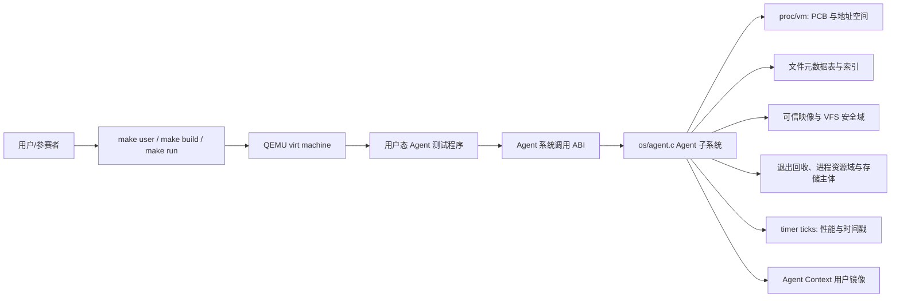
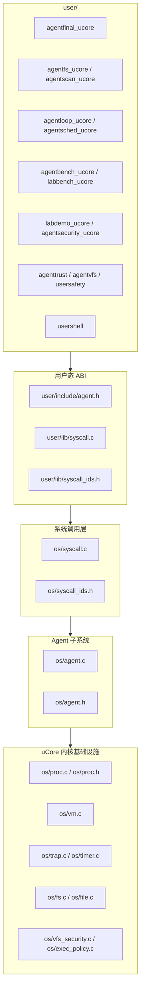
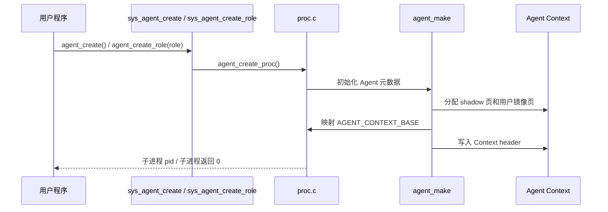
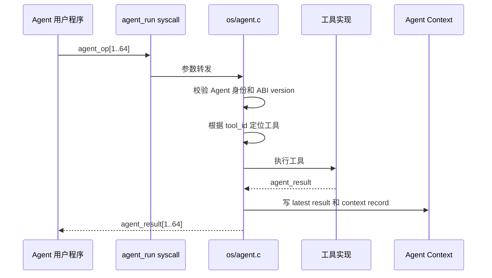
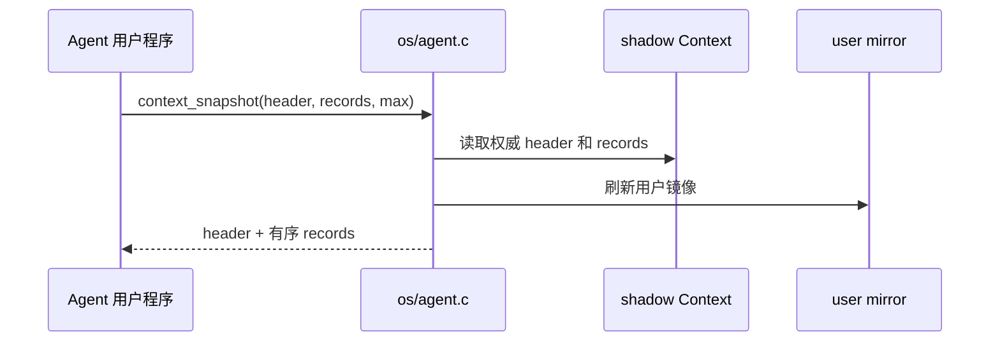
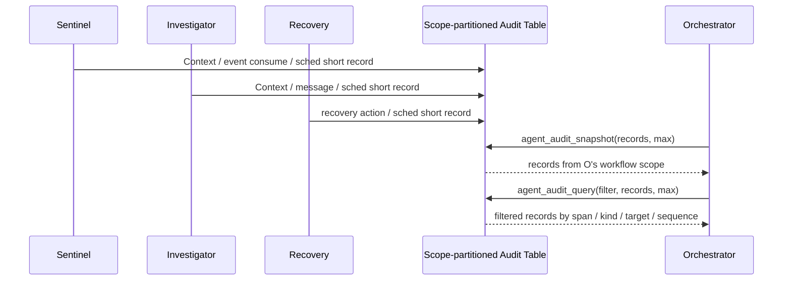
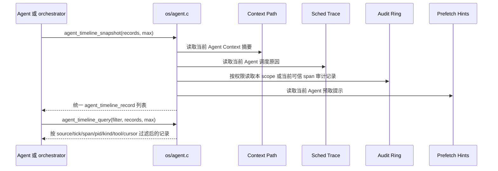
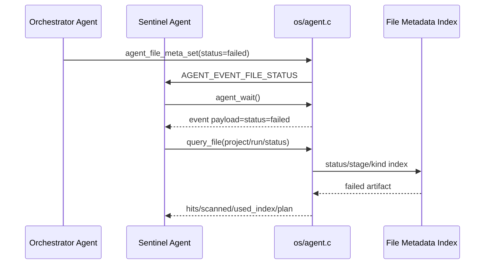
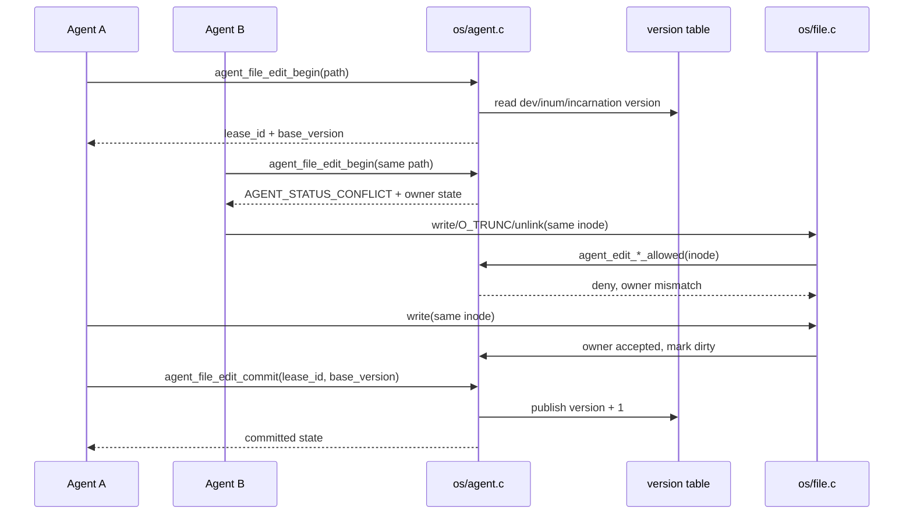
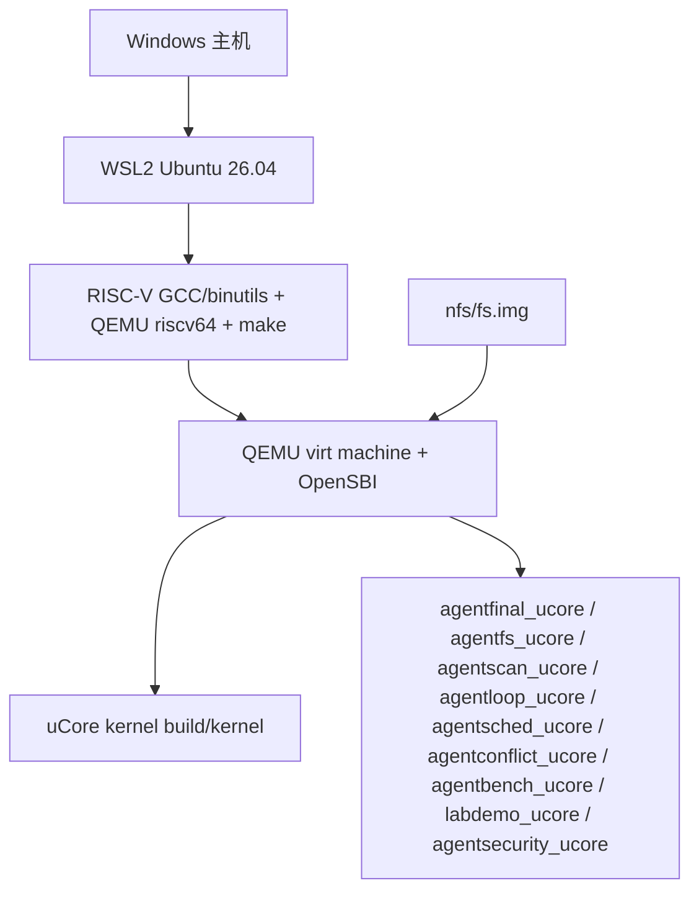

# 主设计文档：AgentOS-uCore

本文是根目录 AgentOS-uCore 目标的主设计文档。文档按“目标、架构、模块、运行路径、接口关系、测试证据、文件索引”的顺序组织，同时保留操作系统项目需要的设计决策和验证依据。

## 1. 引言与目标

### 1.1 系统目标

本项目基于 uCore 教学操作系统，在内核中加入面向 AI Agent / LLM 工作流的通用支持层，使内核能够识别 Agent 进程、提供结构化内核工具调用、维护 Agent 多轮调用上下文路径，并支持文件对象语义查询、事件驱动 Agent Loop、调度提示、timeline、audit ledger、provenance、文件编辑租约和 LLM Relay 所需的事件/Context 记录能力。

AgentOS-uCore 把 Agent 进程、工具调用、Context、文件对象、事件、权限和可观测状态做成可复用机制。科研 Agent 平台是主要示例负载，用来呈现这些机制如何支撑真实多 Agent 工作流。

### 1.2 使用者和关注点

| 使用者 | 关注点 |
| --- | --- |
| 项目用户 | 是否能在 QEMU 中稳定运行；赛题基础任务是否有对应实现；设计、创新点和验证证据是否清晰 |
| 开发者 | Agent 子系统是否模块化；系统调用 ABI 是否稳定；任务四、五、六能否继续复用同一组机制 |
| 用户态 Agent 程序 | 是否能用结构化接口请求内核工具；是否能高速读取 Context 镜像；是否能在需要可信历史时使用 snapshot |
| 操作系统内核 | 是否保持普通进程兼容性；是否控制地址空间、锁、生命周期和错误路径 |
| 结果材料 | 是否能把底层 syscall 串成一个用户容易理解的多 Agent 场景，同时不把示例策略混入内核机制 |

### 1.3 质量目标

| 优先级 | 质量目标 | 可验证方式 |
| ---: | --- | --- |
| 1 | 稳定性 | `agentfinal_ucore`、`agentbench_ucore`、`labdemo_ucore`、`agentsecurity_ucore` 均通过且无 kernel panic |
| 2 | 可检查性 | 每个赛题要求能追踪到实现、测试和文档 |
| 3 | 模块化 | Agent 逻辑集中在 `os/agent.c`，系统调用层只做分发和参数传递 |
| 4 | 性能 | 批量工具调用、用户态直接读 Context、批量 Context Snapshot、文件索引查询 |
| 5 | 可扩展性 | 文件对象字段、`agentos:event`、Context Path、Loop 状态、工具表、cause/span 因果链、统一 timeline、Run Ledger 摘要和 LLM Relay 事件可继续扩展到科研 Agent、代码 Agent、运维 Agent、写作 Agent 等不同负载 |

## 2. 约束

| 类型 | 约束 |
| --- | --- |
| 基底系统 | uCore 教学操作系统，RISC-V 64 |
| 运行环境 | QEMU virt machine，OpenSBI 默认启动 |
| 开发环境 | 已验证 WSL2 Ubuntu 26.04；通用要求为 Linux、RISC-V GCC/binutils、QEMU riscv64、make、git |
| 编译工具链 | 已验证 `riscv64-linux-gnu-`；Makefile 可接受 `riscv64-unknown-elf-` |
| 兼容性 | Agent 交付以 `CHAPTER=agent` 为验收主路径；补充验证 `trace` 和普通进程 mail 等代表性基础 syscall；Agent syscall 使用 500 起的扩展编号 |
| 当前范围 | 任务一至五增强实现；任务六提供可运行综合示例 |
| 当前范围说明 | 文件扫描覆盖 uCore 根目录短文件名；云端模型访问由用户态或宿主机 Relay 完成；页面和图表由宿主机工具生成 |

## 3. 上下文与范围

### 3.1 系统上下文

上图采用用户态/内核态分层方式呈现系统位置。用户态科研 Agent 平台、测试程序和宿主机工具通过 syscall ABI 使用 Agent 内核能力；内核中的 Agent 子系统管理 Agent 进程、Context Path、工具执行、文件对象服务、事件循环、调度提示和审计记录；uCore VFS 的真实文件修改路径会调用 Agent 文件编辑租约检查，避免两个 Agent 无序覆盖同一文件。

下面的 Mermaid 图保留为可编辑的关系摘要，便于在文本复现实验环境中快速查看依赖关系。

### 3.2 当前范围

| 范围 | 状态 |
| --- | --- |
| Agent 进程创建、标记和信息查询 | 已实现 |
| Agent Context 固定用户虚拟地址区 | 已实现，当前为 6 页用户镜像区，尾部包含用户自管 cache |
| 结构化工具调用和工具列表 | 已实现，最终热路径为 `agent_run` 批量 ABI |
| 工具调用自动写入 Context Path | 已实现 |
| Context Path 手动追加/query/rollback/clear/snapshot | 已实现；公开 cause/span 由内核私有 source control/span owner 认证，手动 push 不得自报非零 cause/span |
| 文件元数据表、真实 inode 关联、属性查询、索引查询、metadata 双 bank 持久化、根目录自动扫描 | 已实现；所有对象记录按 kernel-issued workflow scope 分区，读写由可睡眠事务门串行化 |
| Agent Loop 心跳、等待、唤醒和 Agent 感知调度 | 已实现 16 槽事件队列、同 scope stable-control IPC 路由、watch/unwatch、wait cancel、heartbeat、自适应调度、当前可信 span 短记录、scope-local audit/Run Ledger 和统一 timeline |
| 安全与资源韧性 | 已实现动态 workflow scope（public=0、system=1、workflow>=3，最多 4 个，2 保留为稳定 PUBLIC 存储 principal）、capability + exact scope/owner、可信映像、W^X、VFS 隔离、对象私有等待、协作退出、活进程资源域配额、持久存储主体配额、分级保留量和 scope retirement 回收 |
| 代表性 uCore 基础 syscall | 已实现 `trace`、`mailread`、`mailwrite` |
| 综合场景 | 已实现 `labdemo_ucore` 综合示例 |
| LLM 友好路径 | 已实现 `llm_request`、`llm_response`、`AGENT_EVENT_LLM_DONE`、Context 记录和事件唤醒；真实云端 relay 保持在用户态或宿主机桥接层 |
| 页面和图表 | 由宿主机工具读取结构化事件、状态文件和 CSV 生成 |

## 4. 解决方案策略

| 策略 | 说明 |
| --- | --- |
| Agent 子系统模块化 | 把 Agent 逻辑集中在 `os/agent.c` 和 `os/agent.h`，避免分散在基础系统调用文件中 |
| 高性能 ABI | 最终热路径使用 `agent_op` / `agent_result` 和 `agent_run()`，一次 syscall 最多执行 64 个 op |
| shadow 权威 Context | Agent Context 扩为 6 页，内核保存 shadow 权威页和用户镜像页，写入时先更新 shadow 再同步镜像 |
| 用户态可读 Context | latest result 和历史路径同步到用户镜像，Agent 可直接读取，避免每次都系统调用查询；可信历史通过 shadow 和 snapshot 保证；Context 尾部保留用户自管 cache |
| 环形 Context Path | 固定容量 128 条短文本摘要记录，超长 FIFO 覆盖，记录 `oldest/latest/dropped/rollback` 元信息，并维护 prev/record hash 完整性链 |
| 内核维护因果链 | Context record 和事件公开 `cause_sequence` / `span_id`，PCB sidecar 保存可信 source pid/control 与 span owner；`context_push` 的非零 cause/span 被拒绝，事件消费只继承同 scope 的内核认证链路 |
| 批量 Snapshot | `context_snapshot()` 一次返回 header 和按时间顺序排列的可见路径 |
| 文件对象查询引擎 | 物理 metadata 表按 SYSTEM 64 条和 4 个 workflow 各 112 条预留；主键先匹配 scope，再匹配 `dev + inum + incarnation`，依赖记录每 scope 16 条，查询/缓存/预取同样按 scope 裁剪 |
| 文件编辑租约 | 租约表为 4 个 scope 各保留 8 条，内核用 `scope + dev + inum + incarnation` 识别对象，在真实 VFS 修改路径上拒绝跨 scope 或非持有者操作 |
| Agent Loop | 每个 Agent 有 16 槽 FIFO 和最多 8 条 watch；事件三层资源限制不变；跨 Agent `MESSAGE` / `LLM_DONE` 必须同时命中 stable route 与相同 active workflow scope，target consent 不能越过 scope |
| Agent 感知调度 | 调度器按角色权重、orchestrator 配置的 priority/budget、事件队列、等待 deadline、heartbeat 到期、等待时长和虚拟运行量选择可运行任务，并记录最近 16 次调度原因；连续 Agent 或分值选择最多 8 次，之后强制回到普通任务或 FIFO 队首 |
| scope 审计视图 | 物理 512 槽按 4 个 workflow 各保证 128；每 scope low/high 各64，low principal 上限16、high active principal 上限8。high 只自滚或回收 inactive principal，遥测不能淘汰其他 active principal 的特权证据 |
| 内核角色与能力绑定 | `struct proc` 保存真实 role/capability/scope/control；敏感操作必须同时满足 capability、active scope 和精确对象 owner，不信任用户 role、PID 或公开 span |
| 可信执行与 VFS 安全域 | 构建清单把角色、bootstrap、RX/RW+NX 和 VFS profile 写入不可变 SYSTEM inode；loader 将有效能力绑定到动态 workflow scope，普通文件操作逐次校验 inode scope |
| 生命周期与进程配额 | 对象私有等待队列和协作退出不变；128 进程槽分为普通 96、受控保留 32，4 个 workflow 各保证 8 个保留槽；scope 从 active 进入 retiring 后统一清理全局表再释放 admission |
| 存储配额与保留量 | mkfs 与内核共享容量策略；按完成镜像空闲量计算后把 version/slots/PUBLIC principal/G/S/checksum 持久化到 superblock，挂载从 qmap/dinode 重建 PUBLIC 用量，workflow owner 只恢复 scope ID 下界，SYSTEM credit 由空闲量与 G/S 推导；每 scope 硬下限 320 inode/512 block，SYSTEM 硬下限 8 inode/512 block；当前平台镜像每 scope 为 342/1195，SYSTEM 为 64/512 |
| 可恢复资源耗尽 | inode、inode cache、数据块和文件表分配失败返回错误并回滚；块、间接索引和 inode 释放按持久 owner 退款；每线程内核栈使用 guard、canary 和构建期调用图预算 |
| 通用动作和工件更新 | `action_commit` 与 `artifact_update` 作为核心对象状态更新工具，`rerun_stage` 和 `write_report` 只作为旧示例兼容别名；记录、事件 action 和重复请求判断都归入通用类别 |
| LLM Relay 支持 | 内核提供 `llm_request`、`llm_response`、`LLM_RELAY` capability 和 `AGENT_EVENT_LLM_DONE`；prompt/response 摘要进入 Context、timeline 和审计记录；云端 API、secret、HTTP/TLS 留在用户态 |
| 结构化事件 | `labdemo_ucore` 输出 `agentos:event type=... key=value`，为页面工具和 LLM Relay 保留解析契约 |
| 测试驱动验收 | 功能测试之外，以 `agentscope_ucore`、`agentsecurity_ucore`、`agenttrust_ucore`、`agentvfs_ucore`、`usersafety_ucore`、`fsenospc_ucore`、`procreap_ucore` 和栈预算脚本验证 scope、授权、输入、资源耗尽及生命周期机制；当前 Agent 专项 15/15 已通过，聚合入口状态仍单独记录 |

## 5. 构件视图

### 5.1 一级模块

### 5.2 源码映射

| 构件 | 文件 | 职责 |
| --- | --- | --- |
| 用户态 ABI 声明 | `user/include/agent.h` | 暴露 Agent 结构体、常量和 syscall 原型 |
| syscall wrapper | `user/lib/syscall.c` | 封装 `agent_create`、`agent_run`、`context_snapshot` 等用户态调用 |
| syscall 编号 | `user/lib/syscall_ids.h`、`os/syscall_ids.h` | 注册 500 起的 Agent syscall 编号 |
| syscall 分发 | `os/syscall.c` | 根据 syscall id 调用 Agent 内核函数 |
| Agent ABI 与常量 | `os/agent.h` | 定义结构体、工具 ID、状态码、Context 布局 |
| Agent 核心逻辑 | `os/agent.c` | Agent 初始化、工具执行、Context Path、文件元数据、自动扫描、文件编辑租约、可信 IPC 路由、事件队列资源隔离、事件等待和调度分值计算 |
| PCB 和生命周期 | `os/proc.h`、`os/proc.c` | 保存 Agent 元数据、stable control id、入站 IPC 路由和每槽来源核算，处理 create/exit、Context 释放和 Agent 感知取队 |
| 可信执行与文件授权 | `os/exec_policy.c`、`os/vfs_security.c`、`os/loader.c` | 校验可信映像、W^X 布局、角色上限、bootstrap grant、文件安全域和有效能力 |
| 时钟事件 | `os/trap.c`、`os/timer.c` | 定时调用 `agent_tick()`，支持 heartbeat 和 timeout |
| 文件写入入口 | `os/file.c` | 在真实 `write`、`O_TRUNC`、`unlink` 路径调用 Agent 文件编辑租约检查 |
| 最终功能验收 | `user/src/agentfinal_ucore.c` | Agent 创建、6 页 Context、批量工具调用、短文本历史、`context_detail()`、完整性链、运行轨迹、统一 timeline、timeline wait、Run Ledger、provenance graph、用户自管 cache、名称协议、snapshot、FIFO、事件 |
| 文件系统测试 | `user/src/agentfs_ucore.c` | 真实文件 inode 绑定、字段清空、删除清理、metadata 双 bank 重新加载、scan/index 差异和一致性、query plan、truncated 标志、不存在 selector |
| 自动扫描测试 | `user/src/agentscan_ucore.c` | 根目录自动扫描、真实文件自动建元数据、索引查询和删除清理 |
| Agent Loop 测试 | `user/src/agentloop_ucore.c` | FIFO 顺序、每来源外部事件上限、内核 origin 保留槽、多 watch、unwatch、有限 timeout 睡眠、wait cancel、TIMER unwatch、heartbeat wake/stop |
| Agent 调度测试 | `user/src/agentsched_ucore.c` | 角色权重、受权调度配置、事件优先、调度原因记录、调度次数、让出处理器次数和虚拟运行量公平性计数 |
| 文件编辑冲突测试 | `user/src/agentconflict_ucore.c` | 两个 Agent 同时编辑同一文件、非持有者真实写入拒绝、旧版本提交拒绝 |
| 性能基准 | `user/src/agentbench_ucore.c`、`user/src/labbench_ucore.c` | scalar run、batch run、direct Context、query/snapshot、timeline、timeline wait-ready、provenance、文件查询候选记录数、timeout/heartbeat、busy polling、wait/wake 计时 |
| 综合示例 | `user/src/labdemo_ucore.c` | 同 workflow 三 Agent 故障诊断、scope audit、可信 span、timeline 和 provenance |
| 权限限制测试 | `user/src/agentsecurity_ucore.c` | 普通/低权限调用拒绝、可信 cause/span、audit authority 分区、role 与 route 边界 |
| workflow scope 测试 | `user/src/agentscope_ucore.c` | 新 scope factory、同名对象隔离、同 scope 协作、并发 metadata 提交、跨 scope IPC/租约/audit 拒绝、配额保证、一次性 pipe fd 委派和 retirement 回收 |
| 可信执行测试 | `user/src/agenttrust_ucore.c` | RX/RW+NX 布局、映像不可变、bootstrap 授权范围和角色映像绑定 |
| VFS 安全域测试 | `user/src/agentvfs_ucore.c` | public/workflow 隔离、worker 能力衰减、继承 fd 重新鉴权和受保护路径 |
| 系统稳健性测试 | `user/src/usersafety_ucore.c`、`user/src/fsenospc_ucore.c`、`user/src/fsquota_ucore.c`、`user/src/fspquota_ucore.c`、`user/src/procreap_ucore.c` | 用户地址、对象私有等待、真实 ENOSPC、持久 PUBLIC principal、存储配额与系统保留量、退出回收和进程域配额 |
| 构建脚本 | `scripts/run-agent-tests.sh` | 顺序运行最终验证程序 |

## 6. 运行视图

运行时材料按“内核事实 -> 统一记录 -> 用户态消费 -> 宿主机呈现”组织。测试程序和科研平台不会只贴一段无结构日志，而是输出可被文档和 Web UI 直接读取的 `key=value` 记录：例如 `tool=query_file`、`used_index=1`、`prefetch_handoff=analyze`、`stale_commit=1`。这使同一条运行事实可以同时出现在 QEMU 输出、测试记录、验证表和结果页面中。

### 6.1 Agent 创建

普通角色创建和安全域创建是两种不同操作。可信、非 Agent bootstrap factory 使用 syscall 541 `agent_workflow_create(role)` 创建全新的动态 scope；scope 内 orchestrator 再用 `agent_create_role()` 或 `agent_worker_create()` 填充该 workflow，但不能再铸造新的 quota/object namespace。scope 编码为 PUBLIC=0、SYSTEM=1、动态 workflow>=3，同时最多 4 个 active/retiring scope；数值 2 保留给稳定 PUBLIC 存储 principal，不作为 VFS scope 分配。

跨 scope spawn 默认只保留 stdio。factory 可以先对选中的 pipe 端点调用 syscall 542 `agent_scope_delegate_fd(fd)`；票据在下一次边界尝试开始时一次性消费，即使后续分配失败也不会残留。普通文件和未委派 pipe 不跨边界。同 scope 创建维持正常协作继承。

最后一个成员退出后，scope 先进入 retiring。内核停止该 scope 新分配，按 scope 回收 metadata、dependency、action、lease/version、cache、audit、prefetch 和 IPC 状态；完成后才释放 admission。普通 scope 文件随之清理，boot scope 的持久工件保留为 inactive storage owner，不会被新 scope 接管。

### 6.2 结构化工具调用

### 6.3 Context Snapshot

### 6.4 运行轨迹查询

`agent_trace_snapshot()` 不替代 `context_snapshot()` 或 `agent_sched_snapshot()`。它只把两类已有权威数据整理成同一个短视图，方便 Agent 和示例程序说明“哪个工具调用发生在前、调度器随后为何运行该 Agent、事件等待何时被消费”。

### 6.5 Workflow scope 审计视图

`agent_audit_snapshot()` 面向综合示例和 scope 内系统级观测。共享物理表为 512 槽，但最多 4 个 admitted workflow 各保留 128 条；每个 scope 的窗口再分为 general/low 64 与 protected/high 64。low 每 stable principal 最多 16 条；high 依据每 scope 8 个保留进程份额给每 active principal 8 条。Context、事件、调度、预取和用户手动记录始终是 low；只有工具或 syscall 成功后由内核确认的特权状态效果是 high。high 满时只滚动当前 principal 或回收 inactive principal，绝不淘汰另一 active principal 的 protected evidence；被回收的 inactive 历史由 dropped 计数说明。

每个 scope 独立维护 `prev_hash/record_hash/ledger_hash` 逻辑链，而 `sequence` 在整个系统单调递增。跨 scope 写入会产生 sequence 跳号，low/high/per-principal 独立滚动会让可见窗口缺少某些前驱；`dropped_records=total_records-visible_records` 用于解释这些窗口外记录。只有当前后两条可见记录实际连续时才要求 `prev_hash` 直接等于上一条可见记录的 hash，不能把合法稀疏窗口误报为破坏。

`agent_audit_query()` 先按调用者 scope 裁剪，再应用 span、kind、pid/source/target、role、tool、event、status 和 sequence filter。`agent_span_trace_snapshot()` 进一步同时匹配 scope、公开 `current_span_id` 与内核私有 span owner，不接受用户态任意 span id。`labdemo_ucore` 展示同一 workflow 的综合观测；`agentscope_ucore` 和 `agentsecurity_ucore` 已在 2026-07-22 完整 Agent QEMU 回归中通过跨 scope 与伪造 span/cause 的负向断言。

### 6.6 统一 timeline 导出

`agent_timeline_snapshot()` 是给结果页面和科研平台运行详情准备的统一导出层。它不新增一套新的权威历史，而是把已有 Context、调度、审计和预取提示规范化成 `agent_timeline_record`：`source` 标明原始来源，`kind` 保留原来源内部类型，pid、span、cause、tool、event、status、value 和短文本摘要使用统一字段。Context 审计记录会保留工具结果的 `value0/value1/value2`，因此 `read_file_digest` 产生的 size、bytes 和 hash 可以进入同一条时间线记录。普通 Agent 只能看到自身 Context、调度、预取提示以及同 scope 当前可信 span 的系统短记录；orchestrator 能额外看到本 workflow scope 的审计记录。这样状态页面不必分别解析四套 ABI，也不必把串口日志当作主要证据来源。

`agent_timeline_query()` 是同一导出层上的内核侧过滤接口。它先按角色和 capability 得到当前 Agent 已可见的记录集合，再按 source mask、起始 tick、span、kind、pid/source/target、role、tool、event、status、flags 和 after-cursor 过滤。after-cursor 由上一条已读记录的 `tick/source/sequence` 组成，比较顺序与导出顺序一致，因此同一个 tick 中的多条 Context、调度、审计和预取提示记录不会被重复读取，也不会被跳过。它的设计目的不是新增权限，而是减少状态页面反复全量拉取、再在用户态筛选无关记录的成本。`agentfinal_ucore` 用 source mask、start tick 和 after-cursor 检查过滤结果，`labdemo_ucore` 用 source/kind/source_pid/target_pid/flags 精确拉取 sentinel 到 investigator 的 prefetch handoff 记录，用 `tool_id=AGENT_TOOL_READ_FILE_DIGEST` 精确拉取内容摘要证据，并用 after-cursor 验证多 Agent 场景可以增量读取。

`agent_timeline_wait()` 是 timeline query 的事件驱动补充，`agent_timeline_read()` 是 wait+query 的合并热路径。内核维护一个轻量 observe epoch，并在每个等待中的 Agent PCB 里保存本次等待的 `agent_timeline_filter`。Context、调度、审计和预取提示写入时递增 epoch，并把本次写入转换成统一 `agent_timeline_record`，随后直接用等待者保存的完整 filter 判断是否需要唤醒；source、event、status、tool、span、pid 和 flags 都会参与判断。调用者传入同一套 filter：如果当前已经有匹配记录，立即返回匹配数量；如果没有匹配记录，Agent 进入睡眠，直到新运行事实写入或 timeout 到期。该接口让最终 Web UI 或 Agent worker 可以“等到有新事实再读”，而不是循环调用 query。`agentfinal_ucore` 覆盖 timeout、source 不匹配不唤醒、event 不匹配不唤醒、heartbeat TIMER audit 唤醒和 wait-and-read 复制路径，`agentbench_ucore` 记录 ready fast path。

`agent_provenance_snapshot()` 是同一观测体系下的因果图接口。timeline 按时间回答“发生了什么”，provenance edge 按 `source_type/source_sequence -> target_type/target_sequence` 回答“哪条 Context、审计或预取记录触发了后续记录”。它导出当前 Agent 自己的 Context 因果边和本地预取边；审计边沿用 scope/span owner 可见规则，orchestrator 可以看到本 workflow，多数参与 Agent 只能看到当前可信 span。跨 Agent source sequence 通过内核私有 cause pid/control sidecar 解释，不会误连到目标进程恰好相同的本地 sequence。

### 6.7 文件查询和 Agent Loop

跨 Agent 消息路径不会直接把 PID 解释为授权。orchestrator 在协作开始前调用 `agent_route_config()`，把 source 的 stable control id 写入 target 的入站路由表并限定 `MESSAGE` 或 `LLM_DONE` 类型；target 也可以显式接受一个来源。投递时内核在同一临界区内重新解析 PID、核对 control id 和路由，再执行 watch 匹配与队列资源核算。自投递隐式允许。source 退出后其路由会从所有目标回收，target 退出后清空自己的表，PID 或 PCB 槽复用不会继承旧授权。

事件队列在保持 16 槽 FIFO 顺序的同时用每槽 accounting flags 编码 origin/resource class，并进行三层核算。带 Agent 来源的外部事件合计最多占 12 槽；directed IPC（`MESSAGE` / `LLM_DONE`）和 attributed notification（如 `FILE_STATUS` / `JOB_DONE` / `POLICY_DENIED`）各自最多占 8 槽；同一个 stable source 跨两类合计最多占 4 槽。external admission 无法占用为 `KERNEL` origin 保留的至少 4 个容量名额，因此低权限发送方和带来源的通知广播都不能挤掉 heartbeat TIMER 等关键内核事件。attributed 广播逐目标独立尝试；一个慢 watcher 的队列已满不会阻止后续 watcher 收到事件，也不会把已经提交的文件 metadata 更新改报为失败。

### 6.8 文件编辑冲突处理

文件编辑租约的资源身份是真实 `dev + inum + incarnation`。用户态传入的短文件名只用于找到 inode 和输出可读状态，不能伪造另一个资源身份；inode 槽复用后 incarnation 改变，旧 metadata、缓存和租约不会命中新文件。编辑版本和内容版本合并在按磁盘 `inum` 直接索引的 sidecar 中，每个存活 inode 只能使用自己的槽；租约表保存当前持有者、租约编号、基准版本、deadline、dirty 标志和冲突次数。最终 inode 回收会在身份字段清除前统一移除 sidecar、租约和 digest cache，因此短命 PUBLIC 文件不能永久占用版本状态，版本容量也自然服从稳定存储 principal 的 inode 配额和系统保留量。真实文件修改入口在 `os/file.c`，因此即使另一个 Agent 绕过 `agent_file_edit_begin()` 直接 `open` 后 `write`，只要目标文件存在租约，内核仍会拒绝非持有者写入。

该机制采用无等待的独占租约：已有持有者时新申请立即返回 `AGENT_STATUS_CONFLICT`，调用者可以读取 owner pid、owner role、base/current version 和 conflict count，然后选择等待事件、重新读取文件、转交 orchestrator 或走恢复流程。租约有有限 TTL；持有者异常退出或长时间不提交时，下一次相关操作会释放过期租约。如果租约持有者写过文件，释放时也会推进版本，避免后续调用者仍基于旧版本继续提交。

提交使用版本检查：`expected_version` 必须等于 `agent_file_edit_begin()` 返回的 `base_version`，且版本表当前值也必须仍等于该基准版本。否则返回 `AGENT_STATUS_STALE`，租约仍保持 active，调用者需要放弃、重新读取或重新生成结果。该机制阻止无序覆盖，但不做内容自动合并；内容合并仍应由上层 Agent 工作流或恢复 Agent 决策。

## 7. 部署视图

## 8. 横切概念

### 8.1 ABI 版本和布局检查

`AGENT_CALL_VERSION` 和 `AGENT_CONTEXT_VERSION` 用于区分用户态请求协议和 Context 布局。当前 `AGENT_CONTEXT_VERSION = 6`。Context header、latest result 和 128 条 `agent_context_record` 放入 6 页 Agent Context，其中 record 区从第 1 页开始，尾部通过 header 暴露 `user_cache_offset` 和 `user_cache_size`。当前测试输出中，用户自管 cache 起点为 21504，大小为 3072。

### 8.2 地址空间隔离

只有 Agent 进程会安装 Agent Context 特殊映射和对应 metadata。普通进程调用 Agent-only syscall 时返回错误。Agent Context 固定在 trapframe 下方，用户态 ABI 中定义为 `AGENT_CONTEXT_BASE`。该地址对每个 Agent 是相同虚拟地址，但映射到不同的物理页。镜像构建器从配套 ELF 提取页对齐的 `exec_rw_offset`，loader 重新校验后将代码映射为 RX，将数据、bss、用户栈和 Agent Context 映射为 RW+NX；布局缺失或要求 W+X 的可信映像拒绝装载。

### 8.3 shadow 权威历史

Agent Context 分为两份：

- `agent_shadow_kva[6]`：内核私有权威页，用户态不能直接访问；
- `agent_ctx_kva[6]`：用户态镜像页，用于直接读取最新结果和历史摘要。

用户态写坏镜像页不会改变 `context_query()`、`context_snapshot()` 或 `context_detail()` 返回的权威历史。`context_snapshot()` 会把 shadow 内容刷新到用户镜像页，但不会覆盖 Context 尾部的用户自管 cache。短摘要 record 之外的完整 `agent_op + agent_result + flags` 保存在内核 PCB 的最近 128 条 detail ring 中，由 `context_detail()` 查询。

### 8.4 因果链和 span

Context v6 为每条 `agent_context_record` 和每个 `agent_event` 增加 `cause_sequence` 与 `span_id`，并为 Context Path 增加完整性链：

| 字段 | 说明 |
| --- | --- |
| `cause_sequence` | 当前动作指向的前序 Context sequence；0 表示根节点 |
| `span_id` | 当前链路 ID，同一 Agent 决策链或跨 Agent 消息链共享该值 |
| `prev_hash` | 本条记录追加前的链尾 hash |
| `record_hash` | 由 prev_hash、本条记录核心字段和短文本摘要计算得到的记录 hash |

内核自动工具记录会使用当前 Agent 的 cause/span；写入成功后，当前 cause 更新为新 record 的 sequence。公开字段之外，PCB sidecar 保存 cause 的真实 source pid/control id 和 span owner。`context_push()` 只允许用户提交 cause=0、span=0 的本地手动内容，内核再把它接到当前可信链；非零自报值直接拒绝。工具触发的消息、文件状态事件或策略拒绝事件只有在对象/路由 scope 检查通过后才携带内核认证的 sequence/span/owner。目标 Agent 在 `agent_wait()` 成功消费同 scope 事件后继承这组身份，后续工具调用继续该链路。

这个设计让示例中的 “sentinel 发现失败 -> investigator 查询原因 -> recovery 恢复” 不只是几段串口输出，而是能在内核 Context 与事件结构里保留可追踪的前后关系。单个 Context Path 的完整性链记录相邻记录顺序：第一条记录 `prev_hash=0`，后续记录的 `prev_hash` 必须等于上一条可见 Context 记录的 `record_hash`，header 中的 `latest_record_hash` 等于最新记录 hash。跨 Agent cause sequence 不是全局唯一整数，必须由内核私有 source 身份解释；用户态 source pid/span 仅用于显示，不是可信绑定，也不是磁盘持久化审计日志。

### 8.5 错误语义

Agent-only syscall 对普通进程、非法参数、未知工具、历史节点不存在、空间不足、等待超时、权限拒绝和重复幂等动作返回明确状态码。错误码详见 [api.md](api.md)。

### 8.6 并发和事件

Agent Loop 使用进程字段保存 8 条 watch、16 槽 FIFO 事件队列、最多 16 条入站 IPC 路由、每个事件槽的私有来源 control id、一次性 wait cancel 令牌、等待次数、超时次数和心跳信息。`agent_wait()` 优先处理取消令牌，再消费队列中的事件；没有事件时，有限 timeout 和无限等待都进入对象私有等待队列，由事件入队、deadline 到期、heartbeat 到期或定向取消唤醒。

公共 `agent_wake()` 只能投递 `AGENT_EVENT_MESSAGE`，文件、定时器和 LLM 完成事件只能由对应内核或专用工具路径产生。跨 Agent 的 `agent_wake`、`send_message`、非零 target `llm_request` 和 `llm_response` 统一要求 source/target 位于同一 active workflow scope，再使用 stable control id 路由鉴权；target consent、共同 controller、相同角色或相同 capability 都不能跨 scope。PID 解析、scope/存活/路由检查和入队在同一临界区完成，兼容 mailbox 与预取交接只在入队成功后更新。directed IPC 达到 8 条、外部可归因事件合计达到 12 条，或同一 stable source 跨 directed/attributed 两类达到 4 条时即拒绝；显式内核 origin 可以越过 external 边界使用预留容量。广播只扫描本 scope watcher，且不会因单个订阅者失败而停止后续投递。

取消是独立控制操作：`WAIT_CANCEL` capability 决定主体能否发起，同一 active scope、内核 control id 和直接 controller 绑定共同决定主体能控制哪个对象；消息路由不授予取消权，取消权也不自动建立消息路由。`agent_sched_config()` 同样只允许 orchestrator 调整本 scope 受控 Agent。调度参数都是软策略，连续选择 Agent 或连续按分值选择达到 `AGENT_SCHED_MAX_AGENT_BURST = 8` 后，只要对应普通/FIFO 候选存在，调度器就强制选择该候选。调度器的采样记录写入当前 workflow 的 low 审计分区，不会占用 protected/high 状态效果证据。

### 8.7 角色与能力

Agent 的真实角色保存在 `agent_role`，业务能力在 `agent_capability_mask`，创建授权在 `agent_role_grant_mask`，对象边界在内核签发的 `vfs_scope_id` 和 stable owner/control 字段中。有效授权是 capability 与 active scope/精确 owner 的交集，不存在“拥有同一个 capability 就能访问所有 workflow 对象”的语义。内核 loader 为可信 init 建立 bootstrap factory/grant；普通 `fork` 不复制 grant 或 workflow 权限，普通 exec 撤销残留 grant。`agent_workflow_create()` 只允许可信非 Agent factory 建新 scope，scope 内 `agent_create_role()` 只委派本域角色。

敏感授权不读取用户态传入的 role、scope、PID、span 或 cause。`action_commit`、`artifact_update`、dependency/metadata、edit lease、LLM/IPC、audit 和预取首先要求真实 capability，再按当前 scope 及对象 owner 查询。`agent_wake()` 只允许 MESSAGE；即使事件类型和 route 合法，也必须 source/target 同 scope。`agent_wait_cancel()` 要求独立 capability、同 scope 和直接控制关系。因此伪造 role、知道另一 workflow 的 PID/文件名/租约号，或提交相同公开 span 都不能跨域取得权限。

`labdemo_ucore` 中可信 init 只启动 orchestrator Agent；文件元数据初始化、失败注入、对象依赖注册和子 Agent 创建都由 orchestrator 发起。`agentsecurity_ucore` 专门覆盖普通进程直接调用敏感接口失败、普通 `fork/exec` 子进程不能继承 role grant、低权限 Agent 不能继续委派、bootstrap grant 在普通 exec 后撤销、初始化前索引查询、legacy tool mismatch、sentinel 伪造 recovery 被拒绝，以及多 run 定向动作更新。

### 8.8 安全约束与资源韧性

通用内核路径在两个目标中共享 syscall 用户输入复制、对象私有等待队列、可恢复 ENOSPC、块 owner map、安装级 PUBLIC 存储 principal 与系统保留水位、guarded kernel stack、孤儿回收、协作退出、child record 和进程资源域配额。PUBLIC principal 固定为 2，并在挂载时从 qmap/dinode 重建用量，不随短命进程资源域退出或重启变化。已退出子进程的执行槽可以在父进程领取状态前释放；长存活后代始终计入不可变资源域，单普通域上限 64，128 个进程槽中普通 admission 最多 96，内核受控 admission 使用 32 个保留槽。AgentOS 再把保留槽按最多 4 个 workflow 各分 8 个，避免一个活跃 workflow 吞掉其他 workflow 的启动保证。

AgentOS 专属路径在此基础上增加可信映像、role grant、capability 和动态 VFS scope。PUBLIC=0、SYSTEM=1、workflow>=3，数值 2 只保留为 PUBLIC 存储 principal；不同 workflow 的文件数据命名空间彼此隔离，`open/read/write/truncate/unlink` 均按 inode scope、真实身份和当前有效能力检查，继承 fd 也会逐操作重新鉴权。跨 scope 创建默认只保留 stdio，一次性 pipe 委派是唯一显式对象传递。文件身份使用 `scope + dev + inum + incarnation`，防止同名对象、inode 重用或另一个 workflow 的旧 metadata/cache/lease 命中。存储保证由完成镜像的实际空闲量决定，并受每 scope 320 inode/512 block 与 SYSTEM 8 inode/512 block 的显式硬下限约束；当前平台镜像的每 scope 实际值为 342 inode/1195 block。

### 8.9 性能

性能优化集中在四个方面：

1. `agent_run()` 将最多 64 个工具操作合并为一次 syscall。
2. 工具 ID 查找避免热路径字符串扫描。
3. 用户态可直接读取 Context 镜像中的 header 和 latest result。
4. `context_snapshot()` 一次返回多条有序历史，避免逐条 query。

文件查询性能通过扫描路径和索引路径的候选记录数差异体现。索引、generation-aware 查询缓存、dependency 和 digest cache 的 key 均先包含 scope；相同 namespace/run/label 或文件名不会跨 workflow 命中。查询命中后，每 Agent 最多生成 8 条本地提示；共享 32 槽 span prefetch 表按 4 个 scope 各保留 8 条，并同时核对公开 span id 与私有 owner。message handoff 也只在同 scope 的可信 route 成功入队后发生。现有 `agentfs_ucore`、`agentbench_ucore` 和 `labdemo_ucore` 继续验证同 workflow 功能，新 `agentscope_ucore` 负责相同名称和相同业务标识的跨 scope 负向边界。

## 9. 架构决策

| 决策 | 选择 | 理由 | 取舍 |
| --- | --- | --- | --- |
| Agent 创建方式 | 使用 `agent_create()` 兼容创建 sentinel，使用 `agent_create_role()` 创建指定角色 Agent | 与 uCore 现有进程模型结合直接，且能把 role/capability 绑定到内核 PCB | 暂未支持用户态自定义配额或任意 capability 组合 |
| Workflow scope factory | syscall 541 仅允许可信 bootstrap factory 创建新 scope；scope 内角色创建只继承当前 scope | 把“委派角色”与“铸造新对象/配额域”分开，避免全局 capability | 同时最多 4 个 active/retiring scope |
| 跨 scope fd | 默认只继承 stdio；syscall 542 为下一次边界尝试一次性委派 pipe 端点 | 不让父进程预先打开的文件或 pipe 成为环境权限；失败尝试也消费票据 | 当前只支持 pipe，不提供普通文件跨 scope 传递 |
| 可信程序授权 | 使用构建期 `EXEC_POLICY_ENTRIES`、不可变 inode 元数据和 loader 身份/version 校验 | 新程序必须显式声明 role mask、bootstrap 和 VFS profile，不能靠程序名或 PID 获权 | 信任根是构建镜像，不是密码学签名 |
| W^X 装载 | 配套 ELF 决定 `exec_rw_offset`，代码 RX，数据、bss、栈和 Agent Context RW+NX | 阻止普通写入直接修改可执行代码，并让角色授权绑定到不可变映像 | 当前仍是受控 flat image，不是通用动态 ELF loader |
| VFS 文件域 | PUBLIC=0、SYSTEM=1、动态 workflow>=3；2 保留为 PUBLIC 存储 principal；逐操作同时校验 capability 和精确 inode scope | 普通路径、同名文件和继承 fd 均不能跨 workflow | SYSTEM 仅作为显式只读共享/可信映像来源 |
| 退出与等待 | 对象私有等待队列、逐线程定向取消、child record 与执行槽分离 | 阻塞 syscall 临时引用沿正常路径释放，恶意父进程不能用僵尸占住执行槽 | child record 使用固定容量 |
| 进程资源域 | 普通后代受 64 live 上限；普通总槽 96、受控保留 32，4 个 workflow 各保证 8 | 限制 fork bomb和单 workflow 垄断，同时保持多 workflow admission | live 计数仅覆盖进程槽，退出结果另存 child record |
| 文件系统存储主体 | 稳定 owner、逐块 map 和共享容量策略；mkfs 持久化 PUBLIC principal 与容量契约，挂载重建 PUBLIC 用量并恢复 workflow scope ID 下界，启动与 admission 使用固定 G/S；可变 SYSTEM 赞助文件在首次用户修改前整体转为 PUBLIC；每 scope 下限 320 inode/512 block，SYSTEM 下限 8 inode/512 block | 限制单个稳定主体/scope 的块、inode 及版本状态，并为所有 admitted/future workflow 与 SYSTEM 保留可兑现容量，避免进程域退出清零、覆盖预装块绕过计费或 SYSTEM 信用消耗后重启重复预留 | 平台实际保证随镜像构建结果变化并由 mkfs 输出；变更 FS 配置会强制重编 mkfs；旧磁盘格式拒绝挂载，教学文件系统无 journal |
| Context 地址 | 固定高地址 `AGENT_CONTEXT_BASE`，当前 6 页 | 便于用户态直接定位，并给 Context Path 完整性链和用户自管 cache 留出容量 | 每个 Agent 固定占用 6 页 |
| 工具协议 | 主热路径为 `agent_op` / `agent_result`，名称协议作为正式结构化入口保留 | 比字符串键名协议更紧凑，适合批量执行；名称协议便于示例和兼容赛题描述 | 工具 ID 需要保持稳定 |
| Context Path 容量 | 固定 128 条环形记录，每条包含 16 字节 payload/result 短文本摘要和 prev/record hash，并在内核 PCB 中保存最近 128 条完整请求/响应详情 | 可检查 FIFO 淘汰、相邻记录顺序和可审计详情；Context 尾部留给用户自管 cache | 当前不做跨重启持久化 |
| Context 因果字段 | 公开 cause/span 配合私有 source control/span owner；`context_push` 必须传零，由内核接链 | 让同 workflow 协作可追踪，同时防止用户伪造跨 Agent ancestry | 当前是内存态轻量追踪，不替代持久化审计系统 |
| 运行轨迹接口 | `agent_trace_snapshot()` 合并 Context 摘要和调度原因 | 让 Agent 直接获得“工具调用 + 调度原因”的同一视图，避免只靠用户态日志拼接 | 当前只覆盖当前 Agent 的内存态短记录 |
| 当前 span 短记录接口 | `agent_span_trace_snapshot()` 匹配 scope + span id + private owner | 参与 Agent 可解释本 workflow 链路，公开 span 不能扩大权限 | 不提供任意跨 scope 过滤 |
| Scope 审计接口 | 物理 512 槽按 4 scope 各 128；scope 内 low/high 各64，low principal 16、high principal 8；filter 只缩小可见集 | 遥测不能淘汰 active principal 的 protected evidence，也不能影响其他 workflow | inactive principal 的旧证据仍是由 dropped 可见的有界窗口 |
| Run Ledger 摘要 | `agent_ledger_snapshot()` 返回本 scope 逻辑链尾、稀疏 sequence 窗口和 dropped 分类计数 | 状态页面可区别合法淘汰/跳号与当前链尾破坏 | 当前不是跨重启持久化保证，也不带签名 |
| 统一 timeline 接口 | `agent_timeline_snapshot()` 把 Context、调度、可见审计和预取提示导出为同一结构，`agent_timeline_query()` 在可见集合上做内核侧过滤和 after-cursor 增量读取，`agent_timeline_wait()` 让调用者等待匹配记录出现 | 让 Web UI 和科研平台运行详情直接消费一个规范化记录流，减少无关记录复制和主动轮询 | 不保存完整 raw 请求/响应，长文本仍需专门文件或详情接口 |
| 因果图接口 | `agent_provenance_snapshot()` 把可见 Context、审计和预取提示转换成因果边 | 让 Web UI 可以直接画出跨 Agent 触发关系，减少用户态日志拼接 | 当前是短摘要内存图，不是持久化 provenance 数据库 |
| 工具查找 | ID 直接定位，legacy name 兼容 | 最终性能路径避免字符串扫描 | 工具 ID 需要保持稳定 |
| 批量执行 | `agent_run()` 一次最多 64 个 op | 减少 syscall 次数，提高端到端吞吐 | 单个 op 错误通过 result 表达 |
| 文件查询实现 | scope + `dev + inum + incarnation` 主键、scope-local metadata/index/cache，以及带 generation、slot、精确长度和 payload hash 的 `.agentmeta` / `.agentmeta1` 双 bank 紧凑快照 | 同名、同 fid/run/label 的不同 workflow 对象保持隔离；inactive bank 完整写入并回读后才切换，ENOSPC 保留上一代；持久大小随有效记录数增长并回收目标 bank 尾块 | 当前只扫描 uCore 根目录，不做多级目录递归 |
| 文件内容摘要 | `read_file_digest` 受 `CONTENT_READ` capability 控制，按 selector 读取真实文件短预览、最多 4096 字节内容和 FNV-1a 指纹；绑定 Agent metadata 的真实文件进入 8 槽内容版本感知 digest cache | 让 Agent 在 metadata 命中后取得轻量内容证据，重复读取同一文件证据时复用结果，并自动进入 Context/timeline | 不是全文搜索，不建立内容倒排索引；未绑定 Agent metadata 的普通文件不缓存 |
| 文件编辑冲突处理 | 使用 `scope + dev + inum + incarnation` 租约和版本检查，并接入真实 VFS 修改路径 | 防止同 scope 无序覆盖，也拒绝跨 scope 租约号复用 | 不做内容自动合并 |
| 对象预取提示 | 每 Agent 8 条；物理 span 表 32 条按 4 scope 各8，并核对 private owner | 同 scope 因果链可交接提示，跨 scope 不能借公开 span 查询 | 当前只提示 metadata，提示本身不预读文件内容 |
| LLM 友好路径 | 内核记录 `llm_request`/`llm_response`，使用 `LLM_RELAY` capability 限制结果投递，并用 `AGENT_EVENT_LLM_DONE` 唤醒请求 Agent | 让 LLM 驱动 Agent 的请求、结果、Context、事件和审计进入 OS 管理视野，同时不让内核持有 secret 或访问网络 | 真实云端模型调用由用户态或宿主机 relay 实现 |
| Agent Loop | watch/unwatch/wait/wake/route_config/wait_cancel/heartbeat/sched_snapshot/sched_config 独立 syscall，并让调度器感知 Agent 状态 | 等待事件不放进 batch 热路径；跨 Agent 数据面显式授权；调度原因由内核记录，orchestrator 可受权调整目标 Agent 参数 | 路由当前只覆盖 `MESSAGE` / `LLM_DONE`；调度策略字段为 weight、priority 和 budget |
| 基础 syscall 兼容 | 实现 `SYS_trace=410`、`SYS_mailread=401`、`SYS_mailwrite=402` | 满足代表性 uCore 基础测试和普通进程消息接口 | 不把当前工作扩大成全部 chapter 的完整兼容验收 |
| 示例日志契约 | 输出 `agentos:event type=... key=value`，包含 plan、corr_id、模板 LLM refs 和 report 字段 | 页面工具和 LLM Relay 可以直接解析核心示例程序输出 | 当前图表和页面由宿主机工具生成 |
| 文档结构 | 主设计文档 + API/验证/追踪 + 分任务附录 | 满足架构说明、关键决策、测试和运行说明 | 文档数量增加，需要维护一致性 |

## 10. 质量要求与验证

| 质量要求 | 当前证据 |
| --- | --- |
| Agent 进程可创建并初始化 PCB 字段 | `agentfinal_ucore` |
| Agent Context 可直接读取 | `agentfinal_ucore` |
| 至少 3 个结构化工具可调用 | `agentfinal_ucore` 批量调用 echo，`labdemo_ucore` 调用多种任务四/五工具 |
| Context Path 支持 5 轮以上连续调用 | `agentfinal_ucore` 连续写入 192 个 op |
| Context Path 保留短文本摘要 | `agentfinal_ucore: short_text_history=1` |
| Context Path 记录因果链 | `agentfinal_ucore: causal_context=1` |
| Context Path 保存完整性链 | `agentfinal_ucore: context_integrity=1` |
| Context 和调度原因可合并查询 | `agentfinal_ucore: runtime_trace=1` |
| 当前 span 短记录可由参与 Agent 查询 | `agentfinal_ucore: span_trace=1`、`labdemo_ucore: investigator span_trace ...` |
| 同 workflow 多 Agent 审计可查询 | 既有 `labdemo_ucore: global_audit=1`、`audit_query=1`；名称保留兼容，语义已收缩为调用者 scope |
| Scope Ledger 摘要可解释逻辑链和稀疏窗口 | `agentfinal_ucore` 用 `dropped_records` 解释可见 sequence/hash gap 的回归断言已通过 |
| Context、调度、审计、预取提示和内容摘要证据可统一导出、过滤并等待 | `agentfinal_ucore: unified_timeline=1`、`agentfinal_ucore: timeline_query=1`、`agentfinal_ucore: timeline_wait=1 timeout=-7 source_gate=1 event_gate=1 wake=1 query=1 read=1 sleeps=1 wakeups=1`、`labdemo_ucore: timeline_query prefetch=3 cursor=... digest=1` |
| 可见因果关系可由内核导出为边 | `agentfinal_ucore: provenance_graph=1 edges=126 context=1 audit=1`、`labdemo_ucore: provenance_graph edges=... message=1 prefetch=1 digest=1` |
| 用户自管 Context cache 不被 snapshot 覆盖 | `agentfinal_ucore: user_cache_preserved=1` |
| 名称协议结构化工具调用可用 | `agentfinal_ucore: legacy_name_protocol=1` |
| 路径超长自动淘汰 | `agentfinal_ucore` 验证 128 容量 FIFO |
| 有性能数据 | `agentbench_ucore` 输出吞吐表，`labbench_ucore` 提供示例规划入口 |
| 文件属性查询、inode 关联、私有 metadata 双 bank、索引、查询缓存和查询计划 | `agentfinal_ucore`、`agentfs_ucore: .agentmeta_reload=1`、`agentfs_ucore: query_cache=1 ...`、`agentbench_ucore: file_query_cache hit=1 ...`、`labdemo_ucore` |
| 两个 Agent 同时编辑同一文件时由内核拒绝非持有者真实写入 | `agentconflict_ucore: conflict_denied=1 direct_write_denied=1` |
| 文件提交使用版本检查，旧版本不能覆盖新版本 | `agentconflict_ucore: stale_commit=1 versioned_commit=1` |
| 基于查询历史的文件预取提示 | `agentfinal_ucore: prefetch_hints=1`、`agentfinal_ucore: span_prefetch=1`、`agentfs_ucore: prefetch_hints=1`、`agentbench_ucore: file_prefetch_snapshot ...`、`labdemo_ucore: sentinel prefetch_hint ...`、`labdemo_ucore: investigator handoff_prefetch ...`、`labdemo_ucore: investigator span_prefetch ...`、`agentos:event type=PREFETCH_USED ...` |
| 根目录自动扫描和索引自动维护 | `agentscan_ucore: background_scan usershell=1`、`agentscan_ucore: auto_file_create=1`、`agentscan_ucore: auto_file_delete=1` |
| Agent Loop 等待、超时、取消、心跳和唤醒 | `agentfinal_ucore`、`agentloop_ucore: timeout_sleep_no_poll=1`、`agentloop_ucore: wait_cancel=1`、`agentloop_ucore: timer_unwatch=1`、`agentbench_ucore: timeout_heartbeat=1`、`labdemo_ucore` |
| Agent 事件携带因果信息 | `agentloop_ucore: event_causality=1` |
| 跨 Agent 消息使用 stable control id 路由，支持 grant/revoke 和退出回收 | `agentsecurity_ucore: route_source_enforced=1 route_target_isolated=1 ipc_route_authorization=1 message_route_lifecycle=1 target_route_consent=1 route_slot_reclaimed=1`，且 `agentllm_ucore`、`agentbench_ucore`、`labdemo_ucore` 复测通过；target 自主接受 LLM_DONE、LLM-only route 拒绝 MESSAGE、超过 16 个短命 source 后槽回收均有动态证据 |
| 外部事件三层配额保留内核 origin 位置，慢 watcher 不阻断广播 | `agentloop_ucore: message_source_limit=4 ipc_class_limit=8 external_limit=12 system_event_reserved=4 external_reject_reclaim=1 broadcast_slow_watcher_isolated=1`；动态覆盖第 13 条 external 拒绝、4 条 KERNEL TIMER 填满总队列和 drain 后重新接纳，attributed=8 与同一来源混合跨类仍缺独立边界输出 |
| Agent 感知调度 | `agentsched_ucore: role_weights ...`、`agentsched_ucore: configurable_policy=1`、`agentsched_ucore: event_priority=1`、`agentsched_ucore: reason_trace=1`、`agentsched_ucore: fairness=1` |
| 综合场景 | `labdemo_ucore: passed` |
| 权限不能由用户态伪造 | `agentsecurity_ucore: passed` |
| 可信映像使用 W^X、不可变 inode 和角色绑定 | `agenttrust_ucore: wx_image=1 immutable_image=1 role_image_binding=1` |
| 普通 VFS 路径和继承 fd 不能绕过文件能力 | `agentvfs_ucore: inherited_fd_revalidated=1 protected_paths=1` |
| 不同 workflow 的同名文件、动作、租约、审计和 IPC 互相隔离 | `agentscope_ucore` 的 `cross_scope_isolation`、`action_scope_isolation`、`lease_scope_isolation`、`audit_event_scope_isolation`、`ipc_scope_isolation` 标记已通过 |
| Scope admission、存储保证、一次性 pipe 委派和 retirement 回收 | `agentscope_ucore` 的 `scope_capacity_reservation`、`scope_storage_quota`、`transactional_fd_delegation`、`lifecycle_reclamation` 标记已通过 |
| 用户 cause/span 不能伪造可信 ancestry，低权限遥测不能淘汰 active principal 的 high evidence | `agentsecurity_ucore` 的 forged context、trusted cause attribution 和 audit authority partition 回归已通过 |
| syscall 坏地址和超长输入可恢复 | `usersafety_ucore: parent passed` |
| inode、inode cache 和 block 耗尽不触发 panic | `make fs-enospc-test`，两个目标均出现 `fsenospc_ucore: parent passed` |
| PUBLIC 存储主体不能吃掉 Agent/内核保留量或借进程域退出、重启清零 | `fsquota_ucore` 两组场景覆盖版本回收、运行期上限与分级保留；双目标 `fspquota_ucore` 已对同一镜像完成 crash/seed/verify 三次启动，并依次取得 `crash_orphan_ready=1`、`durable_fixture=1`、`reboot_charge_persisted=1`、`deletion_reuse=1`、`relaunch_charge_persisted=1` 和 `cleanup_reuse=1` |
| 阻塞退出、孤儿/僵尸和 fork bomb 受生命周期与资源域约束 | `make proc-reap-test`，覆盖 `detached-wait`、`unreaped-parent-isolated`、`live-domain-limit` 和 `reserved-agent-slot` |
| 内核栈有 guard 和构建期预算 | 每次内核 build 的栈分析；可单独运行 `make kernel-stack-check` |
| 代表性 uCore 基础 syscall | `ch3_trace`、`agentsecurity_ucore: mail_basic=1` |

详细验证见 [verification.md](verification.md) 和 [test-record.md](test-record.md)。

## 11. 当前范围与取舍

| 项目 | 当前范围 | 取舍说明 |
| --- | --- | --- |
| Context Path 容量和文本长度 | 保留最近 128 条记录，payload/result 各保留 16 字节摘要 | 完整长文本放在 detail 或用户态文件中，内核路径保持固定容量和可预测成本。 |
| `agentbench_ucore` 计时 | 使用 tick、操作次数、扫描数、候选数、轮询数和拒绝数 | QEMU tick 粒度较粗，因此报告强调同环境相对差异和结构化计数。 |
| 文件扫描范围 | 自动扫描 uCore 根目录并维护自动元数据和索引 | 当前 uCore 文件系统以根目录短文件名为主要示例对象，复杂目录策略留给用户态。 |
| Agent 调度策略 | 验证角色权重、受权配置、事件优先、deadline、heartbeat、等待时长和虚拟运行量 | 内核提供稳定字段和记录，策略组合由 orchestrator 控制。 |
| 因果链和 Run Ledger | 每 Agent 最近 128 条 Context；物理 512 audit 槽按 4 scope 各 128，维护 scope-local 逻辑 hash 链和稀疏窗口 | 该能力是运行期轻量追踪，不替代跨重启审计数据库。 |
| LLM Relay | 内核提供结构化请求、响应事件、Context 和审计记录 | 云端访问、密钥和 HTTP/TLS 保持在用户态或宿主机侧。 |
| 页面和图表 | 内核输出结构化事件、状态文件、timeline、audit 和 provenance | 宿主机工具负责渲染页面、生成 SVG 和汇总 CSV。 |

## 12. 术语表

| 术语 | 含义 |
| --- | --- |
| Agent 进程 | 被内核标记并分配 Agent Context 的特殊进程 |
| Agent Context | Agent 用户地址空间中的固定镜像区域，用于高速读取响应和上下文路径；权威状态在内核 shadow 页 |
| Context Path | Agent 多轮工具调用或手动上下文节点组成的历史路径；当前实现为 128 条短文本摘要记录 |
| Workflow scope | 内核签发的工作流安全域：PUBLIC=0、SYSTEM=1、动态 workflow>=3；数值 2 只用于稳定 PUBLIC 存储 principal；capability 只能在 active scope 和精确 owner 内生效 |
| Run Ledger | 内核为当前 workflow 的审计逻辑链维护的摘要，包含稀疏 sequence 窗口、dropped、分类计数和 scope-local 链尾 hash |
| 工具调用 | Agent 通过结构化请求调用内核提供的能力 |
| 文件对象元数据表 | Agent 子系统维护的文件对象属性表，服务任务四查询优化；科研工件只是其中一种用户态对象 |
| Agent Loop | watch、wait、wake、heartbeat、event delivery 和 timeout 组成的 Agent 事件运行机制 |
| agentos:event | shell 输出中的稳定键值事件格式，供页面工具和 LLM Relay 解析 |
| ABI | 用户态和内核态共同遵守的结构体、常量和系统调用约定 |
