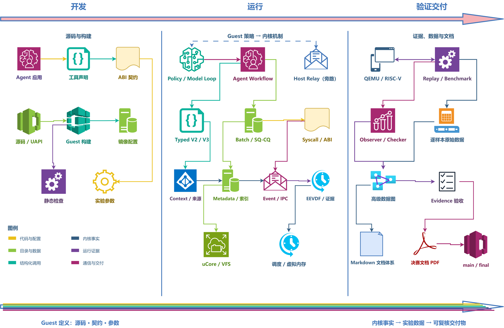

# AgentOS 交互控制台

`agentos-console` 把 `agentlive_ucore` 作为长驻 Guest 运行。用户可以在同一次 QEMU boot 中连续提交目标、查看 Context、审批副作用并取消当前回合。它适合展示 Agent Loop；性能比较仍使用 `make contest-demo`。

## 运行结构



[DrawIO 源文件](../figures/architecture/agentos_overview.drawio)

| 组件 | 责任 |
| --- | --- |
| `agentos-cli` | 呈现事件，收集自然语言、slash command、取消和审批 |
| Host daemon | 独占 QEMU 串口，管理 owner-only 本地连接，完成 TLS、API key 和 provider JSON 转换 |
| Guest relay Agent | 保存有界对话历史、工具目录、round 和 correlation，验证模型返回 |
| Guest main Agent | 执行 V2 typed 工具，把真实 `tool_result` 写入 Context 并回送下一轮 |
| AgentOS 内核 | 验证身份、capability、scope、参数和 provenance，提供等待、唤醒与 Context |
| `agentos-observe` | 只读呈现 Guest 查询到的高信号快照 |

Host 不读取 Guest 业务文件，不选择工具，也不生成工具结果。observer 不是独立保护域或完整内核 trace，并会引入读取和串口扰动。

交互循环使用 V2，因为下一步取决于上一轮真实结果。ENFORCE V3 适合预先冻结的 DAG，不是当前自适应会话的 backend。

## 离线验收

先运行不访问网络的检查：

```bash
make agentos-console-check
make agentos-console-replay TOOLPREFIX=riscv64-linux-gnu-
```

`agentos-console-check` 验证 Host 本地协议、控制面和 Guest loop 源码合同，不启动 QEMU。`agentos-console-replay` 在一次 QEMU boot 中运行固定三回合脚本，同时连接 observer，并用请求 SHA-256 绑定 replay response。

replay 覆盖真实 Guest 工具、Context、一次拒绝、一次批准、turn 完成和 session 关闭。它是当前仓库可重复的控制台验收，不代表外部模型调用或自由问答质量。

## Live 会话

需要外部模型时，在第一个 WSL 终端进入仓库并显式启动：

```bash
make agentos-console-deepseek TOOLPREFIX=riscv64-linux-gnu-
```

看到 `agentos>` 后，在同一 WSL distribution、同一 Linux 用户的第二个终端运行：

```bash
make agentos-observe
```

第一个终端断开但 daemon 仍存活时，可以重新连接：

```bash
make agentos-cli
```

本地 socket、随机 bearer token 和 `latest` 状态保存在 owner-only runtime 目录，不写入仓库。只有一个 controller 可以改变会话，observer 连接保持只读。

live 入口依赖当次网络、API key、endpoint 和 provider 响应。仓库的 2026-08-11 性能活动没有保存 live provider 成功证据；只有出现实际 API 往返、Guest 工具执行和正常 session 终态的当次日志，才能称为 live 演示。

## 命令

普通非 `/` 输入会创建一个新用户回合。最终回答后 Guest 继续等待下一条输入。

| 命令 | 行为 |
| --- | --- |
| `/tools` | 显示 Guest 当前工具目录 |
| `/context` | 显示 Context 数量、sequence、dropped、provenance 和最近结果 |
| `/status` | 显示 session、turn、provider、loop 与 pending 状态 |
| `/approve` | 批准当前副作用请求一次 |
| `/approve session` | 本会话后续同名请求进入自动批准呈现策略 |
| `/deny` | 拒绝当前副作用请求并回灌结构化结果 |
| `/reset` | 保留 QEMU，清除 Guest 对话历史和可清除 Context 状态 |
| `/quit` | 正常关闭 Guest session、daemon 和 QEMU |

模型请求副作用工具时，CLI 显示工具和规范化参数，并提示 `Approve? [y/N/a]`。回车或 `n` 拒绝，`y` 批准一次，`a` 对应 `/approve session`。人工决定最长等待 25 秒；超时或 controller 断开即拒绝。

每次批准都绑定当前 session、turn、request、correlation、工具名、canonical 参数 SHA-256、nonce 和有效期。session 自动批准不会跳过 Guest 对每个新请求的绑定校验，也不会替代内核 capability、scope 和 provenance 检查。

执行中按 `Ctrl-C` 取消当前 turn，并保留 QEMU 和 session。空闲时使用 `/quit` 正常退出。

## API key

默认 DeepSeek key 可以来自 Host 的 `DEEPSEEK_API_KEY`。也可以只传文件路径：

```bash
make agentos-console-deepseek \
  TOOLPREFIX=riscv64-linux-gnu- \
  AGENTOS_CONSOLE_API_KEY_FILE=/absolute/path/to/key.txt
```

若使用自定义环境变量，清空文件变量并指定变量名：

```bash
make agentos-console-deepseek \
  TOOLPREFIX=riscv64-linux-gnu- \
  AGENTOS_CONSOLE_API_KEY_FILE= \
  AGENTOS_CONSOLE_API_KEY_ENV=MY_PROVIDER_KEY
```

key 内容不会进入 Guest、argv、Context 或日志。`AGENTOS_CONSOLE_MODEL` 和 `AGENTOS_CONSOLE_ENDPOINT` 可覆盖默认模型与 endpoint。网络失败不会静默切换到 replay；离线验收要显式运行 `make agentos-console-replay`。

## 结果解释

| 观察 | 可以说明 | 不能说明 |
| --- | --- | --- |
| `agentos-console-check` 通过 | Host/Guest 静态合同成立 | QEMU 或 provider 已运行 |
| `agentos-console-replay` 通过 | 固定请求下的 QEMU、工具、审批和 Context 闭环成立 | live provider 质量 |
| 当次 live 日志完整 | 该次 provider 与 Guest loop 完成 | 可重复 benchmark |
| observer 出现快照 | 对应时刻 Guest 读取到结构化状态 | 全部内核事件均被捕获 |

需要量化性能时，关闭 observer 并使用保存逐样本数据的固定场景。当前性能口径见[实测性能结果](../contest/performance-results.md)，完整 Host/Guest 边界见[安全加固](security-hardening.md)。
