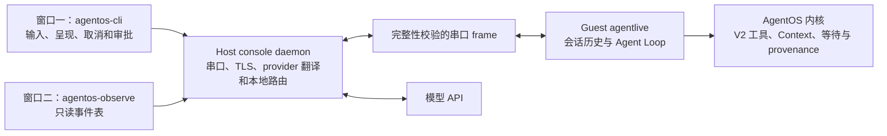

# AgentOS 交互控制台

`agentos-console` 是 `agentlive_ucore` 的长驻交互入口。它采用普通终端而不是图形界面：左侧窗口承载用户对话和逐次审批，右侧窗口呈现同一次 QEMU 启动中的高信号 live snapshots。`make contest-demo` 仍是固定、可比较的竞赛主演示；`make agent-live-demo` 仍是一次性 model-loop 验收。三者用途不同，不能用交互入口替代性能基线。

## 1. 架构与责任



责任边界如下：

- `agentos-cli` 只呈现 controller 事件并收集自然语言、slash command、取消和审批输入；它不请求模型，也不执行工具。
- Guest 保存会话和当前回合历史，发布工具目录，接收模型选择，校验结构化参数，调用真实内核工具，并把真实 `tool_result` 回送模型。
- Host daemon 独占 QEMU 串口，负责 owner-only 本地连接路由、HTTPS/TLS、API key 保管和 provider JSON 转换。它不读取 Guest 业务文件，不替模型选择工具，也不制造工具结果。
- 内核验证 Agent 身份、capability、scope、typed 参数和 provenance，执行工具并记录 Context；Agent 在等待模型时使用内核 wait/wakeup，而不是 Host 忙轮询。
- observer 展示 Guest 在同一进程线程中通过 timeline、Context 和 agent-info API 读取的结构化视图。它会增加少量读取和串口开销，不是独立保护域，也不是对目标 workflow 的额外安全边界。

当前交互执行使用 V2 exploratory typed RPC，允许模型依据上一结果动态选择下一工具。启用 `AGENT_EXECUTION_CONTRACT_F_ENFORCE` 的 V3 是另一种 frozen-DAG 高保证模式：它验证冻结节点、前驱、schema、attempt、deadline 和 provenance envelope，但不应被描述为通用自适应 Agent Loop 的唯一形态。

MCP/A2A 模块仍是 deterministic in-memory 对象映射 prototype；交互控制台不是 MCP Server、MCP Client、HTTP transport 或跨实现互操作证明。

## 2. 两窗口启动

推荐在 Windows Terminal 中打开两个 WSL profile 窗格。两个窗格必须使用同一 Linux 用户并进入同一仓库。第一窗格构建一次 `agentlive_ucore` 镜像、启动 QEMU 和 daemon，然后进入交互 CLI：

```bash
cd /mnt/e/agentos-release-20260810
make agentos-console TOOLPREFIX=riscv64-linux-gnu-
```

看到 `agentos>` 后，在第二窗格连接最近的活动会话：

```bash
cd /mnt/e/agentos-release-20260810
make agentos-observe
```

该目标显式使用 `observe --attach latest`；直接调用 Host 入口时，等价命令是 `python3 -I -S -B host_tools/agentos_console.py observe --attach latest`。

daemon 将 owner-only 本地 socket、随机 bearer token 和 `latest` 状态写入 `$XDG_RUNTIME_DIR/agentos-$UID/`、`/run/user/$UID/agentos-$UID/` 或受保护的 `/tmp/agentos-$UID/`。API key 不进入该状态文件或本地协议。状态不写入工作区，因此无需提交或清理仓库内的 session 文件。

第一窗格意外关闭但 daemon 仍在运行时，可重新连接：

```bash
make agentos-cli
```

同一时间只有一个 controller 能改变会话；observer 是只读连接。`/quit` 请求 Guest 正常关闭 session 和 QEMU。不要直接删除 `latest` 状态来代替正常退出。

## 3. 交互命令

普通非 `/` 输入是新的用户回合。最终回答不会结束 Guest；下一条输入继续复用同一 QEMU、Agent lifecycle 和有界会话历史。

| 命令 | 行为 |
| --- | --- |
| `/tools` | 显示 Guest 当前提供给模型的工具目录 |
| `/context` | 返回 Context 记录数、最旧/最新 sequence、dropped、provenance 和最新记录的 tool/status/result 摘要 |
| `/status` | 显示 session、turn、provider、Agent/loop 状态和 pending 操作 |
| `/approve` | 批准当前等待中的具体副作用调用一次 |
| `/deny` | 拒绝当前等待中的具体副作用调用，并把结构化拒绝回送模型 |
| `/reset` | 在保留 QEMU 的前提下清除 Guest 对话历史并重置可清除的 Context 状态 |
| `/quit` | 正常结束 session |

模型请求 `send_message` 时，CLI 会显示工具名和规范化参数，并给出 `Approve? [y/N/a]`；也可使用 `/approve`、`/deny` 或 `/approve session`。`y` 只批准一次，`a` 在本 session 自动批准同名工具的后续具体请求，默认回车或 `n` 拒绝。Host 等待人工决定的 wall-clock 上限是 25 秒；超时或 controller 断开时 fail closed 为 deny。每次批准都由 Guest gate 绑定当前 `session_id`、`turn_id`、`request_id`、`corr_id`、工具名、规范化参数 SHA-256、nonce 和有效期；session 级自动批准只是 Host 对后续请求的呈现策略，Guest 仍校验每次新鲜绑定。当前 gate 位于 Guest 用户态，它不是内核签发的 capability 或 V3 grant。拒绝是可回灌给模型的工具结果，模型可以改用无副作用方案。

在模型或工具回合进行中按 `Ctrl-C` 会向 Guest 请求取消当前 turn，并保留 daemon、QEMU 和 session；在空闲提示符再次按 `Ctrl-C` 不应被当作隐式授权。需要退出时使用 `/quit`。

observer 只显示可扫描的 high-signal live snapshots，例如 tick、PID/control id、loop state、event、tool、correlation、status、Context sequence 和 provenance。左右窗口可用 `turn_id`/`corr_id` 对齐。它既不是每个内核事件的完整实时 trace，也不是原始内核日志全量转储，因此没有出现的低层事件不能据此推断为未发生。

## 4. Replay 与 DeepSeek

`agentos-console` 默认使用 DeepSeek，以支持评委自由输入；等价的显式别名是 `agentos-console-deepseek`。离线 replay 是单独的固定脚本验收和现场备用：

```bash
make agentos-console-check
make agentos-console-replay TOOLPREFIX=riscv64-linux-gnu-
```

replay fixture 对每轮完整规范化模型请求绑定 SHA-256；它不是按响应序号无条件吐出答案的脚本。replay 与 live provider 经过相同 Guest Agent Loop、串口 frame、内核工具和 Context 路径，但 replay 结果不能称为云模型实测。

真实 DeepSeek 人工入口必须显式选择：

```bash
make agentos-console-deepseek TOOLPREFIX=riscv64-linux-gnu-
```

Make 默认依次探测仓库外的 `../deepseek_api.txt` 和 `../计算机操作系统能力竞赛/deepseek_api.txt`；找不到时再读取 Host 的 `DEEPSEEK_API_KEY`。其他位置可设置 `AGENTOS_CONSOLE_API_KEY_FILE=/absolute/path/to/key.txt`，或清空该变量后设置 `AGENTOS_CONSOLE_API_KEY_ENV=ENV_NAME`。命令行只传 key 文件路径或环境变量名，不传 key 内容，daemon 和日志也不会输出 key。model 与 endpoint 可用 `AGENTOS_CONSOLE_MODEL`、`AGENTOS_CONSOLE_ENDPOINT` 覆写。

网络或 provider 失败不会让 Host 伪造结果，也不会静默改用 replay。结束失败的 live session 后，显式执行 `make agentos-console-replay` 才进入固定离线验收；它仍走同一 Guest/内核路径，但只接受 fixture 预设的 script，不能当作自由问答或 live 调用证据。

## 5. 验证边界

`make agentos-console-check` 运行 Host 本地协议/控制面单测和 Guest 静态合同；它不启动 QEMU。`make agentos-console-replay` 在一次 QEMU boot 中先并发连接只读 observer，再运行 `ci/agentos-interactive-script.txt` 的三个用户回合：查询真实 Guest 文件；拒绝一次 `send_message` 并由模型改用 `echo`；再对另一组参数批准一次 `send_message`。结构化 validator 要求七个模型请求与 `ci/agentos-interactive-replay.jsonl` 中七个非空 SHA-256 逐项一致，并检查成功的 `query_file`/`echo`/单次 `send_message`、未执行的 deny、`waiting_llm`、fresh `context_timeline/kernel_timeline`、三个 `turn_complete` 和 `session_closed`。`make agentos-console-deepseek` 是人工 live 入口，不加入默认 CI，也不能在未实际调用 provider 时报告为 DeepSeek 实测。

第二窗口的 timeline 读取本身存在测量扰动。需要引用调度或性能数字时，仍使用固定 `make contest-demo` 的等量 AB/BA 场景，并记录工具链、QEMU、Host、样本和负载；不要从交互观测刷新频率推导性能结论。
