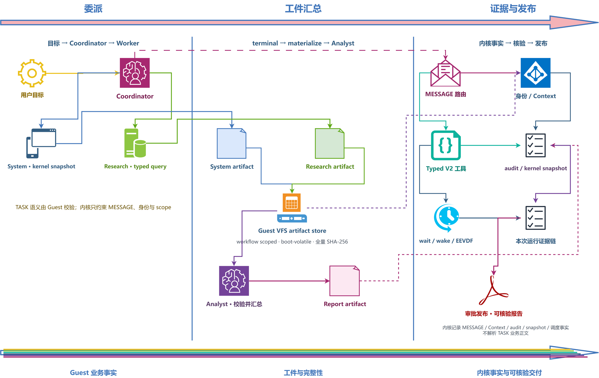

# AgentOS Nexus

AgentOS Nexus 是运行在同一 Guest workflow 中的四 Agent 研究工作台。Coordinator 接收用户目标，按真实结果委派 System、Research 和 Analyst；worker 通过内核 `MESSAGE` 接收 typed TASK，执行受限 V2 工具并返回可校验工件。Host 只负责串口、模型协议和本地控制面。



[DrawIO 源文件](../figures/architecture/nexus_runtime_flow.drawio)

Nexus 展示动态委派、来源传播和工件汇总。性能基线仍由 `make contest-demo` 采集，Nexus observer 的刷新间隔和事件数量不用于性能结论。

## 四个业务角色

| Nexus 角色 | 内核角色 | 责任 | 主要限制 |
| --- | --- | --- | --- |
| Coordinator | Orchestrator | 接收目标、选择 worker、校验结果、汇总回答和申请发布 | 不替 worker 生成系统或研究事实 |
| System | Sentinel | 读取本 boot 的进程、Context、文件和调度状态 | 固定只读任务，无文件内容读写或任意指令解释 |
| Research | Investigator | 读取已登记来源和 measurement capsule，形成带来源的结论 | 不把历史数据写成当前 boot 测量 |
| Analyst | Artifact | 消费 System 与 Research 工件，生成报告 | 发布副作用仍需审批和 capability |

四个业务 Agent 是独立 PID、独立 identity 和独立 Context，共享一个 workflow scope。Guest transport relay 是基础设施进程，不计入四个角色；Host 也不充当业务 worker。

## 委派路径

一次有效委派按以下顺序推进：

1. Coordinator 根据用户目标和上一项真实结果选择 `role`、`task_type` 与输入 handle；
2. Guest 构造 canonical `N1` TASK envelope，通过已授权的内核 `MESSAGE` route 发送；
3. worker 校验 lifecycle、task id、parent、deadline、输入 handle 和 task type；
4. worker 发布 `ACCEPT`、`PROGRESS` 和唯一 terminal 状态；
5. Coordinator 核对 task/correlation、状态、provenance、digest 和 producer；
6. 成功结果由有权限的角色 materialize 为 artifact；
7. 后续 worker 只消费已经验证的 handle；
8. Analyst 报告绑定两份来源工件，发布请求再经过人工审批。

任务状态包含 `ASSIGN`、`ACCEPT`、`PROGRESS`、`RESULT`、`FAILED` 和 `CANCEL`。失败委派可以生成新的 task id 重新规划；旧 terminal 不会被改写为成功。

## 协议边界

Nexus `N1` TASK 是仓库内 Guest 产品 ABI：

- wire payload 固定为 44 字节，并使用 `N1:` 前缀和 canonical base64url 文本；
- lifecycle id/generation、parent task、deadline、status 和两个 value 字段均有固定 offset；
- task id、parent、generation 与 deadline 在接收端重新验证；
- TASK 通过内核 `MESSAGE` 传输，内核只验证 identity、route、workflow、capability、provenance、队列和唤醒。

内核不解析 Nexus task kind 或业务 objective。Host `TASK_EVENT` 只是有界观测投影，也不是内核 tracing ABI。

以下接口相互独立：

| 接口 | 所在层 | 用途 |
| --- | --- | --- |
| Nexus `N1` TASK | Guest 产品层 | 四角色委派状态 |
| kernel `MESSAGE` | 内核 IPC | 可信发送、路由和唤醒 |
| Task Channel SQ/CQ | 内核批量执行 core | frozen request/CQE；当前 null provider |
| V3 execution contract | 内核工具层 | 预冻结 DAG 与 effect gate |
| MCP/A2A prototype | Host 用户态 | deterministic in-memory 对象映射 |

Nexus 当前使用 V2 typed 工具，因为 Coordinator 会根据返回结果调整下一步。它没有 V3 frozen DAG 的 predecessor、attempt 和 provenance envelope 保证。

## Artifact store

Nexus artifact 是 workflow-scoped、boot-volatile 的 Guest VFS 对象。公开 header 记录：

- handle generation、kind、长度和权限；
- lifecycle id/generation；
- producer、materializer 和 broker actor；
- provenance、task/correlation 与来源 handle；
- payload SHA-256 和 manifest SHA-256。

读取方重验当前 lifecycle、canonical handle、kind、权限、actor、长度和两个 digest。System/Research 只读 worker 没有 artifact 写权限时，由 Coordinator broker-materialize；manifest 同时保留逻辑 producer 和实际 materializer。

跨 Agent 数据继续携带 `CROSS_AGENT_DATA`。文件、工具和模型来源的 untrusted 位不会因哈希、委派或再次 materialize 被清除。SHA-256 保证字节一致，不等于内核签名、内容真实性或授权凭据。

artifact store 不是跨重启持久库，也没有新增内核 per-object ACL 或 immutable seal。内核仍通过 workflow scope、VFS 和 capability 保护底层文件访问。

## 三类数据

Nexus 将数据来源分开呈现：

| 对象 | 范围 | 使用方式 |
| --- | --- | --- |
| `nexus_case` | tracked 场景摘要 | 说明任务背景，不证明本 boot 重跑了主演示 |
| `nexus_meas` | 已发布历史测量 | Research 可验证并引用，必须标注 `historical_not_this_boot` |
| `nexus_state` | 本次 Guest boot | System 实际读取的进程、Context、文件和调度状态 |

文档、最终报告和 Nexus 历史测量统一引用 [2026-08-11 one-shot campaign](../../one_shot_metrics/README.md)：30 次 fresh QEMU boot，16 个 traversal/indexed 配对，traversal/indexed workflow core interval 中位数为 `34,712.5 us` 与 `13,293.5 us`。canonical `nexus_meas` 保存 `paired_ratio_median=3.118` 和 `wins=16/16`；该 interval 包含 query、recovery write、`fsync` 和 verify。

这些数字只描述 workflow core path。相同配对的 end-to-end 中位差值为 indexed 慢 `13,452 us`，系统端到端结果按该窗口单独报告。纯查询块属于 AgentEval 专项，完整方法与原始表见[实测性能结果](../contest/performance-results.md)。

## 控制面

Nexus 复用双窗口控制面。离线可重复验收为：

```bash
make agentos-nexus-check
make agentos-nexus-replay TOOLPREFIX=riscv64-linux-gnu-
```

`agentos-nexus-check` 运行 Host 协议、validator 和 Guest 源码合同，不启动 QEMU。`agentos-nexus-replay` 在一次 QEMU boot 中启动四个业务 Agent、controller 与 observer，使用 digest-bound fixture 完成失败委派、重新规划、两份来源工件、Analyst 汇总、发布拒绝和 session 关闭。

需要实际模型时显式运行：

```bash
make agentos-nexus-deepseek TOOLPREFIX=riscv64-linux-gnu-
```

另一个同用户 WSL 终端可连接 observer：

```bash
make agentos-nexus-observe
```

可用命令为 `/tools`、`/agents`、`/tasks`、`/artifacts`、`/context`、`/status`、`/approve`、`/deny`、`/reset` 和 `/quit`。重新连接 controller 使用 `make agentos-nexus-cli`。

副作用审批绑定 session、turn、request、correlation、tool、canonical 参数 digest、nonce 和有效期。等待超过 25 秒或 controller 断开时自动拒绝。审批不替代 Guest task 校验和内核 capability、scope、VFS 检查。

## 验证判定

固定 replay 至少验证：

- `session_ready` 早于业务数据，`session_closed` 是最后一条 telemetry；
- 每个 model request 与唯一、同 envelope 的 response 对应；
- 每个 task 有一次 assign、accept、progress 和唯一 terminal；
- child terminal 早于 parent terminal，失败后 replan 使用新 task id；
- artifact 只在成功 terminal 后发布，handle generation 与 lifecycle 一致；
- Analyst 报告实际引用 System 与 Research handle 和完整 payload digest；
- 发布拒绝不产生副作用，最终回答保持 unpublished；
- controller 与 observer 的安全 metadata 子序列保序且一一对应。

observer 展示 `kernel_audit`、`kernel_snapshot`、Context 和 artifact 的高信号字段。它不会转储全部事件，也会影响调度与串口负载。

## 结果解释

| 入口 | 可以说明 | 不能说明 |
| --- | --- | --- |
| `agentos-nexus-check` | 本地协议和静态合同成立 | Guest 已运行 |
| `agentos-nexus-replay` | 固定 fixture 下的 QEMU 四角色闭环成立 | live 模型质量 |
| 当次 live 记录 | 该次 provider、委派和工具闭环完成 | 可重复性能基准 |
| `contest-demo` | 等量 traversal/indexed 测量 | Nexus 自由交互能力 |

仓库当前保存的是 replay 验收与一次性性能活动，不据此声称 live provider 已验证。协议结构见 [API 参考](api.md)，Host/Guest 和来源边界见[安全加固](security-hardening.md)。
