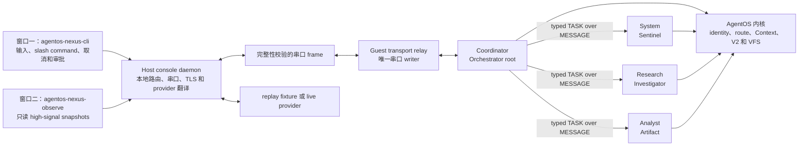

# AgentOS Nexus

`AgentOS Nexus` 是长驻 Guest 会话上的多 Agent 研究工作台。Guest 在本次 workflow/session boot 中创建并保留 Coordinator、System、Research、Analyst 四个业务 Agent；用户输入交给 Coordinator，由它根据目标和已验证结果动态决定是否委派、向哪个 worker 委派以及下一步做什么。各角色按 capability 读取系统状态或 Guest 工件、执行受约束的 typed V2 工具调用，再把结果交回 Coordinator。Nexus 复用现有 console 的串口、Host provider 和双窗口控制面，但不把 Host 包装成业务执行器，也不把固定脚本、历史测量或 observer 输出冒充本次 boot 的模型决策和性能结果。

本页定义 Nexus release 的产品合同和结果解释边界，不是某次命令已经通过的证据；实际完成范围必须由对应 checker、QEMU replay 或当次 live 记录确认。

`make contest-demo` 仍是等量 AB/BA 的竞赛性能基准。Nexus 用于展示动态委派、工件流转和长驻交互，不能替代该基准。

## 1. 架构与责任



责任边界如下：

- `agentos-nexus-cli` 只呈现 controller 事件并收集用户输入、slash command、取消和审批；它不创建业务事实，不替 Agent 执行工具。
- Host daemon 独占本地 socket、QEMU 串口、TLS、API key 和 provider JSON 转换。它不读取或代写 `nexus_case`、`nexus_meas`、`nexus_state` 等 Guest 业务文件。
- Guest transport relay 负责有界模型 wire，是基础设施 Agent，不计入四个 Nexus 业务角色，也不选择业务工具。
- Coordinator 拥有 Nexus 会话根和委派状态；四个业务角色在 boot 后长驻，各有独立 PID、Agent identity 和 Context，并共享同一 workflow scope。真实的 worker 结果先经过 Guest 校验，Coordinator 才可据此继续规划。
- 内核验证 Agent 身份、workflow scope、route、capability、typed V2 参数、VFS 权限和 provenance，并提供 Context、等待/唤醒与审计 substrate。内核不运行模型，也不理解 Nexus 的任务业务语义。
- observer 是同一 QEMU boot 的只读呈现端。它不是独立保护域、完整实时 trace 或性能测量器。

Host 启动 Nexus 时使用 `--guest-profile nexus`；独立 CLI 和 observer attach 使用 `--expect-guest-profile nexus`。profile 不匹配时连接 fail closed，避免把普通 console 会话误呈现为 Nexus。

## 2. 四角色动态委派

| 业务角色 | Guest 角色 | 责任 |
| --- | --- | --- |
| Coordinator | Orchestrator root | 接收用户目标，维护启动时建立的长驻 worker identity，校验委派和返回结果，依据真实结果决定下一步，并汇总最终回答 |
| System | Sentinel | 执行冻结的只读系统快照任务，查询本次 boot 的进程、Context、文件大小与调度状态；不读取 VFS TASK capsule |
| Research | Investigator | 读取已登记来源和 published measurement capsule，形成可追溯的研究结论 |
| Analyst | Artifact | 汇总跨角色结果并生成最终报告工件；需要副作用的发布动作仍经过审批 |

“动态委派”不是预先打印四个角色名，也不是固定把同一脚本依次发给三个 worker；它也不表示每个用户目标都重新创建进程。四个业务 Agent 在本次 boot 中长驻，Coordinator 根据用户目标、模型建议和上一项真实结果选择是否委派、接收者及下一项任务。Guest task state machine 至少区分 `ASSIGN`、`ACCEPT`、`PROGRESS`、`RESULT`、`FAILED` 和 `CANCEL` 这些逻辑 kind。Guest `N1` TASK envelope 是仓库内版本化、固定 44-byte 布局并要求 canonical encoding 的 ABI；Host `TASK_EVENT` 只是有界观测投影，不是通用公共 tracing/event ABI。外部工具不能把 Guest TASK kind 直接猜成 Host event schema。

System 映射到内核 Sentinel，但 Nexus 不为它扩大全局 role policy，也不授予 `CONTENT_READ`。System 接收的是固定 `SYSTEM_SNAPSHOT` opcode、零 input handle 和 Coordinator 预分配的 result handle；它不打开 VFS TASK capsule。模型给出的 objective 只保留在 Coordinator 自身 Context 与 `TASK_EVENT` 观测摘要中，不能变成 System 可解释的任意指令。`capability_check` 只把精确的 `query_process` 与 `get_system_status` action 映射到既有 `PROCESS_READ`，不使用含糊的 `query` alias 代替系统事实检查。这没有授予 `ACTION_WRITE`、`ARTIFACT_WRITE`、`META_WRITE` 或文件内容读取；System 不能发布工件或修改 metadata。Coordinator broker-materialize System 的结果时，仍保留 worker producer 与 Coordinator materializer 的身份区分。

Nexus 的 `TASK` 是此次新增的 Guest 用户态 typed envelope，底层通过已有内核 `MESSAGE` 路径传递。内核只看到并约束 `MESSAGE` 的发送者、接收者、workflow、route、capability、provenance、队列和唤醒；它不解析 `TASK` kind，不理解任务正文，也不替 Coordinator 维护业务状态机。TASK 类型校验、deadline、单项在途约束和结果匹配都属于 Guest 产品层。因此 Nexus 不声称新增了内核 TASK 事件类型或分布式 exactly-once 协议。

Guest `TASK` envelope、kernel `MESSAGE` transport、Host `TASK_EVENT` observation frame、kernel Task Channel SQ/CQ、MCP experimental Task object 和 V3 execution-contract envelope 是六个不同层次。Host 的观测 frame 不证明内核理解 TASK，Task Channel 当前的 null provider 也不是 Nexus 业务 payload backend；六者不能互相代称。

worker 内部执行真实 typed V2 工具调用；Coordinator 提交给模型的少量 Nexus 动作是用户态受限动作，不是把任意 PID、路径或 capability 直接交给模型。每次后续决策都应来自已经返回并校验的 Guest 结果，而不是 Host 合成的 `tool_result`。

## 3. 工件与来源 capsule

Guest 在 Nexus ready 之前，根据版本化的 [agentnexus_seed.h](../../user/include/agentnexus_seed.h) 将三个小型 tracked ASCII capsule materialize 为当前 workflow scope 内的真实 VFS 文件，并登记 metadata：

| 文件 | 来源 | 正确解释 |
| --- | --- | --- |
| `nexus_case` | `base-96613ea`（commit `96613ea`）的 `docs/agentos/scenario-script.md` 第 33-46 行 | 固定的科研 workflow 场景 capsule；它提供 case 内容和来源，不证明本次 boot 已重跑该确定性场景 |
| `nexus_meas` | [evaluation suite](../../ci/evaluation-suite.json) 第 3-21 行与[实测性能结果](../contest/performance-results.md)第 16-25 行 | 已发布的历史 measurement snapshot；`nexus_derived_measurement_scope=historical_not_this_boot`，不是当前 Nexus boot 的 benchmark 输出 |
| `nexus_state` | 本次 Nexus boot 的 Guest runtime | `claim=this_boot_runtime_observation`；只能描述本次会话实际观察到的状态，不能继承历史性能结论 |

`nexus_case` 的固定来源原文使用 Orchestrator、Sentinel、Investigator、Recovery；Nexus 产品运行时使用 Coordinator、System、Research、Analyst。两组名称有场景继承关系，但不是逐字相同的源角色清单，不能把 Nexus 的 Analyst 反写成第 33-46 行已经存在的 Artifact 角色。

Capsule 的字段名同时标明来源层次：`source_*` 只描述 tracked excerpt 或其中直接出现的内容；`nexus_derived_*` 是 Nexus 为当前产品场景补充的 project/workflow/run、incident、角色映射、解释范围或验收 metadata。第 33-46 行并未直接给出 `lab-gene-x`、`RUN-042` 或 `align_memory_limit`，所以这些值只以 `nexus_derived_*` 出现。measurement 的已发布数值保持原字段名，未在结果页独立发布的 check count 则必须使用派生前缀。

evaluation suite 给出 file-query 负载配置，[实测性能结果](../contest/performance-results.md)才记录下列已发布的 4-boot 综合场景数值。`nexus_meas` 中的比较负载是同一内核、同一 Guest、同一 96 条记录语料上的 4 个等量 AB/BA QEMU boot；这些数字不是从 suite JSON 直接计算出的新结果。canonical fields 为：

| 字段 | published snapshot | 含义 |
| --- | ---: | --- |
| `records` | 96 | 对照使用的 corpus records，不是每条路径实际检查的记录数 |
| `traversal_us` | 59595.5 | traversal core 中位数，单位为 us |
| `indexed_us` | 13866.5 | indexed core 中位数，单位为 us |
| `ratio` | 4.298 | traversal/indexed core duration ratio |
| `wins` | 4/4 | 4 个 paired boots 中 indexed 均更快 |
| `nexus_derived_checks` | 4/4 | Nexus 从 published `wins=4/4` 派生的稳定验收别名，不是来源文档中的独立测量字段；相邻的 `nexus_derived_checks_basis=wins` 明示依据 |

原始发布结果中 traversal 实际检查 97 条记录，indexed 检查 2 条；`records=96` 只表示输入语料规模。这些值只表示发布时的历史测量快照。Nexus 启动时读取 `nexus_meas` 不会重跑四个 boot，也不能把快照前缀改写成 `this_boot`。若要生成本机新测量，仍需显式运行 `make contest-demo`，并以该次 `results/contest-demo/` 中的样本、环境、单位和原始日志为准。

Nexus artifact 使用 Guest 用户态流式 SHA-256 覆盖 manifest 声明的完整 payload。消费者还要重验当前 lifecycle、handle generation、kind、permission、大小和 provenance；内核另行强制 workflow VFS scope 与进程 capability。Research/Analyst 委派中，模型选择的 `delegate_task.objective` 进入 TASK capsule 时标为 `SOURCE_MODEL`，并保留 `AGENT_DERIVED | UNTRUSTED_TOOL_OUTPUT | CROSS_AGENT_DATA`，不能伪装成直接用户输入或 `TRUSTED_USER_CONTROL`；System 的固定 no-input TASK 不创建这类 capsule。跨 Agent 数据继续保留 `CROSS_AGENT_DATA`，既有的不可信标签不会因重新 materialize 或哈希而消失。严格 replay 要求 System artifact 至少保留 `KERNEL_FACT`、`AGENT_DERIVED`、`UNTRUSTED_TOOL_OUTPUT`、`CROSS_AGENT_DATA`，Research published artifact 还必须包含 `UNTRUSTED_FILE_DATA`；Analyst report 必须是 System 与 Research 实际输入 label 的 superset，并继续包含 report 所需的 `AGENT_DERIVED`、`UNTRUSTED_TOOL_OUTPUT` 和 `CROSS_AGENT_DATA`。单纯 `provenance != 0` 不足以通过。worker 不会因接收任务而自动获得 artifact 写权限；Coordinator 代表只读 worker materialize 结果时，逻辑 producer 与实际 materializer 仍分开记录。该 SHA-256 不是内核签发的来源证明、Evidence fence 或授权凭据，也不是只读取文件前缀的内核 `read_file_digest`。当前 artifact store 是 workflow-scoped、boot-volatile 的 Guest VFS 存储，不是跨重启持久库，也没有新增内核级 per-object ACL 或 immutable seal；同 scope 内的恶意写者不能仅靠该用户态封装被视为已隔离。

MVP 每个 workflow lifecycle 只有 32 个 generation-safe artifact slot。三个 seed capsule 固定占用前三个 slot；System delegation 只预留一个 result slot，Research/Analyst delegation 各保留一个 TASK capsule slot和一个 result slot。任何失败的委派都不会回收已经分配的 handle，因而 System 失败消耗一个 slot，Research/Analyst 失败消耗两个 slot。因此剩余 29 个 slot 可容纳的委派数取决于角色组合：全为 System 时最多 29 次，全为双-slot worker 时最多 14 次并剩一个 slot；其他产品工件还会进一步减少余量。`/reset` 不创建新 lifecycle，也不回收这些 slot；容量耗尽时 Guest 必须返回结构化 `NO_SPACE`，而不是复用旧 handle 或声称会话可无限延长。需要新的容量边界时应正常 `/quit` 并启动新 boot。`/artifacts` 可查看当前工件计数和主要 handle；`/status` 不承诺提供剩余 slot 估算。

当前 MVP 的 artifact handle 只保留 lifecycle generation 的低 16 位，strict Host 因而只接受 `1..65535`；本产品 boot 使用 generation 1，超过该范围不是受支持的长期运行模式。TASK deadline 同样是 32-bit tick，当前消费路径没有承诺跨低 32 位 tick 回绕继续运行。二者都应通过正常结束当前 bounded session 并启动新 boot 来回避，不能据此把 Nexus 描述成无限期 daemon；后续若扩展长期生命周期，必须同时升级 Guest handle/deadline 编码和 Host validator。

System/Research worker 先返回 terminal TASK，Coordinator 验证结果并 broker-materialize 后，才投影 `artifact_published(task_state=completed)`；该投影是 terminal 后的工件事实，不是第二个 TASK 状态迁移。System 工件还包含从该 worker 本次 boot 的 self `agent_info` 读取的 `sched_dispatch_count`、`sched_budget`、`sched_budget_used` 和 `sched_vruntime`，它们是业务输入，不从 observer snapshot 反向拼入报告。dispatch、used 和 vruntime 会随真实调度变化；digest-bound replay 的模型投影、Analyst 摘要和最终答案只使用同一次实际读取的 `sched_budget` 作为稳定 scheduler 事实，不能把 fixture 中的旧 dispatch 数字冒充本次 boot。完整 System 工件仍保留这些动态字段，供本次运行核验。Analyst 报告事件还要绑定 System/Research handle、完整 payload digest、该 budget 和历史 ratio；最终答案必须回显本次 System 的 process/context/file 数值、该 scheduler budget、`source_revision`、历史 measurement canonical 数值、`source_results` 和 `nexus_derived_measurement_scope=historical_not_this_boot`。这样可以区分“报告确实消费了已验证来源”与只打印角色名称或 observer 行。

## 4. 两窗口启动

第一窗口构建 Nexus Guest 镜像、启动 QEMU 和 daemon，并连接 controller：

```bash
cd /mnt/e/path/to/project61-agentOS-happylegend-uCore
make agentos-nexus TOOLPREFIX=riscv64-linux-gnu-
```

看到交互提示符后，在同一 Linux 用户、同一仓库的第二窗口连接只读 observer：

```bash
cd /mnt/e/path/to/project61-agentOS-happylegend-uCore
make agentos-nexus-observe
```

第一窗口意外关闭而 daemon 仍存活时，可重新连接同一 Nexus session：

```bash
make agentos-nexus-cli
```

独立 attach 会核对 Nexus guest profile；它不会连接到 profile 不符的普通 console session。同一时间只有一个 controller 可以提交输入和审批，observer 始终只读。需要结束 session 时使用 `/quit`，不要删除 runtime state 文件代替正常关闭。

七个 additive 入口的分工如下：

| 目标 | 行为 |
| --- | --- |
| `agentos-nexus-image` | 只构建 Nexus Guest 镜像，不声称已启动 QEMU 或 provider |
| `agentos-nexus` | 启动 Nexus 产品会话并连接 controller |
| `agentos-nexus-cli` | 重新连接当前活动 Nexus controller |
| `agentos-nexus-observe` | 连接当前活动 Nexus session 的只读 observer |
| `agentos-nexus-check` | 运行 Host/Guest 静态合同与本地协议检查，不等于 QEMU 闭环 |
| `agentos-nexus-replay` | 用固定 fixture 运行可复验的离线 QEMU 闭环 |
| `agentos-nexus-deepseek` | 显式使用 DeepSeek 的人工 live 入口 |

这些目标是对现有 `agentos-console*` 和 `contest-demo` 的增量产品入口，不改变后两者的语义。

`agentos-nexus-image` 复用仓库现有的 `build/kernel` 与 `nfs/fs*.img` 输出，因此不能与普通 console image 在同一 worktree 并发构建。该目标在 mkfs 前把 `agentnexus_ucore` raw binary 限制为 uCore 当前 `MAXFILE=274432` bytes；超限直接失败，不通过扩大文件系统 ABI 掩盖 Guest 产品体积问题。

## 5. Slash command、审批与取消

普通非 `/` 输入创建新的用户回合。Nexus 复用 console 控制命令，并增加三个由 Guest 回答的多 Agent 视图：

| 命令 | 行为 |
| --- | --- |
| `/tools` | 显示 Guest 当前发布的工具目录 |
| `/agents` | 请求 Guest 返回当前 Nexus 业务 Agent 视图；Host 不合成角色状态 |
| `/tasks` | 请求 Guest 返回任务总数、失败数、N1 协议版本与支持状态名摘要；不是逐任务实时视图 |
| `/artifacts` | 请求 Guest 返回当前 workflow 的 artifact 数量及 seed/System/Research/report handle 清单；不把 handle 清单表述成 digest 验证状态 |
| `/context` | 返回当前可见的 Context 摘要 |
| `/status` | 返回 Guest 当前 loop、Agent 与 Context 状态；provider 属于 Host 会话状态，不由 Guest `CONTROL_RESULT` 冒充，也不把固定 32-slot artifact 容量包装成无限会话 |
| `/approve` | 批准当前等待中的具体副作用请求一次 |
| `/deny` | 拒绝当前等待中的具体副作用请求，并把拒绝作为工具结果交回 Guest |
| `/reset` | 保留 QEMU 和长驻 worker，请求清除 Guest/Host 明确定义为可重置的 Context 与 transcript；不重建角色或伪造新 boot |
| `/quit` | 请求 Guest 正常结束 session |

`/agents`、`/tasks` 和 `/artifacts` 都沿 controller 路径进入 Guest；CLI 不是这些状态的权威来源。observer 或 Host 日志中没有出现某一内部状态，也不能推断该状态未发生。

需要发布报告等副作用时，CLI 显示具体请求并收集 `y/N/a` 决定。Guest gate 将决定绑定到当前 session、turn、request、correlation、tool/tool ID、规范化参数摘要、新鲜 nonce 和 issued/expiry tick；session 级自动批准只改变 Host 对后续同 profile、同 tool ID、同参数摘要请求的呈现策略，每次请求仍由 Guest 重新验证新 nonce 和有效期。Host 最多等待 25 秒；默认拒绝、超时、controller 断开和绑定不匹配都 fail closed。

审批是 Guest 用户态 gate，不是内核签发的 capability、V3 contract grant 或 artifact 来源证明。内核的 role/capability/scope/VFS 检查仍然独立执行；通过审批不能扩大内核权限，拒绝则作为结构化 tool error 回灌，让 Coordinator 选择无副作用方案或结束任务。

在活跃 turn 或等待审批时按 `Ctrl-C` 会向 Guest 请求取消当前根任务，并保留 daemon、QEMU 和 session。取消是受状态机约束的协作操作，不应被描述为对任意已开始副作用的瞬时回滚。在空闲提示符按 `Ctrl-C` 也不会形成隐式批准；退出使用 `/quit`。

## 6. Observer 与测量边界

第二窗口只展示便于扫描的 high-signal live snapshots，例如角色、任务、工具、工件、Context 和 loop 状态的摘要；默认 snapshot 行也显示该 Agent 的 capability mask。controller 的每条 safe `TOOL_EVENT` metadata 在 observer 中有同序的一对一投影；`result`、原始参数、正文和 summary 不进入 observer。`tool_search`、`delegate_task`、`read_artifact` 和 `publish_report` 是 Guest runtime 的 product pseudo tools，不冒充一次内核工具响应，所以它们的 `TOOL_EVENT.sequence` 必须精确为 0；成功结果仍必须携带真实的正 `context_seq` 和已知 provenance mask。Nexus 的结构化验收把两类 Guest 读取的内核视图区分开：`kernel_audit` 是带严格递增全局 audit `record_sequence` 的 fresh MESSAGE enqueue/consume 记录，用来交叉核对 PID、Agent identity、真实 control identity 和 correlation；`kernel_snapshot` 是各 worker 的 self `agent_info` 前后差，显式携带同一真实 `actor_control_id`、非零 `capability_mask`、Context、wait sleep/wakeup 和调度摘要。audit sequence 不是 Context sequence，snapshot 也不是一条 fresh audit 记录；Host 不接受 Nexus observer 用其他 audit kind 填充黄金证据。

这些视图经 Guest 串口 frame 和 Host metadata allowlist 转发；Host 自产事件不能标成 `kernel_audit` 或 `kernel_snapshot`。strict replay 把 observer 的 TASK 安全 metadata 子序列与 controller 投影逐项、保序、1:1 核对，不能靠同样的角色总数掩盖 task id 改写或事件丢失；observer 的 `session_closed` 也必须是最后一条 telemetry。第二窗口仍不转储每个内核事件，字段只服务当前版本的仓库内 validator，不是通用 tracing ABI；自动化验收不得解析人类可读表格。

observer 线程会读取 timeline、Context 和 Agent 状态并经过串口输出，因此存在测量扰动。它不是独立安全边界，也不能用刷新间隔、行数或两条 snapshot 的时间差推导内核性能。strict replay 只把实际非零字段当成机制证据：`/status.result.capability_mask`、`/context.result.provenance`、artifact `provenance/resource_used`、成功 tool result provenance，以及 snapshot 的 `sched_budget/sched_budget_used`；零值或字段缺失不能由日志文字补齐。内核 MESSAGE audit 当前以 `flags=0` 记录 enqueue/consume，没有独立 provenance 字段，因此其投影必须保持 `provenance=0`，Guest 不得合成标签。artifact event 的 `resource_used` 明确定义为该次已验证 payload 的字节数，不是 CPU 时间或性能加速比。性能结论只来自显式 benchmark；`nexus_state` 的 `this_boot` observation 与 `nexus_meas` 的 published snapshot 必须始终分开呈现。

## 7. Replay、DeepSeek 与验证

先运行不启动 QEMU 的本地检查：

```bash
make agentos-nexus-check
```

离线、可重复的产品闭环使用固定 replay：

```bash
make agentos-nexus-replay TOOLPREFIX=riscv64-linux-gnu-
```

replay 与 live provider 经过相同的 Nexus Guest 角色、TASK/MESSAGE、artifact、typed V2、Context、串口 frame 和 controller 路径，但模型响应来自绑定请求的 fixture。strict validator 要求 `session_ready` 先于会话数据，每个 turn 使用稳定且不复用的 active `request_id`，每个 `model_request` 与唯一、同 envelope 的 `model_response` 逐项对应，tool/final 内容与 digest-bound fixture 完全一致。每轮还必须满足 single-inflight 因果顺序 `request_i < response_i < 同 correlation 的 TASK/tool/approval effects < request_(i+1)`，final response 必须先于对应 `turn_complete`；每项任务都要实际经过一次 `ASSIGN`、一次 `ACCEPT`、至少一次 `PROGRESS` 和唯一 terminal，delegated child 的完整事件批必须早于 parent terminal。child 的非零 `deadline_tick` 在该任务全部事件中保持一致并晚于观测 tick，task id 和 parent task id 受 32-bit wire 边界约束；artifact 及模型可见的有效 handle generation 还必须与 workflow lifecycle generation 一致。delegated child 的完整 TASK batch 固定到创建它的 response，并在 `delegate_task` tool result 前完成，tool status/result/handle/task id 还要与 terminal 和 artifact 一致。发布审批重算 `{handle: report_handle}` 的 canonical JSON SHA-256，核对 `tool_id=1004` 与最新 `publish_report` response，并验证 request、decision、denied tool result、turn completion、session close 的原始时序；`session_closed` 后不接受追加输出。它证明固定请求边界内的协议和产品闭环可复验，不证明自由问答、云模型质量或 DeepSeek 实测。

需要真实模型自由交互时显式运行：

```bash
make agentos-nexus-deepseek TOOLPREFIX=riscv64-linux-gnu-
```

DeepSeek 入口依赖实际网络、Host key 和 provider 响应。网络或 provider 失败不会让 Host 伪造 worker 结果，也不会静默改用 replay；结束失败的 live session 后必须显式运行 `agentos-nexus-replay` 才进入离线模式。没有实际完成 provider 调用时，输出不能标为 DeepSeek 实测。API key 的 Host-only 边界和配置方式沿用[交互控制台](interactive-console.md)，key 不进入 Guest capsule、TASK、命令行内容或日志。

不同入口证明的范围如下：

| 入口 | 能证明 | 不能证明 |
| --- | --- | --- |
| `agentos-nexus-check` | 静态合同、Host 本地协议和控制面行为 | Guest 已在 QEMU 中闭环运行 |
| `agentos-nexus-replay` | 固定 fixture 下的 QEMU、四角色委派和工件闭环 | live provider 的自适应质量 |
| `agentos-nexus-deepseek` | 该次实际会话中的 live provider 路径 | 可重复 benchmark 或默认 CI 稳定性 |
| `contest-demo` | 4 个等量 AB/BA boot 的 traversal/indexed 对照 | Nexus 自由交互或模型质量 |

## 8. V2、V3 与 MCP 边界

Nexus 首版使用 exploratory typed V2，因为 Coordinator 必须根据上一项真实结果动态改变接收角色和下一工具。V2 仍逐次检查 tool schema、role/capability、scope 和参数，但不获得 immutable contract 的 frozen DAG、attempt、deadline、predecessor 或 provenance envelope。

启用 `AGENT_EXECUTION_CONTRACT_F_ENFORCE` 的 V3 适合预先冻结 node、tool、predecessor、artifact、deadline 和 provenance 的高保证 DAG。它不是当前 Nexus adaptive loop 的 backend；不能把 Nexus 的 V2 动态性写成与 V3 frozen contract 相同的保证，也不能为了使用 V3 而把动态调用图描述成已经预知。

仓库中的 MCP/A2A 仍是 deterministic in-memory 标准对象映射 prototype。新增的 Nexus Guest `TASK` envelope、Host provider relay 和 artifact store 都不把它升级为 MCP server、HTTP/streaming transport、内核 SQ/CQ adapter 或跨实现互操作证明。完整合同边界见[执行合同附录](task6-execution-contract.md)；[API 说明](api.md)只覆盖内核 V2/V3 等现有 UAPI，Nexus `N1` 的固定 Guest 产品 ABI 以 [agent_nexus_protocol.h](../../user/include/agent_nexus_protocol.h) 为准。

## 9. 结果解释规则

- 四业务角色必须是 Guest 在同一 workflow/session boot 中创建的独立长驻 Agent，且 Coordinator 必须根据真实结果动态委派；transport relay 不冒充第五个业务角色，Host 也不冒充 worker。
- TASK 是 typed envelope over kernel `MESSAGE`；内核不解析 TASK kind 或业务正文。
- artifact 的全量 SHA-256 在 Guest 用户态计算和重验，不写成内核签名、来源认证或 grant。
- approval 是 Guest gate；它不替代内核 capability、scope、VFS 或 V3 enforcement。
- observer 只提供有扰动的 high-signal snapshots；未观察到不等于未发生。
- `nexus_meas` 是 published measurement snapshot，`nexus_state` 才是 `this_boot` runtime observation；二者不得合并。
- replay 只报告 replay，实际 DeepSeek 调用才报告 live；provider 失败不静默切换。
- `make contest-demo` 仍是性能主入口，且必须保留等量 AB/BA、逐 boot 样本、环境、单位和原始日志。
- MCP/A2A 只按 prototype 披露；Nexus adaptive V2 与 ENFORCE V3 frozen DAG 分开陈述。
