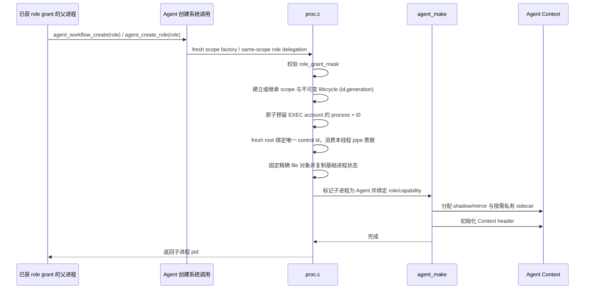

# 任务一：Agent 进程创建与地址空间设计

本文是 [design.md](design.md) 的任务一细节附录，重点展开 Agent 进程生命周期和地址空间设计。总体架构、关键决策和质量要求以主设计文档为准。

## 目标

任务一的目标是在 uCore 中加入 Agent 进程机制，使内核能够区分普通进程和 Agent 进程，并为 Agent 进程提供独立的 Agent Context 用户虚拟地址区。

AgentOS-uCore 当前实现不是只做“能创建一个特殊进程”的最小实现，而是在任务一基础上加入：

- Agent PCB 元数据；
- 6 页 Agent Context；
- kernel shadow 权威历史；
- 按活跃 Agent 分配、受 EXEC account 计费的私有 Context sidecar；
- user mirror 高速读取镜像；
- cause/span 因果链状态；
- 用户自管 Context cache；
- 构建期可信映像清单、角色与可执行 inode 绑定；
- 代码 RX、数据/栈/Context RW+NX 的用户映像布局；
- 面向非 Agent workflow worker 的最小文件能力委派；
- Agent 退出释放和 workflow 可信强制撤销；
- generation-safe workflow lifecycle、统一 teardown 与按需物理内核栈；
- 与后续任务二至五共用的状态字段。

## 当前接口

| 系统调用 | 作用 |
| --- | --- |
| `agent_create()` | 在当前 role grant 允许时创建 sentinel Agent 子进程，保留兼容入口 |
| `agent_create_role(int role)` | 在当前 role grant 允许时创建指定角色 Agent 子进程；与兼容入口共用授权机制 |
| `agent_workflow_create(int role)` | 仅由可信 bootstrap factory 创建带独立动态 scope、资源份额和对象命名空间的 workflow 根 Agent |
| `agent_workflow_close(uint64 scope_id)` | 由创建时绑定的唯一根 controller 或可信 bootstrap factory 强制关闭 workflow；scope 立即失效，成员协作退出后进入回收 |
| `agent_scope_delegate_fd(int fd)` | 为调用线程的下一次安全主体创建登记一次性 pipe 端点票据；子主体不继承继续委派权 |
| `agent_worker_create(const char *image, uint64 capabilities)` | 由 orchestrator 创建绑定到指定 immutable、domain-safe 映像的非 Agent workflow worker；只委派受映像 profile 限制的文件能力 |
| `agent_info(struct agent_info *)` | 查询当前进程的 Agent 状态、Agent ID、Agent Context、配额、Loop 状态和路径元信息 |

当前任务一能力由 `agentfinal_ucore`、`labdemo_ucore`、`agentsecurity_ucore`、`agenttrust_ucore`、`agentvfs_ucore` 和 `agentscope_ucore` 共同验证，覆盖 Agent 创建、Context 映射、多个 Agent 并存、角色能力绑定、可信 exec、非 Agent worker、强制撤销和退出路径。

## 进程元数据

在 `struct proc` 中新增 Agent 相关字段。用户可通过 `struct agent_info` 观察其中一部分：

| 字段 | 说明 |
| --- | --- |
| `is_agent` | 是否为 Agent 进程 |
| `agent_type` | Agent 类型，普通进程为 `AGENT_TYPE_NONE`，Agent 进程为 `AGENT_TYPE_AGENT` |
| `agent_id` | Agent 进程 ID，启动周期内递增分配 |
| `agent_role` | 当前 Agent 的真实内核角色 |
| `agent_role_grant_mask` | 内核持有的角色创建授权；bootstrap 和 orchestrator 按策略获得，普通进程及低权限 Agent 为 0 |
| `agent_ctx_base` | Agent Context 用户虚拟地址起点 |
| `agent_ctx_size` | Agent Context 大小 |
| `heartbeat_interval` | Agent 心跳周期；独立 set/stop syscall 可动态调整，旧 `agent_heartbeat()` ABI 兼容，最大值为 `AGENT_HEARTBEAT_MAX_TICKS` |
| `resource_quota` | Agent Context Path 记录配额，当前为 128 条 |
| `loop_state` | Agent Loop 状态，支持 `IDLE`、`RUNNING`、`WAITING` |
| `agent_call_count` | 当前 Agent 已接纳并保留 sequence 的工具调用数；在途调用尚未提交时可领先 Context latest 水位 |
| `context_path_count` | 当前有效 Context Path 记录数 |
| `context_path_capacity` | Context Path 最大记录数 |
| `context_path_head` | 下一条 Context Path 写入槽位 |
| `context_path_oldest` | 当前仍可查询的最早 Context Path 序号 |
| `context_path_latest` | 当前最新 Context Path 序号 |
| `context_path_dropped` | 因 FIFO 覆盖淘汰的历史记录数 |
| `context_path_rollback_count` | 成功回滚 Context Path 的次数 |
| `latest_response_offset` | 最近一次结构化响应在 Agent Context 中的偏移 |
| `records_offset` | Context Path 记录数组在 Agent Context 中的偏移 |
| `user_cache_offset` / `user_cache_size` | 通过 Context header 暴露的用户自管 cache 位置和大小 |
| `current_span_id` | 当前 Agent 正在延续的因果链 ID |
| `current_cause_sequence` | 下一条自动 Context 记录默认指向的前序 sequence |
| `latest_record_hash` | 通过 Context header 暴露的 Context 完整性链尾 hash |
| `provenance_edges` | 当前 Agent 已记录的非 root 因果关系数量 |
| `event_count` | 当前 Agent 已接收事件数 |
| `event_dropped` | 事件投递失败或被丢弃计数 |
| `wait_count` | 当前 Agent 调用等待次数 |
| `wait_loop_count` | `agent_wait()` 检查循环次数，用于观察有限 timeout 没有反复轮询 |
| `timeout_count` | 等待超时次数 |
| `last_heartbeat_tick` | 最近心跳 tick |
| `current_tick` | `agent_info()` 返回时的内核 Agent tick，供 timeline 等待建立未来记录过滤条件 |
| `capability_mask` | 当前 Agent 能力位，由内核按 `agent_role` 分配 |
| `filesystem_domain` | 当前进程所在的 VFS 安全域；普通进程位于 public 域，受权 Agent/worker 位于 workflow 域 |
| `filesystem_capability_mask` | 当前映像实际生效的 `CONTENT_READ` / `ARTIFACT_WRITE` 文件能力；它与 Agent 业务 capability 分开管理 |

内核还维护不直接暴露为 `agent_info` ABI 的安全字段：不可变 `workflow_lifecycle_id + generation`、generation-safe EXEC `resource_account`、teardown 状态/owner，以及完整 Agent 状态页句柄。一个 Agent 的 9 页 detail sidecar、6 页用户 mirror 和 6 页可信 shadow 通过一次 21 页 `RESOURCE_AGENT_STATE_PAGE` 请求原子计费。`resource_domain_id` 只保留为 scheduler 的 CPU 分区索引，不是资源计费身份。

普通进程的 `is_agent` 为 0，`agent_id` 为 0，且不会安装 Agent metadata 或 Agent Context 特殊映射。普通进程调用 Agent-only syscall 时会返回错误。受权 workflow worker 也保持 `is_agent == 0`，只通过独立的文件系统域和 capability 执行普通 `open/read/write` 操作，不能调用 Agent-only 接口。

## 地址空间设计

Agent Context 使用固定高地址用户虚拟区：

| 项目 | 值 |
| --- | --- |
| 起始地址 | `AGENT_CONTEXT_BASE` |
| 大小 | `AGENT_CONTEXT_SIZE = 6 * 4096` |
| 当前实测大小 | 24576 字节 |
| 权限 | 用户态镜像可读写，不可执行 |
| 记录容量 | 128 条 |

用户程序仍使用 flat binary 内容，但 mkfs 会从配套 ELF 提取只读可执行段与可写段的页对齐分界点，并把布局版本和 `exec_rw_offset` 写入 inode。AgentOS loader 校验该布局后把代码页映射为 RX，把数据、bss 和用户栈映射为 RW+NX；Agent Context 镜像页同样是 RW+NX。布局缺失、分界点非法或同时要求写和执行的映像不会被装载。

该区域位于 trapframe 下方，只有 Agent 进程在创建时安装 Agent Context 特殊映射。内核在 `struct proc` 中保存 6 个用户镜像页和 6 个 shadow 权威页的映射句柄，写 header、latest result 和 Context Path record 时先写 shadow，再同步到用户镜像。

这种设计的效果：

1. Agent 可以直接读取 Context 镜像，减少 syscall。
2. 内核仍保存权威历史，防止用户态伪造 Context Path。
3. 固定地址简化用户态 ABI。
4. 6 页容量足以容纳 header、latest result、128 条摘要记录、完整性链字段，并在尾部保留用户自管 cache。

完整工具调用详情、span owner 与 cause attribution 保存在 9 页内核私有 sidecar 中，通过 `context_detail()` 和观测 owner 查询；它不占用用户 Context 页，也不再作为固定大数组嵌入每个 PCB。sidecar 与 6 页用户 mirror、6 页可信 shadow 只为活跃 Agent 按需分配，并以一次 21 页 `RESOURCE_AGENT_STATE_PAGE` 请求原子预留、提交、失败回滚和退出退款；CI 仍单独观察 sidecar-only 的 9 页细节预算。

线程内核栈也采用按需物理映射。每个线程仍拥有稳定的 16 KiB 栈虚拟槽和 4 KiB guard/canary，但物理页只在线程 admission 成功时取得，并在 scheduler 已切回 idle stack 后释放。全部 `NPROC * NTHREAD` 槽的 32 MiB 只是虚拟容量；8 MiB 才是受信/保留线程的物理栈池。

## 创建流程

子进程从 `agent_create()` 或 `agent_create_role()` 返回 0 后继续执行用户代码，并可以立即调用 `agent_info()`、`agent_run()`、`context_snapshot()` 等 Agent syscall。可信启动根不是按 PID 或文件名识别：`user/include/exec_policy_manifest.h` 集中登记安装映像、可信/不可变/启动标志、允许角色和 VFS profile，mkfs 把策略写入 inode，loader 只在首次装载带 bootstrap 标志的可信映像时授予清单允许的 grant。普通 fork 不继承 grant；普通进程 exec 会撤销 grant，而且之后执行清单中的 bootstrap 映像也不会重新获得启动授权。Agent exec 还必须执行允许当前角色的可信 inode。

### 受控 workflow worker

`agent_worker_create(image, capabilities)` 与 Agent 创建接口共享进程返回约定，但不会设置 Agent 身份、角色或 Context。它只允许具备 `ORCHESTRATE` 的 Agent 调用，能力只能从 `CONTENT_READ` 和 `ARTIFACT_WRITE` 中选择，并同时受父进程业务能力、父进程 VFS effective capability 和目标映像 profile 上限约束。

worker 映像不使用 Agent 的 `TRUSTED` role-image 身份。mkfs 为布局有效的程序生成 immutable、domain-safe worker 别名和 VFS profile；权限来自 orchestrator 通过 `agent_worker_create()` 建立的精确委派。委派在创建时绑定到目标 inode 的 `dev + inum + incarnation`，子进程随后必须成功 `exec()` 完全相同的 worker 映像才能安装 workflow 凭据。执行其他映像会清除 pending 委派。普通 fork 不继承 workflow 凭据，跨 scope inode fd 直接撤销；同 scope inode fd 的后续 `read/write` 仍按当前进程凭据重新鉴权，不能把已打开的 fd 当作能力票据。worker 的 pipe 端点还必须由创建线程逐次显式委派。

## 释放流程

每个新 workflow 根在成为 runnable 前取得不可变 `(workflow_lifecycle_id,generation)`，并把不复用的 `agent_control_id` 绑定到该 key。显式 `agent_workflow_close()`、根 controller 正常退出、fault 退出和 terminal credential clear 汇合到同一幂等入口：ACTIVE 原子转为 CLOSING，新 spawn、pending exec commit 和存储分配被拒绝。撤销按完整 lifecycle key 扫描，不依赖当前 Agent/VFS 凭据；普通 fork 后代即使已经降权为 PUBLIC，仍在原 workflow 谱系中。

进程级终止统一经过 `LIVE -> REQUESTED -> QUIESCING -> DETACHED -> RECLAIMING -> SETTLING -> HANDOFF -> PUBLISHED -> RECYCLED`。Agent 侧只暴露 phase-aware、幂等的 `agent_proc_teardown()`：QUIESCING 撤销控制权，RECLAIMING 释放 Context 状态并清除身份，SETTLING 验空。唯一 owner 先展开 sibling、分离 child/FD，再释放文件、Context 状态和 VM，结算 I/O/resource account，最后清除凭据并释放 lifecycle 引用；scheduler 切回 idle stack 后才释放最后物理栈页和进程槽。CLOSING 在最后成员完成 teardown 前保留完整 owner，随后进入 RETIRING。8 槽 lifecycle ledger 只有彻底清理后才以更高 generation 复用，旧 key 不会别名到新 workflow。

## 示例路径

`agentfinal_ucore` 中的任务一验证路径：

1. 内核首次装载清单中带 bootstrap 标志且允许 orchestrator 的可信父映像，按 inode 策略建立启动 grant。
2. 可信父进程使用 bootstrap grant 调用 `agent_create_role(AGENT_ROLE_ORCHESTRATOR)`。
3. 子进程调用 `agent_info()`。
4. 子进程确认 `is_agent == 1`。
5. 子进程确认 `agent_role == AGENT_ROLE_ORCHESTRATOR`，且 capability mask 包含 `META_WRITE` 和 `ORCHESTRATE`。
6. 子进程确认 Context base 和 size 与 ABI 常量一致。
7. 子进程直接读取 Agent Context header。
8. 子进程执行后续工具调用和 Context 测试。
9. 父进程等待子进程退出并检查状态。

`labdemo_ucore` 进一步覆盖多个 Agent 并存的运行方式。可信 init 只创建 orchestrator，orchestrator 再显式委派：

- recovery；
- investigator；
- sentinel。

三个 Agent 都输出自己的 role、pid 和 Context 地址。Context 地址是同一个用户虚拟地址，但每个 Agent 对应不同物理页。

角色策略还定义了 `AGENT_ROLE_ARTIFACT`，它具备 metadata/content 读取、消息、watch、artifact 写入和审计写入能力，但没有恢复动作或角色委派权限。科研平台可让它承担报告、工作台和打包等工件处理，而不必把这些程序提升为 orchestrator。

## 当前扩展

相比最小任务一要求，当前实现额外加入：

- 6 页 Context，而不是单页或小固定缓冲；
- shadow 权威历史；
- Context Path 元信息；
- cause/span 因果链元信息；
- 事件统计和心跳字段；
- capability mask；
- Artifact 角色与独立 VFS effective capability；
- 清单驱动的可信映像和角色绑定；
- 非 Agent workflow worker 委派；
- 唯一根 controller、ACTIVE/CLOSING/RETIRING 和可信 factory 强制终止；
- 不可变 lifecycle id+generation 与 PUBLIC 降权后代撤销；
- EXEC/STORAGE resource account、统一 teardown 和按需物理内核栈；
- 按需 Context sidecar，避免在每个 PCB 常驻完整 detail/attribution；
- 与任务四、五、六共享的 Agent 状态。

## 已知限制

| 限制项 | 说明 |
| --- | --- |
| Agent 创建参数 | `agent_create()` 保持最低权限 sentinel 兼容入口；Agent 角色能力仍由内核策略定义，不允许用户态任意组合。非 Agent worker 只能在映像 profile 上限内请求两类文件能力 |
| Agent exec 场景 | Agent 只能执行清单允许其当前角色的可信映像；`agenttrust_ucore` 覆盖正确角色映像成功、错误角色和普通复制映像失败 |
| 长期资源统计 | 当前统计足够支撑测试和示例，未做完整平台级资源审计 |

## 验证证据

原始输出统一见 [test-record.md](test-record.md)，测试步骤见 [testing-details.md](testing-details.md)。任务一重点检查以下内容：

| 程序 | 检查项 |
| --- | --- |
| `agentfinal_ucore` | Context 大小、Context 容量、父子进程退出状态、普通进程隔离和 Agent Context 映射可用。 |
| `labdemo_ucore` | orchestrator、recovery、investigator、sentinel 多个 Agent 能同时创建；它们使用相同虚拟 Context 地址，但对应不同物理页和角色能力。 |
| `agenttrust_ucore` | 代码 RX、数据 RW+NX，可信映像不可改写，Agent exec 的角色与可信 inode 绑定，普通复制映像不能继承信任。 |
| `agentvfs_ucore` | 非 Agent worker 只取得显式委派且不超过映像 profile 的文件能力，普通 fork/exec 和继承 fd 不能扩权。 |
| `agentscope_ucore` | 历史专项约 `93.7s` 并曾输出 `scope_controller_exit_revoke=1 public_lineage=1` 与 `parent passed`，验证低权限/子 Orchestrator 关闭拒绝、根/factory 关闭、generation 回收和 PUBLIC child/grandchild 降权后仍可撤销；最终 HEAD 待复跑。 |
