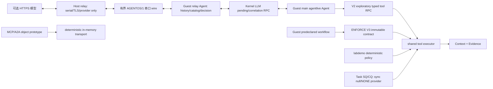

# 声明式执行合同、Agent Loop Substrate 与 Task Channel

本文描述 AgentOS-uCore 在既有 lifecycle、Workflow Credit Domain、Context Path 和 Evidence Ring 之上的执行边界：ENFORCE V3 immutable contract、Guest-owned exploratory model loop、Task Channel core，以及独立的 MCP/A2A 对象映射 prototype。它是架构附录，不替代赛题“任务六”确定性科研工作流的端到端验收说明。

## 1. 责任边界

Guest 用户态编排器负责理解目标、保存语义历史、生成/校验计划、选择并执行工具。可选 Host relay 只处理 QEMU 串口、TLS/API key 和 provider JSON；它不读取 Guest 业务文件、不选择或执行工具、不伪造 tool result。内核只接收紧凑、版本化、可确定验证的结构：

- workflow lifecycle、冻结的执行合同和节点依赖；
- tool manifest、schema digest、capability 和资源 envelope；
- Context sequence、provenance 标签、artifact 类型和 generation handle；
- deadline、retry、cancel、SQ/CQ 位置和单调 request id。

内核不读取自然语言含义，不判断文本是否为 prompt injection，不调用另一个 LLM 审核，也不在内核实现 JSON、HTTP、OAuth、JWS 或 A2A/MCP 远程传输。ENFORCE V3 把请求限制在已经冻结的节点和边；V1/V2 exploratory 请求仍受 capability、scope、schema 和工具参数检查，但不获得 frozen-DAG/provenance envelope。



四条路径不能互相代称：kernel LLM RPC 只做相关性；`agentlive` 才是模型主导 tool loop；`labdemo_ucore` 是不依赖 LLM 的 deterministic policy workflow；MCP/A2A prototype 既不连接 live relay，也不连接当前内核 Task SQ/CQ。

## 2. 声明式 Agent 执行合同

### 2.1 冻结结构

每个完整 lifecycle generation 最多拥有一份不可变合同。启用 `AGENT_EXECUTION_CONTRACT_F_ENFORCE` 后，V3 调用受该合同约束。合同最多 24 个节点，节点按拓扑顺序提交，`node_id` 必须等于数组下标；`predecessor_mask` 只能引用编号更小的节点。因此内核可以在不解析计划文本的情况下验证 DAG。

每个节点冻结：

| 字段 | 内核合同 |
| --- | --- |
| tool 与 schema | tool id 必须存在，32 字节 schema digest 必须与内核 manifest 一致 |
| dependency | predecessor mask、实际 source node 和 source Context sequence 必须一致 |
| authority | capability 不得弱于 manifest；side-effect mask 必须完整匹配 manifest |
| dataflow | accepted/output provenance 标签不得扩大 manifest 允许范围 |
| resource | exec/storage envelope 必须非零，并绑定 ordinary 或 reserved charge class |
| time | contract/node deadline 使用内核 tick 验证 |
| artifacts | 输入输出类型从固定 `NONE/BYTES/UTF8/JSON/FILE/MESSAGE/TASK/OPAQUE_HANDLE` 集合选择 |
| terminal policy | 最大 attempt、retry mask 和 cancel policy 在冻结后不能改变 |

合同创建、查询和 retire 通过版本 1 控制 ABI 完成。工具调用 V3 保留 V2 请求/响应的完整前缀，再附加 contract generation、node/attempt、source node/Context sequence、artifact 类型、schema digest 和 32 字节输入 fingerprint。在 ENFORCE 下，相同已完成节点的合法重试返回缓存的原终态，不重新产生工具副作用或第二条 Context。

### 2.2 副作用前的验证顺序

启用 ENFORCE 的 V3 合同调用按以下顺序推进：

1. 验证当前进程、完整 lifecycle generation 和 operation gate；
2. 验证 contract generation、node、attempt、deadline 和所有 predecessor；
3. 验证 tool/schema、capability、provenance 与声明的 side-effect mask；
4. 在副作用前预留可选择 ordinary/critical 分区的 Evidence ticket；
5. 原子建立并激活 Tool Phase Credit Lease；
6. 取得 effect fence 后执行工具；
7. 结算 phase，将输出标签写入 Context，并提交同一 ticket 的 Evidence；
8. 最后发布节点终态和幂等缓存。

ENFORCE V3 的结构拒绝、provenance 拒绝、deadline、取消和 phase 准入失败都在工具副作用前返回确定状态。外部效果开始后若无法形成与 Context/Evidence 关联的终态，内核不会伪造成功；这是实现中的不可恢复不变量失败，而不是可忽略的 telemetry 丢失。

### 2.3 Tool Phase Credit Lease

Phase Lease 不增加 workflow 的硬额度。它从 exec/storage 账户已经计入 U 的 credit 中锁定节点 envelope；锁定量仍属于 U，继续参与 `U+P+F` 硬限额和 fence 统计，但普通 release/transfer 不能在 phase 结束前消费它。

一次 phase 的状态为 `ADMITTED -> ACTIVE -> DEACTIVATED -> SETTLED`。分配器在发布对象前从锁定 U 取得带 nonce 的 claim：

```text
claim:   locked U -> claimed U
publish: claimed U -> live object U
refund:  claimed U -> locked U
settle:  unused locked U -> F
```

完成、失败、准入期取消或超时都会走单一结算路径。claim 没有发布时必须精确 refund；发布后的对象由其正常析构路径执行一次 `U -> F`。lease token 只有 32 字节，完整向量留在内核 registry。每个 lifecycle 的 lease 上限与 24 个合同节点一致；全局 claim 表有界，phase 持有期间线程不能跨越不允许的阻塞边界。

这不是按预测动态超卖资源。它解决的是工具调用短时峰值的原子所有权和及时归还问题，硬准入仍由 Workflow Credit Domain 执行。

## 3. Workflow 级 EEVDF

调度公平实体是 workflow resource domain，而不是线程。一个 workflow 创建更多线程只增加域内可运行候选，不会创建更多独立 CPU 公平份额。

调度器维护 workflow `vruntime`、lag、request size 和 virtual deadline：

- `vruntime <= global vtime` 的 workflow 才有资格；
- latency class 和当前 Agent event/deadline 可以缩短 service request，不能放大额度；
- eligible 集合中选择最早 virtual deadline；
- dispatch 后按实际 service cycles 给 workflow 记账；
- 睡眠 workflow 的 lag 向全局 virtual time 衰减，避免通过短睡眠重置欠账；
- 只有一个 workflow 时走常数时间 fast path；异常、身份不一致或容量外情况回退到原 legacy RR/Agent heuristic，并记录 fallback。

当前生产实体表总计最多同时跟踪 4 个活跃 workflow，与 lifecycle 活跃槽上限一致。测量 Guest 的 `BOOT_SEALED` bootstrap participant 已占用其中 1 槽，因此最多只能再创建 3 个 fresh workflow。1-way 只覆盖单实体 fast path；4-way 满容量公平性使用 bootstrap+3 fresh。线程放大场景比较 1 个 fresh 4-thread workflow 与 2 个 fresh single-thread workflow，同时保留 bootstrap peer，而不是比较 4 个 fresh lifecycle。

16 档是 16 个逻辑样本而非 16 个并发或独立 lifecycle：四波都复用同一个 bootstrap participant 一次，每波另建 3 个 fresh workflow，最终得到 4 次 bootstrap 观测和 12 个 fresh lifecycle 样本。不得把它写成 16-way 并发或每波 4 个 fresh。发布时应至少记录 Jain fairness、p50/p99 wakeup latency、deadline miss、资源峰值和普通进程对照；lifecycle info V3 还导出 lag、virtual deadline、dispatch/service、sleep decay、fallback、deadline miss 以及 `<=1/<=2/<=8/>8 tick` 唤醒直方图。评价中的唤醒直方图及 p50/p99 只聚合 fresh-agent 样本。Host scheduler model 可用独立抽象实体验证算法性质，但不代表 Guest 拥有额外 fresh lifecycle 槽或不同的并发拓扑。

该实现采用 Linux EEVDF 的 lag eligibility、virtual deadline 和睡眠 lag decay 概念，但实体、输入信号、容量和 fallback 都是 AgentOS-uCore 的 workflow 特定设计。

## 4. Context Provenance 数据流安全

### 4.1 固定标签

Context、查询结果、工具输出、Task resource 和跨 Agent 消息只使用六个固定来源标签：

| 标签 | 含义 |
| --- | --- |
| `KERNEL_FACT` | 内核产生或验证的事实 |
| `TRUSTED_USER_CONTROL` | 由可信 Guest 控制路径提交的控制结构；ENFORCE V3 还绑定冻结合同 |
| `AGENT_DERIVED` | Agent 计算或变换得到的数据；所有普通 Agent 输出至少含此标签 |
| `UNTRUSTED_FILE_DATA` | 文件查询或内容读取带入的数据 |
| `UNTRUSTED_TOOL_OUTPUT` | 外部工具返回的数据 |
| `CROSS_AGENT_DATA` | 内核 IPC 或 mailbox 带入的数据 |

标签是保守 OR 传播，不是机密级别，也不表示文本已经被内容分类器“判定安全”。rollback/clear 恢复对应 Context 节点的标签；IPC 队列和 mailbox 将标签与消息 payload 同步交付，防止只复制数据而丢失来源。

### 4.2 Manifest 与调用授权

每个 tool manifest 声明 accepted input labels、output-added labels、required capability 和完整 side-effect mask。ENFORCE V3 的外部副作用调用必须同时满足：

```text
current lifecycle generation
AND frozen contract/node/schema
AND exact declared predecessor/Context sequence
AND process capability
AND manifest/contract provenance policy
AND exact side-effect declaration
```

不可信文件或跨 Agent 消息可以影响模型输出，但在 ENFORCE V3 中不能自己增加合同节点、改变依赖边、扩大 capability 或把未声明副作用伪装成纯计算。非法调用在副作用前返回 `DENIED`，并把来源 sequence、目标 tool、拒绝 reason、完整 lifecycle key 和 ticket 写入 critical Evidence Ring；如果关键证据无法预留，受保护调用不继续执行。V1/V2 legacy/exploratory admission 不提供这一冻结边保证。

`send_message`、`llm_request`、`llm_response` 单独使用 Agent-Loop accepted mask，允许 control 加 file、untrusted-tool-output、cross-Agent 来源进入消息循环；原污点仍进入输出 Context，capability、route、schema 和 effect gate 不变，其他副作用工具的 accepted mask 不放宽。MESSAGE/LLM event cause 使用该次调用已递增的当前 call count。

CaMeL 提供了“可信控制流与不可信数据流分离”的研究启发，IPIGuard 提供了按预先规划 Tool Dependency Graph 限制计划外调用的启发。AgentOS-uCore 的边界更窄：内核只验证固定标签、DAG、capability 和 generation，不运行 prompt-injection 检测器或 LLM guard。

## 5. Agent Loop substrate 与 Task 接口

### 5.1 Task Channel 内存与队列布局

每个 Agent 进程按需建立一个 single-issuer channel，共计费 4 个 Agent state/physical page：

| 页 | 用户映射 | 内容 |
| --- | --- | --- |
| SQ | read/write | 16 个 128 字节 SQE 与 ring header |
| CQ | read-only | 16 个 128 字节 CQE 与 ring header |
| request private | 不映射 | 权威 head/tail、request 状态、issuer 与 deadline |
| resource private | 不映射 | typed resource、generation、digest、owner 与 provenance |

setup 绑定 main thread 的 thread identity generation、进程和完整 workflow lifecycle。只有该 issuer 可以 enter/resource；exec/exit/reclaim 使用同一 lifecycle gate 和资源记账迁移或释放这 4 页。

用户先写 SQE，再通过 enter 提交单调 tail。内核消费前一次性复制完整 128 字节描述符，此后只验证私有副本，避免共享页 TOCTOU。验证覆盖 ring/slot generation、严格递增 request id、contract/node/attempt、tool/schema、deadline、link/cancel flags 和输入 handle。CQ 只由内核写，用户通过经过范围验证的 ack 推进 head。

队列满时设置 backpressure/CQ-full；共享计数、slot generation 或 head/tail 不一致时进入 sticky resync。issuer 必须显式 enter `RESYNC`，内核根据私有权威状态重建可见 header，不能用用户提供的水位跳过尚未确认的 completion。

### 5.2 exactly-once 与取消

一个已接受的目标 request 只有一个 terminal winner 和一个 CQE。`CANCEL` 是引用 `link_request_id` 的控制命令，不产生第二个 cancel CQE：

- 尚未跨越 effect fence 时，cancel 可以成为该目标的 `CANCELLED` 终态；
- effect 已开始时返回 too-late/denied，原执行仍负责唯一终态；
- timer IRQ 只设置 `DEADLINE_DUE`，并在可能时唤醒 generation-matched issuer；hard deadline 到该进程第一个可调度 safe point 才结算，不在 IRQ 中执行重型清理；
- CQ 暂满只延迟可见性，不重新执行工具或产生第二终态；
- reclaim 等待 callback/lifecycle 引用释放，不能先释放 channel page 再等待异步完成。

每条可见 CQE 都关联 contract/node/request、Context sequence 和 Evidence ticket。公共 `completion_tick` 由 bridge 在执行结果确定后采样，表示执行后完成时刻，不是工具服务开始时刻。这里的 exactly-once 是“内核接受的 request 只发布一个终态 CQE”，不是对任意远程服务或设备副作用提供分布式 exactly-once；外部 provider 是否可中断、是否幂等仍由用户态和 tool manifest 负责。

### 5.3 Typed resource handle

ABI 已冻结 16 字节 `{slot, type, flags, generation}` handle，私有表容量为 8，generation/owner/digest/provenance 重验逻辑也已实现。当前发布切片没有用户态 typed-object import 或结果 payload backend：`RESOURCE_IMPORT` fail closed，当前 provider 只接受 null input，CQE `result` 也为 null；`OWNED/BORROWED` 目前是为后续 backend 保留的 ABI 词汇，而不是已开放的 payload 能力。

这个设计只借鉴 WIT resource 的 owned/borrowed handle 词汇，以及 WASI 0.3 `future<T>` 将异步值与完成分离的接口思想。项目没有嵌入 Wasm runtime、Canonical ABI 或 WIT binding generator，也不宣称与 WASI 二进制兼容。Task core 可以表达 `PENDING`，但当前 provider 同步执行，只接受 null input 并返回 artifact `NONE`；没有业务 payload backend，也不承载模型 prompt/response。

### 5.4 Guest-owned model tool loop

`agentlive` 把 [Anthropic tool-use loop](https://platform.claude.com/docs/en/agents-and-tools/tool-use/how-tool-use-works) 与 [Claude Code agentic loop](https://code.claude.com/docs/en/how-claude-code-works) 中“模型建议结构化调用、应用执行工具、结果回到下一轮”的公开模式落到 Guest 用户态。Guest relay Agent 持有 system prompt、有界多轮 whole-turn history、rich tool catalog、round/correlation 并校验模型建议；空间不足时只丢弃最旧的完整 `tool_use`/`tool_result` 对。Guest main Agent 执行获准的 typed 工具并产生真实 Context/tool result。内核与 Host 都不替 Guest 做这些语义决定，main Agent 也不直接读写 Host 串口。

Guest main 与 relay Agent 之间的 `LLM_REQUEST/LLM_RESPONSE` 进入内核 pending registry。pending 绑定完整 lifecycle、requester/relay control id/PID、correlation 和 deadline；correlation 对同 requester 严格递增，只有 request 实际投递且 pending 发布后才推进。只有原 relay 的匹配响应能消费一次。120 秒 kernel-tick TTL 在 request/response/tick 路径回收。容量为 `NPROC` 的有界 terminal history 只在记录仍保留时区分已消费 `STALE` 与已过期 `TIMEOUT`；覆盖后旧 response 按 unmatched 返回 `DENIED`。公开 exec/teardown 清理 pending、last correlation 和 history。这是 correlation RPC，不是模型 API、HTTPS、MCP 或 remote exactly-once。

Host relay 把 provider-neutral JSON 转成 OpenAI、DeepSeek 的 OpenAI-compatible Chat Completions 或 Anthropic Messages HTTPS，并把实际模型输出规整为单个 `tool_use` 或 `final`。API key/TLS 只在 Host；Host 不读 Guest 业务文件、不选或执行工具，也不伪造 result。它只可临时维护 provider opaque tool-call id 到 correlation id 的协议关联；多个并行 tool call fail closed。DeepSeek 默认使用官方 `deepseek-v4-flash` 与 non-thinking tool mode。后者是必要的协议边界：当前 Guest transcript 保存可复验的 `tool_use`/`tool_result`，不保存或回送 DeepSeek thinking mode 要求跨工具轮次携带的 `reasoning_content`。

串口 wire 使用 session、双向严格递增 sequence、kind、decoded length、SHA-256 与有界 base64url JSON；offline replay 也必须经过相同的 QEMU 串口、frame/session/sequence/hash/round/token 边界，不能直接注入 Guest 状态。replay 验证协议与 loop，但不是 live 云模型实测。当前不宣称流式 token、自动 retry/redirect、任意长上下文或敌对 Host 下的密码学认证。

adaptive live loop 使用 V2 typed `uint64`/string exploratory RPC，并由 Guest 把每轮参数压平到内核共享执行器。V3 是另一条可选的 immutable high-assurance envelope：只能调用预先冻结的 node/tool/edge，适合固定计划或预冻结节点池，不把它描述为模型可以任意改变工具序列的 adaptive loop。

### 5.5 MCP/A2A object-mapping prototype

`host_tools/mcp_a2a_gateway.py` 是 HTTP-neutral、标准对象形状的用户态映射 prototype：

- MCP `2026-07-28`：`tools/list`、`tools/call` 与 experimental task 方法的对象映射；
- A2A v1：message send/get/cancel 与 Task/Context/Message/Artifact 状态对象映射；
- deterministic `InMemoryTaskChannelTransport` 保存 prototype lifecycle/request/state；
- version、issuer/tenant/subject 与 schema/output 形状在对象层验证，外部 schema 不能替代内核 manifest。

该 prototype 没有 HTTP binding、MCP server、A2A Agent Card/discovery、OAuth/JWS、streaming、网络重连/重放防护、真实内核 SQ/CQ adapter 或经外部实现验证的互操作。它与 live HTTPS model relay 独立，测试只证明本仓库对象/状态机映射。

## 6. 兼容性

- `agent_run()` 接受最多 64 个 compact `agent_op`，在一次 syscall 内顺序同步执行；它不是 V2 typed-KV、parallel 或 non-blocking batch。scalar V2 的 `uint64`/string typed 参数压平为 `arg0/arg1/64-byte payload`，用于 legacy/exploratory admission。
- V3 request/response 保留完整 V2 ABI 前缀。lifecycle info V3 保留 64 字节 V2 前缀，旧 `version=2, size=64` 查询仍可读取原字段。
- Task Channel 是新增的按需接口，不要求现有程序预先分配 4 页。
- EEVDF 只接管完整且容量内的 workflow domain；异常时回退现有调度器，普通进程仍走原 RR 路径。
- execution contract、Task Channel 和 provenance 状态都绑定完整 generation；旧 slot、request id 或 handle 不能命中新对象。

## 7. 验证与性能消融

```bash
make agent-live-demo-check
make agent-live-demo
```

`agent-live-demo-check` 运行 Guest/Host 静态集成与协议单测，不代替动态行为；`agent-live-demo` 默认使用 `ci/agent-live-replay.jsonl`，让 6 轮响应经过实际 QEMU 串口，并要求 discovery、工具/拒绝结果、`passed` 和唯一顶层 `agentlive_ucore: parent passed` marker。Windows xPack 环境可追加 `TOOLPREFIX=riscv-none-elf-`。真实 provider 仍需显式选择；key 只能由 Host 从受限单行文件或环境变量读取，未运行时不声称云模型结果。

DeepSeek live 入口为 `AGENT_LIVE_PROVIDER=deepseek make agent-live-demo`。Make 自动探测仓库外的 `../deepseek_api.txt` 与 `../计算机操作系统能力竞赛/deepseek_api.txt`，否则回退 `DEEPSEEK_API_KEY`；也可显式设置 `AGENT_LIVE_API_KEY_FILE`、`AGENT_LIVE_MODEL` 或 `AGENT_LIVE_ENDPOINT`。key 文件内容不成为命令行参数，不进入 Guest 或 relay 日志。官方 endpoint、模型与 tool-call 格式见 [DeepSeek API 文档](https://api-docs.deepseek.com/quick_start/pricing)与[工具调用指南](https://api-docs.deepseek.com/guides/tool_calls)。

当前 `agenttask_ucore` 固定比较现有 `agent_run()` batch、contract-bound scalar V3 和 SQ/CQ 三条语义对照路径，每条执行 16 次空 `ECHO` 并产生 output artifact `NONE`。三者的线格式并不相同：batch 使用清零的 `agent_op`；scalar V3 为工具 schema 显式携带三个必需 typed params，即 `payload=""` string、`arg0=0` uint64、`arg1=0` uint64；SQ/CQ 使用 null input handle。Guest 验证相同的 OK/tool/Context-proof/evidence-proof/zero-result fingerprint；legacy batch 的 evidence-proof 来自 Context record hash，两个 contract-bound 路径使用 Evidence ticket，不能据此声称三者的 Evidence 表示相同。

调用点 `syscalls` 依次为 1、16、2；两个 `agent_info` 边界 observer、序列后的 16 次 Context 查询，以及 lifecycle/contract/channel setup 都排除在该数值外。描述符 ABI 与已知复制范围分别是 batch `16 * (104 + 120) = 3584` 字节、scalar V3 `16 * (200 + 280 + 3 * 96) = 12288` 字节、SQ/CQ `16 * (128 + 128) = 4096` 字节。scalar 另列 `16 * 8 = 128` 字节 dispatch header；SQ/CQ 两次 enter 另列 control ABI `2 * (64 + 104) = 336` 字节和已知 control copy `2 * (64 + 2 * 104) = 544` 字节。它们是由 Guest 调用点和冻结结构大小计算的确定记账，不是内核路径 syscall counter、实测总复制量或全部内存流量。

延迟字段也有严格边界：每条成功操作的 Context record `tick` 表示内核在工具效果前采样的 service start，而不是完成时刻或 CPU service 量。`service_start_interval_tick_p50/p99` 是这 16 个 pre-effect tick 间隔的 nearest-rank 分位数，首个间隔以序列开始处的 `agent_info` tick 为原点；序列后的 Context 查询只取回这些既有记录，不计入 elapsed。`sequence_elapsed_ticks` 来自开始和结束两个 `agent_info` 边界，包含 start-return/end-entry 边界开销，不是 wall clock 或 raw cycles。公共 CQE `completion_tick` 仍在执行结果确定后采样，Guest 不把它改解释为 service start。

当前 cancel 数字只覆盖 `scope=retained_terminal`：对仍保留唯一 CQE 的已完成目标提交一次幂等 cancel，以两个 `agent_info` tick 记录一次 enter 的边界延迟，并验证 CQE 不变且不产生第二个 cancel CQE。同步 `ECHO` provider 不提供 pending/running cancel latency。CQ-full backpressure 和 sticky resync 在该 Guest 中是功能恢复断言，不是 raw-cycle 性能结论。

ENFORCE V3 安全专项使用 deterministic adversarial fixture，把不可信文件/跨 Agent 来源与计划外高权限动作组合，验收非法调用在副作用前 `DENIED` 且 critical Evidence 可查询，而合同内固定 DAG 仍完成。它验证结构 gate，不证明模型没有受到 prompt injection，也不是 live 模型演示。赛题主演示 `labdemo_ucore` 同样使用 deterministic policy，以便离线重复与 plain/AgentOS 比较；可选 `agentlive` 才连接 live/replay model loop。

调度评价使用 1、4、16 三档：1 是单实体 fast path，4 是 bootstrap+3 fresh 的满容量 cohort，16 是四波复用同一 bootstrap 并累计 12 个 fresh lifecycle 的逻辑样本。线程放大场景是 1 个 fresh 4-thread workflow 对 2 个 fresh single-thread workflow 加 bootstrap peer；唤醒直方图只含 fresh-agent 样本。资源评价同时记录 phase 前/峰值/结算后 U/P/F、拒绝稳定性和普通进程开销。静态/model checker 通过不替代 `agent_eevdf_ucore` 等 QEMU Guest 的实际运行。

## 8. 明确不宣称

- 不在内核规划自然语言、选择工具或判断 prompt injection；
- 不支持超过 24 个节点的单合同，也不支持一个 lifecycle 同时替换为第二份合同；
- 不支持 16 个同时活跃的 EEVDF workflow；当前总上限是 bootstrap participant 加最多 3 个 fresh workflow，合计 4 个；
- 不提供无限队列、无限 resource slot 或无界 Context/Evidence；
- hard deadline/cancel 是 effect-fence 与 safe-point 语义；不可中断睡眠或 provider 停滞会延后终态，没有 wall-clock completion bound；
- exactly-once CQE 不等于远程副作用的分布式 exactly-once；
- 当前 Guest 不报告 raw cycles、wall-clock latency 或真正 running/pending provider 的 cancel latency；
- typed handle ABI 不等于完整 Wasm/WASI runtime，当前也不提供 payload import/result backend；
- core 有 `PENDING`/callback/reclaim 状态机，但当前 provider 同步执行，尚无 provider registration/completion syscall；
- 当前 Task provider 只接受 null input/output `NONE`，没有业务 payload backend，也不承载 model wire；
- Host relay 不是 Agent、planner 或 tool executor，不提供并行多工具、token streaming、自动重试/重定向或 remote exactly-once；
- offline replay 不是 live 云模型结果，尽管它经过相同有界 wire；
- MCP/A2A 模块只是 deterministic in-memory 对象映射 prototype，不是 server、streaming transport、已验证互操作或真实内核 SQ/CQ adapter；
- Evidence Ring 和合同状态都是当前启动周期的内存状态；fence receipt 只陈述本次运行中的可见 cut。

## 9. 参考来源与原创边界

- [Linux EEVDF documentation](https://docs.kernel.org/scheduler/sched-eevdf.html)：lag eligibility、virtual deadline 与睡眠 lag decay。
- [io_uring(7)](https://man7.org/linux/man-pages/man7/io_uring.7.html)：共享 Submission Queue/Completion Queue 的通信分工。
- [WIT reference](https://component-model.bytecodealliance.org/design/wit.html) 与 [WASI 0.3 async, streams and futures](https://component-model.bytecodealliance.org/design/async.html)：typed resource ownership 和异步值接口词汇。
- [AgentCgroup, arXiv:2602.09345](https://arxiv.org/abs/2602.09345)：Agent tool-call 级资源波动与峰均比测量。
- [Murakkab, arXiv:2508.18298](https://arxiv.org/abs/2508.18298)：声明式 workflow 与执行配置/SLO 分离。
- [CaMeL, arXiv:2503.18813](https://arxiv.org/abs/2503.18813)：可信控制流与不可信数据流分离。
- [IPIGuard, arXiv:2508.15310](https://arxiv.org/abs/2508.15310)：计划 Tool Dependency Graph 对计划外调用的约束。
- [Anthropic tool use](https://platform.claude.com/docs/en/agents-and-tools/tool-use/how-tool-use-works) 与 [Claude Code agentic loop](https://code.claude.com/docs/en/how-claude-code-works)：模型请求工具、应用执行并回灌结果的公开 loop 模式。
- [MCP 2026-07-28 normative specification](https://modelcontextprotocol.io/specification/2026-07-28) 与 [draft Tasks extension](https://tasks.extensions.modelcontextprotocol.io/specification/draft/tasks)：tool 与实验性 Task 对象映射。
- [A2A latest specification](https://a2a-protocol.org/latest/specification/)：Task、Context、Message、Artifact 与 cancel 对象形状。

上述仅为公开思想与协议形状参考。AgentOS-uCore 的合同 ABI、24-node DAG、Phase Lease、workflow generation、provenance enforcement、Evidence 绑定、Task ring/handle 和网关映射均为本仓库 clean-room 实现；没有 vendoring 上述项目的源码、二进制或数据集。许可与完整披露见 [../../NOTICE](../../NOTICE)。
