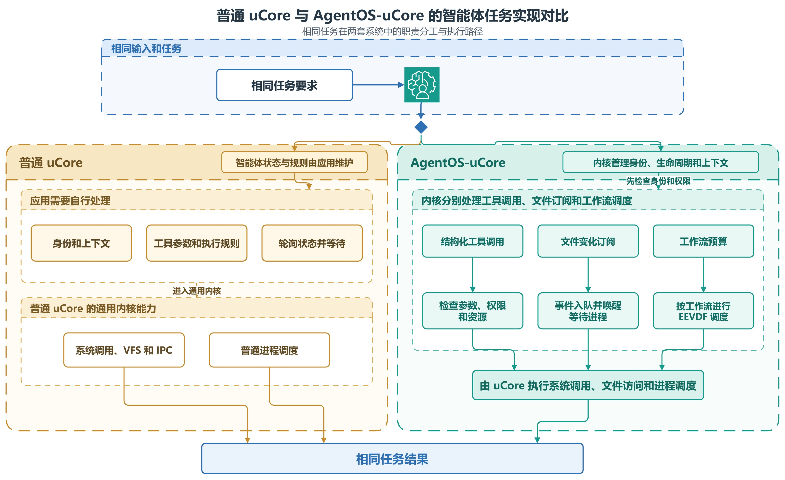

# AgentOS-uCore 系统架构

AgentOS-uCore 建立在 RISC-V uCore 之上。进程、虚拟内存、文件系统、IPC、调度器和设备 I/O 仍由 uCore 负责。我们沿这些内核对象的现有路径加入智能体身份、运行上下文、结构化工具、文件状态、事件处理、资源账户和工作流调度。同一次任务中的多个进程由此共用一套身份、状态和资源管理办法。

## 文档索引

- [一、要解决的问题](#一要解决的问题)
- [二、总体架构](#二总体架构)
- [三、uCore 中的接入位置](#三ucore-中的接入位置)
- [四、AgentOS 对象](#四agentos-对象)
- [五、主要功能模块](#五主要功能模块)
- [六、一次工具请求如何执行](#六一次工具请求如何执行)
- [七、用户态运行库与应用](#七用户态运行库与应用)
- [八、源码位置与检查方法](#八源码位置与检查方法)

## 一、要解决的问题

一个智能体工作流通常包含多个进程、多轮模型调用、结构化工具、共享文件和后台事件。这类程序给内核带来了三个新问题：

1. 委派任务时，身份和权限会逐步收紧。内核必须确认执行进程、可信映像、文件访问范围和本次工作流确实相互对应。
2. 工具输出会继续成为后续工具、文件操作或跨智能体消息的输入。系统需要记录每一步的起因、调用跨度、分支和数据来源。
3. 进程退出、工作流关闭和槽位再次使用会涉及进程表、页表、VFS、等待队列和调度器。各子系统必须按同一个生命周期停止新操作并回收旧对象。

普通 uCore 应用可以在用户态编写这些逻辑，但每个应用都要重复维护，内核也无法替应用保证跨子系统的原子性。AgentOS 把身份校验、上下文、文件订阅、资源记账和工作流调度做成通用内核功能。模型协议和交互界面仍留在用户态和宿主机。当前系统运行于单 Hart RISC-V64 客户机，同时最多维护 4 个正在运行的工作流。相关容量定义在 [`os/workflow_lifecycle.h`](../os/workflow_lifecycle.h) 和 [`os/agent.h`](../os/agent.h)。

<p align="center">
  
</p>

**图 1　普通 uCore 与 AgentOS-uCore 的智能体任务实现对比**

图中对比了同一类智能体程序的两种实现方式。普通 uCore 只提供进程、内存、文件和基础 IPC，应用需要自行实现身份、上下文、工具检查、文件轮询和资源统计。AgentOS-uCore 在内核中提供这些通用能力，应用只负责具体任务和工具逻辑。原生图源见 [`plain_agentos_comparison.drawio`](figures/architecture/plain_agentos_comparison.drawio)。

## 二、总体架构

AgentOS-uCore 分为四层。最下层是 uCore 基础内核，其上是接入进程、VFS、等待队列和调度器的 AgentOS 模块。再往上是版本化 UAPI、客户机运行库和宿主机中继，最上层是 Agent Live、Nexus 和科研工作流应用。主架构图见项目 [README](../README.md#23-总体架构)，本篇按图中层次说明各模块的关系。

| 层次 | 主要组成 | 作用 |
| --- | --- | --- |
| 智能体应用 | `agentlive_ucore`、`agentnexus_ucore`、科研工作流 | 拆分目标、安排角色、调用工具并汇总结果 |
| 用户态运行库 | 客户机 UAPI、任务通道（SQ/CQ）、串口帧、TLS 和模型适配器 | 把应用动作编码成内核请求，并连接外部模型服务 |
| AgentOS 内核模块 | 身份、生命周期、上下文、执行约定、文件实时查询、事件、资源、EEVDF、阶段快照 | 检查工作流操作，保存状态，负责等待唤醒，并生成阶段记录 |
| uCore 基础内核 | 进程与线程、页表、VFS、IPC、时钟、调度、VirtIO | 提供 RISC-V 操作系统的基础对象和运行环境 |

四层之间通过带版本号的结构体传递数据。客户机封装集中在 [`user/include/agent.h`](../user/include/agent.h)。执行约定、生命周期、数据来源、资源、任务通道、工具和阶段快照的固定布局位于 [`include/`](../include/)。内核收到用户指针后会重新复制数据，并检查结构长度和版本号。

## 三、uCore 中的接入位置

AgentOS 沿 uCore 对象原有的生命周期接入：进程创建或执行新映像时更新身份，建立页表时映射上下文，VFS 修改 inode 时更新文件状态，线程睡眠或唤醒时更新等待状态，调度切换时结算 CPU 时间。

| uCore 路径 | AgentOS 加入的处理 | 主要源码 |
| --- | --- | --- |
| 进程创建、`fork`、`exec`、`exit` | 创建工作流根进程和工作进程，发布身份，转交控制关系，映射上下文，退出时清理 | [`os/proc.c`](../os/proc.c)、[`os/vm.c`](../os/vm.c)、[`os/exec_policy.c`](../os/exec_policy.c) |
| 系统调用入口 | 分派 UAPI，检查用户内存，登记生命周期中的操作，执行工具和阶段快照 | [`os/syscall.c`](../os/syscall.c)、[`os/agent_core.c`](../os/agent_core.c) |
| VFS 与 inode | 检查动态访问范围和可信映像，区分 inode 实例代次，维护元数据和编辑租约 | [`os/file.c`](../os/file.c)、[`os/vfs_security.c`](../os/vfs_security.c)、[`os/agent_metadata_actions.c`](../os/agent_metadata_actions.c) |
| IPC 与等待队列 | 消息路由、事件队列、心跳，以及按线程代次进行的无丢失唤醒 | [`os/agent_ipc.c`](../os/agent_ipc.c)、[`os/wait.c`](../os/wait.c)、[`os/timer.c`](../os/timer.c) |
| 调度与时钟 | 判断工作流能否运行，比较虚拟截止时间，统计 CPU 周期和唤醒等待 | [`os/proc.c`](../os/proc.c)、[`os/workflow_scheduler.c`](../os/workflow_scheduler.c)、[`os/trap.c`](../os/trap.c) |
| 内存与存储资源 | 预留和发布资源额度，失败时归还，记录工具执行期间占用的资源，关闭账户并取得准确快照 | [`os/resource_controller.c`](../os/resource_controller.c)、[`os/workflow_credit_domain.c`](../os/workflow_credit_domain.c)、[`os/fs.c`](../os/fs.c) |

uCore 仍负责对象的创建和运行。AgentOS 为这些对象补充工作流身份、权限、因果记录、资源用量和阶段状态。

## 四、AgentOS 对象

### 4.1 生命周期键

AgentOS 使用 `{id, generation}` 标识一次工作流。`id` 是有界表中的槽位编号，槽位再次投入使用时，`generation` 会递增。智能体、上下文、文件订阅、执行约定、资源账户、任务通道、调度对象和阶段快照都保存完整的键，旧句柄因此不会误指向下一次运行。

```c
struct workflow_lifecycle_key {
    uint id;
    uint64 generation;
};

static inline int key_equal(struct workflow_lifecycle_key a,
                            struct workflow_lifecycle_key b)
{
    return a.id == b.id && a.generation == b.generation;
}
```

该结构定义在 [`os/workflow_lifecycle.h`](../os/workflow_lifecycle.h)。查找槽位时，内核同时比较 `used`、`id` 和 `generation`。公开 ABI 中的对应结构固定为 16 字节，见 [`include/agent_lifecycle_abi.h`](../include/agent_lifecycle_abi.h)。

### 4.2 进程状态与工作流状态

| 对象 | 保存的主要状态 | 保留时间 |
| --- | --- | --- |
| `struct proc` | 智能体编号、角色、能力位、控制关系、访问范围、上下文页、资源账户和事件队列 | 随进程创建、`exec` 和 `exit` 变化 |
| `workflow_lifecycle_record` | 访问范围、代次、控制进程、成员、普通操作数、退出操作数和快照暂停标记 | 从根进程创建持续到最后成员与后台工作结束 |
| `agent_context_record` | 序号、请求编号、起因、调用跨度、分支、工具、状态、哈希和来源标记 | 每个智能体保留最近 128 条 |
| 文件元数据项 | inode 身份、实例代次、业务字段、索引项和目录代次 | 随 VFS 更新，在访问范围或生命周期回收时删除 |
| `workflow_scheduler_entity` | `vruntime`、虚拟截止时间、CPU 周期、可运行线程数和唤醒指标 | 随工作流建立和释放 |
| 执行记录段 | 普通槽、关键槽、缺口、前一段根哈希和封存后的根哈希 | 按工作流保留，由阶段快照封存 |

生命周期记录分别统计普通操作和退出操作。工具、`fork` 和元数据更新开始时增加普通操作数，进程退出和异步清理则增加退出操作数。生成阶段快照前，内核暂停接纳这两类新操作，并等待已有操作完成。最后一个成员离开后，记录进入关闭和回收状态。各模块用同一个生命周期键释放对象，全部结束后槽位才能再次使用。

## 五、主要功能模块

### 5.1 身份、生命周期与上下文

可信引导进程调用 `agent_workflow_create()` 创建工作流根进程。同一工作流中，具有 `AGENT_CAP_ORCHESTRATE` 能力位的智能体可以调用 `agent_worker_create()`，指定工作进程映像和能力上限。最终能力取角色策略、映像清单、父进程委派、目标工作流和文件访问范围的交集。控制关系使用不能转让的 `control_id`。控制进程退出时先进入静止状态，再转交或撤销子控制关系。

每个智能体固定映射 7 页上下文。前 6 页由内核写入，包含页头、最近响应和记录区，用户态只能读取。第 7 页由用户态缓存派生数据。另有 9 页内核附加区，保存规范化的操作与结果、路径索引、执行者和来源状态。写入时，内核先填好附加区，再把发布序号改为奇数，随后更新公开记录、最近响应和页头，最后将发布序号恢复为偶数。直接读取上下文的程序据此判断是否遇到并发写入。详细设计见[身份、生命周期与上下文](modules/identity-context.md)。

### 5.2 结构化工具与数据路径

工具接口包括 V1、带类型信息的 V2、ENFORCE V3、紧凑批处理和 16 槽任务通道（SQ/CQ）。V2 按工具登记的参数格式检查请求。V3 继续检查固定执行图、前置节点、尝试次数、截止时间、输入指纹和资源上限。调用入口先核对智能体身份与生命周期，再解析工具和参数。登记普通操作后，内核继续检查能力位、执行约定、数据来源和本次执行占用的资源。文件写入在 VFS 真正执行时还会再查一次当前访问范围。

这样，应用中的一次工具调用被拆成内核能够逐项核对的数据。实现与调用示例见[工具执行](modules/tool-execution.md)，公共布局见 [`include/agent_tool_abi.h`](../include/agent_tool_abi.h)、[`include/agent_execution_contract_abi.h`](../include/agent_execution_contract_abi.h) 和 [`include/agent_task_channel_abi.h`](../include/agent_task_channel_abi.h)。

### 5.3 文件实时查询

元数据目录只收录应用显式登记的文件，并为 `status`、`stage`、`kind` 建立等值索引。查询器依次检查 `status`、`stage`、`kind`，选择第一个可用索引。返回前再核对完整查询条件、访问范围、生命周期、inode 实例代次和目录代次。带类型信息的文件订阅保存查询条件及其代次。目录更新时，内核比较修改前后的成员集合，产生 `ENTER`、`UPDATE` 或 `LEAVE` 事件。事件出现缺口后，应用先安装替代订阅，再读取未截断的有界快照，以此重新建立基线。

这套机制让工作流能够按业务状态查找文件，并在文件进入或离开结果集合时收到通知。目录、索引、事务和订阅的实现见[文件实时查询](modules/live-query.md)。

### 5.4 事件、资源、EEVDF 与阶段快照

文件变化、跨智能体消息、心跳、截止时间和模型完成都进入事件队列，并由 `agent_wait()` 取出。内核在同一次关中断期间复查队列和登记等待者，等待键使用线程身份代次。事件接力标记每次只唤醒一个实际接收者。队列总容量为 16，其中一部分槽位留给内核事件和不同来源的事件。

工作流资源账户以空闲、预留、已用三种状态记录资源。外层工作流 EEVDF 使用固定等权调度对象，延迟等级与实际截止时间决定 1、2、4 或 8 个时钟滴答的 CPU 时间申请。当前可以运行的工作流中，虚拟截止时间最早者先执行。工具和上下文的最终状态写入工作流执行记录环，控制进程可以取得文件元数据代次、准确资源快照和记录根哈希。完整流程见[工作流运行时](modules/workflow-runtime.md)。

## 六、一次工具请求如何执行

以 ENFORCE V3 请求为例，客户机从 [`user/include/agent.h`](../user/include/agent.h) 调用 `tool_call_v3()`。系统调用由 [`os/syscall.c`](../os/syscall.c) 分派，再由 [`os/agent_core.c`](../os/agent_core.c) 执行工具。主要步骤如下：

```text
客户机提交请求
  -> 复制固定头和变长字段
  -> 检查 version 和 struct_size
  -> 匹配智能体身份与工作流 {id, generation}
  -> 解析工具编号或名称，按登记格式解码参数
  -> 登记工作流中的普通操作
  -> 匹配执行约定和前置节点
  -> 检查能力位、数据来源和系统改动范围
  -> 锁定本次工具执行所需的资源额度
  -> 执行工具，VFS 修改继续检查文件访问范围
  -> 停用并结算本次资源额度
  -> 提交输出来源、上下文和最终执行记录
  -> 完成约定节点，结束普通操作
  -> 向客户机返回响应
```

操作尚未生效便失败时，状态码直接说明原因，已经预留的资源和记录槽位会退回。操作生效后，最终上下文记录和执行记录在同一提交过程中发布，避免出现“文件已改、记录未写”的中间状态。

一条完整工作流按以下顺序运行：

1. 引导进程创建工作流根进程，内核分配生命周期键、动态文件访问范围和资源账户。
2. 具有 `AGENT_CAP_ORCHESTRATE` 能力位的智能体，按可信映像和能力上限创建同一生命周期内的工作进程。
3. 各智能体发布上下文，登记文件元数据，安装文件订阅或执行约定。
4. 智能体通过 V2、V3、批处理或任务通道（SQ/CQ）执行工具，并处理文件、消息和定时事件。
5. 工作流 EEVDF 在多个工作流之间分配 CPU 时间。选中工作流后，仍由 uCore 选择具体线程。
6. 控制进程在阶段结束时生成快照回执，随后关闭各成员。
7. 最后一个成员和后台任务结束后，生命周期收尾程序回收订阅、队列、执行资源和调度对象，普通访问范围随之回收。标记 `preserve_on_retire` 的持久输出会保留登记信息、文件和存储费用，同时解除与旧生命周期代次的绑定。

## 七、用户态运行库与应用

内核 ABI 只传递结构化状态和系统操作，具体模型服务的协议由宿主机处理。`agentlive_ucore` 通过串口帧发送模型请求，接收工具调用，并把最终状态写入上下文。[`host_tools/agentos_relayd.py`](../host_tools/agentos_relayd.py) 负责 TLS、模型服务 JSON 和本地运行目录。更换模型服务时无需修改内核 ABI。

`agentnexus_ucore` 在一个工作流中创建协调、系统观察、资料检索和分析四个智能体。它们拥有独立 PID、身份和上下文，通过内核 `MESSAGE`、带类型信息的任务和工作流内结果文件协作。协调智能体读取各专门角色的结果，再安排下一阶段。客户机主程序见 [`user/src/agentnexus_ucore.c`](../user/src/agentnexus_ucore.c)，运行流程与命令见[工作流运行时](modules/workflow-runtime.md)和[运行指南](usage.md)。

## 八、源码位置与检查方法

| 目录 | 内容 |
| --- | --- |
| [`os/`](../os/) | AgentOS 内核模块及其 uCore 接入点 |
| [`include/`](../include/) | 内核与客户机共用的版本化 ABI 和资源策略 |
| [`user/`](../user/) | 客户机封装、回归程序、智能体循环和 Nexus 应用 |
| [`host_tools/`](../host_tools/) | 串口协议、模型中继、控制台和宿主机测试 |
| [`scripts/`](../scripts/) | 静态结构检查、QEMU 回归、故障测试和日志校验 |
| [`one_shot_metrics/`](../one_shot_metrics/) | 固定的逐样本数据、提取器、校验器和绘图入口 |

模块依赖、UAPI 布局和完整客户机回归分别由以下命令检查：

```bash
make agent-module-check
make agent-uapi-check
make agentos-test TOOLPREFIX=riscv64-linux-gnu-
make full-verify TOOLPREFIX=riscv64-linux-gnu-
```

身份对象的建立过程见[身份、生命周期与上下文](modules/identity-context.md)。工具、文件和运行时分别见[工具执行](modules/tool-execution.md)、[文件实时查询](modules/live-query.md)和[工作流运行时](modules/workflow-runtime.md)。
