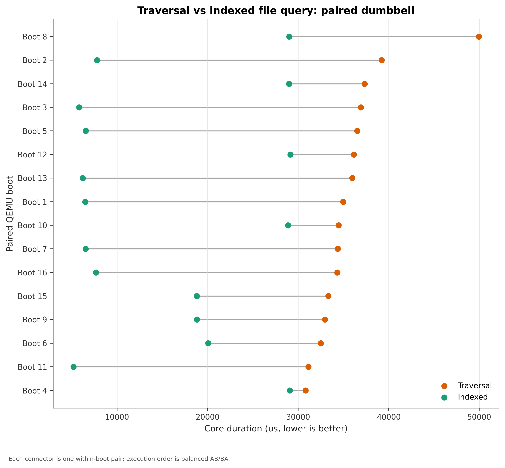
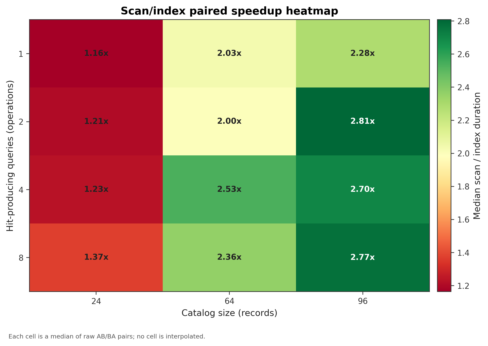
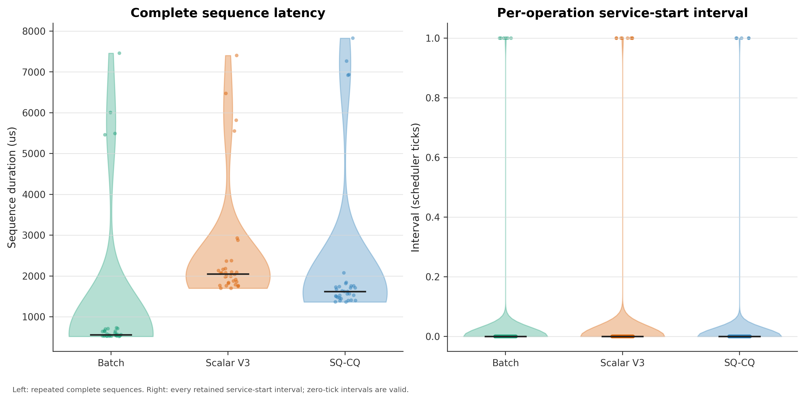
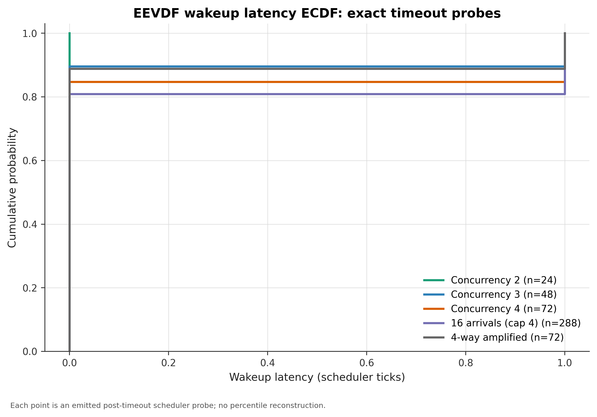

# 实测性能结果

我们在同一源码提交上完成了 30 次 fresh QEMU boot。indexed core path 在 16/16 个 traversal/indexed 配对中更快，配对加速比中位数为 3.118x；Task 与 EEVDF 专项实验同时保留逐序列、逐操作和逐唤醒原始记录。

本页只使用 [one-shot campaign](../../one_shot_metrics/README.md) 的实测数据。campaign 已写入 [`COMPLETED`](../../one_shot_metrics/data/20260811/COMPLETED)，不会进入 CI、默认回归或再次采集。

## 实验环境

| 项目 | 记录值 |
| --- | --- |
| 源码提交 | `2b14fb1f74b9bd093e6de939a16554620835699e` |
| 运行环境 | WSL2，Linux `6.6.114.1-microsoft-standard-WSL2`，x86_64 Host |
| Guest | RISC-V64 `virt`，单 Hart |
| 编译器 | `riscv64-linux-gnu-gcc 15.2.0` |
| QEMU | `10.2.1` |
| Python | 采集/提取 `3.14.4`，绘图 `3.11.9` |
| campaign 时间 | 2026-08-11 00:27:57–01:03:08 UTC |
| 验证结果 | `valid=true`，`ready=true`，0 error，1 项串口完整性 warning |

环境、命令、Guest 镜像哈希和文件清单记录在 [manifest](../../one_shot_metrics/data/20260811/manifest.json)。[validation.json](../../one_shot_metrics/data/20260811/validation.json) 校验了 schema、配对关系、参数网格和图表输入。

## 采集方法

| 实验 | QEMU boot | 单 boot 设计 | 保留数据 |
| --- | ---: | --- | --- |
| 综合 traversal/indexed | 16 | AB/BA 交替；同一 96-record corpus 内配对 | 16 个配对、32 条 path 记录及内核 I/O 计数 |
| AgentEval suite | 4 | hit count 为 1/2/4/8；file-query grid 每个 `catalog × hit` 单元 15 个 AB/BA 配对 | 全 suite 1,560 条样本、780 个配对，其中 grid 为 180 个配对 |
| Agent Task | 4 | 每个 boot 对 batch/scalar V3/SQ-CQ 各运行 8 轮，顺序轮换 | 96 条序列、1,536 条逐操作 interval |
| workflow EEVDF | 6 | 并发度、线程放大和唤醒 probe 场景 | 180 条 workflow 样本、504 条 exact wake probe |

配对实验报告配对差值和配对比值的中位数。参数热力图以每格 15 个 AB/BA 配对的中位数着色，不补齐或推算缺失单元。Task 图保留每条 sequence；wakeup ECDF 使用每条 exact probe；Jain fairness 由同一 boot、同一并发场景下各 workflow 的原始 `service_cycles` 重新计算：

\[
J(x_1,\ldots,x_n)=\frac{(\sum_i x_i)^2}{n\sum_i x_i^2}.
\]

## 查询路径：索引缩短 core 区间

同一 boot 中，两条路径返回相同的 `recovered` 结果和结果哈希。traversal 检查 97 条记录，indexed 检查 2 条。

| 指标 | Traversal | Indexed | 配对结论 |
| --- | ---: | ---: | --- |
| core duration 中位数 | 34,712.5 us | 13,293.5 us | indexed 在 16/16 boot 中更快 |
| paired core delta | - | - | indexed − traversal 中位数 `-23,441.5 us` |
| paired speedup | - | - | traversal / indexed 中位数 `3.118x` |
| end-to-end 中位数 | 711,283.5 us | 723,928.0 us | indexed 仅在 3/16 个配对中更快；paired delta 中位数 `+13,452 us` |

AB/BA 顺序分层后，`indexed_then_traversal` 的加速比中位数为 1.454x，`traversal_then_indexed` 为 5.481x。16/16 的方向保持一致，加速幅度仍受顺序和热状态影响。

core 区间覆盖查询、恢复写入、`fsync` 和结果复核。end-to-end 进一步包含文件创建、metadata 登记、综合 workflow 和清理。本轮结论限定为 indexed 缩短 workflow core path；end-to-end 窗口未显示整体加速。



逐 boot 数值见 [`contest_paired.csv`](../../one_shot_metrics/data/20260811/tables/contest_paired.csv)，原始 contest 输入见 [`measurements.csv`](../../one_shot_metrics/data/20260811/raw/contest/measurements.csv) 和[串口日志目录](../../one_shot_metrics/data/20260811/raw/contest/)。

## 参数网格：catalog 增大后索引收益上升

下表给出每个完整实测单元的 scan/index duration 中位比值。每格包含 15 个 AB/BA 配对。

| Catalog size | 1 hit | 2 hits | 4 hits | 8 hits |
| ---: | ---: | ---: | ---: | ---: |
| 24 | 1.164x | 1.207x | 1.231x | 1.371x |
| 64 | 2.032x | 1.995x | 2.534x | 2.361x |
| 96 | 2.283x | 2.808x | 2.704x | 2.772x |

12 个单元的中位加速比范围为 1.164x–2.808x。完整网格同时用于二维热力图和三维曲面；曲面连接全部实测参数点，没有替代缺失实验。



逐配对数据见 [`agenteval_pairs.csv`](../../one_shot_metrics/data/20260811/tables/agenteval_pairs.csv)。

## 工具路径：batch 延迟最低

每条 sequence 包含 16 个操作。4 个 boot 各保留 8 轮，得到每条路径 32 个序列样本。

| 路径 | 样本数 | duration 中位数 | IQR |
| --- | ---: | ---: | ---: |
| batch | 32 | 561.0 us | 533.75–663.0 us |
| scalar V3 | 32 | 2,051.0 us | 1,833.0–2,226.0 us |
| SQ/CQ | 32 | 1,620.5 us | 1,472.0–1,755.5 us |

batch 在当前同步 16-op 工作量中减少 syscall 次数，序列中位延迟最低。SQ/CQ 的价值还包括固定队列合同、terminal CQE 和 resync；本轮数据不把这些语义折算为延迟收益。



序列与逐操作数据见 [`task_sequences.csv`](../../one_shot_metrics/data/20260811/tables/task_sequences.csv) 和 [`task_operations.csv`](../../one_shot_metrics/data/20260811/tables/task_operations.csv)。

## 调度：wakeup 集中在 0–1 tick

504 条 exact wake probe 中，425 条为 0 tick，79 条为 1 tick，没有右删失样本。并发度 1–4 的 fairness 由每个 workflow 的原始 service cycles 计算。

| 并发 workflow | Boot 数 | Jain fairness 中位数 |
| ---: | ---: | ---: |
| 1 | 6 | 1.000000 |
| 2 | 6 | 0.999985 |
| 3 | 6 | 0.999993 |
| 4 | 6 | 0.999985 |



exact probe 与 service 数据见 [`eevdf_wakeups.csv`](../../one_shot_metrics/data/20260811/tables/eevdf_wakeups.csv) 和 [`eevdf_samples.csv`](../../one_shot_metrics/data/20260811/tables/eevdf_samples.csv)。

## 四项关键限制

1. **平台范围**：全部数据来自同一套 WSL2 + QEMU RISC-V64 单 Hart 环境。绝对微秒值和 scheduler tick 不能直接外推到裸机、SMP 或其他 QEMU 版本。
2. **实验单位**：16 个综合样本来自独立 boot；AgentEval 每个 hit count 只有一个 boot，格内 15 个 AB/BA 配对属于 boot 内重复；Task 的 32 个路径样本来自 4 boot × 8 轮。统计和图注保留这些层级。
3. **计数范围**：workflow core 与 end-to-end 是两个计时窗口。I/O 热力图中的部分内核计数器和 workload 分母也跨 owner/scope/window，只用于同口径描述，不用于单进程 I/O 因果归因。
4. **采集语义**：分组图的 first retained scan 位于显式 warmup 之后，不代表物理 cold cache。EEVDF boot 05 有 3 条 sample summary 被串口拼接，验证器已标记并从 histogram derivation 排除；504 条 exact wake probe 完整保留。

## 原始数据与重绘

- [完整图表说明与 10 组图](../agentos/advanced-performance-figures.md)
- [19 张 CSV 表](../../one_shot_metrics/data/20260811/tables/)
- [33 个原始文件](../../one_shot_metrics/data/20260811/raw/)
- [campaign manifest](../../one_shot_metrics/data/20260811/manifest.json)
- [validation report](../../one_shot_metrics/data/20260811/validation.json)

无需重新启动 QEMU 即可复核表结构并重绘现有数据。输出写入仓库外的 scratch 目录，冻结的 canonical validation 与 figures 保持不变：

```bash
python one_shot_metrics/validate.py \
  --tables one_shot_metrics/data/20260811/tables \
  --output ../agentos-20260811-reproduced/validation.json

python one_shot_metrics/plot.py \
  --tables one_shot_metrics/data/20260811/tables \
  --output-dir ../agentos-20260811-reproduced/figures \
  --format png,pdf
```
