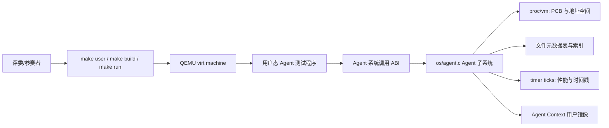
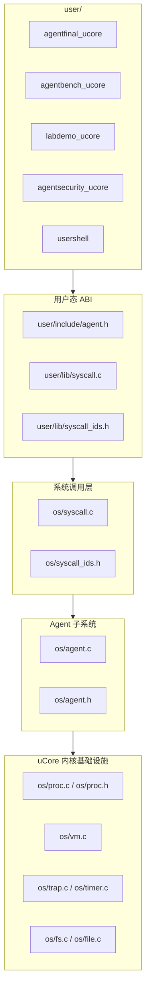
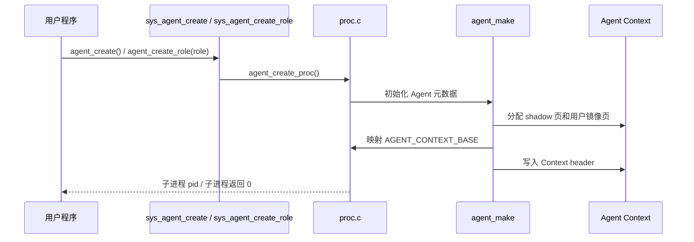
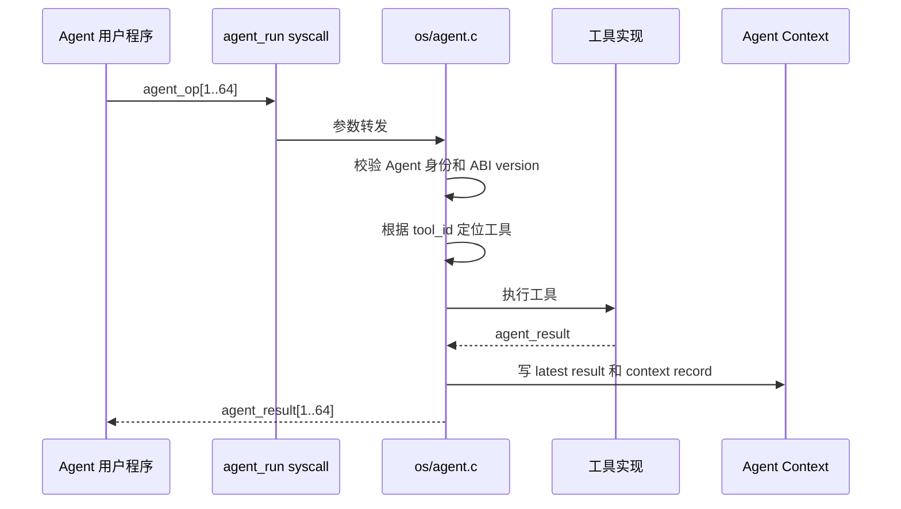
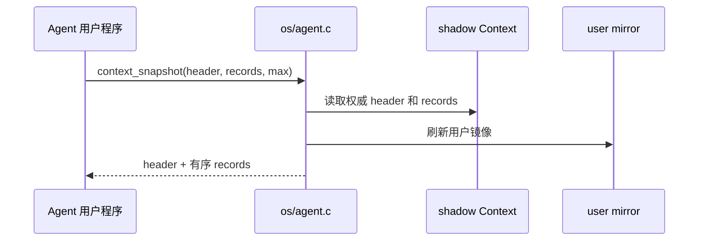
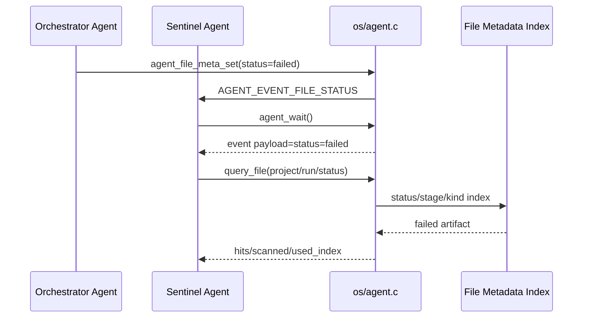
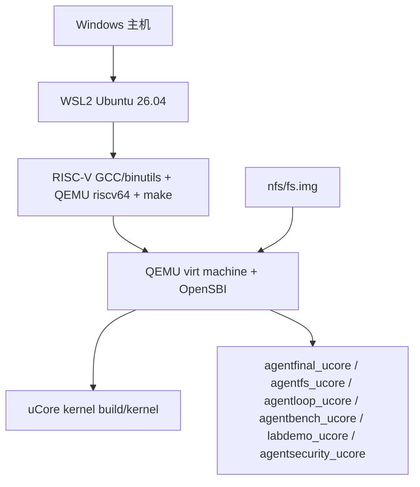

# Agent-OS 主设计文档

本文是 uCore 分支的主设计文档。结构参考 ISO/IEC/IEEE 42010、IEEE 1016 和 arc42，并按操作系统内核项目评审需要裁剪。

## 1. 引言与目标

### 1.1 系统目标

本项目基于 uCore 教学操作系统，在内核中加入面向 AI Agent 的支持层，使内核能够识别 Agent 进程、提供结构化内核工具调用、维护 Agent 多轮调用上下文路径，并支持面向 Agent 的文件元数据查询、事件队列等待/唤醒和实验流水线故障恢复演示。

uCore 分支的目标不是简单复刻旧版实现，而是在保留任务一至三语义的前提下，提高内核结构、批量执行能力、上下文可信性、演示完整度和文档可验收性。

### 1.2 利益相关方和关注点

| 角色 | 关注点 |
| --- | --- |
| 竞赛评委 | 是否能在 QEMU 中稳定运行；是否完成赛题基础任务；设计是否清晰、有创新点、有验证证据 |
| 开发者 | Agent 子系统是否模块化；系统调用 ABI 是否稳定；后续任务四、五、六是否容易继续扩展 |
| 用户态 Agent 程序 | 是否能用结构化接口请求内核工具；是否能高速读取 Context 镜像；是否能在需要可信历史时使用 snapshot |
| 操作系统内核 | 是否保持普通进程兼容性；是否控制地址空间、锁、生命周期和错误路径 |
| 演示和答辩材料 | 是否能把底层 syscall 串成一个评委容易理解的多 Agent 场景 |

### 1.3 质量目标

| 优先级 | 质量目标 | 可验证方式 |
| ---: | --- | --- |
| 1 | 稳定性 | `agentfinal_ucore`、`agentbench_ucore`、`labdemo_ucore`、`agentsecurity_ucore` 均通过且无 kernel panic |
| 2 | 可验收性 | 每个赛题要求能追踪到实现、测试和文档 |
| 3 | 模块化 | Agent 逻辑集中在 `os/agent.c`，系统调用层只做分发和参数传递 |
| 4 | 性能 | 批量工具调用、用户态直接读 Context、批量 Context Snapshot、文件索引查询 |
| 5 | 可扩展性 | 文件元数据字段、`agentos:event`、Context Path、Loop 状态、工具表可继续扩展到最终 LLM Gateway 和可视化大屏 |

## 2. 约束

| 类型 | 约束 |
| --- | --- |
| 基底系统 | uCore 教学操作系统，RISC-V 64 |
| 运行环境 | QEMU virt machine，OpenSBI 默认启动 |
| 开发环境 | 已验证 WSL2 Ubuntu 26.04；通用要求为 Linux、RISC-V GCC/binutils、QEMU riscv64、make、git |
| 编译工具链 | 已验证 `riscv64-linux-gnu-`；Makefile 可接受 `riscv64-unknown-elf-` |
| 兼容性 | Agent 交付以 `CHAPTER=agent` 为验收主路径；补充验证 `trace` 和普通进程 mail 等代表性基础 syscall；Agent syscall 使用 500 起的扩展编号 |
| 当前范围 | 任务一至五增强实现；任务六提供可运行综合演示 |
| 当前限制 | 未实现后台线程持续扫描整棵目录、云端 LLM Gateway、宿主机可视化大屏 |

## 3. 上下文与范围

### 3.1 系统上下文

### 3.2 当前范围

| 范围 | 状态 |
| --- | --- |
| Agent 进程创建、标记和信息查询 | 已实现 |
| Agent Context 固定用户虚拟地址区 | 已实现，当前为 5 页共享上下文区 |
| 结构化工具调用和工具列表 | 已实现，最终热路径为 `agent_run` 批量 ABI |
| 工具调用自动写入 Context Path | 已实现 |
| Context Path 手动 push/query/rollback/clear/snapshot | 已实现 |
| 文件元数据表、真实 inode 关联、属性查询、索引查询、`.agentmeta` 持久化 | 已实现 |
| Agent Loop 心跳、等待、唤醒 | 已实现 16 槽事件队列、watch/unwatch、事件唤醒、heartbeat 事件、timeout |
| 代表性 uCore 基础 syscall | 已实现 `trace`、`mailread`、`mailwrite` |
| 综合场景 | 已实现 `labdemo_ucore` 综合演示 |
| LLM Gateway 和可视化大屏 | 未实现，已通过结构化事件输出预留解析契约 |

## 4. 解决方案策略

| 策略 | 说明 |
| --- | --- |
| Agent 子系统模块化 | 把 Agent 逻辑集中在 `os/agent.c` 和 `os/agent.h`，避免分散在基础系统调用文件中 |
| 高性能 ABI | 最终热路径使用 `agent_op` / `agent_result` 和 `agent_run()`，一次 syscall 最多执行 64 个 op |
| shadow 权威 Context | Agent Context 扩为 5 页，内核保存 shadow 权威页和用户镜像页，写入时先更新 shadow 再同步镜像 |
| 用户态可读 Context | latest result 和历史路径同步到用户镜像，Agent 可直接读取，避免每次都系统调用查询；可信历史通过 shadow 和 snapshot 保证 |
| 环形 Context Path | 固定容量 128 条短文本摘要记录，超长 FIFO 覆盖，记录 `oldest/latest/dropped/rollback` 元信息 |
| 批量 Snapshot | `context_snapshot()` 一次返回 header 和按时间顺序排列的可见路径 |
| 文件查询引擎 | Agent 子系统维护 128 条文件元数据，主键使用 `dev + inum`，提供扫描路径、status/stage/kind 索引路径和 `.agentmeta` 隐藏元数据文件 |
| Agent Loop | 每个 Agent 有 16 槽 FIFO 事件队列和最多 8 条 watch，等待文件状态、消息和 heartbeat 事件，支持 timeout |
| 内核角色与能力绑定 | `struct proc` 保存真实 `agent_role` 和 capability mask，敏感工具和 syscall 只按内核字段授权，不信任用户态传入的 role |
| 结构化事件 | `labdemo_ucore` 输出 `agentos:event type=... key=value`，为最终大屏和 LLM Gateway 保留解析契约 |
| 测试驱动验收 | 用 `agentfinal_ucore` 做任务一至三功能验证，用 `agentfs_ucore` 验证文件系统 metadata，用 `agentloop_ucore` 验证事件队列，用 `agentbench_ucore` 做性能验证，用 `labdemo_ucore` 做综合场景验证，用 `agentsecurity_ucore` 做权限限制负向验证 |

## 5. 构件视图

### 5.1 一级模块

### 5.2 源码映射

| 构件 | 文件 | 职责 |
| --- | --- | --- |
| 用户态 ABI 声明 | `user/include/agent.h` | 暴露 Agent 结构体、常量和 syscall 原型 |
| syscall wrapper | `user/lib/syscall.c` | 封装 `agent_create`、`agent_run`、`context_snapshot` 等用户态调用 |
| syscall 编号 | `user/lib/syscall_ids.h`、`os/syscall_ids.h` | 注册 500 到 520 的 Agent syscall 编号 |
| syscall 分发 | `os/syscall.c` | 根据 syscall id 调用 Agent 内核函数 |
| Agent ABI 与常量 | `os/agent.h` | 定义结构体、工具 ID、状态码、Context 布局 |
| Agent 核心逻辑 | `os/agent.c` | Agent 初始化、工具执行、Context Path、文件元数据、事件等待 |
| PCB 和生命周期 | `os/proc.h`、`os/proc.c` | 保存 Agent 元数据，处理 create/exit 和 Context 释放 |
| 时钟事件 | `os/trap.c`、`os/timer.c` | 定时调用 `agent_tick()`，支持 heartbeat 和 timeout |
| 最终功能验收 | `user/src/agentfinal_ucore.c` | Agent 创建、5 页 Context、批量工具调用、短文本历史、`context_detail()`、snapshot、FIFO、事件 |
| 文件系统测试 | `user/src/agentfs_ucore.c` | 真实文件 inode 绑定、字段清空、删除清理、`.agentmeta` 写入、scan/index 差异、不存在 selector |
| Agent Loop 测试 | `user/src/agentloop_ucore.c` | FIFO 顺序、队列满、多 watch、unwatch、timeout、heartbeat wake/stop |
| 性能基准 | `user/src/agentbench_ucore.c` | scalar run、batch run、direct Context、query/snapshot、文件查询、timeout/heartbeat、wait/wake 计时 |
| 综合演示 | `user/src/labdemo_ucore.c` | 三 Agent 故障诊断、文件查询、事件唤醒、受控恢复和报告 |
| 权限限制测试 | `user/src/agentsecurity_ucore.c` | 普通进程直接敏感调用、sentinel 伪造 role、recovery 幂等恢复 |
| 构建脚本 | `scripts/run-agent-tests.sh` | 顺序运行六项最终验证 |

## 6. 运行视图

### 6.1 Agent 创建

### 6.2 结构化工具调用

### 6.3 Context Snapshot

### 6.4 文件查询和 Agent Loop

## 7. 部署视图

## 8. 横切概念

### 8.1 ABI 版本和布局检查

`AGENT_CALL_VERSION` 和 `AGENT_CONTEXT_VERSION` 用于区分用户态请求协议和 Context 布局。当前 `AGENT_CONTEXT_VERSION = 3`。Context header、latest result 和 128 条 `agent_context_record` 放入 5 页 Agent Context，其中 record 区从第 1 页开始。

### 8.2 地址空间隔离

只有 Agent 进程会安装 Agent Context 特殊映射和对应 metadata。普通进程调用 Agent-only syscall 时返回错误。Agent Context 固定在 trapframe 下方，用户态 ABI 中定义为 `AGENT_CONTEXT_BASE`。该地址对每个 Agent 是相同虚拟地址，但映射到不同的物理页。当前实现保证 Agent Context 特殊页不可执行；普通用户程序其他页面仍按当前 uCore 装载方式映射，不宣称全局 W^X。

### 8.3 shadow 权威历史

Agent Context 分为两份：

- `agent_shadow_kva[5]`：内核私有权威页，用户态不能直接访问；
- `agent_ctx_kva[5]`：用户态镜像页，用于直接读取最新结果和历史摘要。

用户态写坏镜像页不会改变 `context_query()`、`context_snapshot()` 或 `context_detail()` 返回的权威历史。`context_snapshot()` 会把 shadow 内容刷新到用户镜像页。短摘要 record 之外的完整 `agent_op + agent_result + flags` 保存在最近 128 条 detail ring 中，由 `context_detail()` 查询。

### 8.4 错误语义

Agent-only syscall 对普通进程、非法参数、未知工具、历史节点不存在、空间不足、等待超时、权限拒绝和重复恢复动作返回明确状态码。错误码详见 [api.md](api.md)。

### 8.5 并发和事件

Agent Loop 使用进程字段保存 8 条 watch、16 槽 FIFO 事件队列、等待次数、超时次数和心跳信息。`agent_wait()` 优先消费队列中的事件；没有事件时，有限 timeout 走定时等待路径，无限等待可进入睡眠；`agent_wake()`、文件状态变化和消息工具可以唤醒目标 Agent。时钟中断调用 `agent_tick()` 处理 timeout deadline 和 heartbeat 到期。

### 8.6 角色与能力

Agent 的真实角色保存在内核 `struct proc.agent_role` 中，能力保存在 `agent_capability_mask` 中。`agent_create()` 默认只创建最低权限 sentinel；pid 1 的普通 init 以及 pid 1 的直接普通子进程只能通过 `agent_create_role(AGENT_ROLE_ORCHESTRATOR)` 创建 orchestrator；具备 `AGENT_CAP_ORCHESTRATE` 的 Agent 才能创建 recovery、investigator、sentinel 等其他角色。

敏感授权不读取用户态传入的 role。`capability_check`、`rerun_stage`、`write_report`、文件元数据写入和事件投递都按当前进程真实 capability 判断。因此 sentinel 即使把 `agent_op.arg0` 填成 recovery，也不能获得恢复或写报告能力。

`labdemo_ucore` 中普通 init 只启动 orchestrator Agent；文件元数据初始化、失败注入和子 Agent 创建都由 orchestrator 发起。`agentsecurity_ucore` 专门覆盖普通进程直接调用 `agent_wake()`、`agent_file_meta_init()`、`agent_file_meta_set()` 失败，pid 1 直接子进程启动 orchestrator，初始化前索引查询，legacy tool mismatch，sentinel 伪造 recovery 被拒绝，以及多 run 定向恢复。

### 8.7 性能

性能优化集中在四个方面：

1. `agent_run()` 将最多 64 个工具操作合并为一次 syscall。
2. 工具 ID 查找避免热路径字符串扫描。
3. 用户态可直接读取 Context 镜像中的 header 和 latest result。
4. `context_snapshot()` 一次返回多条有序历史，避免逐条 query。

文件查询性能通过扫描路径和索引路径对比体现。当前索引覆盖 `status`、`stage` 和 `kind`。

## 9. 架构决策

| 决策 | 选择 | 理由 | 取舍 |
| --- | --- | --- | --- |
| Agent 创建方式 | 使用 `agent_create()` 兼容创建 sentinel，使用 `agent_create_role()` 创建指定角色 Agent | 与 uCore 现有进程模型结合直接，且能把 role/capability 绑定到内核 PCB | 暂未支持用户态自定义配额或任意 capability 组合 |
| Context 地址 | 固定高地址 `AGENT_CONTEXT_BASE`，当前 5 页 | 便于用户态直接定位，并给 Context Path 和 detail ring 留出容量 | 每个 Agent 固定占用 5 页 |
| 工具协议 | 最终热路径为 `agent_op` / `agent_result` | 比字符串键名协议更紧凑，适合批量执行 | 工具名说明通过工具表提供 |
| Context Path 容量 | 固定 128 条环形记录，每条包含 16 字节 payload/result 短文本摘要，并用 `context_detail()` 保存最近 128 条完整请求/响应 | 可证明 FIFO 淘汰，同时保留可审计详情 | 更长历史需要后续持久化 |
| 工具查找 | ID 直接定位，legacy name 兼容 | 最终性能路径避免字符串扫描 | 工具 ID 需要保持稳定 |
| 批量执行 | `agent_run()` 一次最多 64 个 op | 减少 syscall 次数，提高端到端吞吐 | 单个 op 错误通过 result 表达 |
| 文件查询实现 | 采用 Agent 子系统元数据表、`dev + inum` 主键和 `.agentmeta` 隐藏元数据文件 | 关联真实 uCore 根目录文件，同时保留属性查询和索引优化 | 尚未实现后台线程持续扫描整棵目录 |
| Agent Loop | watch/unwatch/wait/wake/heartbeat 独立 syscall | 等待事件不放进 batch 热路径，行为更清晰 | 后续仍需优先级和取消等待 |
| 基础 syscall 兼容 | 实现 `SYS_trace=410`、`SYS_mailread=401`、`SYS_mailwrite=402` | 满足代表性 uCore 基础测试和普通进程消息接口 | 不把当前工作扩大成全部 chapter 的完整兼容验收 |
| 演示日志契约 | 输出 `agentos:event type=... key=value` | 后续大屏和 LLM Gateway 不需要重写核心演示程序 | 当前仓库尚未实现宿主机大屏 |
| 文档结构 | 主设计文档 + API/验证/追踪 + 分任务附录 | 满足架构说明、关键决策、测试和运行说明 | 文档数量增加，需要维护一致性 |

## 10. 质量要求与验证

| 质量要求 | 当前证据 |
| --- | --- |
| Agent 进程可创建并初始化 PCB 字段 | `agentfinal_ucore` |
| Agent Context 可直接读取 | `agentfinal_ucore` |
| 至少 3 个结构化工具可调用 | `agentfinal_ucore` 批量调用 echo，`labdemo_ucore` 调用多种任务四/五工具 |
| Context Path 支持 5 轮以上连续调用 | `agentfinal_ucore` 连续写入 192 个 op |
| Context Path 保留短文本摘要 | `agentfinal_ucore: short_text_history=1` |
| 路径超长自动淘汰 | `agentfinal_ucore` 验证 128 容量 FIFO |
| 有性能数据 | `agentbench_ucore` 输出吞吐表 |
| 文件属性查询、inode 关联和索引 | `agentfinal_ucore`、`agentfs_ucore`、`agentbench_ucore`、`labdemo_ucore` |
| Agent Loop 等待、超时、心跳和唤醒 | `agentfinal_ucore`、`agentloop_ucore`、`agentbench_ucore: timeout_heartbeat=1`、`labdemo_ucore` |
| 综合场景 | `labdemo_ucore: passed` |
| 权限不能由用户态伪造 | `agentsecurity_ucore: passed` |
| 代表性 uCore 基础 syscall | `ch3_trace`、`agentsecurity_ucore: mail_basic=1` |

详细验证见 [verification.md](verification.md) 和 [test-record.md](test-record.md)。

## 11. 风险和后续需要补充的内容

| 风险 | 影响 | 后续处理 |
| --- | --- | --- |
| Context Path 容量和文本长度固定 | 只能保留最近 128 条记录，且 payload/result 各保留 16 字节摘要 | 后续可引入持久化、分页上下文或完整日志 |
| `agentbench_ucore` 使用 tick 计时 | 分辨率较粗，短路径差异不明显 | 增加循环次数或补充更细粒度计数机制 |
| 文件查询尚未由后台线程持续扫描整棵目录 | 当前用真实文件 inode 绑定、显式元数据更新和 `.agentmeta` 隐藏元数据文件 | 后续可扩展目录扫描任务和增量更新 |
| Agent Loop 缺少优先级和取消等待 | 当前能验证 FIFO 队列、wait/wake/heartbeat、timeout 和 unwatch | 后续扩展事件优先级、取消等待和调度策略 |
| LLM Gateway 未接入 | 当前只有结构化事件和工具结果 | 后续实现宿主机 LLM Gateway 和 schema 校验 |
| 可视化大屏未实现 | 当前只能看 QEMU 串口输出 | 后续解析 `agentos:event` 构建大屏 |

## 12. 术语表

| 术语 | 含义 |
| --- | --- |
| Agent 进程 | 被内核标记并分配 Agent Context 的特殊进程 |
| Agent Context | Agent 用户地址空间中的固定镜像区域，用于高速读取响应和上下文路径；权威状态在内核 shadow 页 |
| Context Path | Agent 多轮工具调用或手动上下文节点组成的历史路径；当前实现为 128 条短文本摘要记录 |
| 工具调用 | Agent 通过结构化请求调用内核提供的能力 |
| 文件元数据表 | Agent 子系统维护的实验工件属性表，服务任务四查询优化 |
| Agent Loop | watch、wait、wake、heartbeat、event delivery 和 timeout 组成的 Agent 事件运行机制 |
| agentos:event | shell 输出中的稳定键值事件格式，供后续大屏和 LLM Gateway 解析 |
| ABI | 用户态和内核态共同遵守的结构体、常量和系统调用约定 |
