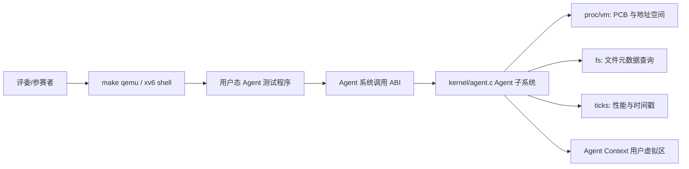
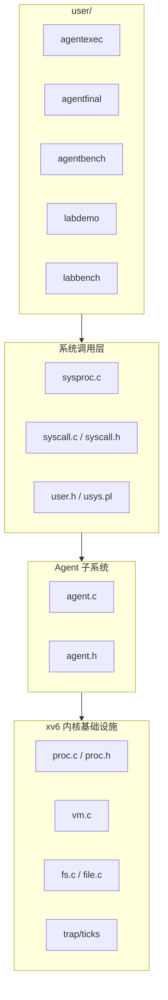
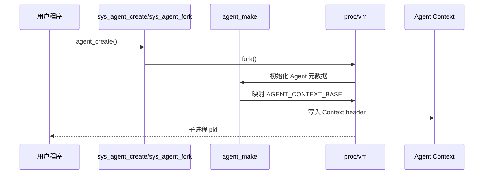
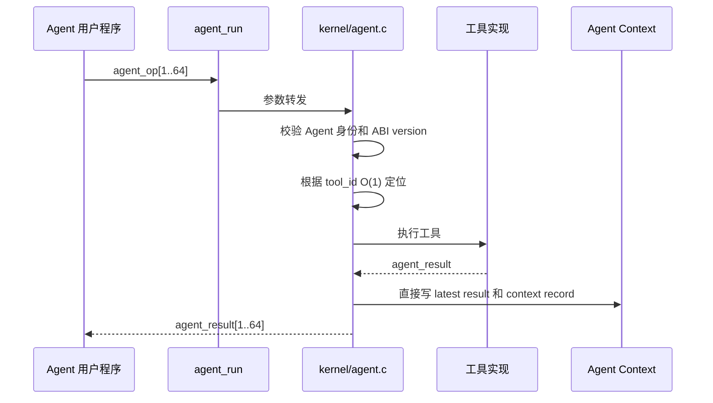
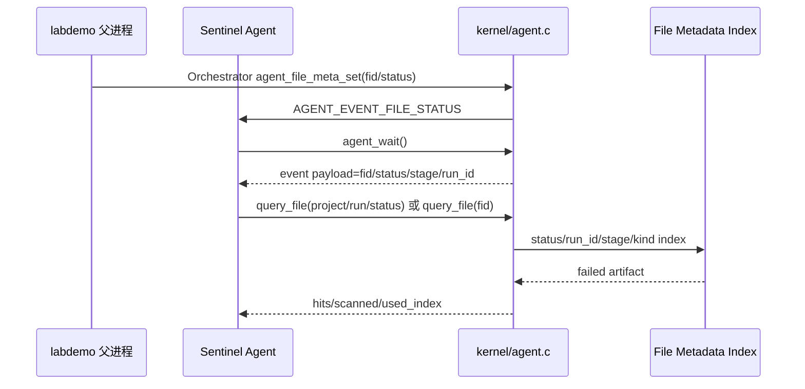
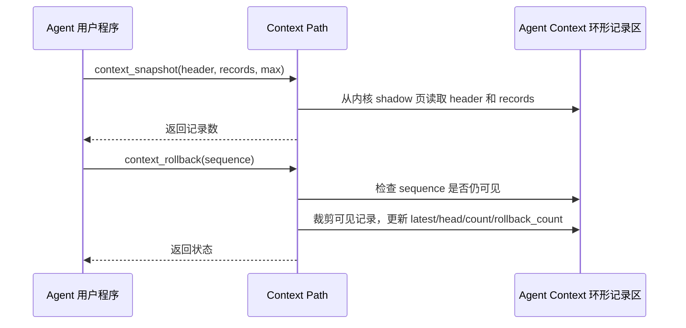
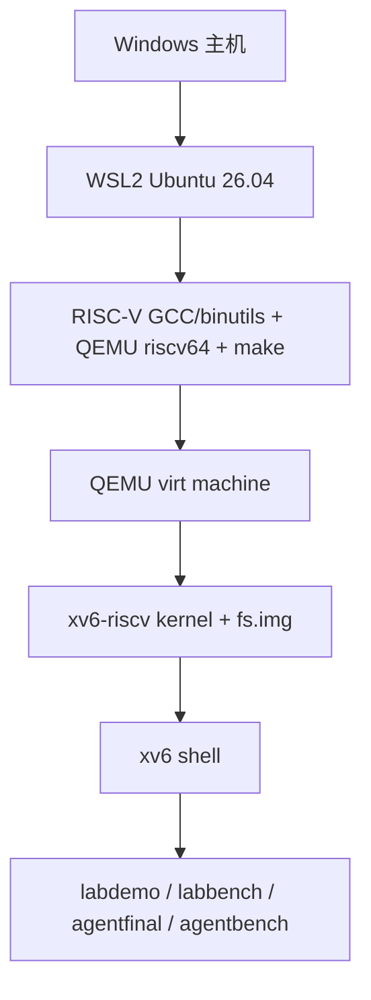

<!-- SPDX-License-Identifier: CC-BY-SA-4.0 -->

# Agent-OS 主设计文档

本文是项目的主设计文档。结构参考 ISO/IEC/IEEE 42010、IEEE 1016 和 arc42，并按操作系统内核项目评审需要裁剪。

## 1. 引言与目标

### 1.1 系统目标

本项目基于 xv6-riscv，在教学操作系统内核中加入面向 AI Agent 的内核支持层，使内核能够识别 Agent 进程、提供结构化内核工具调用、维护 Agent 多轮调用上下文路径，并支持面向 Agent 的文件属性查询、事件等待/唤醒和夜间实验批量复测故障恢复演示。

### 1.2 利益相关方和关注点

| 角色 | 关注点 |
| --- | --- |
| 竞赛评委 | 是否能在 QEMU 中稳定运行；是否完成赛题基础任务；设计是否清晰、有创新点、有验证证据 |
| 开发者 | Agent 子系统是否模块化；系统调用 ABI 是否稳定；后续任务四、五、六是否容易接入 |
| 用户态 Agent 程序 | 是否能用结构化接口请求内核工具；是否能高速读取 Context Path 镜像，并在需要可信历史时使用 snapshot |
| 操作系统内核 | 是否保持普通进程兼容性；是否控制地址空间、锁、生命周期和错误路径 |

### 1.3 质量目标

| 优先级 | 质量目标 | 可验证方式 |
| ---: | --- | --- |
| 1 | 稳定性 | `labdemo`、`labbench`、`agentfinal`、`agentbench` 均通过且无 kernel panic |
| 2 | 可验收性 | 每个赛题要求能追踪到实现、测试和文档 |
| 3 | 模块化 | Agent 逻辑集中在 `kernel/agent.c`，系统调用层只做参数读取和转发 |
| 4 | 性能 | 批量工具调用、内核直接写 shadow Context 并同步用户镜像、批量 Context Snapshot |
| 5 | 可扩展性 | 文件元数据字段、`agentos:event`、Context Path、mailbox、Loop 状态、工具表可继续扩展到最终 LLM Gateway 和可视化大屏 |

## 2. 约束

| 类型 | 约束 |
| --- | --- |
| 基底系统 | MIT PDOS xv6-riscv |
| 运行架构 | RISC-V 64，QEMU 模拟器 |
| 开发环境 | 已验证 WSL2 Ubuntu 26.04；通用要求为 Linux、RISC-V GCC/binutils、QEMU riscv64、make、git |
| 兼容性 | 保留 xv6 原有用户程序和基础系统调用行为；旧 Agent ABI 仅作 legacy 语义兼容 |
| 当前范围 | 已强化任务一至五；任务六已有初步综合演示，最终 LLM Gateway 和可视化大屏尚未实现 |

## 3. 上下文与范围

### 3.1 系统上下文

### 3.2 当前范围

| 范围 | 状态 |
| --- | --- |
| Agent 进程创建、标记和信息查询 | 已实现 |
| Agent Context 固定用户虚拟地址区 | 已实现，当前为 4 页共享上下文区 |
| 结构化工具调用和工具列表 | 已实现，最终热路径为 `agent_run` 批量 ABI |
| 工具调用自动写入 Context Path | 已实现 |
| Context Path 手动 push/query/rollback/clear/snapshot | 已实现 |
| mailbox 形式的 Agent 间短消息 | 已实现为任务二/三支撑能力 |
| 文件属性查询、索引、摘要、fid 回查、删除和依赖查询 | 已实现任务四内核元数据表版本能力 |
| Agent Loop 心跳、停止心跳、等待、唤醒、watch/unwatch | 已实现 watch/unwatch/wait/heartbeat/heartbeat_stop/event delivery/timeout |
| 综合场景 | 已实现 `labdemo` 初步综合演示 |

## 4. 解决方案策略

| 策略 | 说明 |
| --- | --- |
| Agent 子系统模块化 | 把 Agent 逻辑从 `sysproc.c` 拆到 `kernel/agent.c`，降低系统调用层复杂度 |
| 高性能 ABI | 最终热路径使用 `agent_op` / `agent_result` 和 `agent_run()`，一次 syscall 最多执行 64 个 op |
| shadow 权威 Context | Agent Context 扩为 4 页，内核保存 shadow 权威页和用户镜像页，写入时先更新 shadow 再同步镜像 |
| 用户态可读 Context | latest result 和历史路径同步到用户镜像，Agent 可直接读取，避免每次都系统调用查询；可信历史通过 shadow 和 snapshot 保证 |
| 环形 Context Path | 固定容量 128 条短文本摘要记录，超长 FIFO 覆盖，记录 `oldest/latest/dropped/rollback` 元信息 |
| 批量 Snapshot | `context_snapshot()` 一次返回 header 和按时间顺序排列的可见路径 |
| 文件查询引擎 | Agent 子系统维护 128 条内存文件元数据表，提供 fid 查询、插入/删除、扫描路径和 status/run_id/stage/kind 多索引候选选择 |
| Agent Loop | 每个 Agent 有 watch 过滤器和 8 槽 FIFO 事件队列，支持 unwatch 和 heartbeat_stop，文件状态和 mailbox 消息可唤醒等待 Agent |
| 结构化事件 | `labdemo` 和 `labbench` 输出 `agentos:event`，`labdemo` 使用进程共享打印锁保证事件行适合解析，为最终大屏和 LLM Gateway 保留解析契约 |
| 测试驱动验收 | 用 `labdemo` 做综合场景验证，用 `labbench` 输出任务四/五性能对比；`agentfinal`/`agentbench` 保留为任务一至三底座复测 |

## 5. 构件视图

### 5.1 一级模块

### 5.2 源码映射

| 构件 | 文件 | 职责 |
| --- | --- | --- |
| 用户态 ABI 声明 | `user/user.h` | 暴露 Agent syscall 原型 |
| syscall stub | `user/usys.pl` | 生成用户态系统调用入口 |
| syscall 编号和分发 | `kernel/syscall.h`、`kernel/syscall.c` | 注册 Agent syscall 编号和内核函数 |
| syscall 参数读取 | `kernel/sysproc.c` | 读取参数，转发到 Agent 子系统 |
| Agent ABI 与常量 | `kernel/agent.h` | 定义结构体、工具 ID、状态码、Context 布局 |
| Agent 核心逻辑 | `kernel/agent.c` | Agent 初始化、工具解析、工具执行、Context Path、mailbox |
| PCB 和生命周期 | `kernel/proc.h`、`kernel/proc.c` | 保存 Agent 元数据，处理 fork/exec/exit 生命周期和 sbrk 增长限制 |
| 最终功能验收 | `user/agentfinal.c` | 批量工具调用、Context Snapshot、FIFO、直接 Context 一致性 |
| 性能基准 | `user/agentbench.c` | scalar run、batch run、direct Context、snapshot 吞吐 |
| 综合演示 | `user/labdemo.c` | 三 Agent 故障诊断、文件查询、事件唤醒、受控恢复和报告 |
| 任务四/五性能基准 | `user/labbench.c` | 文件 scan/index、wait/wake、权限、幂等和 Context 性能 |

## 6. 运行视图

### 6.1 Agent 创建

### 6.2 结构化工具调用

### 6.3 文件查询和 Agent Loop

### 6.4 Context Path 查询和回滚

## 7. 部署视图

## 8. 横切概念

### 8.1 ABI 版本和布局检查

`AGENT_CALL_VERSION` 和 `AGENT_CONTEXT_VERSION` 用于区分用户态请求协议和 Context 布局。内核初始化 Context 前检查 `agent_context_header`、`agent_result` 和 128 条 `agent_context_record` 是否能放入 `AGENT_CONTEXT_SIZE`，避免后续扩展破坏布局。

### 8.2 地址空间隔离

只有 Agent 进程会安装 Agent Context 特殊映射和对应 metadata。普通进程不获得这些特殊页；同一高地址范围仍按普通 xv6 用户地址空间规则处理，不承诺对所有普通进程全局保留为空洞。Agent 进程执行 `sbrk` 时，堆增长不能越过 Context 起点；普通父进程如果已经把堆扩展到 `AGENT_CONTEXT_BASE` 以上，`agent_create()` / `agent_fork()` 会拒绝创建 Agent 子进程，避免复制页表后再映射 Agent Context 时发生重叠。

### 8.3 错误语义

Agent-only syscall 对普通进程、非法参数、未知工具、历史节点不存在、空间不足等路径返回明确状态码。错误码详见 [api.md](api.md)。

### 8.4 并发

mailbox 读写持有目标进程锁或当前进程锁，避免多核 QEMU 下 sender/receiver 竞态。进程表扫描通过统一快照函数复用。

Agent Loop 使用 `agent_event_lock` 保护 watch 和事件 FIFO。`agent_wait()` 在无事件时用 xv6 `sleep()` 进入等待；文件状态变化、mailbox 消息和 `agent_wake()` 通过 `wakeup()` 唤醒目标 Agent。时钟中断调用 `agent_tick()` 检查 timeout 和 heartbeat；只有 timeout 到期或 heartbeat 事件需要投递时才唤醒等待 Agent。当目标 Agent 当前 watch 接收 `AGENT_EVENT_TIMER` 且 filter 匹配时，heartbeat interval 会形成 timer 事件；`agent_heartbeat_stop()` 后不再投递 heartbeat timer 事件。

### 8.5 性能

`agent_run()` 将最多 64 个 op 合并为一次 syscall。工具 ID 查找走 O(1) 表索引；旧名称查找只保留在 legacy `agent_call` 中。Context 写入先进入 `agent_shadow_kva[4]` 权威页，再同步到 `agent_ctx_kva[4]` 用户镜像页；`context_snapshot()` 批量导出可见记录，减少多次 syscall 查询开销，同时刷新用户镜像防止篡改污染。Agent 输出缓冲预检会 prefault 合法 lazy `sbrk` 输出页，避免把未触碰但合法的用户缓冲误判为坏指针。

文件查询性能通过扫描路径和索引路径对比体现。当前索引覆盖 `status`、`run_id`、`stage` 和 `kind`，`labbench` 使用 112 条默认元数据记录证明索引路径减少候选扫描，同时保留 16 个空槽验证新工件插入和删除。文件状态事件 payload 只携带 `fid/status/stage/run_id/truncated` 等短摘要，完整元数据通过 `agent_file_query(fid=...)` 回查。Agent Loop 部分用 `busy_poll_query` 作为轮询查询基线，用 `event_wait_wake` 验证内核等待/唤醒路径可稳定完成 512 次事件处理；二者不是严格速度对照。

## 9. 架构决策

| 决策 | 选择 | 理由 | 取舍 |
| --- | --- | --- | --- |
| Agent 创建方式 | 当前保持 fork 风格 `agent_create()`/`agent_fork()` | xv6 下稳定、易验证、与进程生命周期自然集成 | 暂未支持复杂创建配置 |
| Context 地址 | 固定高地址 `TRAPFRAME - AGENT_CONTEXT_SIZE`，当前 4 页 | 便于用户态直接定位，并给 Context Path 留出 128 条容量 | 每个 Agent 固定占用 4 页 |
| 工具协议 | 最终热路径为 `agent_op` / `agent_result` | 比 legacy 字符串键名协议更紧凑，适合批量执行 | 工具名说明通过工具表提供 |
| Context Path 容量 | 固定 128 条环形记录，每条包含 16 字节 payload/result 短文本摘要 | 可证明 FIFO 淘汰，并显著提高多轮路径容量 | 不保存完整 raw 请求/响应；更长或完整历史需要后续持久化 |
| 工具查找 | ID O(1)，legacy name 兼容 | 最终性能路径避免字符串扫描 | 工具 ID 需要保持连续 |
| 批量执行 | `agent_run()` 一次最多 64 个 op | 减少 syscall 次数，提高端到端吞吐 | 单个 op 错误通过 result 表达 |
| 文件查询实现 | 先采用 Agent 子系统内核内存元数据表和索引桶 | 避免改动 xv6 inode 主路径，稳定证明属性查询、fid 回查、插入/删除和索引优化 | 最终可迁移到 inode 扩展或持久化索引 |
| Agent Loop 事件队列 | 每 Agent 8 槽 FIFO 事件队列，满队列返回 `AGENT_STATUS_NO_SPACE` 并记录 dropped | 避免突发事件覆盖旧事件，同时保持 xv6 锁设计简单；`agent_wake`、mailbox 和文件状态路径均覆盖溢出反馈 | 最终可继续扩展优先级和更大容量 |
| 演示日志契约 | 输出 `agentos:event type=... key=value`，并用共享打印锁保持行级稳定 | 后续大屏和 LLM Gateway 不需要重写核心演示程序 | 当前仓库尚未实现宿主机大屏 |
| 文档结构 | 主设计文档 + API/验证/追踪 + 分任务附录 | 满足架构说明、关键决策、测试和运行说明 | 文档数量增加，需要维护一致性 |

## 10. 质量要求与验证

| 质量要求 | 当前证据 |
| --- | --- |
| Agent 进程可创建并初始化 PCB 字段 | `agentfinal` |
| Agent Context 可直接读写 | `agentfinal` |
| 至少 3 个结构化工具可调用 | `agentfinal` 批量调用 4 类工具 |
| Context Path 支持 5 轮以上连续调用 | `agentfinal` 连续 192 个 op |
| Context Path 保留短文本摘要 | `agentfinal: short_text_history=1`、`contexttest: short_text_history=1` |
| 路径超长自动淘汰 | `agentfinal` 验证 128 容量 FIFO |
| 有性能数据 | `agentbench` 输出吞吐表 |
| 文件属性查询和索引 | `labdemo`、`labbench` |
| Agent Loop 等待、唤醒、unwatch 和 heartbeat_stop | `labdemo`、`labbench` |
| 综合场景 | `labdemo: passed` |

详细验证见 [verification.md](verification.md) 和 [test-record.md](test-record.md)。

## 11. 风险和后续需要补充的内容

| 风险 | 影响 | 后续处理 |
| --- | --- | --- |
| Context Path 容量和文本长度固定 | 只能保留最近 128 条记录，且 payload/result 各保留 16 字节摘要 | 任务四/六可引入持久化、分页上下文或完整日志 |
| `agentbench` 使用 xv6 tick | 分辨率较粗，短路径差异不明显 | 增加循环次数或补充指令级计数机制 |
| 文件查询尚未持久化到 inode | 当前是 Agent 子系统内核内存元数据表 | 最终可迁移到 inode 扩展、索引文件或平台对象存储 |
| 事件队列容量有限 | 高频事件超过 8 槽后会被拒绝并计入 dropped | 当前 `labbench` 覆盖溢出返回和 FIFO 顺序；后续可扩展容量和优先级 |
| LLM Gateway 未接入 | 当前只有模板字段和 `agentos:event` 预留 | 后续实现宿主机 LLM Gateway 和 schema 校验 |
| 可视化大屏未实现 | 当前只能看 shell/串口输出 | 后续解析 `agentos:event` 构建大屏 |

## 12. 术语表

| 术语 | 含义 |
| --- | --- |
| Agent 进程 | 被内核标记并分配 Agent Context 的特殊进程 |
| Agent Context | Agent 用户地址空间中的固定读写镜像区域，用于高速读取响应和上下文路径；权威状态在内核 shadow 页 |
| Context Path | Agent 多轮工具调用或手动上下文节点组成的历史路径；当前实现为 128 条短文本摘要记录 |
| 工具调用 | Agent 通过结构化请求调用内核提供的能力 |
| mailbox | 当前实现中的每 Agent 短消息槽，用于演示 Agent 间交互 |
| 文件元数据表 | Agent 子系统维护的科研平台工件属性表，服务任务四查询优化 |
| Agent Loop | watch、wait、heartbeat、event delivery 和 timeout 组成的 Agent 事件运行机制 |
| agentos:event | shell 输出中的稳定键值事件格式，供后续大屏和 LLM Gateway 解析 |
| ABI | 用户态和内核态共同遵守的结构体、常量和系统调用约定 |
