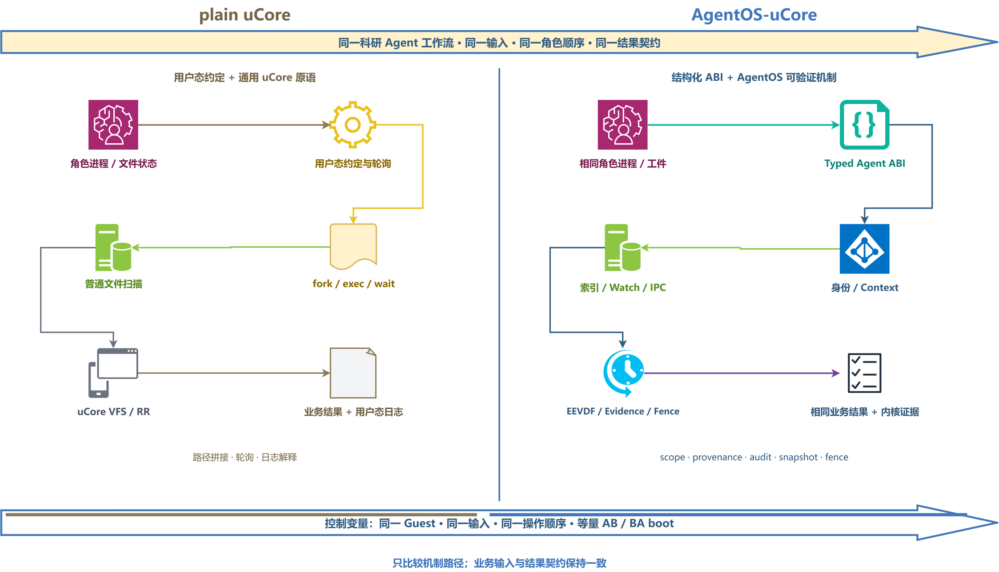

# 双目标 uCore 科研 Agent 平台

项目同时保留共享安全基底的 plain uCore 对照目标和 AgentOS-uCore 增强目标。两侧运行等价的科研 Agent 用户态流程，共享输入、执行顺序和结果契约；AgentOS-uCore 额外使用内核 Agent 服务。双目标总耗时反映完整系统路径，不用于把差异归因给某个 syscall 或单一机制。

[DrawIO 源文件](figures/architecture/plain_agentos_comparison.drawio)

科研流程是仓库内置的示例负载，包含数据准备、比对处理、结果分析、报告生成和归档交付。项目名、阶段、失败与恢复策略都属于用户态策略；内核只提供通用身份、Context、metadata、事件、权限和观测原语。

## 目标边界

| 内容 | AgentOS-uCore | plain uCore 对照目标 |
| --- | --- | --- |
| 位置 | 仓库根目录 | `baseline_ucore/` |
| 内核 | `os/` | `baseline_ucore/os/` |
| 用户程序 | `user/` | `baseline_ucore/user/` |
| 文件系统构建 | `nfs/` | `baseline_ucore/nfs/` |
| 启动脚本 | `scripts/` | `baseline_ucore/scripts/` |
| AgentOS 专属服务 | Agent 身份与 capability、Context、结构化工具调用、metadata、事件、timeline、ledger/provenance、编辑租约 | 不提供；使用普通进程、文件和 syscall 表达相同业务流程 |

两个目标共享 syscall 用户输入防护、定向等待、内核工作预算、可恢复文件系统耗尽、资源回收和基础 RISC-V/QEMU 路径。AgentOS 专属授权、workflow lifecycle、Agent 状态页、metadata 与观测机制只属于增强目标，不能描述为 baseline 的共同能力。

## 运行形态

plain 目标以普通 `fork`、`exec`、`wait` 和文件 I/O 组织角色程序。AgentOS 目标由可信入口建立 workflow 和 orchestrator，再显式创建 Agent 角色或最小权限 worker；关键动作进入 AgentOS syscall，并把可核验状态投影到与 plain 目标兼容的 `rp_*` 协议。

两侧都经过 uCore 的启动、trap/syscall、调度、虚拟内存、文件系统和 VirtIO 路径。增强目标没有绕开这些基础路径：Agent wait 仍依赖线程状态与定向唤醒，Agent 文件能力仍落到真实 VFS 对象，Context 映射仍服从页表和用户地址校验。

## Host 与 Guest 分工

uCore Guest 负责执行程序并生成 `rp_*` 状态；Host 工具只负责提交 seed、提取镜像、核验状态和汇总报告：

| 边界 | 责任 |
| --- | --- |
| Guest | 运行科研流程，写入业务状态和 AgentOS 观测投影，不自行授予 Host 级通过结论 |
| `host_tools/plain_ucore_fs_extract.py` | 从文件系统镜像提取受清单约束的普通文件，拒绝路径逃逸、链接和多 scope 混合 |
| Host validator | 核对目标字段、完整文件字节数、内容摘要、行数、程序顺序和 Guest 日志 |

状态文件采用短文件名和 `key=value` 文本。Guest/Host 文件边界以 [`ci/research-state-manifest.json`](../ci/research-state-manifest.json) 及其 checker 为准，文档不复制完整文件清单。

## 对照成立条件

- 两个目标使用相同的 challenge、程序顺序和 outcome oracle。
- plain 已生成的共同状态不能在 AgentOS 目标中缺失；AgentOS 可以增加内核证据。
- 每个启动都检查 Guest 日志和状态清单，不能从父进程预期反推子进程真实身份。
- 状态汇总工具只能呈现已提取数据，不能把静态字符串或报告状态升级为动态证据。
- 全栈双目标结果只说明端到端路径差异；单机制因果结论来自同内核消融实验。

双目标功能验证直接使用 `make dual-platform-run`。Agent 回归使用 `make agentos-test`；需要定位单个机制时通过 `AGENT_TEST_CASE` 选择对应 Guest 程序。测试 runner 和 Guest 源码共同定义实际负载，无需经过另一套发布管线。

## 设计取舍

- plain 目标展示仅靠用户态约定和普通 syscall 能完成的路径，也保留其扫描、状态可信度和恢复成本边界。
- AgentOS 目标保持业务策略在用户态，把可复用的身份、权限、Context、metadata、事件和观测原语放入内核。
- 两侧共享状态协议和静态报告格式，便于对照同一业务结果；AgentOS 专属证据单独呈现。
- Guest `rp_llm_relay` 与双目标性能对照使用确定性模板，live provider 不进入该基准；显式模型入口见 [交互控制台](agentos/interactive-console.md) 与 [AgentOS Nexus](agentos/nexus.md)。

构建、运行和测量边界见 [验证说明](verification.md)，AgentOS 内核细节见 [架构设计](agentos/design.md)，安全基底分工见 [安全加固](agentos/security-hardening.md)。
