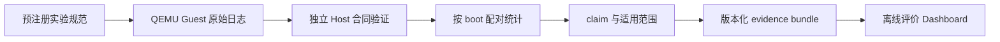

# AgentOS 竞赛评价方法

本文定义实验分支的统一评价方法。目标不是挑选一个必然让 AgentOS 获胜的对照组，
而是在相同输入、预注册关键 outcome 相同和可复现环境下，分别回答三个问题：

1. AgentOS 的内核机制是否给 Agent 工作负载带来可归因的收益；
2. 这些收益能否在同结果的完整科研工作流中保留下来；
3. 引入机制后，内核 ELF、text、data 和 BSS 成本是多少。

评价结论只由本次运行的原始 Guest 日志、严格验证后的样本和配对统计产生。
页面、固定文本、历史截图和公式生成的数据均不能成为性能证据。

## 1. 与赛题的对应关系

| 赛题任务 | 动态评价 | 主要指标 |
| --- | --- | --- |
| 任务一：Agent 进程与 Context | 普通 launcher/Agent 共存、PCB 角色和可写 Context 映射验收；`context_access` 同语义消融 | challenge 绑定功能回执；预注册操作数的总耗时、工作量和结果回执 |
| 任务二：结构化工具接口 | `tool_list`、三种真实 V2 typed-KV 调用及 unknown/wrong-type 错误；`tool_batch` 消融 | 工具 schema/响应/错误回执；scalar/batch 总耗时和操作数 |
| 任务三：Context Path | 6 轮真实 path、syscall/直接映射一致性、rollback、clear 和超配额 FIFO | challenge 绑定路径语义、分支 generation、淘汰计数；不从功能回执外推性能 |
| 任务四：文件系统查询 | `file_query` 多负载强制遍历/热索引对照，并以最后一组已验证 marker 生成动态功能回执 | 真实 inode 身份、触达记录数、每操作耗时、索引重建成本和结果集合指纹 |
| 任务五：Agent Loop | 两个 Agent 的延迟事件唤醒、真实 sleep/wakeup 计数、动态心跳、停止后 timeout | challenge 绑定端点/事件/等待计数功能回执；当前无独立 wait/poll 性能 claim |
| 任务六：综合场景 | 同一科研工作流的用户态路径和 AgentOS 路径 | Guest cold-start workflow 总时间、steady-stage/逐程序分解、关键 outcome，以及 Context/tool/metadata/观测动态 receipt |

题面明确要求文件属性查询优于逐文件遍历并提供对比数据，因此 `file_query`
是发布包的必备主实验。其他实验用于解释收益来自何种机制，并展示收益能否进入
完整场景，而不是用页面数量或功能数量替代性能。

每个受支持的 `agenteval_ucore` boot 都必须在全部计时区间结束后输出任务一至五
各一条严格 receipt。Host 逐字段重算 FNV 绑定，检查 challenge、普通/Agent PID
关系、V2 schema 与错误码、Context 语义和 rollback/FIFO 状态、文件 marker 与真实
inode 关系，以及事件端点、sleep/wakeup、心跳停止语义。缺失、重复、乱序、固定
伪值、失败状态或重算不一致都会使合同失败。只有预注册 boot 全部为 `supported`、
数量达到下限且每个 boot 的五类 receipt 均通过时，任务一至五功能状态才为 `pass`；
功能回执不会改变相应性能 benchmark 的统计门，也不会替代任务六场景证据。

## 2. 对照层次

评价不使用单一基线承担所有结论。

### 2.1 同内核机制消融

主要因果结论来自同一个 AgentOS 内核、同一个 Guest 程序和同一份数据：

- 强制全表扫描与已就绪索引；
- scalar tool call 与 batch tool call；
- `context_query` 与 Context 映射直接读取。

busy poll/事件等待以及生命周期恢复仍是候选实验，不在当前预注册 suite 中。没有对应
原始样本时，它们只能显示为 `unavailable`，不能借用其他 benchmark 的结果。

每对样本必须具有相同的 workload fingerprint、operation count 和 result fingerprint。
只改变被评价的机制，避免把编译器、内核映像或应用实现差异归因给 AgentOS。

### 2.2 同场景 backend 对照

科研场景使用同一输入、阶段图和独立结果 oracle：

- Plain 目标运行 `rp_seed_orch` 的普通 uCore 工作流路径；
- AgentOS 目标运行 `rp_agentos_orch`，使用 Context、metadata、事件和审计机制；
- Host 按 challenge 独立导出预期工件，并要求两侧预注册的 rerun、stage、artifact、
  workflow identity 和 LLM response 等关键 outcome fingerprint 相同。

这里不宣称两侧“完整最终状态相同”。当前 oracle 只规范化并比较上述预注册业务
outcome；未登记的缓存、诊断文件和内核私有状态不属于等价结论。只有今后建立覆盖
完整业务状态的 canonical oracle，才可扩大该表述。

这一层衡量完整 AgentOS 栈在任务六场景中的 Guest workflow 执行效果，但不同内核、安全机制和
应用入口都属于处理，因此不能单独归因给某一个内核机制。具体机制的因果结论只来自
2.1 的同内核消融；两层结论在 Dashboard 中分开展示，不拼成一个总分。

### 2.3 系统成本与护栏

本评价分支提供可信双目标构建器，并在实际运行后报告 ELF 文件、text、data 和 BSS
四项成本。`struct proc`、
最坏栈、启动空闲页以及传统 fork/exec、pipe、顺序文件 I/O 仍由主分支既有预算或
回归测试管理，尚未绑定到本评价 summary，因而 Dashboard 不得把它们显示为本轮
测量结果。后续接入时也必须保持成本护栏与性能 claim 分离。

## 3. 实验纪律

### 3.1 独立样本

一次全新文件系统镜像上的 QEMU 启动是一个独立 boot。Guest 内部的多次操作只用于
得到该 boot 的稳健中位数，不能把内部循环冒充多个独立样本。发布结论至少需要
7 个有效配对 boot；完整科研场景推荐 10 个。

微基准 challenge 会编入该 boot 的 Guest 程序，因此各 boot 的原始输入镜像摘要按
设计应当不同。合同以相同 clean commit、suite 摘要、内核摘要以及“只归一化 challenge
和日志路径后完全相同”的构建命令约束同质性，同时逐一归档 challenge 专用输入镜像；
不能错误地要求这些镜像字节相同，也不能允许其他构建参数悄然变化。

### 3.2 顺序与缓存

- 每个 boot 内采用 AB/BA 或 ABBA 平衡顺序；跨目标启动顺序也必须平衡；
- `fresh boot`、`index absent`、`index ready` 和 `result cache hit` 分开记录；
- 热索引计时前的重建属于 warmup，计时样本必须确认没有重建和结果缓存命中；
- 当前不控制宿主页缓存，只声明 fresh Guest 与索引状态，不把结果写成物理冷盘性能；
- 计时使用 Guest 单调微秒时钟，不把真实 0 修改为 1，不事后减去估算开销。

### 3.3 配对与统计

Host 先计算每个 inner pair 的改善率，再在每个独立 boot 内取这些配对改善率的中位数：

- latency 越低越好：`(baseline - treatment) / baseline`；
- throughput 越高越好：`(treatment - baseline) / baseline`。

报告 boot 中位数、P95、配对改善率中位数、bootstrap 95% 区间和精确单侧 sign test。
三个微基准 headline claim 在 suite 中预注册为同一假设族，使用 Bonferroni 控制
family-wise error rate `0.05`，所以每个 claim 的单侧阈值是 `0.05 / 3`。每个
claim 又是其全部预注册 load 的交集，任一 load 未过门就不能发布该机制优势。
任务六场景是独立的预注册主指标，不与三个机制 claim 重复计数。
每个实验还预注册最小基线计时窗口 20 us、绝对改善 5 us 和相对改善 5% 三道
实际效应门，避免把 `1 us -> 0 us` 一类时钟量化噪声写成优势。只有样本数达标、
结果等价、实际效应达标、方向符合预注册假设且统计门通过时，claim 才是
`supported`。否则显示 `inconclusive`、`unavailable` 或 `failed`，绝不补零、删除
失败样本或生成综合加权分数。

任务六的主指标是 Guest cold-start workflow makespan，而不是从首个子程序开始的
局部窗口。Plain 在 `rp_seed_orch` 的 `main` 真入口取得单调时钟；AgentOS 在
`rp_agentos_orch` 的 `main` 真入口、`agent_create_role` 之前取得同类时钟，因此
AgentOS 样本包含 Agent 创建、metadata init/seed、结构化 tool、Context、timeline、
provenance、file query、功能 receipt 和 `exec("rp_orch")`。起点与初始化完成时刻通过
factory 显式委派的一次性 pipe 跨越 workflow scope 和 exec；两端均为构建清单密封
映像，record 具有 magic/version、完整 phase mask 和完整性 guard，`rp_orch` 严格读取
一次并要求 EOF。现有 `rp_orch_timing` 继续保存逐程序明细，`steady_elapsed_ms` 保存
exec 后 orchestration 窗口，不能用它们替换 cold-start 主指标。

`rp_orch` 完成全部子程序后只把 start/ready/steady 回执交回 factory；AgentOS 外层
parent 必须依次完成 `waitpid`、completion pipe 校验、最终 inventory 与 acceptance
验证，才取得结束时间并写入严格的 `guest_workflow_timing_v3` record。Plain 侧同样在
最终本地验证后结束计时，映像准备和回收均在计时区外。Host 验证
entry/handoff/completion/phase mask、四个单调时间点、各阶段差值恒等式、AgentOS 初始化
窗口非零、steady 时间不小于逐程序区间之和，并用
QEMU 进程观测时间只做上界；QEMU/Host 启动时间不进入 Guest 指标。之后以每个独立
boot 的 `Plain workflow_elapsed_ms - AgentOS
workflow_elapsed_ms` 为配对样本，报告
绝对/相对改善的 bootstrap 95% 区间和精确单侧 sign test。七次均成功和顺序平衡
只证明功能数据有效；只有绝对区间下界至少 10 ms、相对区间下界至少 5%、Plain
基线窗口至少 50 ms 且 `p <= 0.05` 才支持 Guest workflow 执行性能优势，
AgentOS 更慢或区间跨零时仍保留完整场景证据，但结论必须是 `inconclusive`。

任务六功能通过还要求每个 AgentOS boot 的 extracted state 都包含严格的
`rp_agentos_acceptance`：至少绑定 Context snapshot、结构化 tool、metadata/file query
和 timeline/provenance/ledger 四类真实内核结果。Host 将该文件摘要同时绑定到 state
inventory、challenge receipt、run summary 和样本 raw-source receipt；缺一类、字段
重排、状态自报、零观测或绑定被改写都会使整个 boot fail closed。七次启动成功本身
不再足以推出任务六功能通过。

## 4. 证据流水线



每个样本绑定：

- commit、工作区 clean 状态、run id、boot id 和预注册规范 hash；
- 内核、用户程序、文件系统镜像、工具链与 QEMU 身份；
- 完整命令、目标顺序、cache mode、workload/result fingerprint；
- 原始日志路径、行号、完整日志 SHA256 和 marker SHA256。

采集器把创建时的仓库相对 `artifact_root` 写入 campaign，并要求 micro 与 scenario
清单始终位于该根；日志、内核、输入/输出镜像和场景回执必须等于由它推导出的完整
规范路径，不能用相同文件名或路径后缀代替。预检记录实际执行域中关键工具的绝对
路径、版本和 SHA256；每个 boot 只执行清单内的绝对入口与受限环境，并在运行前后
复核工具身份、clean HEAD 和 commit。复核发生在 Guest 计时窗口之外，避免证据检查
本身污染单核 QEMU 的性能样本。

验证器拒绝未知字段、重复样本、缺失 variant、NaN/Infinity、跨 commit/run 拼接、
指纹不等、固定单序、少于规定 boot 数及被修改的日志。统计和 Dashboard 只能读取
验证后的 summary，不能直接相信 Guest 输出的 `passed` 文本。

## 5. 评价入口

实验分支提供七个正式入口及一个显式的开发打包入口：

```bash
make evaluation-smoke
make evaluation-run
make evaluation-verify
make evaluation-kernel-cost
make evaluation-dashboard
make evaluation-package
make evaluation-package-development EVALUATION_RUN_DIR=<run-dir> EVALUATION_BUNDLE_DIR=<output-dir>
make evaluation-package-verify EVALUATION_BUNDLE_DIR=evidence/evaluation-releases/<run-id>
```

- `evaluation-smoke`：运行 Host 合同测试并检查 Guest 接线，不发布性能结论；
- `evaluation-run`：按预注册计划执行多个独立 QEMU boot，失败样本同样保留；
- `evaluation-verify`：重新读取原始日志、重算指纹与统计，fail closed；
- `evaluation-kernel-cost`：从同一 clean commit 可信重建两个内核并生成可搬运成本 sidecar；
- `evaluation-dashboard`：从已验证 summary 生成可离线打开的中文仪表板。
- `evaluation-package`：把已验证 run 的规范、原始工件、统计和 Dashboard 原子封装为可提交证据包；
- `evaluation-package-development`：生成带永久非正式警告的开发接线包；
- `evaluation-package-verify`：不依赖原采集工具安装，逐文件复核 package 并重放统计与页面。

正式发布仍沿用项目已有的 clean C 到 evidence E 的原子交付模型。实验阶段不得直接
增加主流水线 job，因为当前远端 attestation 合同精确绑定 1 个 Host 和 8 个 QEMU
job；评价任务应先作为独立或 child pipeline 运行，稳定后整体升级合同。

默认 package 位于 `evidence/evaluation-releases/<run-id>/`，并采用 `formal` profile。
正式 profile 强制要求 scenario preflight、封存的 scenario plan/report，以及 Task 1-6
动态功能验收全部通过。其 manifest 绑定 source commit、run、suite、campaign、summary、profile 以及
每个 payload 和逐 boot 原始工件的相对路径、字节数和 SHA256；
`checksums.sha256` 再覆盖 manifest 与全部 payload。验证器要求文件清单精确一致，并从
包内 raw 日志重新运行 evaluation contract、从 summary 确定性重建 Dashboard 后逐字节
比较。若运行过成本采集，package 还要求 config、build sidecar、report 和 fragment 完整
出现，进行 portable cost 重放并拒绝部分组合。代码提交本身不构成结果证据；只有真实
QEMU campaign 完成、package 复验通过且
证据目录随后提交到仓库，相关结论才从“方法就绪”升级为“本提交有原始证据支持”。

开发接线包必须显式执行：

```bash
scripts/package-evaluation-evidence.sh create <run-dir> <output-dir> --development
```

该 profile 会在 manifest 中永久保存 `DEVELOPMENT EVIDENCE ONLY` 警告，验证时也会再次
显示，不能改名或省略场景后冒充正式竞赛证据。两类包都拒绝路径逃逸、文件或祖先目录中
的 symlink/junction，并逐项重算 Guest、runner、kernel、输入/最终镜像及场景回执。

整轮 `evaluation-run` 由独立 campaign 锁串行化；每个 build/QEMU/archive 阶段再使用
现有 repo 锁。manifest 状态复检和日志截断都发生在 repo 锁内，避免等待锁期间计划
被替换或旧日志被提前破坏。每个微基准 boot 有 60 至 3600 秒的总期限（默认 900 秒），
超时会终止进程组、保留部分输出并记录失败，而不是让残留 QEMU 污染下一轮。科研场景
的 WSL 命令还携带每阶段随机身份；Host 在返回后只清理该身份的后代，并以独立
`/proc` 扫描证明没有残留。清理无法验证时整轮 fail closed。

### 5.1 内核成本证据

ELF、text、data 和 BSS 是系统成本护栏，不是延迟或吞吐量。成本采集器不执行构建，
也不相信孤立的 commit 参数。`evaluation_kernel_build.py` 是其可信生产者：它在仓库锁
内从同一 clean HEAD 依次清理并构建两个目标，逐命令复检 source commit/clean 状态，
验证 RISC-V ELF，绑定固定命令、真实退出码和有界原始输出，再原子保存 environment
manifest 和 build manifest。前者 `facts` 按 `name` 排序：

```json
{
  "schema_version": 1,
  "kind": "agentos-evaluation-environment",
  "run_id": "evaluation-20260730",
  "source_commit": "0123456789abcdef0123456789abcdef01234567",
  "environment_id": "kernel-build-<环境摘要前缀>",
  "facts": [
    {"name": "build_environment_sha256", "value": "<64 位小写 SHA256>"},
    {"name": "builder", "value": "evaluation_kernel_build.py/1"},
    {"name": "git", "value": "git version ..."},
    {"name": "make", "value": "GNU Make ..."},
    {"name": "make_path", "value": "/usr/bin/make"},
    {"name": "make_sha256", "value": "<64 位小写 SHA256>"},
    {"name": "platform", "value": "Linux-..."},
    {"name": "python", "value": "3.x.y"},
    {"name": "source_date_epoch", "value": "<commit timestamp>"}
  ]
}
```

build manifest 中的 `environment_sha256` 是上述文件原始字节的 SHA256。所有路径
相对 evidence root，目标顺序和路径由 `ci/evaluation-kernel-cost.json` 固定：

```json
{
  "schema_version": 1,
  "kind": "agentos-kernel-build-manifest",
  "run_id": "evaluation-20260730",
  "source_commit": "0123456789abcdef0123456789abcdef01234567",
  "environment_sha256": "<64 位小写 SHA256>",
  "build_config": {
    "path": "kernel-build/kernel-build-config.json",
    "sha256": "<64 位小写 SHA256>"
  },
  "build_log": {
    "path": "kernel-build/raw/kernel-build.log",
    "sha256": "<64 位小写 SHA256>"
  },
  "targets": [
    {
      "id": "baseline",
      "path": "baseline_ucore/build/kernel",
      "sha256": "<64 位小写 SHA256>",
      "command_argv": ["make", "-C", "baseline_ucore", "build/kernel"]
    },
    {
      "id": "agentos",
      "path": "build/kernel",
      "sha256": "<64 位小写 SHA256>",
      "command_argv": ["make", "build/kernel"]
    }
  ]
}
```

正常入口是 `make evaluation-kernel-cost`。底层构建、采集、可搬运复验、本机重放和
Dashboard 片段使用不同接口：

```bash
cp ci/evaluation-kernel-cost.json results/evaluation/run/kernel-cost-config.json

python3 host_tools/evaluation_kernel_build.py build \
  --config ci/evaluation-kernel-cost.json \
  --repository-root "$PWD" \
  --make-tool /usr/bin/make \
  --run-id evaluation-20260730 \
  --evidence-root results/evaluation/run \
  --output-dir results/evaluation/run/kernel-build

python3 host_tools/evaluation_kernel_cost.py collect \
  --config results/evaluation/run/kernel-cost-config.json \
  --repository-root "$PWD" \
  --environment-manifest results/evaluation/run/kernel-build/environment.json \
  --build-manifest results/evaluation/run/kernel-build/kernel-build.json \
  --size-tool /usr/bin/riscv64-linux-gnu-size \
  --evidence-root results/evaluation/run \
  --output results/evaluation/run/kernel-cost-report.json

python3 host_tools/evaluation_kernel_cost.py verify \
  --config results/evaluation/run/kernel-cost-config.json \
  --report results/evaluation/run/kernel-cost-report.json \
  --evidence-root results/evaluation/run

python3 host_tools/evaluation_kernel_cost.py verify-local \
  --config results/evaluation/run/kernel-cost-config.json \
  --report results/evaluation/run/kernel-cost-report.json \
  --evidence-root results/evaluation/run \
  --repository-root "$PWD" \
  --size-tool /usr/bin/riscv64-linux-gnu-size

python3 host_tools/evaluation_kernel_cost.py fragment \
  --config results/evaluation/run/kernel-cost-config.json \
  --report results/evaluation/run/kernel-cost-report.json \
  --evidence-root results/evaluation/run \
  --output results/evaluation/run/kernel-cost-fragment.json
```

`collect` 核对 clean HEAD、构建配置、原始构建日志及两份 ELF SHA256，并验证
ELF64、小端、RISC-V、EXEC 头和表边界。GNU `size` 输出使用有界捕获；原始输出
随报告保存，text/data/BSS 必须能由它重新解析。`verify` 只依赖随包 sidecar，
换目录且没有交叉工具链时仍可复验；`verify-local` 再核当前 ELF 和工具哈希并重放
`size`。缺失指标保持 `null + unavailable`。片段只提供成本 benchmark，不自动
生成“AgentOS 更快”的 claim。

## 6. Dashboard

评价页面与原有 40 页科研 Reader 分离，避免继续扩大巨型页面生成器。单页包含：

1. 总览：commit、run、证据等级、任务一至六的实测或未测状态和少量可支持结论；
2. 性能：多负载配对点图、区间、单位、`n`、cache mode 与原始证据链接；
3. 科研场景：cold-start workflow、逐程序时间、四类功能模块和预注册关键 outcome；
4. 系统成本：可搬运复验后的 ELF、text、data、BSS 与差值，不混入 CPU 性能 claim；
5. 可信证据：claim 到 raw log 行、SHA256、命令、环境和可点击原件的完整链；
6. 方法学：对照、warmup、顺序、样本数、统计规则和一键复现命令。

页面离线运行，不依赖 CDN。renderer 会实际读取 evidence 文件并核对 hash、字节数和
marker 行回执，再生成确定性的 `dashboard-verification.json`；成本 sidecar 必须全有
或全无。缺失数据明确显示“本轮未测量”，不以示例 fixture、旧图或静态状态文件填充
首屏结论。

## 7. 不能删除的适用范围

真实评价包可以消除“只有单次文件查询、没有成对重复、没有场景数据”等证据缺口，
但以下边界必须长期保留：

- 单核 QEMU 结果不能外推 SMP 或真实 RISC-V 硬件；
- 突然终止 QEMU 不等于切断真实存储控制器电源；
- checksum 和 hash 不等于密码学身份或供应链认证；
- 有界审计窗口不等于永久、外部不可抵赖日志；
- 没有远端 Runner attestation 时，本地 E3 不能写成远端 E4。

这些是实验适用范围，不是用更漂亮的页面应当掩盖的缺陷。
