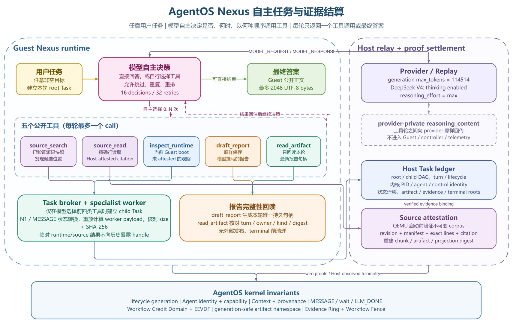

# Agent Loop 内核运行机制

Agent Loop 的决策过程留在 Guest，内核负责跨轮次仍需保持一致的运行机制。AgentOS 把事件等待、可信 IPC、模型请求、Workflow Credit Domain、工作流 EEVDF 和阶段记录放在同一个生命周期中。Agent（智能体）暂时没有任务时进入内核等待；文件变化、协作消息、心跳、截止时间或模型响应到达后，内核将其唤醒。工具与事件的 terminal state（终态）继续写入 Context（运行上下文）和 Evidence Ring。

## 文档索引

- [一、运行过程](#一运行过程)
- [二、事件队列与无丢失唤醒](#二事件队列与无丢失唤醒)
- [三、可信 IPC 与模型请求](#三可信-ipc-与模型请求)
- [四、Workflow Credit Domain](#四workflow-credit-domain)
- [五、工作流 EEVDF](#五工作流-eevdf)
- [六、Evidence Ring 与 Workflow Fence](#六evidence-ring-与-workflow-fence)
- [七、Nexus 自主任务 Runtime](#七nexus-自主任务-runtime)
- [八、源码位置与测试](#八源码位置与测试)

## 一、运行过程

多智能体工作流不会一直占用 CPU。模型调用、文件生成和协作者执行任务时，其他进程常常处于等待状态。事件到来后，内核需要确认接收者仍属于原来的工作流，不能把迟到响应交给槽位复用后的新进程。一个工作流还可能创建多个线程。若调度器只按线程轮转，线程越多的工作流就会获得更多 CPU 时间。

运行时为此提供五组内核功能：

1. 事件队列保存文件变化、消息、定时器、策略拒绝和模型完成事件。
2. `agent_wait()` 以线程身份 generation 作为等待键，在同一次关中断期间复查队列并进入睡眠。
3. IPC 消息路由和模型请求表保存生命周期、`control_id` 与关联编号。
4. Workflow Credit Domain 限制内核对象的创建，workflow EEVDF 在不同工作流之间分配 CPU 时间。
5. Evidence Ring 保存 terminal record，Workflow Fence（工作流屏障）汇总文件元数据、资源用量和执行记录。

一轮常见的 Agent 循环如下：

```text
安装 Typed Watch、IPC 消息路由和 Execution Contract
  -> agent_wait(timeout)
  -> 处理 FILE_QUERY、MESSAGE、TIMER、POLICY_DENIED 或 LLM_DONE
  -> 提交结构化工具请求
  -> 内核提交结果、Context 和 terminal record
  -> 再次等待
```

## 二、事件队列与无丢失唤醒

### 2.1 事件结构

每条事件使用固定布局，定义在 [`os/agent.h`](../../os/agent.h)，公共声明同步到 [`user/include/agent.h`](../../user/include/agent.h)：

```c
struct agent_event {
    int type;
    int source_pid;
    int target_pid;
    int status;
    uint64 event_id;
    uint64 tick;
    uint64 corr_id;
    uint64 cause_sequence;
    uint64 span_id;
    char payload[64];
};
```

事件类型包括文件状态、跨 Agent 消息、定时器、任务或模型完成、策略拒绝、Context 容量告警、取消和 Typed Watch 文件查询。`cause_sequence` 与 `span_id` 把事件处理接回 Context，`corr_id` 用来匹配消息和模型请求。

### 2.2 队列容量与来源隔离

每个 Agent 的事件队列固定为 16 槽。内核按来源分别计数：

| 限制 | 当前值 | 作用 |
| --- | ---: | --- |
| 队列总容量 | 16 | 限制全部事件数 |
| 内核保留槽 | 4 | 留给定时器、取消等内核事件 |
| 外部事件上限 | 12 | 防止外部事件占用内核保留槽 |
| 类别保留槽 | 4 | 防止 IPC 或带来源信息的事件挤满全部外部槽 |
| 单一来源上限 | 4 | 限制同一个发送者的积压 |

心跳等内核定时事件会合并投递：队列中已有同类事件时，不再重复加入。外部 IPC、带来源信息的事件和内核事件分别通过 [`agent_ipc_origin_policy`](../../os/agent_ipc.c) 检查。容量判断、事件编号分配和队尾发布都在同一次关中断期间完成。

### 2.3 等待与唤醒

`agent_wait()` 必须处理一个很短却很关键的时序：线程确认队列为空之后、真正睡眠之前，事件可能已经到达。实现位于 [`os/agent_ipc.c`](../../os/agent_ipc.c)，执行顺序如下：

```text
关中断
  -> 复查取消状态和队首
  -> 有事件：预留队首并恢复运行
  -> 无事件：登记 WAITING、截止时间和等待键
  -> wait_queue_sleep_key_irq(identity_generation)
  -> 唤醒后在同一套锁规则下重新检查
```

等待键使用线程的 `identity_generation`。时钟中断只唤醒身份 generation、等待通道、等待原因和截止时间全部匹配的线程。`exec`、线程槽位复用和退出清理不会把旧唤醒交给新线程。

队列通过事件接力标记确定接收者。事件到达后，[`wait_queue_wake_one_thread()`](../../os/wait.c) 只挑选一个真正等待的线程，并为其设置接力标记。该线程预留队首，成功复制到用户态并写入 Context 后才消费事件。复制失败时，内核撤销预留并把接力标记交给其他等待者。1、4、8、15 个等待线程的测试共完成 28 次唤醒，均记录 `herd=0`。

## 三、可信 IPC 与模型请求

### 3.1 IPC 消息路由

跨 Agent 的 `MESSAGE` 先确认发送方和接收方都仍是有效 Agent，再比较文件访问范围和完整生命周期键。每个接收方最多保存 16 条消息路由。每条路由以发送方 `control_id` 为键，并记录允许的事件类型。普通发送者需要 `MESSAGE_SEND` 能力位。替他人配置路由需要 `ROUTE_MANAGE`，而且控制进程必须同时控制发送方与接收方。

发送成功后，内核队列项会保存发送方 PID、`control_id`、起因序号、调用跨度和 provenance（来源追溯）标记。公开的 `agent_event` 只返回事件字段，控制编号和来源信息留在内核附加区。接收方处理事件时，内核会先把 `CROSS_AGENT_DATA` 等标记合并到当前 provenance 状态，再追加一条带因果关系的 Context 记录。

常用接口如下：

```c
int agent_route_config(int source_pid, int target_pid,
                       uint64 event_mask, int operation);
int agent_wake(int pid, struct agent_event *event);
int agent_wait(struct agent_event *event, int timeout_ticks);
int agent_wait_cancel(int pid, const char *reason);
```

### 3.2 模型请求与响应

结构化工具 `LLM_REQUEST` 和 `LLM_RESPONSE` 共用事件通道，但会额外登记到待完成请求表。每条记录保存请求进程和中继进程的 PID、`control_id`、完整生命周期键、非零关联编号和截止时间。同一请求进程在一个生命周期内提交的关联编号必须递增。仍在处理的编号重复出现时返回 `DUPLICATE`。已经完成或超时的编号再次出现，以及编号倒退时，返回 `CONFLICT`。

响应只有在请求进程、中继进程、生命周期键和关联编号全部匹配时才会生效，而且只能消费一次。内核时钟规定的有效期为 120 秒。到期记录会进入终态历史，迟到响应返回 `TIMEOUT` 或 `STALE`。每个请求进程最多保留 16 条待完成记录，全局表容量为 `NPROC`。实现见 [`os/agent_core.c`](../../os/agent_core.c)。

### 3.3 心跳

`agent_heartbeat_set(interval)` 从当前 tick（时钟节拍）重新计时，`interval` 为 0 时停止心跳。到期后，内核在队列中加入合并后的 `TIMER` 事件。停止心跳不会删除已经入队的事件。`agent_heartbeat_stop()` 可以重复调用。心跳和取消事件成功取出后，会按照事件预留和 Context commit 的正常路径处理。本地等待超时则直接返回 `TIMEOUT`，不占用队列槽位，也不写 Context 记录。

## 四、Workflow Credit Domain

一个工作流会同时创建进程、线程、文件对象、inode、缓冲区和物理页。如果只在分配失败后再清理，内核无法提前判断整个工作流是否还能继续创建对象。Workflow Credit Domain 因此为每个工作流建立执行账户和存储账户，并把额度分为三种状态：

```text
free --reserve--> pending --commit--> used
  ^                  |
  +----创建失败------+
  ^
  +------释放 <------ used

held = free + pending + used
```

`free` 额度已经留给该账户，但尚未使用；`pending` 属于正在创建、尚未对外可见的对象；`used` 属于已经发布的对象。账户总限额、资源类别限额和全局容量共同约束 `held`。创建失败时，`pending` 退回 `free`；对象发布时执行 `commit`，将 `pending` 转为 `used`；对象销毁后额度回到 `free`，并可在系统压力较大时归还全局池。

资源快照统计 8 类对象：进程、线程、文件对象、文件系统块、文件系统 inode、缓冲区、Agent 状态页和物理页。共用 ABI 见 [`include/agent_resource_abi.h`](../../include/agent_resource_abi.h)，账户与策略实现在 [`os/resource_controller.c`](../../os/resource_controller.c)。

每次工具执行都有一份独立的资源记录。V3 Execution Contract 给出本次操作的资源上限，内核先调用 `begin` 锁定额度，操作生效前调用 `activate`，工具结束时调用 `settle` 结算实际用量。线程或进程异常退出时调用 `abort` 退回预留额度。关闭工作流时，生命周期先标记为正在关闭并要求成员退出；已经开始的操作完成结算后，异步收尾程序再回收生命周期。

## 五、工作流 EEVDF

### 5.1 调度目标

uCore 原有调度器直接从可运行线程中选择任务。若一个工作流创建更多线程，它可能在外层轮转时获得更多 CPU 时间。AgentOS 为每个工作流建立一个 EEVDF 调度对象。同一工作流的所有成员共享 `service_cycles`、`vruntime` 和 `virtual_deadline`。选中工作流后，再由 uCore 原有的单智能体或 FIFO 策略选择具体线程。

主要字段定义在 [`os/workflow_scheduler.c`](../../os/workflow_scheduler.c)：

| 字段 | 含义 |
| --- | --- |
| `lifecycle + account + domain_id` | 调度对象的完整身份 |
| `vruntime` | 按等权规则结算的虚拟运行时间 |
| `remaining_cycles` | 本次 CPU 时间申请的剩余周期数 |
| `virtual_deadline` | `vruntime + remaining_cycles` |
| `runnable_threads` | 当前可运行的工作流成员数 |
| `latency_class` | `urgent`、`interactive`、`normal`、`batch` 四档延迟等级 |
| `sleep_start_tick`、`wake_tick` | 睡眠修正和唤醒等待统计 |

### 5.2 选择方法

四档延迟等级分别申请 1、2、4、8 tick，实际截止时间只能缩短申请量。调度器用全局 `vtime` 判断工作流当前能否运行，再选择虚拟截止时间最早者：

```text
request_cycles = request_ticks * cycles_per_tick
virtual_deadline = vruntime + remaining_cycles
eligible = (vruntime <= vtime)
selected = arg min(virtual_deadline) among eligible workflows
```

所有工作流的权重固定为 1024，实际运行的周期数直接计入该工作流的 `vruntime`。工作流每睡眠 16 tick 执行一次修正，最多右移 8 次，让较旧的 `vruntime` 向当前 `vtime` 靠近。这样，刚被唤醒的交互工作流可以及时恢复运行，但已经结算的 CPU 时间不会增加。

[`fetch_task()`](../../os/proc.c) 从运行队列缓存中收集各工作流的候选线程。只有一个工作流时，系统保留原来的 O(1) 外层选择。多个工作流同时运行时，调用 `workflow_scheduler_select()`。候选身份、可运行缓存或对象映射异常时，调度器退回原有外层轮转，并增加备用路径计数。工作流进入可运行状态时记录 tick，真正获得 CPU 时计算等待时间，切回调度器后用周期计数器结算服务量。

### 5.3 实测结果

6 次独立 QEMU 启动共保存 504 条准确唤醒记录，其中 425 条为 0 tick，79 条为 1 tick。所有工作流从进入可运行状态到真正获得 CPU，等待均为 0–1 tick。按同一次启动、同一并发场景中各工作流的 `service_cycles` 计算 Jain 公平性指数，中位数如下：

| 并发工作流数 | 启动次数 | Jain 公平性指数中位数 |
| ---: | ---: | ---: |
| 1 | 6 | 1.000000 |
| 2 | 6 | 0.999985 |
| 3 | 6 | 0.999993 |
| 4 | 6 | 0.999985 |

逐次唤醒数据位于 [`one_shot_metrics/data/20260811/tables/eevdf_wakeups.csv`](../../one_shot_metrics/data/20260811/tables/eevdf_wakeups.csv)，各工作流 CPU 周期数据位于 [`eevdf_samples.csv`](../../one_shot_metrics/data/20260811/tables/eevdf_samples.csv)，累计分布和公平性图见[性能测试](../performance.md#7-工作流-eevdf-调度)。

测试中的 Agent 在等待事件时实际进入睡眠，504 次准确唤醒又都在 0–1 tick 内重新获得 CPU，说明等待接口能够避免无任务时忙轮询，同时保持及时唤醒。0 tick 只表示等待短于 10 ms 的计时粒度，并不代表调度没有成本。1 至 4 个并发工作流的 Jain 指数均接近 1，说明共享 `service_cycles` 的外层 EEVDF 基本做到了按工作流分配 CPU；一个工作流扩大到 4 个忙线程时仍取得 `26.895%` 份额，略高于四等分的 `25%`，因此线程放大已经受到抑制，但还不是绝对无偏。

## 六、Evidence Ring 与 Workflow Fence

### 6.1 Evidence Ring

Context 的 terminal state、事件、审计记录和时间线都会写入 Evidence Ring。每个生命周期按需分配 4 页，其中 48 槽保存普通记录，16 槽保存关键记录。安全策略拒绝等重要信息写入关键分区，不会被普通成功日志占满。

写入者使用 `reserve -> fill -> commit/discard` 两阶段接口取得递增票号。工具生效前会同时在普通分区和关键分区 reserve 槽位，terminal state 确定后只 commit 其中一个。没有 commit 的票号形成缺口，并记入封存摘要。结构与接口见 [`os/agent_evidence_ring.h`](../../os/agent_evidence_ring.h) 和 [`os/agent_evidence_ring.c`](../../os/agent_evidence_ring.c)。

### 6.2 生成 Workflow Fence 回执

控制进程调用 `agent_workflow_fence()` 生成 Workflow Fence 回执，内核依次执行：

1. 检查 `AGENT_CAP_ORCHESTRATE` 编排能力和控制进程的 `control_id`。若同时传入请求和回执，再检查版本和非零请求编号。两个指针都为空时，只执行 Workflow Fence，不返回回执。
2. 对非零请求编号查询 Replay（固定回放）缓存。请求编号和 `challenge` 都相同便直接返回已 commit 的回执。
3. 暂停接纳新的普通操作和退出操作，并确认两项计数都为 0。
4. 在文件元数据不再变动后取得元数据 generation，排空延迟回收的文件系统对象，并提交文件系统时点。
5. 读取执行账户和存储账户的精确资源快照。
6. 用 `challenge`、元数据 generation、计费轮次和资源摘要封存 Evidence Ring 段。
7. 缓存 320 字节回执，递增屏障序号，并恢复接纳新操作。

核心顺序位于 [`agent_workflow_fence_execute()`](../../os/agent_workflow_fence.c)：

```c
agent_metadata_quiescence_fence_snapshot_current(&metadata_generation);
fs_deferred_reclaim_drain_current();
fs_epoch_commit();
workflow_credit_domain_fence(key, exec, storage, &credit);
agent_evidence_seal(key, fence_sequence, challenge,
                    metadata_generation, credit.epoch,
                    credit_digest, &evidence);
```

回执包含生命周期键、请求序号、屏障序号、元数据 generation、计费轮次、8 类资源用量、资源摘要、`challenge`、前一段根哈希和本段 Evidence Ring 根哈希。当前 v1 固定带有 `PARTIAL_COVERAGE`、`CREDIT_EXACT`、`EVIDENCE_SEALED` 和 `METADATA_VOLATILE` 标记。回执使用 SHA-256 串联阶段记录，结构中没有公钥签名字段。ABI 定义见 [`include/agent_workflow_fence_abi.h`](../../include/agent_workflow_fence_abi.h)。

对于带请求编号的调用，同一编号配不同 `challenge` 返回 `CONFLICT`，更旧编号返回 `STALE`。上一次生成的回执尚未成功复制到用户态时，后续请求返回 `RETRY`。不要求回执的调用不进入 Replay 检查。生成失败时，内核恢复接纳新操作，也不会递增屏障序号。

## 七、Nexus 自主任务 Runtime

<p align="center">
  
</p>

**图 1　Nexus 自主任务与证据结算流程**

原生图源见 [`nexus_runtime_flow.drawio`](../figures/architecture/nexus_runtime_flow.drawio)。

### 7.1 任意任务与模型决策

`agentnexus_ucore` 把用户输入作为本轮 root Task 的非空目标，不从关键词推断一套预制业务流程。Host 信任根要求 Guest 发出完全一致的 system policy 和五工具目录，并校验两者的 SHA-256。在每个决策轮次中，模型只返回一个 function call 或最终答案；是否使用工具、使用哪一个、顺序和次数都由模型自行决定。同一工具可以重复调用，也可以在工具结果不足时换用其他工具。

单轮最多接受 16 个模型决策。可重试 provider 错误另设 32 次上限，不计作已交付的模型决策；总尝试数同时受两者之和约束。provider generation 的 `max_tokens` 为 `114514`。该预算与 Guest 公开最终正文的存储与协议界限独立，后者仍为 2048 个 UTF-8 字节。

DeepSeek V4 provider 请求显式设置 `thinking.type=enabled` 和 `reasoning_effort=max`。工具轮次之间需要的 provider-private `reasoning_content` 由 Host relay 向 provider 原样回传，用于保持 provider 自身的思考上下文。该字段不进入 Guest wire，也不出现在 controller 输出或 telemetry 中。

### 7.2 五工具与 brokered worker

| 公开工具 | 执行路径 | 结果边界 |
| --- | --- | --- |
| `source_search` | broker 将子 Task 交给 Research specialist | 对构建时生成并经 Host 验证的 `build_source_snapshot` 执行单个不区分大小写的字面子串搜索；结果是发现线索，不是最终引用证明 |
| `source_read` | broker 将子 Task 交给 Research specialist | 读取候选 `source_id` 的精确行，返回可由 Host 重放验证的 citation |
| `inspect_runtime` | broker 将子 Task 交给 System specialist | 只返回当前 Guest boot 的 `system_status`、`processes` 或 `context` 观察；不具有 source attestation |
| `draft_report` | broker 将子 Task 交给 Analyst specialist | 原样保存模型给定的内容；Analyst 不进行第二次分析，也不添加结论 |
| `read_artifact` | Coordinator 按当前轮次所有权直接回读 | 只接受本轮最新 `draft_report` 句柄，并返回完全相同的报告字节与 digest |

前四类工具只有在被模型选中时才建立子 Task，因此 specialist 是按工具调用的执行者，而不是固定业务阶段。Coordinator 通过内核 `MESSAGE` 和 `N1` 任务协议发送 task capsule，并只允许一个子任务处于活动 dispatch。worker 通过 `ACCEPT`、`PROGRESS` 和单一 terminal 结果返回有界元数据。对临时 runtime/source 结果，Coordinator 使用相同输入重放计算 payload，核对 worker 上报的大小与 SHA-256，再以 brokered artifact 的形式物化；临时句柄不向模型历史或 controller 逃逸。

`draft_report` 是当前轮次唯一可持久到后续决策的报告 artifact。`read_artifact` 用它的 handle、kind、owner、payload digest 和轮次绑定执行完整性回读。这两个工具均无外部发布副作用；在 root Task 进入 terminal state 前，Guest 先删除该轮的报告命名空间。清理失败会封锁会话，而不是携带旧 artifact 继续下一轮。

### 7.3 Task ledger 与 source attestation

Guest 为每轮 root Task 和每个 brokered child Task 发出 `TASK_EVENT`。Host 的 [`agentos_nexus_task_ledger.py`](../../host_tools/agentos_nexus_task_ledger.py) 不保存任务正文或工具参数原文，而是保存有界元数据与哈希。它重放 lifecycle/turn 绑定、root-child DAG、内核认证的 PID/agent/control identity、任务状态迁移、工具参数 digest、artifact/evidence 绑定和 terminal 根哈希。未结算的子任务、不匹配的 worker 身份、被替换的 handle 或最终冻结后到达的事件都不能通过结算。

源码证据不信任 Guest 自行声明的 digest。构建阶段将 `os/`、`include/`、`user/lib/` 和 `user/include/` 生成 `build_source_snapshot`；Host 在 QEMU 启动前，用独立的 revision 和 manifest digest 加载并完整验证 corpus。`source_search` 的匹配只是 discovery projection。`source_read` 成功后，Host 从已验证的不可变内存副本中重建精确行、citation、chunk/artifact/projection digest，再将该证明绑定到工具与 Task ledger。源码正文作为不可信数据交给模型，不会进入 observer telemetry。最终回答中的 source-backed claim 只能使用 `source_read` 实际返回且被 Host 重放验证的 citation token。

Guest 主程序位于 [`user/src/agentnexus_ucore.c`](../../user/src/agentnexus_ucore.c)，共用协议见 [`user/include/agent_nexus_protocol.h`](../../user/include/agent_nexus_protocol.h)，Host 自主合约、Task ledger 和 source attestation 分别位于 [`host_tools/agentos_nexus_contract.py`](../../host_tools/agentos_nexus_contract.py)、[`host_tools/agentos_nexus_task_ledger.py`](../../host_tools/agentos_nexus_task_ledger.py) 和 [`host_tools/agentos_source_attestation.py`](../../host_tools/agentos_source_attestation.py)。运行方法见[运行指南](../usage.md#4-使用-nexus-自主任务工作流)。

## 八、源码位置与测试

| 模块 | 主要源码 |
| --- | --- |
| 事件队列、文件订阅、等待和消息路由 | [`os/agent_ipc.c`](../../os/agent_ipc.c)、[`os/wait.c`](../../os/wait.c) |
| 模型待完成请求与智能体循环 | [`os/agent_core.c`](../../os/agent_core.c)、[`os/agent_background.c`](../../os/agent_background.c) |
| Workflow Credit Domain 与工具执行资源记录 | [`os/workflow_credit_domain.c`](../../os/workflow_credit_domain.c)、[`os/resource_controller.c`](../../os/resource_controller.c) |
| 工作流 EEVDF | [`os/workflow_scheduler.c`](../../os/workflow_scheduler.c)、[`os/proc.c`](../../os/proc.c) |
| Evidence Ring 与 Workflow Fence | [`os/agent_evidence_ring.c`](../../os/agent_evidence_ring.c)、[`os/agent_workflow_fence.c`](../../os/agent_workflow_fence.c) |
| 运行时间线 | [`os/agent_observe_timeline.c`](../../os/agent_observe_timeline.c) |
| Nexus 自主合约、Task ledger、brokered worker、source attestation 与 report readback | [`user/src/agentnexus_ucore.c`](../../user/src/agentnexus_ucore.c)、[`user/lib/agent_nexus.c`](../../user/lib/agent_nexus.c)、[`user/lib/agent_nexus_source.c`](../../user/lib/agent_nexus_source.c)、[`host_tools/agentos_nexus_contract.py`](../../host_tools/agentos_nexus_contract.py)、[`host_tools/agentos_nexus_task_ledger.py`](../../host_tools/agentos_nexus_task_ledger.py)、[`host_tools/agentos_source_attestation.py`](../../host_tools/agentos_source_attestation.py) |

Runtime 测试覆盖无丢失唤醒、慢订阅者隔离、心跳、消息路由、Workflow Credit Domain、Evidence Ring 票号、Workflow Fence 重试、EEVDF 和 Nexus Replay：

```bash
python3 -B scripts/test-wait-atomic-wiring.py
python3 -B scripts/test-agent-live-loop.py
python3 -B scripts/test-workflow-credit-domain.py
python3 -B scripts/test-agent-evidence-ring.py
python3 -B scripts/test-workflow-fence.py

AGENT_TEST_CASE=agentloop_ucore make agentos-test TOOLPREFIX=riscv64-linux-gnu-
AGENT_TEST_CASE=agentsched_ucore make agentos-test TOOLPREFIX=riscv64-linux-gnu-
AGENT_TEST_CASE=agent_eevdf_ucore make agentos-test TOOLPREFIX=riscv64-linux-gnu-

make agentos-nexus-check
make agentos-nexus-replay TOOLPREFIX=riscv64-linux-gnu-
```

Guest 日志校验器检查 `broadcast_slow_watcher_isolated=1`、心跳动态调整、合并与停止、28 次没有惊群的事件交接、EEVDF 拓扑和唤醒分组等标记。性能数据由 [`one_shot_metrics/validate.py`](../../one_shot_metrics/validate.py) 校验。绘图数据检查覆盖 504 次准确唤醒和 6 次公平性测试启动。

Agent Loop 使用[Agent 进程、地址空间与上下文路径](identity-context.md)提供的身份键，并处理[结构化交互与工具调用协议](tool-execution.md)和[文件系统查询扩展](live-query.md)产生的 terminal state 与事件。
