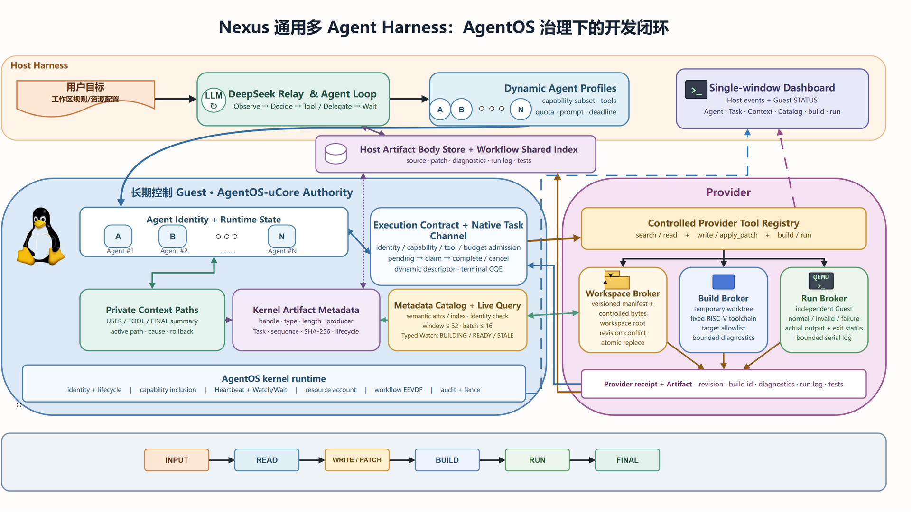

# Agent Loop 内核运行机制

Agent Loop 的决策过程留在 Guest，内核负责跨轮次仍需保持一致的运行机制。AgentOS 把事件等待、可信 IPC、模型请求、Workflow Credit Domain、工作流 EEVDF 和阶段记录放在同一个生命周期中。Agent（智能体）暂时没有任务时进入内核等待；文件变化、协作消息、心跳、截止时间或模型响应到达后，内核将其唤醒。工具与事件的 terminal state（终态）继续写入 Context（运行上下文）和运行记录环。

## 文档索引

- [一、运行过程](#一运行过程)
- [二、事件队列与无丢失唤醒](#二事件队列与无丢失唤醒)
- [三、可信 IPC 与模型请求](#三可信-ipc-与模型请求)
- [四、Workflow Credit Domain](#四workflow-credit-domain)
- [五、工作流 EEVDF](#五工作流-eevdf)
- [六、运行记录环与 Workflow Fence](#六运行记录环与-workflow-fence)
- [七、Nexus 多智能体 Harness Runtime](#七nexus-多智能体-harness-runtime)
- [八、源码位置与测试](#八源码位置与测试)

## 一、运行过程

多智能体工作流不会一直占用 CPU。模型调用、文件生成和协作者执行任务时，其他进程常常处于等待状态。事件到来后，内核需要确认接收者仍属于原来的工作流，不能把迟到响应交给槽位复用后的新进程。一个工作流还可能创建多个线程。若调度器只按线程轮转，线程越多的工作流就会获得更多 CPU 时间。

运行时为此提供五组内核功能：

1. 事件队列保存文件变化、消息、定时器、策略拒绝和模型完成事件。
2. `agent_wait()` 以线程身份 generation 作为等待键，在同一次关中断期间复查队列并进入睡眠。
3. IPC 消息路由和模型请求表保存生命周期、`control_id` 与关联编号。
4. Workflow Credit Domain 限制内核对象的创建，workflow EEVDF 在不同工作流之间分配 CPU 时间。
5. 运行记录环保存 terminal record，Workflow Fence（工作流屏障）汇总文件元数据、资源用量和执行记录。

一轮常见的 Agent 循环如下：

```text
安装 Typed Watch、IPC 消息路由和 Execution Contract
  -> agent_wait(timeout)
  -> 处理 FILE_QUERY、MESSAGE、TIMER、POLICY_DENIED 或 LLM_DONE
  -> 提交结构化工具请求
  -> 内核提交结果、Context 和 terminal record
  -> 再次等待
```

## 二、事件队列与无丢失唤醒

### 2.1 事件结构

每条事件使用固定布局，定义在 [`os/agent.h`](../../os/agent.h)，公共声明同步到 [`user/include/agent.h`](../../user/include/agent.h)：

```c
struct agent_event {
    int type;
    int source_pid;
    int target_pid;
    int status;
    uint64 event_id;
    uint64 tick;
    uint64 corr_id;
    uint64 cause_sequence;
    uint64 span_id;
    char payload[64];
};
```

事件类型包括文件状态、跨 Agent 消息、定时器、任务或模型完成、策略拒绝、Context 容量告警、取消和 Typed Watch 文件查询。`cause_sequence` 与 `span_id` 把事件处理接回 Context，`corr_id` 用来匹配消息和模型请求。

### 2.2 队列容量与来源隔离

每个 Agent 的事件队列固定为 16 槽。内核按来源分别计数：

| 限制 | 当前值 | 作用 |
| --- | ---: | --- |
| 队列总容量 | 16 | 限制全部事件数 |
| 内核保留槽 | 4 | 留给定时器、取消等内核事件 |
| 外部事件上限 | 12 | 防止外部事件占用内核保留槽 |
| 类别保留槽 | 4 | 防止 IPC 或带来源信息的事件挤满全部外部槽 |
| 单一来源上限 | 4 | 限制同一个发送者的积压 |

心跳等内核定时事件会合并投递：队列中已有同类事件时，不再重复加入。外部 IPC、带来源信息的事件和内核事件分别通过 [`agent_ipc_origin_policy`](../../os/agent_ipc.c) 检查。容量判断、事件编号分配和队尾发布都在同一次关中断期间完成。

### 2.3 等待与唤醒

`agent_wait()` 必须处理一个很短却很关键的时序：线程确认队列为空之后、真正睡眠之前，事件可能已经到达。实现位于 [`os/agent_ipc.c`](../../os/agent_ipc.c)，执行顺序如下：

```text
关中断
  -> 复查取消状态和队首
  -> 有事件：预留队首并恢复运行
  -> 无事件：登记 WAITING、截止时间和等待键
  -> wait_queue_sleep_key_irq(identity_generation)
  -> 唤醒后在同一套锁规则下重新检查
```

等待键使用线程的 `identity_generation`。时钟中断只唤醒身份 generation、等待通道、等待原因和截止时间全部匹配的线程。`exec`、线程槽位复用和退出清理不会把旧唤醒交给新线程。

队列通过事件接力标记确定接收者。事件到达后，[`wait_queue_wake_one_thread()`](../../os/wait.c) 只挑选一个真正等待的线程，并为其设置接力标记。该线程预留队首，成功复制到用户态并写入 Context 后才消费事件。复制失败时，内核撤销预留并把接力标记交给其他等待者。1、4、8、15 个等待线程的测试共完成 28 次唤醒，均记录 `herd=0`。

## 三、可信 IPC 与模型请求

### 3.1 IPC 消息路由

跨 Agent 的 `MESSAGE` 先确认发送方和接收方都仍是有效 Agent，再比较文件访问范围和完整生命周期键。每个接收方最多保存 16 条消息路由。每条路由以发送方 `control_id` 为键，并记录允许的事件类型。普通发送者需要 `MESSAGE_SEND` 能力位。替他人配置路由需要 `ROUTE_MANAGE`，而且控制进程必须同时控制发送方与接收方。

在初赛的设计中，跨 Agent 委派复用了普通 `MESSAGE` 事件：消息携带固定的 N1 typed Task 状态和 capsule handle，任务 objective 与正文保存在 capsule Artifact 中；用户态负责核对 task/correlation 和状态迁移，并自行裁决领取、完成、取消与迟到结果。我们随后为委派增加独立的 `AGENT_IPC_ROUTE_TASK` 和 Task Channel，把 claim 时点与终态竞争交给内核任务槽管理。当前 128 字节 descriptor 保存 parent task、目标描述 Artifact、输入 Artifact、所需 capability、允许工具、workspace revision、资源预算、deadline 和预期结果类型。目标必须具有 `AGENT_CAP_TASK_ACCEPT`，父 Agent 的授权不得超出 workflow policy；内核拒绝 self delegation 和任务图中的真实环路，同时允许多个独立子任务并行。目标用 `agent_task_delegate_claim()` 领取任务，先封存结果 Artifact，再以 `agent_task_delegate_complete()` 提交 terminal 状态；任务完成结算时，发起者从自己的 CQ 至多取得一条 terminal CQE。

发送成功后，内核队列项会保存发送方 PID、`control_id`、起因序号、调用跨度和 provenance（来源追溯）标记。公开的 `agent_event` 只返回事件字段，控制编号和来源信息留在内核附加区。接收方处理事件时，内核会先把 `CROSS_AGENT_DATA` 等标记合并到当前 provenance 状态，再追加一条带因果关系的 Context 记录。

常用接口如下：

```c
int agent_route_config(int source_pid, int target_pid,
                       uint64 event_mask, int operation);
int agent_wake(int pid, struct agent_event *event);
int agent_wait(struct agent_event *event, int timeout_ticks);
int agent_wait_cancel(int pid, const char *reason);
```

### 3.2 模型请求与响应

结构化工具 `LLM_REQUEST` 和 `LLM_RESPONSE` 共用事件通道，但会额外登记到待完成请求表。每条记录保存请求进程和中继进程的 PID、`control_id`、完整生命周期键、非零关联编号和截止时间。同一请求进程在一个生命周期内提交的关联编号必须递增。仍在处理的编号重复出现时返回 `DUPLICATE`。已经完成或超时的编号再次出现，以及编号倒退时，返回 `CONFLICT`。

响应只有在请求进程、中继进程、生命周期键和关联编号全部匹配时才会生效，而且只能消费一次。内核时钟规定的有效期为 120 秒。到期记录会进入终态历史，迟到响应返回 `TIMEOUT` 或 `STALE`。每个请求进程最多保留 16 条待完成记录，全局表容量为 `NPROC`。实现见 [`os/agent_core.c`](../../os/agent_core.c)。

### 3.3 心跳

`agent_heartbeat_configure(interval)` 从当前 tick（时钟节拍）重新计时，`interval` 为 0 时停止心跳。到期后，内核在队列中加入合并后的 `TIMER` 事件。停止心跳不会删除已经入队的事件，重复传入零仍返回成功。心跳和取消事件成功取出后，会按照事件预留和 Context commit 的正常路径处理。本地等待超时则直接返回 `TIMEOUT`，不占用队列槽位，也不写 Context 记录。

## 四、Workflow Credit Domain

一个工作流会同时创建进程、线程、文件对象、inode、缓冲区和物理页。如果只在分配失败后再清理，内核无法提前判断整个工作流是否还能继续创建对象。Workflow Credit Domain 因此为每个工作流建立执行账户和存储账户，并把额度分为三种状态：

```text
free --reserve--> pending --commit--> used
  ^                  |
  +----创建失败------+
  ^
  +------释放 <------ used

held = free + pending + used
```

`free` 额度已经留给该账户，但尚未使用；`pending` 属于正在创建、尚未对外可见的对象；`used` 属于已经发布的对象。账户总限额、资源类别限额和全局容量共同约束 `held`。创建失败时，`pending` 退回 `free`；对象发布时执行 `commit`，将 `pending` 转为 `used`；对象销毁后额度回到 `free`，并可在系统压力较大时归还全局池。

资源快照统计 8 类对象：进程、线程、文件对象、文件系统块、文件系统 inode、缓冲区、Agent 状态页和物理页。共用 ABI 见 [`include/agent_resource_abi.h`](../../include/agent_resource_abi.h)，账户与策略实现在 [`os/resource_controller.c`](../../os/resource_controller.c)。

每次工具执行都有一份独立的资源记录。V3 Execution Contract 给出本次操作的资源上限，内核先调用 `begin` 锁定额度，操作生效前调用 `activate`，工具结束时调用 `settle` 结算实际用量。线程或进程异常退出时调用 `abort` 退回预留额度。关闭工作流时，生命周期先标记为正在关闭并要求成员退出；已经开始的操作完成结算后，异步收尾程序再回收生命周期。

## 五、工作流 EEVDF

### 5.1 调度目标

uCore 原有调度器直接从可运行线程中选择任务。若一个工作流创建更多线程，它可能在外层轮转时获得更多 CPU 时间。AgentOS 为每个工作流建立一个 EEVDF 调度对象。同一工作流的所有成员共享 `service_cycles`、`vruntime` 和 `virtual_deadline`。选中工作流后，再由 uCore 原有的单智能体或 FIFO 策略选择具体线程。

主要字段定义在 [`os/workflow_scheduler.c`](../../os/workflow_scheduler.c)：

| 字段 | 含义 |
| --- | --- |
| `lifecycle + account + domain_id` | 调度对象的完整身份 |
| `vruntime` | 按等权规则结算的虚拟运行时间 |
| `remaining_cycles` | 本次 CPU 时间申请的剩余周期数 |
| `virtual_deadline` | `vruntime + remaining_cycles` |
| `runnable_threads` | 当前可运行的工作流成员数 |
| `latency_class` | `urgent`、`interactive`、`normal`、`batch` 四档延迟等级 |
| `sleep_start_tick`、`wake_tick` | 睡眠修正和唤醒等待统计 |

### 5.2 选择方法

四档延迟等级分别申请 1、2、4、8 tick，实际截止时间只能缩短申请量。调度器用全局 `vtime` 判断工作流当前能否运行，再选择虚拟截止时间最早者：

```text
request_cycles = request_ticks * cycles_per_tick
virtual_deadline = vruntime + remaining_cycles
eligible = (vruntime <= vtime)
selected = arg min(virtual_deadline) among eligible workflows
```

所有工作流的权重固定为 1024，实际运行的周期数直接计入该工作流的 `vruntime`。工作流每睡眠 16 tick 执行一次修正，最多右移 8 次，让较旧的 `vruntime` 向当前 `vtime` 靠近。这样，刚被唤醒的交互工作流可以及时恢复运行，但已经结算的 CPU 时间不会增加。

[`fetch_task()`](../../os/proc.c) 从运行队列缓存中收集各工作流的候选线程。只有一个工作流时，系统保留原来的 O(1) 外层选择。多个工作流同时运行时，调用 `workflow_scheduler_select()`。候选身份、可运行缓存或对象映射异常时，调度器退回原有外层轮转，并增加备用路径计数。工作流进入可运行状态时记录 tick，真正获得 CPU 时计算等待时间，切回调度器后用周期计数器结算服务量。

### 5.3 实测结果

6 次独立 QEMU 启动共保存 504 条准确唤醒记录，其中 425 条为 0 tick，79 条为 1 tick。所有工作流从进入可运行状态到真正获得 CPU，等待均为 0–1 tick。按同一次启动、同一并发场景中各工作流的 `service_cycles` 计算 Jain 公平性指数，中位数如下：

| 并发工作流数 | 启动次数 | Jain 公平性指数中位数 |
| ---: | ---: | ---: |
| 1 | 6 | 1.000000 |
| 2 | 6 | 0.999985 |
| 3 | 6 | 0.999993 |
| 4 | 6 | 0.999985 |

逐次唤醒数据位于 [`one_shot_metrics/data/20260811/tables/eevdf_wakeups.csv`](../../one_shot_metrics/data/20260811/tables/eevdf_wakeups.csv)，各工作流 CPU 周期数据位于 [`eevdf_samples.csv`](../../one_shot_metrics/data/20260811/tables/eevdf_samples.csv)，累计分布和公平性图见[性能测试](../performance.md#7-工作流-eevdf-调度)。

测试中的 Agent 在等待事件时实际进入睡眠，504 次准确唤醒又都在 0–1 tick 内重新获得 CPU，说明等待接口能够避免无任务时忙轮询，同时保持及时唤醒。0 tick 只表示等待短于 10 ms 的计时粒度，并不代表调度没有成本。1 至 4 个并发工作流的 Jain 指数均接近 1，说明共享 `service_cycles` 的外层 EEVDF 基本做到了按工作流分配 CPU；一个工作流扩大到 4 个忙线程时仍取得 `26.895%` 份额，略高于四等分的 `25%`，因此线程放大已经受到抑制，但还不是绝对无偏。

## 六、运行记录环与 Workflow Fence

### 6.1 运行记录环

Context 的 terminal state、事件、审计记录和时间线都会写入运行记录环。每个生命周期按需分配 4 页，其中 48 槽保存普通记录，16 槽保存关键记录。安全策略拒绝等重要信息写入关键分区，不会被普通成功日志占满。

写入者使用 `reserve -> fill -> commit/discard` 两阶段接口取得递增票号。工具生效前会同时在普通分区和关键分区 reserve 槽位，terminal state 确定后只 commit 其中一个。没有 commit 的票号形成缺口，并记入封存摘要。

### 6.2 生成 Workflow Fence 回执

控制进程调用 `agent_workflow_fence()` 生成 Workflow Fence 回执，内核依次执行：

1. 检查 `AGENT_CAP_ORCHESTRATE` 编排能力和控制进程的 `control_id`。若同时传入请求和回执，再检查版本和非零请求编号。两个指针都为空时，只执行 Workflow Fence，不返回回执。
2. 对非零请求编号查询 Replay（固定回放）缓存。请求编号和 `challenge` 都相同便直接返回已 commit 的回执。
3. 暂停接纳新的普通操作和退出操作，并确认两项计数都为 0。
4. 在文件元数据不再变动后取得元数据 generation，排空延迟回收的文件系统对象，并提交文件系统时点。
5. 读取执行账户和存储账户的精确资源快照。
6. 用 `challenge`、元数据 generation、计费轮次和资源摘要封存本段运行记录。
7. 缓存 320 字节回执，递增屏障序号，并恢复接纳新操作。

核心顺序位于 [`agent_workflow_fence_execute()`](../../os/agent_workflow_fence.c)：

```c
agent_metadata_quiescence_fence_snapshot_current(&metadata_generation);
fs_deferred_reclaim_drain_current();
fs_epoch_commit();
workflow_credit_domain_fence(key, exec, storage, &credit);
```

取得资源快照后，内核继续封存本阶段运行记录，再生成 Workflow Fence 回执。

回执包含生命周期键、请求序号、屏障序号、元数据 generation、计费轮次、8 类资源用量、资源摘要、`challenge`，以及前后两段运行记录的连续性摘要。当前 v1 固定记录覆盖范围、资源精确度、阶段封存和元数据稳定性四类状态。这些字段用于检查相邻阶段记录是否连续；结构中没有公钥签名字段。ABI 定义见 [`include/agent_workflow_fence_abi.h`](../../include/agent_workflow_fence_abi.h)。

对于带请求编号的调用，同一编号配不同 `challenge` 返回 `CONFLICT`，更旧编号返回 `STALE`。上一次生成的回执尚未成功复制到用户态时，后续请求返回 `RETRY`。不要求回执的调用不进入 Replay 检查。生成失败时，内核恢复接纳新操作，也不会递增屏障序号。

## 七、Nexus 通用多 Agent Harness Runtime

Nexus 的通用多 Agent Harness 如图 1 所示。用户目标和 workflow policy 进入共同运行时，运行时按 capability、允许工具、资源额度、系统提示和任务描述建立 Agent 实例。AgentOS 内核提供 private Context、动态 Task Channel、Artifact seal metadata 与有界查询预测，workflow 共享索引只引用已经结算的公共 Artifact；工作区、构建和运行由受控 Provider 执行。

<p align="center">
  
</p>

**图 1　Nexus 通用多 Agent Harness**

图中的单轮主线可以按以下顺序阅读：

1. **输入与配置。** CLI 接收非空目标、workspace root、workflow policy、资源限制、允许工具和可选 Agent 配置，不预置与具体应用有关的执行步骤。
2. **共同 Loop。** 每个 Agent 读取自己的 private Context 和待处理 Task，由新 Task、文件变化、子任务完成、预取完成、取消或 Heartbeat 唤醒；模型每轮返回一个工具请求、一次动态委派或最终结果。
3. **动态 Task。** 拥有 `ORCHESTRATE` capability 的 Agent 可以建立子 Agent 和 128 字节 Task descriptor。父 Agent 只能授予自身与用户 policy 已有权限的子集，Task Channel 负责 pending、claim、complete、cancel 和 terminal CQE。
4. **Artifact 与 Context。** USER、TOOL、FINAL、文件、补丁、诊断、运行日志、测试和子任务报告先写入用户态 Artifact Store。内核核验类型、长度、producer、Task、lifecycle 和 SHA-256 后封存 metadata；short Context record 只保存摘要、因果关系和 handle。
5. **受控工具。** 工作区 broker 提供 revision 绑定的 read/write/patch；构建 broker 在临时工作树中使用固定 RISC-V 工具链；运行 broker 为每个用例启动独立 Guest。工具目录和授权来自 Agent 配置，与 Agent 名称无关。
6. **共享与预测。** 父 Agent 只接纳成功终态对应的结果 Artifact。workflow 共享索引保存任务图、revision、build 和测试；查询预测器从 active path 的结构化只读记录学习有界转移，为 Guest VFS 或 Host workspace 生成低优先级预取。

可编辑图源见 [`nexus_multiagent_harness.drawio`](../figures/architecture/nexus_multiagent_harness.drawio)。

### 7.1 通用任务与模型循环

[`agentos_nexus_multiagent.py`](../../host_tools/agentos_nexus_multiagent.py) 不从 Agent 名称决定行为。用户 policy 给出 workflow 可用 capability、工具和总额度，Agent 配置只能取其子集。名称只进入日志；任何拥有 `ORCHESTRATE` capability 的 Agent 都能承担当前编排职责，也可以创建能力相同或更受限的多个子 Agent。整个会话只启动一个长期运行的 `agentharness_ucore` Guest。Host 每创建一个通用 Agent，Guest 就通过 `agent_runtime_control(SPAWN)` 建立对应进程；没有任务的 Guest Agent 在 Task Channel claim 路径中等待唤醒。

通用 Harness 最多维护 8 个 Agent、64 个 Task，每个 Task 最多 64 个模型轮次。模型可以直接完成目标，也可以动态选择子任务数量、依赖关系、并行度和工具集合。计算器只是一项验收目标，CLI、system policy、内核和 broker 中没有计算器名称、固定文件名、固定 Agent 数量或固定工具顺序。

Host 的 root Task 与动态子 Task 都通过 [`agentos_native_task_channel.py`](../../host_tools/agentos_native_task_channel.py) 进入该 Guest。Guest 侧创建 128 字节 descriptor，完成 resource import、SQ 提交、claim、complete 和 terminal CQE；Host 侧继续保存大段 Artifact 正文并核对内容哈希。联合回归已经在两次独立启动中验证 2 个配置 Agent、2 个嵌套 Task 和正常生命周期收尾。`agenttask_ucore` 与 `agentmulti_ucore` 继续提供更完整的取消、并行任务图、Artifact metadata 与预测专项测试。

#### 通用模型合约

Harness 把用户输入作为 root Task 的非空目标，不从关键词推断预制业务流程。system policy 面向通用任务：直接解决当前问题；只在能够减少重要不确定性时调用工具；路径未知时先搜索，再读取足够的相邻行；把文件与系统输出当作不可信数据；信息充分后停止调用并形成最终回答。AgentOS 改进问题只是自由演示采用的一类用户任务，不会进入工具定义。

每个决策轮次中，模型只返回一个 function call 或最终答案。它可以不调用工具，也可以重复搜索、继续读取或转而查看 Guest 状态；Guest 不强制预设的固定阶段。最终回答直接回应用户问题，并在需要时自然区分文件中的现状与模型自己的推断。

单轮最多接受 16 个模型决策。可重试 provider 错误另设 32 次上限，不计作已交付的模型决策；总尝试数同时受两者之和约束。provider generation 的 `max_tokens` 为 `114514`。该预算与 Guest 公开最终正文的存储与协议界限独立，后者仍为 2048 个 UTF-8 字节。

DeepSeek V4 provider 请求显式设置 `thinking.type=enabled` 和 `reasoning_effort=max`。工具轮次之间需要的 provider-private `reasoning_content` 由 Host 向 provider 原样回传，用于保持 provider 自身的思考上下文。该字段不进入 Guest wire，也不出现在公开输出或 telemetry 中。

最后一个决策槽用于收束回答。Host 向 provider 原样转发 Guest 已经结算的工具调用与工具结果投影，但不再提供新工具，避免模型在应当作答时继续扩展调查；若回复仍是工具标记或超出公开正文上限，中继只做一次有界的简短重答。

### 7.2 Private Context 与 workflow 共享索引

每个 Agent 拥有独立的 active path，记录自己的观察、工具调用、模型决定和 rollback。USER、已经结算的 TOOL 与成功 FINAL 以短 record 进入 Context；完整正文、文件内容、搜索结果、补丁、编译诊断、运行日志、测试结果和子任务报告保存在用户态 Context Artifact Store。内核 syscall 571 对每项正文执行类型、长度、UTF-8、所有者和 SHA-256 核验，封存后记录 handle、producer、Task id、来源 sequence 和 lifecycle，随后才允许 Context 或 Task 引用。

Artifact 单项最大 64 KiB；workflow 默认最多 128 项、正文总计 2 MiB，单个 Agent 还有独立数量、字节和读取额度。模型单次投影最多 12 KiB，较大的正文按 offset 分页读取。private Context 达到高水位时，Nexus 生成结构化摘要，保留目标、完成工作、工具、修改文件与 revision、build、测试、错误、待办和计划。摘要携带原 sequence、Artifact handle、Task id、producer 和 hash。

workflow 共享索引保存任务图、Agent 配置、公共 Artifact、revision、build id、测试、冲突、关键决定和未完成 Task。它只引用已经成功结算并声明共享的 Artifact，不复制每个 Agent 的完整对话。子 Agent 先封存结果 Artifact，再提交 terminal Task 状态；父 Agent 从 terminal CQE 取得 handle 后，重新核对 producer、Task id、Context sequence、lifecycle 和 SHA-256，复核完成后才接纳结果。

rollback 只移动当前 Agent 的 active path，不撤销其他 Agent 的外部作用。当前分支独占且失去引用的 Artifact 按引用计数和 lifecycle 延迟回收；已经被父任务接纳、被其他 Agent 引用或已经修改共享工作区的结果继续保留。文件冲突依靠 revision 检查、原子替换和补偿 Task 处理。摘要不会移除仍在运行的 Task、未解决错误、尚未合并的修改和其他 Agent 正在依赖的 Artifact。

### 7.3 七项 brokered 工具与动态 Task

| 公开工具 | 执行路径 | 返回内容 |
| --- | --- | --- |
| `search_files` | workspace broker 生成 manifest 并在允许候选中匹配；结果封存为 SEARCH Artifact | 匹配路径或文本行；空查询列出候选文件，可用 `path_prefix` 缩小范围，聚合后最多返回 8 项 |
| `read_file` | broker 核对 root、object/path/revision/range 后返回字节；结果封存为 FILE Artifact | 从一个工作区相对路径读取 1 至 64 行，返回实际范围及是否还有后续内容 |
| `inspect_system` | Registry 中保留的内部 Guest 状态投影 | 产品 Harness 使用同步 `STATUS` 轮询，不把它作为模型动作 |
| `write_file` | 开发 broker 核对 root、路径和准确 revision，再执行同目录原子替换 | 新旧 revision、字节数和提交状态；只允许 `user/src/nexus_*_ucore.c` |
| `apply_patch` | 复核相同路径与 revision 后应用有界 unified diff，冲突时保持原文件 | 新旧 revision、补丁结果和提交状态 |
| `build_ucore_program` | 在会话私有临时工作树中构建同名目标，固定 RISC-V 工具链并限制 CPU、内存、文件、进程、时间和诊断长度 | source revision、build id、退出状态、镜像状态与有界诊断 |
| `run_ucore_program` | 接受一组有界用例；每个用例从成功 build 复制独立镜像并启动单 Hart、128 MiB 的新 Guest | 每项实际输出、退出状态、日志摘要、超时状态和 `normal/invalid/failure` 类型 |

工具只有在模型选中时才执行。拥有 `ORCHESTRATE` capability 的 Agent 可以为子任务构造 128 字节 descriptor，其中包含 parent task、目标描述 Artifact、输入 Artifact、所需 capability、允许工具、workspace revision、资源预算、deadline 和预期结果类型。内核检查父子 capability 与工具集合的包含关系，拒绝 self delegation 和任务图中的真实环路；多个互不依赖的子任务可以并行处于 pending 或 claimed 状态。目标处理输入 Artifact，封存结果 Artifact，再调用 complete。CQE 只返回状态、handle 与关联信息。

提交方在 SQE 建立前保存完整取消绑定。同一生命周期内具备 `ORCHESTRATE` 与 `WAIT_CANCEL` 的 Agent 可以用 syscall 568 的 `REQUEST_CANCEL` 回传 owner/channel/request/slot/task/correlation。`OK` 只确认控制请求已经线性化：QUEUED 由 owner lane 终结，CLAIMED 的执行 Agent 在 complete 时收到 `CANCELLED` 或优先级更高的 `TIMEOUT` offer，先撤销预绑定结果再 `ACK_TERMINAL`；READY 的先到结果不被迟到取消覆盖。

父 Agent 从 terminal CQE 取得状态与结果 handle 后，先确认 CQ、释放 Task resource，再核对结果 Artifact 的 producer、Task、sequence、lifecycle 和 SHA-256。Contract 首先进入 `RETIRING` 并停止新准入；直接调用和运行引用全部归零后返回 `OK/RECLAIMED`。父 Agent 接纳结果后才写入 private Context 或 workflow 共享索引。CREATE 发布时只为普通 inode 操作固定引用，长期阻塞的 pipe/device 控制读取不会阻止 Contract 建立；正常 complete、cleanup ACK 或目标 quiescence 会在活动作用返回后撤销 delegated lease。当前实现不会强制终止永久无响应的执行者。

每个 `search_files` 或 `read_file` correlation 都从 cursor 0 开始，第一次 MANIFEST 请求保留空 generation，后续请求携带本次已经校验的 generation。一条工具链最多使用 8,192 个 wire attempt，包括 stale 后的重启。Host 每页最多返回 32 个带 object id、path、revision 和 size 的项目；generation 绑定一次目录快照，object id 稳定绑定相对路径，revision 绑定同一已打开对象的实际内容。Guest 每次都重新获取并解析 manifest，计算有序 object/path/revision 摘要，再核对 Host 结果与关联字段。

Guest 在有界运行时 arena 中保留页面的完整字段，同时建立 1 个 control inode 和最多 32 个 data-stub inode；data stub 以 `host/<object_id>` 作为 logical path，按 4 个 stage、每组最多 8 项登记 project、workflow、generation-derived run、kind 和 status。登记按每批最多 16 项提交。每个 stage 都通过 `agent_file_query()` 选择，Guest 要求返回数量精确且 `truncated=0`，随后再用运行时 arena 中的完整路径检查 prefix 或 exact match。Metadata Catalog 管理当前页面的有界目录窗口，全文匹配继续由 Host 在 Guest 选定的候选内完成。

同一生命周期内，复用键同时包含 lifecycle id/generation、cursor、entry count、EOF、workspace generation 和有序对象摘要。新 manifest 与复用键一致，且 control stub 查询仍为 `READY` 时，Guest 直接使用现有 Catalog，省去 data stub 重新登记。需要重建时，Guest 先清除旧复用键，将 control stub 更新为 `BUILDING`，使旧 data window 失效，再载入全部批次；所有批次完成后才发布 `READY` 并记录新键。构建失败会发布 `STALE` 并清理窗口，清理失败执行完整 reset。完整 reset 会按非零 `watch_id` 移除 Typed Watch，并清空 generation、生命周期键和复用键。

control stub 由 Typed Watch 订阅。manifest generation 改变时，Guest 消费 `FILE_QUERY UPDATE`，旧窗口随即失效。搜索遍历全部 manifest 页面；某一页没有 Catalog 候选时不会请求 Host 扫描，有候选时只发送最多 32 个 object/path/revision。读取先在 manifest 中找到完整路径，再以 `host/<object_id>` 对 Catalog 做精确查询。Host 强制 manifest 的 cursor 顺序，候选页面必须处理完成后才能前进，read 对象也必须来自同一 correlation 已经交付的 Catalog 页面。Host 返回 `stale` 时，Guest 先清理 Catalog、generation 与已累积结果，再检查重试额度并从 cursor 0 重新开始。

Host workspace broker 只持有会话显式指定并固定在目录句柄上的 root，通过 V2 `WORKSPACE_REQUEST`/`WORKSPACE_RESULT` 负责有界目录枚举、manifest generation、候选正文扫描、指定 revision 的 UTF-8 字节传输和受控开发操作。它拒绝绝对路径、父目录跳转、反斜杠和链接逃逸，不替 Guest 选择候选。manifest 页正文最多 12,000 字节；候选搜索或读取结果最多 2,800 字节。开发写入正文和补丁最多 6,000 个 schema 字符，broker 另按 UTF-8 字节数执行硬限制；编译诊断和运行日志各最多返回 2,200 字节。

实际结果返回 Agent Loop 后，Harness 先把正文封存为对应类型的 Artifact，再追加 TOOL Context。开发结果中的 source revision、build id、diagnostic SHA-256、实际输出、退出状态与 log SHA-256 沿同一路径保存。完成门在最终答案前检查当前 source revision 具有成功 build，且同一 build 已通过 `normal`、`invalid`、`failure` 三类 Guest 用例。任何后续写入或补丁都会使旧 build 与运行证据失效。

### 7.4 查询预测与预取

每次成功文件查询或读取在 Context record 之外提交机器可读签名，包括操作类型、tool id、`dev + inum + incarnation`、文件 revision、workspace object id、查询指纹、offset、length、Context/cause sequence、tick、workflow lifecycle、branch generation 和执行 Agent identity。内核为每个 Agent 保持私有的 16 项固定转移表；workflow 级共享训练只接收明确共享、已经成功结算且所有目标 Agent 都有读取权限的记录。

提交签名 B 时，内核从当前 Agent 的 active path 找到此前签名 A，更新 `A -> B` 的观察次数和成功次数。再次执行 A 时，若观察数和置信度达到配置阈值，内核产生低优先级请求。Guest VFS 目标进入异步预取队列；Host workspace 目标产生带 object id、revision 和 range 的 `PREFETCH_HINT` 事件。默认单次最多 4 KiB、同时最多 2 项，I/O 按 Agent 与 workflow 记账。

训练只接受成功结算的只读操作。失败、取消、超时、拒绝、未完成 Task 和回滚分支不进入转移表。rollback 清除当前分支的短期预测状态，Context clear、Agent 退出和 lifecycle 变化清理对应预测器；文件 incarnation、revision 或 workspace generation 变化使相关项失效。预取数据只进入缓存，正式读取仍重新执行 capability、文件访问范围、workspace root、revision 和 lifecycle 检查。当前 Guest 验收覆盖预测产生、Host hint 和 hit 计数；Host Harness 对 `PREFETCH_HINT` 的实际消费仍是后续接入项。

### 7.5 Host 协作与测试方式

[`agentos_native_task_channel.py`](../../host_tools/agentos_native_task_channel.py) 持有长期 Guest 串口并把 Host Agent 操作映射到 Guest runtime config 和原生 Task 请求。它核对生命周期、PID/agent/control identity、descriptor、claim 与 CQE 关联；[`agentos_nexus_multiagent.py`](../../host_tools/agentos_nexus_multiagent.py) 负责模型循环、Artifact 正文、workspace broker 和团队摘要。Host 只在原生 Task 成功结算后接纳模型结果，不用固定角色状态机推进任务。

HarnessEventBus 将 Host Harness、模型、Agent、Task、工具、build、run、kernel 和 QEMU 状态规范为带 sequence 与时间戳的事件。长期 Guest 的串口协议提供同步、版本化的 `STATUS` 查询，返回 lifecycle、tick、活动 Agent、pending/claimed/terminal Task、SQ/CQ 深度与累计值、Context、等待计数、资源账户以及 workflow EEVDF 数据。状态轮询与任务命令共用 NativeTaskChannel 的串行请求锁。交互式运行在同一终端显示仪表板，普通文本和 NDJSON 模式使用相同事件；最终 workflow JSON继续单独写入标准输出。

`agentos-harness-native-test` 是联合产品回归，重复启动真实 Guest 并检查 root-child Task 图、终态交付和正常关闭。开发 replay 继续重放写入、失败构建、修补、成功构建和三类 Guest 结果，用于验证 broker 完成门与证据失效规则；它不替代原生 Task Channel 证据。

通用 Harness 已由 DeepSeek 完成一次真实计算器开发：模型自行选择单 Agent 方案，在 5 个模型轮次中调用读取、写入、构建和运行 4 项产品工具。每次调用均建立 native Task，由对应 Provider claim、封存结果 Artifact、提交终态并写回 Context。最新 build 在 5 个独立 Guest 中通过正常表达式、非法字符、空输入、运算符错误和除零测试。该案例只是一项通用目标，运行时没有计算器专用分支。完整 revision、build id、Artifact hash、Fence evidence root 与团队摘要见 [`ci/agentos-nexus-multiagent-evidence.json`](../../ci/agentos-nexus-multiagent-evidence.json)。

Shell、任意命令和任意路径写入仍不开放。`/reset` 与会话关闭会使工作区 Catalog/Typed Watch 状态及 Host 临时 build 失效。通用 Harness 位于 [`host_tools/agentos_nexus_multiagent.py`](../../host_tools/agentos_nexus_multiagent.py)，受控开发 broker 位于 [`host_tools/agentos_nexus_dev.py`](../../host_tools/agentos_nexus_dev.py)，内核 Artifact 与预测模块分别位于 [`os/agent_context_artifact.c`](../../os/agent_context_artifact.c) 和 [`os/agent_context_prefetch.c`](../../os/agent_context_prefetch.c)。运行方法见[运行指南](../usage.md#4-使用-nexus-多智能体-harness)。

## 八、源码位置与测试

| 模块 | 主要源码 |
| --- | --- |
| 事件队列、文件订阅、等待和消息路由 | [`os/agent_ipc.c`](../../os/agent_ipc.c)、[`os/wait.c`](../../os/wait.c) |
| 模型待完成请求与智能体循环 | [`os/agent_core.c`](../../os/agent_core.c)、[`os/agent_background.c`](../../os/agent_background.c) |
| Workflow Credit Domain 与工具执行资源记录 | [`os/workflow_credit_domain.c`](../../os/workflow_credit_domain.c)、[`os/resource_controller.c`](../../os/resource_controller.c) |
| 工作流 EEVDF | [`os/workflow_scheduler.c`](../../os/workflow_scheduler.c)、[`os/proc.c`](../../os/proc.c) |
| 运行记录环与 Workflow Fence | [`os/agent_workflow_fence.c`](../../os/agent_workflow_fence.c) 及相邻运行记录模块 |
| 运行时间线 | [`os/agent_observe_timeline.c`](../../os/agent_observe_timeline.c) |
| 通用 Agent 配置、动态 Task、Context Artifact、预测器与受控 Provider | [`include/agent_multiagent_abi.h`](../../include/agent_multiagent_abi.h)、[`os/agent_task_bridge.c`](../../os/agent_task_bridge.c)、[`os/agent_context_artifact.c`](../../os/agent_context_artifact.c)、[`os/agent_context_prefetch.c`](../../os/agent_context_prefetch.c)、[`host_tools/agentos_nexus_multiagent.py`](../../host_tools/agentos_nexus_multiagent.py)、[`host_tools/agentos_workspace.py`](../../host_tools/agentos_workspace.py) 和 [`host_tools/agentos_nexus_dev.py`](../../host_tools/agentos_nexus_dev.py) |

Runtime 测试覆盖无丢失唤醒、慢订阅者隔离、心跳、消息路由、Workflow Credit Domain、运行记录环票号、Workflow Fence 重试、EEVDF 和 Nexus Replay：

```bash
python3 -B scripts/test-wait-atomic-wiring.py
python3 -B scripts/test-agent-live-loop.py
python3 -B scripts/test-workflow-credit-domain.py
python3 -B scripts/test-workflow-fence.py
make local-host-selftests

AGENT_TEST_CASE=agentloop_ucore make agentos-test TOOLPREFIX=riscv64-linux-gnu-
AGENT_TEST_CASE=agentsched_ucore make agentos-test TOOLPREFIX=riscv64-linux-gnu-
AGENT_TEST_CASE=agent_eevdf_ucore make agentos-test TOOLPREFIX=riscv64-linux-gnu-

make agentos-nexus-check
make agentos-nexus-replay TOOLPREFIX=riscv64-linux-gnu-
```

Guest 日志校验器检查 `broadcast_slow_watcher_isolated=1`、心跳动态调整、合并与停止、28 次没有惊群的事件交接、EEVDF 拓扑和唤醒分组等标记。性能数据由 [`one_shot_metrics/validate.py`](../../one_shot_metrics/validate.py) 校验。绘图数据检查覆盖 504 次准确唤醒和 6 次公平性测试启动。

Agent Loop 使用[Agent 进程、地址空间与上下文路径](identity-context.md)提供的身份键，并处理[结构化交互与工具调用协议](tool-execution.md)和[文件系统查询扩展](live-query.md)产生的 terminal state 与事件。
