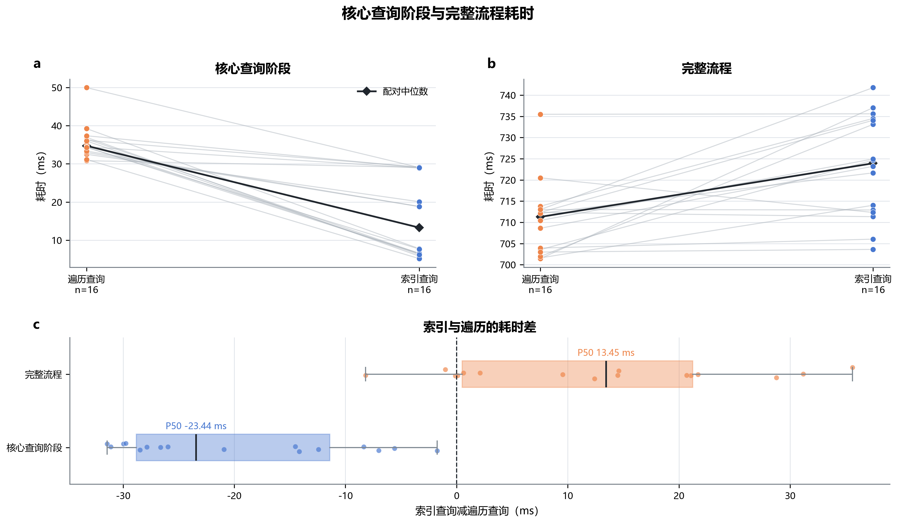
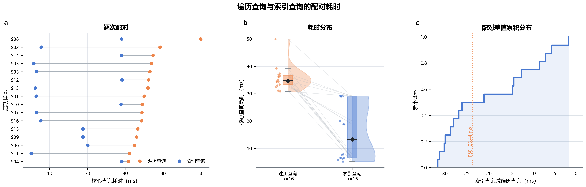
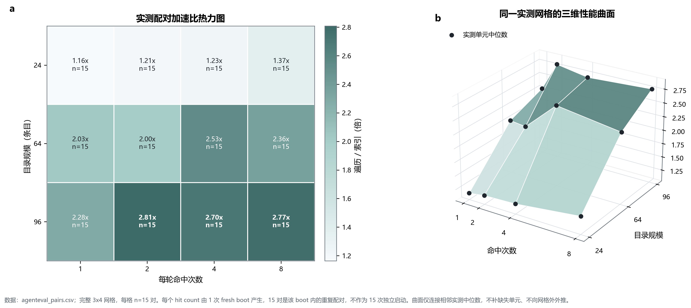
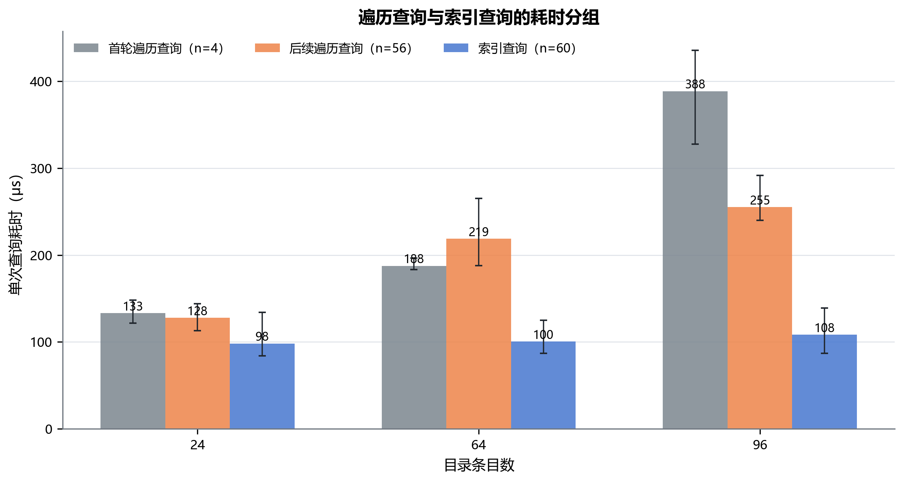
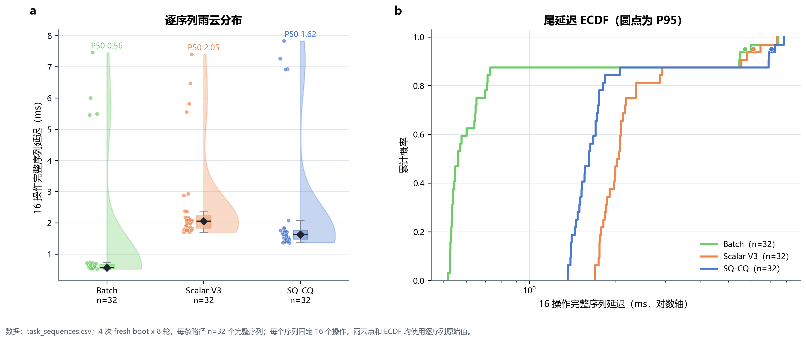
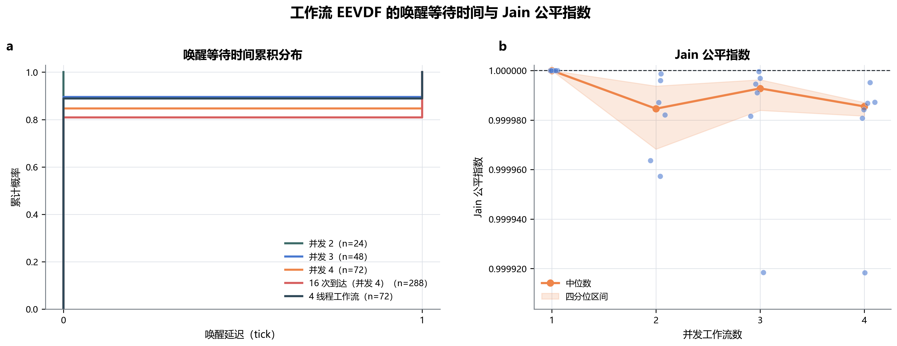
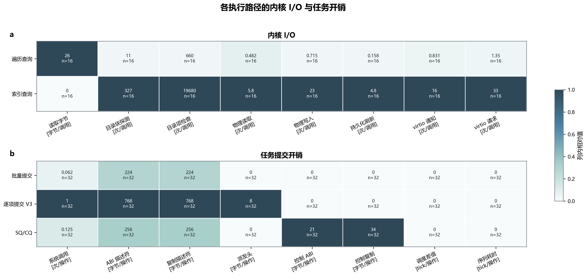

# AgentOS-uCore 性能测试

本轮测试集中检查 Live Query、Agent Task 和工作流 `EEVDF` 三条内核路径。每次 QEMU 独立启动的串口输出和每个样本的数据都完整保留。同一次启动中的两条路径使用相同的测试负载，可以直接配对比较；参数测试则改变目录规模、命中数和并发量，观察各项开销如何变化。

## 文档索引

- [1. 测试环境与数据](#1-测试环境与数据)
- [2. 采集方法与统计单位](#2-采集方法与统计单位)
- [3. 实时查询的核心阶段](#3-实时查询的核心阶段)
- [4. 目录规模与命中数](#4-目录规模与命中数)
- [5. 遍历查询与索引查询](#5-遍历查询与索引查询)
- [6. Agent Task 传输](#6-agent-task-传输)
- [7. 工作流 EEVDF 调度](#7-工作流-eevdf-调度)
- [8. 内核 I/O 与单位工作量](#8-内核-io-与单位工作量)
- [9. 查看数据并重新绘图](#9-查看数据并重新绘图)

## 1. 测试环境与数据

| 项目 | 配置 |
| --- | --- |
| Host | WSL2，x86_64 |
| Guest | QEMU RISC-V64 `virt`，单核（1 个 Hart） |
| 编译器 | `riscv64-linux-gnu-gcc 15.2.0` |
| QEMU | `10.2.1` |
| 采集时间 | 2026-08-11 00:27:57 至 01:03:08 UTC |
| 源码提交 | `2b14fb1f74b9bd093e6de939a16554620835699e` |
| 数据量 | QEMU 独立启动 30 次，33 个原始输出文件，19 个 CSV 文件，共 7,498 行 |

[`manifest.json`](../one_shot_metrics/data/20260811/manifest.json) 记录源码提交、工具版本、Guest 源码摘要、构建产物摘要、采集安排和文件清单。[`validation.json`](../one_shot_metrics/data/20260811/validation.json) 检查字段格式、样本配对、参数组合、逐操作行数和绘图输入，结果为 `valid=true`、`ready=true`。

## 2. 采集方法与统计单位

每次 QEMU 独立启动算一个测试批次。同一批次内的两条路径共用测试负载、文件系统初始状态和 Guest 程序。我们先计算同批次的差值或加速比，再汇总各批次结果。一次启动内的多轮重复测试也逐条保留，用来展示分布和中位数。

| 内核功能 | 独立启动次数 | 每个测试批次的安排 | 样本数 |
| --- | ---: | --- | ---: |
| 实时查询工作流 | 16 | 每次启动各运行一次遍历查询和索引查询；`AB/BA` 各 8 次 | 核心阶段 16 对，完整流程 16 对 |
| 查询参数组合 | 4 | 目录规模与命中数的每种组合运行 15 对，组内交替使用 `AB/BA` 顺序 | 180 对，共 360 条路径样本 |
| Agent Task | 4 | 每轮发送 16 个等价的 `ECHO` 操作；每次启动、每条路径运行 8 轮 | 96 轮，共 1,536 次操作 |
| 工作流 `EEVDF` | 6 | 运行 1 至 4 个并发工作流；另行测试 16 个工作流分批到达的负载，以及单个工作流使用 4 个线程的负载 | 180 个工作流，504 条唤醒采样 |

实时查询分别记录核心阶段和完整流程。两个计时范围如下：

| 计时范围 | 包含步骤 | 用途 |
| --- | --- | --- |
| 核心阶段 | 查询、恢复写入、`fsync` 和结果复核 | 比较索引查询能否缩短工作流主要处理步骤的耗时 |
| 完整流程 | 文件准备、元数据登记、工作流运行和清理 | 统计按当前启动方式完成一次任务的总用时 |

两组时间都按同一次启动配对统计，后文分别给出结果。

## 3. 实时查询的核心阶段

测试在同一份含 96 条记录的目录上分别运行遍历查询和索引查询。两种查询得到相同的结果摘要。遍历查询每次检查 97 条记录，索引查询检查 2 条。16 次独立启动采用均衡的 `AB/BA` 顺序。

| 指标 | 遍历查询 | 索引查询 | 同批次比较 |
| --- | ---: | ---: | ---: |
| 核心阶段中位数 | 34,712.5 微秒 | 13,293.5 微秒 | “索引查询减遍历查询”的中位数为 -23,441.5 微秒 |
| 核心阶段加速比 | - | - | “遍历查询耗时除以索引查询耗时”的中位数为 3.118 倍 |
| 索引查询较快的批次 | - | - | 16 组（全部） |
| 完整流程中位数 | 711,283.5 微秒 | 723,928.0 微秒 | 配对差值中位数为 +13,452 微秒 |
| 索引查询较快的完整流程批次 | - | - | 3 组（共 16 组） |

[](figures/performance/07_core_end_to_end_scope.pdf)

16 个测试批次中，索引查询的核心阶段都更短，配对差值中位数为 `-23.4415 毫秒`，中位加速比为 3.118 倍；索引把每次需要检查的记录从 97 条缩减到 2 条，因此核心阶段稳定受益。把核心阶段之外的准备与收尾步骤计入后，完整流程的配对差值却变为 `+13.452 毫秒`，约慢 `1.90%`，索引查询只有 3/16 个批次更快。逐组扣除核心阶段后，`indexed` 的核心外余量 16/16 都更长，中位多 `33.477 毫秒`，范围为 `+5.975` 至 `+49.563 毫秒`，说明当前一次启动的总体性能仍有缺陷：核心阶段以外的总开销抵消了索引收益。现有计时没有把场景启动、文件与元数据准备、统计输出和清理分别计时，尚不能断定哪一步占主导。部署时不能直接把核心阶段的加速比当作任务总加速比；下一步应先增加分段计时，再针对主导项优化。长期复用目录与工作流也需要另行测量。

[](figures/performance/01_paired_core_performance.pdf)

16 组配对结果全部由索引查询胜出，整体核心阶段中位加速比为 3.118 倍；索引缩小候选集合后，查询、恢复写入和结果复核组成的核心路径随之缩短。`AB` 与 `BA` 两组的中位加速比分别只有 1.454 倍和 5.481 倍，索引核心用时的四分位区间也达到 `6.5185` 至 `28.9128 毫秒`，表明收益方向稳定，但倍数和离散程度会受运行顺序及前序状态影响。后续性能回归应继续在同次启动内配对并轮换顺序，设计决策以“核心路径持续更短”为依据，不能把单一顺序或本轮倍数直接外推到其他环境。

## 4. 目录规模与命中数

参数测试采用 24、64、96 三种目录规模，以及 1、2、4、8 四种命中数。每种组合运行 15 对遍历查询和索引查询。统计用时前，先核对测试负载指纹和结果指纹。

| 目录记录数 | 命中 1 条 | 命中 2 条 | 命中 4 条 | 命中 8 条 |
| ---: | ---: | ---: | ---: | ---: |
| 24 | 1.164 倍 | 1.207 倍 | 1.231 倍 | 1.371 倍 |
| 64 | 2.032 倍 | 1.995 倍 | 2.534 倍 | 2.361 倍 |
| 96 | 2.283 倍 | 2.808 倍 | 2.704 倍 | 2.772 倍 |

[](figures/performance/02_catalog_speedup_landscape.pdf)

12 组实测中位加速比介于 1.164 倍和 2.808 倍之间，目录规模从 24 条增至 96 条时，索引的总体收益随候选集合扩大而上升；遍历查询需要检查更多目录记录，索引查询则把工作集中到命中集合。命中数与加速比并不单调，例如目录为 64 条时，命中 1、2、4、8 条的结果依次为 2.032、1.995、2.534、2.361 倍；按逐对样本统计，24、64、96 条目录中 `indexed` 较快的数量分别为 43/60、60/60 和 58/60。本组只计索引就绪后的查询阶段，没有计入索引建立和维护成本，因此查询规划器应同时使用目录规模、预期命中数和索引生命周期选择路径，部署时不宜只按命中数设置单一切换阈值。

## 5. 遍历查询与索引查询

采集程序先进行一次预热，再记录每组参数中的第一个遍历查询、后续遍历查询和索引就绪后的查询。这里的“第一个”是指预热后保留下来的第一条计时样本。每种目录规模有 4 个首个遍历查询样本、56 个后续遍历查询样本和 60 个索引查询样本。

| 目录记录数 | 首个遍历查询（微秒） | 后续遍历查询（微秒） | 索引查询（微秒） |
| ---: | ---: | ---: | ---: |
| 24 | 133.1 | 127.8 | 98.3 |
| 64 | 187.5 | 218.8 | 100.5 |
| 96 | 388.5 | 255.1 | 108.3 |

[](figures/performance/03_scan_state_groups.pdf)

目录从 24 条增至 96 条时，索引查询中位用时仅从 `98.3 微秒` 增至 `108.3 微秒`，96 条目录下首个遍历查询和后续遍历查询则分别达到 `388.5 微秒` 和 `255.1 微秒`；索引限制候选范围后，对目录扩大的敏感度明显较低。图中的“首个遍历查询”已经经过显式预热，并非系统冷启动样本；64 条目录下后续遍历查询的中位数 `218.8 微秒` 高于首个样本 `187.5 微秒`，还出现一次 `25.7505 毫秒` 尖峰，因此中位数改善不能说明尾延迟已经稳定。运行时适合复用已就绪的索引服务多轮查询，同时需要另测真正冷启动并持续观察高分位延迟，再决定部署预热和超时策略。

## 6. Agent Task 传输

每轮测试发送 16 个含义相同的 `ECHO` 操作，三种传输方式得到的结果指纹均为 `31`。4 次独立启动中，每种方式各运行 8 轮，因此各有 32 轮数据。Guest 以微秒为单位记录每轮的起止时刻，并为全部 1,536 次操作保存开始执行的间隔。

| 传输方式 | 轮数 | 中位数 | 四分位距 | 每轮系统调用数 |
| --- | ---: | ---: | ---: | ---: |
| 批量提交（Batch） | 32 | 561.0 微秒 | 533.75 至 663.0 微秒 | 1 |
| 逐项提交（Scalar V3） | 32 | 2,051.0 微秒 | 1,833.0 至 2,226.0 微秒 | 16 |
| 任务队列（`SQ/CQ`） | 32 | 1,620.5 微秒 | 1,472.0 至 1,755.5 微秒 | 2 |

[](figures/performance/04_task_latency_distributions.pdf)

批量提交、`SQ/CQ` 和逐项 V3 的中位用时分别为 `561.0`、`1,620.5` 和 `2,051.0 微秒`，对应每轮 1、2、16 次系统调用；减少内核往返次数后，16 个同步 `ECHO` 操作的稳态用时随之下降。每次启动的首轮中位用时仍为 Batch `5.747 毫秒`、Scalar V3 `6.1435 毫秒`、`SQ/CQ` `7.098 毫秒`，后续轮次才分别降至 `0.548`、`1.9965`、`1.5615 毫秒`；加上计时未包含通道建立、lifecycle 信息读取和 Execution Contract 创建，本组排序不能代表完整的一次性建链、异步积压或队列饱和场景。连续的同构短操作适合 Batch；需要长期保留队列、`backpressure`、`cancel` 和 terminal 状态时可使用 `SQ/CQ`，并应先消除首轮开销；Scalar V3 则保留每次调用独立 Execution Contract 的语义。

## 7. 工作流 EEVDF 调度

6 次独立启动分别运行 1、2、3、4 个并发工作流。系统一次最多容纳 4 个工作流，因此 16 个工作流分成 4 批运行。线程数放大场景同样运行 4 个工作流，其中一个使用 4 个忙线程，其余三个各用 1 个线程。唤醒采样只记录每批新建的工作流，不包含承担引导作用的工作流；它测量新工作流从进入可运行状态到真正获得调度所等待的 tick 数。公平性使用同一次启动、同一并发组内各工作流的原始 `service_cycles` 计算：

\[
J(x_1,\ldots,x_n)=\frac{(\sum_i x_i)^2}{n\sum_i x_i^2}.
\]

| 并发工作流数 | 独立启动次数 | Jain 公平指数中位数 |
| ---: | ---: | ---: |
| 1 | 6 | 1.000000 |
| 2 | 6 | 0.999985 |
| 3 | 6 | 0.999993 |
| 4 | 6 | 0.999985 |

[](figures/performance/05_eevdf_latency_fairness.pdf)

504 条唤醒采样中有 425 条为 0 tick、79 条为 1 tick，各并发组的 Jain 公平指数中位数均不低于 `0.99998`；`EEVDF` 在工作流可运行后依据 `eligible` 状态和 `virtual deadline` 分配外层 CPU 服务量，使 1 至 4 个并发工作流的 `service_cycles` 接近均分。一个工作流放大到 4 个忙线程时，Jain 中位数为 `0.9980725`，该工作流获得 `26.895%` 服务量，高于四个工作流均分时的 `25%`，说明工作流级记账大体抑制了线程放大，但并非绝对无偏。数据清单还标记了 boot 05 的 3 条 sample marker：串口拼接使它们缺少 wake-bucket 尾字段，但 `service` 值完整，其中并发度 3 和 4 的两条仍进入 Jain 计算；保守剔除相应测试批次后，两组中位数分别为 `0.9999911` 和 `0.9999842`，定性结论不变。精确唤醒分布来自独立的逐探针表，不受这 3 条记录影响。唤醒延迟只精确到 tick，本轮又限制在单 Hart、并发上限 4，16 个工作流还采用分批到达；面向更高并发或多核部署前，应补采这组记录，并增加更细粒度时钟、多 Hart 负载和线程数不对称回归。

## 8. 内核 I/O 与单位工作量

为便于核对，我们按照 CSV 中各指标的实际分母换算单位工作量。Live Query 上半图以核心时间窗内的系统调用数为分母，`traversal` 与 `indexed` 分别为 298 和 10，单位是每个 workload syscall，而不是每次查询；其中 lane counter 取自核心阶段，目录、块设备和 VirtIO counter 取自完整流程的前后差值。CSV 中仍保留 `owner`、`scope` 和 `window`，并可回查对应的串口输出。Agent Task 下半图则按已完成操作数折算系统调用、描述符字节、控制字节和调度次数。

[](figures/performance/06_normalized_io_heatmaps.pdf)

Live Query 核心阶段中，`traversal` 每对检查 97 条记录并读取 7,811 字节，`indexed` 检查 2 条记录；Agent Task 每完成一次操作，Batch、Scalar V3 和 `SQ/CQ` 的系统调用数分别为 `0.0625`、`1.0` 和 `0.125`，该排序与三种传输方式的用时一致。前一组差异来自索引收缩候选集合，后一组差异来自批量或队列减少内核往返。热力图每列独立归一化，其中全局 E2E I/O 还除以 `core-window` 系统调用数，`traversal` 与 `indexed` 的分母分别为 298 和 10，使 `indexed` 在若干 `per-syscall` 单元中看似高出 12 至 32 倍，不能解释为 I/O 恶化；原始绝对中位数显示 `physical_reads` 从 143.5 降至 58、`virtio_notifications` 从 247.5 降至 165、`virtio_submitted_requests` 从 402.5 降至 332，而 `physical_writes` 从 213 增至 225.5、`durable_flushes` 从 47 增至 48，`directory_block_probes` 与 `directory_entries_examined` 没有下降。`indexed` 的 `bytes_read=0` 只属于工作流核心窗口；热力图最后两列的 tick 中位数为 0，也仍有 Batch 7/32、Scalar V3 9/32、`SQ/CQ` 6/32 轮跨越 1 tick。完整流程仍有固定的 VFS、写入和 flush 成本，因此该图只适合在同一指标内定位路径开销，不能跨列比较颜色，也不能把 0 tick 或 `indexed` 的核心窗口解释为零耗时、零 I/O。

## 9. 查看数据并重新绘图

| 数据 | 文件 | 用途 |
| --- | --- | --- |
| 实时查询配对数据 | [`contest_paired.csv`](../one_shot_metrics/data/20260811/tables/contest_paired.csv) | 核心阶段和完整流程的配对差值、加速比及 `AB/BA` 顺序 |
| 查询参数组合 | [`agenteval_pairs.csv`](../one_shot_metrics/data/20260811/tables/agenteval_pairs.csv) | 12 种组合的热力图和三维曲面 |
| 查询状态样本 | [`agenteval_samples.csv`](../one_shot_metrics/data/20260811/tables/agenteval_samples.csv) | 首个遍历查询、后续遍历查询和索引查询分组 |
| 任务轮次 | [`task_sequences.csv`](../one_shot_metrics/data/20260811/tables/task_sequences.csv) | 每轮 16 次操作的用时分布 |
| 单次任务操作 | [`task_operations.csv`](../one_shot_metrics/data/20260811/tables/task_operations.csv) | 每次操作开始执行的间隔 |
| `EEVDF` 唤醒 | [`eevdf_wakeups.csv`](../one_shot_metrics/data/20260811/tables/eevdf_wakeups.csv) | 唤醒等待的累计分布 |
| `EEVDF` 服务量 | [`eevdf_samples.csv`](../one_shot_metrics/data/20260811/tables/eevdf_samples.csv) | 重新计算 Jain 公平指数 |
| 单位工作量 | [`contest_io_normalized.csv`](../one_shot_metrics/data/20260811/tables/contest_io_normalized.csv)、[`task_perf_normalized.csv`](../one_shot_metrics/data/20260811/tables/task_perf_normalized.csv) | 内核 I/O 和 Agent Task 热力图 |
| QEMU 串口输出 | [`raw/`](../one_shot_metrics/data/20260811/raw/) | CSV 各字段对应的原始标志行和来源摘要 |

重新检查已有表格：

```bash
python3 one_shot_metrics/validate.py \
  --tables one_shot_metrics/data/20260811/tables \
  --output ../agentos-validation.json
```

把文档中的七张图重新绘制到仓库外目录：

```bash
python3 docs/figures/performance/make_doc_figures.py \
  --output-dir ../agentos-figures
```

绘图脚本会读取 CSV 文件，生成 PNG、PDF 和 SVG，并在结束前重新核对每张输入表的 SHA-256。日常 Guest 测试与本轮性能采集的关系见[测试说明](testing.md)。
