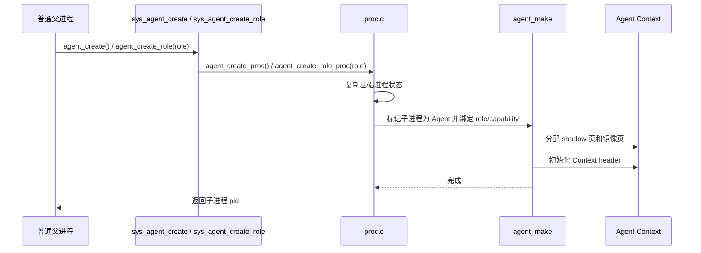

# 任务一：Agent 进程创建与地址空间设计

本文是 [design.md](design.md) 的任务一细节附录，重点展开 Agent 进程生命周期和地址空间设计。总体架构、关键决策和质量要求以主设计文档为准。

## 目标

任务一的目标是在 uCore 中加入 Agent 进程机制，使内核能够区分普通进程和 Agent 进程，并为 Agent 进程提供独立的 Agent Context 用户虚拟地址区。

当前 uCore 分支不是只做“能创建一个特殊进程”的最小实现，而是在任务一基础上加入：

- Agent PCB 元数据；
- 5 页 Agent Context；
- kernel shadow 权威历史；
- user mirror 高速读取镜像；
- 用户自管 Context cache；
- Agent 退出释放；
- 与后续任务二至五共用的状态字段。

## 当前接口

| 系统调用 | 作用 |
| --- | --- |
| `agent_create()` | 创建最低权限 sentinel Agent 子进程，保留兼容入口 |
| `agent_create_role(int role)` | 创建指定角色 Agent 子进程；pid 1 普通 init 和 pid 1 的直接普通子进程只能创建 orchestrator，具备 orchestrate 能力的 Agent 可创建其他角色 |
| `agent_info(struct agent_info *)` | 查询当前进程的 Agent 状态、Agent ID、Agent Context、配额、Loop 状态和路径元信息 |

当前任务一能力由 `agentfinal_ucore`、`labdemo_ucore` 和 `agentsecurity_ucore` 共同验证，覆盖 Agent 创建、Context 映射、多个 Agent 并存、角色能力绑定和退出路径。

## 进程元数据

在 `struct proc` 中新增 Agent 相关字段。用户可通过 `struct agent_info` 观察其中一部分：

| 字段 | 说明 |
| --- | --- |
| `is_agent` | 是否为 Agent 进程 |
| `agent_type` | Agent 类型，普通进程为 `AGENT_TYPE_NONE`，Agent 进程为 `AGENT_TYPE_AGENT` |
| `agent_id` | Agent 进程 ID，启动周期内递增分配 |
| `agent_role` | 当前 Agent 的真实内核角色 |
| `agent_ctx_base` | Agent Context 用户虚拟地址起点 |
| `agent_ctx_size` | Agent Context 大小 |
| `heartbeat_interval` | Agent 心跳周期，`agent_heartbeat()` 可设置 |
| `resource_quota` | Agent Context Path 记录配额，当前为 128 条 |
| `loop_state` | Agent Loop 状态，支持 `IDLE`、`RUNNING`、`WAITING` |
| `agent_call_count` | 当前 Agent 工具调用总数 |
| `context_path_count` | 当前有效 Context Path 记录数 |
| `context_path_capacity` | Context Path 最大记录数 |
| `context_path_head` | 下一条 Context Path 写入槽位 |
| `context_path_oldest` | 当前仍可查询的最早 Context Path 序号 |
| `context_path_latest` | 当前最新 Context Path 序号 |
| `context_path_dropped` | 因 FIFO 覆盖淘汰的历史记录数 |
| `context_path_rollback_count` | 成功回滚 Context Path 的次数 |
| `latest_response_offset` | 最近一次结构化响应在 Agent Context 中的偏移 |
| `records_offset` | Context Path 记录数组在 Agent Context 中的偏移 |
| `user_cache_offset` / `user_cache_size` | 通过 Context header 暴露的用户自管 cache 位置和大小 |
| `event_count` | 当前 Agent 已接收事件数 |
| `event_dropped` | 事件投递失败或被丢弃计数 |
| `wait_count` | 当前 Agent 调用等待次数 |
| `wait_loop_count` | `agent_wait()` 检查循环次数，用于观察有限 timeout 没有反复轮询 |
| `timeout_count` | 等待超时次数 |
| `last_heartbeat_tick` | 最近心跳 tick |
| `capability_mask` | 当前 Agent 能力位，由内核按 `agent_role` 分配 |

普通进程的 `is_agent` 为 0，`agent_id` 为 0，且不会安装 Agent metadata 或 Agent Context 特殊映射。普通进程调用 Agent-only syscall 时会返回错误。

## 地址空间设计

Agent Context 使用固定高地址用户虚拟区：

| 项目 | 值 |
| --- | --- |
| 起始地址 | `AGENT_CONTEXT_BASE` |
| 大小 | `AGENT_CONTEXT_SIZE = 5 * 4096` |
| 当前实测大小 | 20480 字节 |
| 权限 | 用户态镜像可读写，不可执行 |
| 记录容量 | 128 条 |

这个权限说明只针对 Agent Context 特殊页。普通用户程序页仍由 uCore flat binary loader 按基底方式映射，当前不声明完整用户程序 W^X。

该区域位于 trapframe 下方，只有 Agent 进程在创建时安装 Agent Context 特殊映射。内核在 `struct proc` 中保存 5 个用户镜像页地址和 5 个 shadow 权威页地址，写 header、latest result 和 Context Path record 时先写内核 shadow 页，再同步到用户镜像页。

这种设计的效果：

1. Agent 可以直接读取 Context 镜像，减少 syscall。
2. 内核仍掌握权威历史，防止用户态伪造 Context Path。
3. 固定地址简化用户态 ABI。
4. 5 页容量足以容纳 header、latest result、128 条摘要记录，并在尾部保留用户自管 cache。

完整工具调用详情保存在内核 PCB 的 detail ring 中，通过 `context_detail()` 查询；它不占用用户 Context 页。这样用户 Context 可以同时承担高速镜像和 Agent 自管缓存，不把完整详情暴露为可被用户态直接改写的内存。

## 创建流程



子进程从 `agent_create()` 或 `agent_create_role()` 返回 0 后继续执行用户代码，并可以立即调用 `agent_info()`、`agent_run()`、`context_snapshot()` 等 Agent syscall。

## 释放流程

Agent 退出时，`freeproc()` 会释放 Agent Context 相关页面，并清空 Agent 元数据。当前最终测试均会创建 Agent 子进程并等待其退出，用于覆盖正常释放路径。

## 演示路径

`agentfinal_ucore` 中的任务一验证路径：

1. 普通父进程调用 `agent_create_role(AGENT_ROLE_ORCHESTRATOR)`。
2. 子进程调用 `agent_info()`。
3. 子进程确认 `is_agent == 1`。
4. 子进程确认 `agent_role == AGENT_ROLE_ORCHESTRATOR`，且 capability mask 包含 `META_WRITE` 和 `ORCHESTRATE`。
5. 子进程确认 Context base 和 size 与 ABI 常量一致。
6. 子进程直接读取 Agent Context header。
7. 子进程执行后续工具调用和 Context 测试。
8. 父进程等待子进程退出并检查状态。

`labdemo_ucore` 进一步证明多个 Agent 可以并存。普通 init 只创建 orchestrator，orchestrator 再创建：

- recovery；
- investigator；
- sentinel。

三个 Agent 都输出自己的 role、pid 和 Context 地址。Context 地址是同一个用户虚拟地址，但每个 Agent 对应不同物理页。

## 当前扩展

相比最小任务一要求，当前实现额外加入：

- 5 页 Context，而不是单页或小固定缓冲；
- shadow 权威历史；
- Context Path 元信息；
- 事件统计和心跳字段；
- capability mask；
- 与任务四、五、六共享的 Agent 状态。

## 已知限制

| 限制项 | 说明 |
| --- | --- |
| Agent 创建参数 | `agent_create()` 保持最低权限 sentinel 兼容入口；复杂配额和自定义能力仍未开放给用户态 |
| Agent exec 场景 | 当前最终测试不把 exec 作为主验收入口 |
| 长期资源统计 | 当前统计足够支撑测试和演示，未做完整平台级资源审计 |

## 验证证据

```text
agentfinal_ucore: context size=20480 capacity=128
agentfinal_ucore: passed
agentfinal_ucore: parent passed
```

```text
labdemo_ucore: created role=orchestrator pid=2 context=0x0000003ffffea000
labdemo_ucore: created role=recovery pid=3 context=0x0000003ffffea000
labdemo_ucore: created role=investigator pid=4 context=0x0000003ffffea000
labdemo_ucore: created role=sentinel pid=5 context=0x0000003ffffea000
```
