# 双目标 uCore 科研 Agent 平台验证说明

本文档说明如何构建、运行和检查当前分支的两个目标。正文使用中文；命令、程序名、状态字段和运行输出保持原文。

## 构建命令

plain target：

```bash
make -C user clean
make clean
make user nfs/fs.img TOOLPREFIX=riscv64-linux-gnu- CHAPTER=platform_plain
make build TOOLPREFIX=riscv64-linux-gnu- CHAPTER=platform_plain LOG=warn INIT_PROC=rp_plain
make plain-platform-build TOOLPREFIX=riscv64-linux-gnu-
```

seeded plain target：

```bash
make user nfs/fs.img TOOLPREFIX=riscv64-linux-gnu- CHAPTER=platform_seeded
make build TOOLPREFIX=riscv64-linux-gnu- CHAPTER=platform_seeded LOG=warn INIT_PROC=rp_seed_orch
```

AgentOS target：

```bash
make agentos-user TOOLPREFIX=riscv64-linux-gnu-
make agentos-build TOOLPREFIX=riscv64-linux-gnu-
make agentos-test TOOLPREFIX=riscv64-linux-gnu-
make agentos-platform-build TOOLPREFIX=riscv64-linux-gnu-
```

双目标运行：

```bash
bash scripts/verify-dual-target-structure.sh
make dual-platform-run TOOLPREFIX=riscv64-linux-gnu-
```

`make dual-platform-run` 会在启动 QEMU 前再次执行同一结构检查，避免直接运行双目标时跳过目录职责、平台程序覆盖、源码同步和 backend 证据覆盖检查。脚本随后运行一批代表性 seeded 请求：同一批请求会分别进入 plain uCore 和 AgentOS-uCore，两个平台目标在生成文件系统镜像前会清理用户态编译产物，确保镜像来自当前源码。脚本会复用这次 seeded 双目标运行提取出的 `rp_*` 状态文件，继续执行状态文件对照、Host Reader 渲染和页面检查，不再额外重复跑一轮普通平台 QEMU。

完整验证入口：

```bash
make full-verify TOOLPREFIX=riscv64-linux-gnu-
```

这条命令会按顺序执行：

- 双目标结构检查；
- 宿主机科研 Agent 平台能力对齐检查；
- 宿主机科研 Agent 平台测试主题对齐检查；
- 宿主机 Web/API/action 规模检查；
- Host Reader 两个页面与 API 检查；
- 未改动 uCore 平台和 AgentOS-uCore 平台的 QEMU 运行；
- AgentOS 内核专项测试。

期望最后看到：

```text
[full-verify] all checks passed
```

如果需要指定工具，可以设置 `PYTHON_BIN=...`、`QEMU=...`、`CASE_TIMEOUT=...`。本机 WSL 环境下可直接使用默认 `python3`、`qemu-system-riscv64` 和 `240s` 单项超时时间。

快速目标检查：

```bash
make target-readiness
```

这条命令会执行双目标结构检查和关键 Host 工具单测，不启动 QEMU。它适合在修改文档、脚本、Host Reader 或对照逻辑后快速确认目标关系没有被破坏。内核、用户程序、文件系统镜像或启动流程发生变化时，仍应运行 `make dual-platform-run` 和 AgentOS 专项测试。

## 普通目标验证：plain target

运行目录程序：

```bash
timeout 45s make run TOOLPREFIX=riscv64-linux-gnu- CHAPTER=platform_plain LOG=warn INIT_PROC=rp_plain
```

关键输出应包含：

```text
rp_plain summary
catalog_ok=1 checks_ok=1 mature_ok=1 run_ok=1 search_ok=1
rp_plain: passed
```

运行多进程科研平台：

```bash
timeout 45s make plain-platform-run TOOLPREFIX=riscv64-linux-gnu-
```

关键输出应包含：

```text
rp_orch: start programs=70
rp_backend: cases=7 executable=7 userland_equivalent=ready exports=1 status=ready
rp_compare_plain: plain_kernel=passed ...
rp_orch: passed
```

说明：

- `rp_orch` 不是单进程静态表，而是通过普通 `fork/exec/waitpid` 串联多个用户程序。
- `rp_backend`、`rp_backend_exec`、`rp_study`、`rp_agentcmp` 记录 plain target 的用户态成本和 AgentOS 替代目标。
- `rp_realtask`、`rp_artifact_manifest`、`rp_workbench`、`rp_package` 对应真实输入、artifact、workbench、证据包和交付记录。

## 增强目标验证：AgentOS target

运行 AgentOS 科研平台：

```bash
make agentos-platform-run TOOLPREFIX=riscv64-linux-gnu-
```

关键输出应包含：

```text
rp_agentos_orch: passed
rp_backend: cases=8 executable=8 agentos=mainflow_bound exports=1 status=ready
```

AgentOS 运行必须生成或验证以下状态文件：

```text
rp_agentos_kernel
rp_agentos_mainflow
rp_agentos_query
rp_agentos_recovery
rp_agentos_timeline
rp_agentos_collab_ack
rp_agentos_audit
rp_agentos_workbench
rp_agentos_package
rp_agentos_real_task
rp_agentos_conflict
```

其中 `rp_agentos_mainflow` 是增强目标主证据文件，应包含可信 Context、metadata 查询、事件通知、失败恢复、权限拒绝、timeline、ledger/provenance、文件编辑租约、workbench 文件校验、证据包 provenance 和真实任务 Context。

## 双目标验证

先做快速结构检查：

```bash
bash scripts/verify-dual-target-structure.sh
```

期望关键标记：

```text
[dual-target-check] plain kernel: clean
[dual-target-check] plain kernel base: origin/main
[dual-target-check] AgentOS kernel: present
[dual-target-check] platform source coverage: 73 root rp sources mirrored
[dual-target-check] platform app coverage: 71 build-list apps mirrored
[dual-target-check] platform source sync: identical=30 adapted=43
[dual-target-check] backend evidence coverage: plain=7 agentos=8 preserved_costs=7
[dual-target-check] platform runners: present
[dual-target-check] docs: wording scan passed
```

运行：

```bash
make dual-platform-run TOOLPREFIX=riscv64-linux-gnu-
```

期望关键标记：

```text
[dual-platform] checking target structure
[dual-platform] running seeded dual-target research platform
seeded_action_state: plain start chapter=platform_seeded init=rp_seed_orch action_count=44 log=/tmp/agentos-dual-platform/seeded-action-state/plain/ucore-run.log
seeded_action_state: plain done passed=1 extracted_state_files=258 status=ready
seeded_action_state: agentos start chapter=platform_agentos init=rp_agentos_orch action_count=44 log=/tmp/agentos-dual-platform/seeded-action-state/agentos/ucore-run.log
seeded_action_state: agentos done passed=1 extracted_state_files=271 status=ready
seeded_action_state: action=/actions/research/rerun action_count=44 host_routes=95 seeded_routes=21 seeded_kinds=21 plain=ready agentos=ready status=ready
[dual-platform] plain uCore research platform log: /tmp/agentos-dual-platform/seeded-action-state/plain/ucore-run.log
rp_orch: passed
rp_orch: programs_ok=70 programs_total=70
rp_backend: cases=7 executable=7 userland_equivalent=ready exports=1 status=ready
[dual-platform] AgentOS-uCore research platform log: /tmp/agentos-dual-platform/seeded-action-state/agentos/ucore-run.log
rp_agentos_orch: passed
rp_agentos_orch: kernel_agent=1 workflow=rp_orch status=ready
rp_orch: programs_ok=70 programs_total=70
rp_backend: cases=8 executable=8 agentos=mainflow_bound exports=1 status=ready
[dual-platform] plain extracted state files: 258
[dual-platform] AgentOS extracted state files: 271
host_platform_alignment: host_modules=154 tracked_host_modules=154 plain_sources=73 agentos_sources=74 runtime_state_checked=1 groups_ok=13 groups_total=13 untracked_host_modules=0 status=ready
host_test_alignment: host_tests=142 themes_ok=7 themes_total=7 unclassified_tests=0 runtime_state_checked=1 status=ready
host_action_kind_alignment: action_routes=95 action_kinds=95 generic_routes=0 plain_missing=0 agentos_missing=0 plain_handler_missing=0 agentos_handler_missing=0 status=ready
host_surface_alignment: api_routes=214 action_routes=95 download_refs=76 runtime_state_checked=1 status=ready
dual_platform_state_compare: plain_files=258 agentos_files=271 common_files=258 agentos_extra_files=13 checked_success_records=1244 preserved_plain_costs=7 embedded_action_records=44 run_result_match=1 agentos_evidence_checks=32 agentos_mainflow_stages=11 agentos_mainflow_facts=12 plain_timing_records=70 plain_agent_launches=0 plain_fork_launches=70 agentos_timing_records=70 agentos_agent_launches=9 agentos_fork_launches=61 status=ready
plain_ucore_reader: pages=40 api_json=267 state_files=260 status=ready
plain_ucore_reader: pages=40 api_json=280 state_files=273 status=ready
reader_output_check: pages=40 api_json=267 state_files=260 required_pages=6 spec_pages=40 agentos_compare_markers=0 status=ready
reader_output_check: pages=40 api_json=280 state_files=273 required_pages=6 spec_pages=40 agentos_compare_markers=13 status=ready
dual_platform_reader_compare: plain_pages=40 agentos_pages=40 plain_state_files=260 agentos_state_files=273 agentos_extra_state_files=13 plain_api_json=267 agentos_api_json=280 agentos_extra_api_json=13 checked_pages=40 checked_api_json=267 status=ready
```

这条命令的意义是：用同一批 seeded 请求分别运行未改动 uCore 目标和 AgentOS-uCore 目标，并检查两个目标是否实际跑完同一批科研平台程序、围绕同一 RUN-042 科研流程输出可比较结果。脚本会从两个文件系统镜像中提取 `rp_*` 状态文件，并执行状态文件对照：plain target 产出的状态文件必须全部能在 AgentOS target 中找到；plain target 已经标记为 `ready`、`passed` 或 `ok` 的记录，AgentOS target 必须保留相同记录标识和成功状态。AgentOS target 可以额外增加内核证据文件和内核观测字段，并且 `rp_agentos_mainflow` 必须按平台程序执行顺序写入 11 个内核参与阶段、覆盖 12 类内核事实。随后脚本会把两个目标的真实状态文件都交给 Host Reader 渲染，并把宿主机平台能力对齐摘要、宿主机测试主题对齐摘要、宿主机 Web/API/action 规模摘要和 seeded 请求运行结果传入 Compare 页面；同时脚本会单独输出宿主机 action kind 处理检查，确认宿主机 action 路由没有只停留在路由层。Host Reader 会检查 40 个页面是否都生成、页面标题是否匹配、基础页面结构是否完整、关键页面是否存在、每个 API JSON 是否能被解析且结构正确；当输入包含 AgentOS 状态文件时，还会检查 Compare 页面是否渲染出 AgentOS 主流程、内核输出文件和 Context、metadata、事件、ledger、真实任务、文件编辑租约等关键字段。最后比较渲染摘要，确认两个目标生成同一套页面，AgentOS target 的状态文件数量和 API JSON 数量不能少于 plain target，并直接输出 `agentos_extra_state_files` 与 `agentos_extra_api_json` 说明增强目标多出的内核证据规模。

## 结果产物和图表

`make dual-platform-run` 会把原始日志和提取状态保存在 `/tmp/agentos-dual-platform/`，并把面向阅读的汇总材料写入 `results/latest/`：

```text
results/latest/summary.csv
results/latest/runner-sweep.csv
results/latest/runner-statistics.csv
results/latest/load-profile.csv
results/latest/evidence-manifest.csv
results/latest/demo-checklist.csv
results/latest/delivery-readiness.csv
results/latest/test-suite.csv
results/latest/experiment-design.csv
results/latest/chart-type-coverage.csv
results/latest/demo-guide.html
results/latest/demo-checklist.html
results/latest/delivery-readiness.html
results/latest/test-suite.html
results/latest/experiment-design.html
results/latest/runner-statistics.html
results/latest/evidence-map.html
results/latest/index.html
results/latest/monitor.html
results/latest/report.md
results/latest/charts/dual-target-state-reader.svg
results/latest/charts/runtime-observation.svg
results/latest/charts/scenario-evidence.svg
results/latest/charts/cost-replacement.svg
results/latest/charts/runner-ticks.svg
results/latest/charts/runner-speedup.svg
results/latest/charts/runner-statistics.svg
results/latest/charts/load-profile.svg
results/latest/charts/runner-cumulative-line.svg
results/latest/charts/runner-tick-box.svg
results/latest/charts/runner-cost-heatmap.svg
results/latest/charts/stage-monitor-area.svg
results/latest/charts/runner-surface-composite.svg
results/latest/charts/launch-model.svg
results/latest/charts/agentos-evidence.svg
results/latest/charts/stage-timings.svg
```

`demo-guide.html` 适合录屏时按顺序打开关键页面；`demo-checklist.html` 适合录屏前确认本次结果是否具备展示条件；`delivery-readiness.html` 适合提交前把图表、LLM Relay、录屏、证据索引和文档要求逐项对应到验证产物；`test-suite.html` 适合说明最终演示、快速检查、完整验证和专项测试分别应运行哪条命令；`experiment-design.html` 适合解释每个测试场景的负载、对照路径、参数、指标和数据来源；`runner-statistics.html` 适合先看 runner 成组数据的 count/min/avg/max，再进入单个场景图；`evidence-map.html` 适合按产物查看数据来源和证明内容；`monitor.html` 适合先展示本次运行是否健康；`index.html` 适合集中查看图表摘要；`summary.csv`、`runner-sweep.csv`、`runner-statistics.csv`、`load-profile.csv`、`evidence-manifest.csv`、`demo-checklist.csv`、`delivery-readiness.csv`、`test-suite.csv` 和 `experiment-design.csv` 适合复制到答辩材料或进一步处理；`report.md` 适合直接阅读；`charts/*.svg` 是从本次运行数据生成的图表。文档中保留一组示例图，数值来自一次完整运行样例，实际运行时以 `results/latest/` 下的新文件为准。

图表由 `host_tools/summarize_dual_platform_results.py` 使用 Python 标准库直接生成 SVG，不依赖本机私有绘图软件。这样做的好处是，用户 clone 仓库后只要能运行 Python，就可以重新生成和验证这些图表。`chart-type-coverage.csv` 会列出当前结果页覆盖的图表类型：条形/柱状对比、曲线趋势、箱形图、热力图、监控面积图，以及曲面、投影、热力组合图；这些图都可以追溯到 `summary.csv`、`runner-sweep.csv`、`runner-statistics.csv`、`load-profile.csv`、`stage-timings.csv` 或状态对照 JSON。`evidence-manifest.csv` 则把主要产物、数据来源、证明内容和录屏用途放在一张表里，方便从图表返回原始结果。`demo-checklist.csv` 记录双目标结果、Reader 页面与 API、QEMU 运行状态、核心图表、证据索引、演示入口、原始运行状态和 AgentOS 主流程证据是否可用于展示；对应的 `demo-checklist.html` 可以在录屏前直接打开。`delivery-readiness.csv` 把图表展示、图表可读性、DeepSeek default 模式、录屏入口、测试入口、实验场景、证据索引、功能与性能展示和文档措辞检查对应到具体产物；对应的 `delivery-readiness.html` 适合提交前核对。`test-suite.csv` 把最终演示主路径、日常快速检查、完整验证、AgentOS 内核专项、LLM 模式契约和图表可读性检查分开说明；对应的 `test-suite.html` 用于解释测试入口选择。`experiment-design.csv` 列出科研主流程双目标对照、Reader 页面与 API 对照、AgentOS 机制场景覆盖、用户态成本替代、runner tick 成组对照、运行阶段耗时观测和负载参数组；对应的 `experiment-design.html` 适合在解释测试设计时打开。`runner-statistics.csv` 从 runner 成组数据计算 count、min、avg、max；对应的 `runner-statistics.html` 和 `charts/runner-statistics.svg` 适合说明整体 tick 趋势。

`host_tools/test_chart_type_data_contract.py` 专门检查这件事：它用一组 runner 和 stage 样例数据生成完整结果目录，再确认 `chart-type-coverage.csv` 不存在空缺项、每个声明的 SVG 都真实生成、`runner-sweep.csv` 中的数值能解释相对倍数图，组合图也包含曲面、投影和热力三个视角。`host_tools/test_chart_svg_layout_contract.py` 会继续解析生成后的 SVG 和文档内提交的示例 SVG，检查文字是否留在画布内，并检查明显的文字框相交问题，避免图表在录屏和文档阅读时出现文字压住文字的情况。

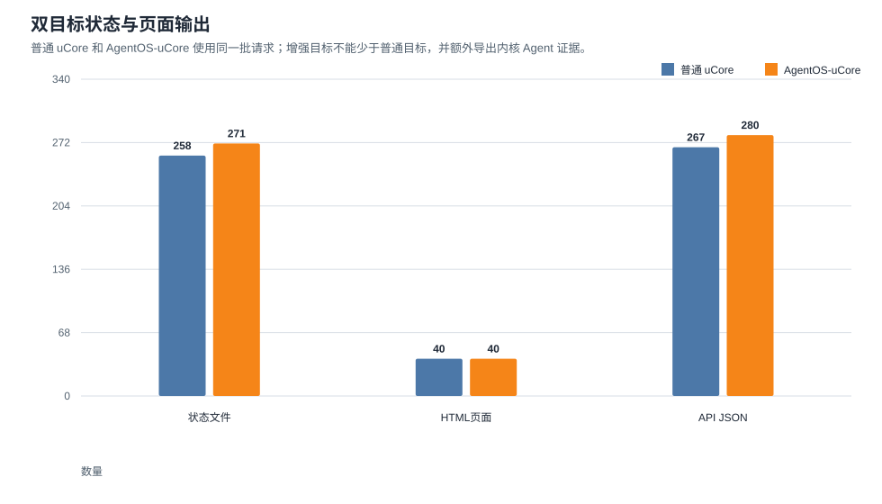

这张图使用分组柱状图展示状态文件、HTML 页面和 API JSON 数量。plain target 和 AgentOS target 使用同一批 seeded 请求；AgentOS target 页面数量与 plain target 一致，同时多出内核 Agent 相关状态文件和 API JSON。这个结果比单独列日志更直观：增强目标没有缩小科研平台展示面，而是在同一展示面上增加内核事实。

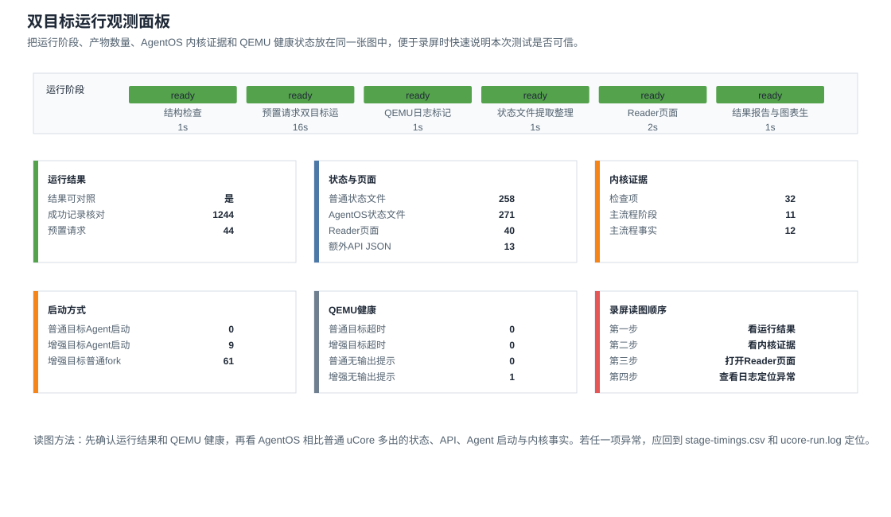

这张图把阶段执行、状态产物、内核证据、Agent 启动方式和 QEMU 健康状态放在同一个画面里。录屏时可以先用它说明本次双目标测试不是只看 `passed` 标记：测试脚本记录了每个阶段的耗时，核对了普通目标和增强目标的共有结果，也检查了增强目标额外输出的 Context、文件 metadata、事件、timeline、audit 和 provenance 证据。如果图中的超时、无输出提示或阶段状态异常，后续说明应回到对应日志，而不是继续引用本次数据。

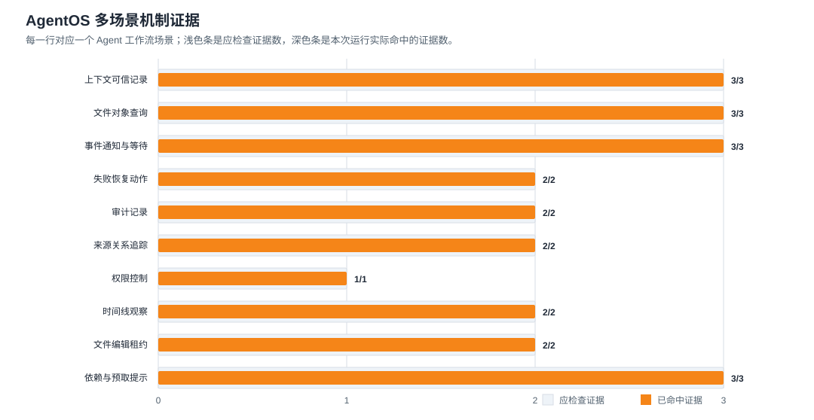

这张图把 AgentOS 在同一科研负载中使用到的内核机制按场景分组，包括上下文可信记录、文件对象查询、事件通知、恢复动作、审计记录、来源关系追踪、权限控制、时间线观察、文件编辑租约、依赖与预取提示。每个场景都有应检查证据数和实际命中证据数，来源文件写入 `report.md` 的“多场景机制证据”表格。这样可以直接看出增强内核不是只在单个接口上通过测试，而是在完整科研流程里同时承担多类 Agent 工作。

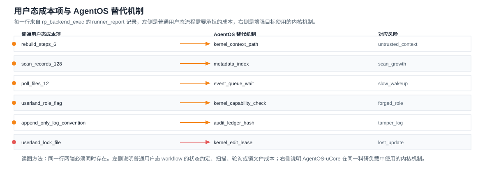

这张图读取两个目标的 `rp_backend_exec` 记录。左侧列出普通用户态科研 Agent 平台为了完成同一流程需要承担的成本，例如重建上下文路径、扫描状态文件、使用约定字段表达权限、用锁文件避免并发写入、用轮询观察事件；右侧列出 AgentOS-uCore 在增强目标中实际使用的替代机制，例如内核 Context Path、文件 metadata 索引、capability 检查、事件队列、文件编辑租约、timeline、audit 和 provenance。读图时应逐行检查：同一行左侧说明普通目标的问题来源，右侧说明增强目标的内核机制，风险说明给出该项机制要解决的工程问题。

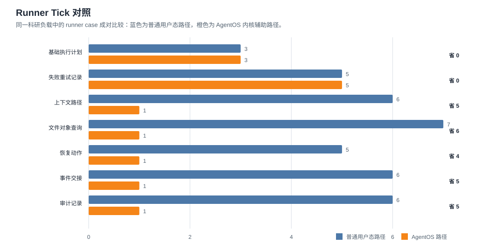

这张图继续读取 `rp_backend_exec`，但关注 `runner_case` 中的 `ticks` 字段。普通目标的用户态路径会记录上下文重建、manifest 扫描、文件事件交接、追加日志等动作；增强目标的对应路径会记录 Context snapshot、metadata index、event queue、ledger snapshot 等内核辅助动作。图中蓝色条和橙色条使用同一 QEMU、同一输入、同一科研流程下的相对 tick，不用于说明物理机绝对性能；它用于回答一个更具体的问题：同一类 runner 动作换成 AgentOS 机制后，流程步骤和观测 tick 是否下降。

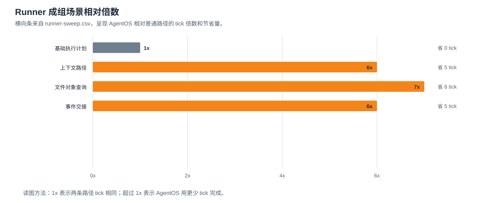

这张图由 `runner-sweep.csv` 生成。CSV 保留每个场景的 plain case、AgentOS case、两边 tick、节省 tick 和相对倍数；SVG 把这些成组场景按条形图展示。它对应参考项目中“参数成组变化后再解释曲线”的测试写法：即使当前 uCore/QEMU 不适合宣称物理机吞吐，仍可以在同一输入下比较上下文、文件查询、事件交接、恢复动作和审计记录的相对运行成本。录屏时可以先展示 `runner-ticks.svg` 说明每组数字，再打开 `runner-sweep.csv` 说明图表可以回到原始表格。

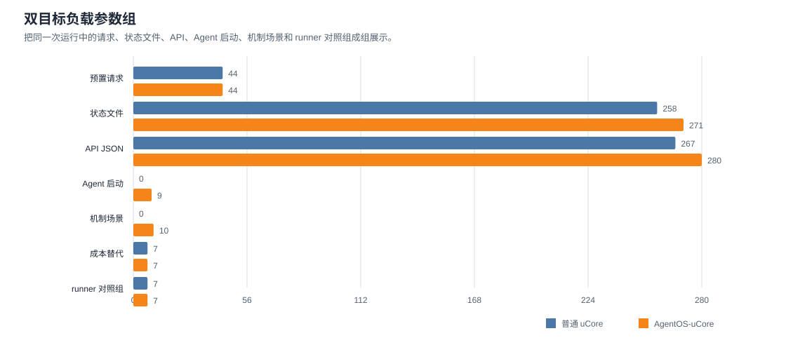

这张图由 `load-profile.csv` 生成，把同一次双目标运行中的负载参数集中展示，包括预置请求、状态文件、API JSON、Agent 启动、机制场景、成本替代和 runner 对照组。它不把一次 QEMU 运行包装成多次压力实验，而是把“本次测试到底覆盖了多大规模的对象”讲清楚，方便评审把后续图表放回同一批输入和状态产物中理解。

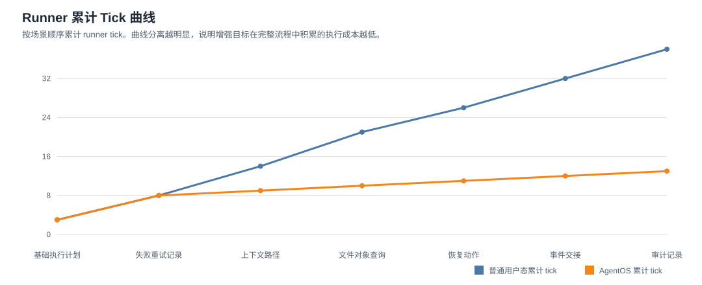

这张曲线图按 runner 场景顺序累计 tick。普通用户态路径的累计曲线和 AgentOS 路径的累计曲线如果持续分离，说明差异不是单个接口偶然造成的，而是在上下文、文件查询、事件、恢复和审计等多个环节逐步积累。它对应参考项目中用曲线解释运行过程的写法。

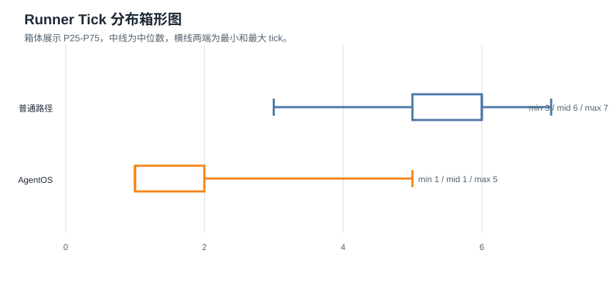

这张箱形图展示 plain 与 AgentOS runner tick 的分布。箱体表示 P25 到 P75，中线表示中位数，横线两端表示最小值和最大值。相比单个均值，它更适合说明增强目标是否同时降低了中位成本和高成本场景。

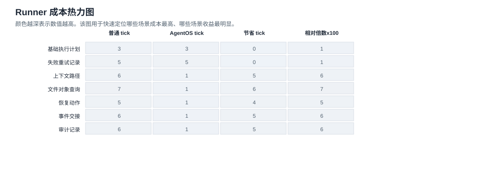

这张热力图把场景和指标放在同一张表里，颜色越深表示数值越高。读图时可以快速定位普通路径中最重的步骤，以及 AgentOS 在哪些步骤中节省最多 tick。它对应参考项目中用热力图展示不同参数组合强弱的方式。

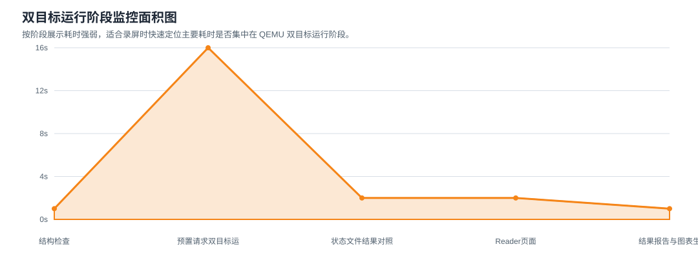

这张面积图使用 `stage-timings.csv`，按阶段展示耗时强弱。它用于录屏时解释本次运行的主要时间花在何处；如果某个阶段异常抬高，应回到该阶段日志，而不是只看最终 `passed` 标记。

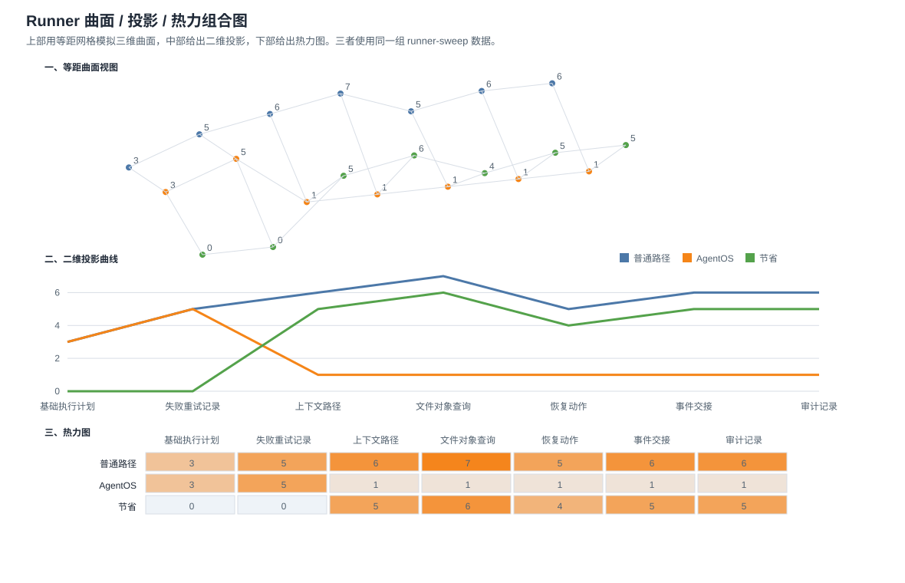

这张组合图包含三个视角：上部是等距曲面视图，中部是二维投影曲线，下部是热力图。三者使用同一组 `runner-sweep.csv` 数据，分别强调峰值形态、趋势变化和局部强弱。它借鉴参考项目中“三维曲面 + 二维投影 + 热力图”合并展示延迟数据的方式，但数据对象换成 AgentOS runner 场景、路径类型和 tick。

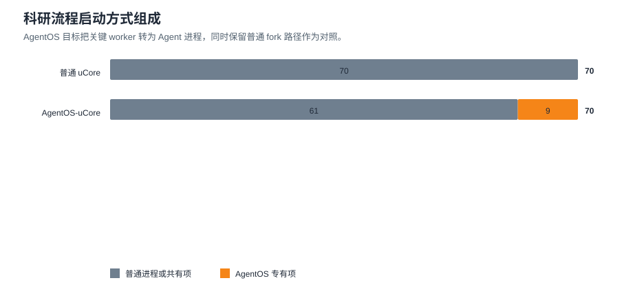

这张图展示两个目标中平台程序的启动方式。plain target 的 70 条启动记录全部来自普通 `fork/exec/waitpid`；AgentOS target 保留普通进程路径，同时把 9 个关键 worker 接到 Agent 创建路径。它不是把普通平台替换成独立测试程序，而是在同一科研流程中使用内核 Agent 机制。

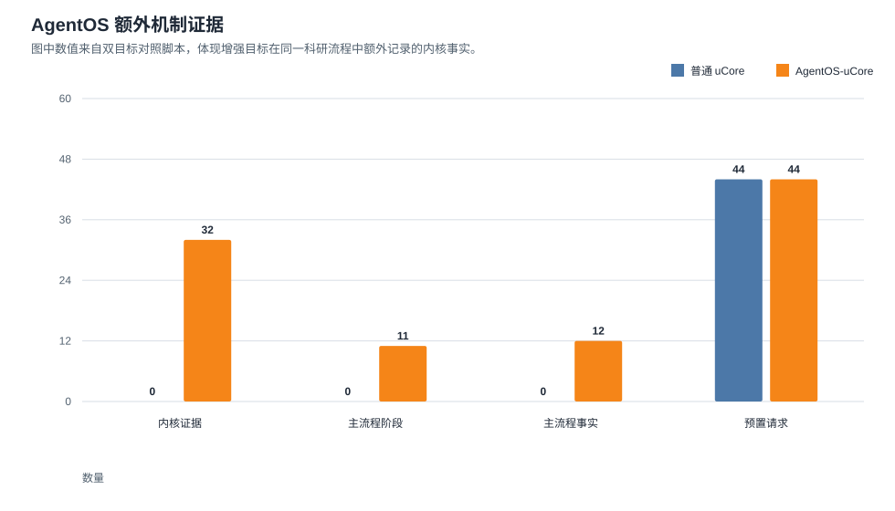

这张图展示 AgentOS target 在同一科研流程中额外写出的内核事实，包括内核证据检查项、主流程内核阶段、主流程事实和预置请求数量。普通目标对应值为 0 或共同请求数，用来凸显差异来自增强内核而不是输入变化。

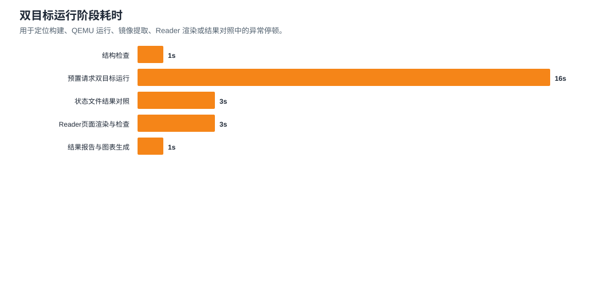

这张图展示双目标运行的大阶段耗时。它主要用于定位运行问题：如果完整验证长时间没有结束，应先看哪个阶段耗时异常，再打开对应日志。QEMU 内部还会记录 `qemu_elapsed_seconds`、`qemu_idle_notices`、`qemu_timed_out` 和最后输出片段；这些字段能区分“运行确实慢”“程序卡住”“QEMU 没有看到通过标记”和“已经出现错误文本”。

报告生成由 `host_tools/summarize_dual_platform_results.py` 完成。该脚本只读取已有运行产物，不重新启动 QEMU，因此可以单独重跑：

```bash
python3 host_tools/summarize_dual_platform_results.py \
  --work-dir /tmp/agentos-dual-platform \
  --out-dir results/latest
```

录制演示视频时，可以在双目标运行结束后直接启动页面服务：

```bash
make demo-reader
```

这个入口会读取 `/tmp/agentos-dual-platform/agentos-state`，检查 `rp_agentos_mainflow` 是否存在，并启动 `http://127.0.0.1:8767/`。如果状态目录不存在，脚本会明确提示先运行 `make dual-platform-run TOOLPREFIX=riscv64-linux-gnu-`；如果 AgentOS 主流程状态缺失，脚本会提示重新运行双目标验证。这样录屏时只需要两条命令：第一条生成运行结果，第二条打开可交互页面。

`results/latest/demo-guide.html` 是录屏导览入口，会把两条命令、建议展示顺序、观测面板、关键图表和 Host Reader 首页串在一起。`results/latest/monitor.html` 不展示完整科研平台页面，而是先给出运行结果、状态产物、内核证据、启动方式和 QEMU 健康状态，适合在视频开头快速说明本次测试数据是否可信。`make demo-reader` 会把 `results/latest/` 复制到 Reader 输出目录下的 `dual-results/`，并生成 `demo-url-list.txt` 与 `dual-results.html` 录屏 URL 清单。浏览器只需要访问同一个本地服务：`http://127.0.0.1:8767/dual-results.html` 用于进入录屏 URL 清单，`http://127.0.0.1:8767/dual-results/demo-guide.html` 用于进入演示导览页，`http://127.0.0.1:8767/dual-results/monitor.html` 用于直接打开运行观测面板，`http://127.0.0.1:8767/demo-url-list.txt` 用于查看纯文本 URL。随后再打开 Reader 首页展示每个 Agent、每个 artifact、LLM Relay 和 AgentOS Compare 的细节。

快速结构检查不替代 QEMU 运行。它会用 `origin/main` 对照根目录 `os/` 和 `bootloader/`，并检查根目录内核没有混入 AgentOS syscall、Agent Context、内核文件 metadata、Agent 事件队列等符号，同时确认增强内核目标、科研平台入口、同名科研平台程序覆盖关系、源码同步关系、backend 成本项保留关系和测试脚本仍然存在。它还会检查 AgentOS 内核源码中没有 `RUN-042`、`lab-gene-x`、固定阶段 selector、固定失败原因等科研演示常量，保证科研平台仍是用户态负载，不是内核默认业务；旧演示工具 id 只允许出现在兼容性和权限测试里，平台主流程必须使用 `action_commit`、`artifact_update` 等通用工具。它还会检查 Makefile 和脚本入口关系：`make full-verify` 必须调用完整验证脚本，完整验证脚本必须串起结构检查、Host Reader 测试、action runner 测试、文件系统镜像提取测试、LLM relay 测试、LLM Relay 模式契约测试、seeded 双目标 QEMU 和 AgentOS 内核专项测试；`make dual-platform-run` 必须调用双平台脚本；plain target 必须以 `rp_orch` 启动，AgentOS target 必须以 `rp_agentos_orch` 启动。完整功能仍以 `make dual-platform-run` 和 AgentOS 专项测试为准。

LLM Relay 模式契约测试由 `host_tools/test_llm_relay_mode_contract.py` 完成。它构造一个临时外部密钥文件，验证 Relay 能识别 DeepSeek 默认模型字段，同时确认默认 `auto` 模式在没有外部密钥时使用模板响应；显式模板模式即使存在外部密钥，也不会把密钥内容或密钥文件路径写入任何 `rp_*` 状态文件。这个测试用于保证公开仓库克隆后能离线验证，也保证本机配置云端模型时不会把敏感材料带入 uCore 镜像或文档产物。

宿主机科研 Agent 平台能力对齐检查由 `host_tools/check_host_platform_alignment.py` 完成。它默认读取同级目录 `research-agent-platform-userland`，把其中的工作流、项目工作台、artifact、数据与实验室对象、LLM Relay、多 Agent 协作、provenance、治理、运行控制、评审发布、页面/API 和 AgentOS 对照等核心模块，映射到 root uCore 与 AgentOS-uCore 的 `rp_*` 程序和 Host Reader 展示入口。当前本机检查输出为：

```text
host_platform_alignment: host_modules=154 tracked_host_modules=154 plain_sources=73 agentos_sources=74 runtime_state_checked=1 groups_ok=13 groups_total=13 untracked_host_modules=0 status=ready
```

如果公开环境没有仓库外的宿主机平台目录，该检查会输出 `status=skipped`，不影响仓库内双目标验证；在本机开发时应以 `status=ready` 作为宿主机平台和 uCore 迁移层仍保持主要能力对齐的证据。双目标脚本会在提取两个文件系统镜像后再次运行该检查，并传入 `plain-state` 与 `agentos-state` 目录；此时 `runtime_state_checked=1`，表示 13 个能力族都已经在两个目标里产出至少一个真实状态文件。当前宿主机平台的 154 个模块已全部纳入能力族映射，`untracked_host_modules=0`。如果宿主机平台后来新增模块，本机验证会要求先把该模块归入能力族，再判断是否需要增加 uCore 侧程序、状态文件或页面入口。

宿主机科研 Agent 平台测试主题对齐检查由 `host_tools/check_host_test_alignment.py` 完成。它默认读取同级目录 `research-agent-platform-userland/tests/test_platform.py`，把宿主机平台的测试方法归入状态配置、工作流运行、科研工作台、数据与实验室、Agent/LLM/对照、页面/API/交付、provenance/评审/治理等主题，并检查 plain target 与 AgentOS target 的 `rp_test_suite.c` 是否保留对应证据项。当前本机检查输出为：

```text
host_test_alignment: host_tests=142 themes_ok=7 themes_total=7 unclassified_tests=0 runtime_state_checked=1 status=ready
```

`runtime_state_checked=1` 表示检查器已经读取 plain target 与 AgentOS target 在 QEMU 运行后抽取出的 `rp_tests` 状态文件，并确认七类测试主题都由运行时状态给出证据。

如果宿主机平台后续新增测试方法，而测试名称无法归入现有主题，本机验证会显示 `unclassified_tests` 大于 0。此时应先判断新增测试代表的新能力是否已经迁移到两个 uCore 目标；如果没有，需要补充对应 `rp_*` 程序、状态文件、Reader 页面或 AgentOS 内核使用路径。

宿主机 action kind 对齐检查由 `host_tools/check_host_action_kind_alignment.py` 完成。它读取宿主机 `api_server.py` 里的 `/actions/...` 路由，用 `plain_ucore_action_runner.py` 的映射函数转换成 seed kind，再检查 plain target 与 AgentOS target 的用户态源码中是否都有对应 `kind=...` 处理。检查器还会排除 `rp_compare_plain.c`、`rp_test_suite.c` 这类只负责验证的文件，要求每个 kind 至少出现在一个真实运行程序里。当前本机检查输出为：

```text
host_action_kind_alignment: action_routes=95 action_kinds=95 generic_routes=0 plain_missing=0 agentos_missing=0 plain_handler_missing=0 agentos_handler_missing=0 status=ready
```

这项检查用于发现“路由数量已经跟上，但 uCore seed 路径没有真正处理某个 action”的问题。例如宿主机提供 `/actions/research/rerun` 时，两个 uCore 目标都应当能接收 `kind=research_rerun`，并在 `rp_input`、`rp_runner`、`rp_report_text` 或相关状态文件中留下可读结果。

预置 action 状态检查由 `host_tools/check_seeded_action_state.py` 完成。它构造 44 个代表性宿主机请求，以 `/actions/research/rerun` 为主，同时覆盖研究输入、证据处理、artifact 输入与派生、Host workflow 主流程和阶段动作、LLM Relay 请求与返回、workbench 文件校验、数据集操作、项目生命周期、研究协议、项目评审、workflow 可移植性和 AgentCompare；随后分别运行 plain uCore 与 AgentOS-uCore 的预置入口，并从两个文件系统镜像中检查 `rp_input`、`rp_runner`、`rp_report_text`、`rp_artifact_manifest`、`rp_stage_dag`、`rp_llm_packets`、`rp_wfio`、`rp_usableproj`、`rp_studyproto` 等状态文件是否都写入同一组关键状态。该脚本还会读取宿主机 action 路由，报告 `host_routes`、`seeded_routes` 和 `seeded_kinds`：前者表示宿主机 action 路由总数，后两者表示 44 个实跑请求中能与当前宿主机 API 路由逐字对应的路由和 kind 数量；其余实跑请求是 uCore 迁移层保留的代表性样本，会作为 `seeded_extra_routes` 写入 Reader 摘要。`make dual-platform-run` 直接复用这次检查得到的镜像提取目录作为后续对照和 Reader 渲染输入，因此它也是双目标主运行路径。当前期望输出为：

```text
seeded_action_state: action=/actions/research/rerun action_count=44 host_routes=95 seeded_routes=21 seeded_kinds=21 plain=ready agentos=ready status=ready
```

这项检查补充了 action kind 检查：action kind 检查回答“源码是否有对应处理”，预置 action 状态检查回答“代表性宿主机请求进入 QEMU 后是否真的产生可读结果”。当前批次以 rerun action 作为主线，因为它会同时影响输入、运行器、报告文本和 artifact manifest；其余请求用于覆盖数据、证据、artifact、workflow、LLM、workbench、项目生命周期、研究协议、项目评审和可移植性状态，避免只验证单一路径。未进入 QEMU 实跑的宿主机 action 仍由 action kind 检查约束源码处理路径；如果某个新路由需要成为演示主证据，应加入预置请求，并补充对应状态文件断言。

宿主机 Web/API/action 规模检查由 `host_tools/check_host_surface_alignment.py` 完成。它直接读取仓库外宿主机平台的 `agent_platform/api_server.py`，统计显式 API 路由、action 路由和下载引用数量，再检查 root uCore 与 AgentOS-uCore 的 `rp_web_export.c` 和双目标运行状态文件是否保留对应规模。当前本机检查输出为：

```text
host_surface_alignment: api_routes=214 action_routes=95 download_refs=76 runtime_state_checked=1 status=ready
```

如果宿主机平台新增 API 或 action，本机验证会要求更新两个 uCore 目标的状态输出和 Reader 展示入口。该检查关注“平台表面规模是否落后”，不要求把宿主机 Python Web 服务复制进 uCore 镜像。

## AgentOS 专项验证

增强目标的内核机制还需要单独运行专项脚本：

```bash
cd agentos_ucore
TOOLPREFIX=riscv64-linux-gnu- QEMU=qemu-system-riscv64 CASE_TIMEOUT=240s bash scripts/run-agent-tests.sh
```

期望关键标记：

```text
agentfinal_ucore: parent passed
agentfs_ucore: parent passed
agentscan_ucore: parent passed
agentloop_ucore: parent passed
agentsched_ucore: parent passed
agentconflict_ucore: parent passed
agentllm_ucore: parent passed
agentbench_ucore: parent passed
labbench_ucore: parent passed
labdemo_ucore: parent passed
agentsecurity_ucore: parent passed
[agent-tests] all Agent-OS uCore checks passed
```

这组测试覆盖 Agent Context、结构化工具调用、Context Path、真实文件 metadata、根目录自动扫描、Agent 事件队列、Agent 调度、文件编辑租约、LLM Relay 模板路径、性能观测、综合演示和权限限制。

## 页面查看器验证：Host Reader

Host Reader 将 `rp_*` 状态文件渲染成浏览器页面和 API JSON。

常用检查：

```bash
python host_tools/test_plain_ucore_reader.py
python host_tools/test_plain_ucore_reader_e2e.py
```

应重点查看：

- 首页 `Dual Target Overview`：显示 plain target、AgentOS target、共享 run 和 Compare 入口。
- Compare 页 `Compare Summary`：显示 plain 成本、AgentOS 替代路径和 AgentOS 摘要项。
- Compare 页“宿主机 Web/API/action 概览”：显示宿主机 API/action 规模、两个 uCore 目标源码声明和运行状态文件里的对应数字。
- Compare 页 `AgentOS Main Flow Kernel Stages`：读取 `rp_agentos_mainflow`。
- Compare 页 `AgentOS Kernel Output Files`：读取相关 `rp_agentos_*` 文件。
- Run、Workflow、Workbench、Project、Review、Delivery、LLM 页面：展示报告、artifact、工作流、项目评审、交付包和 LLM Relay 证据。

Host Reader 不是内核功能的一部分；它的作用是把两个目标生成的状态文件变成评委可直接阅读的材料。

## 内核机制说明

功能展示应和内核实现对应起来。以下七项按赛题要求整理，便于检查设计是否落在真实内核路径上。

1. 启动、trap、中断、syscall、上下文切换。

   代码位置：`os/entry.S`、`os/proc.c`、`os/trap.c`、`os/syscall.c`、`os/timer.c`，以及 `agentos_ucore/os/` 下对应文件。

   相关处理：QEMU 进入 RISC-V 内核后，`INIT_PROC` 成为用户态入口。用户态通过 `a7` 和 `a0..a5` 发起 syscall，trapframe 保存用户寄存器，`scheduler()`、`sched()`、`yield()` 完成上下文切换。`rp_plain`、`rp_orch`、`rp_seed_orch`、`rp_agentos_orch` 都通过这一路径运行。

2. 进程、线程、调度、`fork`、`exec`、`wait`。

   代码位置：`os/proc.c`、`os/loader.c`、`os/syscall.c`。

   相关处理：plain target 中 `rp_orch` 启动并等待多个角色程序，覆盖 `fork()`、`exec()`、`wait()`、`exit()`、trapframe 复制、用户栈参数布置和文件描述符继承。AgentOS target 在同一进程模型上增加 Agent role、capability、Context 和调度记录。

3. 虚拟内存、地址空间、地址翻译、页表、缺页处理、权限检查。

   代码位置：`os/vm.c`、`os/proc.c`、`os/loader.c`、`os/trap.c`、`agentos_ucore/os/agent.c`。

   相关处理：syscall 访问用户地址时使用 `copyin()`、`copyout()`、`copyinstr()`；`uvmcopy()` 服务 `fork()`；`exec()` 替换地址空间。增强目标中，Agent Context 的可信历史由内核 shadow 状态维护，用户可见镜像不能伪造可信记录。

4. 文件系统、目录、文件描述符、pipe、设备文件和文件抽象。

   代码位置：`os/fs.c`、`os/file.c`、`os/pipe.c`、`os/console.c`、`os/virtio_disk.c`。

   相关处理：plain target 的科研状态都通过普通文件保存，覆盖 inode、目录项、file table、fd、read/write/close、pipe、console、virtio block 和文件系统镜像。增强目标把 metadata 绑定到真实 `dev/inum`，并通过 `.agentmeta`、digest cache 和 edit lease 连接 Agent 记录与真实文件活动。

5. Linux/RISC-V syscall ABI、参数、返回值、错误处理。

   代码位置：`os/syscall_ids.h`、`os/syscall.c`、用户态 syscall wrapper、`agentos_ucore/os/syscall_ids.h`。

   相关处理：syscall id、参数寄存器、返回寄存器、用户指针复制、错误返回共同决定 syscall ABI。增强目标的工具调用在产生副作用前校验 tool id/name、参数类型、payload、输出缓冲区和权限，错误请求不能污染 Context、metadata、mailbox 或 ledger。

6. 并发同步、资源管理、死锁处理、竞态处理、用户态/内核态隔离。

   代码位置：`os/sync.c`、`os/sync.h`、`os/proc.c`、`os/file.c`、`os/fs.c`、`agentos_ucore/os/agent.c`、`agentos_ucore/os/agent.h`。

   相关处理：进程、线程、文件、inode、pipe、buffer、mutex、semaphore、condvar 都有各自的生命周期和同步规则。plain target 暴露用户态约定的局限；AgentOS target 将 role/capability、Context、事件队列、wait/wake、heartbeat、metadata、edit lease、timeline、ledger 放入内核状态，由内核根据真实状态判断。

7. QEMU、RISC-V、设备适配和行为一致性。

   代码位置：`os/riscv.h`、`os/sbi.c`、`os/sbi.h`、`os/timer.c`、`os/virtio.h`、`os/virtio_disk.c`、`os/bio.c`。

   相关处理：两个目标使用同一 RISC-V QEMU、SBI、timer、trap、virtio block 和文件系统镜像形态，因此比较重点是内核 Agent 支持差异，而不是平台差异。如果迁移到真实硬件，应优先检查 SBI、timer、中断、内存布局和块设备驱动。

## 验收重点

最终材料至少应呈现：

- root `os/` 仍是未改动 uCore 对照目标。
- plain target 能运行完整科研 Agent 平台并输出可读状态文件。
- AgentOS target 能运行等价科研流程，并让关键阶段依赖内核 Agent 服务。
- Host Reader 能在首页和 Compare 页面直观展示两个目标的差异。
- 文档能把功能展示对应到内核机制，而不是只描述用户态应用。

## 暂停验证说明

如果当前有其他编辑者正在修改 `agentos_ucore/`，可以先暂停构建和 QEMU 运行，只做静态文档和 Host Reader 对齐。交付前仍需要重新运行双目标构建、QEMU 路径和 Host Reader 检查。
