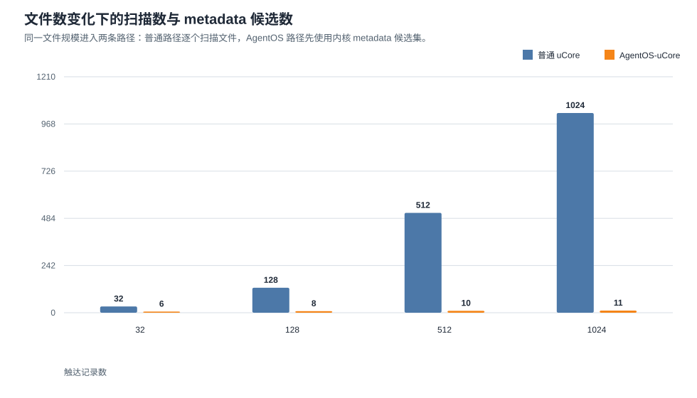
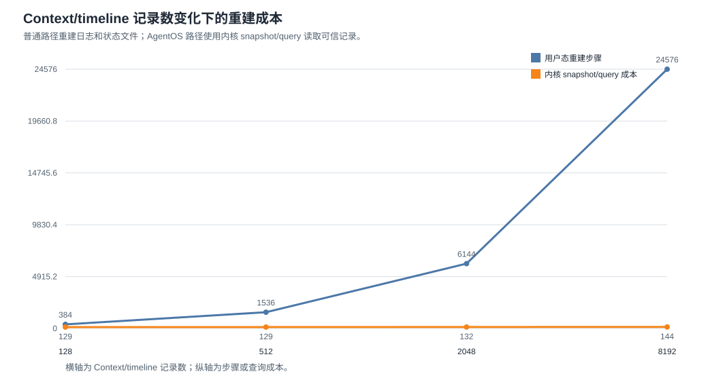
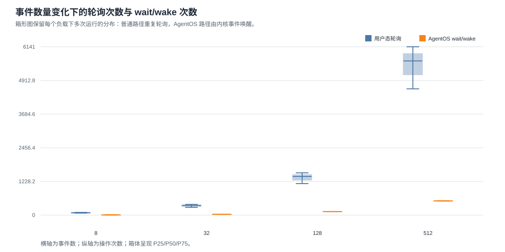
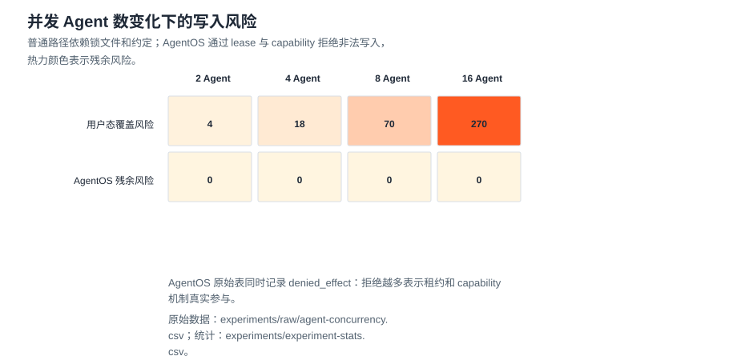
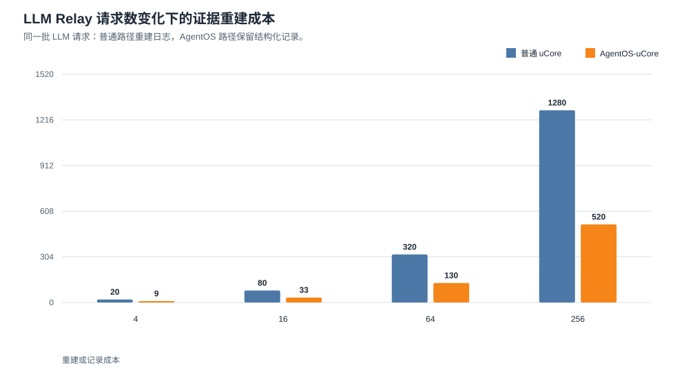
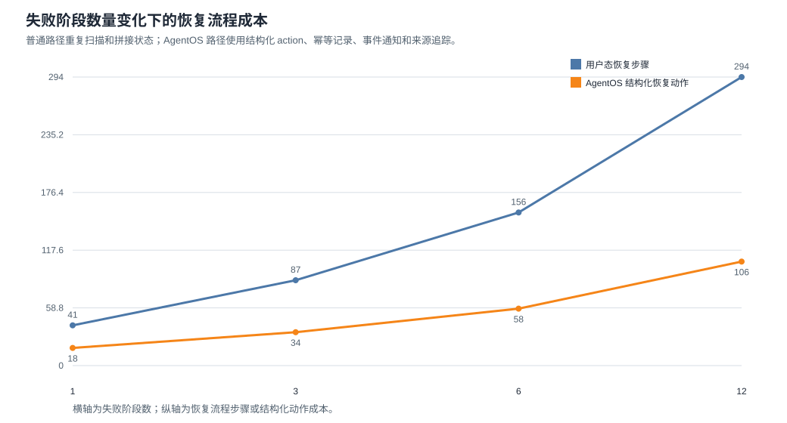
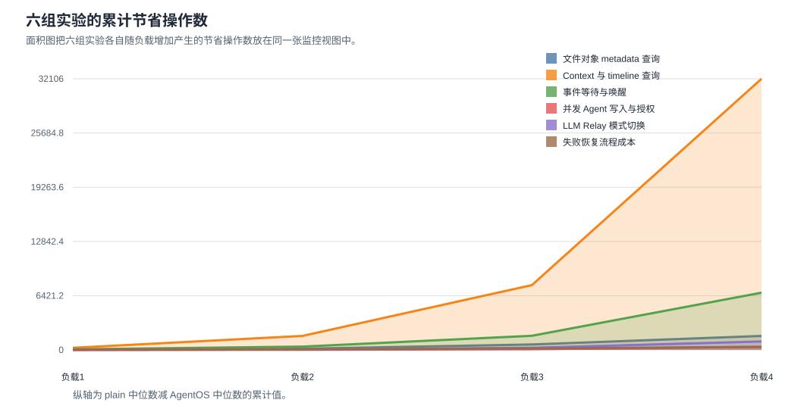

# 双目标 uCore 科研 Agent 平台验证说明

本文档说明如何构建、运行和检查当前项目的两个目标。正文使用中文；命令、程序名、状态字段和运行输出保持原文。

## 构建命令

换机器或刚 clone 仓库后，先检查依赖：

```bash
make doctor
```

Windows 上可以先在 PowerShell 运行：

```powershell
.\scripts\check-windows-prereqs.ps1
```

如果 Ubuntu/WSL 缺少工具链，可以运行：

```bash
bash scripts/install-ubuntu-deps.sh
```

plain target：

```bash
make -C baseline_ucore/user clean
make -C baseline_ucore clean
make -C baseline_ucore user nfs/fs.img TOOLPREFIX=riscv64-linux-gnu- CHAPTER=platform_plain
make -C baseline_ucore build TOOLPREFIX=riscv64-linux-gnu- CHAPTER=platform_plain LOG=warn INIT_PROC=rp_plain
make plain-platform-build TOOLPREFIX=riscv64-linux-gnu-
```

seeded plain target：

```bash
make -C baseline_ucore user nfs/fs.img TOOLPREFIX=riscv64-linux-gnu- CHAPTER=platform_seeded
make -C baseline_ucore build TOOLPREFIX=riscv64-linux-gnu- CHAPTER=platform_seeded LOG=warn INIT_PROC=rp_seed_orch
```

AgentOS 专项构建和测试命令见 [agentos/verification.md](agentos/verification.md)。双目标平台构建由 `make dual-platform-run` 和 `make full-verify` 自动调用。

双目标运行：

```bash
bash scripts/verify-dual-target-structure.sh
make dual-platform-run TOOLPREFIX=riscv64-linux-gnu-
```

`make dual-platform-run` 会在启动 QEMU 前再次执行同一结构检查，避免直接运行双目标时跳过目录职责、平台程序覆盖、源码同步和 backend 证据覆盖检查。脚本随后运行一批代表性 seeded 请求：同一批请求会分别进入 plain uCore 和 AgentOS-uCore，两个平台目标在生成文件系统镜像前会清理用户态编译产物，确保镜像来自当前源码。脚本会复用这次 seeded 双目标运行提取出的 `rp_*` 状态文件，继续执行状态文件对照、状态渲染和 API JSON 检查，不再额外重复跑一轮普通平台 QEMU。

完整验证入口：

```bash
make full-verify TOOLPREFIX=riscv64-linux-gnu-
```

这条命令会按顺序执行：

- 双目标结构检查；
- 宿主机科研 Agent 平台能力对齐检查；
- 宿主机科研 Agent 平台测试主题对齐检查；
- 宿主机 Web/API/action 规模检查；
- 状态渲染与 API JSON 检查；
- 共享基础安全加固、不含 AgentOS 扩展的 uCore 对照平台和 AgentOS-uCore 平台的 QEMU 运行；
- AgentOS 内核专项测试；
- 主目标、Agent 对抗场景和 baseline 的进程生命周期复测；
- 双目标 syscall 公平性和全局文件对象表资源配额复测；
- AgentOS 线程资源域配额、系统保留和跨域调度公平复测。

文件系统 ENOSPC 和显式内核栈预算检查保留在聚合验证之外，分别运行 `make fs-enospc-test` 和 `make kernel-stack-check`；全局文件对象表与线程资源域配额由 `make full-verify` 串联，也可分别运行 `make file-resource-test` 和 `make thread-resource-test`。每次内核构建都会自动执行栈预算分析。

期望最后看到：

```text
[full-verify] all checks passed
```

如果需要指定工具，可以设置 `PYTHON_BIN=...`、`QEMU=...`、`CASE_TIMEOUT=...`。本机 WSL 环境下可直接使用默认 `python3`、`qemu-system-riscv64` 和 `240s` 单项超时时间。

快速目标检查：

```bash
make target-readiness
```

这条命令会执行双目标结构检查和关键 Host 工具单测，不启动 QEMU。它适合在修改文档、脚本、状态渲染逻辑或对照逻辑后快速确认目标关系没有被破坏。内核、用户程序、文件系统镜像或启动流程发生变化时，仍应运行 `make dual-platform-run` 和 AgentOS 专项测试。

## 普通目标验证：plain target

运行目录程序：

```bash
timeout 45s make run TOOLPREFIX=riscv64-linux-gnu- CHAPTER=platform_plain LOG=warn INIT_PROC=rp_plain
```

`make run` 表示用当前构建产物重新安装全新可写镜像；需要重启并保留 `nfs/fs-copy.img` 中的现有数据时使用 `make run-persist`。后者不会因用户程序或磁盘格式变化自动覆盖持久盘，不兼容格式由内核挂载校验明确拒绝。baseline 目录中的同名目标语义一致。

关键输出应包含：

```text
rp_plain summary
catalog_ok=1 checks_ok=1 mature_ok=1 run_ok=1 search_ok=1
rp_plain: passed
```

运行多进程科研平台：

```bash
timeout 45s make plain-platform-run TOOLPREFIX=riscv64-linux-gnu-
```

关键输出应包含：

```text
rp_orch: start programs=70
rp_backend: cases=7 executable=7 userland_equivalent=ready exports=1 status=ready
rp_compare_plain: plain_kernel=passed ...
rp_orch: passed
```

说明：

- `rp_orch` 不是单进程静态表，而是通过普通 `fork/exec/waitpid` 串联多个用户程序。
- `rp_backend`、`rp_backend_exec`、`rp_study`、`rp_agentcmp` 记录 plain target 的用户态成本和 AgentOS 替代目标。
- `rp_realtask`、`rp_artifact_manifest`、`rp_workbench`、`rp_package` 对应真实输入、artifact、workbench、证据包和交付记录。

## 增强目标验证：AgentOS target

运行 AgentOS 科研平台：

```bash
make agentos-platform-run TOOLPREFIX=riscv64-linux-gnu-
```

关键输出应包含：

```text
rp_agentos_orch: passed
rp_backend: cases=8 executable=8 agentos=mainflow_bound exports=1 status=ready
```

AgentOS 运行必须生成或验证以下状态文件：

```text
rp_agentos_kernel
rp_agentos_mainflow
rp_agentos_query
rp_agentos_recovery
rp_agentos_timeline
rp_agentos_collab_ack
rp_agentos_audit
rp_agentos_workbench
rp_agentos_package
rp_agentos_real_task
rp_agentos_conflict
```

其中 `rp_agentos_mainflow` 是增强目标主证据文件，应包含可信 Context、metadata 查询、事件通知、失败恢复、权限拒绝、timeline、ledger/provenance、文件编辑租约、workbench 文件校验、证据包 provenance 和真实任务 Context。

## 双目标验证

先做快速结构检查：

```bash
bash scripts/verify-dual-target-structure.sh
```

期望关键标记：

```text
[dual-target-check] baseline AgentOS surface: absent
[dual-target-check] AgentOS kernel: present
[dual-target-check] platform source coverage: 73 baseline rp sources mirrored
[dual-target-check] platform app coverage: 71 build-list apps mirrored
[dual-target-check] platform source sync: identical=30 adapted=43
[dual-target-check] backend evidence coverage: plain=7 agentos=8 preserved_costs=7
[dual-target-check] platform runners: present
[dual-target-check] docs: wording scan passed
```

这里的 `baseline AgentOS surface: absent` 只表示结构检查没有在 baseline 中发现 Agent syscall、Agent Context、Agent 文件 metadata 或 Agent 事件服务，不表示 `baseline_ucore/` 与上游 uCore 源码逐字相同。baseline 与主目标共享 syscall、同步、文件系统和进程生命周期等通用安全加固。

运行：

```bash
make dual-platform-run TOOLPREFIX=riscv64-linux-gnu-
```

期望关键标记：

```text
[dual-platform] checking target structure
[dual-platform] running seeded dual-target research platform
seeded_action_state: plain start chapter=platform_seeded init=rp_seed_orch action_count=44 log=/tmp/agentos-dual-platform/seeded-action-state/plain/ucore-run.log
seeded_action_state: plain done passed=1 extracted_state_files=258 status=ready
seeded_action_state: agentos start chapter=platform_agentos init=rp_agentos_orch action_count=44 log=/tmp/agentos-dual-platform/seeded-action-state/agentos/ucore-run.log
seeded_action_state: agentos done passed=1 extracted_state_files=271 status=ready
seeded_action_state: action=/actions/research/rerun action_count=44 host_routes=95 seeded_routes=21 seeded_kinds=21 plain=ready agentos=ready status=ready
[dual-platform] plain uCore research platform log: /tmp/agentos-dual-platform/seeded-action-state/plain/ucore-run.log
rp_orch: passed
rp_orch: programs_ok=70 programs_total=70
rp_backend: cases=7 executable=7 userland_equivalent=ready exports=1 status=ready
[dual-platform] AgentOS-uCore research platform log: /tmp/agentos-dual-platform/seeded-action-state/agentos/ucore-run.log
rp_agentos_orch: passed
rp_agentos_orch: kernel_agent=1 workflow=rp_orch status=ready
rp_orch: programs_ok=70 programs_total=70
rp_backend: cases=8 executable=8 agentos=mainflow_bound exports=1 status=ready
[dual-platform] plain extracted state files: 258
[dual-platform] AgentOS extracted state files: 271
host_platform_alignment: host_modules=154 tracked_host_modules=154 plain_sources=73 agentos_sources=74 runtime_state_checked=1 groups_ok=13 groups_total=13 untracked_host_modules=0 status=ready
host_test_alignment: host_tests=142 themes_ok=7 themes_total=7 unclassified_tests=0 runtime_state_checked=1 status=ready
host_action_kind_alignment: action_routes=95 action_kinds=95 generic_routes=0 plain_missing=0 agentos_missing=0 plain_handler_missing=0 agentos_handler_missing=0 status=ready
host_surface_alignment: api_routes=214 action_routes=95 download_refs=76 runtime_state_checked=1 status=ready
dual_platform_state_compare: plain_files=258 agentos_files=271 common_files=258 agentos_extra_files=13 checked_success_records=1244 preserved_plain_costs=7 embedded_action_records=44 run_result_match=1 agentos_evidence_checks=32 agentos_mainflow_stages=11 agentos_mainflow_facts=12 plain_timing_records=70 plain_agent_launches=0 plain_fork_launches=70 agentos_timing_records=70 agentos_agent_launches=9 agentos_fork_launches=61 status=ready
plain_ucore_reader: pages=40 api_json=267 state_files=260 status=ready
plain_ucore_reader: pages=40 api_json=280 state_files=273 status=ready
reader_output_check: pages=40 api_json=267 state_files=260 required_pages=6 spec_pages=40 agentos_compare_markers=0 status=ready
reader_output_check: pages=40 api_json=280 state_files=273 required_pages=6 spec_pages=40 agentos_compare_markers=13 status=ready
dual_platform_reader_compare: plain_pages=40 agentos_pages=40 plain_state_files=260 agentos_state_files=273 agentos_extra_state_files=13 plain_api_json=267 agentos_api_json=280 agentos_extra_api_json=13 checked_pages=40 checked_api_json=267 status=ready
```

这条命令的意义是：用同一批 seeded 请求分别运行共享安全基底的 uCore 对照目标和 AgentOS-uCore 目标，并检查两个目标是否实际跑完同一批科研平台程序、围绕同一设定的模拟流程输出可比较结果。该流程包含数据准备、比对处理、结果分析、报告生成和归档交付；脚本会从两个文件系统镜像中提取 `rp_*` 状态文件，并执行状态文件对照：plain target 产出的状态文件必须全部能在 AgentOS target 中找到；plain target 已经标记为 `ready`、`passed` 或 `ok` 的记录，AgentOS target 必须保留相同记录标识和成功状态。AgentOS target 可以额外增加内核证据文件和内核观测字段，并且 `rp_agentos_mainflow` 必须按平台程序执行顺序写入 11 个内核参与阶段、覆盖 12 类内核事实。随后脚本会把两个目标的真实状态文件交给状态渲染工具，检查 HTML 和 API JSON 能否从同一批 `rp_*` 文件生成，并确认 AgentOS 目标多出的 Context、metadata、事件、ledger、真实任务和文件编辑租约字段可被读取。最后比较渲染摘要，确认两个目标生成同一套结果入口，AgentOS target 的状态产物和 API JSON 不少于 plain target，并直接输出 `agentos_extra_state_files` 与 `agentos_extra_api_json` 说明增强目标多出的内核证据规模。两侧共有的通用安全加固不是本组对照的 AgentOS 增量。

## 结果产物和图表

`make dual-platform-run` 会把原始日志和提取状态保存在 `/tmp/agentos-dual-platform/`，并把面向阅读的汇总材料写入 `results/latest/`：

```text
results/latest/summary.csv
results/latest/runner-sweep.csv
results/latest/experiments/raw/file-metadata.csv
results/latest/experiments/raw/context-timeline.csv
results/latest/experiments/raw/event-loop.csv
results/latest/experiments/raw/agent-concurrency.csv
results/latest/experiments/experiment-stats.csv
results/latest/experiments/mechanism-notes.csv
results/latest/evidence-manifest.csv
results/latest/reader-checklist.csv
results/latest/delivery-readiness.csv
results/latest/test-suite.csv
results/latest/experiment-design.csv
results/latest/reader-guide.html
results/latest/reader-checklist.html
results/latest/delivery-readiness.html
results/latest/test-suite.html
results/latest/experiment-design.html
results/latest/evidence-map.html
results/latest/index.html
results/latest/monitor.html
results/latest/report.md
results/latest/charts/runtime-observation.svg
results/latest/charts/cost-replacement.svg
results/latest/charts/runner-ticks.svg
results/latest/charts/runner-speedup.svg
results/latest/charts/experiment-file-query-bar.svg
results/latest/charts/experiment-context-line.svg
results/latest/charts/experiment-event-box.svg
results/latest/charts/experiment-concurrency-heatmap.svg
results/latest/charts/experiment-monitor-area.svg
```

这些产物分为四类：CSV 保存原始指标和统计结果，HTML 组织运行摘要和实验说明，Markdown 保存可直接阅读的运行报告，SVG 图表由本次运行数据生成。文档中保留一组示例图，数值来自一次完整运行样例，实际运行时以 `results/latest/` 下的新文件为准。

图表生成优先使用 `pandas`、`seaborn` 和 `matplotlib`；如果本机还没有安装这些 Python 包，脚本会使用内置 SVG 路径生成同一组图，原始 CSV 和统计 CSV 不变。六组对照实验分别回答六个问题：文件数增长时是否减少扫描；Context/timeline 记录数增长时是否减少重建；事件数增长时是否减少轮询；并发 Agent 增长时是否降低写入冲突风险；LLM Relay 请求数增长时是否减少跨日志重建；失败阶段数增长时是否降低恢复流程成本。每组实验都有 raw CSV，每个负载有多次运行记录，`experiments/experiment-stats.csv` 统一给出 min、avg、max、P50、P95 和 tick 观测，`experiments/mechanism-notes.csv` 写清普通路径、AgentOS 路径和机制解释。

`host_tools/test_chart_type_data_contract.py` 会生成一组样例结果，检查六个 raw CSV、统一统计表、机制说明表、十一张核心 SVG 和关键 HTML 链接是否一致。`host_tools/test_chart_svg_layout_contract.py` 会解析生成后的 SVG 和文档内提交的示例 SVG，检查文字是否留在画布内，并检查明显的文字框相交问题，避免图表在文档和页面阅读时出现文字压住文字的情况。


这张图把阶段执行、状态产物、内核证据、Agent 启动方式和 QEMU 健康状态放在同一个画面里。查看时可以先用它说明本次双目标测试不是只看 `passed` 标记：测试脚本记录了每个阶段的耗时，核对了普通目标和增强目标的共有结果，也检查了增强目标额外输出的 Context、文件 metadata、事件、timeline、audit 和 provenance 证据。如果图中的超时、无输出提示或阶段状态异常，应回到对应日志定位原因，而不是继续引用本次数据。


这张图读取两个目标的 `rp_backend_exec` 记录。左侧列出普通用户态科研 Agent 平台为了完成同一流程需要承担的成本，例如重建上下文路径、扫描状态文件、使用约定字段表达权限、用锁文件避免并发写入、用轮询观察事件；右侧列出 AgentOS-uCore 在增强目标中实际使用的替代机制，例如内核 Context Path、文件 metadata 索引、capability 检查、事件队列、文件编辑租约、timeline、audit 和 provenance。读图时应逐行检查：同一行左侧说明普通目标的问题来源，右侧说明增强目标的内核机制，最后一列说明该机制处理的工程问题。


这张图继续读取 `rp_backend_exec`，但关注 `runner_case` 中的 `ticks` 字段。普通目标的用户态路径会记录上下文重建、manifest 扫描、文件事件交接、追加日志等动作；增强目标的对应路径会记录 Context snapshot、metadata index、event queue、ledger snapshot 等内核辅助动作。图中蓝色条和橙色条使用同一 QEMU、同一输入、同一科研流程下的相对 tick，不用于说明物理机绝对性能；它用于回答一个更具体的问题：同一类 runner 动作换成 AgentOS 机制后，流程步骤和观测 tick 是否下降。


这张图由 `runner-sweep.csv` 生成。CSV 保留每个场景的 plain case、AgentOS case、两边 tick、节省 tick 和相对倍数；SVG 把这些成组场景按条形图呈现。当前 uCore/QEMU 不适合宣称物理机绝对吞吐，因此这里采用同一输入、同一运行环境、同一科研流程下的相对对照，比较上下文、文件查询、事件交接、恢复动作和审计记录的运行成本。查看时可以先呈现 `runner-ticks.svg` 说明每组数字，再打开 `runner-sweep.csv` 说明图表可以回到原始表格。



这张柱状图使用 `experiments/raw/file-metadata.csv`。横轴是文件数 32、128、512、1024，蓝色表示普通路径触达记录数，橙色表示 AgentOS metadata 候选数。普通路径随文件数线性增长；AgentOS 先按 namespace、type、state 等通用标签缩小候选集，再读取对象摘要。这个实验说明文件对象 metadata 不是装饰字段，而是减少扫描的内核机制。



这张折线图使用 `experiments/raw/context-timeline.csv`。横轴是 Context/timeline 记录数 128、512、2048、8192，纵轴是用户态重建步骤或内核 snapshot/query 成本。普通路径需要从日志、状态文件和事件记录中拼接调用路径；AgentOS 通过内核 shadow Context、timeline cursor 和 snapshot/query 返回可信记录。记录越多，两条路径的差异越清楚。



这张箱形图使用 `experiments/raw/event-loop.csv`。横轴是事件数 8、32、128、512，箱体呈现多次运行的 P25、P50、P75。普通路径用状态文件轮询确认事件是否到达；AgentOS 用 watch、wait、event queue 和 heartbeat 让 Agent 睡眠并由内核唤醒。它直接呈现事件增加后轮询次数与 wait/wake 次数的差异。



这张热力图使用 `experiments/raw/agent-concurrency.csv`。横轴是并发 Agent 数 2、4、8、16，颜色表示残余写入风险。普通用户态路径依赖锁文件和约定字段，Agent 数增加时覆盖风险上升；AgentOS 在内核检查 lease 和 capability，非法写入被拒绝并记录 `denied_effect`。原始 CSV 中保留拒绝次数，便于解释“被拒绝”在这里是保护效果，不是失败。



这张柱状图使用 `experiments/raw/llm-relay.csv`。横轴是 LLM 请求数 4、16、64、256，蓝色表示普通路径为了复原请求状态需要跨日志、状态文件和宿主机转发记录执行的重建步骤，橙色表示 AgentOS 路径保留的结构化请求记录。实验不要求内核直接访问云端模型，而是验证内核能把 LLM 请求、响应摘要、request id、span、预算、超时和完成事件纳入可查询证据。



这张折线图使用 `experiments/raw/recovery-flow.csv`。横轴是失败阶段数 1、3、6、12，纵轴是恢复流程步骤或结构化动作成本。普通路径需要扫描失败状态、查找依赖、重跑阶段、写报告并追加日志；AgentOS 路径把恢复动作拆成可授权、可去重、可追踪的结构化 action，并通过 metadata 更新、事件通知、audit 和 provenance 保留证据。



这张面积图使用六个 raw CSV 和 `experiments/experiment-stats.csv`。它把每组实验中 plain 中位数减 AgentOS 中位数得到的节省操作数按负载顺序累计呈现。它不试图用一个数概括所有性能，而是把“减少扫描、减少重建、减少轮询、降低冲突风险、减少 LLM 请求重建、降低恢复流程成本”放在同一张监控视图里，适合查看时作为实验小结。

报告生成由 `host_tools/summarize_dual_platform_results.py` 完成。该脚本只读取已有运行产物，不重新启动 QEMU，因此可以单独重跑：

```bash
python3 host_tools/summarize_dual_platform_results.py \
  --work-dir /tmp/agentos-dual-platform \
  --out-dir results/latest
```

准备说明视频时，可以在双目标运行结束后直接启动页面服务：

```bash
make reader
```

这个入口会读取 `/tmp/agentos-dual-platform/agentos-state`，检查 `rp_agentos_mainflow` 是否存在，并启动 `http://127.0.0.1:8767/`。如果状态目录不存在，脚本会明确提示先运行 `make dual-platform-run TOOLPREFIX=riscv64-linux-gnu-`；如果 AgentOS 主流程状态缺失，脚本会提示重新运行双目标验证。这样查看时只需要两条命令：第一条生成运行结果，第二条打开本地查看入口。

`results/latest/reader-guide.html` 是运行导览入口，会把两条命令、建议查看顺序、观测面板和关键图表串在一起。`results/latest/monitor.html` 给出运行结果、状态产物、内核证据、启动方式和 QEMU 健康状态，适合在查看开头快速说明本次测试数据是否可信。`make reader` 会把 `results/latest/` 复制到本地服务目录下的 `dual-results/`，并生成 `reader-url-list.txt` 与 `dual-results.html` 运行 URL 清单，同时以 cloud 模式启用 Host LLM Relay 自动刷新。配置本机模型密钥后，LLM action 会生成复核摘要、方法检查、恢复说明、写作摘要、项目复核意见和最终报告摘要，并写入 `rp_llm_conclusions` 以及相关状态文件。

快速结构检查不替代 QEMU 运行。它会检查 `baseline_ucore/` 不包含 AgentOS syscall、Agent Context、内核文件 metadata、Agent 事件队列等增强符号，同时确认根目录 AgentOS 内核、科研平台入口、同名科研平台程序覆盖关系、源码同步关系、backend 成本项保留关系和测试脚本仍然存在。它还会检查 AgentOS 内核源码中没有设定的模拟流程编号、示例项目名、固定阶段 selector、固定失败原因等科研示例常量，保证科研平台仍是用户态负载，不是内核默认业务；旧兼容工具 id 只允许出现在兼容性和权限测试里，平台主流程必须使用 `action_commit`、`artifact_update` 等通用工具。它还会检查 Makefile 和脚本入口关系：`make full-verify` 必须调用完整验证脚本，完整验证脚本必须串起结构检查、状态渲染测试、action runner 测试、文件系统镜像提取测试、LLM relay 测试、LLM Relay 模式契约测试、seeded 双目标 QEMU 和 AgentOS 内核专项测试；`make dual-platform-run` 必须调用双平台脚本；plain target 必须以 `rp_orch` 启动，AgentOS target 必须以 `rp_agentos_orch` 启动。完整功能仍以 `make dual-platform-run` 和 AgentOS 专项测试为准。

LLM Relay 模式契约测试由 `host_tools/test_llm_relay_mode_contract.py` 完成。它构造一个外部密钥文件，验证 Relay 能识别 DeepSeek 默认模型字段，同时确认默认 `auto` 模式在没有外部密钥时使用模板响应；显式模板模式即使存在外部密钥，也不会把密钥内容或密钥文件路径写入任何 `rp_*` 状态文件。这个测试用于保证公开仓库克隆后能离线验证，也保证本机配置云端模型时不会把敏感材料带入 uCore 镜像或文档产物。

宿主机科研 Agent 平台能力对齐检查由 `host_tools/check_host_platform_alignment.py` 完成。它默认读取同级目录 `research-agent-platform-userland`，把其中的工作流、项目工作台、artifact、数据与实验室对象、LLM Relay、多 Agent 协作、provenance、治理、运行控制、复核发布、页面/API 和 AgentOS 对照等核心模块，映射到 `baseline_ucore/` 普通目标与根目录 AgentOS-uCore 的 `rp_*` 程序和状态输出入口。当前本机检查输出为：

```text
host_platform_alignment: host_modules=154 tracked_host_modules=154 plain_sources=73 agentos_sources=74 runtime_state_checked=1 groups_ok=13 groups_total=13 untracked_host_modules=0 status=ready
```

如果公开环境没有仓库外的宿主机平台目录，该检查会输出 `status=skipped`，不影响仓库内双目标验证；在本机开发时应以 `status=ready` 作为宿主机平台和 uCore 迁移层仍保持主要能力对齐的证据。双目标脚本会在提取两个文件系统镜像后再次运行该检查，并传入 `plain-state` 与 `agentos-state` 目录；此时 `runtime_state_checked=1`，表示 13 个能力族都已经在两个目标里产出至少一个真实状态文件。当前宿主机平台的 154 个模块已全部纳入能力族映射，`untracked_host_modules=0`。如果宿主机平台后来新增模块，本机验证会要求先把该模块归入能力族，再判断是否需要增加 uCore 侧程序、状态文件或页面入口。

宿主机科研 Agent 平台测试主题对齐检查由 `host_tools/check_host_test_alignment.py` 完成。它默认读取同级目录 `research-agent-platform-userland/tests/test_platform.py`，把宿主机平台的测试方法归入状态配置、工作流运行、科研工作台、数据与实验室、Agent/LLM/对照、页面/API/交付、provenance/复核/治理等主题，并检查 plain target 与 AgentOS target 的 `rp_test_suite.c` 是否保留对应证据项。当前本机检查输出为：

```text
host_test_alignment: host_tests=142 themes_ok=7 themes_total=7 unclassified_tests=0 runtime_state_checked=1 status=ready
```

`runtime_state_checked=1` 表示检查器已经读取 plain target 与 AgentOS target 在 QEMU 运行后抽取出的 `rp_tests` 状态文件，并确认七类测试主题都由运行时状态给出证据。

如果宿主机平台新增测试方法，而测试名称无法归入现有主题，本机验证会显示 `unclassified_tests` 大于 0。此时应先判断新增测试代表的新能力是否已经迁移到两个 uCore 目标；如果没有，需要补充对应 `rp_*` 程序、状态文件、状态查看入口或 AgentOS 内核使用路径。

宿主机 action kind 对齐检查由 `host_tools/check_host_action_kind_alignment.py` 完成。它读取宿主机 `api_server.py` 里的 `/actions/...` 路由，用 `plain_ucore_action_runner.py` 的映射函数转换成 seed kind，再检查 plain target 与 AgentOS target 的用户态源码中是否都有对应 `kind=...` 处理。检查器还会排除 `rp_compare_plain.c`、`rp_test_suite.c` 这类只负责验证的文件，要求每个 kind 至少出现在一个真实运行程序里。当前本机检查输出为：

```text
host_action_kind_alignment: action_routes=95 action_kinds=95 generic_routes=0 plain_missing=0 agentos_missing=0 plain_handler_missing=0 agentos_handler_missing=0 status=ready
```

这项检查用于发现“路由数量已经跟上，但 uCore seed 路径没有真正处理某个 action”的问题。例如宿主机提供 `/actions/research/rerun` 时，两个 uCore 目标都应当能接收 `kind=research_rerun`，并在 `rp_input`、`rp_runner`、`rp_report_text` 或相关状态文件中留下可读结果。

预置 action 状态检查由 `host_tools/check_seeded_action_state.py` 完成。它构造 44 个代表性宿主机请求，以 `/actions/research/rerun` 为主，同时覆盖研究输入、证据处理、artifact 输入与派生、Host workflow 主流程和阶段动作、LLM Relay 请求与返回、workbench 文件校验、数据集操作、项目生命周期、研究协议、项目复核、workflow 可移植性和 AgentCompare；随后分别运行 plain uCore 与 AgentOS-uCore 的预置入口，并从两个文件系统镜像中检查 `rp_input`、`rp_runner`、`rp_report_text`、`rp_artifact_manifest`、`rp_stage_dag`、`rp_llm_packets`、`rp_wfio`、`rp_usableproj`、`rp_studyproto` 等状态文件是否都写入同一组关键状态。该脚本还会读取宿主机 action 路由，报告 `host_routes`、`seeded_routes` 和 `seeded_kinds`：前者表示宿主机 action 路由总数，后两者表示 44 个实跑请求中能与当前宿主机 API 路由逐字对应的路由和 kind 数量；其余实跑请求是 uCore 迁移层保留的代表性样本，会作为 `seeded_extra_routes` 写入渲染摘要。`make dual-platform-run` 直接复用这次检查得到的镜像提取目录作为状态对照和渲染输入，因此它也是双目标主运行路径。当前期望输出为：

```text
seeded_action_state: action=/actions/research/rerun action_count=44 host_routes=95 seeded_routes=21 seeded_kinds=21 plain=ready agentos=ready status=ready
```

这项检查补充了 action kind 检查：action kind 检查回答“源码是否有对应处理”，预置 action 状态检查回答“代表性宿主机请求进入 QEMU 后是否真的产生可读结果”。当前批次以 rerun action 作为主线，因为它会同时影响输入、运行器、报告文本和 artifact manifest；其余请求用于覆盖数据、证据、artifact、workflow、LLM、workbench、项目生命周期、研究协议、项目复核和可移植性状态，避免只验证单一路径。未进入 QEMU 实跑的宿主机 action 仍由 action kind 检查约束源码处理路径；如果某个新路由需要成为示例主证据，应加入预置请求，并补充对应状态文件断言。

宿主机 Web/API/action 规模检查由 `host_tools/check_host_surface_alignment.py` 完成。它直接读取仓库外宿主机平台的 `agent_platform/api_server.py`，统计显式 API 路由、action 路由和下载引用数量，再检查 `baseline_ucore/` 普通目标与根目录 AgentOS-uCore 的 `rp_web_export.c` 和双目标运行状态文件是否保留对应规模。当前本机检查输出为：

```text
host_surface_alignment: api_routes=214 action_routes=95 download_refs=76 runtime_state_checked=1 status=ready
```

如果宿主机平台新增 API 或 action，本机验证会要求更新两个 uCore 目标的状态输出和状态查看入口。该检查关注平台能力是否在迁移层保留，不要求把宿主机 Python Web 服务复制进 uCore 镜像。

## AgentOS 专项验证

增强目标的内核机制还需要单独运行专项脚本：

```bash
TOOLPREFIX=riscv64-linux-gnu- QEMU=qemu-system-riscv64 CASE_TIMEOUT=240s bash scripts/run-agent-tests.sh
```

期望关键标记：

```text
agentfinal_ucore: parent passed
agentfs_ucore: parent passed
agentscan_ucore: parent passed
agentloop_ucore: parent passed
agentsched_ucore: parent passed
agentconflict_ucore: parent passed
agentllm_ucore: parent passed
agentbench_ucore: parent passed
labbench_ucore: parent passed
labdemo_ucore: parent passed
agentsecurity_ucore: parent passed
agentscope_ucore: metadata_write_coalescing=1 writes=<at-least-128> commits=<bounded>
agentscope_ucore: metadata_cross_scope_progress=1 queries=32 latency_ms=<at-most-5000>
agentscope_ucore: metadata_final_consistency=1
agentscope_ucore: metadata_volatile_no_writeback=1 writes=32
agentscope_ucore: metadata_scan_pressure_bounded=1
agentscope_ucore: parent passed
agenttrust_ucore: parent passed
agentvfs_ucore: parent passed
usersafety_ucore: parent passed
[agent-tests] all Agent-OS uCore checks passed
```

这组测试覆盖 Agent Context、结构化工具调用、Context Path、真实文件 metadata、按 scope 合并写回、volatile 写回分流、满表扫描限流、跨 workflow 查询时限、根目录自动扫描、Agent 事件队列、Agent 调度、文件编辑租约、LLM Relay 模板路径、性能观测、综合示例和权限限制。

## 状态渲染验证

状态渲染工具将 `rp_*` 状态文件渲染成浏览器入口和 API JSON。

常用检查：

```bash
python host_tools/test_plain_ucore_reader.py
python host_tools/test_plain_ucore_reader_e2e.py
```

检查重点：

- 两个目标的状态文件都能生成同一组查看入口和 API JSON；
- `rp_agentos_mainflow`、`rp_agentos_*`、Context、metadata、事件、ledger、文件编辑租约等增强目标字段可被读取；
- API JSON 可以解析，关键字段和状态文件保持一致；
- 状态渲染工具只读取 QEMU 产物，不替代内核专项测试。

## 安全与资源专项复测

安全修复按机制约束分别验证，不能只用结构扫描或科研平台页面代替：

```bash
# Agent 权限、可信映像、VFS 域、调度公平和 syscall 用户输入防护
bash scripts/run-agent-tests.sh

# 主目标、Agent 对抗场景和 baseline 的退出、等待、回收与进程域配额
make proc-reap-test TOOLPREFIX=riscv64-linux-gnu-

# 双目标全局 filepool 的资源域上限、普通水位、系统保留和最终引用退款
make file-resource-test TOOLPREFIX=riscv64-linux-gnu-

# 双目标真实 ENOSPC、持久 PUBLIC principal，以及 AgentOS 分级保留量
make fs-enospc-test TOOLPREFIX=riscv64-linux-gnu-

# 16 KiB 内核栈、4 KiB guard 和构建期调用图预算
make kernel-stack-check TOOLPREFIX=riscv64-linux-gnu-
make -C baseline_ucore kernel-stack-check TOOLPREFIX=riscv64-linux-gnu-
```

`run-agent-tests.sh` 中的 `agentsecurity_ucore`、`agenttrust_ucore`、`agentvfs_ucore` 和 `usersafety_ucore` 分别覆盖事件与角色授权、可信映像和 W^X、普通 VFS 绕过及坏用户指针。`run-proc-reap-tests.sh` 覆盖定向取消、阻塞 syscall 临时引用释放、孤儿回收、child record、长存活 fork bomb 和 Agent 保留槽。`run-file-resource-tests.sh` 用双目标同一个 `fileresource_ucore` 和 64/48/16/16 配置，验证阻塞 syscall pin 在原 FD 关闭后仍计费、每域上限、pipe 部分分配回滚、普通全局水位、reserved 进展及退出后的最终退款；本次独立运行已输出 AgentOS、baseline 和 `[file-resource] both targets passed`。`run-fs-enospc-tests.sh` 先保留两个目标的物理 ENOSPC 复测，再运行 AgentOS `fsquota_ucore` 的低主体上限和高水位两组配置：前者验证运行期累计及释放复用，后者确保 PUBLIC 压力下 workflow 文件和内核 `.agentmeta` 仍可写入。随后两个目标各用同一磁盘镜像连续运行三次 `fspquota_ucore`：第一轮在文件已 unlink 但描述符仍打开时强制断电；第二轮验证挂载回收孤儿后，让 PUBLIC 接管含间接块的 SYSTEM 赞助对象并使进程域满额退出；第三轮验证 qmap/dinode 重建计数、新进程域和重启都不能清零、删除后才可复用。聚合脚本已串联 Agent、进程生命周期、syscall 公平性和 filepool 专项，但本次没有运行 `make full-verify`；文件系统专项仍不在聚合脚本中。内核栈预算在每次 kernel build 时自动执行，也可用以上命令单独复现。完整机制和失败语义见 [agentos/security-hardening.md](agentos/security-hardening.md)。

## 内核机制说明

功能呈现应和内核实现对应起来。以下七项按赛题要求整理，便于检查设计是否落在真实内核路径上。

1. 启动、trap、中断、syscall、上下文切换。

   代码位置：`baseline_ucore/os/entry.S`、`baseline_ucore/os/proc.c`、`baseline_ucore/os/trap.c`、`baseline_ucore/os/syscall.c`、`baseline_ucore/os/timer.c`，以及根目录 `os/` 下对应增强实现。

   相关处理：QEMU 进入 RISC-V 内核后，`INIT_PROC` 成为用户态入口。用户态通过 `a7` 和 `a0..a5` 发起 syscall，trapframe 保存用户寄存器，`scheduler()`、`sched()`、`yield()` 完成上下文切换。`rp_plain`、`rp_orch`、`rp_seed_orch`、`rp_agentos_orch` 都通过这一路径运行。

2. 进程、线程、调度、`fork`、`exec`、`wait`。

   代码位置：`os/proc.c`、`os/loader.c`、`os/syscall.c`。

   相关处理：plain target 中 `rp_orch` 启动并等待多个角色程序，覆盖 `fork()`、`exec()`、`wait()`、`exit()`、trapframe 复制、用户栈参数布置和文件描述符继承。AgentOS target 在同一进程模型上增加 Agent role、capability、Context 和调度记录。

3. 虚拟内存、地址空间、地址翻译、页表、缺页处理、权限检查。

   代码位置：`baseline_ucore/os/vm.c`、`baseline_ucore/os/proc.c`、`baseline_ucore/os/loader.c`、`baseline_ucore/os/trap.c`、`os/agent.c`。

   相关处理：syscall 访问用户地址时使用 `copyin()`、`copyout()`、`copyinstr()`；`uvmcopy()` 服务 `fork()`；`exec()` 替换地址空间。增强目标按可信映像布局建立 RX 代码页、RW+NX 数据页；Agent Context 的可信历史由内核 shadow 状态维护，用户可见镜像不能伪造可信记录。

4. 文件系统、目录、文件描述符、pipe、设备文件和文件抽象。

   代码位置：`os/fs.c`、`os/file.c`、`os/pipe.c`、`os/console.c`、`os/virtio_disk.c`。

   相关处理：plain target 的科研状态都通过普通文件保存，覆盖 inode、目录项、file table、fd、read/write/close、pipe、console、virtio block 和文件系统镜像。增强目标把 metadata 绑定到真实 `dev/inum/incarnation`，并通过 `.agentmeta`、digest cache、VFS 安全域和 edit lease 连接 Agent 记录与真实文件活动。

5. Linux/RISC-V syscall ABI、参数、返回值、错误处理。

   代码位置：`baseline_ucore/os/syscall_ids.h`、`baseline_ucore/os/syscall.c`、根目录 `os/syscall_ids.h`、`os/syscall.c` 和用户态 syscall wrapper。

   相关处理：syscall id、参数寄存器、返回寄存器、用户指针复制、错误返回共同决定 syscall ABI。增强目标的工具调用在产生副作用前校验 tool id/name、参数类型、payload、输出缓冲区和权限，错误请求不能污染 Context、metadata、mailbox 或 ledger。

6. 并发同步、资源管理、死锁处理、竞态处理、用户态/内核态隔离。

   代码位置：`baseline_ucore/os/sync.c`、`baseline_ucore/os/sync.h`、`baseline_ucore/os/proc.c`、`baseline_ucore/os/file.c`、`baseline_ucore/os/fs.c`、`os/agent.c`、`os/agent.h`。

   相关处理：进程、线程、文件、inode、pipe、buffer、mutex、semaphore、condvar 都有各自的生命周期和同步规则。plain target 暴露用户态约定的局限；AgentOS target 将 role/capability、Context、事件队列、wait/wake、heartbeat、metadata、edit lease、timeline、ledger 放入内核状态，由内核根据真实状态判断。

7. QEMU、RISC-V、设备适配和行为一致性。

   代码位置：`os/riscv.h`、`os/sbi.c`、`os/sbi.h`、`os/timer.c`、`os/virtio.h`、`os/virtio_disk.c`、`os/bio.c`。

   相关处理：两个目标使用同一 RISC-V QEMU、SBI、timer、trap、virtio block 和文件系统镜像形态，因此比较重点是内核 Agent 支持差异，而不是平台差异。如果迁移到真实硬件，应优先检查 SBI、timer、中断、内存布局和块设备驱动。

## 最终检查重点

最终材料至少应呈现：

- `baseline_ucore/` 保持共享通用安全加固、不含 AgentOS 专属服务的对照目标职责。
- 根目录 `os/`、`user/` 和 `scripts/` 提供 AgentOS-uCore 增强目标。
- plain target 能运行完整科研 Agent 平台并输出可读状态文件。
- AgentOS target 能运行等价科研流程，并让关键阶段依赖内核 Agent 服务。
- 状态查看入口能呈现两个目标的差异。
- 文档能把功能呈现对应到内核机制，而不是只描述用户态应用。

## 暂停验证说明

如果当前有其他编辑者正在修改根目录 AgentOS 源码，可以先暂停构建和 QEMU 运行，只做静态文档和状态渲染对齐。提交前仍需要重新运行双目标构建、QEMU 路径和状态渲染检查。
